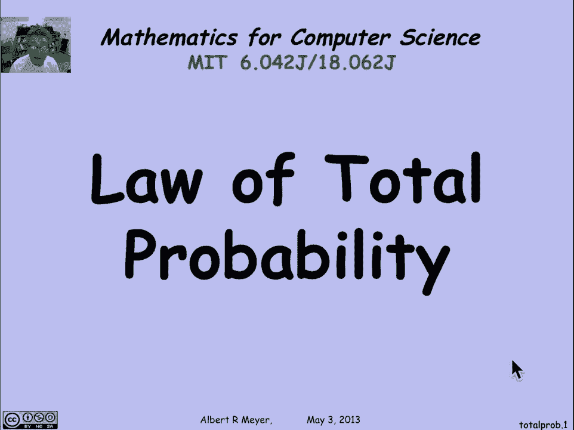

# 【双语字幕+资料下载】MIT 6.042J ｜ 计算机科学的数学基础(2015·完整版) - P88：L4.2.3- Law of Total Probability - ShowMeAI - BV1o64y1a7gT

总概率定律是另一个概率定律，它给了你一种推理案例的方法。

我们已经看到这是处理各种问题的基本技术，所以案件的重点，当然，你可以通过把它分解为。

如果你幸运的话，简单的子案例，下面是理解总概率定律的方法，抽象地，它从集合论推理开始，假设我在一个更大的样本空间中嵌入了一个集合A，所以A真的是一个事件，但我们现在就把它当成一个布景，假设我有三套。

b一，划分样本空间的b 2和b 3，那是B一，b二和b三，不要重叠他们的不相交。

所有东西都在这三套中的一套，所以有一张B1的照片，b二和b三，切割用正方形或矩形表示的整个样本空间，好了，现在，当然啦，这三套把整个空间都切开了，我不管三七二十一地把布景切成了三块。

第一步法a中b中的点，第二块是a中b中的点，第三个是a中b中的点。

这就是为什么我们得到了一个基本的集合论恒等式，上面说只要B一，b2和b3的性质是它们的结合是宇宙，一切嗯，它们是成对不相交的，则任何集合A等于，a在b中的部分的并集，b中a的部分，a在b中的部分。

这是一个不相交的结合，因为B不重叠，这意味着如果我说的是基数，我可以把它们加起来，但就概率而言，我可以应用概率的和法则，并发现A的概率只是在一个十字路口的概率，两个交叉点三个交叉点。

现在总概率定律最有用的形式是当你把这个交集，b条件概率的一个交集a，使用产品规则，所以让我们用给定的B 1的概率来代替它，乘以B1的概率，这是另一个公式。

如果我和其他人一起这么做，我现在有了总概率定律，以通常的方式陈述，根据条件概率，现在最有用的地方，我做了三套。

但它显然适用于任何有限数量的集合，事实上，它适用于任何可数集的并集，如果我有样本空间的分区，s变成b，B 1以此类推，具有可数块数的分区，那么A的概率仍然是和规则相等的，这些不相交的碎片的概率。

在分区的每个不同块中的部分，并将其重新表述为条件概率，我得到一个规则，a的概率是所有可能的和，给定b i的概率乘以b i的概率，基本规则是，我们会得到很多里程，当我们进入下一个片段时。

