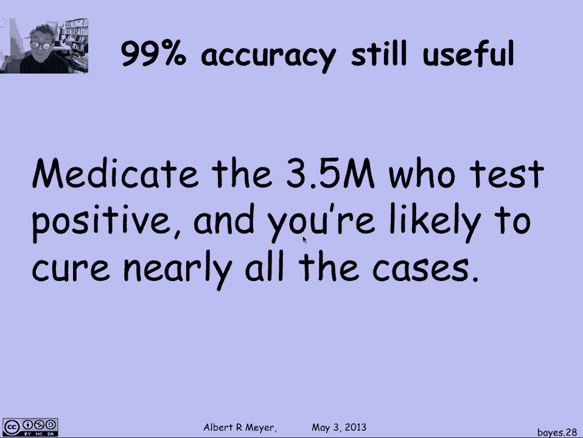

# 【双语字幕+资料下载】MIT 6.042J ｜ 计算机科学的数学基础(2015·完整版) - P89：L4.2.5- Bayes' Theorem - ShowMeAI - BV1o64y1a7gT

条件概率最重要的应用之一是，不确定可靠性诊断试验结果的分析，所以让我们看一个基本的例子，假设我有肺结核的诊断测试，听起来真的很棒，因为它将有99%的准确率，事实上，超过99%的准确性。

因为这里是这个测试的属性，如果你有结核病，这个测试保证能检测到它并说是，你得了肺结核，如果你没有结核病，百分之九十九的时间，测试正确地表明你没有肺结核，百分之一的时间它弄错了，现在假设医生给你做了测试。

测试出现了，说你得了肺结核，这有点可怕，因为电视是一种相当严重的疾病，情况越来越糟，因为有所有这些抗生素耐药性的结核病，现在在亚洲，所有已知的抗生素都不是很有效，如果有效的话，在治愈它的时候。

这个测试有99%的准确率，说我得了这种病，听起来真的很令人担忧，但事实上我们可以从技术上问，你真的应该担心，这个显然非常精确的测试显示你患有结核病的概率是多少。

你得结核病的可能性有多大，这就是我们要计算的，你得到它的可能性有多大？所以说，换句话说，我想要那个的条件概率，我得了肺结核，鉴于测试呈阳性，测试说是的，你有电视，那个测试呈阳性是个很大的词。

我在其他幻灯片上没有空间，所以让我们把它缩写为，加号加号在绿色中表示测试说是，你得了肺结核，好的，这就是我们试图计算条件概率的概率，我们对测试了解多少，让我们翻译一下我们所掌握的关于测试的信息。

变成条件概率的语言，我们说的第一件事是测试保证会正确，如果你有结核病，所以考虑到你有结核病，测试会这么说它会回来的概率，一个积极的结果是一个，好的，鉴于你没有结核病，测试显示你确实患有结核病的概率。

只有百分之一，因为百分之九十九的时间，它正确地说你没有结核病，百分之一的时间，上面写着，哎呀，你确实有结核病，这就是所谓的假阳性率，这是错误地声称你有结核病，而你真的没有，我们假设的比率现在只有1%。

我们再次试图计算的是你患结核病的概率，鉴于测试呈阳性，并说你患有结核病，让我们看看条件概率的定义，你得结核病的概率，鉴于测试呈阳性，那说你做的简直就是啊，测试呈阳性和你得了结核病的可能性。

除以测试进入正井的概率，再次使用条件概率的定义，这个交点，这一点，结核病和测试呈阳性，只是测试呈阳性的概率，考虑到你有肺结核的时候，你现在得结核病的概率，我们知道这是一个，因为测试是完美的。

如果你有结核病，测试肯定会说阳性，所以这让我很好地简化了事情，我刚发现你得肺结核的可能性，假设测试说你有，只是，在没有其他信息的情况下，你患结核病的概率。

测试结果呈阳性的概率。

测试呈阳性的概率是多少，我们将如何计算出这是这里未知的关键，嗯，我们将使用概率规则，总概率规则，总概率说你有，或者你没有结核病，所以计算测试呈阳性概率的方法，就是看看测试呈阳性的概率。

当你有结核病和没有结核病的时候，我们知道这些数字，所以让我们看看总概率公式，测试呈阳性的概率就是它呈阳性的概率，如果你有结核病乘以你有结核病的概率，加上它呈正的概率，考虑到你没有结核病时间。

你没有结核病的可能性，我们知道很多这些术语，让我们把它们解决好，测试呈阳性的概率，考虑到你有结核病是一个，测试呈阳性的概率，考虑到你没有结核病是一个，一百，那是假阳性率，我们已经想到了。

你没有结核病的概率呢，嗯，那只是一个，减去你有TP的概率，现在我有一个很好的算术公式，关于结核病的概率，所以我最终和，嗯，减去结核病概率的百分之一，它留给我百分之一，加上百分之九十九的结核病。

所以这就简化了测试呈阳性的概率，没有其他信息，是一个人患结核病加1的概率的百分之九十九，百分之一我们会回到这个公式，我们正在做的，你得结核病的可能性在测试中呈阳性，我们发现是这个商。

现在我知道分母是什么了，分母是99100倍，结核病的概率加上百分之一的倍数，你得到了，你得结核病的概率是测试结果的一百倍，你得结核病的概率除以99倍，你得结核病的概率加一，所以让我们保持这个公式。

注意这里未知的关键是你得结核病的概率与测试无关，人群中随机一个人患有结核病的概率，如果我们能弄清楚，或者如果我们能查到，那么我们就知道这个未知的，是你得结核病的概率，因为测试说你做得很好，美国的一个人。

一个随机的人得了结核病，嗯，在2011年报告了一万一千例结核病病例，根据美国疾病控制中心的数据，你可以假设会有很多未报告的病例，如果有一万一千个报告，因为很多人甚至不知道他们得了这种病，嗯。

所以让我们在此基础上估计，鉴于美国人口约3。5亿，十亿一百万，患结核病的概率约为万分之一，让我们把它插入我们的公式，根据测试，你患结核病的概率是阳性的，这个公式，当我为结核病插上万分之一的电源时，1。

我得一百分，满分一万分，九十九超过一万，加一个，现在我可以看到分母本质上是1，是1点0 1，分子是百分之一，这基本上是百分之一，换句话说，你不太可能得肺结核，因为假阳性率相对较高，为1%。

假阳性率冲掉了结核病病例的实际数量，结核病发病率仅为零点，百分之一，所以几乎所有的结核病报告都是由高假阳性率引起的，这意味着当你有报告说你得了结核病，你仍然只有百分之一的机会真正得了结核病。

所以99%的准确率测试在这里对你来说并不是很有用，采取什么样的行动，采取什么样的药物或治疗，鉴于测试呈阳性，百分之一的机会，你很可能什么也不做，在这种情况下，你可能会想，你的医生为什么给你做这个检查呢。

百分之九十九的测试听起来不错，我们发现这不是，以及为什么99%的准确性，不是真的那么有用，有一个明显的测试，那是九十九点，九，9%的准确率，什么测试总是说不，毕竟概率只有万分之一，你会错的。

这是九十九点，百分之九十九的比率，所以听起来这个测试真的一文不值，但没有，如果你稍微想一想就不是了，哦，它会的，会很有用的，我马上解释我忘了，我太超前了，因为我们用的基本公式，我们算出了结核病的概率。

因为测试说你得了结核病，根据逆概率，我们知道这是测试呈阳性的概率，考虑到你得了结核病，这是概率论中一个著名规则的例子，被称为贝叶斯规则或贝叶斯定律，这只是用任意事件的术语来陈述，a和b。

它用给定b的概率来表示给定a的b的概率，分别是A和B的概率现在我已经记不清这条定律了，但每次我需要做的时候我都会得到它，就像我们在前面的幻灯片中所做的那样，这确实是一个相当简单的定律来推导和证明。

但让我们回到这个99%的准确率测试，这个测试似乎毫无价值，因为有一个微不足道的测试是99分，9%的准确率，但事实上它真的很有帮助，因为它确实增加了你患结核病的可能性100倍，在你参加考试之前。

在你知道任何事情之前，你认为你的概率是一样的，因为其他人大约是万分之一，现在测试显示你得肺结核的概率是百分之一，那是一百倍大，那有什么价值，嗯，假设你只有五百万剂药物可以治疗，这个三亿五千万的美国人口。

你应该给谁用药，如果你随机给一个，三亿五千万人中有五百万人，你进去的可能性，很多真正的结核病病例都很小，大约只有三十分之一，你只能得到一个左右，三十个案子。

但是如果你用你的500万剂来治疗三点，五百万人在这个99%的准确率测试下检测呈阳性，当你测试所有3。5亿人，你会得到大约350万检测呈阳性的人，你有足够的药物治疗他们所有人，如果你治疗他们所有人。

你几乎肯定会得到所有实际的结核病病例，他们一万人，所以99%的准确率测试在最后的设置中确实有重要的用途，比九十九点多得多。

