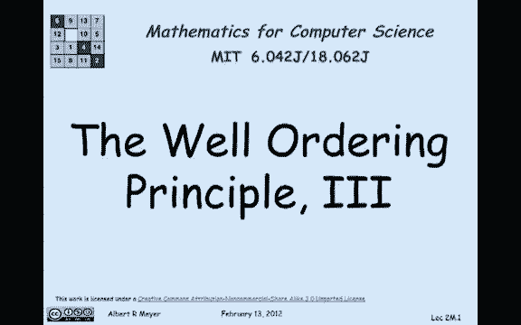
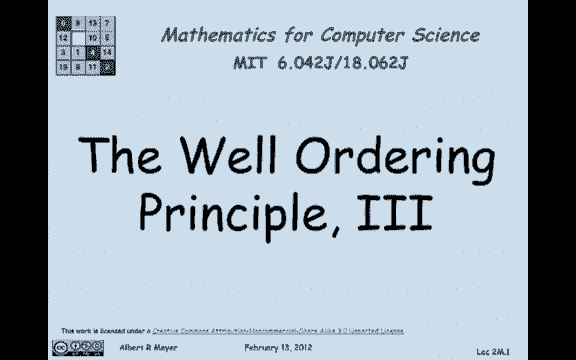
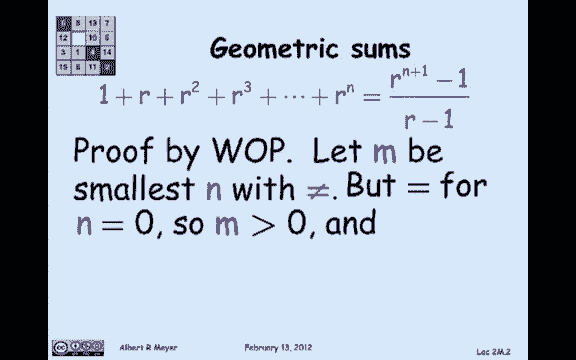
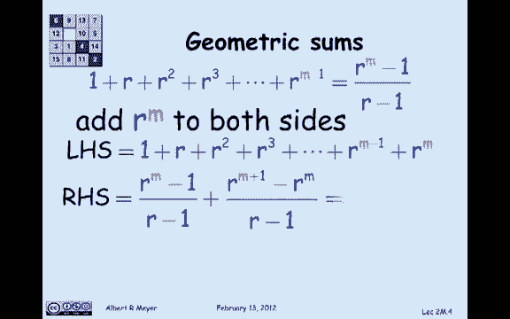
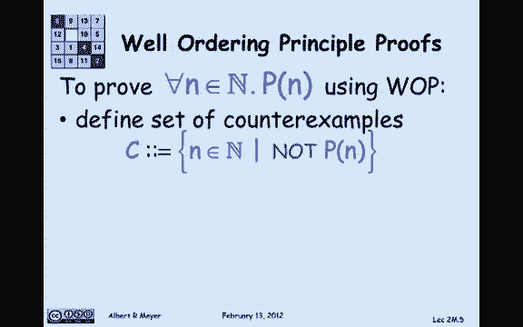

# 【双语字幕+资料下载】MIT 6.042J ｜ 计算机科学的数学基础(2015·完整版) - P8：L1.3.5- Well Ordering Principle3 - ShowMeAI - BV1o64y1a7gT

让我们看一下应用井序原理的最后一个例子，这一次我们真正关心的事情。

一个确实需要一些。

这个定理是下面关于几何和之和的著名公式，对于几何级数，或者几何和，所以左边的数字，从r到0的1开始的r的幂，后面跟着R，它是R的1，然后是r的平方通过r的n次方，你把所有这些数字加起来，事实证明。

有一个很好的简单的固定公式，里面没有那三个点，它准确地告诉你公式中的和的值，就像你可以读到的那样，r对n，加一减一是分子，r减1是分母，这个恒等式对所有非负整数都成立，对于所有不是1的实数。

因为我不希望分母如此，我们怎么才能很好地证明这一点，我要用井序原理来证明这一点，让我们假设这个身份不适用于一些非，负整数n，所以我们将应用井序原则，设m为最小的数n，如果此相等失败，就变成了不平等。

现在我对M的了解是，这种平等，如果你在n为零时看它，左边归结为r到0或1，右手边，如果你检查它是r-1除以r-1，也是一个，所以当n为零时，等式成立，这意味着不成立的最小m，必须是积极的。

所以我们所知道的关于这个等式失败的最小数，它是积极的，这特别意味着。

因为它是最少失败的一个单词，如果你从1到m减去1，平等成立，所以我们可以假设r的前m次方之和，从零开始到r结束到m减一等于公式，在这里你插入m减去n的1，你得到右边的公式，我不打算读给你听。

我们可以把它简化一点，如果你看m的指数r减去一加一，毕竟R到M，所以说，如此重复，我有什么，从r到m的次幂之和，我们可以假设等于公式r减去m，除以r-1，因为我失败了，这是它必须成功的第一课。

所以现在我们采取明显的策略，我感兴趣的是，从r到m的一些幂，现在左手边是r到m的幂，所以有一个明显的策略把左手边变成什么，我对…感兴趣，也就是说，让我们把r加到两边的m上，所以左手边就变成了我想要的和。

右手边就变成了这个乱七八糟的东西，r到m减去1/r减去1，加r到m井，让我们简化一点，让我们把r加到m a，把它放在分母r-1上，我把它乘以r-1，结果是r等于m加1，减去r到m/r减去1，我收集条款。

看看我得到了什么。

我得到了m加1的公式r，负1/r负1，这意味着我最初声称的身份，事实上持有它，反驳了它在M不成立的断言，换句话说，我们达成了一个矛盾，假设至少有一个地方平等失败了，这意味着没有反例，对于所有非负整数。

相等性都成立，n，下面是井序证明的一般组织，我们一直在用，让我们总结一下，变成一种证明事物的模板，所以你的想法是有一些财产，非负整数n的p，你想证明的是，它对每个非负整数都成立。

所以对于所有非负整数中的n，n的p保持，我们将试图用井序原理来证明这一点，这意味着我们要定义一组数字，对于p不成立的，这是一组反例，并调用c，所以c是非负整数的集合，根据井序原理。

p of n现在不成立。

必须有一个最小元素，叫它M在C里，在这一点上，通过假设M是最小的反例来完成这项工作，我们必须以某种方式达成一个矛盾，呃，第二颗子弹，这是模板，但第三个子弹是数学，真正的数学开始，再也没有模板了。

你如何得出一个矛盾是通过推理n的p的性质，没有简单的食谱，但是矛盾的通常组织是两种之一，你会发现一个反例，比m小，你发现一个C，这是在一组反例中，c小于m，那将是一个矛盾，因为m是c中最小的东西。

或者你通过证明p对m成立而得到一个矛盾，这意味着它不是一个反例，这是组织一口井的两种标准方法。