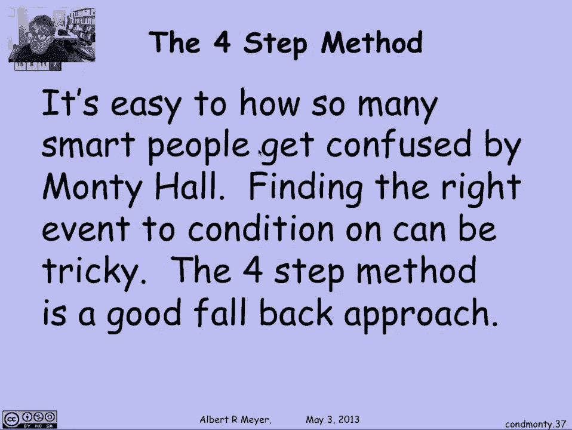
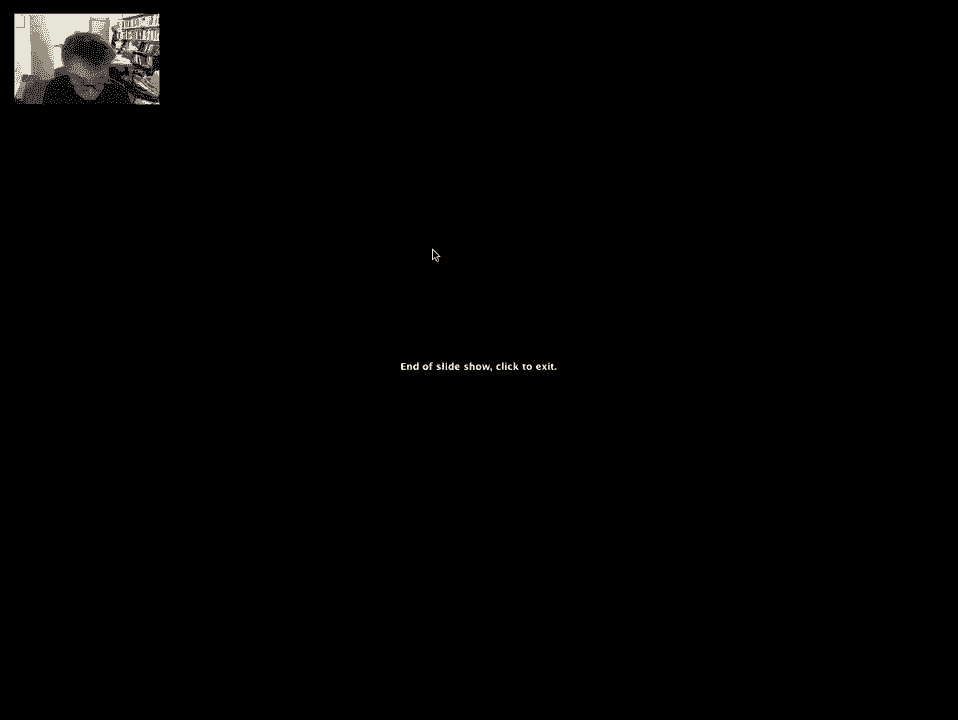

# 【双语字幕+资料下载】MIT 6.042J ｜ 计算机科学的数学基础(2015·完整版) - P90：L4.2.7- Monty Hall Problem - ShowMeAI - BV1o64y1a7gT

now conditional probability will let us，explain a lot of the confused arguments。

that people brought up about Monty Hall，and we'll see that it is a little bit。

confusing and where there are some，correct sounding arguments that give you。

the wrong answer so let's go back and，look at our Monty Hall tree that allowed。

us to derive the sample space in，probability space for the whole process。

of the content the prize being placed in，the contestant picking a door and Carol。

opening a door now this tree was way，more complicated than we needed if what。

we weren't trying to do was figure out，the probability of winning if you switch。

but having the tree will allow us to，discuss a whole bunch of other events。

and their probabilities that will get us，a grip on some of the arguments that。

gave the wrong answer so let's look at，the event first of all that the goat is。

a - now this is the branch where the，prize is it - and so on all the other。

branches the goat is it - which means，that we have these eight of the twelve。

outcomes in the event goat is it - now，let's also look at the event that the。

prize is at one that's just this branch，of the tree okay，so one of the arguments is that when the。

contestant is at the point where they've，seen that the open door and they're。

trying to decide whether it's tickets or，switch um，they know that the goat is at door to。

say without loss of generality that that，was the door that they got to look at。

behind with it Carol open and so we want，to ask the probability a given that he。

picked one what's the probability that，the prize is at 1 given that the goat is。

it - that means that if you're at door 1，then you should a stick if that。

probability is high and otherwise you，shouldn't stick so we can look at this。

event the prize at one given the goat it，- and what we can see is that it's，for go。

two and the same kind of outcomes red，ones and green ones the red ones of the。

worth in 18th and the green ones are，worth a ninth in probability and that。

implies that the probability that the，prizes at one given that the goat is it。

two is a half it really is and that's，the argument that people were saying。

they said look when the contestant sees，that the goat is at door - and they're。

trying to decide whether the goat the，prizes at the door is it door one or at。

the other door and it's equally likely，and so it doesn't matter whether they。

stick or switch that's a correct，argument but it's not calculating the。

probability of the stick strategy，winning why well because there's more。

information that's available then goat，is it to the contestant not only knows。

that the goat is it - in trying to，figure out the probability that the。

prizes it won whether the contestant，knows what door he picked so let's。

suppose that the contestant did pick，door one and learn that the goat was at。

door - that's a different event if the，the blue one is marked off other places。

where the contestant picks one this is，where the door is picked is one and。

here's one and here's one this one，splits into one event this one splits。

into one event but this choice of one，splits into two outcomes and so when we。

look at the event that both the goat is，it - and the contestant picked one which。

is what the contestant really knows when，they get to see that there's a goat at。

door - we wind up with the overlap of，just three outcomes two outcomes that。

have probability 1/8 and one outcome，that has probability a ninth it's just。

those three and the result is that the，probability that the prize is at 1 given。

that you picked one and the goat is it -，yeah so this is the event goat at 2 and。

picked one these three outcomes the，are，if each worth an 18th and this is an。

outcome that's worth a 9th so the prize，at one outcomes amount the half of the。

total probability of this event coded to，picked it once so again the probability。

that the prizes at 1 given that the，contestant picked one and saw the goat。

at 2 is a half also that's confusing so，it seems as though the contestant may as。

well stick because at the point that he，has to decide whether to stick or switch。

and he knows where the and he sees where，the goat is and he knows what door he's。

picked on it's 50/50 whether he should，stick or switch the probability that the。

prizes at door 1 that he picked is 1/2，so it really doesn't matter if he stays。

there if he decides to switch to the，unopened door but wait a minute it's not。

right because the contestant not only，knows what dwarfee picked not only knows。

that there's a goat behind a given door，that carol has opened but he knows that。

carol has opened that door that's how he，got to know that the goat was there so。

let's go back and look at the tree what，basically the previous two arguments are。

conditioning on the wrong events，it's a typical mistake and one that you。

really have to watch out for so if you，use the correct event what we're looking。

at is the contestant knows that they've，picked door 1 that's the and the。

outcomes of pick door 1 or marked here，in addition the contestant will get to。

know for example in a play of the game，that carol has opened door to carol。

opening door 2 is quite a different，event from the goat being it - this is a。

picture of the outcomes in Carol opening，door - and we're interested in the。

intersection of them that is just this，guy that's in both and this guy that's。

in both of there they are and so what we，can do is identify that the event that。

you picked one and the carol open door -，consists simply of two outcomes one or，an 18th and one。

worth a ninth now at these two outcomes，which one has the prize at one well only。

that one remember the first component，here is where the prize is and so the。

prize at one event among the given，picked one and open two is just this red。

outcome now the red outcome has，probability one 18th and the marina。

outcome has probability that's twice as，much so that means that relative to this。

event the probability that the prizes at，one given that you picked one and open。

two is actually one eighteenth over one，eighteenth plus 1/9 or one third so。

given that you picked one and you get to，see what Carol did the probability that。

the prize is that the door you picked is，only one-third which means that if you。

stick you only have a one-third chance，of winning you should switch and if you。

do you'll have a 2/3 probability of，winning so when we finally condition on。

everything that we know which is the，contestant knows what door he picked and。

what you are Carol opened then we，discover that incorrectly as we deduced。

previously that the probability of，switching wins is two-thirds so we're。

not trying to read arrive the fact that，the probability of switching wins is 2/3。

we're trying to illustrate a very basic，blunder that you have to watch out for。

which is when you're trying to reason，about some situation and you condition。

on some event that you think summarizes，what's going on if you don't get the。

conditioning event right you're going to，get the wrong answer so it's easy to see。

how many people got confused and in fact，finding the right event can be tricky。

when in doubt the false that are the，four step method with constructing the。

tree where you're not even thinking，about probable probabilities but you're。

just examining the individual outcomes。

is a good fallback to avoid these kinds。

