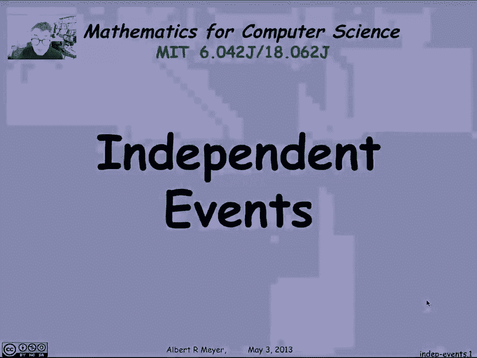
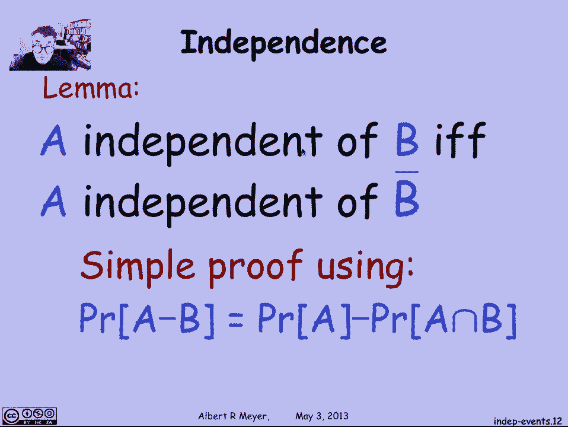

# 【双语字幕+资料下载】MIT 6.042J ｜ 计算机科学的数学基础(2015·完整版) - P91：L4.3.1- Independence - ShowMeAI - BV1o64y1a7gT

independent events are events that have，nothing to do with each other and。

needless to say it's a lot easier to，work with them when because you don't。

have to figure out some weird，interaction between two events that do。

have something to do with each other，typical case where in independent events。

come up is for example you toss a coin，five times and then you're about to toss。

a coin the sixth time is there any，reason to think that what the coins did。

the first five times is going to have，any influence on the flip of the sixth。

court of the coin for the sixth time，well it's reasonable to assume not which。

is to say that the outcome of the sixth，toss is arguably independent of the。

outcome of all the previous tours of，tosses okay let's look at a formal。

definition now in this short video of，just what is the technical definition of。

independent events so what we said is，that they're independent if they have。

nothing to do with each other what that，means is that if I tell you that B。

happened it doesn't have any effect on，the probability of a that is the。

probability of a given that B happened，doesn't change the probability of a at。

all that's it now this is one definition，maybe this is the more intuitive。

definition but a another definition，that's equivalent and is standard is。

that two events are equivalent if the，product of their probabilities is equal。

to the probability that they both happen，that is the probability of their。

intersection now definition one and，definition two a trivial equivalent of。

just using the definition of conditional，probability and if you don't see that。

this would be a moment to stop get a，pencil and paper and write down the。

three line proof of the equivalence of，these two equality's in fact the three。

line proof has this is the first line，and that is the second line so you could。

argue it's really just the middle line，that you're adding okay the definition。

too has the slight advantage that it，always works whereas definition one。

implicitly requires that the divisor，remember probability of a given B is。

defined as the probability of the，intersection divided by the probability。

but is only defined if the probability，of B is positive whereas the second，have to。

put a proviso in about the probability，of B being on zero so that's the。

definition of Independence looking at，this definition what you can see。

immediately is that it's completely，symmetric in a and B since，multiplication is commutative and。

intersection is commutative which is a，in which B doesn't matter and what that。

implies then is that a is independent of，B if and only if B is independent of a。

now another fact that holds is that if，the probability of B happens to be zero。

then vacuously B is independent of，everything even itself which isn't。

important but is a small technicality，that's worth remembering by that。

definition now again the intuitive idea，that a and B have nothing to do with。

each other is that a is independent of B，means that a is independent of whether。

or not B occurs that is to say if a is，independent of being ordered the。

independent of the complement of B and，that's a lemma that's also easily proved。

a is independent of B if and only if a，is independent of the complement of B。

it's a simple proof using the difference，rule and again I encourage you to stop。

and with a piece a piece of paper and。

