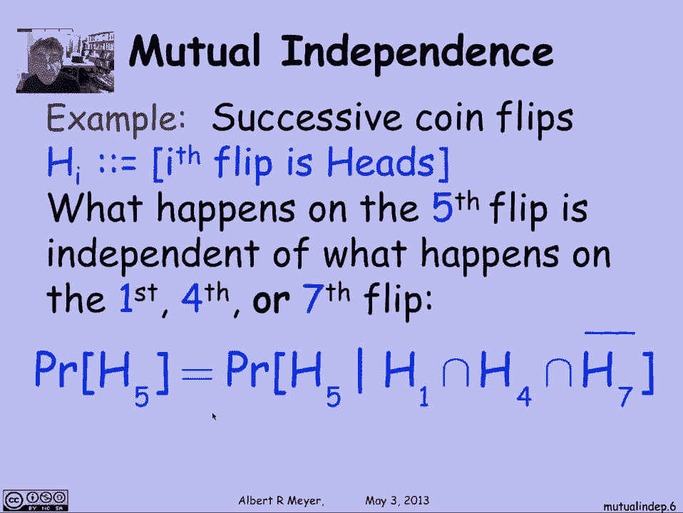

# 【双语字幕+资料下载】MIT 6.042J ｜ 计算机科学的数学基础(2015·完整版) - P92：L4.3.3- Mutual Independence - ShowMeAI - BV1o64y1a7gT

we've looked at independence for two，events what about when we have a bunch。

of events well in that case we want to，look at the idea of mutual independence。

so let's check that out I'll say that if，I have n different events I'll say that。

they're mutually independent intuitively，if the probability that one of them。

occurs is unchanged by which other ones。

happen to have occurred so expressed in，unconditional probability which is the。

way to make it precise what we're really，saying is that events a1 through a and a。

mutually independent when the，probability of AI is equal to the。

probability of AI given the intersection，of any of the other A's of as long as I。

is not one of them so take a 1 a 2 or a，1 a 2 a 3 and so on and and a 5 is going。

to be independent of all of those other，intersections if we shift over to the。

other definition of independence that we，used for two sets in terms of products。

you could say that n sets are mutually，independent when the product of the。

probability of the intersection of any，bunch of them is equal to the product of。

the individual probabilities of the，events in the intersection let's look at。

an example of mutual independence maybe，the simplest one is one of independent。

coin flips which by definition are，independent so the idea is that I will。

flip a coin a bunch of times and I will，let H I be the event that the if-- time。

I flip I get a heads so if you think，about what's going on what happens on。

the fifth flip has nothing to do with，what happens on the first fourth or。

seventh flip there's no causal，relationship between the flips of before。

or after flip five flip five is an，isolated event by itself and the fact。

that there were a bunch of heads before，or there will be a bunch of heads。

afterward doesn't have any impact on，probability that the fifth flip comes up。

with a head at least that's what we，believe and that's the way that we would。

model them so what that means for，example is that the probability of a。

head on the fifth toss is equal to the，probability of a head on the fifth toss。

given that the first toss was a head and，the second and the fourth toss was a。

head and the seventh Taurus was not a，head this is the complement of h7 so。

that would just be an example of one of，the many different conditional equality。

equation that hold when you have mutual，independence let's look at an example。

suppose that I flip a fair coin twice，then the previous definition didn't。

require fairness at all in the coin，flipping but now I'm gonna need it so。

that means that heads and tails are，equally likely，I suppose I flipped the coin twice well。

let h1 betta as before the probability，the event that a head comes up on the。

first flip in h2 the event that a head，comes up on the second flip and let o be。

the event that there were an odd number，of heads in the two flips now I claim。

that o is independent of whether or not，there's a head on the first flip that。

may seem a little weird because O，depends on both the first flip and the。

second flip it's whether or not they're，an odd number of heads there but。

nevertheless I claim that whether or not，they're an odd number of heads is。

independent of whether or not the first，toss was a head let's just check it。

using the official definition first of，all o is the event，h。t。t。h if I write out a HS and TS a。

pair of them for what the results of，this at first and second flips were I。

know you get an odd number of heads，exactly when there's a first a head and。

then a tail or first a tail and then a，head which means that the probability of。

all is exactly 1/2 because the other two，outcomes are true TT + HH which is when。

you have an even number of heads now o，intersection h1 is saying that you have。

an odd number of heads and the first，toss is a head the only outcome that。

fits that description is HT，which means that the pretend the，probability of H T is 1/4 so the。

probability of a intersection h1 is 1/4，o into section h1 is just a peculiar way。

of saying you got a head and then you，got a tail so that means that the。

probability of O intersection h1 is 1/4，and of course that's equal to the。

probability of all which we decided was，1/2 and the probability of h1 which of。

course is 1/2 all because we said the，coin was fair，so I've verified the condition for the。

independence of O and h1 and therefore。

I'm done but the weird thing to notice，now is that if you look at o h1 and h2。

the three of them they are not mutually，independent because in fact if you know。

any two of them you can figure out what，the third one was but just explicitly in。

terms of conditional probabilities the，probability of there being an odd number。

of heads given that they were the first，toss was a head and the second toss one。

was a head is 0 because once you know h1，and h2 oh you know exactly how many。

heads there were there were two and，that's not odd so the probability of odd。

given h1 intersection h2 a 0 which is，not equal to the probability of odd by。

itself which was 1/2 so they're the，three of them are not independent。

they're not mutually independent even，though any two of them are because oh。

and h1 are and obviously O&H two are by，symmetry and h1 and h2 are coin tosses。

and they're independent so that leads us，to the general idea of K way。

independence and an example would be if，you flip a fair coin k times let Hib。

whether or not there's a head on the I，flip and you let o again be whether or。

not they're an odd number of heads and，by the same argument you can verify that。

any set of K of these events are，mutually independent but if you give me。

all k plus 1 then they are not，independent in fact any K of them will。

determine the k plus first one but any k，of them among themselves will be。

mutually independent so that's why this，notion of how。

independent a set of a bunch of sets art，comes up and this is how to count it。

so in general events a1 through an，arbitrary set of events or k way，independent if any k of them are。

mutually independent pairwise then is，just the case of two-way independence。

and what we saw was the example that，with k point flips the events odd and。

the outcomes of head or not on h1。

through a che RK away independent but，not k plus one way independent by the。

way now that we understand what k way，independence is mutual independence of n。

sets is simply n way independence but I，just wanted to close with the remark。

that checking that n events are mutually，independent means that you actually have。

to check all the intersections equaling，the products of the individual events in。

the intersections so that there are two，to the N possible collections of subsets。

of a1 through a N and you have to check，for each of them that the intersection。

of those ones that you chose is equal to，the product of their probabilities but。

of course you don't need to check the，empty selection and you don't need to。

check the singleton set so you just have，to check to the 2 to the N equations。

corresponding to all the subsets of size，more than 1 so it's 2 to the N line is n。

plus 1 equations to check so in general，there's it's not going to be easy to。

verify mutual independence by doing this，kind of a calculation and you usually。

