# 【双语字幕+资料下载】MIT 6.042J ｜ 计算机科学的数学基础(2015·完整版) - P93：L4.4.1- Bigger Number Game - ShowMeAI - BV1o64y1a7gT

today's topic is random variables random，variables are absolutely fundamental。

concept in probability theory but before，we get into officially defining them and。

so on let's start off with an example，that in fact is a game because that's a。

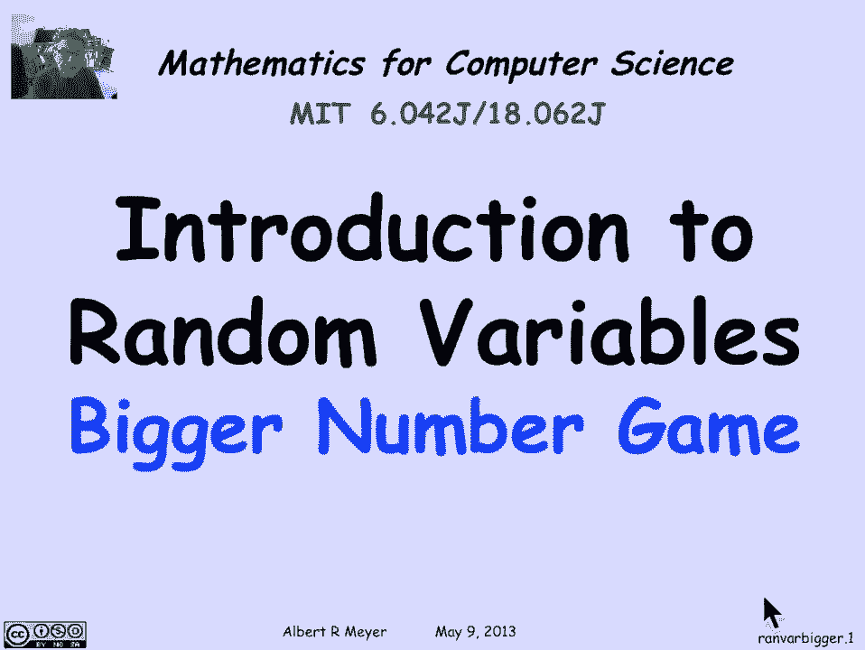

fun way to start so we're going to play，works，well there are two teams and team one。

has the task of picking two different，integers between 0 & 7 inclusive and。

they write a 1 into drawn one piece of，paper and the other integer on the other。

piece of paper they turn the two pieces，of paper face down so the numbers are。

not visible and the other team then sees，these two pieces of paper whose other。

side has numbers different numbers，written on them sitting on the table。

what team 2 then does is picks one of，the pieces of paper and turns it over。

and looks at the number on it and then，based on what that number is they make a，decision。

stick with the number they have or，switch to the other unknown number on。

the facedown piece of paper and that'll，be their final number and the game is。

that team two wins if they wind up with，the larger number so they're gonna look。

at the number on the paper that they，expose and they're gonna try to decide。

whether it looks like a big number or a，little number if it looks like a big。

number they'll stick with it if it looks。

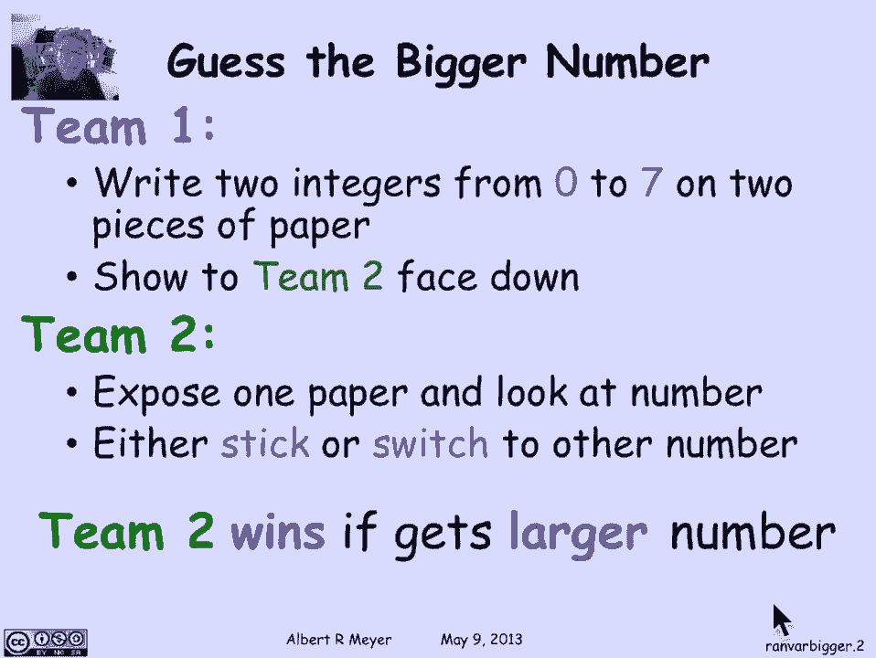

like a little number they'll switch to，the other one that they hope is larger。

so which team do you think has an，advantage here，if you've course if you've read the。

notes you know but if you haven't been，exposed to this before it's not really。

so obvious and what we encourage in what，we used to do when we ran this in real。

time in classes that we would have，students in teams split their team in。

half one would be team one and the other，would be team two and they play the game。

a few times see if they could figure out，who had the advantage and if you have。

the opportunity this might be a good，moment to stop this video and try。

playing the game with some friends if。

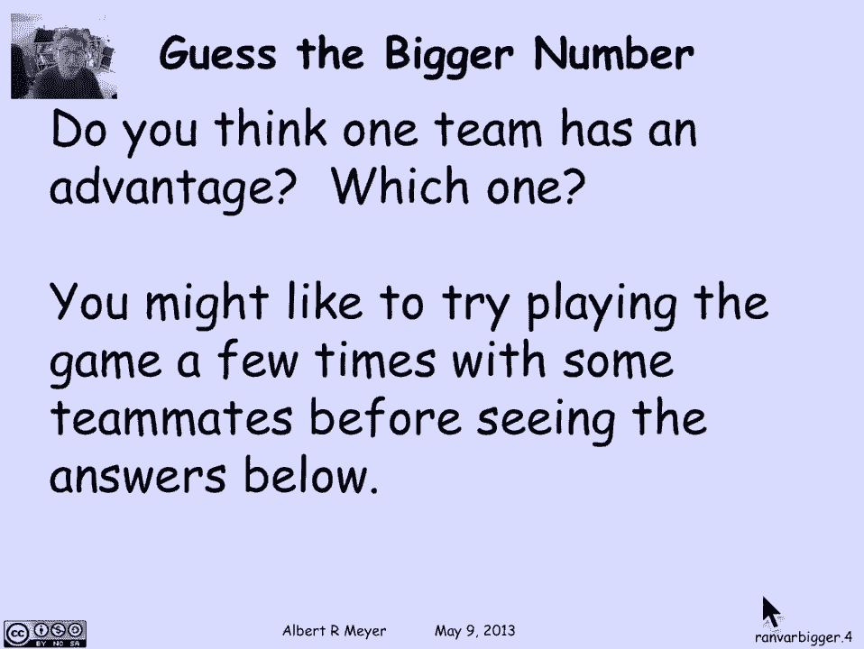

they're around otherwise let's just，proceed and see how it all works so this。

is the strategy that team two is going，to adopt they're going to take this idea。

about big and small that I mentioned，and and act on it in a methodical way so。

they're gonna pick a paper to expose，giving each paper equal probability so。

that guarantees that they have a 50/50，chance of picking the big number and a。

50/50 chance of picking the little，number whatever ingenuity team one tried。

to do on which side of the piece of，paper was on the left and which was on。

the right it doesn't really matter if，teams who simply picks a piece of paper。

at random there's no way that team one，can try to fake out team two on where。

they put the number okay the next step，is that team two is going to decide。

whether the number that they can see the，exposed number is small and if so it。

they switch and otherwise they stick so，that is they're gonna define some。

threshold Z where being less than or，equal to Z means small and being greater。

than Z means large the question is how，do they choose Z well a naive thing to。

do would be to choose e to be in the，middle of the interval from zero to。

seven let's say you choose Z equals，three so there would be three numbers。

like four numbers less than or equal to，Z and four numbers greater than Z but of。

course as soon as team one knew that，that was your Z what would they do well。

they would make sure that both numbers，were on the same side of Z if your z was。

three they would always choose their，numbers to be say zero and one and that。

way when you were switching your Z would，tell you that you had a small number you。

should switch to the other one and you'd，only have a 50-50 chance of winning so。

if you fixed that value of Z team two，has a way of ensuring that you have no。

advantage you can only win with，probability 50：50 and that's true no。

matter what Z you take if team one knew，what your Z was they would just make。

sure to pick their two numbers on the，same side of your Z and then your Z。

wouldn't really tell you anything you'd，switch wrists or stick in both cases and。

you'd only have a 50/50 chance of，picking the right number so what you do。

and this is where probability comes in，is you pick，in a way that can't be predicted or made。

use of by team one you pick Z at random，could be any number from zero to seven。

not including seven including zero and，that is your number is either 0 1 2 up。

through 6 and being less than or equal，to Z means small and being greater than。

Z means large and when you see a small，number you'll switch and when you see a。

large number you'll stick but what's，gonna be large and what's gonna be small。

is gonna vary each time you play the。

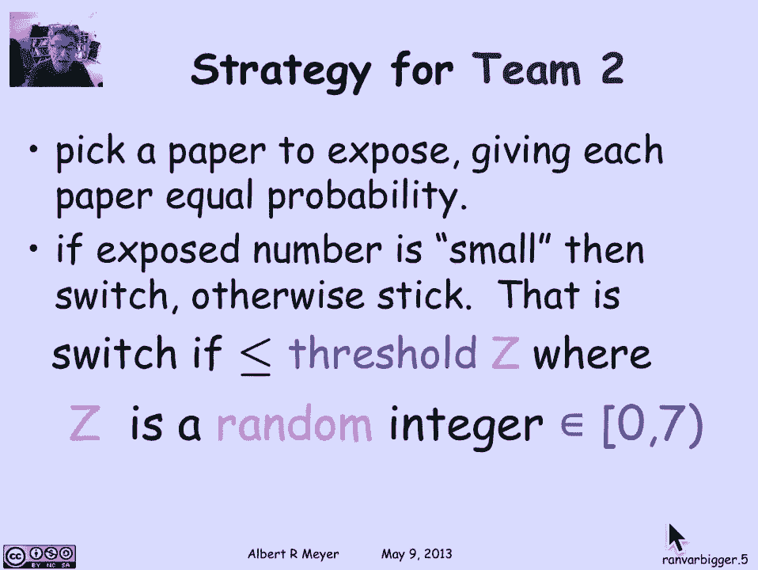

game depending on what random number Z，comes out comes out to be so let's。

analyze your probability of your team，what's the probability that you're gonna。

win now well let's suppose that team 1，picks these two numbers we don't know。

what they are but they have to pick a，low number that's less than a high。

number so these two numbers are at least，1 apart they can't have the same number。

on both pieces of paper otherwise it's，clear that you are not gonna be able to。

pick the larger and that would be，cheating ok so there's two different。

numbers so one of them has to be less，than the other we don't know how much。

less might be very a lot less might be，only one less but low is less than high。

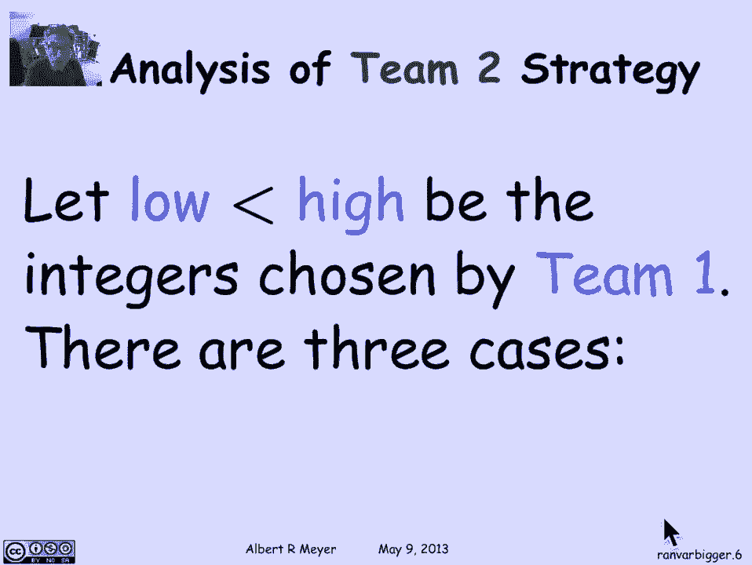

ok now we can consider three cases of。

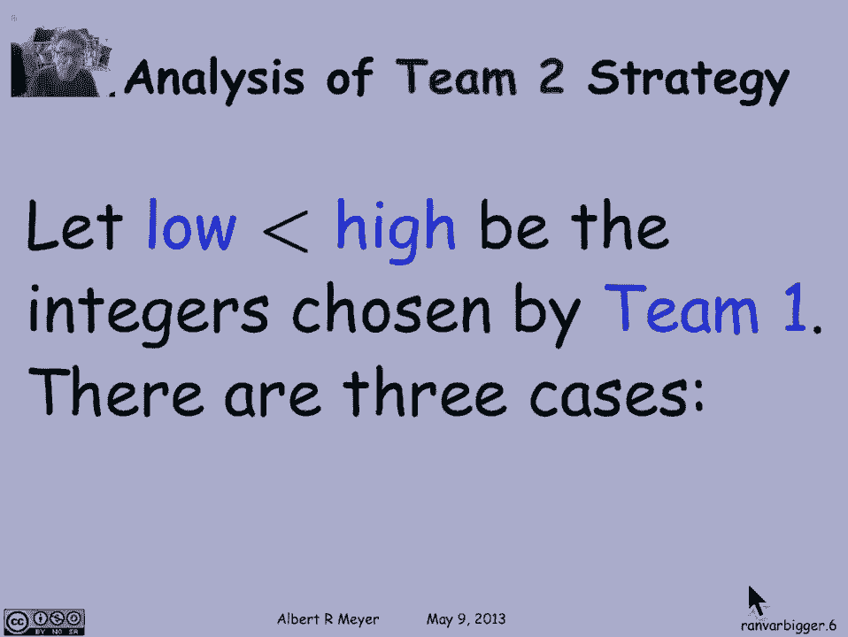

what happens with your strategy the most，interesting case is the middle case that。

is when your Z which was chosen at，random happens to fall in the interval。

between low and high that is your Z is，strictly less than high and greater than。

or equal to low and then in that case，your Z is really guiding you correctly。

on what to do if you turn over the low，card then it's gonna look low because。

it's less than or equal to Z so you'll，switch to the high card and win if you。

turn over the high card it's gonna be，greater than Z so it'll look high and。

you'll notice stick with it so in this，case you're gonna you're guaranteed to。

win if you were lucky enough to guess，the right threshold between low and high。

you're gonna win and so the probability，that you win given in the middle case。

occurs is 1 now what about the middle，case how often does that happen well the。

difference between low and high as it，least one so there's guaranteed to be。

one chance in seven that your Z is gonna，fall between them and it could be more。

if low and high are further apart but as，long as they're at least one apart。

there's a 1/7 chance that you're gonna，fall in between them，ok now in case H that's the case where Z。

happens to be chosen greater than or，equal to the high number that team 1。

shows in other words Z is bigger than，both numbers that team 1 chose and put。

on the pieces of paper well in that case，Z just isn't telling you anything so。

what's gonna happen is that both numbers，are going to look high to you sorry both。

numbers are gonna look low to you，because they're both less than or equal。

to Z so you'll switch and that means，that uh you'll win if and only if you，first。

well that's 5050 so the probability that，you win given that Z both cards are on。

the wrong side of Z on the low side of Z，you win with half the time and。

symmetrically if Z is less than the low，card that is Z is less than both cards。

chosen by team 1 then they're both gonna，look high and so you'll stick and that。

means that you'll stick you win if and，only if you happen to have picked the。

high card there's a 50/50 chance of that，so again in this case that Z makes both。

cards look high or Z itself is low team，2 you win with probability 1/2 well。

that's great because now we can apply，total probability and what total。

probability tells us is that team 2 wins，on the is the probability that they win。

given case M times the probability of M，plus the probability that they went。

given not the middle case times the，probability of not the middle case but。

we figured out what these were or at，least inequalities on them because um。

there's probability one that you'll win，1/7 of the time and there's probability。

1/2 that you'll win the other the rest，of the time the others。

seventh of the time you're gonna win 4/7，of the time the probability that you win。

playing your strategy is 4/7 it's better，than 5050 you have an advantage and。

whether that was a priori obvious or not。

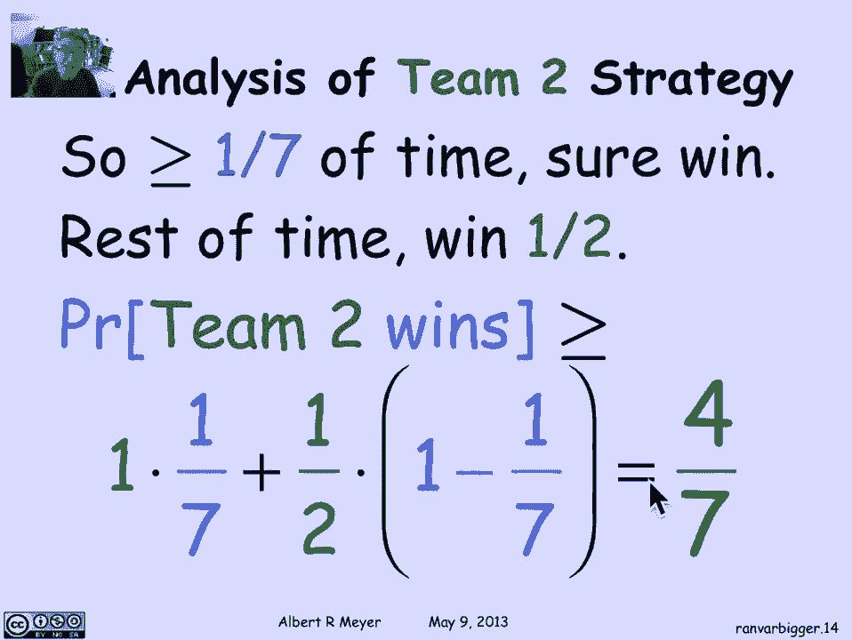

I don't know but I think it's kind of，cool okay you win with probability 4/7。

now um team toe has the advantage and it，and the important thing to understand is。

it does not matter what team does no，matter how smart team one is team two。

has gotten control of the situation，because they picked the which piece of。

paper they picked at random fifty-fifty，so it doesn't matter what strength he is。

strategy team one used on where they，placed the numbers and they chose Z。

randomly so it again it doesn't matter，what numbers team one chose team two is。

still gonna have their one seventh。

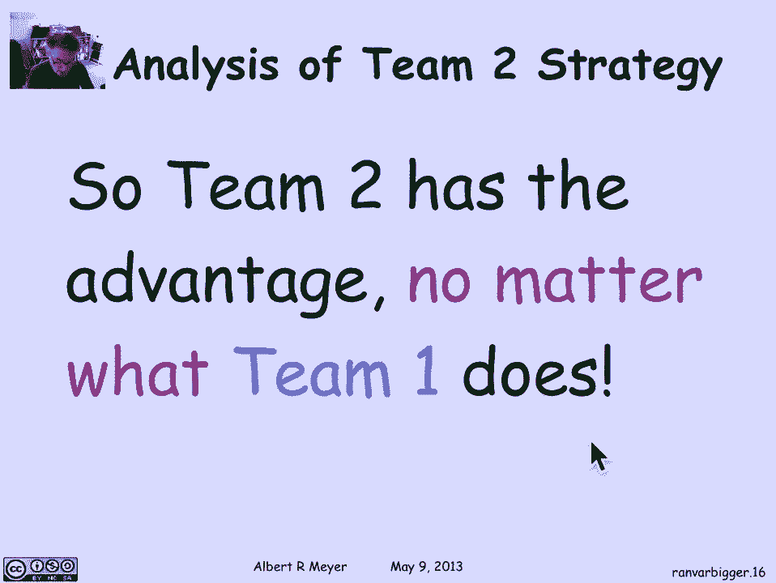

chance of coming out ahead which is，enough to tip the balance in their favor。

it's interesting that symetrically team，one also has a random strategy that they。

can use which guarantees that no matter，what team to does they team two wins。

with probability at most 4/7 so either，team can force the probability that team。

two wins to be at most four sevenths and，at least 4/7 so if they both play。

optimally it's gonna stay at 4/7 and，that's again true no matter what team -。

does team one can put this upper bound。

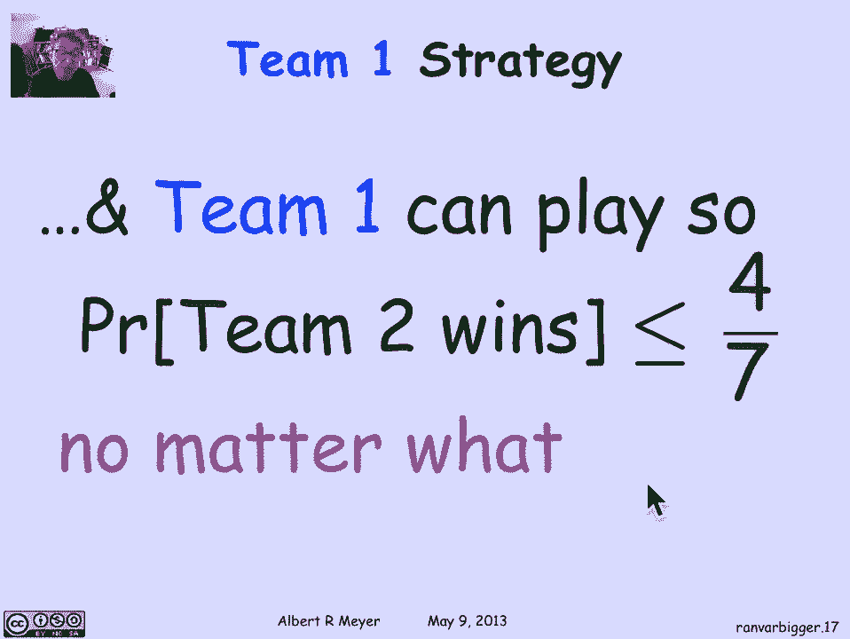

of 4/7 on it so and essentially we can，say that the value of this game the。

probability that team two wins is。

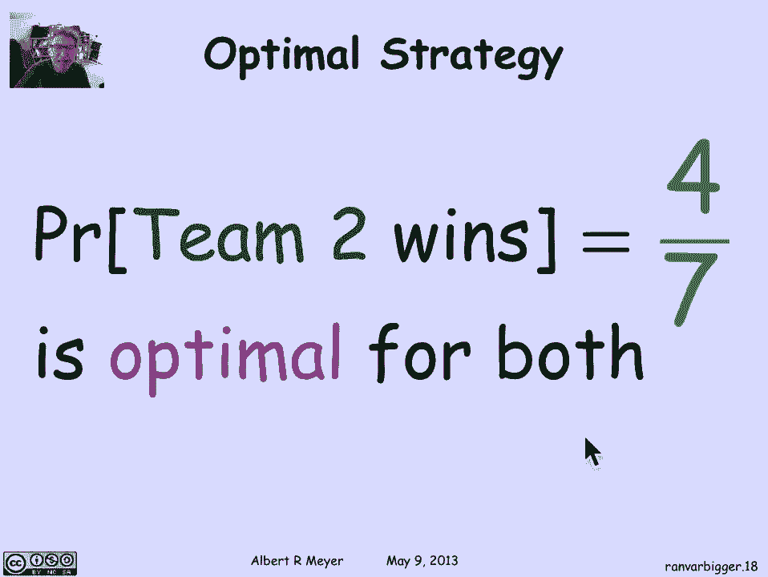

optimally for both is 4/7 okay now what，is this game got to do with anything。

with our general topic of random，variables well will be formal in a。

moment but informally a random variable，is simply a number that's produced by a。

random process and just to give an，example before we come up with a formal。

definition the threshold variable Z was，a thing that took a value from zero to。

six inclusive each with probability one，seventh so it was producing an。

by a random process that shows a number，at random with equal probability if the。

team too plays properly uh at random，picking which piece of paper to expose。

then the number of the exposed card or，more precisely whether the exposed card。

is high or low will also be a random，variable um and if team one plays。

optimally the number on the exposed card，is gonna be a random variable that is。

team one in their optimal strategy that，puts an upper bound of four sevens is in。

fact going to choose the two numbers，randomly so the exposed card was going。

to wind up being another random variable，a number produced by the random process。

and likewise the number of the larger，card if team one play picks it's larger。

and smaller cards randomly it's going to，be another example of a number produced。

by a random process and likewise the，number of the smaller card so that's。

enough examples this little game has a，whole bunch of random variables。

appearing in it and in the next segment。

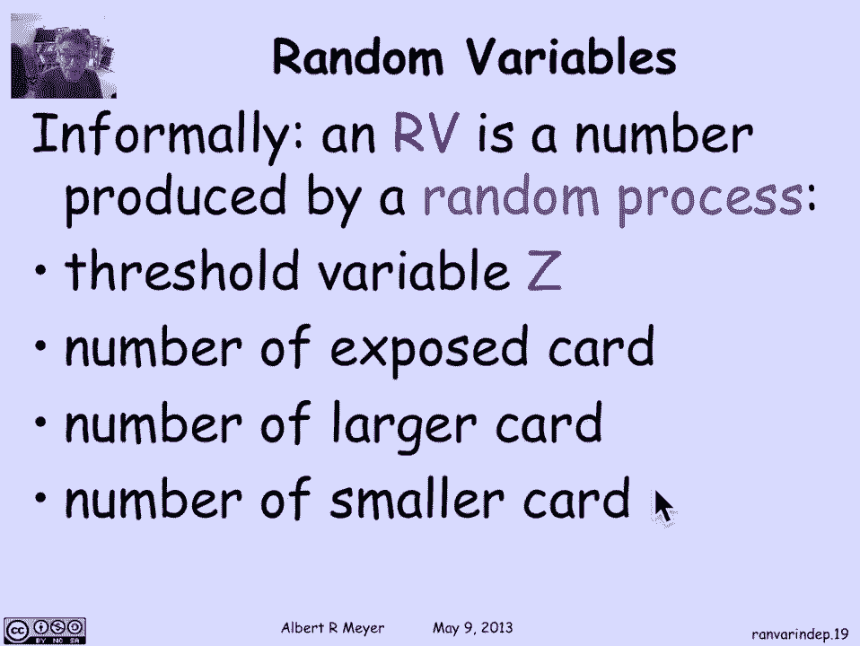