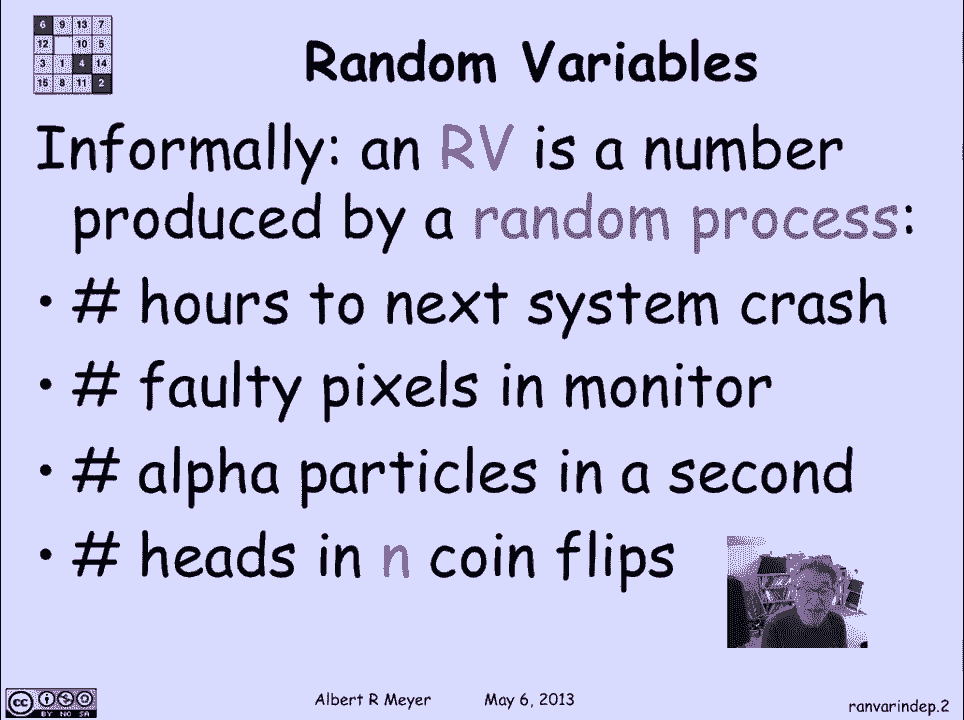
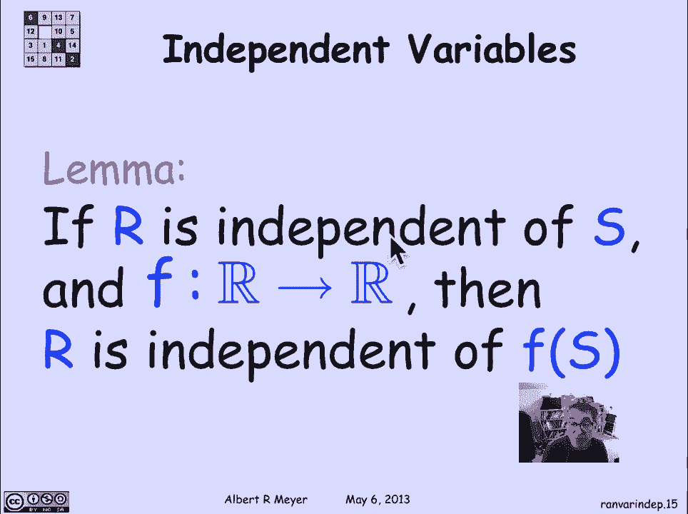
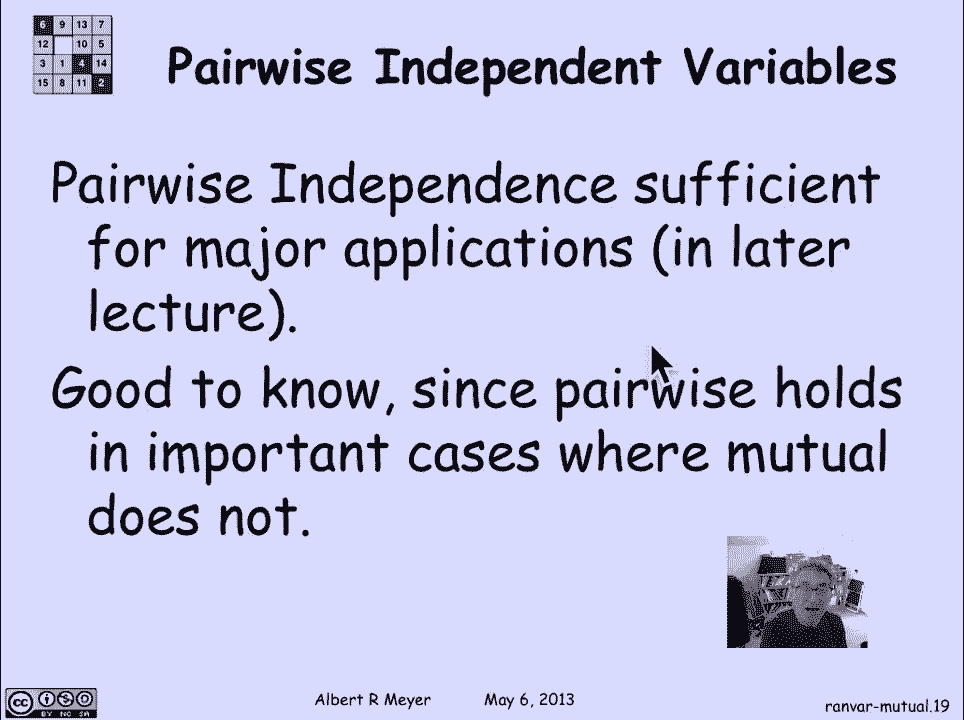

# 【双语字幕+资料下载】MIT 6.042J ｜ 计算机科学的数学基础(2015·完整版) - P94：L4.4.2- Random Variables - Independence - ShowMeAI - BV1o64y1a7gT

we just saw some random variables come，up in the bigger number game and we're。

gonna be talking now about random，variables just formally what they are。

and their definition of independence for，random variables but let's begin by。

looking at the informal idea again a，random variable is a number that's。

produced by a random process so a，typical kind of example that comes up。

where you get a random variable is，you've got some system that you're。

watching and you're gonna time it to see，when the next crash comes if it crashes。

so the assuming that this is，unpredictable that happens in some。

random way then the number of hours from，the present until the next time the。

system crashes is a is a number that's，produced by this random process of。

whether the system works or not number，of faulty pixels in a monitor when。

you're building the monitors and，delivering them to the actual computer。

manufacturers there's a certain，probability that some of the picks some。

of the millions of pixels in the monitor，are going to be faulty and you can think。

of that number of pixels is also，produced from an unpredictable。

randomness in the manufacturing process，a one that really is modeled in physics。

as random is when you have a Geiger，counter be measuring alpha particles the。

number of alpha particles that the are，detected by a given Geiger counter in a。

second is believed to be a random number，there's a distribution that it has but。

the number of alpha particles is not，always the same from second to second。

and so it's a random variable and，finally we'll look at the standard。

abstract example of flipping coins and，if I flip the coins then the number of。

heads in a given number of flips let's，say I flip a coin n times the number of。

heads will be another rather standard。

random variable okay what is abstractly，a random variable oops I'm getting ahead。

of myself again let's look at that，example of three fair coins so each coin。

has a probability of being heads that's，a half and tails being a half I'm going。

to flip the three of them and I'm going，to assume that they're distinguishable。

so there's a first coin a second coin，and a and a third coin or alternatively。

you could think of flipping the same，coin coin three times so the number of。

heads is a number that comes out of this，random process of flipping the three。

coins so it's a number that's either，from zero to three there can be no heads。

or all heads so it is a basic example of，a random variable where you're producing。

this integer based on how the coins flip，another one is simply a zero one valued。

random variable where it signals one if，all three coins match in what they come。

up with and zero if they don't match all，right now once I have these random。

variables defined one of the things，that's convenient convenient use of。

random variables is to use them to，define various kinds of events so the。

event that C equals one that's an event，that you know it's a random it's a set。

of outcomes where the count is one and，it has a certain probability this is the。

event of exactly one head there are，three possible outcomes among the eight，coins。

so it has probability 3/8 I could also，just talk about the outcome that C is。

greater than or equal to 1 well C is，Greg and regal to 1 on when there is at。

least one head or put another way the，only time that C is not greater or equal。

to 1 is when you have all tails so，there's a 7/8 chance 7 out of 8 outcomes。

involve one or more heads so the，probability that C greater equal to 1 is。

7/8 here's a weirder one I can use the，two variables C and M to define an event。

what's the probability that C times M is，greater than zero，well since C and M are both non-negative。

variables the probability that they're，both that their product is greater than。

zero is equal to the probability that，each of them is greater than zero okay。

what does it mean that M is greater than，zero and C is greater than zero well it。

says there's at least one head that's，what C greater than zero means and M。

greater than zero means all the coins，match this is an obscure way of，describing the event。

all heads and it has the course，probability 1/8 now we come to the。

formal definition so formally a random，variable is simply a function that map's。

outcomes in the sample space to numbers，the we go we think of the the outcomes，in the sample space。

as the results of a random experiment，they they they are an outcome and they。

have a probability and when the outcome，is translated into a real number that。

you think of as being produced as a，result of that end outcome that's what。

the random variable does so formally a，random variable is not a variable or。

it's a function that map's the sample，space to the real numbers and it's got。

to be totaled by the way it's a total，function usually it's it's red this。

would be a real number a real valued，random variable usually as the real。

numbers it might be a subset of the real，numbers like the integer valued random。

variables occasionally we'll use complex，valued random variables actually that。

happens in in physics a good deal in，quantum mechanics but not for our。

purposes we're just gonna mean real，value from now on when we talk about。

random variables so abstractly or or，intuitively what the random variable is。

doing really is it's just packing to get，packaging together in one object are the。

random variable a whole bunch of events，that are defined by the value that are。

takes so for every possible real number，if I look at the event that R is equal。

to a that's an interesting event and it，it's part of its one of the basic events。

that that are puts together if you knew，the answer to all of these R equals a。

with this understanding that R is a，package of events of the form R is equal。

to a then a lot of event properties，carry right over two random variables。

directly that's why this little topic of，introducing random variables is also。

about independence because the，definition of independence carries right。

over namely a bunch of random variables，are mutually independent if the events。

that they define are all，independent of mutually independent so。

if and only if the events that are never，each event defined by r1 and r2 and。

through RN that set of events are，mutually independent no matter what the。

values are chosen that we decide to look，at for r1 and r2 and through RN and of。

course there's an alternative way we can，always express independent events in。

terms of products instead of product，conditional probabilities so we could。

say or and instead of invoking the idea，of mutual independence we can say。

explicitly where it comes from as an，equation it means that the probability。

that r1 is equal to a 1 and r2 is equal，to a 1 and RN is equal to a n is equal。

to the product of the probabilities of，the individual probabilities that r1 is。

a1 times the probability that r2 is a 2，and the definition then of mutual。

independence of the random variables are，1 through n RN hulls is that this。

equation it holds for all possible，values little a1 through little a and so。

let's just practice apart the variable C，which is the count of the number of。

heads when you flip three coins and am，the zero one valued random variable that。

tells you whether there's a match are，they independent，well certainly not because there's this。

definitely a positive probability that，the count will be one that you'll get at。

least a head and there's a positive，probability that they all will match the。

probability of a quarter so the product，of those two is positive but of course。

the probability that you match and，you'll have exactly one head is zero。

because if you have exactly one head you，must have two tails and there's no match。

so without thinking very hard about what，the probabilities are and we can。

immediately see that the product is not，equal to the probability of the。

conjunction or the end and therefore，they're not independent well here's one。

that's a little bit more interesting in，order to explain it I got to set up the。

idea of an ending indicate，variable which itself is a very，important concept so if I have an event。

a I can package a into a random variable，just like the match random variable was。

really packaging the event that the，coins matched into a 0-1 value variable。

I'm going to define the indicator，variable for any event a to be 1 if a。

occurs in 0 if a does not occur so now I，have I'm able to capture obviously the。

matters about an event a by the random，variable I sub a if I have I sub a I。

know what a is and if I have a I know，what I said a is and that means that。

really I can think of events as special，cases of random variables now when you。

do this you need you need a sanity check，because remember we've defined。

independence of random variables one way，I mean it's a concept of independence。

that holds for random variables we have，another concept of independence that。

holds for events now the definition for，random variable who have motivated by。

the definition of her events but it's a，different definition of independence of。

different kinds of objects now if this，correspondence between events and。

indicator variables is going to make，sense and not confuse us it should be。

the case that two events are independent，if and only if their indicator variables。

are independent that is ia and IB are，independent if and only if the events a。

and B are independent and this is a，lovely little exercises like a three。

line proof for you to verify I'm not，gonna bother to do it on the slide。

because it's good practice so this would，be a moment to stop and verify that。

using the two definitions of，independence the definition of what it。

means for ia and IB to be independent as，random variables and comparing that to。

the definition of what it means for a，and B to be independent as events they。

match if we look at the event of an odd，number of heads we can ask now whether。

the event M of there of the the which is，the indicator variable for a match the。

random variable M and the indicator，variable I sub o are dependent or not。

now both of these depend on all the，three coins I sub o is，in all three coins to see if they're an。

odd number of heads M is looking at all，three coins to see if they're all heads。

or all tails and it's not clear with all，that common basis for returning what。

value they have it's not well，immediately obvious that they're。

independent but as a matter of fact they，are and again this is absolutely。

something that you should check out if，you don't stop the video now to work it。

out you should definitely do it，afterward it's an important little。

exercise and it's easy to check all you，have to do is check that the the。

probabilities of the event of an on the，the event odd number of heads in the。

event all match are independent as，events or you could use the random。

variable definition and check that these，two random variables are independent by。

checking of four equations because this，can have values 0 and 1 and this can，have value 1 0 & 1。

remember with random event with，independent events we had the idea that。

if a it was independent of B it really，meant that a was independent of。

everything about B in particular was，independent of the complement of B as。

well and a similar property holds for，random variables so intuitively if R as。

independent of s then R is really，independent of any information at all。

that you have about s um and that can be，made more precise that R is independent。

not of any information about s by saying，pick an arbitrary function that map's R。

to R total function so what I can do is，think of F as giving me some information。

about the value of s so if R is，independent of s then in fact R is。

independent of F of s any transformation。

and of course the notion of K way，independence carries right over from the。

event case if I have K random verify，have a bunch of random variables a large。

number much more than K their K way，independent of every set of K of them。

are mutually independent and of course，as with events we use the two-way case。

to call them pairwise independent，again we saw an example of this in terms。

of events already but we can rephrase it，now in terms of indicator variables if。

we let Hib the indicator variable for a，head on a flip I of the I flip of a coin。

where I ranges from 1 through K if we，have K kake coins and H I is the。

indicator variable for how coin I came，out whether or not there's a head now o。

can be nicely expressed the notion that，there's an odd number of heads is simply。

the mod to some of the h eyes and this，by the way is a trick that will be using。

regularly that events now can be defined，rather nicely in terms of doing。

operations on the arithmetic values of，indicator variables so o is nothing but。

the mod to sum of the values of the，the what we saw when we were working。

with their event version is that any K，of these events are independent i've got。

k plus 1 there's k h eyes and there's，all which makes the k plus 1 k plus。

um and the reason why any k of them are，independent was discussed in the。

previous slide when we were looking at，the events of their being an odd number。

of heads and and a head coming up on the，I flip the reason why pairwise。

independence get singled out is that，we'll see that for a bunch of major。

applications its paralyzed up like，pairwise independence is sufficient and。

rather than verifying mutual，independence it's harder to check mutual。

independence you've got a lot a lot more，equations to check and and in fact it。

doesn't it often doesn't hold in，circumstances where pairwise does hold。

so this is good to know we'll be making，use of it in an application later when。

