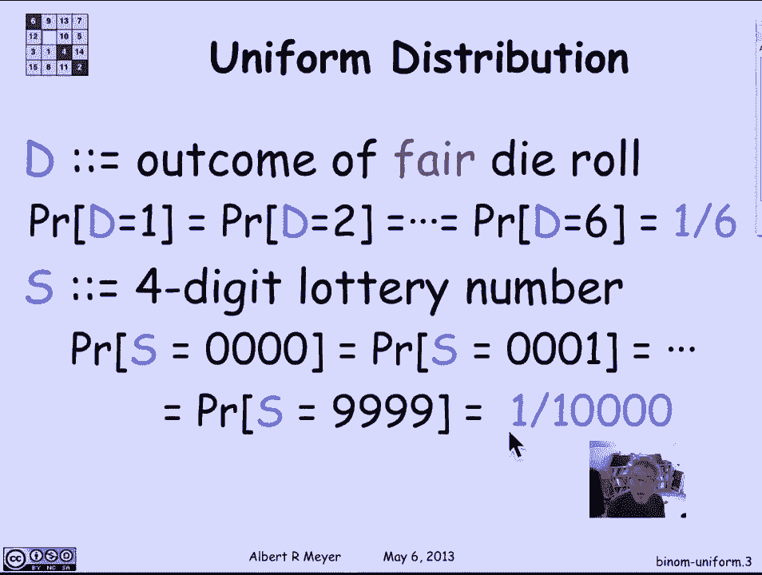
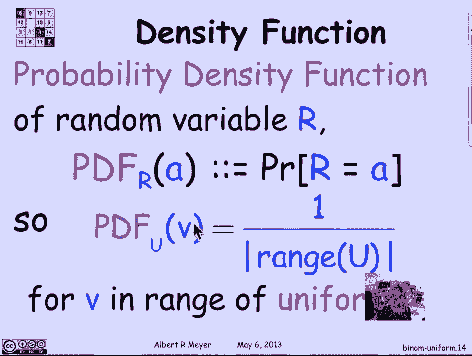
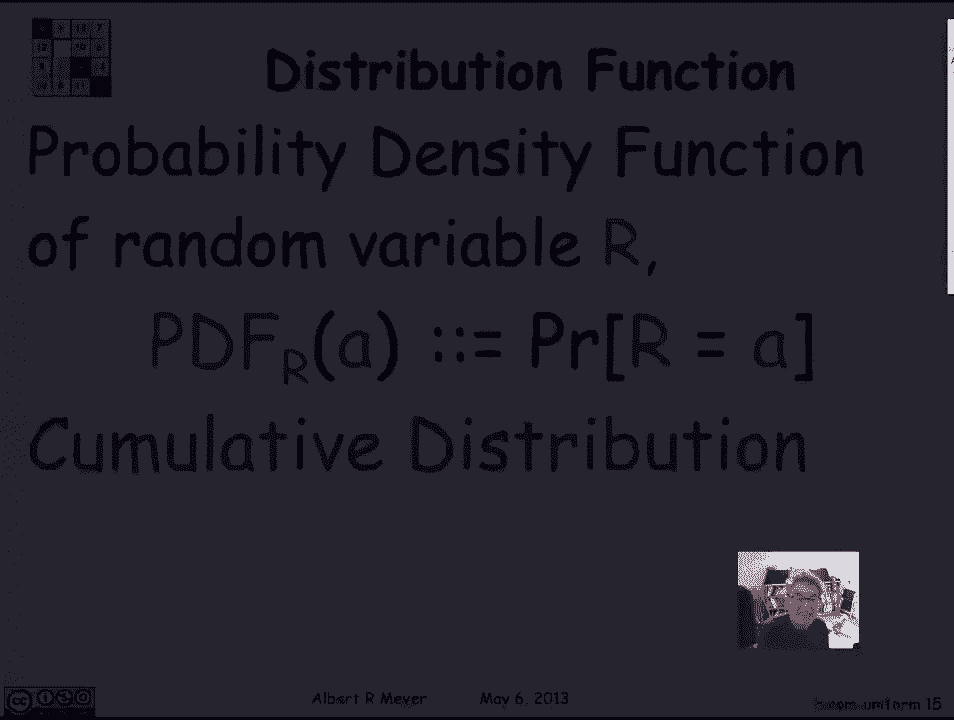
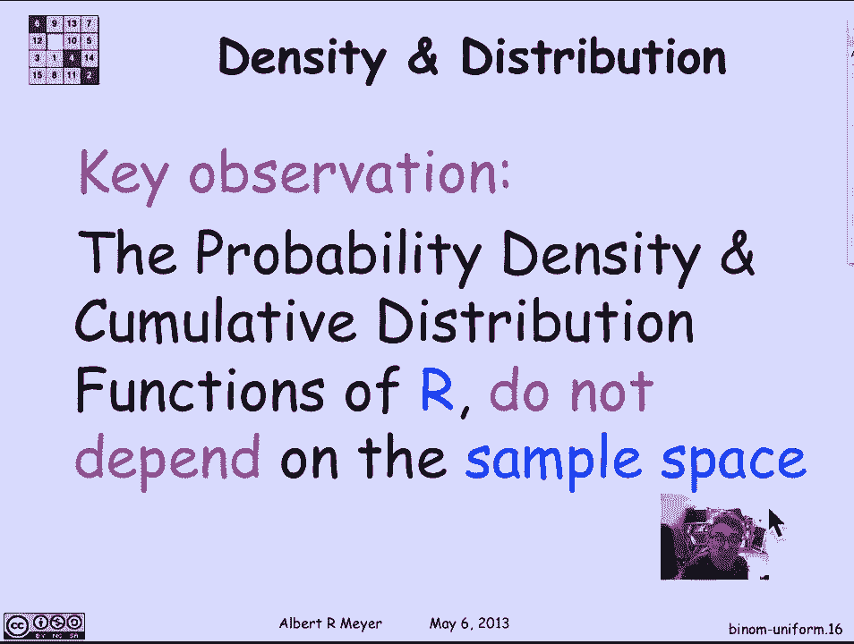

# 【双语字幕+资料下载】MIT 6.042J ｜ 计算机科学的数学基础(2015·完整版) - P95：L4.4.4- Random Variables - Uniform & Binomial - ShowMeAI - BV1o64y1a7gT

某些随机变量不断出现，现在让我们看两个基本的例子，即均匀随机变量和二项式随机变量，让我们从制服开始，因为我们已经看过了，均匀随机变量意味着它所取的所有值都有相等的概率，所以阈值变量z取从零到六的所有值。

包容性，每个都有1-7的概率，所以这是一个均匀变量的基本例子，出现的其他例子，如果d是一个公平模具的结果，模具是六面的，骰子是六面的，所以它出现一两个或六个的概率是六分之一。

每一个游戏都是四位数的彩票号码，应该是这样的地方，这四个数字都是随机选择的，这意味着可能性从4个0到4个9不等，为了一万个数字，他们应该都有同样的可能性，所以彩票最终为零的概率。

零和它最终得到的1是一样的，最后是四个9。

是一万，这是另一个均匀随机变量。

嗯，让我们证明一个稍后会有用的小引理，只是一些统一的练习，假设i有r 1 r 2 r 3是三个随机变量，它们是相互独立的，其中一个是R一个是均匀的，我真的不在乎另外两个，我真的在乎，从技术上来说。

他们只是取了值，他们只取值，那个R人也可以拿，所以我没在幻灯片上说过，但这是我们假设的，然后我声称每一对，r 1等于r 2的概率是独立的，r 1等于r 2的事件独立于，r 2等于e r 3的事件。

它与r 1等于r 3的事件无关，现在这些事件重叠了，这里有个R，那儿有一个r和一个r，这里有一个RTwo，那里有一个RTwo，所以说，即使R one，r 2 r 3是相互独立的，还不完全清楚，事实上。

目前还不清楚这些事件，嗯，但事实上它们并不相互独立，事实上，它们是成对独立的，他们显然不是三方独立的，相互独立的，因为如果我知道r 1等于r 2，我知道R2等于R3，因此r 1等于r 3。

所以考虑到这两个，这种情况发生巨大变化的可能性是肯定的，但这是有用的引理，也就是说，如果我有三个变量，我看了三对可能相等的值，他们中的任何两个是否相等是相互独立的，现在让我给一个挥舞的手论点。

有一个严格的，基于在文本中作为问题出现的总概率的更严格的论点，但直觉上的想法是，让我们看看r 1是均匀变量的情况，r 1独立于r 2和r 3，所以这肯定意味着r one与事件无关，r 2等于r 3。

因为r 1与r 1和r 2相互独立，他们做什么并不重要，所以R2等于R3与这个事件无关，因为r one是均匀的，它有概率p等于它能取的所有可能值，因为R2和R3只取R1能取的值。

r 1碰到r 2和r 3恰好有的值的概率，还是P，这是非正式的争论，换句话说，声称r 1等于r 2的概率，给定r 2等于r 3，R1碰巧击中R2的概率，不管有什么价值，R2已经。

这个方程说R1等于R2与R2无关，R三，事实上，在这两种情况下，r 1等于任何给定值的概率是相同的，我们的大制服有可能等于它的每一个可能值，你可以考虑一下，看看是否有说服力，它实际上是一个。

这是一个好的论点，但我被它困扰着，我发现它花了我，我对此并不满意，直到我坐下来，真正正式地把它解决了，为了证明这有点手，引理的波浪证明，所有的权利，嗯，让我们从均匀随机变量转向二项式随机变量。

它们可能是随机变量中最重要的一个例子，出现了，无时无刻不在，所以说，二项式随机变量的最简单定义，是你通过掷n个相互独立的硬币得到的，um或替代，现在他们有命令了，所以你可以区分它们或者你可以说你翻转。

嗯一个硬币n次，但每一个翻转都是独立于所有其他翻转的，这里有两个参数，an n和a p，因为我们不认为翻转是公平的，所以有一个参数是有多少次翻转，另一个参数是头部可能有偏差的概率。

头部比尾巴更有可能或更不可能，公平的情况是p是半，例如，如果n是五，p是三分之二，我们连续翻转头部的概率是多少，尾巴，尾头井，因为他们是独立的，这个概率只是我向前翻转的概率的乘积，在第一次掷硬币时。

也就是h的概率，也就是p，h的概率，在第二次掷硬币时，T在第三个T上的概率，在第四个T，在五号，所以我可以把每一个替换三分之二，是头部的概率，三分之二，三分之一三分之二，一减三分之二，是尾巴的概率。

三分之一三分之二，我发现H T T H的概率是三分之二，立方体和三分之一，连续n次抛掷的概率，其中有i头，其余的是尾，n减去i尾巴，就是头上升到第i次方倍的概率，尾巴的概率。

也就是1减去p等于n减去i的次方，给定长度为n的h和t的任何特定序列，这是分配给那个序列的概率，所以所有具有相同h数的序列具有相同的概率，但当然H的数量不同，他们有不同的概率，嗯。

你实际掷出i的正面和n减去i的反面的概率是多少，在最后的投掷中，这将等于可能序列的数量，嗯，具有i头n减i尾的性质，嗯，这样的序列的数量只是为n个头选择i个位置，为了另一个。

从N个投掷中选择头部的I位置，所以这将是n选择i，所以说，我们刚刚计算出抛掷i头的概率，n减去i的尾巴就是n，选i乘以p到i减去p到n减去i，总之，头数为i的概率等于这个数，这是与。

参数n和p的二项式变量是否等于i是n，选i p到i减去p到n减去i，这是一个非常基本的公式，如果你记不住，然后确保它写在你带去考试的任何一张婴儿床床单上，概率密度函数，它抽象出随机变量的一些性质。

基本上，它只是告诉你，随机变量对每一个可能的值都取一个给定值的概率是多少，所以r的概率密度函数PDF是关于实值的函数，它告诉你对于每个a，r等于a的概率是多少，如此如此。

我们刚才说的是二项式随机变量的概率密度函数，用参数n和p在i n选择i表征的per，p到i减去p到n减去i，我们假设我在，是从零到n的整数，如果我看一个均匀变量的概率密度函数，那么它是恒定的。

任意可能值V上的概率密度函数，均匀变量可以取的是相同的，这适用于u范围内的v，嗯，所以其实，你可以准确地说出它是什么。

它只是U范围的大小之一，如果U是均匀的。

描述随机变量行为的函数，是累积分布函数，它只是r小于或等于a的概率，所以它是实数上的函数，从一个卷轴到另一个卷轴，其中PDF，CDF的r，a的r是r小于或等于a的概率，清楚地给出了PDF，您可以定义。

你可以得到CDF并给出CDF，你可以得到PDF，但现在两者都在身边很方便，关于这些的关键观察是，一旦我们抽象到PDF和CDF，我们再也不用考虑样本空间了，它们不依赖于样本空间。

他们告诉你的只是随机变量取给定值的概率，在某些方面，这是关于随机变量的最重要的数据，你需要依靠一些比PDF或CDF更通用的东西，当你开始有依赖随机变量时，你需要知道r取一个值的概率是如何变化的。

给定s具有某种性质或具有其他值，嗯，但如果你只看随机变量，本质上，你需要知道的关于它的一切都由它的密度或分布函数给出，你不必担心样本空间，这样做的好处是，均匀分布和二项分布都出现了。

这意味着所有这些基于不同样本空间的不同随机变量，我要分享很多财产，我得到的一切，基于PDF将适用于所有这些，这就是为什么用概率密度函数来抽象随机变量，是如此有价值和关键。

但请记住随机变量的定义并不是说它是概率密度函数，而是。

