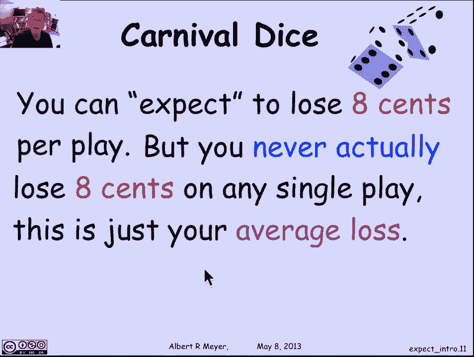
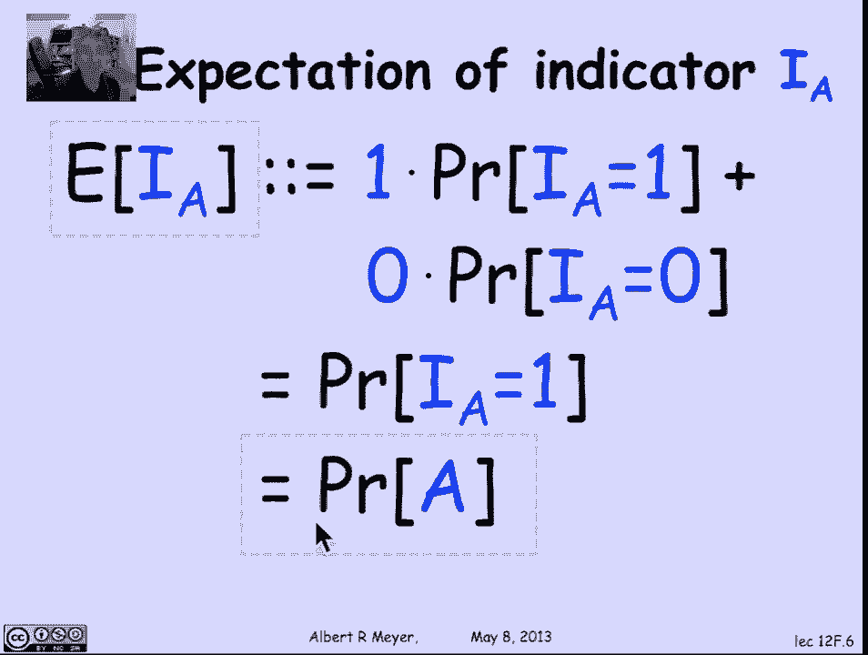
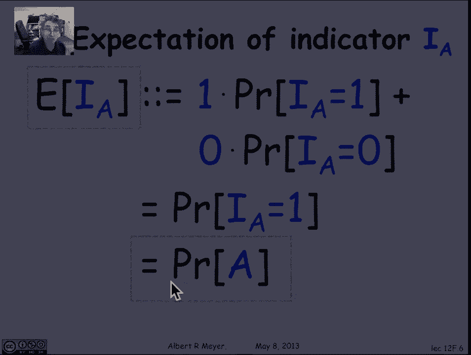
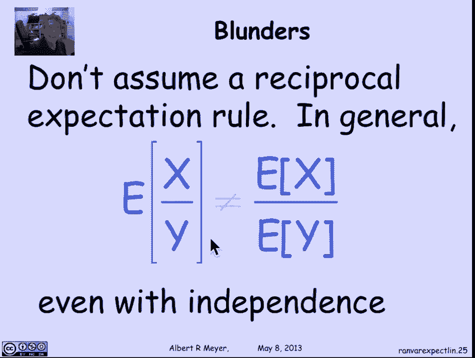

# 【双语字幕+资料下载】MIT 6.042J ｜ 计算机科学的数学基础(2015·完整版) - P96：L4.5 Expectation - ShowMeAI - BV1o64y1a7gT

We ask about averages all the time， and in the context of random variables。

 As get abstracted into a lovely concept called the expectation of the random variable。

 Let's begin with a motivating example， which， as is often the case， will come from gambling。

So there's a game that's actually played in casinos called Carnival dice。

 where you have three dice and the way you play is you pick your favorite number from one to6。

 whatever it happens to be， and then you roll the three dice， the dice assumed to be fair。

 so each one of them has one in six chance of coming up with any given number。

 and then the payoff goes as follows for every match of your favorite number， you get a dollar。

And if if none of the dies show your favorite number， then you lose a dollar。Okay。

 let's do an example。 Suppose your favorite number was 5。

 You announced that to to the house or the dealer and then the dice start rolling。 Now。

 if your role happened to come up with the numbers 2，3 and 4， well， there's no  fives there。

 So you've lost a dollar。 On the other hand， if your roles came out，5，4，6， there's 1，5。

 you've won a dollar。 If it came out 5，4，5， there's 2，5s， you've won a dollar。

 And if it was all five， you've actually won $3。 Now。

 real carnival dice is often played where you either win or lose a dollar depending on whether there's any match at all。

 But we're playing a more generous game where if you double match， you get $2。 If you triple match。

 you get $3。 So the basic question about this is。Is this a fair game。

 is this worth playing and how can we think about that。

 well we're going to think about it probabilistically。

So let's think about the probability of rolling。No fives。 If5 is my favorite number。

 What's the probability that I roll None of them。 Well。

 there's a five out of six chance that I don't roll a 5 on the first die。

 And on the second die and on the third die。 And since the die rolls are assumed to be independent。

 The dies are independent。 The probability of no 5s is 5，6 to the third， which comes out to be 125。

216s。 I'm writing this out because we're going to put all the numbers over 216 to make them easier to compare。

 Okay， what's the probability of 1，5。 Well， the probability of any single sequence of die rolls with a single five is5。

6 of no 5 times 5，6 of no 5 times 1，6 of 1，5。 And there are three choose。

1 possible sequences of dice rolls with1，5， and the other nonfis。 likewise， for two，5s。

 there's three chooses，2 times 5，6 to the one。Which is。One way of choosing the。

Place that does not have a5 and16 times 1，6， which is the probability of getting fives in the other places。

I didn't say that well， but you can get it straight。 Okay， the probability of 3。

5s is the probability of 1，6 of getting a 5 on the first die，16 of getting a five on the second die。

16 of getting a five on the third die， simply 16 cubed。 Okay。

 so we can easily calculate these probabilities。 This is a familiar exercise。

 let's put them in a chart。 So what we figured out is that0 matches has a probability of 125 over 216。

 And in that case， I lose a buck。One match turns out to have a probability of $75 out of 216。

 and I win a dollar， two matches is 15 out of 216。 I win $2 and three matches。

 there's one chance in $216 that I win the $3。 so now I can ask about what do I expect to win。

 suppose I play 216 games and the game split exactly according to these probabilities。

 then what I would expect is that I would wind up with0 matches about 125 times。

 That is the probability of there being no matches。 It was 125，216。 So if I play 2，16 games。

 I expect about 125 we' I'm going to win nothing。 or I'm going to get no matches。

 which actually means I'll lose a dollar on each。1 match， I expect about 75 times  two matches。

15 times  three matches once。So my average win is going to be  a hundred 25 times -1，75 times 1。

15 times 2 plus 1 times 3， divided by 216。So these numbers on the top were have the 216 rolls split among my choices of losing a dollar。

 winningning a dollar， winning $2 and winning $3。 And it comes out to be slightly negative。

 It's actually -8 cents- to 17216 of a dollar， which is about -8 cents。

 So I'm losing on the average 8 cents per roll， this is not a fair game。

 It's really biased against me。 And if I keep playing long enough。

 I'm going to find that I average out a kind of steady loss of about 8 cents a play。So。

We would summarize this by saying that you expect to lose 8 cents。

 meaning that your average loss is 8 cents。 and you expect that that's going to be the phenomenon that comes up If you keep playing the game repeatedly repeatedly。

 It's important to notice， Of course， you never actually lose 8 cents on any single play。

 So what you this notion of yourre expecting to lose 8 cents。 It never happens。

 It's just your average loss。 No every single play you're either going lose a dollar win a dollar and win$2 win $3。

 There's no $8 cents at all showing up。

Okay。

So now let's abstract the expected value of a random variable R。

 so random variables is the thing that probabilistically takes on different values with different probabilities。

 and its expected value is defined to be its average value where the different values are weighted by their probabilities。

We can write this out as a precise formula。 The expectation of a random variable R is defined to be the sum over all its possible values。

 it doesn't indicate what the summation is， but that's over all possible values V of V times the probability that V comes up the probability that R equals v。

 So this is the basic definition of the expected value of a random variable。

 Now let me mention here that this sum works because since we're assuming accountable sample space。

 R is defined on only countably many outcomes， which means it can only take countably many values。

 So this is accountable sum over all the possible values that R takes because there are only accountably many accountably many of them。

And what we've just concluded then is the expected win in the carnival dice game is -17，216s。

 Check this formal definition of the expectation of a random variable versus the random variable defined to be how much you win on a given play of carnival dice。

 and it comes out to be that average-17 over 216。Now there's a technical result that's useful in some pros and that says that there's another way to get the expectation。

 the expectation can also be expressed by saying it's the sum over all the possible outcomes in the sample space。

 as is the sample space of the value of the random variable at that outcome times the probability of that outcome。

Yeah， so this is another an alternative definition of compared to saying that it's the the。

The sum over all the values times the probability of that value here。

 It's the sum over all the outcomes of the the value of the random variable。

 of the outcome times the probability of the outcome。

 It's not entirely obvious that those two definitions are equivalent。

 This form of the definition turns out to be technically helpful in some proofs。

 although outside proofs。 don' don't use it so much an applications。

 but it's not a bad exercise to prove this equivalence。 So I'm going to walk you through it。

 But if it's boring， it's kind of a boring series of equations on slides and you're welcome to skip past it。

 it is a derivation that I expect you to be able to carry out。

 So let's just carry out this derivation。 I'm going to prove that the expectation is equal to the sum over all the outcomes of the value of the random variable。

 the outcome times the probability of the outcome。 And let's prove it。In order to prove it。

 let's begin with one little remark that's useful。 Okay， remember that this notation。

 R equals V describes the event that the random variable takes the value V。

 which by definition is an event is the set of outcomes where this property holds。

 So it's the set of outcomes， Oomega where R of omega is equal to V。 So let's just remember that。

 That brackets R equals V is the event that R is equal to V。

 meaning the set of outcomes where that's true。😊，So what that tells us in particular is that the probability of R equals v is by definition the sum of the probabilities of the outcomes in the event。

So it's the sum over all those outcomes。Now， let's go back to the original definition of the expectation of R。

 The original definition is， and the standard one is it's the sum over all the values of the value times the weight times the probability that the random variable is equal to the value。

 Now， on the previous slide， we just had a formula for the probability that R is equal to V。

 It's simply the sum over all the outcomes of where R is where R is equal to V of the probability of that outcomes。

 So I can replace that term by the sum over all the outcomes of the probability of the outcome。Okay。

 so I'm trying to head towards an expression that's only outcomes。

 which is kind of the top level strategy here。 So the first thing I did was I got rid of that probability of V and replaced it by the sum of all these probability of the probabilities of all the outcomes where R is V。

Well， next step is I'm going to just distribute the v over the inner sum。

 and I get that this thing is equal to the sum over again。

 over all those outcomes in R equals v of v times the probability of the outcome。But look， the out。

 these outcomes are the outcomes where R is equal to V。 So I can replace that V。Bye。R of Oomega。

Look that one slipped sideways a little bit。 So let's watch that This V is simply going to become an R of omega。

Where I'm still summing over the same set of omegas。

 But now I've gotten rid of pretty much everything， but the omegas。

 So I've got this inner sum of over all possible omegas in R of V of R of omega times the probability of omega。

 and I'm summing over all possible V。 But if I'm summing over all possible v。

 And then all possible outcomes where R is equal to v。 I wind up suming over all possible outcomes。

 And so I finished the proof。 that the expectation of R is equal to the sum over all the outcomes of R of omega times the probability of omega。

Now， I'd never do a proof like this in a lecture because I think watching a lecturer write stuff on the board a whole bunch of symbols and manipulating equations is really insipid and boring。

 Most people can't follow it anyway。 I'm hoping that in the video where you can go back if you wish and replay it and watch it more slowly or at your own speed。

 the derivation will be of some value to you。 But let's step back a little bit and notice some top levell technical things that we never really paid attention to in the process of doing this manipulative proof。

 So the top level observation， first of all， is that this proof like many proofs in basic foundations of probability theory and random variables in particular involves taking sums and rearranging the terms in the sums a lot。

 So the first question is why sums。Remember here， we were summing over all the possible variables。

 all the possible values of some random variable。 Why is that a sum。 Well， it's a sum。

 because we were assuming that the sample space was countable。

 There were only accountable number of values R of omega 0 R of omega 1 R of omega and and so on。

 And so we we can be sure that the sum over all the possible values of the random variable is accountable sum。

 It's a sum。 and we don't have to worry about integrals。

 which is the main technical reason why we're doing discrete probability and assuming that there are only accountable number of outcomes。

 There's a second very important technicality that's worth mentioning All the proofs involved rearranging terms in sums。

 freely and without care。But that means that we're implicitly assuming that it's safe to do that and that in particular。

 that they're defining some for expectations。Needs to be absolutely convergent。

 and all of these sums need to be absolutely convergent in order for that kind of rearrangement to make sense。

 So remember that absolute convergence means that the。

 that the sum of the absolute values of all the terms in the sum converge。

So if we look at this definition of expectation， it said it was the sum over all the values in the range。

 We know that's accountable sum of the value times the probability that R was equal to that value。

 But the very definition never specified the order in which these terms V times probability R equals V got added up。

 it better not make a difference。 So we're implicitly assuming absolute convergence of this sum in order for the expectation to even be well defined。

 As a matter of fact， the terrible pathology that happens。

 And you may have learned about this in first time calculus。

 and we actually have a problem in the text about it is that you can have sums like this that are not absolutely convergent。

 and and then you pick your favorite value and I can rearrange the terms in the sum so that it converges to that value。

When you're dealing with non absolute value sums， rearranging is a no no the sum depends crucially on the order in which the terms appear。

 and all of the reasoning and probability theory would be inapplicable。

 so we are implicitly assuming that all of these sums are absolutely convergent。啊。

Just to get some vocabulary in place， the expected value is also known as the mean value or the mean or the expectation of the random variable。

Now， let's connect up expectations with averages in a more precise way。

 We said that the expectation was kind of an abstraction of averages。

 but it's more intimately connected to averages than that。 even。 let's take an example。

 where're suppose you have a pile of graded exams。 And you pick one at random。

 Let's let S be the score of the randomly picked exam。 So I'm turning this process。

 this random process of picking an exam from great from the pile is defining a random variable S。

 where by definition of picking one at random， I mean uniformly。

 So S is actually not a uniform random variable， but I'm picking the exams with equal probability。

 And then they have different scores。 So the outcomes are of uniform probability。

 but S is not because there might be a lot of outcomes， a lot of exams of the same score。 All right。

 S is a random variable defined by this process of picking a random exam。

 So and then you can just check。The expectation of S now exactly equals the average exam score。

 which is the typical thing that students want to know when the exam is done。

 what's the average score。 Actually， the average score is often less informative than median score。

 the middle score， but people somehow or other always want to know about the averages。

 The reason why the average may not be so informative。

 is because well it has some weird properties that I'll illustrate in a second。

 but the point here of what we did where we took we got it at the average score on the exam by defining a random variable based on picking a random exam。

 So that's a general process， we can estimate averages in some population of things by estimating the expectations of random variables。

Based on picking random elements from the thing that we're averaging over。 that's called sampling。

 And it's a basic idea of probability theory that we're going to be able to get a hold of averages by abstracting。

The calculation of an average into taking， defining a random variable and。

Calculating its expectation， let's look at an example。

It's obviously impossible for all the exams to be above average。Yeah。

 because then the average would be above average。 That's absurd。

 So if you translate that into a formal statement about expectations， it translates directly。

 By the way， I don't know how many of you listen to the Prairie home companion。

 But one of the sign offs there is at the town of Lake Wobaon in Wisconsin。

 where all the children are above average。 Well， Tat possible。

That translates into this technical statement that the probability that a random variable is greater than its expected value is less than one。

 It can't always be greater than its expected value。 That's absurd。On the other hand。

 it's actually possible for the probability that the random variable is bigger than its expected value to be as close to one as you want。

And one way to think about that is that， for example。

 almost everyone has an above average number of fingers。Think about that for a second。

 Almost everyone has an above average number of fingers。 Well， the explanation is really simple。

 It's simply because amputation is much more common than polyactileism。

And if you can't understand what I just said， look it up and think about it。

So for practice with expectation， let's calculate the expected number of heads in end coin flips。And。

Just working directly from the definition because we have tools to do that。

So we're imagining an independent flips of a coin with bias P。

 so the coins might not be fair the probability of heads is P。

It would be biased in favor of heads if P is greater than half and and biased against heads。

 if P is less than a half。 And we want to know how many heads are expected。

 This is a basic question that will come up again and again when we look at random variables in probability theory。

So what's the expected number of heads。 Well， we already know we've examined the binomial distribution B N P。

 B N P is telling us how many heads there are and independent flips。

 So we're asking about the expectation of the binomial variable B And P。 Well。

 let's look at the definition。The definition of that of B andP is it's the sum over all the possible values of being namely。

 all the numbers from0 to n。That's K of the probability of getting K heads。

 And this formula here is the probability of getting K K heads。

 which we've worked at previously and choose K times P to the K1 minus P to the n minus k。 Well。

 let's introduce an abbreviation。 a standard abbreviation。 Let's replace 1 minus P by  Q。

 where so P plus Q equals 1。 And they're both not negative。 and between 0 and 1。

And when I express the expectation this way， it starts to look like something a little bit familiar。

 And our strategy is going to be to use the binomial theorem。

 And then the trick of differentiating it is going to wind up giving us a closed formula for this expression for the expectation of the binomial。

We're in a variable。So let's remember the binomial theorem says that the n power of x plus y is the sum o from k equals 0 to n of n choose k x to the K Y to the n minus k。

And if I differentiate this， what happens is that on the left hand side。

 if I differentiate with respect to x， I get x plus y to the n -1 times n。

And if I differentiate the right hand side， let's differentiate term by term。

 And differentiating with respect to x is going to turn this and choose K x to the K Y to the n minus K into an x to the K -1 times K term。

But I'd like to keep the N and the the K here and the K there matching。 So that after differentiate。

 after differentiating that becomes an x to the K -1， let's multiply it by x to make it x to the K。

 And， of course， I have to undo that multiplication by dividing the whole thing by one over x。

 So by differentiating the binomial。Formula， we get the following formula for this sum that is starting to look just like the expectation of B And P1 over x times the sum from k equal 01 of K times n K X to the K Y to the n minus K。

 Well， let's compare the two term。 So here's this term。 There's this one。

 I'm going to replace this line by the formula for expectation of the binomial random variable。

 So this is what we're trying to evaluate。 And I have this great theem。

 You can see how they match up。So what I'm going to do is replace P and Q replace X and Y in this general formula that I got by differentiating the binomial theorem with P and Q and what happens。

 So I just plug in the P and Q。 Now the left hand side P plus Q is1。

 So the left hand side is going to become。Ben。And。This right hand side now is exactly the expectation of B N P。

 this part of it anyway。 So what I'm going to wind up with is that n is equal to the1 over P times the expectation of BM P。

 In other words， the expectation of B N P is N times P。

 And that is the basic formula that we were deriving by first principles without using any general properties of expectation。

 just the definition of expectation and the stuff that we had already worked out in terms of the binomial theorem。

The law of total expectation will give us another important tool for reasoning about expectations。

And it's basically a rule like the law of a total probability closely related to it really。

 for reasoning by cases about expectation。 So it requires a definition of what's called conditional expectation。

 So the expectation of a random variable R given event A is simply what you get by thinking of replacing the probability that R equals V by the probability that R equals V given a。

 So it's the sum over all the possible values that R might take of the probability that R takes that value given A。

Okay， with that definition， we can state the basic form of the law of total expectation。

 which says if you want to calculate the expectation of R。

 you can split it into cases according to whether or not a occurs。

 It's simply the conditional expectation of R given a times the probability of a plus the conditional expectation of R given not a times the probability of not A。

 So it really looks has the same format as the law of total probability。Now， of course。

 it generalizes to many cases， so the general form would say that I can calculate the expectation of R by breaking it up into the case that A1 holds times the probability of A1。

 the case that A2 holds times the probability of A2 through A N。

 and this could very well and typically is an infinite sum where the AIs， of course。

 are a partition of the sample space。 So they are all the different cases， either A1 or A2 or a3。

 they're disjoint and altogether， they cover the entire set of possibilities。Well。

 let's use this as to get a nice different and simpler way。

 more elementary way of calculating the expected number of heads and n flips。

 so let's let E of N be the expected number of heads in N flips just shorthand because the notation will be easy to work with then writing capital E brackets of HN。

So what do we know about expectation of N， Well， I can express it in terms of the expectation of the remaining flips。

 So if I if I have n flips to perform they' independent。 Then if I perform the first flip。

 something happens。 And after that， I'm going to do n more flips and the expected number of flips is going to be the expected number on the remaining n -1 plus what happened now。

 Well， if I flip ahead first， then I've got a one as adding to my total number of heads。

 And then I'm going to do n more flips。 So the expected number of flips is going to be that one plus the expected number on the rest of them。

If the first flip was not ahead， it was a tail， then the total expected number of heads is simply the expected number of heads on the rest of the flips。

And these are two cases where I can apply total expectation。 So by total expectation。

 the expected number in n flips is1 plus E N -1 times the probability of a head plus E N -1 times the probability of a tail。

Well， now it can do a little algebra multiply through here by P。 That becomes a P。

 and this becomes a P times E N and -1。 So I've got E N -1 times p and E N -1 times  Q。

 Remembering that P plus Q is 1。 This simplifies into being simply E N -1 plus p。Well。

 this is a very simple kind of recursive definition of E N。

 because you can see what's going to happen， subtracting one from an Anze P。So if I subtract2 from n。

 I add another P， I get two p and continuing all the way to the end。 By the time I get to 0。

 I've gotten n times p。 And I've just figured out what I was familiar with already。

 which we previously derived by differentiating the binomial theorem。

 the expected number of heads in n flips。Is n times P。 But this time。

 I got it in a somewhat more elementary way by appealing to total expectation。

We're constantly asking how long we have to wait for things and。In the context of probability theory。

 it turns into the technical question called the expected time to failure or the mean time to failure。

 Some examples might be that an insurance company wants to know for a given policyholder or the expected time before that policyholder dies。

 a mechanical engineer wants to know the expected time before a button that's being pushed once per second is expected to fail。

 And I want to know when the part that my body shop has been waiting for is expected to come in。Okay。

The mean to failure problem， we can formalize in terms of flipping coins。

 So we're going to flip a coin until a head comes up。

 and we're going to think of a head as being a failure。 and a tail is a success。

So let's assume the probability of getting ahead， the probability of failure is P again。

 this is not a fair coin， it's a coin that may be biased in either direction。

And let's let F be the number of flips until the first head comes up。

 the number of flips until the first failure。 And if we're counting as flips as time。

 it's the time to fail。So what wed like to know is what's the expectation of F， what's the expected。

Number of flips before a head comes up。 Well， let's do some， in order to calculate that expectation。

 we need to know some probabilities。 So what's the probability that F equals  one。 Well。

 that's the same as saying that that's getting head on the first flip。

 It's the probability until you get an H that you get just an H on the first flip and that has probability P。

What's the probability that F equals 2， Well， that's the probability that you flip a tail and then a head。

 And that has probability Q times p， because we're assuming the flips are independent。

 So it's the probability of a tail， which is Q times the probability of a head， which is p。

 Similarlyly， the probability of F equals 3 is the same as the probability of flipping tail tail head and its  Q squared p。

 And， of course， the probability density function of F。

 the number of steps until youd flip ahead at n。 the probability that you have to flip n times before you get the first head is  Q to the n -1 p。

 By the way， a random variable with whose probability density function has is this value is called a geometric distribution。

 They come up all the time。All right。 So what's the formula for the expectation of F。 It's simply。

 of course， by definition。 It's the expect， it the sum over， the possible values of F。

 which in this case， are integers n greater than 0 of n times the probability that F equals n。

 We figured out that the probability that F equals n is Q to the n -1 times p。

And now I'm going to observe that we really do know how to evaluate this sum easily enough。

 I'm going to factor out the p， and it becomes a sum over n greater than 0 of q to the n -1 times n。

 And then I can simplify matters if I replace n by n -1。 And then I get a  Q to the n power。

 So this is equivalent to p times the sum over n greater angled to 0 of n plus1 Q to the n。 Now。

 this is a familiar generating function。 It's simply equal to one over one Q squared。

 as we've seen already。So in short， the expectation of f is P times1 over the square of1 minus Q。

 Well so let's pull them together there。 of course，1 minus Q is P。

So it's P times  one over p squared or one over P。And we get this really very clean answer。

 The expected number of flips before you get a head is one over the probability of a head。 So。

 for example， with a fair coin where P is a half， the expected number of flips until you get the first head is 2。

 It's one over a half。 If you had a biased coin where the probability of getting a head was one in three。

1 third， then， in fact， the expected number of flips until you got a head was 3。Okay。That's a nice。

 clean answer， but we got it in this way that doesn't really give much intuition。

So let's look at another naive way to derive the expected time to the first head without having to worry about generating functions and all that sophisticated stuff about series。

 which is easy to forget。So let's look at the outcome tree that describes this experiment of flipping until you get the first head。

 so starting at the root with probability P， you flip ahead immediately and you stop。

Or with probability Q， you flip a tail。 and then with probability pay。

 you finally flip the head and stop。 If you haven't flipped the head by the end of the first second step。

 then that is a possibility that you， with probability Q。Flip a tail。

 And then there's a possibility that you stop after the third step with a head and so on。

 That's how this tree goes。Mo。looking at the structure of this tree， it's an infinite tree。

 but it's very repetitive。 In fact， if we call the tree B。

 then what we're seeing is that this whole subtre is a copy of B。

 So now I have a nice recursive but very finite description of this whole infinite tree。

 B is a tree that has a left branch of P that that ends in a leaf or a right branch with probability Q followed by a repeat of the tree B。

 So now I can apply total expectation to find the expectation of F。

 F is the expected number of steps I make in this tree until I finally make the left branch to an H。

😊，How do I figure out what the expected time in the tree is until I make that left branch of flipping ahead finally。

Well， using total expectation， what I can do is branch on whether or not the first flip is ahead。

So the expectation of f， according to probability， a total expectation is going to be the expectation of F given that the first flip is ahead times the probability P that it is ahead。

And the other term is that it's the expectation of F， given that the first flip is a tail times Q。

 The probability that the first flip is a tail。Well， let's look at， well， first of all。

 let's look at this term。 What is the expected number of flips until you get ahead。

 given that you got ahead。 Well， it's one。So this term is easily taken care of if we understand that one。

What about this term， This is the expected number of flips until you get the first tail。嗯。Sorry。

 it's it's the expected number of flips until you get the first head。

 given that your first step was a tail。 Well， what that means is that we are here after the tail。

 and we're asking， what's the expectation of F， The number of flips that you get starting at B when you do one flip that takes you to the start of B again。

And the answer is， obviously， one plus the expected number of flips in B。

 which is expected expectation of F。 In short， this term， the expectation of F。

 given that the first flip is a T is a tail is simply one plus the expected number of flips that we're trying to figure out。

 Now， look at this。 I have a very simple arithmetic formula Now。

 expectation of F is one times P plus 1 plus F times Q。There it is。 And now I can solve for E of F。

 Well， just taking a quick look at this。 This is going to be Q。 This is going to yield a Q term。

 And p plus Q is1。 And this is going to be Q times E of F。 and there's an E of F there。

 if I pull the E of F over。 I'm going to do a little arithmetic。

 I'm going to leave the rest to you and realize again， that the answer is what we had before。

 The expectation of F is equal to1 over P。So let's do one more almost silly example for fun to remember what the significance of one over P is。

 Supp Im think about the a space station mirror。 Now。

 it's spinning around and there's a lot of garbage out there that it's likely to hit a lot of space junk。

 And suppose that based on our previous statistics and estimations of the small sort of small stuff that has been hitting mirror that it could survive。

 that we estimate that there's about a one in 150000 chance that in any given hour it's going to run into some intolerable collision with with space junk or a meteor that's going to destroy it。

 So suppose the space station mirror has a one in 150000 chance of destruction in any given hour。

 So how many hours do we expect until destruction。 Well， it's one over 150000 or 150000 hours， which。

So much facility space station examples。 Let's wrap up with an intuitive argument that could be made rigorous。

 but I'm not going to because I think it's clearer just left in this informal way that makes it intuitive why you would expect that。

 of course， the expected time to failure is one over the probability of failing on a given flip。Well。

 how many failures do we expect in one try？ Well， by definition。

 it's the expectation of getting ahead on the first flip， It's P。Okay， now if you flip n times。

 you expect to get。N times as many。Failures， as you'd expect in one try。

 So the expected number of fails in n tries is n times P。 Now That's an intuitive argument。 In fact。

 it's the rigorously correct argument。 Remember that if we flip n times。

 We're counting the number of heads in N flips。 That's a binomial distribution。

 We already figured out in a couple of ways that itss expectation is n P， But never mind that。 Oh。

 it's just sort of， I think it's intuitively clear that if you expect P heads in one try and you do n tries that are all independent。

 you're going expect to get n times P。 failures。 Okay， or heads。Now。

What's the expected number of tries between failures， Well， if you think about that。

 I've done N tries。And I've got N P failures。 So if I divide the number of tries by the number of failures。

 that by definition， is the average time between the failures。 It's the expected time to a failure。

 So I divide the number of tries by the number of failures， which， by definition。

 is the average number of tries between failures， and it's equal to N over。And P。

 which is equal to 1 over p。 And that's an argument that I hope you will remember。

So we have been saving for last the property that makes expectation calculating really easy and short circuits。

 a lot of the ingenious methods that we've used up until now， namely， expectation is linear。

So what that means is that if you have two random variables， R and S and two constants A and B。

 the expectation function is linear。 That is you take a linear combination of R and S， A R plus B S。

 and that's equal to the corresponding linear combination of the expectation。 So I'll read it again。

 Expation of A R plus B S is equal to A times the expectation of R plus B times the expectation of S。

 expectationation is linear。 okay。That's an absolutely fundamental formula that you should be comfortable with。

 And remember， it extends actually not only to any finite number of variables。

 but with some convergence conditions， it actually extends even to accountable sum of variables。

 But let's just settle for the two random variable case for today。Now。

 the crucial thing that makes it so powerful and useful is that this fact has nothing to do with independence。

 whether R and S are independent or equal。 It doesn't matter。 This linearity holds。

The proof is not terribly informative。 It's just manipulating terms and rearranging terms in a sum。

 but let's go through the exercise。 again， something I would never do in lecture。

 But in a video where you can skip it or fast forward or replay it。

 Ill I think it might be worth doing。 So， and it is and it is a proof， by the way。

 that I think you should be responsible for。 So let's go through it。Okay。

 we're interested in the expectation of the random variable that you get by multiplying the random variable A by a。

 little A and the random variable B by little B。All right。

By one of the definitions of expectation is that you。

Get this expectation at by taking the sum over all the outcomes of the value of this linear combination at the outcome omega times the probability of omega。

 So what's the value of the linear combination， A A plus B， B at omega。

 It's simply a times a of omega plus B times B of omega。Okay， now I got a sum of of these terms。

 summing over omega。 I can split them into two groups。

 I can take the sum over over the A A's at omega times probability of omega and B。

 B of omega times probability of omega。 In other words。

 I'm multiplying through by probability of omega here to get a sum of two terms。

 And then I'm rearranging all of the capital A terms first followed by all the capital B terms。

 The result is that I wind up with the sum over omega of the a terms times the probability of omega。

 and I've factored out the little a plus B times the sum over all omega of B of omega times the probability of omega。

 It's just rearranging the terms in this sum after I've multiplied through by probability of omega。

Well， of course， this is equal by definition to a times the expectation of a。

 notice this is the expectation of a， and that's the expectation of B times B。 And the proof is done。

Not inspiring， but routine。 If you use the alternative definition of。

Expectation in terms of summing over the outcomes， It's a messier proof。

 If you have to use the definition of the expectation being the value times the probability that the variable takes that value。

 you wind up having to convert that formula into this formula in order to carry through the proof nicely。

And we're done。Okay， let's make use of it。 And in order to do that， let's make a really trivial。

 but a very important remark about the expectation of an indicator variable。 So remember。

 I sub a is the random variable。 that's equal to one if the event A occurs and 0 if the event A doesn't occur。

 So what is the expectation of the indicator variable。 Well， by definition。

 it's one times the probability that it equals 1 plus 0 times the probability that it equals 0。

 those are the only two values it can take。 Well， we can forget this term at's 0 times something。

 but what is the probability that I a is equal to1。 That's exactly the probability of a。

 and that's the fundamental formula that we want to notice the expectation of the indicator variable for the event a is nothing but the probability that a occurs。

 F that away。 We're about to use it multiple times。

So let's go back to the expected number of heads and n flips。

 which we've now seen at least two ways to do one by generating function argument。

 another by a recursive argument using a total expectation。 Now。

 we're going to knock it off very elegantly using linearity。

Because let H I be the indicator variable for having a head on the I flip。

 So we look at the eye flip。 H is one。 If the I flip comes up head and H of 0， if is 0。

 if the I flip does not come up head。 Then we can make the following crucial remark。

 And this is a trick that we'll use regularly by expressing some quantity that we're interested in as a sum of indicator variables。

 the total number of heads， the random variable equal to the total number of heads in N flips is equal to the sum of the indicator variables for whether there's a head on the first flip plus whether there's a head on the second flip up through。

 whether there's a head on the end flip。So suddenly。

 the random variable that I want to compute is a sum of n random variables。 In fact。

 n indicator variables。 All right。 Well， that tells me that the expectation of the number of heads is this is the expectation of this sum after it's equal to the sum。

 But the expectation of the sum is going to be the sum of the expectation by linearity。

 So it's simply the expectation of H1 plus the expectation of H2 out through the expectation of H N。

But what's the expectation of getting a head on the eye flip， or the flips are independent。

 It's simply the expectation of a head。 So what I have is each of these is equal to the probability of a head。

 and there is n of them。 So the total is n times the probability of head or N P。

 which is a formula that we had derived two other ways previously。

 And now it really falls out very elegantly with hardly any ingenuity。

 other than the wonderful idea of expressing the number of heads as a sum of indicators。

Let's look at or one related one example in a very related example of asking about the probability of the expected number of hats that are returned when N men check their hats at a hat check at a hat check and then the hats get all scrambled up by incompetent staff so that and they're given out again and in such a way that the probability that the Ithe man gets his own hat back is one over n。

 What you could say is that all possible permutations of the n hats are equally likely and we ask among with all permutations equally likely how many of them is it the case that the Ithe man gets his own hat back and there's a one out of n chance that the I man is going to get his own hat back because there's N hats and he's equally likely to get all of them。

嗯。How many men do we expect will get their hat back in this setting。 Well。

 let's let R I be the indicator variable for whether or not the Ithe man got his hat returned。

 R I for hat returned to the Ethe man。Now， notice that R I and R J are not independent。

 In the previous case， those H's were independent because the coin flips were independent。 But here。

 if I know， for example， that R1 got his hat back， the probability that R 2 got his hat back has changed from1 over n to1 over n -1。

 because1 is out of the picture。 and R 2 is going to get his hat back among the remaining hats2 through N2 through n is n -1 of them。

 and he's got a11 over n-1 chance of getting his hat。 His probability is changed。

 given that R 1 got his hat back。 So they're not independent。All right。 Nevertheless， independence。

 it doesn't matter for linearity。 So I can still say that the expected number of hats returned is equal to the expectation of the sum of the indicator variables for each man getting his hat back。

And， of course， the， the the expectation of that sum is the sum of the expectations and the expectation of each of these we figured out was one over n。

 and there's n of them。 So it's n times one over n or one。

I expect when all the hats are scrambled and all permutations of the hats are equally likely that one man is going to get his hat back。

 and none of the others will。Okay， now let's change the situation a little bit and think instead of scrambling the hats in a way that all possible permutations of hats are equally likely。

 let's think about a Chinese banquet。 So Chinese banquets are traditionally done with a table of 9 in a circle。

 and there's a lazy Susan that spins around where there's dishes of food in front of each person。

 But let's generalize it to N。 Suppose that end people are sitting around a spinning table。

 a lazy Susan with n different dishes， one dish in front of each person。

 And now we spin the lazy Susan randomly。😊，And we ask。

 how many people do we expect will wind up with the same dish that they started with after the spin。

Well， now we can let our I indicate that the art， the Ih person got the same dish back。And now。

 these Rs， which are different from the previous ones about hat returns。

 These Rs are totally dependent， much more so than the other ones were。

 because they're all one or they're all 0。 If one person gets their hat back。

 It means that the spin the spinning table got back to where it used to be and everybody has their hat back。

 And if one person doesn't have their hat back， then the table is shifted off where it was originally。

 and and nobody has their dish， the original dish。 I said Has I met the dish that they started with。

 So everybody gets the same dish back or nobody gets the same dish back。

 these variables are as dependent as they possibly could be。 but it doesn't matter。

 because linearity still holds。And that means that the previous argument about the expected number of people or the expected number of dishes that get back to the person that they started with is still one。

 even though all the Rs are equal。Well， that's so much for the lovely rule about linearity of expectation。

 which holds， regardless of assumptions about independence or not， there is a rule for products。

 but it requires independent。 So the independent product rule says sure enough that the expectation of a product of two random variables X and Y is the expectation is the product of their expectation。

 Pro that they are independent。 And this extends to many variables if they are mutually independent。

Again， the proof is by rearranging terms in the defining sum for the expectation of X， Y。

 Let's go through it。 And again， you can fast forward or skip this part if you don't want to watch equations being manipulated。

 So by definition， the expectation of the product X。

 Y is the sum over all the possible values of X and Y。 of the value of the product X。

 Y times the probability that the first variable X。

 capital X equals little X and the second variable Y is equal to little Y。 This is the。

 by definition the expectation of the product by the first definition。

Not the one in terms of outcomes。 Now， using independence。

 this term here can be split to a product of x equals x and y equals y。 So let's do that。

 So this is the sum of x Y times the probability that x equals x times the probability that y equals Y。

 Now， I'm going to do a fairly standard trick， which is。

 I'm going to organize this sum in a clean way。 right now。

 it's an unordered sum over all possible pairs of x and y in in the range of of the variables x and y。

 So I'm going do the sum。 So I first sum over all the y's。 And then for each y。

 I'm going sum over all the x's。 So this is tantem。 this is an unordered sum， really。

 there theres no order here。 But now I'm giving you an arrangement。

 which says that I'm going lump together the sums over all the x's。 And then for each of those。

 I'm going sum up over the Y's。Well， when I do it this way。

 what I've got is that interesting thing here。 I've got a sum over x。

 and there's some y terms here that don't depend on x。

 I can factor them out because they don't change with X。

 So if I factor out this y and probability of y equals Y。

 I wind up with the sum over Y of this factored out term。

 Y times probability Y equals y times the sum over x is of x times the probability that x equals x。😊。

Now， this is the same term that is the coefficient of every one of these Y terms that depends on why。

 and this term does not depend on why。 so I can factor it out。And if I do that。

 I wind up with the sum over x's of x times the probability that x equals x times the sum over y of y times the probability that y equals y。

 And guess what， this is by definition， the expectation of x。 and this is， by definition。

 the expectation of Y。 And by that chain of equalities I've proved sure enough that the expectation of x。

 Y is equal to the expectation of x times the expectation of Y。 Q E D。

 So the key step here was where independence was used at the very first step。

 When I split up the probability that x equaled x and y equals Y into the product of the corresponding probabilities。

Now， let me just end with a warning about a couple of blunders that people make all the time。 So。

 first of all， don't forget independence as as a crucial condition on the product rule for expectations。

 It can hold in some cases where the variables are dependent。 In is not a necessary condition。

 It's sufficient。 but you need some kind of a condition that in order for the product rule to hold。

 So if you're not careful that won't， if you forget to check for independence or something that it's tantamount to it。

 So let's just take an easy example to remember what happens if independence fails。

 supposeuppose I have a variable， x， a random variable x。

 which takes positive and negative values with equal probability。

 So it it takes one and minus-1 with equal probability。

 It takes pi and minus pi with equal probability， I don't really care what those values are as long as it's taking some positive and negative values。

 and it takes a positive value with the same probability that it takes that value negated。Well。

 that automatically means that the expectation of x is 0 because when I add up all these terms。

 the positive and negative terms cancel because they have the same probability。

 So any such x thats symmetric about0 has expectation 0。On the other hand， if I square x。

 then all of those positive and negative terms of values become positive。

 and so I'm taking the expectation of a variable that's strictly positive。

 at least with nonzero probability at a bunch of outcomes。

 and therefore the expectation of x squared is positive。😊，So the expectation of x is 0。

 but the expectation of x squared is positive。 of course。

 if I multiply expectation of x times expectation of x， that's still0。

 So here's a counter exampleamp。 expectation of x times expectation of x is equal to 0。

 which is less than the expectation of the square of x。 Of course。

 this is about as dependent as it could possibly be because it's the same random variable。

 but it illustrates the failure of the product rule when if you don't have some kind of a condition like independence around。

There's a second blunder that's more interesting。 and that people can fall in because there's a temptation to assume that if the product rule holds for independence。

 then so should the reciprocal rule， that is， you might think that the expectation of x over Y is equal to the expectation of x over the expectation of y when x and y are independent。

 but it's not true。 even when they're independent， the expectation of x divided by y is in general。

 not equal to the expectation of x divided by the expectation of y， In fact。

 the counter example is if x is the constant one。 the expectation of one over y。

Sisk complex instruction set code was better than risk。 So I won't mention names。

 but prominent people have made this blunder。 You shouldn't。

