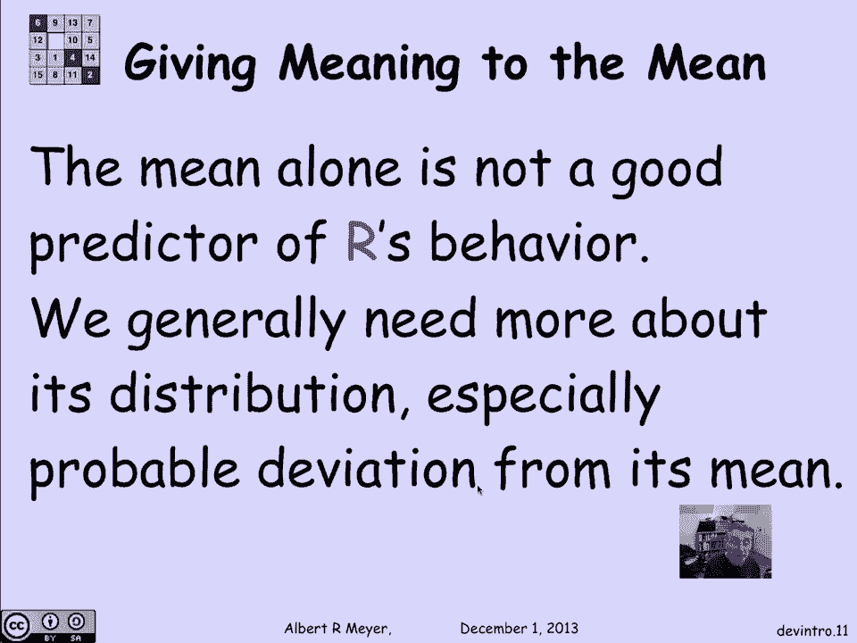
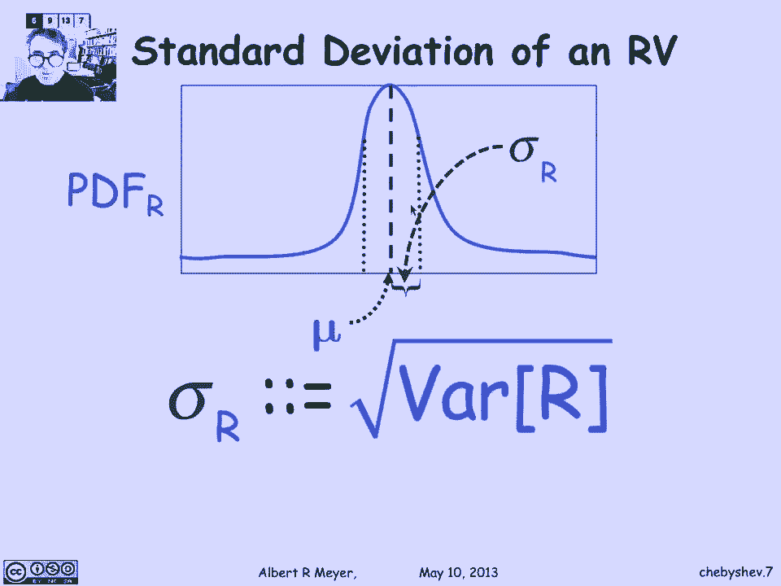
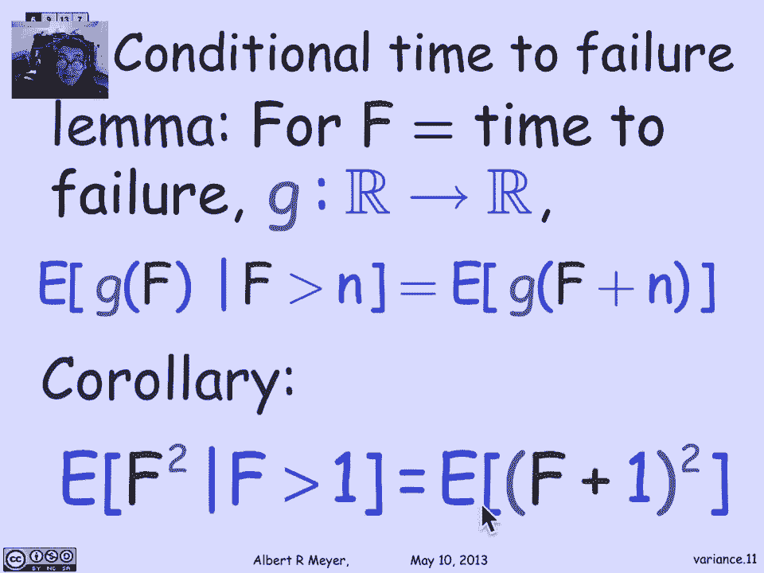
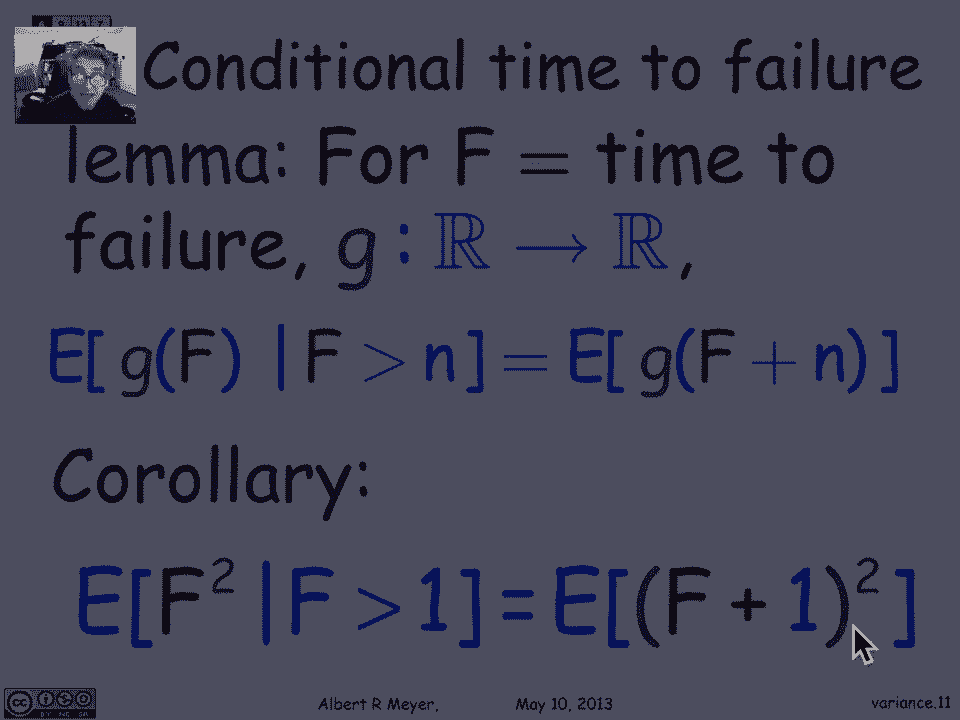
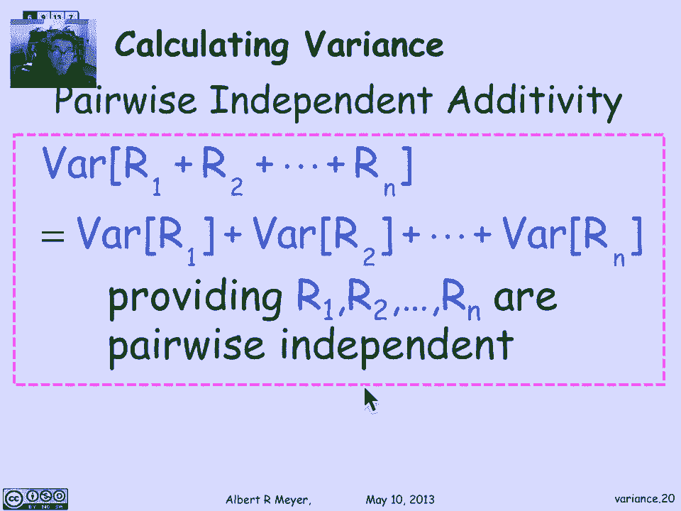

# 【双语字幕+资料下载】MIT 6.042J ｜ 计算机科学的数学基础(2015·完整版) - P97：L4.6 Deviation： Markov & Chebyshev Bounds - ShowMeAI - BV1o64y1a7gT

In the last lecture， we spent time talking about the mean or expectation in its properties。

 most important one being linearity。But let's step back now and think about what is it that the mean means。

 Why do we care about it， We have this intuitive idea that if you do things long enough。

 if you keep experimenting with the same random variable collecting its values。

 Its long run average will be about the same as its mean， Now。

 we're going to try to make that more precise。 So we're going to talk about the topic of deviation from the mean。

 or as I like to say， what does the mean really mean， Why do we care about it。Well。

 let's look at an example that's familiar to get a grip on the specific ideas that we're interested in。

 So suppose I taught us a fair coin 101 times。Then I know that the expected number since all the values from 0 through 101 are possible。

 and the middle value is the expectation。It's 50 and a half heads。 Now。

 I'm never going get exactly 50 and a half heads。 The probability in 1001 flips of getting 51。

50 and a half heads is 0 because there's no way to flip half head。

So you don't expect the expectation in that sense。 No given measurement。

 no given experiment is going to yield the expectation。

 The expectation is this thing that we expect to come out on the average。Well， we can ask。

 what's the probability of getting as close as you could hope to get to the expectation， namely。

 what's the probability of getting exactly 50 heads。And it's about 1，13th。 Or if you ask。

 what's the probability of getting either 50 or 51 heads been being within plus or -1 of the expectation。

 It's about  one，7th。Okay， let's flip more coins and see what happens。 This time。

 I'm going to flip 1000 in one coins。And again， the expected number of heads is 5 and a half。

 which I'll never get exactly。 The probability of getting exactly 500 heads is 1 39th。

 and the probability of getting within one of the expectation。

 That is either 50 or 501 heads is about  one19th。 Now。

 these numbers have gone down from the previous numbers。 Remember。

 it was about one7th and we've gone down to 119th。 So it's actually。

 we're less likely to be within a fixed distance within one of the expectation when we flip more coins。

So as the number of tosses grows， the number of heads gets gets less likely to be within any given fixed distance of the mean。

But things get better when we start looking at percentages。

 So what's the probability of being within 1 per cent of the mean if I tos 1000 and1 coins。Well。

 1 per of 1001 is about 10。 So we're talking about 1 per of the thousand01。

 and the probability of being within 10 of 505。 That is to say。

 the probability of being within 510 and 490。Is about。in49， It's almost 50，50。

 which is not really so bad。 So we have a 5050 chance of actually being within 1 per cent of the expected number When I flip 1001 coins。

So what we can start to say is that when we're trying to give the meaning to the mean。

 if I let mu be the standard abbreviation for expectation of R。

 I'm doing that just so it'll fit on the slide nicely in formula So mu is the expectation of R。

 The basic question we're asking is two basic questions。 One is。

 what's the probability that the random variable is far from its mean muu。

You could praise that as what's the probability that the distance from R to mu。

 the absolute value of R minus mu is greater than some amount x。

 And the second question that we want to ask is， what's the average deviation。

 What's the expectation。OfOf the distance between R minus mu。

 What's the expected value of R minus mu。Now， of course。

 we're trying to make sense of the meaning of the expectation in terms of the expectation of the distance between Orest expectation。

 So there's a little bit of circularity there。 But let's live with it and proceed。

Let's look at an example to crystallize the ideas a little。

 Let's look at two dice with the same mean。 The green dye is going to be a fair。

 a standard fair dye in which each of the numbers  one through 6。

 has an equal probability of showing up and its expected value is exactly going to be the midpoint between one and 6。

 or3 and a2， Now， suppose I look at a loaded dye die 2， which only throws a one or a 6。

 but with equal probability。Then its expectation is also3 and/ half by the same reasoning。

 So here are these two different I。 One takes the values，1 through 6， equally likely。

 and the other takes only the two values 1 and 6， but they have the same expectation。

So how do I capture the difference， Well， if I look at the expected distance of the fair die to its mean。

I claim it's one and a half。But the expected distance of the loaded die from its mean。 same mean。

 Remember 3 and a half is actually 2 and a half。 In fact。

 the second die is always exactly2 and a half from its expected value。

Let's look at the Pdfs to get a grip on understanding what's going on。

 So here's the P Df for the fair die。 The theyre over one through6。 the probability is1，6。

 So each of those green spikes is columns is one，6 high。

 and their total is the one is the probability that the fair dye takes one of those values。

1 through 6 with equally like， with equal likelihood。Now。

 the expected value is exactly in the middle at 3 and a2。 and the average distance of these points。

 Well， you can see that a third of the time you're a distance a half。

 a third of the time that is when you take the values 2 and 5， you are at distance。

 exactly one and a half。 and another third of the time youre at distance，2 and a half。

 when you take one in。6， and that averages out to the middle value of one and a2。

So the expected deviation， the expected distance of the fair die from its mean is one and a half。

 On the other hand， from the loaded die， As we said。

 it's always exactly 2 a half from its expected value。

 which means its expected value is also 2 and a half。

So we can start to see the difference between these two distributions in these two kinds of die by even though they have the same expectation。

 one of them is more likely and has a greater expected distance from its mean and the moral of the short piece is that the mean alone is not a good predictor of a random variables behavior。

 as you might suppose， one parameter。 one number is not going to capture the shape of a Pdf。

 which gives you the more full information about the distribution of values of a random variable。

 And we need some more information than just the expectation。 and especially a valuable。

 extra piece of information， that's still well less than the overall shape of the Pdf of the random variable。

 is knowing its probable deviation from its mean。

The simplest bound that a random variable differs by much from its expectation is due to a guy named Mark of a Russian。

Probability theorist， and this is Markov's bound that we're going to talk about。

 Let's illustrate it with a memorable example of IQ in the MIT context， we it may be a radical idea。

 but IQ was this thing that was invented for intelligence quotient in the late 19th century。

I believe might have been early 20th， It was meant as an effort to break the mold at Harvard of hiring the children of wealthy alumni and the idea was to have merit- based admissions and it was going to be some objective measure that did not depend on social class of the ability that people had in Harvard was going to admit students based on merit and their intelligence quotient。

 so the original design of the intelligence quotient by a bunch of psychologists was that the average was supposed to be 100。

Over the whole population， which of course is around here。

 there just aren't very many people with an IQ of just 100。嗯。Anyway， let's ask this extreme question。

 Yes， there's around the elite universities。 There are a lot of people with IQ is much higher than 100。

 but what fraction of the population could possibly have an IQ as high as 300。

 Now I'm not sure that an IQ of as high as 300 has ever been recorded。

 but we're talking logically here， is it possible for a lot of people to have an IQ of greater or equal to 100。

 And the answer is no， you can't possibly have more than a third of the population have have an IQ of 300。

 because if more than a third had an IQ of 300， then that third alone would contribute one third of 300 to the average。

 which would be greater than 100， so you can't have more than a third of the population have an IQ of triple。

 the expected value of the IQ so。But that's the basic bound。

So we can restate it this way that the probability that a randomly chosen person has an IQ greater or equal to 100。

 we can say is absolutely less than or equal to the expected value of IQ， namely 100 divided by 300。

And just parameterizing it， if we ask， what's the probability that the IQ is greater or equal to some amount x。

 it's less than or equal to 100 over x by exactly that reasoning。

And this is basically Markov's bound。 except there's one implicit fact that we're using in deriving the previous identity or inequality that IQ is bounded by 100。

 Our logic was that you can't have more than population X with an IQ of more than 100 x。

 because that would contribute x times 100 over x or more than 100 to the average and the average is only 100。

 That's only a problem if there are， if there are no negative terms。

 negative IQ is to offset the excess contribution of the fraction of the population that has this high IQ。

 But we're implicitly using the fact that IQ is never negative。 IQ runs from 0。To unlimited amount。

 But it's never negative。 And that means that that contribution from the one thirdhird of the population that has an IQ of over 300 can't be offset by negative values。

 It's there， and it messes up the average。 It forces the average up。

 So we were using the fact that IQ is always non negative。 And by this very same reasoning。

 I'm not going to belabor you with a more formal proof。 there's a trivial one in the text， It's easy。

 the theorem's Markovs bound says that if R is non negative。

 Then the probability that R is greater or equal to x is less than or equal to the expectation of R divided by X。

And this holds for any x greater than 0。 Of course。

 it's silly to state if this bound is is greater equal to1。 It's not an interesting bound。

 since probability is never greater or equal to 1。 So we might as well just restrict ourelve to x's that are greater than the expectation of R。

 because those are the only x's that are going to give us a non trivialal bound。

 That's less than one。Again， if R is non negative， then the probability that r exceeds an amount x is less than or equal to the expectation of R over x。

And that's the Markov bound。 If you restate it in terms of deviation from the mean and you could formulate it this way。

 The probability that R is greater than equal to a constant times its mean U is an abbreviation for the expectation of R is less than or equal to one over C。

 So now we can understand that as a bound on the deviation from the mean above the mean in this case。

 that R as as the factor of the expectation increases， the probability decreases proportionally。

So of the probability that R is greater or equal to three times the expected amount is less than or equal to a third。

 which was what we saw with thee。IQ example。So look this Markov bound in general is very weak。

 As I said， I don't think there's ever been an IQ recorded that was as high as 300 and in almost all the examples that you come across there' will be other information that allows you to deduce tighter bounds on the probability that a random variable is significantly bigger than its expectation。

 but if you don't have any information about the random variable other than that it's non negativegative。

 that as a matter of fact， Markov bound is tight， you can't possibly reach a stronger contribution because there are non-neg random variables where the probability that they are greater than or equal to a given amount x is in fact。

 equal to their expectation divided by x。 So the Markov bound is weak in application but it's the strongest condition you can make on the very limited hypotheses that it makes about properties of the random variable。

 and it's also pretty obvious， I hope。From this examples that we've talked about。

 But the amazing thing is how useful it is。 we will get mileage out of it by using it in clever ways。

 So let's talk about the first clever way。 and suppose that we're thinking about IQ is greater or equal to 100。

 but I bring into into the story， another fact that we haven't mentioned before， which is。

 let's suppose that as a matter of fact， IQs of less than 50， just don't occur。

 I think they might actually， but but there's a certain point where you just are not functioning at all。

 and it's not clear that it makes sense to ever talk about somebody who's in a coma as having an IQ。

 maybe they have an IQ of 0。 But let's assume that pragmatically IQ is never less than or equal to 50 okay。

😊，Now， if， if I tell you that I know that IQ is greater or equal to 50。

 then I can actually get a better bound out of Markov， because now。

 knowing that IQ is greater than equal to 50， Iq-50 is becomes a non negative random variable。

 which I couldn't be sure it was before because IQ might have gone below 50。

 Now that I know that it's always above 50， Iq-50 is non negative and Markov's bound will apply to Iq-50。

 And applying it to Iq-50 will give you a better bound because now looking at the probability that the Iq is greater or equal to 100。

 Of course， that's the same as saying that Iq-50 is greater or equal to 300-50。😊，W whichch。50。

 the average expected value of I Q -50 is 100-50。 So we're asking whether this non negative random variable is greater than or equal to 250。

 the answer is， that's less than or equal to。Its expectation over 2，50， which is。1 fifthth。

50 over 250。 And that's a tighter bound than the one third we had previously。

 This is a general phenomenon that you get in that helps you get slightly stronger bounds out of Markov's bound。

 namely， if you have a non negative variable， you get a better bound on it by shifting it so that its mean is 0。

 As a matter of fact， even if it goes negative， if you shift it up。

 you can if you can force it to above 0， as a minimum， then you can apply Markov's bound to it。

Our topic is deviation from the mean， meaning the probability that a random variable returns a value that differs significantly from its mean。

Now the Markov bound gave you a coarse bound on the probability that R was overly large using very little information about R。

 not surprisingly if you know a little bit more about the distribution of R than simply that it's non- negative。

 you can state tighter bounds。And this was noticed by a mathematician named Chebychev。

 and he has a bound called the chbiachev B。 Now it's interesting that the Markov bound。

 even though it's very weak and seems not very useful。 the chbychev bound。

 which generally gives you a significantly stronger and valuableuably stronger bound on the probability that a random variable differs much from its mean is actually a trivial corollary of Markov's theorem。

 So it's just a very simple ingenious way to use Markov's bound to derive chbychev's bound。

And let's look at how。So we're interested in the probability that a random variable R differs from its mean by an amount x。

 the distance between R and its mean， the absolute value of r minus mu is greater than equal to x。

 we're trying to get a grip on that probability。As a function of x。

 now the point is that the event that the distance between R and its random and its mean is greater or equal to x。

Another way to say that is to square both sides of this inequality。

 It says that the event that R minus mu squared is greater or equal to x squared happens。

 These two events are just different ways of saying the same thing。 So therefore。

 their probabilities are equal trivially。Now what's nice about this is of course。

 that r minus mu squared is a non negative random variable to which Markovs theorem applies。

The square of a real number is always going to be non negative。

So let's just apply Markov's theorem to this new random variable r minus mu squared。

And what does Markov's bound tell us about this probability that the square variable is greater than equal to n amount x squared。

 Well， just plug in Markov， and it tells you that this probability that the square variable is bigger than by x squared。

Then it's as big as x squared is simply the expectation of that squared variable divided by x squared。

 This is just applyinging。Markovs bound to this variable R minus mu squared。Now this numerator。

Is a weird thing to stare at expectation of R minus mu squared and may not seem very memorable but you should remember it because it's so important it has a name all its own it's called the variance of R and this is an extra bit of information about the shape of the distribution of R that turns out to allow you to state much more powerful theorems in general about the probability that R deviates from its mean by a given amount。

So we could just restate the chebychev bound， just replacing that expectation formula in terms of its name variance of R。

 this is what the chbychev bound says。 the probability that the different distance between R and its mean is greater equal to x is the variance of R divided by x squared where variance of R is the expectation of the square of R minus mu Now the very important aspect technical aspect of the chebychev bound is that we're getting an inverse square reduction in the probability。

 remember with Markov the denominator was behaving linearly and here it behaves quadraically。

 So these bounds gets smaller much more rapidly as we ask about the probability of differing by a larger amount。

The variance of R maybe in a way that will help you remember it is to remember another name that it has it's called the mean square error if you think of r minus mu as the error that r is making in how much it differs from what it ought to be then and we square it and then we take the average so we're taking the mean of the squared errors。

And here we're back to restating the Markov bound in terms of the variance。

The variance has one difficulty with it， and that leads us to want to look at another object。

 which is just the square root of the variance called the standard deviation。 So you wonder why。

 I mean， if you understand variance， what's the point of taking the square root and working with that And the answer is simply that if you think of R as a random variable whose values have some dimension like it's seconds or dollars。

 then the variance of R is the expectation of a square variable of r minus mu squared。

 which means its units are second squared or dollar squared or whatever。

 and the variance of r itself is a squared value， which is not reflecting the magnitude of of the distance that you the kind of errors that you expect R to make。

 the distance that you expect R to be from its mean So we can get the units of this quantity back into matching the units of R。

RAnd also get a number that's closer to the kind of variance that you'd expect to observe by just taking the square root。

 And it's called the standard deviation of R。 If it helps you。

 the standard deviation is also called the root means square error。

 And you might have heard that phrase。 It comes up all the time in discussions of experimental error。

 So again， we're taking the error means the distance between the random variable and its mean。

 We're squaring it， we're taking it the expectation of that square error。

 And then we're taking the square root of it。 It's the standard deviation。

So going back to understand what the standard deviation means intuitively in terms of a familiar shaped distribution function for a random variable R。

 suppose that R is a random variable that has this fairly standard kind of bell curved shape or Gaussian shape that it's got one hump。

 it's unimmodal and it kind of trails off with some moderate rate as you get further and further away from the mean well the mean of a distribution that's shaped like this it's symmetric around that that high point is that's going to be the mean by symmetry。

 it's equally likely to be well the value is average out to this middle value。

Stand deviationation for a curve like this is going to be an interval that you can interpret as an interval around the mean and the probability that you're within that interval is fairly high for standard distributions。

 No， we'll see that。The chmney chip band is not going to tell us much about for an arbitrary unknown distribution。

 but in general， for the typical distributions， you expect to find that the standard deviation tells you that that's where you're most likely to be when you take a random value with a variable。

So let's return to the chbychev bound as we've stated it。 and I'm just replacing here。

 I'm restating the chebychev bound just replacing the variance of R in the numerator by the square of its square root by sigma squared R。

 It's a useful way to restate it because by restating it this way and motivates another reformulation of the chbychev bound as we reformulated the markov bound previously in terms of a multiple of something I'm going to replace x by a constant times the standard deviation So I'm going to see the probability that the error is greater than or equal to a constant times the standard deviation。

 and this term is going to simplify once x is is a constant times the standard deviation。

 the standard deviations are going to cancel out and I'm just going to wind up with one over x squared。

 So let's just do that。And。There's the formula， the probability。

That the distance of R from its mean is greater than or equal to a multiple C of its standard deviation is less than or equal to one over C squared。

 So it's getting。More much more rapidly smaller as sea grows。あ。

Let's look at what that means for just some numbers to make the thing a little bit more real。

 what this assertion is telling us is that R is probably not going to return a value that's a significant multiple of its standard deviation。

For example， what does this formula tell us about the probability that R is going to be greater than or equal to one standard deviation away from its mean。

 Well， it actually tells us nothing。 that's the case in which it's no good because C is one is just telling us that the probability is at most one which we always know because probabilitybabilities are at most one。

 But if I ask what's the probability that the mean the error of R is greater than equal to twice the standard deviation。

 then this theorem is telling me something nontrivial。

 It's telling me that the probability that it's twice the deviation is one over two squared or one quarter。

 an arbitrary random variable with standard deviation sigma is going to exceed twice the error is going to exceed twice the standard deviation of most the quarter of the time。

 three times at most the9 of the time， four times at most the 16th of a time。

 So the qualitative message to take away is that for any random variable whatsoever。

 as long as it has a standard deviation sigma。Then you can say some definite things about the probability that the random variable is going to take a value that differs by a large multiple of the standard deviation from its mean。

That probability is going to be smaller and gets smaller and rapidly smaller as the multiple of the standard deviation continues。

If we're going to make use of Chey Chev's Bo and other results that depend on the variance。

 we'll need some methods for calculating variants in various circumstances。

 so let's develop that here。A basic place to begin is to ask about the indicator about indicator variables in their variance。

 remember， I as the indicator variable means that it's 0，1 valued。

 It's also called a Bnoulli variable。 And if the probability that it equals1 is P。

 that's also its expectation。 So we have an indicator variable with expectation of the indicator is P。

 And we're asking what's its variance， which， by definition is the expectation of I minus p squared。

 Well， this is one of these sort of almost mechanical proofs that follows simply by algebra and linearity of expectation。

 but let's walk through its step by step， just。To reassure you that that's all that's involved。

 I would recommend against， really trying to memorize this because it's。

 I can never remember it anyway。 I just reprove it every time I need it。

 And so let's see how the proof would go。 So step 1 would be to expand this I minus p squared algebraically。

 So we're talking about the expectation of I squared 2 p I plus p squared。

 Now we can just apply linearity of expectation。 And I get the expectation of I squared 2 p times the expectation of I plus p squared。

 Of course， the expectation of a constant is the constant。 So when I take expectation of p squared。

 I get p squared。 But now， look at this。😊，I squared is 0，1 valued。 So， in fact。

 I squared is equal to I。 And the expectation of I has now appeared here。 That's P。

 So this term simplifies to expectation of I， And this term becomes 2 P times p plus P squared。 Of。

 that expectation of I is a P。 I got P minus 2 p squared plus P squared。 the p squares cancel。

 And I get P minus p squared。 If you factor out P， that's p times 1 minus P or P Q。

 which is the standard way that you write the variance of an indicator variable。

 It's p times 1 minus P。😊，Okay， that was easy and again， completely mechanical。

There is a couple of other rules for calculating variance of new variables from old ones that are basic。

 like addivity of expectation， but it doesn't quite work so simply for variance。

 So the first rule is that if you ask about the variance of a constant times r plus B。

 that turns out to be the same as a squared times the variance of B of the R。

 the B doesn't additive B doesn't matter And because the variance is really the expectation of something squared when you get rid of that constant A。

 you're factoring out in a squared。 and this is the rule that you get here。

Another basic rule that's often convenient instead of working with variances in the form of the expectation of r minus mu squared is to say that it's the expectation of r squared minus the square of the expectation of R。

Now， this expression， the square of the expectation of R comes up so often that there's a shorthand for it where instead of writing parends。

 you write e squared of r just means the same as expectation of r squared。

 and so much for the second rule， which we'll use all the time because it's a convenient rule to have。

 I'm going to prove the second one， just again， to show you nothing to worry about。

 you don't even have to remember how the proof goes because you can reconstruct it every time。

 So this it's， again， simple proofs just by linearity of expectation and doing the algebra。

 So the variance of R is by definition， the expectation of r minus mu squared。

 Let's expand r minus mu squared。 It's the expectation of r squared minus2 mu R plus mu squared。

 Now we apply linearity to that。 I get the expectation of r squared minus2 mu expectation of R plus the expectation of mu squared。

 if I'm really being completely mechanical about linearity。Expectation。

 Now expectation of a constant mu squared is simply mu squared。

 And here I've got the expectation of R。 That's mu again。

 So I wind up with the expectation of r squared -2 mu mu plus R squared。 The this is2 mu squared。

 minus-2 mu squared plus mu squared。 it winds up with minus mu squared。 And， of course。

 mu squared is the expectation squared of R。 I prove the formula again。

 as claimed there's nothing interesting here。 just algebra and linearity of expectation。😊。

And the first result about factoring out in A and squaring it follows from a similar proof。

 which I'm not going to include here。So let's look at the space station mirror again。

 which we used as an example of calculating mean time to failure。

 So the hypothesis that we're making is that with probability P。

 the mere space station will run into some huge space garbage that will collaborate and the probability of that happening at any given hour is probability P。

So we know that that means that the expected number of hours for the mere to fail is one overpay。

 That's the mean time to failure。 And what we're asking is， what's the variance of F。

 If F is the number of hours to failure， what's variance of F。Well。

 one way we can do is just plug in the definition of expectation and this will work。

 The probability that it takes k hours to fail is we know the geometric distribution。

 The probability of not failing for k minus1 hours and failing after that Q to the K minus-1 times p。

 So the variance of f using our previous formula about the expectation of f squared minus the expectation squared of f。

 This becomes a minus1 over p squared。 and we can forget about that。

 We want to focus on calculating the expectation of f squared。 So F is 1，2，3 and so on。

 that means f squared is 1，4，9 K squared。 the point being that the only values that f squared can take r squared。

 So we don't have to worry about counting them in in the sum that defines the expectation。

 So let's go look at that。 So the expectation of f squared is the sum over the possible values that f。

squared can take， namely the sum from k equals 1 to infinity of k squared times the probability that f squared is equal to k squared。

 Well， of course the probability that f squared is equal to k squared is the same as the probability that f equals k so I and we know what the probability that f equals k as it's a geometric distribution。

 So the probability that f equals k isq to the k minus1 times p if I factor out a p overq this simplifies to the sum from k equals0 to infinity of k squared Q to the K and this is a kind of sum that we've seen before and that it has a closed form and we could perfectly well calculate then the expectation of f squared by appealing to our generating function information to get a closed form for this and then remember to subtract1 minus p squared because the variance is this term minus the squared of the expectation of f。

 but let's go another way and use the same technique of total。Expectation that we used before。

 That is the expectation of F squared of the failure times squared is equal by the law of total probability to the expectation of F squared。

 given that F is one。That is we fail on the first step times the probability that we fail on the first step。

 Plus， the expectation of F squared， given that we don't fail on the first step that F is greater than one times the probability that F is greater than one。

 Now， what's going to make this manageable is that this expression。

 the expectation of F squared when F is greater than one will turn out to be something that we can easily convert into a nonconditional probability and find a value for。

 So the limit that we're using here is the following。 when I'm thinking about mean time to failure。

 If I think of any function whatsoever， G of the mean time to failure。

 And I'm interested in the expectation of G of F。And I'm interested in the expectation of G of F。

 given that F is greater than N。 that is， it's already taken n steps to get where I am。

 Then the thing about the meantime to failure is that at any moment that you haven't failed。

 You're starting off in essentially the same situation you were at the beginning in waiting for the next failure to occur and the probability of failing in one more step is the same probability is the same P and the probability of your failing in two more steps is Q P and three more steps is Q Q P。

 The only difference is that the value of F has been shifted by N。

 It was in the ordinary case we start off with F equals 0。

 And look at the probability that we fail in one more step， two more steps。

 Now we're starting off with F having the value F plus N and asking about the probability it fails in the next step or the next step。

 when the next step。 So the punch line is that the expectation of G of F。

GivenThat F is greater than n is simply the expectation of G of F plus n。

And I'm going to let you meditate that and not say any more about it。

 But the punch line is the corollary， that the expectation of F squared。

 given that F is greater than one is simply the expectation of F plus one squared。

 And that lets us go back and simplify this expression。

 that we had from total expectation we now have， here's the expectation of F squared。

 given that F is greater than one。 And let's look at these other terms。

 this is the expectation of F squared， given that F equals1。 Well， the expectation of F squared。

 given that F equals1 is one squared， because we know what F is and that's the end of the story。

 times the probability that F equals1， that's P， the probability of failure on a given step。

 This is the probability that F is greater than one。

 which is Q that we didn't fail on the first step。 And we just figured out that this term is the expectation of the square of F of。

😊。

F plus 1。 So there's the one in the P。 And that becomes a Q。

 And this is the expectation of F plus one squared。 Now， again， I apply linearity。

 I'm going to expand F plus1 squared into F squared。Plus to f plus1。

 and then apply linearity of expectation。 and I'm going to wind up with the expectation of f squared plus twice the expectation of F。

 which remember is twice over2 over p plus1 times the Q。

 And now what I've got is a simple arithmetic equation between the expectation of f squared。

 and some other arithmetic and the expectation of f squared。

 It's easy to solve for the expectation of f squared。

 and I'll spare you that elementary simplification。

 but the punch line is when we also remember to subtract1 over p squared because that was the expectation of the square of F of the expectation of F。

 we come up with this punch line formula。 The variance of mean time to failure is1 over the probability of failure on a given step times1 minus1 over the times the probability。

1 over the probability of the failure in the first step minus-1。All right。

 let's just for practice and fun。 Let's look at the space station mirror again。

 Suppose that I tell you that there's a one in 10000 chance that in any given hour。

 the mirror is going to crash into some debris that's out there in orbit。 Now。

 So the expectation of F is 10 to the  fourth， about 10000 hours。

And the sigma is going to be the variance of of F， which is about one over。1，10000。

 That is 10000 times 10000-1， which is pretty close to 10000 squared for the variance。

 And then when I take the square root， I get back to 10000。

 So Sigma is just a tad less than than 10000 It's 10 to the fourth。 So with those numbers。

 I can apply to the chbychev theorem。 and conclude that the probability that the mere lasts more than 4 times 10 to the fourth hours is less than  one chance in  four。

 And we translate that into years。 If it was really the case that there was a  one in 10000 chance of the mere being destroyed in any given hour。

 then the probability that it lasts more than 4。6 years before destructing is less than one quarter。

So another rule for calculating variance and maybe the most important general one is that variance is additive。

 That is the variance of a sum is the sum of the variances。

 But unlike expectation where there's no other side condition。

 and it does not in any way depend on independence。

 it turns out that variance is additive only if the variance being added， are pairwise independent。

 Now you might wonder where the pairwise came from。

 and it's because variance is the square of an expectation。

 So when you wind up multiplying out and doing the algebra。

 you're just getting quadratic terms for variances for expectations of R times Rj。

 And so you need to factor those into expectation of R times R times expectation of Rj。

 which only need pairwise independence for。 So that's a fast talking through the algebra that I'm going to leave to you。

 it's in the text and it's again， one of these easy。

