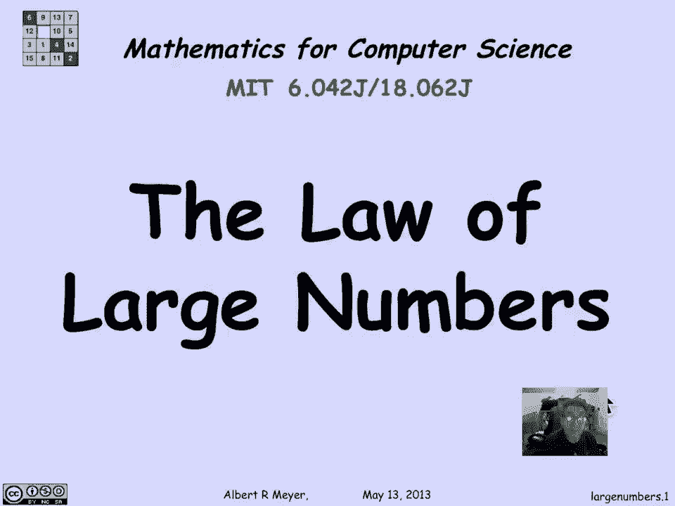
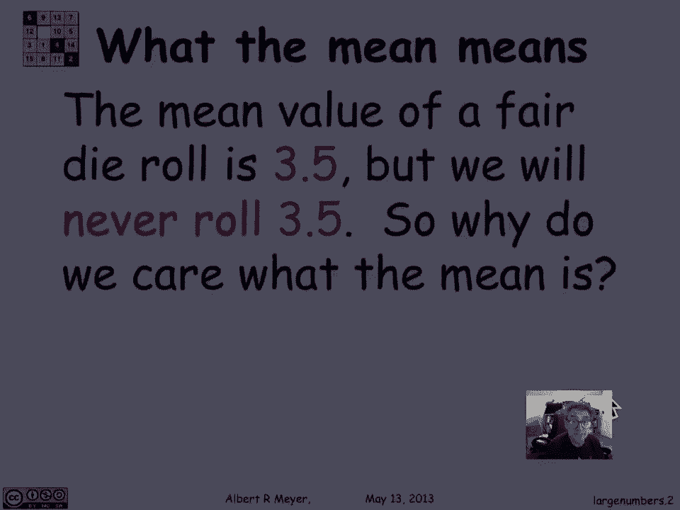
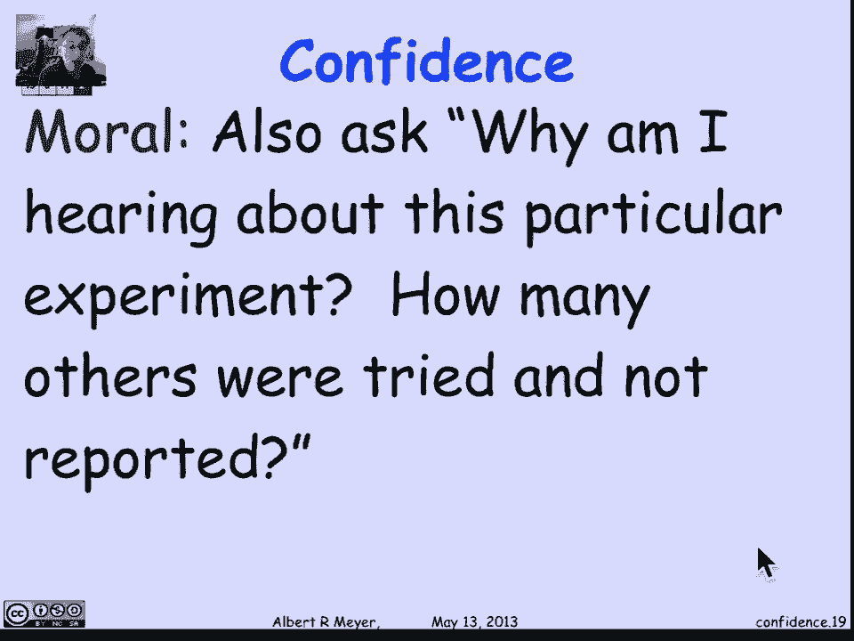
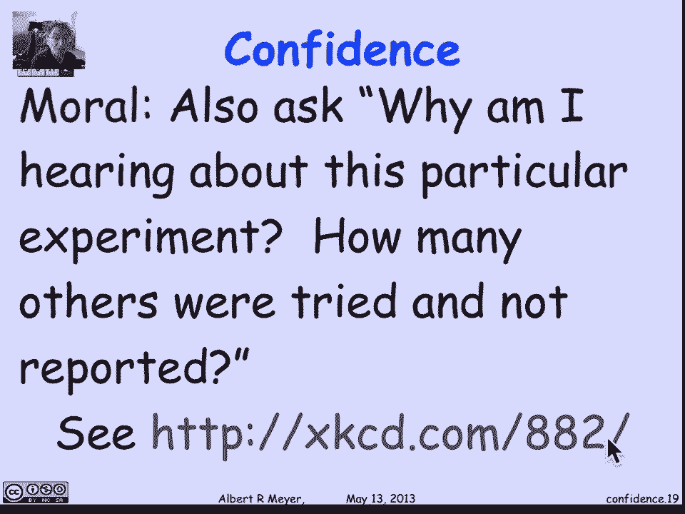

# 【双语字幕+资料下载】MIT 6.042J ｜ 计算机科学的数学基础(2015·完整版) - P98：L4.7 Sampling & Confidence - ShowMeAI - BV1o64y1a7gT

大数定律给出了一个精确的，概率论基础上的基本直觉思想的正式陈述，尤其是我们对随机变量及其期望的兴趣。

他们的手段。

所以让我们从问平均值是什么意思开始，为什么我们对它这么感兴趣，比如说，如果你掷出一个正面从1到6的骰子，平均值它的期望值是3。5，你永远不会滚三个半，因为没有三张半脸，那么我们为什么要关心这意味着什么。

如果我们永远不滚动它，答案是我们相信在经历了许多角色之后，如果我们取骰子上显示的数字的平均值，快三点半了，让我们看一个更基本的例子，我们，如果这是一个公平的死亡，和任何其他数字一样。

滚6的概率是六分之一，滚6的概率是1 6，我们希望如果你滚动很多次，如果你滚N次，6的分数会在6左右，然后超过6，6的分数大约是n个角色的六分之一，你大约会得到n/6。

这几乎是我们的意思背后的定义或直觉想法，当我们给某个结果分配概率时，如果我们反复做，它出现的次数等于它的概率，或者至少从长远来看与之接近，所以让我们看看雅各布·伯努利，谁是大数定律的发现者。

在这个问题上不得不说他出生于1659年，死于1705年，和他的名著，猜测或推测的艺术，实际上是在死后出版的，他和伯努利说，即使是最愚蠢的人，自然本身的某种本能，也没有以前的指示，这真的很神奇。

可以肯定的是，观察到的越多，偏离目标的危险就越小，所有的权利，他是什么意思，嗯，这是我们刚才说的，如果你滚动公平死亡n次，一卷的概率是六分之一，那么6的平均数，也就是6除以n。

我们直觉地认为这个数字将接近六分之一，当n接近无穷大时，这就是伯努利所说的，每个人都明白他们直觉上对此很确定，谁知道他们是怎么想出来的，但大家都这么想，他现在可能就在，当然啦，当你做这个滚动n次。

数6的实验时，看看分数是否接近六分之一，你可能会倒霉，你可能会得到一个平均值，这实际上是一个性别，但那将是不幸的，问题是这有多不可能，你会得到一个号码吗，六的几分之一，那还没有接近六分之一。

用大数定律来掌握这一点，事实上，随后我们将得到一个更均匀的定量控制，这对抽样和假设检验的应用至关重要，但让我们继续，所以让我们看看一些实际的数字，我计算过，如果你掷骰子n次，其中n是666，一千二百。

三六千，你在10%以内的概率，这里给出了预期的六数，原来，当然为了在十分钟内，如果你要滚六次，唯一的方法是在你应该滚动的预期六的10%以内，就是把一个，六次尝试中有六次，这种可能性大约是百分之四十四。

因为你可以很容易地检查自己，那么如果你把一卷翻转60次，在六十六之间的概率，对不起，60个角色的预期数量将是10个，所以有百分之十或九到十一的可能性，六是二六，同样，有百分之十的概率，这是预期的6数。

当你翻滚六百次，是点七二，以此类推，直到最后在一千的百分之十以内的概率，当你滚动6000次时，这是预期的数字，那是在九百到一千一百之间，六千卷六个，呃是九点九，九个三个九，事实上它有点大。

所以真的只有千分之一的机会，你的六位数不会在那个间隔内下降，在预期数的百分之十以内，嗯，假设我要求更严格的容忍，我想知道，在五分钟之内到达的可能性有多大？嗯，首先注意，当然，随着角色数量的增加。

在这个给定区间的概率越来越高，这就是伯努利说的，我们直觉上相信的，角色越多，你越有可能接近你所期望的，嗯，如果你收紧公差，当然啦，然后概率就会变小，你会做得很好。

所以如果你想在六卷中达到平均水平的5%以内，意思是你仍然要精确地掷出一个六，这意味着概率仍然是第四点，但如果你试图在预期数字的5%以内，十个和六十个角色，意思是五到十五之间，概率只有1/4。

与二六分之一的概率相比，如果我们从这里跳下去，说三千卷，在五百的百分之十以内的概率，这是三千分之一的预期数字，百分之十以内的滚动是九十八点九十八，但在500的5%以内，哦，七点，八，大约四分之三多一点。

那么这告诉了我们什么，意思是如果你滚三千次，你没有达到预期的500人的10%，也就是，你没有进入中场休息，四百五十到五百五十六之间，你可以有98%的信心你的骰子已经装满了，它不是，呃。

加权六分之一表示六，同样，如果你没有在四百二十五和五百二十五之间，三千卷六分，你可以有78%的把握你的骰子已经装好了，这就是为什么大数定律对我们如此重要，因为，啊，它允许我们做一个实验，然后评估。

我们的想法是否正确我们在这个实验中得到的结果证实了这一点，让我们继续看看伯努利在他的时代还关心什么，当然，在观察次数增加后，是否还有待询问，获得真实比率的概率最终超过任何给定的确定性程度。

或者问题是否有，可以这么说，它自己的渐近线，那就是，是否给予一定程度的确定性，一个人永远无法超过，17世纪的英语，可能有点难解析，所以让我们把它翻译成数学语言，伯努利在问什么。

所以伯努利的意思是他想考虑取一个随机变量r，具有mu的期望或平均值，他想对R进行n次试验观察，取这些观察结果的平均值，看看它们与μ有多接近，好的，什么是什么在制造什么，和试验观察在形式上意味着。

我们要捕捉它的方式是，我们会考虑有一群相互独立的，同分布随机变量r 1到rn这个短语同独立，同分布经常出现，以至于有一个标准的缩写，IID随机变量，所以我们要有N个。

把这些看作是我们对给定随机变量r的n次观察，所以R 1到R，每一个都有与r完全相同的分布，它们是相互独立的，因为它们有相同的分布，它们的均值μ和我们要研究的随机变量r是一样的。

所以我们模拟了N个独立的试验，重复的试验，说我们有n个随机变量，好了，现在，伯努利的建议是取n个随机变量的平均值，所以你用r的和取r，R2向上到Rn除以n，这是平均值，叫那个潜艇n。

n个滚动的n个观察值的平均值，如果n很大，那到底是什么意思可能接近穆，意味着平均值与亩之间的距离小于，或者等于Δ就是Δ所说的，你离得有多近，delta是一个参数，我们希望它一定是积极的，我们在问。

想想亲密对你意味着什么，这是不是意味着一点，这是不是意味着零点一，多少钱能说服你，平均数接近应有的水平，我们问，那么平均值和平均值之间的距离是否接近，小于或等于delta，伯努利想知道，那可能性有多大。

嗯，他接着说的是，因此，这就是我现在提出并说明的问题，在我思考之后，琢磨了二十年，它的新奇和非常有用，再加上它的巨大难度，在重量和价值上都可以超过，本论文剩余的所有章节。

现在伯努利关于这个结果的用处是正确的，至少在数量形式上，当时对他来说真的很难，他花了大约两百页的时间在我们的Conjehani完成了他的证明，现在我们将在一个讲座中做这件事，价值的材料。

在随后的一些视频片段中，你会看到这一点，所以这就是发生的事情，用300年或350年来调整结果，什么花了两百页，那么现在需要十页或更少的页面，事实上，如果它真的很简洁，它可以在三页内完成，所有的权利。

所以再一次，回到伯努利的问题，伯努利的问题是平均的概率是多少，平均值与平均值之间的距离小于或等于delta，当你做了越来越多的尝试，当n趋于无穷大时，伯努利对这个问题的回答是，概率是，用。

如果你做了足够的试验，你想怎么确定就怎么确定，你想怎么亲近就怎么亲近，这就是所谓的弱大数定律，这是基本的，呃，概率论的先验规则与定理，它通常是以另一种方式陈述的。

因为平均值离平均值有一段距离的概率的极限，它的概率，这是极不可能的，它可以像你想做的那样不太可能，从平均值来看，这比任何给定的容忍度都要大，好像你现在已经做了足够多的试验，以这种形式，它还没有真正有用。

这是一个浪漫的定性极限极限结果，并真正使用它，你需要知道一些关于它接近极限的速度，这就是我们将在随后的视频中看到的，事实上，这一点的证据很容易从切切夫身上得到，不平等，绑定，和方差性质。

当我们试图得到定量版本来解释，接近极限的速率，现在我们准备证明大数定律，当我们得到一个定量版本的时候，这将是我们抽样和估计理论的基础，所以让我们记住大数定律说，如果你有n个独立的。

均值为mu的同分布随机变量，设a n为其平均值，那么对于每一个正数delta，平均值与平均值相差大于delta的概率为零，随着审判数量的增加，记住这意味着如果你告诉我你认为亲密意味着什么，嗯。

你认为很可能意味着什么，那么我可以保证通过做足够的试验，公差就像你认为的那样小，我们准备好证据了，但在证据中，我们将使用一个额外的，我们没有明确提到的，也就是说，所有这些随机变量不仅是同分布的。

而且是独立的，但我们实际上要假设它们现在有一个方差，不是每个随机变量都有有限方差，即使它有有限的平均值，事实上，有些随机变量甚至没有有限均值，我们会在最后一天上课的时候看他们，但如此，我们将明确地假设。

所有这些随机变量都有相同的方差，即标准差西格玛的平方，我们将用这个事实来证明，现在要问的第一个问题是平均值的期望值是多少，平均值的期望值只是期望值，让我们证明平均值的期望值是，根据定义。

r的和在n上的期望值，和期望的加性，这是每个r的期望值之和，n，但他们每个人都有期望，所以分子是nμ，两端相消，所以，果然，平均值与每个单独变量的期望值相同，每一次审判。

现在让我们把Cheichev绑定到随机变量a n上，因为现在我们知道它的均值是什么，它的均值与n无关，我们可以问，我们可以将Cheichev应用于n次试验的平均值，与平均值相差大于delta。

根据切比雪夫的说法，以平均值的方差除以n的平方为界，所以我将证明大数定律，如果我能证明n接近无穷大时的极限，方差为零，因为这意味着右手边将在△的平方上归零，就是归零，这就是大数定律所说的。

所以我们减少了大数定律的证明，证明当n接近无穷大时方差为零，其中n是n个同分布变量的平均值，具有公共均值mu和标准差sigma，嗯，让我们计算n的方差，这是平均值，n的r之和，既然我们假设R是独立的。

在某些规则中的变化，它只是告诉我们这是方差的总和，如果我们现在把r 1除以n，这是这个和的n倍，当我们从方差中减去一个常数时，它是正方形的，所以这里的分母变成n的平方，这很关键，分子是n个方差的和。

每个方差都是sigma的平方，我们有n个方差，所以我们得到n西格玛的平方除以n的平方，也就是，当然啦，等于n的西格玛平方，西格玛平方是一个常数，n趋于无穷大，所以可以肯定的是，当n增加时，右手边为零。

这就是我们现在要完成弱大数定律所需要做的，如果我们回去看看这个证据，它唯一使用的关于R的东西，他们有同样的平均亩，它们实际上有相同的方差，西格玛西格玛平方，他们认为方差是加上的，这是证明的关键一步。

那个，r之和的方差，等于现在方差的总和，方差的可加性只要求成对独立性，它甚至不需要假设它们是相互独立的，它不需要我们以前经历过的证据，从来没有使用过R的分布相同的事实，它们不需要相同的分布。

它们有相同的意思就足够了，我们可以总结我们真正证明的，当我们认为我们在证明大数定律时，我们实际上证明了一个精确的定量定理，它说如果R，一到rn是具有相同有限均值的成对独立随机变量。

μ和方差sigma sigma平方，我们设n是这n个变量的平均值，则平均值与平均值相差大于delta的概率小于，或者等于我们在n次上导出的这个定数，△平方上的sigma，这就是我们以前证明的。

当我们以为我们只是在证明大数定律时，我们实际上得到了这个更严格的定量定理，这告诉我们如果你告诉我三角洲是什么，你告诉我你希望它有多小，我知道我给了西格玛什么，我和你给我你指定的三角洲。

因为如果你告诉我你想要这个有多小，我会知道该选多大的N，所以这告诉我一个有多大的样本，我需要试几次，我得做，为了得到平均值在指定公差内的概率，指定的小增量，这就是我们的独立采样理论。

这就是为什么它被称为独立采样，因为我们现在知道估计任何随机变量的平均值需要多大的样本，以任何期望的公差和任何期望的概率，或者方差必须是有限的，容忍度必须是正的，公差为Delta，概率必须小于1。

现在你可以，你可能还记得关于生日悖论的讨论，也就是说，如果你有一个由两个七个随机的人组成的小组，呃，概率几乎是三分之二，他们中的一些人会有一个匹配的生日，即使一年有三百六十五个生日。

你可能会草率地认为有两个七个人，只有三分之二，六十五或者类似的机会，实际上是三分之二，当你达到110人的班级时，这就是将要发生的，我们有数据，我们将看到，事实证明，这种可能性几乎是75万比一。

你会有几个生日相配的人，所以今天让我们再来看看匹配的生日问题，我们关注它的原因是因为它，这是一个可爱的例子，真正存在成对独立而不是相互独立的地方，所以它强化了方差加性背后的关键思想，两两独立采样定理。

我们不打算在这里使用采样定理，但只是两两独立，但在我走得更远之前，现在值得一看，让我提一下这个，生日问题只是我们为了好玩而做的，但事实上，它在不止一个领域有一些真正的应用。

但最著名的一次是对加密系统的所谓生日攻击，它包括能够用相对较小的样本搜索匹配的钥匙对，你很可能会找到至少两个匹配的，所以有了这种动机，但未审查，让我们回去想想生日，好的，所以让我们假设我有一群N人。

一年中有d天，只是为了让参数保持抽象，不要太纠结于数字，保留这些参数实际上可以更清楚地推理，所以我们在这里隐含地假设，每个人都是一个随机变量，或者是生日的随机选择，所以这些人中的每一个都是随机变量。

返回生日的值，事实上，我们将假设所有的生日都有同样的可能性，真正的生日并不存在，他们往往是一月往往是一个受欢迎的月份，十一月往往是比其他时间更受欢迎的月份，但让我们忽略这一点，因为如果加密中的应用程序。

东西真的是统一的，它使我们的分析变得可信，这仍然是合理的，但很容易，如果我们假设生日的可能性相等，好的，P是在这个n人的人口中匹配的生日对数，好的，通过把p看作指标变量的和来掌握它。

所以让ij作为指示变量，N人中的第I个和第J个有一个匹配的生日，嗯好吧，呃，匹配的生日数量是，然后简单地把所有可能的人对加起来，他们是否有一个匹配的生日，它是这些指标变量的总和，i，j。

这些指示变量的数目为，当然，从N个人中选择两个的所有方法，所以简而言之，如果我看i j的期望值，让我们考虑一下，一分钟，我们假设所有的生日都有同样的可能性，所以我在问第i个和第j个，人们的生日是一样的。

嗯，不管这个人的生日是什么，假设是11月5日，第J个有相同概率等于任何生日的人，仍然有均匀的概率，只有一次机会赶上11月5日，正好是我的生日，好的，所以简而言之，期望任意两个人有一个匹配的生日的概率。

是D中的一次机会，这意味着该事件的指示变量的期望，我比d高1，通过期望的线性告诉我们，期望的对数只是这些对数的次数，每对的期望数，选择2乘以1而不是t井，正如我所说，我们有110名学生的数据。

因此集合中的预期对数，在一个一百一十人的学生群体中，是一百一十人，二乘一胜过三百六十五，或者大约16。4对是匹配生日的预期对数，好的，这是一个期望值，可能性有多大，如果我选择110名学生。

我数着有多少对生日，我真的希望接近16。4分还是不太好，我们要求的是p接近均值的概率，p和16。4之间的距离大于k，我希望随着K变大，这个概率很小，所以我真的很可能有将近16。4岁的生日。

在110个样本中，但这个概率很难计算，但我们可以抓住它，因为p的方差很容易计算，这将使我们能够应用chi hev约束，并对可能性进行某种估计，p接近它的期望值。

所以我们需要的关键观察是指标变量是成对独立的，所以让我们考虑一下指示器变量，为了我和J th人生日相同的活动，就叫他们阿尔伯特和德鲁吧，所以艾伯特是第1个人，德鲁是第j个人。

我对阿尔伯特和德鲁同一天生日这件事很感兴趣，让我们把它和另一对人进行比较，他们的生日是否相同，所以让我们首先想想戴夫和迈克，戴夫和迈克是不是同一天生日，我想知道，这两个事件是相互独立的吗？嗯，请记住。

我们假设阿尔伯特的生日与，德鲁的生日独立于大卫的独立于迈克，每个人都应该是独立选择的，他们的生日是独立的是独立的，所以很明显这两对不重叠的，没有任何关系，我们不用担心他们，你可以正式证明，但很明显。

因为每个单独的生日都是独立的，嗯，现在更有趣的是，当我问，不管是不是，阿尔伯特和德鲁同一天生日，独立于阿尔伯特和迈克同一天生日，那个就不那么明显了，但这里有一个方法来思考可能会出什么问题。

假设事实上生日并不统一，假设某个生日比其他生日更常见，好的，这就更有可能如果阿尔伯特和德鲁的生日是一样的，它倾斜的东西，这样他们就更有可能过这个非常常见的生日，比他们本来会有的，现在一旦我知道他们匹配。

因此，他们更有可能拥有共同的生日，而不是没有任何信息，我知道艾伯特更有可能过这个普通的生日，这意味着迈克更有可能和阿尔伯特匹配，因为艾伯特的生日和迈克的一样，阿尔伯特没有任何关于什么的进一步信息。

艾伯特可能的生日是，你可以考虑一下，它可以很容易地在数字上工作，所以一致性将是这里的一个关键因素，为了得出结论阿尔伯特和德鲁阿尔伯特和迈克，但让我们回去想想，我们真正需要的是迈克是统一的。

为了得出这两个事件是独立的结论，因为我们知道迈克德鲁和阿尔伯特是分开的他们是相互独立的，他们的生日是独立选择的，所以直觉上这意味着迈克生日的概率，艾伯特和德鲁之间发生了什么并不重要。

因为迈克独立于阿尔伯特和德鲁，如果我们知道迈克过生日的概率是一致的，不管艾伯特的生日是什么，他是不是真的，迈克只有一次机会赶上同一天生日，就像艾伯特最后吃的东西一样。

这意味着迈克和阿尔伯特匹配的概率是一样的，D那会是，如果我们没有进一步的消息，这是一个论点，事实上，在一些课堂问题和习题集中被做得很严格，但让我们把它当成一个足够合理的，根据这只手，摇摆不定的论点。

我阐明了这两个事件是独立的成对的，因此相应的指示器指示器变量m albert drew和m albert，迈克是一对相互独立的人，这就是我们争论的，但请注意，这些成对匹配的事件肯定不是三向独立的。

因为毕竟，如果我知道阿尔伯特和德鲁是同一天生日，阿尔伯特和迈克同一天生日，2。我百分之百地肯定德鲁和麦克是同一天生日，所以这是一个很好的基本例子，你有成对独立性，但不是三方独立。

假设所有这些随机变量都是均匀的，他们过什么生日，好的，所以让我们回到数生日，一个指标的方差是p q，在这种情况下p是1/365，q是1减1除以365，因为成对独立，p的方差。

它是IJ的和是生日对数的方差，是这些差异的总和，一共一百一十次，选两次，2。这个指数的方差大约是163。37，这意味着标准差sigma小于4，现在我可以应用Zeichev，因为由Zeichev乐队。

十六点四在，2西格玛比2西格玛更远只有四分之一的机会，这意味着它在二西格玛以内的概率，实际测量对数在期望数的两西格玛以内，大于1减去四分之一或四分之三，有四分之三的机会。

我们发现的对数在预期数的两西格玛以内，16。4西格玛大约是4，所以这是八个，这意味着我们有四分之三的可能性，在八点四之间，意思是九点到二十点之间，四点四，意思是二，五双。

所以在110人的课堂上75%的时间，我们会找到九到二十五对生日，那真的发生得很好吗，在我们的110名学生中，我们有数据，我们实际上找到了两对相配的生日，从字面上看，我们发现了十二对和三个三对。

但每三个算作三个匹配的对，他们就在那里，布鲁斯是三重奏，你可以看到你的生日是否在其中，知道你有一个同学，或者两个和你生日一样的人，所以有十五个不同的生日，但它们算作两对一对。

因为它是十二对单人和三个三胞胎，每一个都是三对，现在，让我们算一下，演示如何使用成对独立采样定理的示例，实际做一些抽样和估计，所以让我们记住，我们的基本定理说，如果我们有n个独立的随机变量。

具有相同均值和方差的成对独立，我们看他们的平均水平，它们的平均值与平均值相差超过给定公差的概率，Δ小于等于这个公式，它是Delta的标准差，平方乘以1/n，我们将插入这个公式，但我想在这里声明一下。

记住这是我们给出的两两独立采样定理，这就是我们所看到的一般情况，允许我们计算置信度，我们可以有，我们给出n的概率，或者我们需要的结局，考虑到我们想要有多自信，让我们继续做这个例子。

我想考虑的是在查尔斯河游泳的可能性，查尔斯有大肠菌群，计数，大肠菌群，一些与粪便有关的相当不受欢迎的细菌，我们想知道在珊瑚礁里游泳是否安全，那是培养皿，展示了一种细菌样本，你可以通过培养来观察。

发生什么事了？环境保护局要求平均CMD，盘子上的大肠菌群微生物密度小于两百，我们想做的是弄清楚，当我们在河周围做CMD样本时，我们得到一些数字，是否，事实上，我们将得出结论。

平均CMD小于200的大肠菌群，我们需要让环保局相信这一点，现在我们永远无法确定，但是我们要做的是在随机的时间进行三次两次测量，河周围的位置，我们要收集这三个CMD的两个测量值，事实证明。

尽管他们中很少有人超过200岁，平均数远低于两百，我们所取的三个两个样本的平均值是180，我们现在的任务是说服环境保护局，根据我们的数据，整条河的平均值真的不到两百，即使我们是几个地方，超过一百个。

但平均是一百八十，我们能让环保局相信实际平均水平不到200，所以我们试图说服他们，2。我们根据样品进行的估计与实际值相差不大，我们得到了180，所以如果我们的估计是20个真相，那么事实上平均不到两百。

嗯，我们怎样才能做好呢？让我们看看两两独立采样定理中的参数，看看我们有什么，所以C是河流中的实际平均CMD，这是我们不知道的，我们正试图估计它，所以我们的样本对应于一个随机变量。

我们在一个随机的时间测量CMD，这定义了一个随机变量，它的期望值是未知的c，所以我们通过采样过程定义，随机变量均值mu，事实上，我们已经用三个两个变量做了。

所以n个样本在相互独立的随机变量中意味着n个独立的，所有的平均值都等于我试图估计的数字，a n是n cmd样品的平均值，所以我们有一个三二，我们试图理解，这是独立采样定理公式。

让我们看看我已经知道了什么，我要把已知的代入，我所知道的是n是三，二亩是未知的c，我们试图估计，对我们来说重要的三角洲是20，因为我们想争辩说，如果我们平均180。

我们测出的180度与实际值相差不到20度，那么实际上我们在环境保护局规定的两百人以下，所以让我们把我们已知的参数，n是三，二，公差是二十，他们插在这里，这就给我留下了标准差，公式要求的，我得插上电源。

这是一个问题，因为我们不知道标准差是多少，有时你可以争辩说，你可以计算出标准差是多少，因为你有一个关于这些测量的随机分布的理论，因此你可以计算出它的标准差应该是多少，其他时候。

你实际上可以提取样本偏差的样本，并将其用作实际标准差样本的估计，但那是一种循环，我们不会去那里，但另一种方法是说，如果你对测量的最大可能差异有一些界限，如果你对CMD做了很长时间的抽样测试。

你从来没有观察到两个相距超过50，那么你可以争辩的是，测量范围将只有50，所以我们能做的就是，如果我们说l是我们在样本中测量到的最大可能差值，那么事实上你能说的是呃，最糟糕的偏差状态。

当随机变量在一个区间内变化时，我已经两岁多了，你可以用代数来检查，但现在让我们把这当成事实，如果你知道当你的测量值最多相差l，在最大值和最小值之间，标准差不能超过l/2，如果我们知道我已经五十岁了。

然后我终于有了一个号码要插上，因为现在我可以为西格玛插入25，所以我们就这么做吧，当我这么做的时候，我做了这个计算，也就是说我的平均负c大于20的概率，我的一三二，我们说是一百八十。

离真相还有20多公里不到零点五，或者翻来翻去，我的平均值在20以内的概率大于零点九，所以我们想说，现在未知海洋的概率是180，我们测量的3 2正负20至少是95%，这似乎是定理告诉我们的。

让我们回到定理说，一个三二的概率，我们测量的是180减去c小于等于20，大于零点九五，所以我们应该回去告诉环保局，概率是c小于两百，概率是零点九五，我们很想说，但这是不对的，从技术上来说是错误的。

为什么那口井，这是一个重要的想法，也就是说，我们在这里谈论的是概率以外的东西，我们说的是自信，不是概率，让我们再解释一下，问题来了，数字C是现实世界中的一个数字，这是一个实际的物理量。

也就是河里的平均CMD，我们不知道是什么，但这并不意味着它是随机变量，它是，或者不在两百以内，或者两百以上，以此类推，我们创造了一个概率模型，在我们的概率模型中有，这个未知常数，常数没有任何概率性。

我们把随机抽样看作随机变量，从而引入了概率，我们控制随机性，我们不能说c是随机的，我们的测量是随机的，所以我们可以说的正确的事情是，我们抽样过程的可能结果可以令人信服地建模，作为随机变量。

所以我们可以说，我们的采样过程产生平均的概率，真正的平均值至少是8。95，所以这是一个有趣的事情说，你去做什么，你要做的就是去告诉环保局，我们不知道真正的平均数是多少，但我们有一个得到正确答案的过程。

95%的时间在正负20%以内，我们测量了它，我们的过程是对的，95%的人都有答案，据说现在还不到两百，这是正确的说法，这是事实，我们在做一个关于我们的概率声明，我们取样过程的一般性质，好的。

我们的取样过程通常是正确的，取样过程说不到两百，所以我们认为这可能是对的，但我们不能说这是对的，我们甚至不能说这是对的，这只是我们最可靠的过程产生答案的方式，这是一个重要的想法，以明确区分。

所以这是我们的估计，呃，那是正确的，概率是零点九，五个，现在对环保局说这是一件很长的事情，我们想回到的是这样的语言，我们认为实际的平均C在180的20分之内，大概在二十到八十之间。

因为我们的测试似乎是这么说的，但是我们不允许谈论c有某个值的概率，所以取而代之的是，我们总结了如何用概率过程测量C的故事，这是正确的，95%的时候说c是180，百分之九十五的时候正负二十，这就是。

这是一个速记的方式，我们有这个过程，我们相信测量了这个未知量并告诉我们它是什么，所以这里的寓意是我们将用这个小视频来结束，当你被告知某些事实具有很高的置信度时。

因为一些测试者或一些随机实验或一些极地民意测验者，你得记住，这意味着什么，有人设计了一个随机实验，试图得到对现实的估计，你总是可以质疑你是否相信那个随机实验，重要的是要明白后面有一些随机的实验。

你应该想知道是什么，我相信吗，一个更重要的问题要问，就是，你为什么听说这个特殊的实验，有多少其他实验被尝试而没有报告，关键是人们可以进行各种测试，在95%或更高的置信度下。

但是当测试没有得出有趣的结果时，他们懒得发表或宣布，当然，当他们得出一个令人惊讶的结果时，这将是错误的，二十次中有一次，这些是他们发布、提交和广告的结果，因为它们听起来不错，事实上。

主要制药公司葛兰素史克在支付30亿美元，作为对他们在2012年压制结果的判决，临床试验的阴性结果刚刚同意在2月份公开，二千零一十三，他们进行的所有临床试验，这样你就不仅仅是了解樱桃采摘的积极结果。

但也有负面的，和，事实上。

把这一点带回家，你可能想在XKCD上看看漫画，这就解释了它是如何，绿色果冻豆的95%有问题。

