# 【双语字幕+资料下载】MIT 6.042J ｜ 计算机科学的数学基础(2015·完整版) - P99：L4.8 Random Walks & Pagerank - ShowMeAI - BV1o64y1a7gT

随机游动为一系列设置提供概率模型，事实上，我们已经看到一对夫妇了。

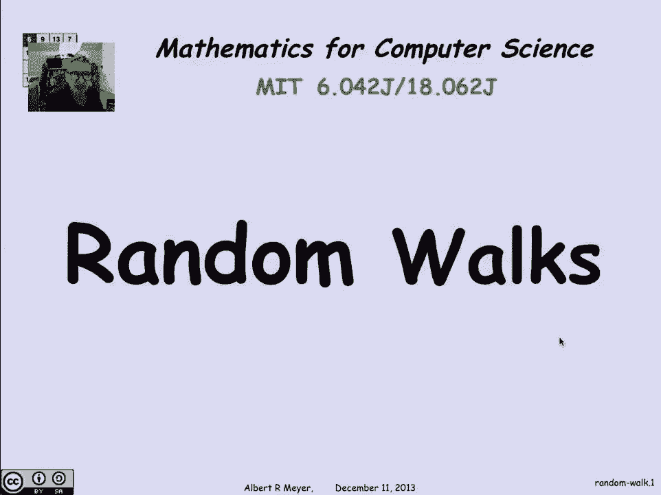

所以让我们来看看它们一般是什么，所以随机漫步的设置是你有一个图表，我们也可以经常思考和谈论有向图，好像它是一种状态，具有状态的机器的状态图，所以这里有一个三态，图表，蓝色，橙色和绿色，变成概率的部分。

我们思考沿着哪条边走的过程，当你处于给定的状态时，唯一的规则是，我们要给边缘分配概率，以这样的方式，比如说，我要告诉你的是，有三分之一的概率我会沿着这条边从O到O，我有三分之二的概率会从O到绿色。

规则很简单，向外边缘的概率之和必须和为1，所以让我们以合法的方式填写图表的其余部分，所以这里我们有b，有一半的概率从b到b，从B到O的四分之一，从B到G的四分之一，一步就能确定绿色状态，如果你在绿色。

下一个去蓝色。

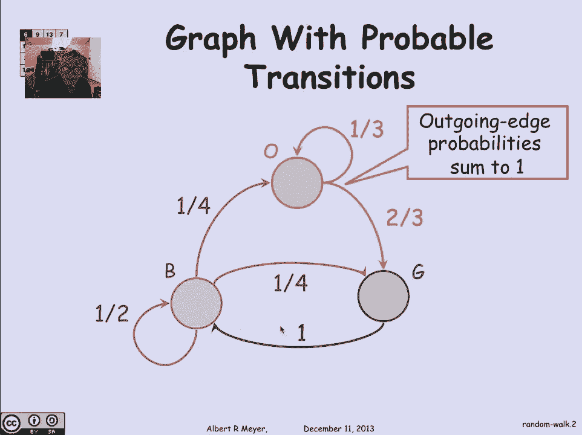

只有一个优势，它的概率是1，现在，赌徒的倾家荡产可见一斑，作为这种随机漫步的一个例子，美国是你拥有的钱的数量，从破产时的零到达到目标时的T，n是开始状态，这是你最初的赌注。

绿色边缘与赢得球棒的概率p加权，所以我们有从k到k的转换，加上k小于t时的1，带权重概率p的um，同样地，红色边缘以在q或1减去p时失去a的概率加权，所以有一个图表或状态机，描述了赌徒的破产问题。

作为图表上的概率游走，我们会问的典型问题是关于图表上的随机游动，在达到零破产之前达到目标的概率是多少？考虑到你是从某个州开始的。

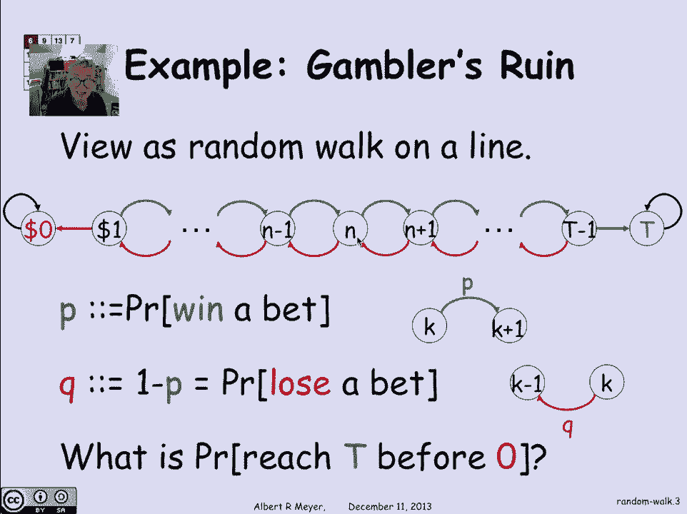

状态n，所以在散步中出现了一堆完全不同的设置，比如说，在物理学中，布朗运动是粒子的随机运动，受到原子力的冲击，它的模型是说这个粒子可以向任何方向运动，在三个空间中，均匀随机选择，哦。

和运动中的布朗尼理论它是在没有被理解的情况下首次被观察到的，爱因斯坦是第一个提出随机游走模型的人，粒子在布朗运动下的行为及其相应的定理，事实上，这是他诺贝尔奖的主要组成部分之一。

他当时没有获得诺贝尔相对论奖，因为它还没有得到坚定的证明，尽管它被广泛庆祝，另一个案例是金融，我们已经看到了赌徒的毁灭是如何反映的，或者似乎反映了股票价格随时间的有偏向的随机振荡。

我们将在这组视频的结尾看到，图上随机游动在建模中的应用，的网络搜索和聚类。

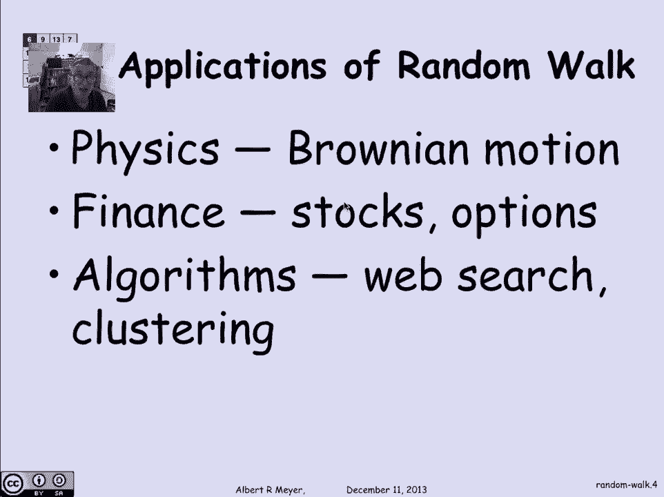

所以出现的一般问题，当你谈论图上的随机游动时，通过这个简单的三态示例来说明，用蓝色，橙色和绿色，我们可能会问，比如说，从状态B开始，七步达到O状态的概率有多大，现在在这个小例子中计算就很容易了。

但这将是一个典型的问题，一个更有趣的一般性问题是，从B到O的平均步数是多少，我是说你可以用一个问题的概率四分之一你一步就到了，但有八分之一的可能性，你分三步去那里，以此类推。

你可以很容易地显式地再次计算，在这个简单的例子中，从B到A的平均步数是多少，并将很快就解决这个问题的一般方法发表评论，最后你可以问一个赌徒的破产类型的问题，从b开始到g之前的概率是多少，哦，嗯。

在这个琐碎的例子中，你可以把答案读出来，你会以50%的概率在O之前到达G，因为从B开始，你必须以相等的概率去一个地方或另一个地方，但总的来说，这变成了一个更有趣和复杂的问题。

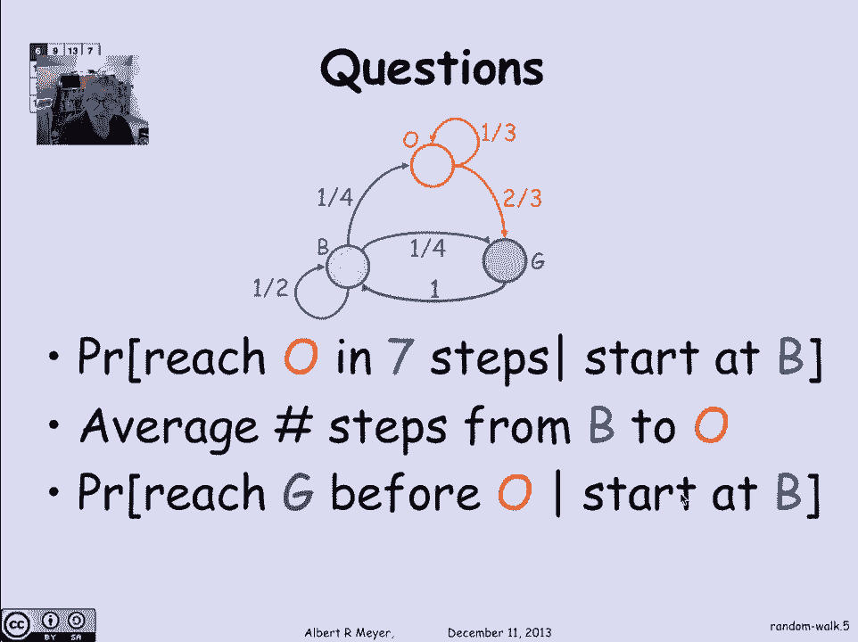

你可以用我们将要展示的方法来解决，嗯。

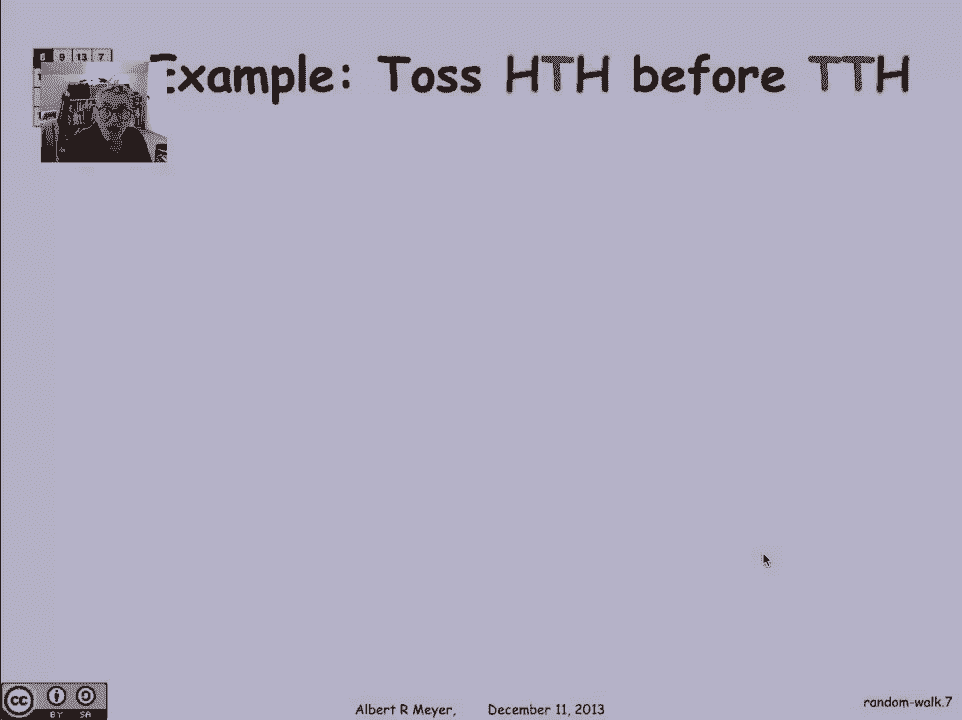

让我提醒你，那个，我们已经看到了，图上随机游动的一个有趣的说明性例子，当我们在看玩具成本的时候，抛硬币解决问题，例如，如果我掷一个公平的硬币，我等着三个连续的掷球形成模式，或者模式。

我想知道获胜的可能性有多大，因为它在我之前，我可以用一个，我们说过，就像一棵无限的树，用我们的树法形成概率空间的图，但是树是非常递归定义的，子树与原始树同构，这让我们，事实上，对无限树进行有限的描述。

相当于有限状态机或有限图，所以让我们更详细地看看这个例子，嗯，如果我在做抛硬币的模型，就像我们开始时处于前两次翻转不存在的状态，我还没有翻转任何东西，州将记录前两次翻转的值，并且没有先前的翻转。

第一次翻转有百分之五十的机会是H，在这种情况下，我的状态只有一个h，没有前面的任何东西，或者有一半的机会，我翻转一个T，在这种情况下，我在这个州，其中有一个T和没有以前。

但我已经可以说一些关于在T之前抛掷的概率，即获胜的概率，获胜的概率是，当然获胜的概率，鉴于我在没有先前翻转的开始状态开始，但从这里开始我赢的概率只是我赢的概率，从状态开始。

没有年龄和或我进入状态的可能性开始没有，这两个概率加权相等，因为这是一个公平的硬币，每条路都有一半的机会，也就是在没有掷硬币的情况下获胜的概率是获胜概率的一半，如果第一次掷是h，加上一半的获胜概率。

如果第一次掷硬币是在T，这只是全概率定律的一个应用，所以以这种方式继续下去，让我们展开更多的图表，所以假设我抛了一个头，然后我扔了一个头，我去州H H或我扔T，我去了州，所以这里我只是记录了前两个翻转。

呃，右边是最近的一个，好的，呃，这个呃，状态图的这个结构告诉我们，如果我想知道获胜的可能性有多大，考虑到我一开始就翻了一个头，概率又简单了，总概率，从H H中获胜的概率加权一半。

从HT中获胜的概率加权一半，我又得到了一个简单的线性方程，它将在一个州获胜的概率与在各州获胜的概率联系起来，它去，让我们继续做另一个例子，如此如此，如果我展开翻转t或h后发生的事情。

在翻转了第一个头之后，我得到了一个相应的方程，一条尾巴后获胜的概率和一半一样，用尾巴获胜的概率，后面跟着一个h或一个尾巴，后面跟着一条尾巴，这是图表中更有趣的部分。

假设我过去的两次翻转已经过去了两个时代，嗯，如果我再翻转一个h，然后我又回到了前两次翻转是H的状态，或者如果我翻转一个T，那我就处于这种状态，前面的翻转是一个h和一个t的顺序。

这告诉我如果我想知道获胜的概率，现在是给定h h的获胜概率，加上给定的HT和一次又一次的获胜概率，它是一个线性方程，把在一个状态下获胜的概率联系起来，在其他州获胜的概率，可能是它自己，但这里没有循环。

它只是一个线性方程组，嗯，这是整个图表的样子，尤其是一旦你翻转了HT，如果你翻转一个h，你赢了，因为你得先下手为强，你永远停留在风态，或者一旦你翻转T T，如果你翻转一个h，你输了。

因为T是第一个上来的，如果你再翻转一个T，你呆在状态T，我们能说的是获胜的概率，如果你处于胜利状态是一个，如果你处于失败状态，获胜的概率为零，和总体情况。

我只是有一个线性方程组来计算在一个状态下获胜的概率，给定其他状态，我可以解这些线性方程组来找出在开始状态下获胜的概率，也就是获胜的概率。

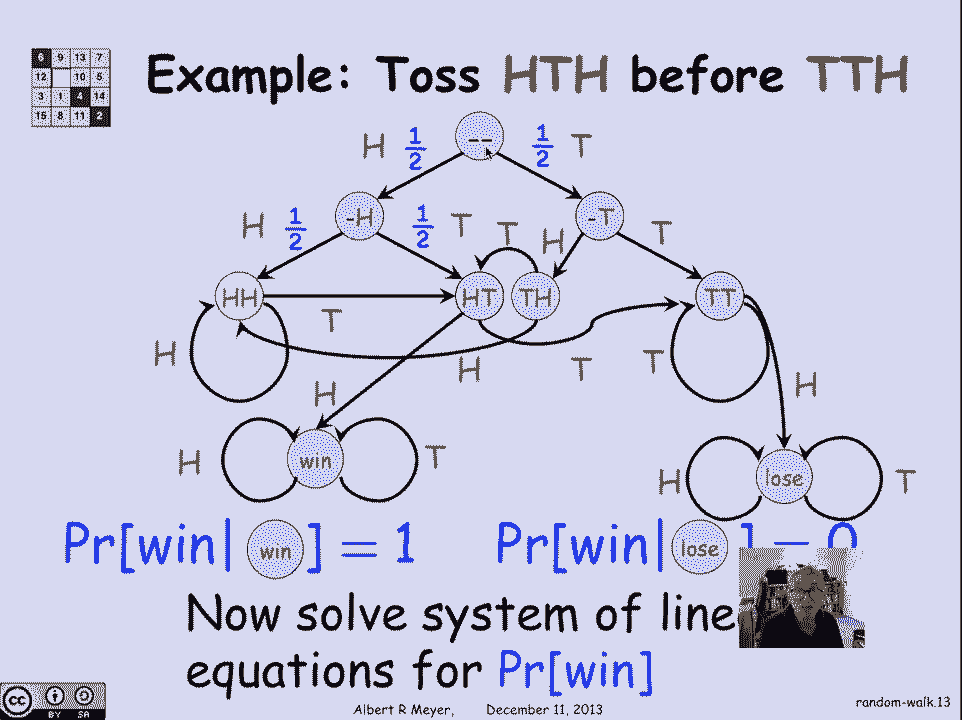

所以说，回顾我们随机漫步的问题，我们问达到O的概率和从B开始的七步，发生这种事的可能性有多大？从B到O的平均步数是多少，在o从b开始之前达到g的概率是多少，在每一种情况下。

这些问题可以简单地表述为求解线性方程组，其结构直接反映了类型的结构。

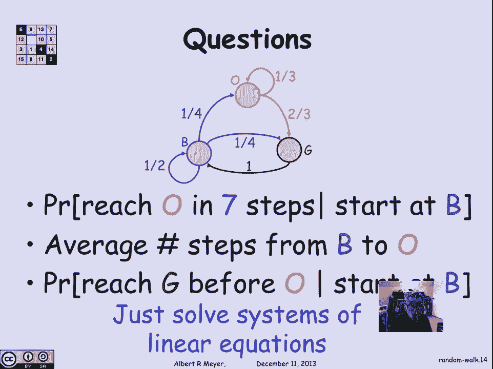

所以我们已经研究过的一些标准问题，随机图是从一个地方到另一个地方的概率，或者从一个地方到另一个地方的预期时间，而是一个不同的问题，以一种基本的方式出现，在某个地方的概率，所以让我们检查一下。

这是一个状态为蓝色的图。

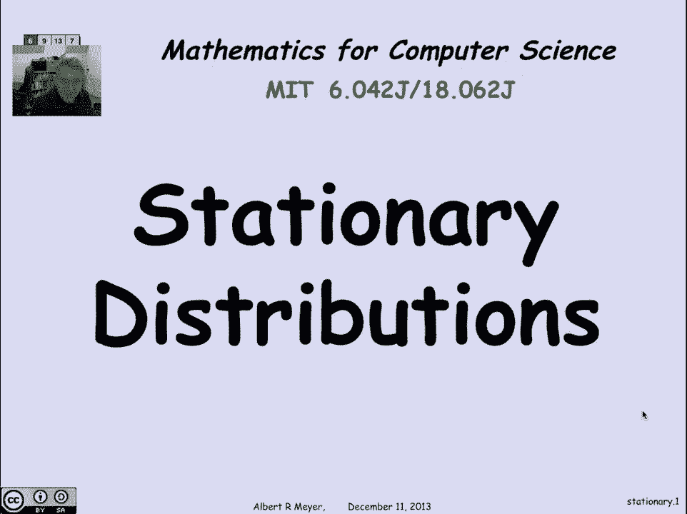

橙色和绿色，我们以前见过的，假设我从状态B开始，我问，一步后处于这些状态的概率是多少，所以首先，我对p b感兴趣，p o和p g，也就是处于B状态的概率，处于O状态的概率，和处于G态的概率。

概率之和将是1，一开始当我告诉你我在B州，意思是在b处的概率是1，另外两个是零，我对这些概率在一步后更新的方式感兴趣，如果p素数b是一步后处于状态b的概率，p素数永远是，一步后处于橙色状态的概率。

绿色也是如此，这些概率是什么，嗯，很容易看出，从这张图上看，你唯一在的地方是B，所以说，获得某地的可能性的唯一方法是看，沿着b的一条边，所以在橙色顶点处一步的概率是四分之一，在绿色州也是四分之一。

这是留在蓝州的一半，所以我们可以说，处于这些不同状态的更新概率是一半，四分之一又四分之一，正如我们刚刚推理的那样，好的，让我们继续前进，考虑到我在状态蓝色的概率，橙色和绿色是由概率向量给出的。

两步后的分布是什么，所以设p双素数b是处于状态b的概率f到两步，从B井开始，我们可以通过使用条件概率来计算，让我们看一下概率计算的例子，处于橙色状态的概率，在你从蓝色州开始后的两步。

所以这是一步后处于不同状态的概率，我如何到达橙色状态，我可以从蓝色州到橙色州，所以两步后处于橙色状态的概率，一步后处于蓝色状态的概率是多少，我把这条边变成橙色状态的概率，那就是，从b到o的概率。

考虑到我在B次，一步后在B中的概率，这就是两步后成为O的概率，同样，成为O的概率，处于O的概率的另一个组成部分，如果你在，从O到O的概率是多少，也就是这个是零概率的三倍，也就是四分之一。

最后一个案例再次使用，全概率定律，把它分成几箱，我到达R状态的第三种方法，第二步是在第一步的绿色状态，沿着果岭到O边，嗯，其中没有任何，所以这将是概率，处于绿色状态的概率的零倍，也就是四分之一。

但这并不重要，所以让我们填写这些金额，看第一个学期，从B到O的概率，当你在b时，这条边的概率，是25美分，同样地，从O到O的概率，假设你在O，这条边的概率是，即三分之一，所以我们可以把这个术语。

最后从g到o的概率为零，考虑到你在G，因为那里没有顶点，然后你填写这些概率并做算术，两步后你会有5-2-4的概率处于橙色状态，你可以计算出同样的计算，两步后处于蓝色状态或绿色状态的概率是多少。

这就是答案，走两步后，有50%的机会处于蓝色状态，五二四就像我们在橙色州看到的那样，剩下的是七二，四是处于绿色状态的概率。

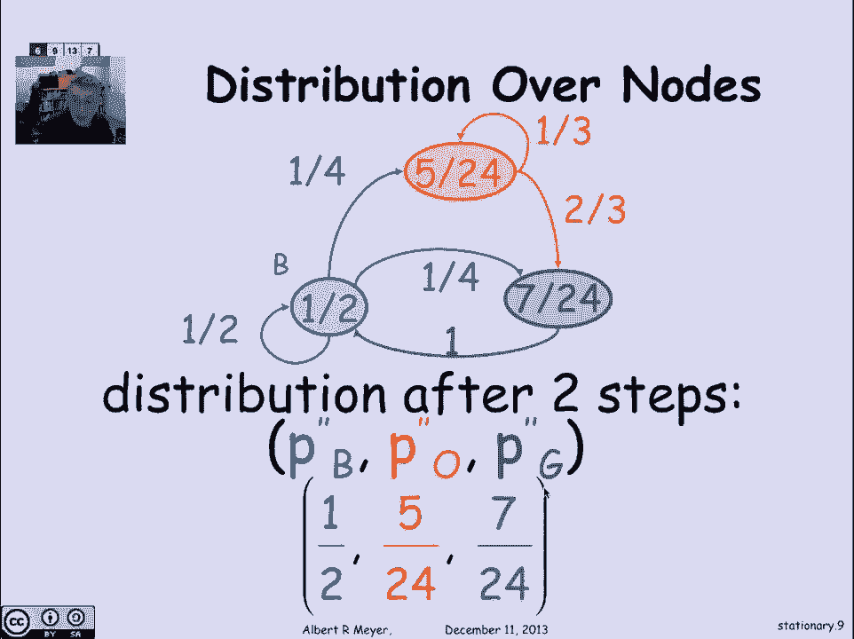

好的，那么总的来说是怎么回事，我们可以用一点线性代数来解释如何进行这些计算，所以让我们定义随机游动图的边缘概率矩阵，只是图的邻接矩阵，除了用0和1来表示边不存在还是不存在，我会用呃，在矩阵的在IJ位置。

从i到j的边的概率。

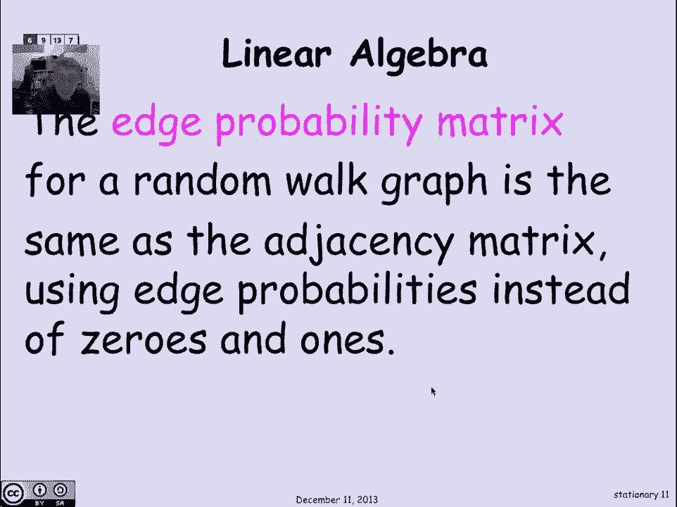

如果有边零，如果没有边缘，嗯，让我们看一个例子，下面是我们为我们的三个状态图抽象地填充它的方法，它将是一个三乘三的矩阵，与相应位置连续边的概率，这是b b a坐标中的位置。

从b到b的边的概率是o b ah坐标，如果您认为这些列被标记为蓝色，蓝色，橙色，绿色，玫瑰被贴上了蓝橙绿的标签，这是橙蓝坐标，它是从零到B的边的概率，让我们填写第一行，这是直接从图表上读出来的。

是B的边缘从B到B，从B到O，从B到格雷格，它有那些重量，如果我把剩下的填满，我得到了我们简单的三状态图的边缘概率矩阵，嗯，在那里，它是如此，最后一个是节目，事实上有一个，有一定的边缘，从绿色到蓝色。

你唯一能从绿色变成蓝色的地方，你不能一步就变成橙色或绿色，好的，那么我们为什么要把矩阵提起来，如果你看着路，我们更新了状态，从一步分布到两步分布，它真的是一个矩阵乘法，一般情况下做一个更新。

你只要做一个向量矩阵乘法，如果你有可能处于连续的状态，然后做一个矩阵向量矩阵乘法，利用图的概率矩阵，您将获得分布的更新向量，这很容易从定义中检查，从向量时间矩阵的定义。

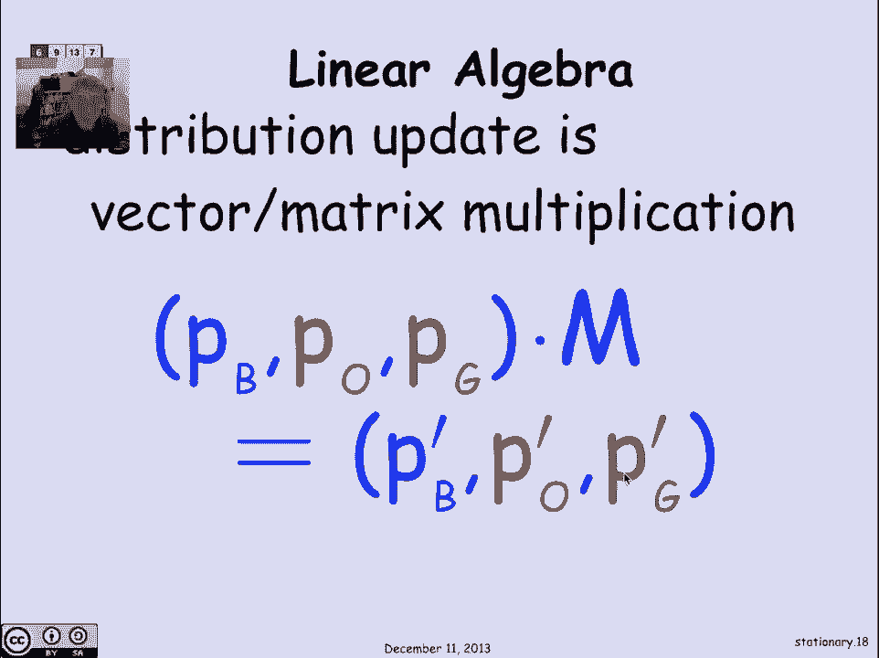

我想你对此很熟悉，所以现在我们可以问，t步之后的分布是什么，从某个特定的地方开始啊，给定分布a从状态b开始，或者从任何可能的概率分布开始到不同的状态，我们解决这个问题的方法，所以我对。

换句话说是T步之后在O中的概率T步之后在G中的概率，和b在t步a之后，从状态B开始，当T接近无穷大时也会发生什么，这是我们将要问的两个基本问题。

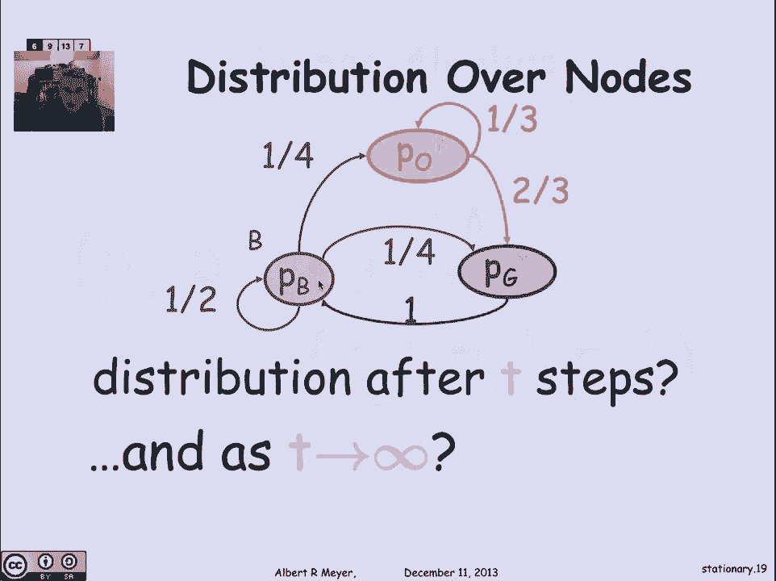

所以首先，你怎么计算，从给定的分布开始，在T步好之后，你只要，T次，取初始分布次数得到t步后的分布，m的齿幂现在这实际上在计算上已经很有用了，因为这意味着既然你可以通过连续的平方来计算矩阵幂。

你实际上只需要T矩阵乘法的对数，为了能够弄清楚，图的后T步的分布概率是多少，我们想要研究的关键概念，我们会在下一期视频中大量使用，当我们谈论Pagerank时，是平稳分布的概念。

所以平稳分布意味着一旦你处于平稳分布中，它很稳定，你会说留在那个分布中，你不会处于任何特定的状态，但是你会有一个处于不同状态的概率向量，一步后，矢量不会改变，所以这意味着下一步的分布与当前的分布相同。

马厩是什么，这里的静止分布是什么，嗯，我们要计算的方法是，以下是您更新的方式，这是向量矩阵乘法的矩阵的结果，但是让我们用条件概率来说明它，一步之后，如果原始分布是pb p o p g。

那么处于B状态的新概率，你能到达那里的唯一方法是从B到B的边缘，概率是一半，这是处于b的概率的乘以，另一个达到B的方法是在绿色状态，一步后你肯定会在B，因此，对于p，同样地，增加了1倍pg的贡献。

处于橙色状态的更新概率，在绿色状态下，我们想要的，概率和我开始的概率一样，这就是稳定性的定义，你更新向量p b p o p g，你得到相同的向量，这就是它稳定的原因，当然还有一个侧面约束。

因为你总是可以解这样的方程组，让所有的ps为零，它是退化的，我们添加约束，处于状态的概率之和必须是一口井，如果我们解简单的三乘三方程组，那么稳定分布是，有百分之八十五的机会处于B状态。

五分之三的机会处于橙色状态，和415个州的机会在州绿色，你应该自己问一下，一步后进入PB的概率是多少，考虑到这些概率，我不打算告诉你这个，但只是为了验证和印记稳定的想法，那是一个，值得暂停一下视频。

用铅笔和纸检查和做一点算术，好的，所以总的来说，我们要做的是，我们试图找到平稳分布向量，称它为矢量的S条，我们通过解向量矩阵方程得到这个，分布向量乘以边缘概率矩阵等于相同的分布向量，我们想解这个方程组。

如果有n个状态，那么这是一个n乘n的方程组，有一个额外的约束，我们希望稳定向量的范数为1，因为这是为了避免退化零解，嗯，有一些关于平稳分布的问题，我们首先要考虑的是，嗯，在这个例子中发生了什么。

只有两个州，和成为一个的第一个状态的概率，第二个状态为零井，如果您更新该状态，发生的事情是，你去这个，你只要以概率1进入第二个状态，你可以继续这样做，这里可能有一个稳定的分布。

但这个特定的模式并不收敛到它，当你穿越时间，一半的时间，你每走一步，你的状态一，每隔一步，你处于零状态，但是呃，你永远不会得到稳定的分布，一步又一步，你在这两个地方的概率相等。

我在这里假设这是一个特定的边缘，这是一个一定的优势，它必须是，只有一条边出来了，所以一个稳定的分布是半半，但这个东西不收敛到它，这里有一个稍微复杂一点的例子，又在哪里，假设所有的边都有同样的可能性。

每个顶点正好有两条边，这样每条边都有一半的重量，这个图表的问题是，当你问，什么是稳定的分布，如果你看它，你假设处于中间的概率为零，你被卡住的两个地方有概率p和一负p，那就稳定了。

因为一旦你处于概率p的这种状态，你沿着一条特定的边回到这个顶点，因此P在一步后出现的概率，同样，一步后的概率Q，所以p和q之间的分裂是一个稳定的分布，那里的概率为零。

当然p和q可以是0到1之间的任何实数，所以这个图实际上有无数的稳定分布，这里的问题是它没有很强的联系，这是一个充分条件，它有一个马厩，只要它是强连通的，它就有一个单一的稳定分布。

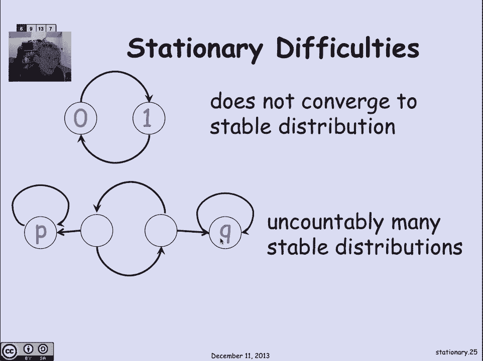

所以一般来说我们可以问这个问题，对于任意随机图总是存在平稳分布吗，嗯，如果图是有限的，是呀，保证有一个固定的分布，但它是独一无二的井吗，有时有时不是，如果图强连通，它将是独一无二的。

但我们在上一张幻灯片中看到了一些例子，它不是唯一的，事实上，它可能是无数的，另一个关键问题是随机游动是否接近稳定分布，无论你如何开始，第一个例子是你在第一个状态之间，在第二状态下振荡。

它从来没有收敛于一个半的稳定分布，一般来说，当你可以说，不管你怎么开始一段时间后，这是很好的，事情稳定下来了，你结束了独特的稳定分布，所以有时候每个分布，每个初始分布最终都会收敛于稳定分布或静止分布。

有时不是，然后另一个关键问题将是，如果我们从某个任意的，概率分布，或者某个特定的状态，一般要花多长时间，处于不同状态的概率已经变得相当稳定，这种情况再次发生的速度各不相同。

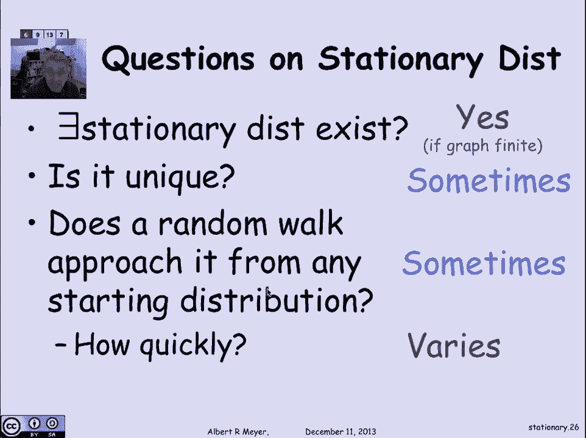

取决于图形，Pagerank是衡量网页重要性的指标，但让我立即纠正自己的困惑，直到最近，我遭受了一段时间的痛苦，也就是说，即使Pagerank用于对页面进行排名，它被称为PageRank。

因为它的发现者，开发人员拉里·佩奇，他是联合创始人之一。

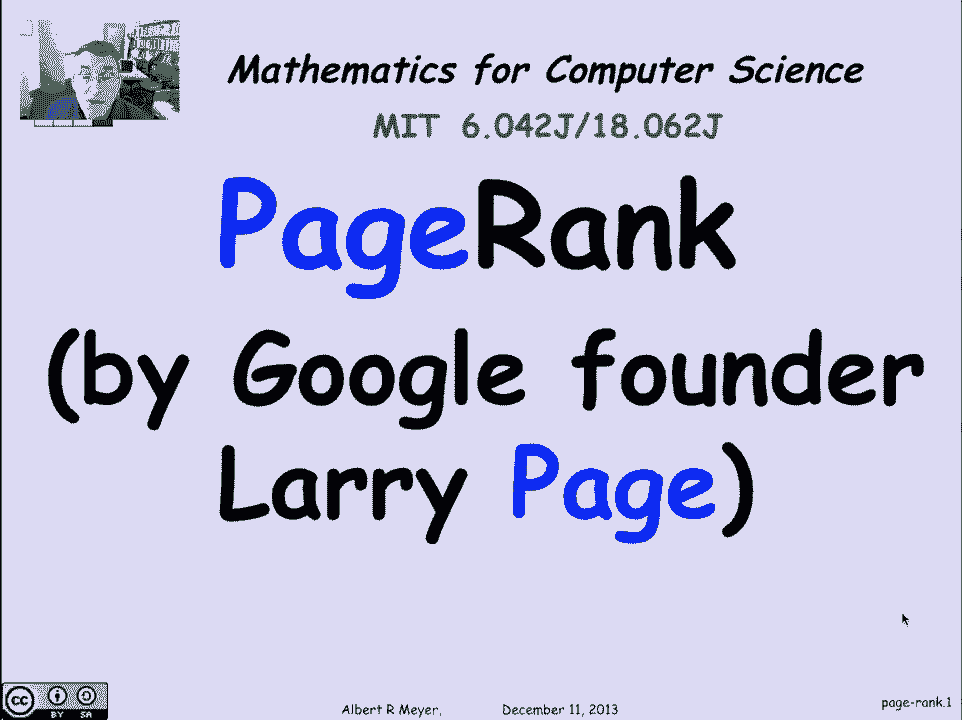

还有谷歌的谢尔盖·布林，所以动机是，嗯，当你至少在谷歌之前，当您在网页上进行标准检索时，使用关键字搜索和类似的标准，你会得到数百万的点击量，嗯，大多数都是低质量的，你对，几百万页有用的书页，问题是。

所有这些文件都无法区分，在关键字搜索和文本模式方面，你如何找出哪些是重要的，这个页面的想法是使用Web结构本身，万维网的结构，以识别重要文件，所以我们可以把整个互联网想象成一个图表，用户在页面上的位置。

我们认为URL是一个链接，到另一页作为定向边，用户在万维网上随机旅行，他们在一页，他们随机点击一个链接进入另一个页面，他们一直在网络图表上散步，偶尔，他们会发现，他们身上的线是一种失去蒸汽的东西。

或者他们发现自己处于某种循环中，它们会随机地在其他页面重新开始，我们想争论或假设一页更重要，当这些随机浏览器查看它的大部分时间时。

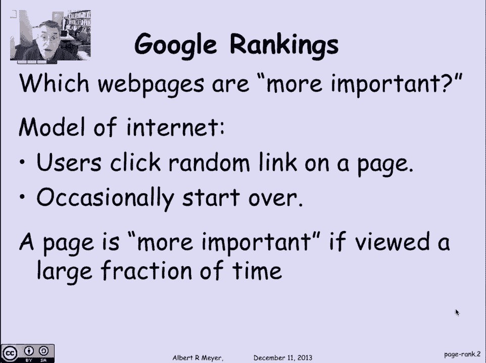

和随机用户，所以要正式，我们将把整个全球网络，数万亿顶点作为有向图，从一个URL到另一个URL会有一个边缘，从V到W，如果有从V页到W页的链接，或者URL w w甚至可能不是页面，它可能是一份文件。

这意味着它没有任何链接，但是对于，真正的顶点是上面有链接的网页，好的，这就是模型，我们要把它做成一个随机游走图，通过说如果你看一个URL v在一个顶点v，它的所有边缘都有同样的可能性。

这是一个简单的模型，它可能起作用，也可能不起作用，但事实上它确实很有效，这是万维网的一个随机游动图模型，所以更准确地说，从V到W的边的概率是，V的外度1，这就是V边的所有出度，让顶点V得到相等的权重。

现在来建模这个方面，用户重新开始。

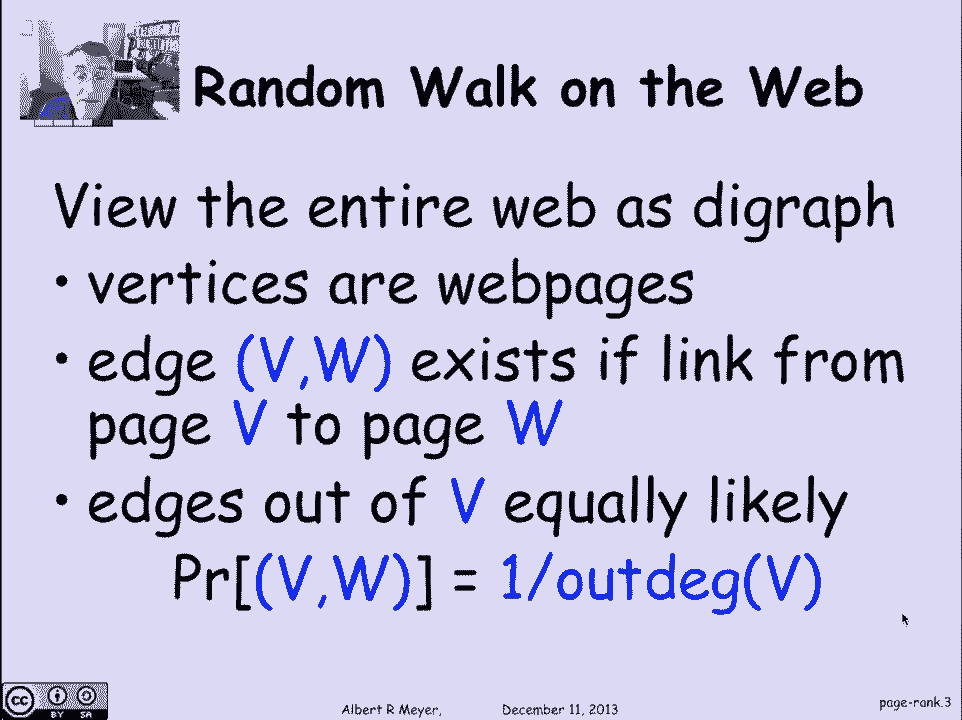

如果他们感到无聊或卡住了，我们可以正式地在图中添加一个假设的超级节点，哪个，并且从超级节点到其他节点都有一条边，同样的可能性，所以一旦你进入超级模式，那么沿着边走就等于说，随机选择一页重新开始，嗯。

到达超级节点，我们没有，我们有从图中其他节点回到超级节点的边，现在在阅读中，我们说我们将从没有终端的节点返回，没有边缘的节点，比如说，一份文件或类似的东西，这实际上是不够的。

因为对于Pagerank来说，理论上是工作的，我们希望它这样做，因为即使没有死节点，您可能在一堆节点中，你无法摆脱，你会希望能够，即使没有一个是死胡同，因为他们都有箭射向对方。

所以你真的想要一个来自边缘的节点，从这样的一团回到超级节点，从那里开始建模，最简单的方法就是，简单地说，从每个顶点到超级节点都有一条边，所以无论你在哪里，你可以随机决定重新开始，但还有一页和布林。

以及他们在PageRank原始论文中的合著者，提示从顶点回到超级顶点的边，可能会得到一个特殊的概率，它可能是定制的，而不是同样可能，所有其他的边都指向一个顶点，事实上，我想他们认为，一个。

从每个顶点随机跳到超级节点的五个概率。

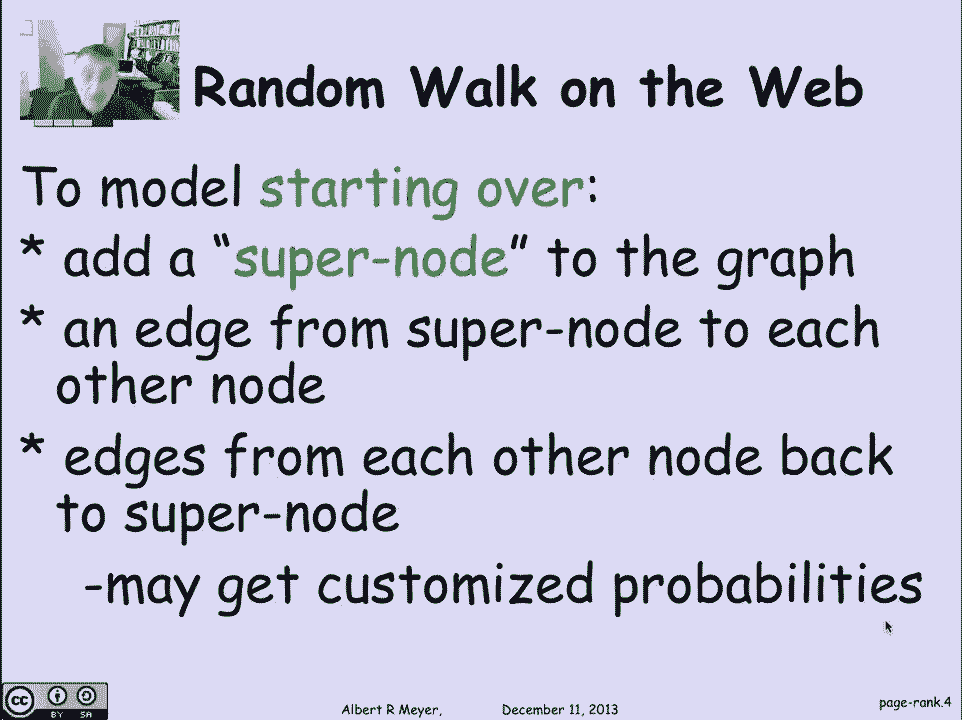

让我们用一个例子来说明这一点，这是一个随机游走图，我们在建模之前见过，掷硬币，当我添加超级节点时，有一个新的，超级，从超级顶点到其他顶点有一条边，图中的一个顶点，从图中的每个顶点，有一个边缘往回走。

我用双向箭头说明了这一点，所以这真的是一个有两个箭头的箭头，它表示每个方向上的箭头，现在在原纸上，实际上佩奇没有谈到超级顶点，相反，他谈到了每个顶点随机跳转到另一个顶点。

但这只会让整个状态图完全被边缘堵塞，所以让每个人都跳到超级顶点更经济，超级顶点跳回给大家，这节省了大量的边缘，所以pagerank是通过计算万维网的固定分布来获得的，所以S条是一个数万亿长度的矢量。

坐标由网页索引，我们想计算稳定分布，然后我们将简单地定义页面的pagerank，它在平稳分布中的概率，平稳分布S的稳定的V分量，当然还有，我们将v排在s之上，当在V中的概率高于在W中的概率时。

顺便说一下，我没有最新的数据，但是呃，有一些，我想我听说过在谷歌工作过的人，说，在维基百科的一些文章中，爬虫需要几个星期，创建Web的新地图，创建新图形，然后它需要，嗯，一些小时数。

我想在几天内计算图上的平稳分布，做大量的并行计算，因此，关于使用，固定分布是黑客在万维网上链接的方法，使页面看起来很重要，我们对Pagerank不会很好地工作，例如。

看起来更重要的一种方法是创建大量的节点，指着自己，假节点，但这并不重要，因为假钞不会有很大的分量，因为它们是假的，没有人指着它们，所以即使大量的假节点指向你，它们的累积重量很低。

它们不会增加你自己的概率，同样地，你可以试着把链接到重要的页面，试着让自己看起来很重要，但Pagerank不会让你看起来很重要，如果这些重要的节点都没有指向后面。

所以这两种简单的方法都试图通过操纵链接来看起来很重要。

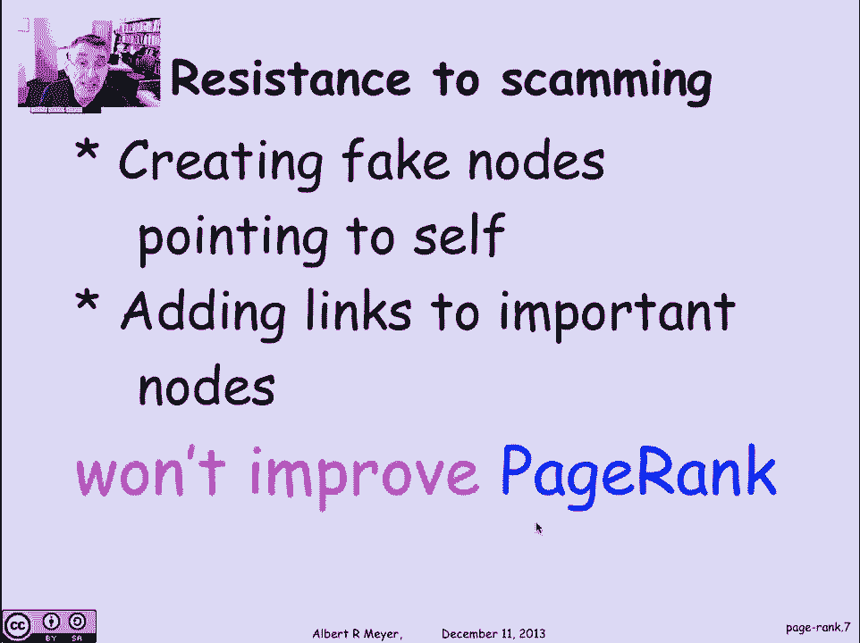

不会提高你的页面排名，超级节点在确保平稳分布存在方面发挥着技术作用，所以它保证了有一个独特的固定分布，顺便说一下酒吧，我有时用稳定这个词，有时用静止这个词，它们是同义词。

虽然我认为官方应该坚持站分发这个词，嗯什么时候，正如我之前提到的，当有向图强连通时，这是存在唯一稳定分布的充分条件，这在课文中的一个练习中得到了证明，在本章末尾，超级节点机制也确保了更强的东西。

每个初始分布p收敛于平稳分布，精确地从数学上计算到那个唯一的平稳分布状态，嗯，如果你从任意的概率分布开始，在不同的状态下，你看看在t步之后，p会发生什么，记住，你把向量p乘以矩阵，升到t的次方。

当t接近无穷大时，取极限，也就是说，当你做越来越多的更新时，你会采用什么发行版，事实证明，这个极限是存在的，它是平稳分布，所以你从哪里开始并不重要，你会稳定下来的，事实上，收敛很快。

这意味着你可以很快地计算出稳定分布，因为你不需要很大的T，为了得到一个很好的稳定分布的近似。

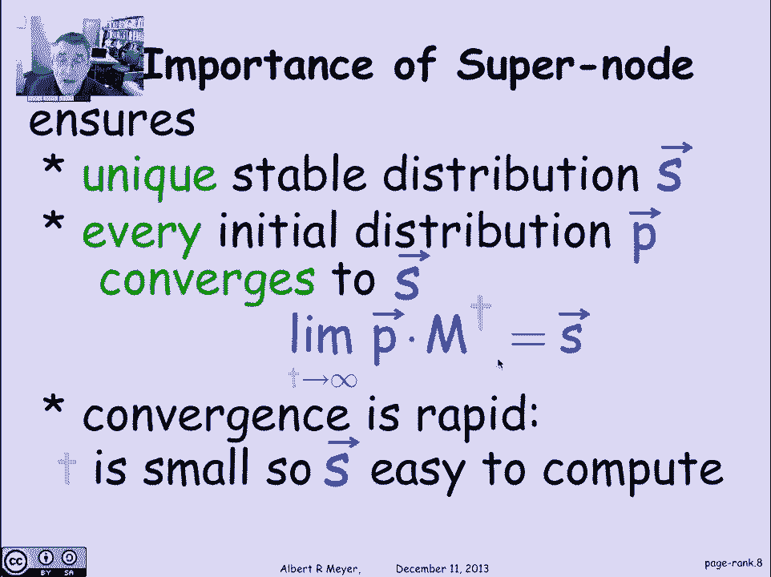

现在实际的谷歌排名和排名比仅仅是Pageranked要复杂得多，pagerank是最初的想法，得到了很多关注，事实上，来自谷歌的最新信息是，他们认为它在现代世界受到了过度的关注。

被太多的评论员和试图模拟排名的人，所以实际的排名规则是一个严格保密的商业秘密，由谷歌，他们使用文本，他们使用位置，他们使用付款，因为广告商可以付费让他们的搜索结果更突出地列出。

以及15年来发展起来的许多其他标准，随着人们找到操纵排名的方法，它们继续进化，谷歌修改排名标准和算法，但尽管如此。

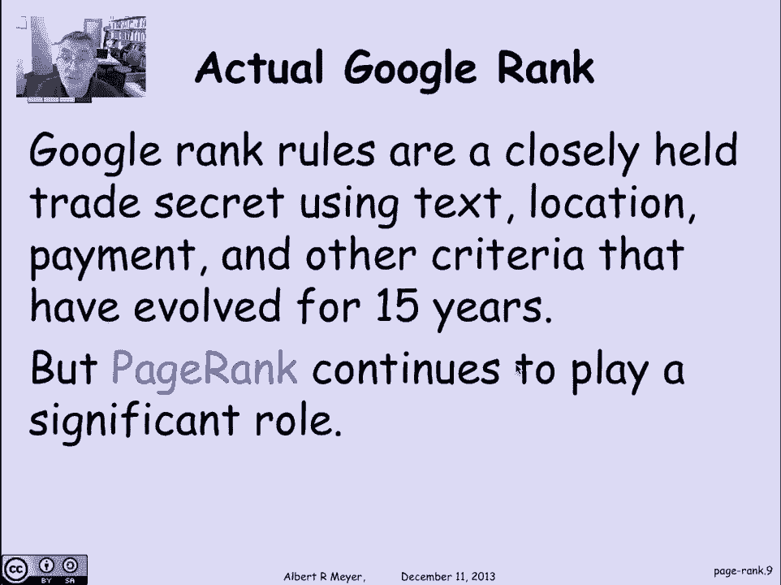