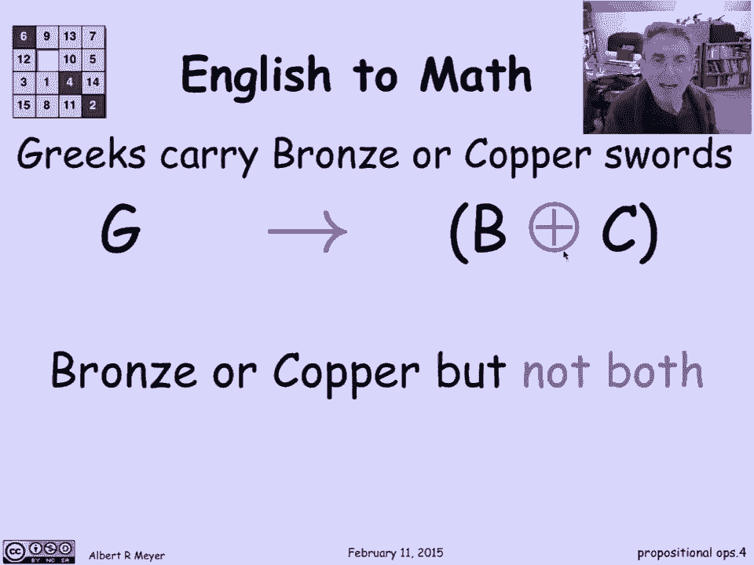
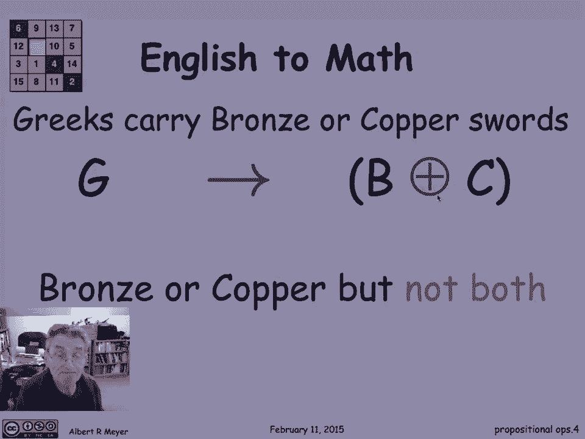
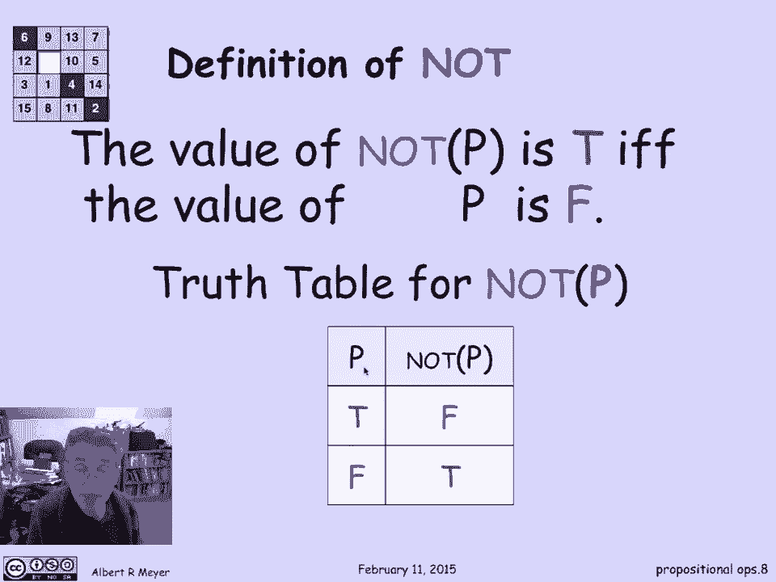
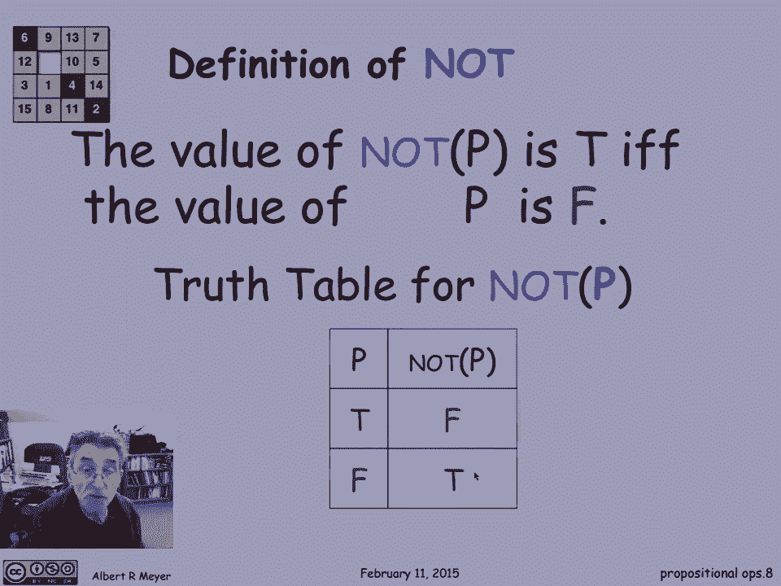
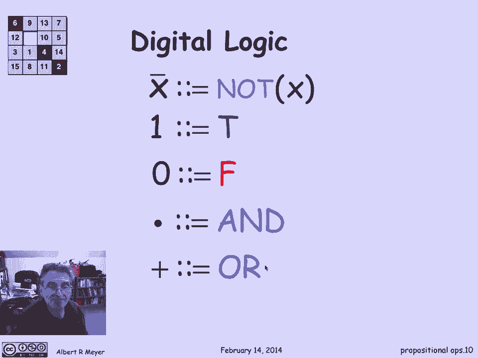

# 【双语字幕+资料下载】MIT 6.042J ｜ 计算机科学的数学基础(2015·完整版) - P9：L1.4.1- Propositional Operators - ShowMeAI - BV1o64y1a7gT

我们将在这个小片段中讨论命题和逻辑运算，让我们从讨论命题开始，对一个数学家来说，尤其是在这门课上，我们将使用命题这个词，指代对或错的事物，呃，一个例子是，有五种正多面体，这碰巧是真的，在某些方面。

我们甚至有些方面，我们甚至证明了这一点，暗示着，比如说，如果你想把，假设有一百颗固定位置的卫星以统一的方式绕着地球运行，你做不到，因为没有一百个顶点的正则固体，最大的是二十个顶点，好的，呃，嗯。

如果我换成6，猜猜断言是什么，有六个正则固体是假的，所以这是一个定义良好的两个定义良好的命题的头脑简单的例子，其中一个是真的，其中一个是假的，命题不一定是真的，总是有一些非例子，嗯，醒一醒，不是命题。

因为这是当务之急，没有真假之分，我在哪里是一个问题，没有真假之分，是三便士，m，不是提议，因为它在任何特定的时刻都是真的或假的，但这是真的还是假的取决于时间，这是一个复杂的问题，我们不想进入这个想法。

是一个命题，是一个固定的断言，要么永远为真，要么不永远为真，现在，数学家提出命题抽象的原因之一，以及我们即将看到的对他们的手术，普通语言往往模棱两可，而且那个，当然啦，会给数学推理带来问题。

就像在程序中一样，最，其中之一，英语中连接命题的最模棱两可的短语是，或者让我们看看这个例子，如果我把这个转录成精确的，呃，数学符号，我可以说g代表希腊人意味着s代表剑，或者J代表标枪，所以呃。

这是一个断言，如果你是希腊人，然后你拿着剑或标枪，在希腊语中，剑或标枪的意思，真的，我应该说希腊士兵，但让这是隐含的，好的，这就是我们要把这个句子翻译成，只是用这些运算符来解释发生了什么。

问题是什么或意味着什么，嗯，事实证明，对于标枪和剑来说，这是真的，即使一个希腊人同时带着剑和标枪，这是一个包容性的，或者一个希腊士兵会同时带着剑和标枪，因为事实上，标枪是很好的长距离武器。

在近处用剑是很好的自卫，你当然想两者兼得，尤其是当你扔完标枪后，你什么都没有了，但是这把剑，现在这些逻辑连接词有许多标准符号，从分量命题中建立更大的命题。

其中之一是这个v符号或者这个连接符号是逻辑学家使用的，经常代替或，这个箭头表示，或者有时双杠箭头也意味着暗示，但我们不打算讨论这个，我不会要求你记住这些符号，我们就坚持那些不占太多空间的词。

让我们看另一个例子，希腊人佩带青铜或铜剑，语法上，这与前一个短语的结构相同，但我们要用不同的方式翻译它，原因是我们指的是这里，一个希腊士兵不会同时携带一把铜剑和一把铜剑，为什么那口井，铜剑比铜剑好很多。

他们会直接切开铜，它们要硬得多，拿着这把劣质的铜剑，不值得等待，当你有一个更好的，所以这次我们的意思是，希腊人只携带一件青铜或铜制的东西，你会带着一个铜，所以如果你没有青铜的。

所以现在我们把它翻译成希腊语意味着，b或a b代表青铜，或c表示铜，但这次我们用XOR，XOR意味着其中一个是正确的，但不是两者都有，也不是两者都有，Xor有一个加号表示法，因为我们将看到。

它的行为有点像加数字mod 2。

一加一等于零。

所以让我们更精确地定义OR和XOR的两个定义，以及它们是如何工作的，断言是，如果我认为P和Q是占位符，对于真或假的命题，那么复合命题p或q为真，当且仅当p为真或q为真，或者两者都是真的。

我可以用英语来表达这个断言，这是当且仅当通过给你一个所谓的真值表，在这两列中，或者在这些行中，我列举了p和q的所有可能的值对，所以p和q可能都是真的，P可能为真，Q可能为假，p假q真，两个都是假的。

对于p和q的真值的每一个可能的组合，我告诉你P或Q的真值，值得注意的是，最后一排我告诉你，嗯，P或Q为假的唯一方法是如果P和Q都为假，XOR没问题，就像我们说的，P、X或Q为真。

当且仅当p和q中正好有一个为真，所以如果我把它作为一个真值表来表达，我们看到没有的地方是假的，哪里有虚假，因为这两行中的任何一行都不是这样，只有一个是真的，但中间的行正好有一个是真的，所以P。

x或q为真，所以说，这个真值表只是定义XOR如何作用于真值的精确方法，还有另一个连接词，它的工作方式更直接，p和q的值为真，当且仅当p和q都为真，有一张真值表，再次，突出的一点是这是真的。

仅当且仅当p和q都为真，逻辑运算是否定运算，或者不是这样，P只是翻转了P的真值，嗯，如果p为真，则为真，那么不是p是假的，如果不是p为真，那么p为假，这是非常琐碎的，真值表琐碎，因为只有两个值需要关注。

当p为真时，不是P是假的，当p为假时，不是真的。

现在这个概念的地方之一，使用逻辑运算来建立更复杂的复合命题是在编程中，这里有一个来自Java的典型短语，Java使用这个双竖线来表示或包含顺便说一句，和双与号表示，在Java中也是如此。

这是一段合法的Java代码，正在进行测试，求值此表达式，如果x大于零，或者x小于或等于零，y大于一百，那么如果那个测试是真的，然后在测试之后执行一堆代码，到某个分隔符，告诉你在哪里停止，如果是假的。

你只要跳过所有这些东西继续，所以我们使用类似这样的布尔表达式或逻辑表达式，在大多数编程语言中以非常标准的方式，这些操作出现的另一个地方，它是在数字逻辑中，数字电路设计者有自己的符号，我只想提一下。

但我们不会再这样了，强加给你，但你应该知道他们用的一个符号，我们也会用，因为它很经济，不是x可以通过在x上写一个条来缩写，更一般地，not可以通过在复杂的表达式上写一个条来缩写，我只是节省了一些空间。

所以我们会用它，但不是下面在数字逻辑中的想法是你在谈论电路，电信号的唯一区别是，是高压还是低压，高压用1表示，低压用零表示，数字逻辑的行为方式是，一个对应于真，零对应于false。

那么AND运算就是简单的乘法，因为，1或0乘以1或a，对于普通乘法，只有当两者都为1时，零才为1，这正是当1表示为真零表示为假时的方式和行为，不幸的是，数字设计师在他们意味着。

或者它们并不意味着一加一等于二，意思是一加一等于一，只是要注意的一部分，这也是我们不使用这个符号的部分原因。

