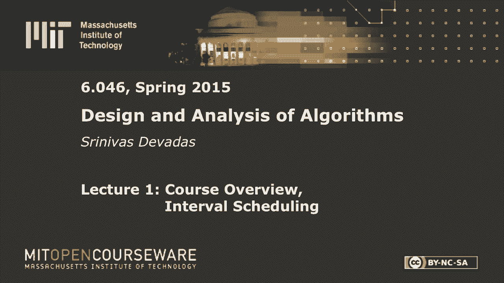
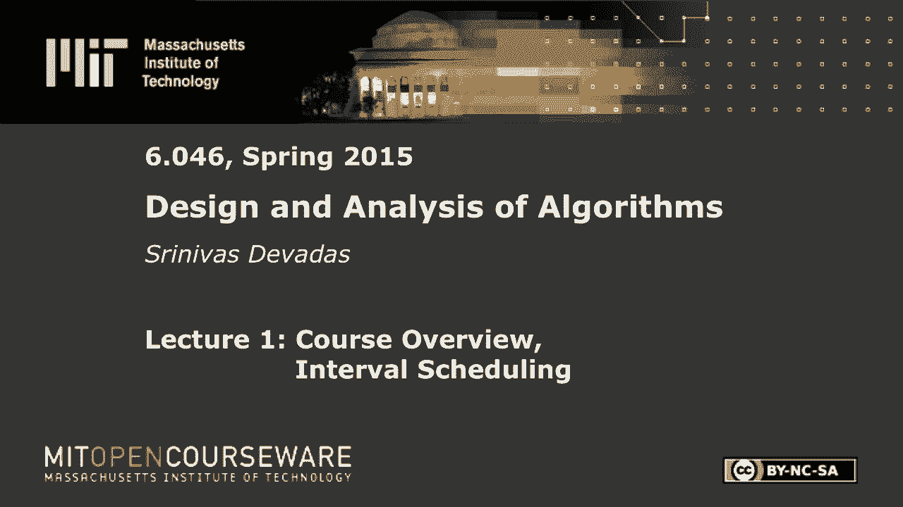
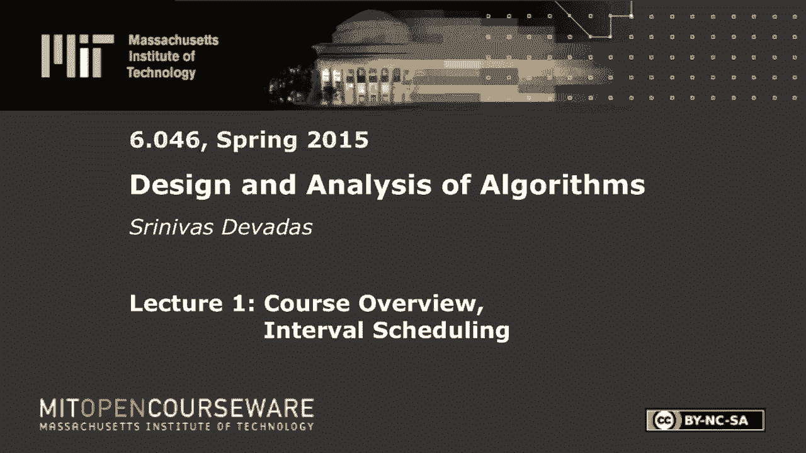

# L1：课程介绍与间隔调度

在本节课中，我们将学习麻省理工学院6.046J课程的第一讲内容。我们将从课程的整体介绍开始，然后深入探讨一个具体的算法问题——间隔调度。我们将学习如何设计一个高效的贪婪算法来解决基础版本，分析其正确性，并探讨当问题条件变化时，如何转向动态规划等更复杂的范式，甚至触及NP完全问题的概念。

## 课程概述与安排 🎯

本课程是麻省理工学院6.046J《数据结构与算法设计》的完整版。课程内容基于知识共享许可提供。

课程由Srinivas Devadas教授、共同讲师Erik Demaine和Nancy Lynch，以及多位助教共同讲授。课程假设学生已掌握6.006课程（算法导论）的基础知识，包括数据结构、动态规划和最短路径算法等。

课程将在Stellar网站运行，提供讲义、习题集等所有资料。课程视频也将为开放课件项目录制并稍后上线。

学生需在Stellar网站注册复习课，并仔细阅读课程信息文件，了解评分政策（习题集占30%，但需达到一定正确率）和协作策略。

## 课程内容模块 📦

上一节我们介绍了课程的基本信息，本节中我们来看看课程涵盖的主要技术模块。

课程内容分为多个模块：
*   **分而治之**：深化在6.006中学到的范式，探讨如快速傅立叶变换、求凸包等高级算法。
*   **贪婪算法**：研究如Dijkstra最短路径算法等贪婪策略，并将其应用于多种问题。
*   **网络流**：研究如何最大化流经网络的商品数量，有广泛的应用背景。
*   **难处理性与近似算法**：探讨不存在多项式时间精确解的问题（NP难问题），并学习如何在多项式时间内找到近似最优解。
*   **高级主题**：包括分布式算法和密码学等。

算法设计的迷人之处在于，问题定义的微小变化可能导致算法复杂性发生巨大改变，从易处理（P）变为难处理（NP完全）。本节课将通过一个具体例子来阐明这一点。

## 算法复杂性基础回顾 ⚙️

在深入具体问题前，我们先简要回顾与算法复杂性和难易度相关的术语。

*   **P类问题**：指存在多项式时间算法可以解决的问题。例如，最短路径问题可以在O(V²)时间内解决（V为顶点数）。
*   **NP类问题**：指其解可以在多项式时间内被验证的问题。例如，哈密顿回路问题（判断图中是否存在经过每个顶点恰好一次的回路）是NP问题。
*   **NP完全问题**：是NP中最难的一类问题。如果任何一个NP完全问题存在多项式时间算法，那么所有NP问题都存在多项式时间算法。哈密顿回路问题和布尔可满足性问题都是NP完全的。

接下来，我们将通过间隔调度问题，展示问题约束的细微变化如何影响其算法复杂性。

## 间隔调度问题与贪婪算法 ⏰

我们现在开始研究间隔调度问题。在这个问题中，我们有一个资源和多个请求。每个请求i对应一个时间间隔 `[s_i, f_i)`，其中 `s_i` 为开始时间，`f_i` 为结束时间，且 `s_i < f_i`。两个请求i和j是兼容的，当且仅当它们的时间间隔不重叠，即 `f_i <= s_j` 或 `f_j <= s_i`。

我们的目标是选择一个最大的兼容请求子集，即最大化可以满足的请求数量。

### 贪婪算法模板

贪婪算法通常高效且近视，它每次只处理输入的一小部分，做出当前最优选择，然后简化剩余问题。

以下是解决间隔调度问题的贪婪算法通用模板：
1.  使用一个简单规则选择一个请求。
2.  拒绝所有与该请求不兼容的请求。
3.  在剩余的请求集合上重复上述步骤，直到所有请求被处理。

这个模板尚未具体化，关键在于第1步的选择规则。

### 选择规则探讨

对于选择规则，有多种直观的启发式策略，但并非所有都正确。

以下是几种可能的选择规则及其有效性：
*   **最早开始时间**：可能失败。例如，一个最早开始但很长的请求会阻止许多其他短请求。
*   **最短间隔**：可能失败。例如，一个短间隔可能位于两个长间隔之间，选择它会阻止选择两个兼容的长间隔。
*   **最小冲突数**（选择与其他请求重叠最少的请求）：可能失败。存在反例表明其无法始终得到最优解。
*   **最早结束时间**：**这是正确的规则**。选择具有最小 `f_i` 的请求，可以证明总能得到最大规模的兼容请求子集。

### 正确性证明（最早结束时间规则）

我们使用数学归纳法证明贪婪算法（采用最早结束时间规则）的正确性。

**命题**：对于任意间隔调度问题实例，最早结束时间贪婪算法总能找到一个最优解（即最大规模的兼容请求集）。

**证明**：
*   **归纳基础**：当最优解只包含一个间隔时，选择最早结束的间隔显然构成一个有效且最优的调度。
*   **归纳步骤**：
    1.  设最优解为 `S* = { [s_{j1}, f_{j1}), ..., [s_{jk*}, f_{jk*}) }`，共 `k*` 个间隔。
    2.  设贪婪算法选择的第一个间隔为 `[s_{i1}, f_{i1})`，根据最早结束时间规则，有 `f_{i1} <= f_{j1}`。
    3.  构造一个新的解 `S**`：用 `[s_{i1}, f_{i1})` 替换 `S*` 中的第一个间隔 `[s_{j1}, f_{j1})`。由于 `f_{i1} <= f_{j1}`，`[s_{i1}, f_{i1})` 与 `S*` 中后续所有间隔仍然兼容（因为后续间隔的开始时间 `>= f_{j1} >= f_{i1}`）。因此 `S**` 也是一个包含 `k*` 个间隔的最优解。
    4.  考虑在选择了 `[s_{i1}, f_{i1})` 后剩余的请求集 `L‘`，即所有开始时间 `>= f_{i1}` 的请求。`S**` 中从第二个开始的间隔构成了 `L‘` 的一个解，且其大小为 `k* - 1`。
    5.  根据归纳假设，对于问题集 `L‘`，贪婪算法能找到其最优解。而贪婪算法在 `L‘` 上运行得到的结果正是 `{ [s_{i2}, f_{i2}), ..., [s_{ik}, f_{ik}) }`，设其大小为 `k-1`。
    6.  因此，`k* - 1 = k - 1`，即 `k* = k`。这意味着贪婪算法找到的解 `{ [s_{i1}, f_{i1}), ..., [s_{ik}, f_{ik}) }` 也包含了 `k*` 个间隔，是最优的。

证毕。

## 问题变体与算法演进 🔄

上一节我们证明了基础间隔调度问题存在高效的贪婪算法。本节中我们来看看当问题条件发生变化时，解决方案如何演变。

### 加权间隔调度

现在为每个请求 `i` 引入一个权重 `w_i`。目标不再是最大化请求数量，而是最大化所选请求的**总权重**。

最早结束时间贪婪算法**不再适用**。反例：一个权重很小但结束很早的请求，可能会阻止选择后续两个权重很大但稍晚的兼容请求。

此时，**动态规划**成为合适的工具。关键在于定义子问题。一种定义方式是：令 `R_x` 为所有开始时间 `>= x` 的请求集合。但更精妙的定义是：对于每个请求 `i`，定义子问题为：在 `f_i` 时刻之后开始的请求集合上的最优调度。这样我们就有 `n` 个子问题（`n` 为请求总数）。

**动态规划递归式**：
设 `OPT(R)` 为请求集 `R` 上的最大权重。则
`OPT(R) = max_{i in R} ( w_i + OPT( R_{f_i} ) )`
其中 `R_{f_i}` 表示 `R` 中所有开始时间 `>= f_i` 的请求集合（即与选择 `i` 兼容的后续请求）。

通过记忆化或自底向上填表，该动态规划算法的时间复杂度为 **O(n²)**。实际上，通过更巧妙的预处理和设计，可以优化到 **O(n log n)**。

### 多资源间隔调度与NP完全性

进一步推广问题：假设有**多种不同的资源（机器）**，每个请求 `i` 只能在一组特定的机器子集 `Q_i` 上运行。目标同样是最大化总权重或请求数量。

这个推广后的问题被证明是**NP完全**的。这意味着，除非P=NP，否则不存在解决所有实例的多项式时间精确算法。

面对NP完全问题，通常有两种应对策略：
1.  **近似算法**：设计在多项式时间内运行的算法，其解的质量（如总权重）保证在最优解的一定比例范围内。
2.  **处理难解实例**：虽然最坏情况下是指数时间，但针对许多实际实例，优化后的搜索算法（如回溯、分支定界）可能在可接受时间内找到最优解。

## 总结 📝

本节课中我们一起学习了以下内容：
1.  了解了6.046J课程的整体结构和安排。
2.  回顾了P、NP和NP完全等算法复杂性基本概念。
3.  深入研究了**间隔调度问题**：
    *   对于基础的**最大数量**问题，我们设计了基于**最早结束时间**规则的**贪婪算法**，并严格证明了其正确性。
    *   对于**加权**版本，贪婪算法失效，我们转向了**动态规划**解决方案，定义了子问题并给出了递归式。
    *   当问题推广到**多台不同机器**时，问题变为**NP完全**的，我们讨论了应对NP难问题的基本思路（近似算法、启发式算法）。
4.  通过这个例子，我们直观感受到了问题定义的微小变化可能导致算法设计范式和计算复杂性的显著不同，这是算法设计领域的一个核心特点。