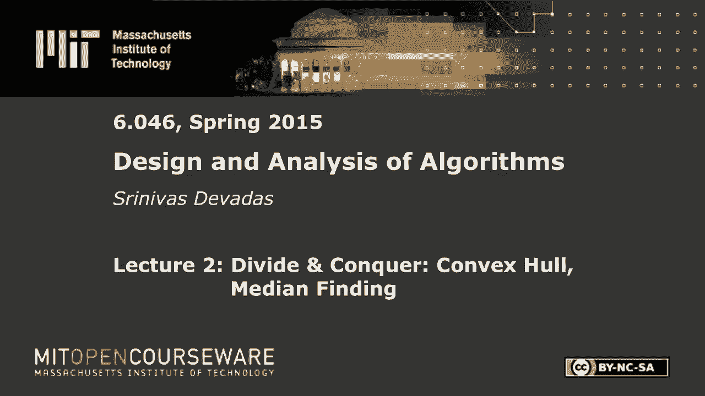
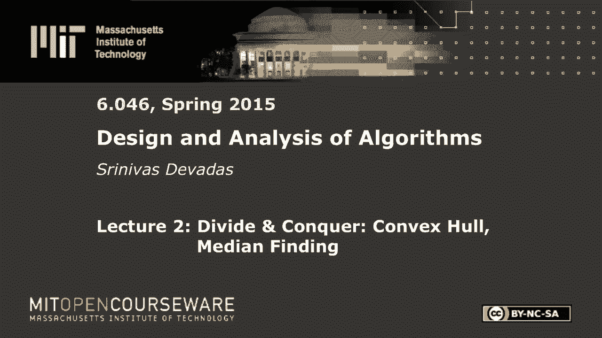

# L2：分治：中位数查找 🧠








在本节课中，我们将要学习分治算法的核心思想，并通过两个经典问题——凸包和中位数查找——来深入理解如何应用这一范式。我们将看到，分治算法的关键在于如何巧妙地划分问题，以及如何高效地合并子问题的解。

---

## 分治算法范式概述

分治是一种强大的算法设计思想。其基本模式是：将一个规模为 `n` 的问题分解为 `a` 个规模为 `n/b` 的子问题。当子问题规模足够小时，可以直接求解。最后，将子问题的解合并，得到原问题的解。

其运行时间通常可以用递归式描述：
```
T(n) = a * T(n/b) + [合并步骤的代价]
```
其中 `a ≥ 1`, `b > 1`。通过主定理等工具可以求解此类递归式。

上一节我们介绍了分治算法的通用框架，本节中我们来看看如何将其应用于具体的几何和选择问题。

---

## 凸包问题 ⛵

凸包问题是指：给定二维平面上的 `n` 个点，找出能包含所有点的最小凸多边形。这个多边形称为这些点的凸包。

### 分治算法思路

我们将使用分治法来解决凸包问题。算法的核心步骤如下：

1.  **划分**：将所有点按 `x` 坐标排序，然后将其分为左右两个大小大致相等的点集。
2.  **征服**：递归地计算左、右两个点集的凸包。
3.  **合并**：将两个子凸包合并为整个点集的凸包。这是算法中最关键也最有趣的部分。

### 合并步骤：双指针算法

合并两个凸包，本质上是找到连接它们的两条“切线”：一条上切线和一条下切线。以下是寻找上切线的“双指针”算法步骤：

1.  初始化两个指针。左指针指向左凸包上 `x` 坐标最大的点，右指针指向右凸包上 `x` 坐标最小的点。
2.  计算当前两点连线的 `y` 轴截距。
3.  进入循环，交替移动指针以寻找最大截距：
    *   固定左指针，顺时针移动右指针。如果连线截距增加，则继续移动；如果减少，则退回一步。
    *   固定右指针，逆时针移动左指针。如果连线截距增加，则继续移动；如果减少，则退回一步。
4.  当两个指针都无法再移动以增加截距时，当前两点连线即为上切线。

寻找下切线的过程类似，目标是寻找最小截距。

### 算法复杂度分析

*   **合并复杂度**：双指针算法中，每个指针最多遍历其凸包上的所有点一次。因此，合并两个总点数为 `n` 的凸包，时间复杂度为 `O(n)`。
*   **总体复杂度**：算法满足递归式 `T(n) = 2T(n/2) + O(n)`。这与归并排序的递归式相同，因此总时间复杂度为 `O(n log n)`。

上一节我们详细探讨了凸包问题的分治解法，特别是其巧妙的合并步骤。本节中我们来看看另一个经典问题——中位数查找，它的挑战性主要体现在划分步骤上。

---

## 中位数查找问题 🔍

中位数查找问题是指：在一个包含 `n` 个不同数字的未排序集合 `S` 中，找到第 `k` 小（或特定秩，如中位数）的元素。

一个简单的方法是先排序再选取，时间复杂度为 `O(n log n)`。我们的目标是利用分治思想，设计一个最坏情况下也能在线性时间 `O(n)` 内完成的确定性算法。

### 简单分治框架及其缺陷

一个直观的分治框架如下：
1.  **选择**：从集合 `S` 中选取一个元素 `x` 作为枢轴。
2.  **划分**：将 `S` 分为三部分：`B`（所有小于 `x` 的元素）、`{x}`、`C`（所有大于 `x` 的元素）。设 `k` 为 `x` 在 `S` 中的秩。
3.  **递归**：
    *   若 `k == i`（`i` 是目标秩），则返回 `x`。
    *   若 `k > i`，则在 `B` 中递归寻找第 `i` 小的元素。
    *   若 `k < i`，则在 `C` 中递归寻找第 `i - k` 小的元素。

这个框架的问题在于：如果每次选择的 `x` 都是极端值（例如最大值或最小值），那么划分会极度不平衡，导致递归树深度为 `O(n)`，而每层划分需要 `O(n)` 时间，总复杂度退化为 `O(n^2)`。

### 关键改进：中位数的中位数

为了保证划分的平衡性，我们需要一个确定性的、聪明的方法来选择枢轴 `x`。这就是“中位数的中位数”方法。

以下是选择枢轴 `x` 的步骤：

1.  **分组**：将 `n` 个元素分成 `⌈n/5⌉` 组，每组最多 5 个元素。
2.  **组内排序**：对每组内的 5 个元素进行排序（因为 5 是常数，所以每组排序是 `O(1)`，总 `O(n)`）。
3.  **提取中位数**：从每组中取出中位数，形成一个“中位数集合”。
4.  **递归寻找**：在这个“中位数集合”上递归调用本算法，找出其中位数。这个中位数就是我们最终选定的枢轴 `x`。

### 算法复杂度分析

为什么这个方法能保证平衡划分？通过几何分析可以证明，通过这种方式选出的枢轴 `x`，能保证至少有约 `3n/10` 的元素小于它，也至少有约 `3n/10` 的元素大于它。这意味着，每次递归调用时，我们至少能丢弃 `3n/10` 个元素，最多只需要在 `7n/10` 个元素的子集中继续查找。

由此，我们可以得到递归式：
```
T(n) ≤ T(⌈n/5⌉) + T(⌊7n/10 + 6⌋) + O(n)
```
其中：
*   `T(⌈n/5⌉)` 对应递归寻找“中位数的中位数”的代价。
*   `T(⌊7n/10 + 6⌋)` 对应在较大子集中递归查找的代价。
*   `O(n)` 对应分组、排序和划分的线性时间。

可以证明，此递归式的解为 `T(n) = O(n)`。关键在于 `n/5 + 7n/10 = 9n/10 < n`，确保了问题规模以几何级数递减。

---

## 总结 📚

本节课中我们一起学习了分治算法在两个经典问题上的精妙应用。

*   对于**凸包问题**，我们看到了分治法的典型结构：简单的划分（按 `x` 坐标），递归求解，以及一个需要智慧的合并步骤（双指针算法寻找切线）。其时间复杂度为 `O(n log n)`。
*   对于**中位数查找问题**，挑战从合并转移到了划分。我们学习了“中位数的中位数”这一确定性枢轴选择法，它保证了每次划分的平衡性，从而实现了最坏情况下 `O(n)` 的线性时间复杂度。这展示了分治思想中，一个精心设计的划分策略如何能极大地提升算法效率。

通过这两个例子，我们深刻体会到，分治算法的威力不仅在于“分”和“治”，更在于如何“分”得均衡，以及如何“合”得高效。