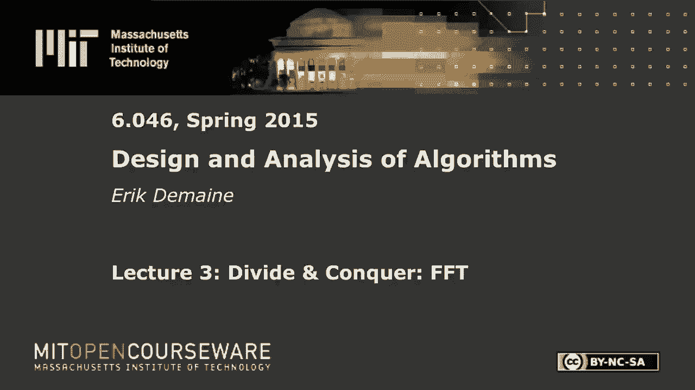
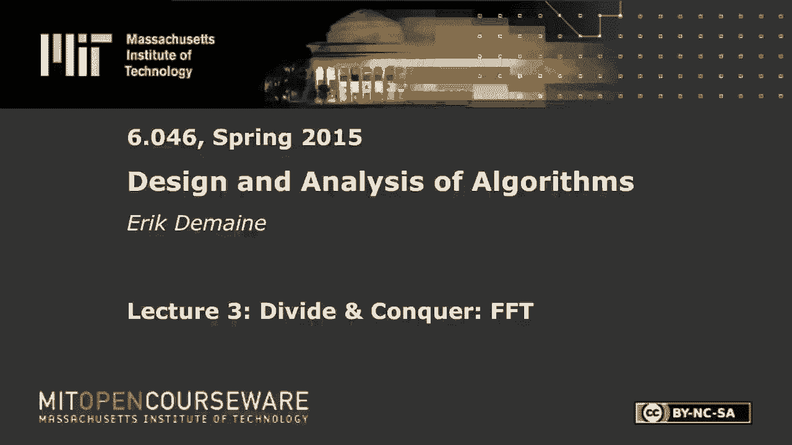

# L3：分治：快速傅里叶变换 🌀







在本节课中，我们将要学习一种强大的分治算法——快速傅里叶变换。这是一种在数字信号处理、音频压缩等领域广泛使用的算法，其核心目标是在 `O(n log n)` 时间内高效地完成多项式乘法。

## 概述：多项式与运算

多项式通常表示为一系列系数。例如，一个次数为 `n-1` 的多项式 `A(x)` 可以写作：
```
A(x) = a_0 + a_1*x + a_2*x^2 + ... + a_{n-1}*x^{n-1}
```
我们也可以将其视为一个系数向量 `[a_0, a_1, ..., a_{n-1}]`。

对于多项式，我们通常关心三种运算：
1.  **求值**：给定一个具体的 `x` 值，计算 `A(x)`。
2.  **加法**：计算两个多项式的和 `C(x) = A(x) + B(x)`。
3.  **乘法**：计算两个多项式的乘积 `C(x) = A(x) * B(x)`。

求值和加法都可以在 `O(n)` 时间内完成。然而，朴素的乘法算法（直接应用卷积公式）需要 `O(n^2)` 的时间。本节课的目标就是利用快速傅里叶变换，将多项式乘法的时间复杂度降至 `O(n log n)`。

## 多项式的不同表示法

为了高效地进行乘法，我们需要在不同的多项式表示法之间进行转换。主要有两种表示法：

1.  **系数表示法**：即我们熟悉的 `[a_0, a_1, ..., a_{n-1}]` 形式。
2.  **点值表示法**：通过在一组互不相同的点 `{x_0, x_1, ..., x_{n-1}}` 上对多项式进行求值，得到一组值 `{y_0, y_1, ..., y_{n-1}}`，其中 `y_k = A(x_k)`。这 `n` 个点值对唯一确定了一个 `n-1` 次多项式。

这两种表示法在执行三种运算时各有优劣：

| 运算 | 系数表示法 | 点值表示法 |
| :--- | :--- | :--- |
| **求值** | `O(n)` | `O(n)` (如果点已给定) |
| **加法** | `O(n)` | `O(n)` (对应点值相加) |
| **乘法** | `O(n^2)` | `O(n)` (对应点值相乘) |

从上表可以看出，在点值表示法下，多项式乘法变得异常简单，只需将对应点的值相乘即可。这为我们提供了一个思路：**先将多项式从系数表示转换为点值表示，然后在点值表示下进行 `O(n)` 的乘法，最后再将结果转换回系数表示**。

问题的关键就在于这两种表示法之间的转换。朴素的转换（求值或插值）是 `O(n^2)` 的。接下来，我们将看到如何利用分治策略和复数的特殊性质，在 `O(n log n)` 时间内完成这一转换。

## 分治策略与单位根

我们的目标是计算多项式 `A(x)` 在 `n` 个特定点 `{x_0, x_1, ..., x_{n-1}}` 上的值。假设 `n` 是 2 的幂次（可以通过补零实现）。

分治的核心思想是将多项式按奇偶次项拆分：
```
A(x) = A_even(x^2) + x * A_odd(x^2)
```
其中：
- `A_even(x^2) = a_0 + a_2*x^2 + a_4*x^4 + ...`
- `A_odd(x^2) = a_1 + a_3*x^2 + a_5*x^4 + ...`

这样，原问题（在 `n` 个点上求值 `A(x)`）被转化为两个子问题（在 `n` 个点的平方上求值两个 `n/2` 次的多项式 `A_even` 和 `A_odd`）。

为了使分治有效，我们需要选择的点集 `{x_k}` 满足一个关键性质：**当它们被平方后，得到的点集会缩小到原来的一半**。这样，子问题的规模（点的数量）才会减半。

复平面上的**单位根**恰好满足这一性质。`n` 次单位根是方程 `ω^n = 1` 的 `n` 个复数解，它们均匀分布在复平面的单位圆上。第 `k` 个 `n` 次单位根可以表示为：
```
ω_n^k = e^{i * (2πk / n)} = cos(2πk/n) + i * sin(2πk/n)
```
其中 `i` 是虚数单位。

单位根具有以下重要性质：
1.  **消去引理**：`(ω_n^k)^2 = ω_{n/2}^k`。这意味着，当我们对 `n` 个 `n` 次单位根求平方时，会得到 `n/2` 个 `n/2` 次单位根（每个出现两次）。
2.  **折半引理**：正是由于消去引理，平方后的点集大小减半，这保证了分治递归中问题规模的缩减。

因此，我们选择 `x_k = ω_n^k` 作为求值点。基于此的分治算法就是**快速傅里叶变换**。

## 快速傅里叶变换算法

FFT 是一个递归算法，用于计算多项式在 `n` 个 `n` 次单位根上的值（即从系数表示到点值表示的转换）。

以下是算法的伪代码描述：
```
function FFT(a):
    // 输入：系数向量 a = [a_0, a_1, ..., a_{n-1}]，n 是 2 的幂
    // 输出：点值向量 y = [A(ω_n^0), A(ω_n^1), ..., A(ω_n^{n-1})]

    if n == 1:
        return a  // 多项式是常数，点值就是它本身

    // 1. 分：按奇偶拆分系数
    a_even = [a_0, a_2, a_4, ...]
    a_odd = [a_1, a_3, a_5, ...]

    // 2. 治：递归计算子问题
    y_even = FFT(a_even)  // 计算 A_even 在 ω_{n/2}^0, ω_{n/2}^1, ... 上的值
    y_odd = FFT(a_odd)    // 计算 A_odd 在 ω_{n/2}^0, ω_{n/2}^1, ... 上的值

    // 3. 合：合并结果
    for k from 0 to n/2 - 1:
        ω = ω_n^k
        y[k] = y_even[k] + ω * y_odd[k]
        y[k + n/2] = y_even[k] - ω * y_odd[k] // 利用 ω_n^{k+n/2} = -ω_n^k 的性质

    return y
```
该算法的时间复杂度满足递归式 `T(n) = 2T(n/2) + O(n)`，由主定理可得 `T(n) = O(n log n)`。

## 快速傅里叶逆变换

上一节我们介绍了如何从系数表示快速转换到点值表示（FFT）。为了完成多项式乘法，我们还需要能将点值表示转换回系数表示，这个逆过程称为**快速傅里叶逆变换**。

令人惊喜的是，IFFT 的算法结构与 FFT 几乎完全相同。唯一的区别在于：
1.  将 FFT 中使用的单位根 `ω_n^k` 替换为其**共轭复数** `ω_n^{-k}`。
2.  将最终得到的每个结果除以 `n`。

数学上可以证明，点值向量 `y` 与系数向量 `a` 之间的关系由以下矩阵方程描述：
```
y = V * a
```
其中 `V` 是一个范德蒙德矩阵，`V[j][k] = (ω_n^k)^j`。而逆变换的矩阵恰好是 `V` 的共轭转置除以 `n`：
```
a = (1/n) * conjugate(V) * y
```
因此，运行 FFT 算法，但将单位根替换为其共轭，最后将结果除以 `n`，就得到了 IFFT。

## 完整的快速多项式乘法算法

现在，我们可以将整个过程串联起来，实现 `O(n log n)` 的多项式乘法。

以下是完整的步骤：
1.  **加倍次数与补零**：给定两个 `n-1` 次多项式 `A(x)` 和 `B(x)`，其乘积 `C(x)` 的次数最多为 `2n-2`。我们取 `N` 为大于 `2n-1` 的最小的 2 的幂，并将 `A` 和 `B` 的系数向量补零到长度 `N`。
2.  **计算 FFT**：分别对 `A` 和 `B` 的系数向量应用 FFT，得到它们在 `N` 个 `N` 次单位根上的点值表示 `A*` 和 `B*`。
3.  **点值相乘**：计算 `C*[k] = A*[k] * B*[k]`，对于 `k = 0, 1, ..., N-1`。这步是 `O(N)` 的。
4.  **计算 IFFT**：对点值向量 `C*` 应用 IFFT，得到乘积多项式 `C(x)` 的系数向量。

整个算法的时间复杂度为 `O(N log N)`，由于 `N = O(n)`，所以也就是 `O(n log n)`。

## 应用与总结

本节课我们一起学习了快速傅里叶变换的原理与算法。FFT 的核心价值在于它极大地加速了卷积运算（多项式乘法的推广），这使其在众多领域成为基石算法：

*   **数字信号处理**：音频滤波（如高通、低通滤波器）、压缩（如 MP3）、降噪。
*   **图像处理**：图像模糊、锐化、特征提取等卷积操作。
*   **快速大数乘法**：可以将大整数视为以基数为变量的多项式，用 FFT 加速乘法。
*   **求解偏微分方程**：在谱方法中用于转换物理空间和频域空间。

FFT 巧妙地将一个 `O(n^2)` 的问题降至 `O(n log n)`，其成功的关键在于：
1.  利用了**点值表示法**下乘法简单的特性。
2.  设计了基于**分治策略**的递归算法。
3.  选择了具有**折半性质**的**单位根**作为求值点，保证了递归的有效性。
4.  发现了正变换与逆变换在算法上的**高度对称性**。

理解 FFT 不仅掌握了一个高效算法，更领略了通过改变问题表示和利用数学结构来设计算法的美妙之处。