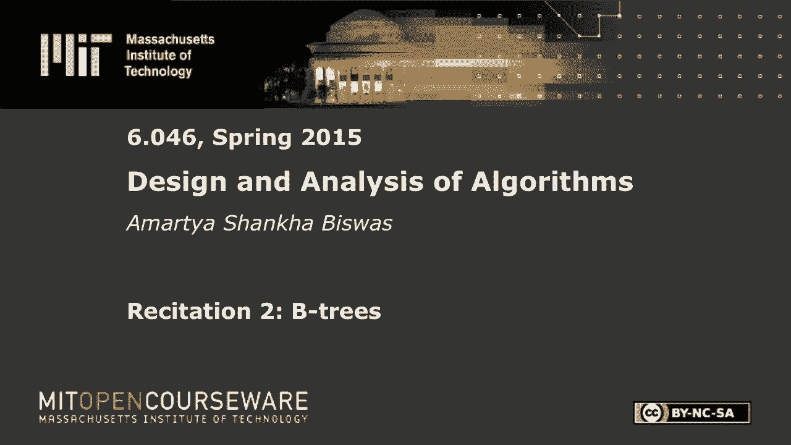
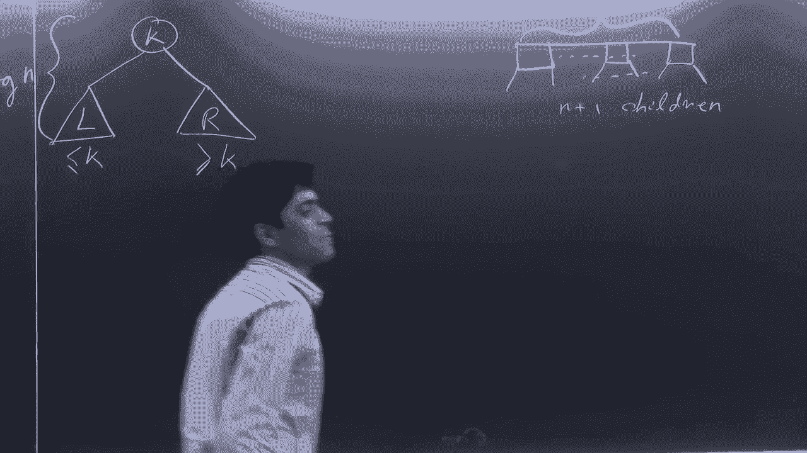
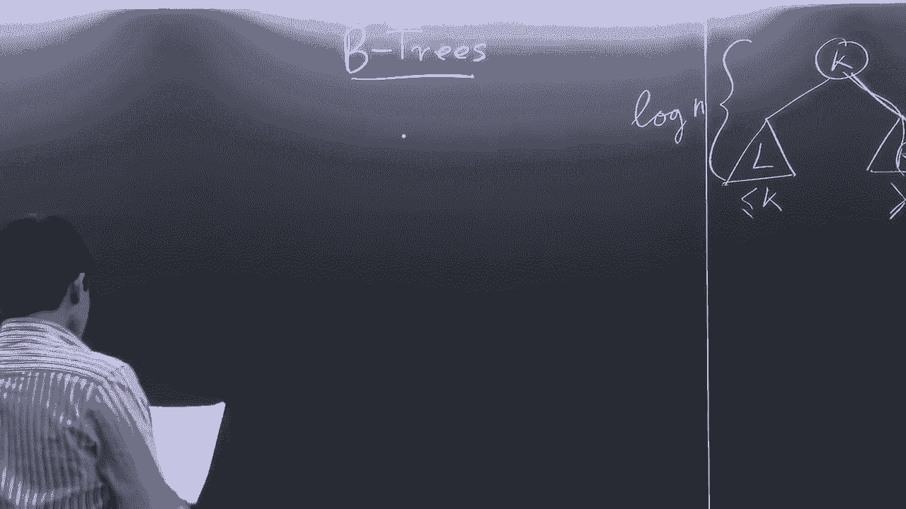
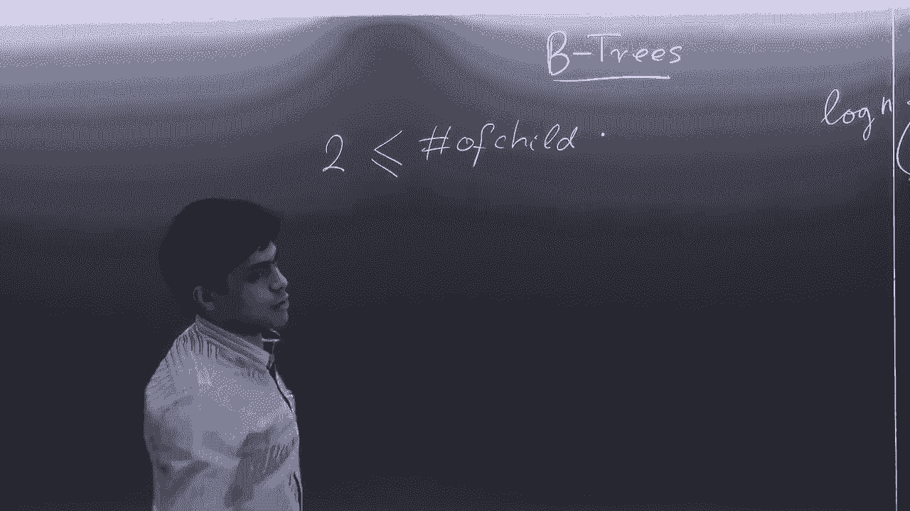

# R2：2-3树与B树 🌳

在本节课中，我们将要学习2-3树与B树。这两种数据结构是二叉搜索树的重要扩展，特别适用于需要高效利用内存层次结构（如缓存与磁盘）的系统。我们将从B树的基本结构开始，逐步探讨其搜索、插入和删除操作的核心原理。

## 概述

B树是一种自平衡的树数据结构，它允许每个节点拥有多于两个子节点。与二叉搜索树相比，B树通过增加每个节点的分支数量来降低树的高度，从而减少在访问外部存储（如磁盘）时所需的I/O操作次数。本节将详细介绍B树的定义、性质以及核心操作。

## B树的基本结构与性质

上一节我们介绍了平衡二叉搜索树，本节中我们来看看B树是如何定义的。

一棵B树具有以下关键性质：
*   它是一棵完全平衡的树，所有叶子节点都位于同一深度。
*   每个节点可以包含多个键和多个子节点指针。
*   存在一个称为**分支因子**的整数 `B`，它定义了节点子节点数量的上下界（根节点除外）。

以下是关于节点键值与子节点数量的具体规则：
*   设一个节点中包含的键的数量为 `n`。
*   那么该节点拥有的子节点数量为 `n + 1`。
*   对于非根节点，其键的数量 `n` 满足：`B - 1 ≤ n ≤ 2B - 1`。
*   对于根节点，其键的数量 `n` 满足：`1 ≤ n ≤ 2B - 1`（它可以只有一个键）。

这些规则确保了树的平衡与紧凑。例如，在一棵 **2-3树**（即 `B=2` 的B树）中，每个非根节点可以有2个或3个子节点（即包含1个或2个键）。

## 为何使用B树？💾

在了解了B树的结构后，你可能会问，为什么要在二叉搜索树之外使用B树？原因与计算机的内存层次结构有关。

在简单的计算模型中，我们通常假设所有内存访问速度相同。但实际上，计算机拥有多级存储：CPU寄存器、高速缓存、主内存（RAM）和磁盘。越靠近CPU的存储速度越快，但容量越小；磁盘速度慢，但容量大。

当数据量大到无法全部放入内存时，就必须存储在磁盘上。磁盘访问以“块”为单位，每次读取一个数据块（包含B个字节）到缓存中。如果我们使用二叉搜索树，每次访问一个节点都可能引发一次磁盘I/O，效率低下。

B树的设计巧妙之处在于，我们可以将节点的大小设置为约等于一个磁盘块的大小。这样，每次从磁盘读取一个节点，就能获取到多个键和子节点指针，从而在树中下降一层。**树的高度从 `O(log₂ N)` 降低到 `O(log_B N)`**，由于 `B` 远大于2，因此显著减少了访问磁盘的次数。

## B树的操作

理解了B树存在的意义后，我们接下来看看如何在B树上执行基本操作。

### 搜索操作 🔍

在B树中搜索一个键 `K` 的过程与二叉搜索树类似，但需要在每个节点内部进行顺序比较。

搜索算法步骤如下：
1.  从根节点开始。
2.  在当前节点中，将键 `K` 与节点内已排序的键进行比较。
3.  如果找到相等的键，则搜索成功。
4.  否则，找到第一个大于 `K` 的键，并进入其左侧的子节点；如果 `K` 大于所有键，则进入最右侧的子节点。
5.  重复步骤2-4，直到到达叶子节点。如果在叶子节点仍未找到，则搜索失败。

由于树是平衡的，搜索的时间复杂度为 `O(log_B N)`。

### 插入操作 ➕

插入操作比搜索复杂，因为可能破坏B树的节点容量规则。核心思想是：先找到应插入的叶子节点，插入后如果节点“溢出”（键数超过 `2B-1`），则进行**分裂**。

分裂操作的步骤如下：
1.  将溢出的节点（包含 `2B-1` 个键）其中间的键（第 `B` 个键）提升到父节点。
2.  以该中间键为界，将原节点分裂成两个新节点，分别包含 `B-1` 个键。
3.  将这两个新节点作为父节点中提升键的左右子节点。
4.  提升操作可能导致父节点溢出，此时需要递归地对父节点进行分裂。
5.  如果分裂一直传递到根节点，并使根节点溢出，则提升中间键创建一个新的根节点，树的高度增加1。

以下是一个插入后触发分裂的简要示例：
*   假设 `B=3`，一个叶子节点已满（有5个键）。现在要插入一个新键使其溢出。
*   将该节点的中间键（第3个键）提升至父节点。
*   原节点分裂为两个节点，各包含2个键。

### 删除操作 ➖

删除操作最为复杂，因为可能造成节点“下溢”（键数少于 `B-1`）。核心策略是：首先确保被删除的键在叶子节点上，然后处理可能的下溢。

删除算法的关键步骤如下：

**步骤一：将删除移至叶子节点**
如果要删除的键 `K` 不在叶子节点，则：
*   找到 `K` 的左子树中的最大键（或右子树中的最小键），这个键必然在某个叶子节点上。
*   用这个叶子键替换 `K`。
*   问题转化为从叶子节点中删除那个被替换上来的键。

**步骤二：从叶子节点删除并处理下溢**
从叶子节点删除键后，如果该节点键数仍满足 `≥ B-1`，则操作完成。否则，需要修复下溢，主要有两种策略：

以下是两种修复策略：
1.  **旋转**：如果某个相邻兄弟节点有额外的键（键数 `> B-1`），则可以从父节点借一个键，并从兄弟节点移一个键上来。这类似于二叉搜索树中的旋转操作。
2.  **合并**：如果左右兄弟节点都没有多余的键（键数刚好等于 `B-1`），则将该节点、一个兄弟节点以及父节点中分隔它们的键合并成一个新节点。这个操作会使父节点减少一个键，可能导致父节点发生下溢，因此可能需要递归向上修复。

## 总结

本节课中我们一起学习了2-3树与B树。我们从B树为适应内存层次结构而设计的背景出发，详细讲解了其多分支节点的结构定义和性质。随后，我们深入探讨了B树的三大核心操作：**搜索**、**插入**和**删除**。重点是插入时的**节点分裂**和删除时为维持平衡而进行的**旋转**与**合并**操作。掌握B树有助于理解数据库、文件系统等如何高效管理大规模数据。