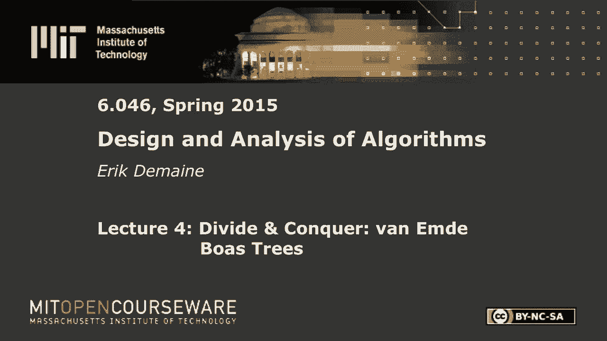
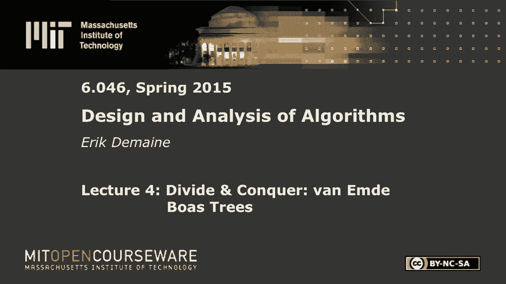
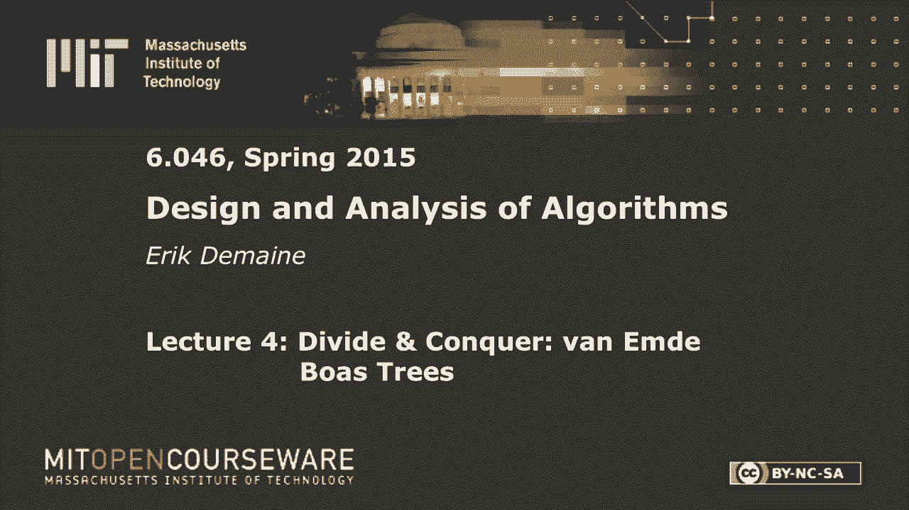

# L4：分治：vEB树 🌳









在本节课中，我们将要学习一种非常高效的数据结构——van Emde Boas树（简称vEB树）。这种数据结构能够以惊人的速度处理整数集合上的操作，其核心思想是巧妙的分治策略。我们将从基础概念开始，逐步构建出完整的vEB树，并理解其如何实现超快的查询速度。

## 概述

vEB树用于解决**前驱/后继查询**问题。我们存储一个来自大小为 `u` 的宇宙（即整数范围 `[0, u-1]`）的整数集合 `S`（包含 `n` 个元素）。它需要高效支持以下操作：
*   **插入(Insert)**：向集合 `S` 中添加一个整数 `x`。
*   **删除(Delete)**：从集合 `S` 中移除一个整数 `x`。
*   **后继(Successor)**：给定一个值 `x`，返回集合 `S` 中大于 `x` 的最小值。

使用平衡二叉搜索树（如AVL树），我们可以在 `O(log n)` 时间内完成这些操作。而vEB树的目标是将其加速到 **`O(log log u)`** 时间。在许多实际应用中（如网络路由表，`u` 可能是 `2^32`），`log log u` 是一个非常小的常数（例如5），这比 `log n` 快得多。

## 设计思路演进

上一节我们介绍了问题的定义和目标。本节中，我们来看看如何通过一系列改进，从简单的想法出发，最终构建出vEB树。

### 起点：位向量法

首先，考虑一个最直接的数据结构：**位向量**。
*   我们创建一个大小为 `u` 的布尔数组 `A`。
*   如果整数 `i` 在集合中，则 `A[i] = 1`，否则 `A[i] = 0`。

**操作分析：**
*   **插入(x)**：`A[x] = 1`。时间复杂度：`O(1)`。
*   **删除(x)**：`A[x] = 0`。时间复杂度：`O(1)`。
*   **后继(x)**：需要从位置 `x+1` 开始向后扫描，直到找到下一个 `1`。最坏情况时间复杂度：`O(u)`。

虽然插入和删除很快，但后继查询太慢。我们需要改进。

### 改进一：引入簇与摘要

为了加速后继查询，我们将宇宙（大小为 `u`）划分为多个**簇**。
*   设每个簇的大小为 `cluster_size = √u`（即 `u` 的平方根）。
*   那么簇的数量也为 `num_clusters = √u`。

我们维护两个结构：
1.  **簇数组**：一个长度为 `√u` 的数组，每个元素本身是一个位向量，用于管理该簇内的元素。
2.  **摘要向量**：一个长度为 `√u` 的位向量。摘要的第 `i` 位为 `1`，当且仅当第 `i` 个簇为非空（即包含至少一个元素）。

**后继查询算法**：
1.  首先在 `x` 所属的簇内（簇号 `high(x) = floor(x / √u)`）查找后继。
2.  如果在该簇内找到了，则返回结果。
3.  如果没找到，则在**摘要向量**中查找，找到下一个为 `1` 的位（即下一个非空簇）`i‘`。
4.  最后，在簇 `i‘` 中查找最小的元素（即第一个为 `1` 的位）。

**操作分析：**
*   后继查询需要在簇内和摘要向量中各做一次扫描，每次扫描成本为 `O(√u)`。
*   因此，后继查询的最坏时间复杂度为 `O(√u)`。
*   插入和删除仍为 `O(1)`（需要更新对应的簇和摘要位）。

这比纯位向量好，但还不够快。`O(√u)` 仍然远大于我们的目标 `O(log log u)`。

### 改进二：递归结构

关键洞察来了：我们不应该用简单的位向量来表示簇和摘要，而应该**递归地**使用相同的数据结构！
*   每个簇管理一个大小为 `√u` 的子宇宙。
*   摘要向量管理 `√u` 个簇的“非空”信息，这本身也是一个大小为 `√u` 的集合。

因此，我们定义vEB树结构 `vEB(u)` 如下：
*   `vEB.min`：存储该树中的最小元素（一个特殊的优化字段）。
*   `vEB.max`：存储该树中的最大元素。
*   `vEB.cluster`：一个大小为 `√u` 的数组，其中每个元素 `vEB.cluster[i]` 都是一个 `vEB(√u)` 结构，管理簇 `i` 中的元素。
*   `vEB.summary`：一个 `vEB(√u)` 结构，用于记录哪些簇是非空的。

这里，`high(x)` 和 `low(x)` 函数用于在全局索引和簇内索引间转换：
*   `high(x) = floor(x / √u)` （簇号）
*   `low(x) = x % √u` （簇内偏移）
*   `index(i, j) = i * √u + j` （根据簇号和偏移重建全局索引）

现在，后继查询的递归算法如下：

```
function Successor(vEB V, int x):
    // 情况1：x 小于当前树的最小值，后继就是最小值
    if x < V.min:
        return V.min

    // 在x所在的簇i中查找后继
    i = high(x)
    j = Successor(V.cluster[i], low(x))

    if j != NIL: // 在簇i内找到了后继
        return index(i, j)
    else: // 在簇i内没找到，需要找下一个非空簇
        i_succ = Successor(V.summary, i)
        if i_succ == NIL: // 没有后续的非空簇了
            return NIL
        else:
            j_min = V.cluster[i_succ].min // 下一个非空簇的最小元素
            return index(i_succ, j_min)
```

**时间复杂度分析**：这个算法进行了**两次**递归调用（一次在簇内，一次在摘要中）。这导致了递归式：`T(u) = 2 * T(√u) + O(1)`。根据主定理，这解出 `T(u) = O(log u)`，仍然不是我们想要的 `O(log log u)`。

### 改进三：最大值优化

我们可以通过存储**最大值** `V.max` 来避免一次递归调用。关键在于：当我们查询 `x` 在簇 `i` 中的后继时，如果 `low(x)` 已经**大于等于**该簇的最大值 `V.cluster[i].max`，那么我们**肯定**无法在该簇内找到后继，可以直接跳到摘要中查找下一个非空簇。否则，我们才需要在簇内查找。

优化后的算法：

```
function Successor(vEB V, int x):
    if x < V.min:
        return V.min

    i = high(x)
    // 关键判断：如果x的低位部分小于该簇的最大值，则后继一定在本簇内
    if low(x) < V.cluster[i].max:
        j = Successor(V.cluster[i], low(x))
        return index(i, j)
    else: // 否则，后继在下一个非空簇中
        i_succ = Successor(V.summary, i)
        if i_succ == NIL:
            return NIL
        else:
            j_min = V.cluster[i_succ].min
            return index(i_succ, j_min)
```

现在，我们**每次只执行两个递归分支中的一个**。递归式变为：`T(u) = T(√u) + O(1)`。这个递归式的解正是 `T(u) = O(log log u)`！我们终于达到了目标。

### 改进四：最小值的特殊处理与高效插入

为了也让插入操作达到 `O(log log u)`，我们需要对**最小值**进行特殊处理。
*   `V.min` 元素**不递归存储**在 `V.cluster` 中。它被单独保存在 `V.min` 字段里。
*   当一个结构为空时，插入一个元素 `x` 只需简单地设置 `V.min = V.max = x`，成本为 `O(1)`。
*   当插入的元素 `x` 比当前 `V.min` 还小时，我们将原来的 `V.min` 与 `x` 交换，然后将原来的 `V.min` 递归插入到适当的簇中。
*   只有在向一个**空簇**插入第一个元素时，才需要递归地更新摘要 `V.summary`。而根据上一条，向空结构（空簇）插入第一个元素是 `O(1)` 的。

这种“惰性”处理最小值的策略，确保了插入操作在最坏情况下也只有一个“真正”的递归调用（要么插入簇，要么更新摘要），从而实现了 `O(log log u)` 的时间复杂度。

删除操作也遵循类似但稍复杂的对称逻辑，需要处理删除最小值、最大值等特殊情况，以维持结构的不变性，其时间复杂度同样为 `O(log log u)`。

## 总结

本节课中我们一起学习了van Emde Boas树的设计与演进。我们从最简单的位向量开始，通过引入簇和摘要的概念进行分治，然后递归地应用这一结构。通过存储最大值 (`max`) 来优化后继查询，避免不必要的递归分支。最后，通过对最小值 (`min`) 进行特殊且“惰性”的处理，实现了所有核心操作（插入、删除、后继）在 **`O(log log u)`** 时间内完成。vEB树是分治思想在数据结构设计中一个非常经典和优美的应用，它虽然理论复杂，但在诸如网络路由表等需要极快查询速度的实际场景中有着重要应用。