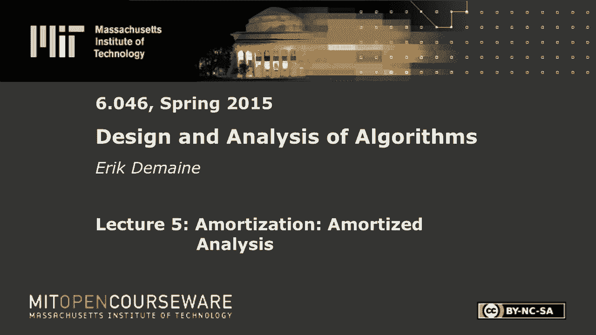
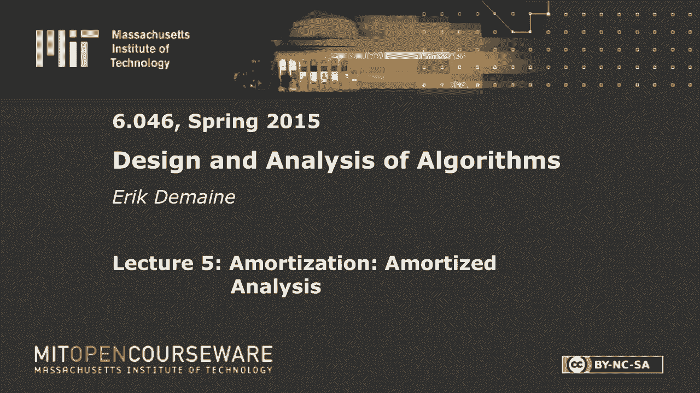

# L5：平摊分析 🧮

在本节课中，我们将要学习一种重要的算法分析技术——平摊分析。平摊分析不关注单个操作的最坏情况成本，而是关注一系列操作的总成本，从而得出每个操作的平均成本。这种方法对于分析许多数据结构（如动态表、平衡树）的性能非常有用。我们将介绍四种主要的平摊分析方法，并通过多个例子来理解它们。

## 概述

平摊分析的核心思想是，某些操作可能偶尔非常耗时，但通过分析整个操作序列，可以证明每个操作的平均成本很低。这与金融中的“摊销”概念类似。我们主要关心算法的总运行时间，而非每个操作的单独时间。接下来，我们将通过几个经典例子来探讨不同的平摊分析方法。

## 聚合分析法

聚合分析法是最直观的平摊分析方法。它计算一个操作序列的总成本，然后除以操作次数，得到每个操作的平均（平摊）成本。

上一节我们介绍了平摊分析的基本概念，本节中我们来看看第一种具体方法——聚合分析法。

一个经典的例子是动态表的“表加倍”策略。在哈希表中，当元素数量`n`增长到与表大小`m`相等时，我们将表的大小加倍。单次加倍操作需要`Θ(m)`时间，这看起来代价很高。

然而，如果我们从空表开始，分析`n`次插入的总成本，情况就不同了。每次加倍的成本形成一个几何级数：`1 + 2 + 4 + ... + 2^(log n) ≈ 2n`。因此，`n`次插入的总成本为`Θ(n)`，每次插入的平摊成本为常数。

以下是聚合分析法的关键步骤：
*   计算整个操作序列的总实际成本。
*   将总成本除以操作次数，得到平摊成本。

聚合分析法在操作序列明确且总和易于计算时非常有效。

## 平摊分析的一般定义

当操作类型混合时，我们需要一个更灵活的定义。我们可以为每种操作分配一个“平摊成本”，使得对于任何操作序列，分配的平摊成本总和总是大于或等于实际成本总和。

上一节我们通过聚合法分析了简单的序列，本节中我们来看看更通用的平摊成本定义。

形式化地说，对于一系列操作，如果实际成本总和为`∑ actual_cost`，我们分配的平摊成本总和为`∑ amortized_cost`，则需要满足：
`∑ actual_cost ≤ ∑ amortized_cost`
如果我们能证明每个操作的平摊成本是常数，那么总实际成本也就是线性的。在像Dijkstra这样的算法中，我们只关心总成本，因此平摊分析非常适用。

以2-3树为例，我们考虑三种操作：创建（常数时间）、插入（`O(log n)`时间）、删除（`O(log n)`时间）。由于不能删除未插入的元素，删除次数`d`总小于等于插入次数`i`。因此，总成本`c + i*log n + d*log n ≤ c + 2i*log n`。我们可以认为删除的平摊成本为0，而插入的平摊成本为`2 log n`，这仍然满足上述不等式。

## 会计分析法

会计分析法（或银行家算法）引入“银行账户”和“信用”的概念。我们为操作支付比其实际成本更多的“平摊费用”，并将多余的部分作为信用存入银行。当后续执行昂贵操作时，可以从银行提取信用来支付成本。

上一节我们定义了平摊成本，本节中我们通过会计分析法来动态管理这些成本。

关键规则是银行余额必须始终非负。这保证了存入的信用足以支付未来的昂贵操作，从而确保平摊成本总和是实际成本总和的上限。

再次以“表加倍”为例。每次执行普通插入时，我们除了支付常数时间成本外，还额外支付一个常数信用，并将该信用存储在插入的元素上。当数组已满需要加倍时，加倍操作的实际成本为`Θ(m)`。此时，数组中约有一半的元素（即上次加倍后插入的元素）存储有信用。我们可以使用这些信用来“支付”加倍操作的成本。只要每个信用代表的常数足够大，就能覆盖加倍的成本，使得加倍操作的平摊成本为0，而插入操作的平摊成本仍为常数。

## 核算法

核算法是会计分析法的一种变体，它允许将当前操作的（部分）成本“追溯”到过去的某个或某些操作上。这相当于让过去的操作为其导致的未来开销提前“买单”。

上一节我们将信用存入未来，本节我们换个视角，将开销归因于过去。

在“表加倍”的例子中，我们可以这样应用核算法：每次执行加倍操作时，将其`Θ(m)`的成本分摊到自上次加倍以来发生的所有插入操作上。因为每次加倍前，恰好有约`m/2`次插入发生了，所以对每次插入只收取常数费用。由于每次插入只会被收费一次（被它之后第一次加倍收费），因此每次插入的平摊成本仍是常数。

对于支持扩容和缩容的动态表（例如，当表100%满时加倍，当表25%满时减半），核算法也能清晰分析。我们保证在调整大小（加倍或减半）后，表是50%满的。要达到需要减半的状态，必须发生至少`m/4`次删除；要达到需要加倍的状态，必须发生至少`m/2`次插入。我们可以将每次调整大小的成本摊派到触发这次调整的、自上次调整以来发生的那些插入或删除操作上。每个操作同样只被收费常数次，因此插入和删除的平摊成本都是常数。

## 势能法

势能法是最形式化、最强大的平摊分析方法。它定义一个与整个数据结构状态相关的“势能函数”`Φ(D)`。每次操作的平摊成本定义为：
`amortized_cost = actual_cost + ΔΦ = actual_cost + (Φ(D_after) - Φ(D_before))`
我们要求势能函数始终非负，且初始状态（通常为空）的势能为0。这样，所有操作的总平摊成本`∑ amortized_cost`就等于总实际成本`∑ actual_cost`加上最终势能`Φ(D_final)`，由于`Φ(D_final) ≥ 0`，因此总平摊成本是总实际成本的上限。

上一节的方法依赖于具体的收费策略，本节介绍的势能法则通过一个函数来统一刻画数据结构的“混乱”程度。

**例子1：二进制计数器递增**
考虑一个`k`位二进制计数器从0开始递增。一次递增的实际成本是翻转的位数（例如，从0111到1000翻转了4位）。最坏情况下单次成本为`O(k)`。
我们定义势能函数`Φ`为计数器中位值为1的个数。设一次递增操作翻转了`t`个尾部的1位为0，并将一个0翻转为1。那么实际成本为`t+1`。势能变化`ΔΦ`为：减少`t`个1，增加1个1，即`ΔΦ = -t + 1`。
因此，平摊成本为：`amortized_cost = (t+1) + (-t+1) = 2`。
所以，每次递增操作的平摊成本是常数`O(1)`。

**例子2：2-3树的插入操作**
在2-3树中插入一个键可能导致节点分裂，并向上传播。一次插入可能引发多达`O(log n)`次分裂。
我们定义势能函数`Φ`为树中3-节点（拥有两个键、三个子节点的节点）的数量。
插入过程中，每次分裂都会将一个3-节点（在接收一个键后变成临时的4-节点）转换成两个2-节点，并将一个键提升到父节点。这会使势能`Φ`减少1（一个3-节点消失）。分裂传播停止时，可能会在树顶创建一个新的3-节点，使势能增加1。
假设一次插入引发了`s`次分裂。那么实际成本为`O(s)`（忽略查找成本）。势能变化`ΔΦ`最多为`-s + 1`。
因此，平摊成本`amortized_cost = O(s) + (-s + 1) = O(1)`。这表明2-3树插入的分裂次数平摊下来是常数。

**例子3：2-3-4-5树（B树）的插入与删除**
为了同时高效处理插入和删除，我们使用节点容量更大的B树，例如2-5树（每个节点允许2到5个子节点）。
我们定义势能函数`Φ`为树中2-节点和5-节点的数量之和。这两类节点是“临界”节点，容易引发合并或分裂。
*   **插入**：可能导致5-节点分裂。每次分裂消耗一个5-节点（势能-1），产生两个非5-节点，并在父节点可能新增一个5-节点（势能+1）。平摊分析类似2-3树。
*   **删除**：可能导致2-节点合并。每次合并消耗一个2-节点（势能-1），并在父节点可能新增一个2-节点（势能+1）。

关键在于，在2-5树中，分裂和合并操作本身不会直接产生新的临界节点（2-节点或5-节点），从而可以将操作成本抵消掉势能的变化。最终可以证明，每次插入或删除的平摊成本（仅指结构调整，如分裂/合并的次数）为常数`O(1)`。这使得2-5树在需要频繁修改的场景中比2-3树更具优势。

## 总结

本节课中我们一起学习了平摊分析这一重要的算法分析技术。我们首先了解了其核心思想：通过分析操作序列的总成本来得到更优的平均性能上界。接着，我们系统地学习了四种分析方法：
1.  **聚合分析法**：直接计算序列总成本并求平均，适用于简单序列。
2.  **会计分析法**：通过“信用”机制，让廉价操作预存信用以支付未来的昂贵操作。
3.  **核算法**：将昂贵操作的成本追溯分摊到之前引发该成本的操作上。
4.  **势能法**：定义数据结构的势能函数，将操作的成本与势能变化联系起来，是最通用和强大的方法。

我们通过动态表扩容、二进制计数器、2-3树和2-5树等经典例子，深入理解了这些方法的应用。平摊分析揭示了即使单次操作可能很慢，但长期来看平均性能依然可以很高，这对于设计和分析高效数据结构至关重要。