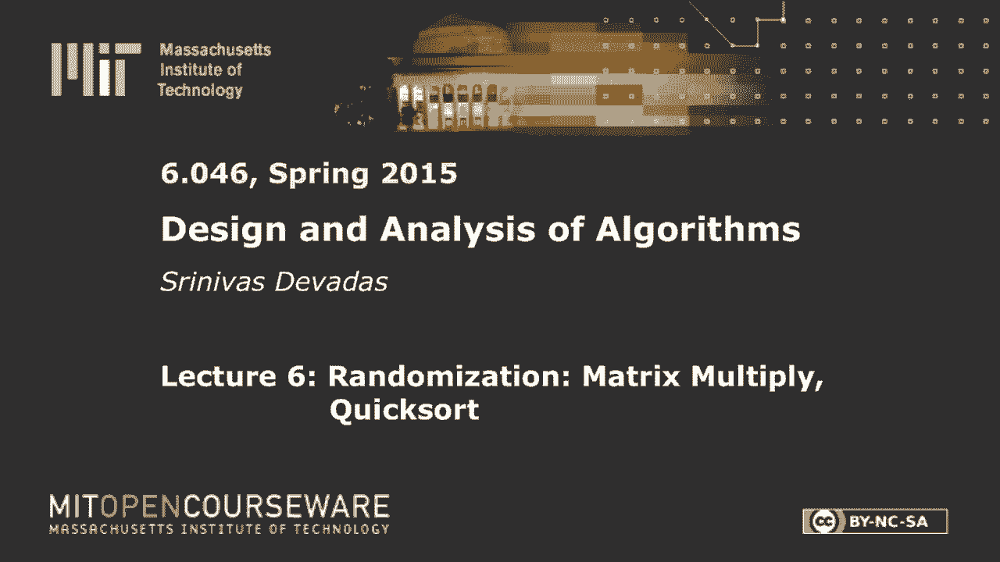
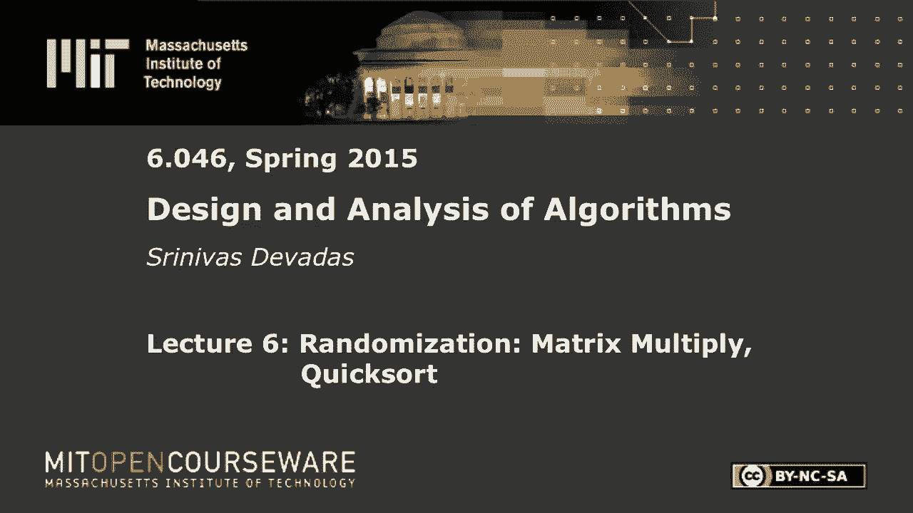
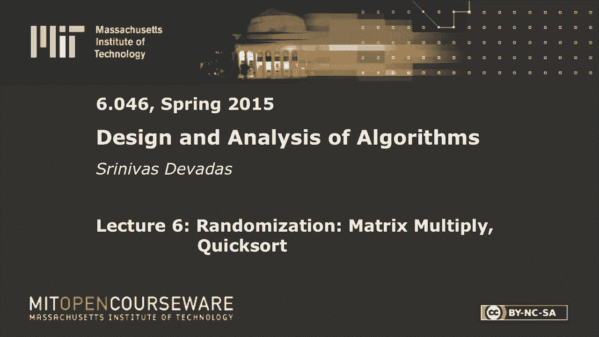

# L6：矩阵乘法、快速排序 🧮⚡









在本节课中，我们将要学习随机算法。我们将通过两个经典例子——矩阵乘法验证和快速排序——来理解随机算法的核心思想、分类以及如何分析其性能。我们将看到，通过引入随机性，我们可以在保证正确性或效率的前提下，获得比确定性算法更优的解决方案。

## 随机算法简介 🎲

随机算法是一种在执行过程中会生成随机数，并根据这些随机数做出决策的算法。这意味着，即使在相同的输入上多次运行，算法的执行路径和运行时间也可能不同。我们的目标是分析这类算法的**期望运行时间**，或者其输出**正确的概率**。

随机算法主要分为两类：
*   **蒙特卡洛算法**：算法**可能很快**（在期望多项式时间内运行），但**可能不正确**（以一定概率产生错误输出）。
*   **拉斯维加斯算法**：算法**总是正确**，但**可能很快**（在期望多项式时间内运行）。

此外，还存在**大西洋城算法**，它既可能不正确，也可能不快，但在实践中，我们通常希望将算法转化为蒙特卡洛或拉斯维加斯类型。

## 蒙特卡洛算法示例：矩阵乘法验证 ✅❌

上一节我们介绍了随机算法的基本概念，本节中我们来看看一个具体的蒙特卡洛算法例子：快速验证两个大矩阵的乘积结果是否正确。

### 问题与目标 🎯

假设我们有三个 `n x n` 矩阵 **A**, **B**, 和 **C**。我们想验证 **C** 是否确实等于 **A** 和 **B** 的乘积（即 **C = A × B**）。直接计算 **A × B** 需要 `O(n³)` 次乘法，我们希望找到一个更快的验证方法。

我们的目标是设计一个算法，其运行时间为 `O(n²)`，并且满足：
1.  如果 **C = A × B**，算法一定输出“是”（无假阴性）。
2.  如果 **C ≠ A × B**，算法以至少 `1/2` 的概率输出“否”。我们可以通过独立重复运行算法 `k` 次，将错误概率（假阳性）降低到 `1/2ᵏ`。

### Freivalds 算法 🧠

以下就是我们要分析的 Freivalds 算法。

**算法步骤：**
1.  随机生成一个 `n` 维二进制列向量 **r**，其中每个元素 `r[i]` 独立地以 `1/2` 的概率取 `0` 或 `1`。
2.  计算 **P = A × (B × r)** 和 **Q = C × r**。
3.  如果 **P = Q**，则输出“是”，否则输出“否”。

**时间复杂度分析：**
算法需要进行三次矩阵-向量乘法：
*   **B × r**: `O(n²)`
*   **A × (B × r)**: `O(n²)`
*   **C × r**: `O(n²)`
因此，单次运行的总时间复杂度为 `O(n²)`。

**正确性分析（无假阴性）：**
如果 **C = A × B**，那么根据矩阵乘法的结合律，有：
`A × (B × r) = (A × B) × r = C × r`
因此，算法必然输出“是”。

### 错误概率分析（假阳性）📉

困难的部分是分析当 **C ≠ A × B** 时，算法错误输出“是”的概率。我们定义差值矩阵 **D = A × B - C**。那么 **C ≠ A × B** 等价于 **D ≠ 0**（即 **D** 中至少有一个非零元素）。

算法输出“是”的条件是 `A × (B × r) = C × r`，这等价于 `D × r = 0`。所以，我们需要证明：当 **D ≠ 0** 时，`Pr[D × r = 0] ≤ 1/2`。

**证明思路（计数论证）：**
1.  假设 **D ≠ 0**，则存在至少一个非零元素 `D[i][j] ≠ 0`。
2.  考虑所有可能的二进制向量 **r**。我们将那些导致 `D × r = 0` 的 **r** 称为“坏”向量。
3.  对于任意一个“坏”向量 **r**，我们构造一个与之对应的“好”向量 **r' = r + v**，其中 **v** 是一个只有第 `j` 个元素为1，其余为0的向量（即“独热”向量）。
4.  可以证明，`D × r' ≠ 0`，因此 **r‘** 是一个“好”向量。并且，从 **r** 到 **r’** 的映射是一对一的。
5.  由于每个“坏”向量都唯一对应一个“好”向量，所以“好”向量的数量至少和“坏”向量一样多。在所有 `2ⁿ` 个可能的 **r** 中，“好”向量（能检测出错误）的比例至少为 `1/2`。

因此，当 **C ≠ A × B** 时，算法单次运行发现错误的概率 `≥ 1/2`。重复运行 `k` 次，错误概率降至 `≤ 1/2ᵏ`，而总运行时间仅为 `O(kn²)`。

## 拉斯维加斯算法示例：随机快速排序 ⚡📊

接下来，我们转向一个总是正确但运行时间不确定的算法——拉斯维加斯算法的例子：随机快速排序。

### 快速排序回顾与动机 🔄

快速排序是一种基于“分治”策略的原址排序算法。其核心步骤是：
1.  **分区**：从数组中选择一个“枢轴”元素，将数组重新排列，使得所有小于枢轴的元素在其左侧，大于枢轴的元素在其右侧。
2.  **递归**：对左右两个子数组递归地进行快速排序。
3.  **合并**：由于枢轴已在正确位置，递归完成后数组即有序。

快速排序的性能高度依赖于枢轴的选择。最坏情况下（例如数组已有序且总选第一个元素为枢轴），递归树会极度不平衡，导致时间复杂度为 `O(n²)`。

### 随机快速排序 🎯

为了获得更好的**期望性能**，我们引入随机性：在每次递归调用中，**随机地**从当前子数组中选取一个元素作为枢轴。这被称为**随机快速排序**。可以证明，其期望运行时间为 `O(n log n)`。

为了更直观地分析期望性能，我们考察一个稍作修改的版本——**偏执快速排序**。

### 偏执快速排序分析 🤔

偏执快速排序的步骤如下：
```
偏执快速排序(A):
   重复：
      随机选择枢轴 p
      根据 p 对数组 A 进行分区，得到左子数组 L 和右子数组 G
      直到 (|L| ≤ 3|A|/4 且 |G| ≤ 3|A|/4) // 确保分区不太失衡
   递归排序 L
   递归排序 G
```

**算法逻辑：** 它不断随机选择枢轴并进行分区，直到获得一个“不太坏”的分区（即两个子数组的大小都不超过原数组的 `3/4`）。这保证了递归树深度为 `O(log n)`。

**期望运行时间分析：**
令 `T(n)` 为排序 `n` 个元素的期望时间。一次分区操作耗时 `O(n)`，记为 `c·n`。

*   在随机选择的枢轴下，子数组大小超过 `3n/4` 的概率是多少？由于枢轴值均匀随机，它落在排序后数组中间 `1/2` 位置的概率是 `1/2`。这意味着，获得一个“好”分区（`|L|` 和 `|G|` 都 `≤ 3n/4`）的概率 `≥ 1/2`。
*   因此，获得一个好分区所需的**期望尝试次数**为 `1 / (1/2) = 2` 次。每次尝试需要 `c·n` 时间。
*   一旦获得好分区，我们需要递归排序两个子数组，它们的大小最多为 `3n/4`。

由此，我们可以写出期望时间的递归式：
`T(n) ≤ T(3n/4) + T(n/4) + 2c·n`

**递归树分析：**
我们可以通过递归树来求解这个递推式。
1.  根节点的工作量是 `2c·n`。
2.  下一层，两个子问题的大小分别为 `3n/4` 和 `n/4`，它们的工作量之和小于 `2c·(3n/4 + n/4) = 2c·n`。
3.  实际上，每一层所有节点的工作量之和都 `≤ 2c·n`。
4.  递归的深度是多少？由于每次递归数组大小至少缩减为原来的 `3/4`，所以深度为 `log_{4/3} n = O(log n)`。

因此，总期望工作量 `T(n) = O(n) * O(log n) = O(n log n)`。

这个分析展示了随机性如何帮助我们以高概率获得平衡的分区，从而在期望上达到高效排序。标准的随机快速排序分析思路类似，但需要更精细的概率计算。

## 总结 📝

本节课中我们一起学习了随机算法的魅力。
*   我们首先了解了**蒙特卡洛算法**（可能快，可能正确）和**拉斯维加斯算法**（总是正确，可能快）的区别。
*   通过 **Freivalds 算法**，我们看到了如何利用随机性在 `O(n²)` 时间内以高概率验证矩阵乘法的正确性，这比直接计算的 `O(n³)` 要快得多。
*   通过**随机快速排序**及其变体**偏执快速排序**的分析，我们理解了随机性如何帮助避免最坏情况，使得快速排序的期望运行时间达到理想的 `O(n log n)`，同时它又是原址排序算法，在实践中非常高效。

随机化是算法设计中一个强大而优美的工具，它允许我们在时间复杂度和正确性之间进行灵活的权衡， often leading to simpler and more efficient algorithms compared to their deterministic counterparts.