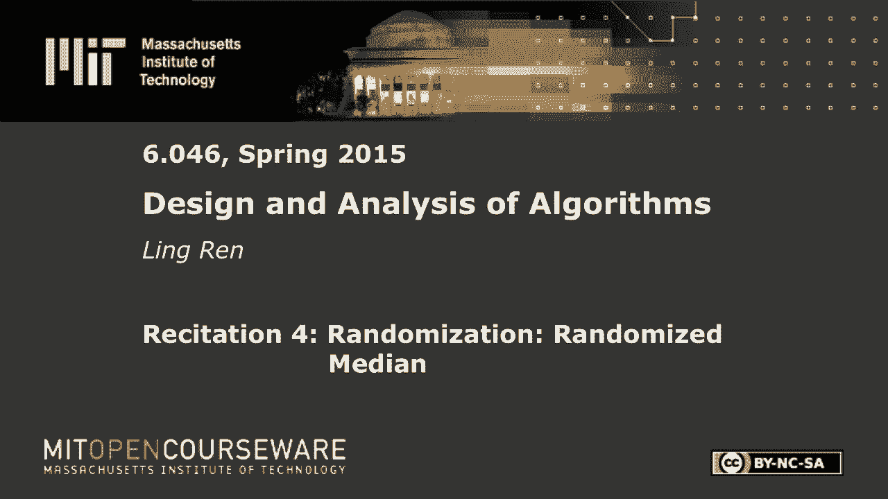
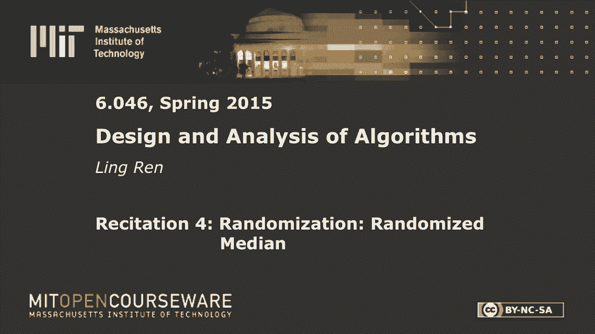
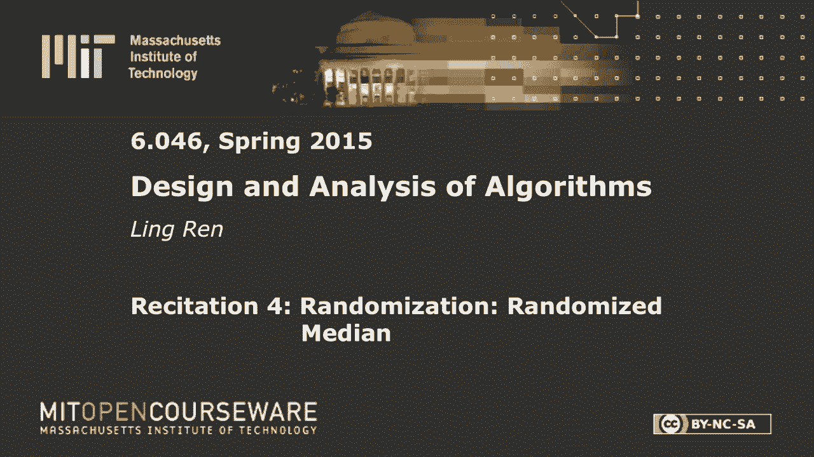

# R4：随机选择和随机快速排序 🎲






在本节课中，我们将学习并分析两个随机算法：**随机选择**（QuickSelect）和**随机快速排序**（Randomized Quicksort）。我们将重点关注它们的**预期运行时间**分析，并理解如何通过数学归纳和期望计算来证明其效率。



---

## 概述

上一节我们介绍了确定性的选择算法（如“中位数的中位数”方法），它虽然能保证最坏情况下的线性时间，但实现复杂。本节中，我们将看到它们的随机化版本，这些版本实现更简单，并且在**期望**意义下同样高效。我们将通过建立递归关系并计算其期望值来分析它们的性能。

---

## 随机选择算法（QuickSelect）🔍

随机选择算法用于在未排序的数组中找到第 `i` 小的元素。其核心思想与快速排序的分区过程类似。

### 算法步骤

以下是算法的具体步骤：

1.  从数组 `A` 中**随机**选择一个元素作为枢轴 `x`。
2.  将数组分为三部分：小于 `x` 的元素、等于 `x` 的元素、大于 `x` 的元素。设小于 `x` 的元素有 `k-1` 个。
3.  比较目标排名 `i` 与 `k`：
    *   如果 `i == k`，则 `x` 就是第 `i` 小的元素，直接返回 `x`。
    *   如果 `i < k`，则在**左子数组**（小于 `x` 的部分）中递归寻找第 `i` 小的元素。
    *   如果 `i > k`，则在**右子数组**（大于 `x` 的部分）中递归寻找第 `i - k` 小的元素。

### 运行时间分析

算法的运行时间取决于随机选择的枢轴 `x` 在排序后的位置 `k`。如果 `k` 靠近中间，问题规模会大幅减小；如果 `k` 接近两端，则减少得很少。因此，我们分析其**期望运行时间**。

设 `T(n)` 为在大小为 `n` 的数组上运行的期望时间。我们可以写出递归式：

```
T(n) ≤ (1/n) * Σ_{j=1}^{n} [ max( T(j-1), T(n-j) ) ] + Θ(n)
```

其中：
*   `(1/n)` 是随机选中第 `j` 个元素的概率。
*   `max( T(j-1), T(n-j) )` 表示我们需要解决可能较大的那个子问题。
*   `Θ(n)` 是分区操作所需的时间。

为了求解这个递归式，我们猜测 `T(n) = O(n)`，即存在常数 `c` 使得 `T(n) ≤ c * n`。通过数学归纳法可以证明此猜测成立。关键在于求和项 `Σ max(j-1, n-j)` 的值约为 `(3/4)n²`，代入后可以选取足够大的常数 `c` 使不等式成立。

**结论**：随机选择算法的期望运行时间为 **`O(n)`**。

---

## 随机快速排序算法（Randomized Quicksort）📊

随机快速排序是经典快速排序的随机化变体。其与随机选择的主要区别在于，分区后需要对**两个**子数组都进行递归排序，而不仅仅是其中一个。

### 运行时间分析

设 `T(n)` 为排序 `n` 个元素的期望时间。其递归关系与随机选择类似，但需要将两个子问题的耗时相加：

```
T(n) = (1/n) * Σ_{j=1}^{n} [ T(j-1) + T(n-j) ] + Θ(n)
     = (2/n) * Σ_{j=0}^{n-1} T(j) + Θ(n)
```

现在，我们猜测 `T(n) = O(n log n)`。将这个猜测代入递归式进行验证：

```
T(n) ≤ (2/n) * Σ_{j=0}^{n-1} (c * j log j) + Θ(n)
```

通过积分近似等方法计算求和项 `Σ j log j`，可以证明存在常数 `c` 使得 `T(n) ≤ c n log n` 成立。

**结论**：随机快速排序的期望运行时间为 **`O(n log n)`**。

---

## 概念辨析：期望、平均与摊销时间 ⚖️

在算法分析中，**期望运行时间**、**平均情况运行时间**和**摊销运行时间**含义不同：

*   **期望运行时间**：针对**随机化的算法**，对所有可能的随机选择（如枢轴选择）取平均。**不依赖于输入分布**。
*   **平均情况运行时间**：针对**确定性的算法**，对所有可能的**输入**取平均。这通常需要对输入分布做出假设（如“所有排列等概率”），是一个较弱的保证。
*   **摊销运行时间**：针对一系列操作，考虑最坏情况下每个操作的平均成本。它分析的是操作序列的整体代价，而非单次操作。

随机化算法的优势在于，通过引入内部随机性，**将对输入分布的依赖转移到了算法自身的随机选择上**，从而为任意输入提供了良好的期望性能保证。

---

## 总结

本节课我们一起学习了两个重要的随机化算法：
1.  **随机选择（QuickSelect）**：用于在未排序数组中查找第 `i` 小元素，其**期望运行时间为 `O(n)`**。
2.  **随机快速排序**：一种高效且实现简洁的排序算法，其**期望运行时间为 `O(n log n)`**。

我们通过建立递归式、计算数学期望，并利用猜测验证法（先猜测一个渐进上界，再用归纳法证明）分析了它们的性能。同时，我们辨析了“期望运行时间”与“平均情况运行时间”的关键区别：随机化算法通过内部随机性，为所有输入提供了性能保证，而不需要对输入分布做任何假设。