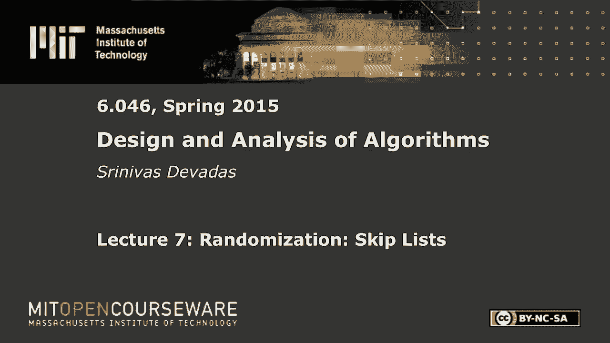
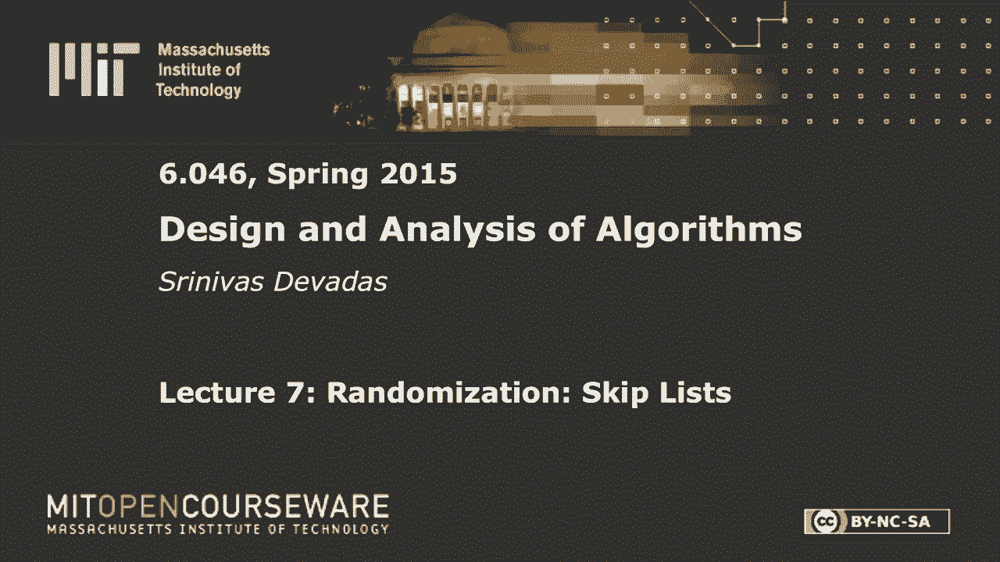

# L7：跳跃表 🎲







在本节课中，我们将要学习一种名为“跳跃表”的随机化数据结构。跳跃表是一种相对年轻且易于实现的数据结构，它能够以很高的概率提供高效的动态集合操作，如搜索、插入和删除。我们将从基础概念开始，逐步分析其性能，并最终证明其搜索复杂度为对数级别。

## 概述

跳跃表的核心思想是通过构建多层有序链表来加速搜索过程。与传统的平衡二叉搜索树（如AVL树或红黑树）相比，跳跃表在实现上更为简单，同时通过随机化保证了良好的平均性能。本节课我们将深入探讨其结构、操作算法以及概率分析。

---

## 从链表到跳跃表

上一节我们介绍了数据结构的基本背景，本节中我们来看看跳跃表是如何从简单的链表演化而来的。

### 排序链表的局限性

我们从一个简单的**排序链表**开始。假设链表中有 `n`` 个元素，并且链表是排序的。即使链表有序，进行一次搜索（成员查询）的最坏情况时间复杂度仍然是 **O(n)**。这是因为我们只能从链表头部开始，逐个节点遍历，直到找到目标或确定其不存在。

### 引入“快车”与“慢车”链表

为了提升搜索效率，我们可以引入第二个链表。想象一下地铁系统：有“本地线”（停靠每一站）和“快线”（只停靠主要站点）。在数据结构中，我们构建两个排序链表：
*   **L0（底层链表）**：包含所有 `n` 个元素。
*   **L1（高层链表）**：包含 `L0` 中部分元素的子集，作为“快线”站点。

**搜索算法**如下：
1.  从高层链表 `L1` 的头部开始向右遍历。
2.  如果下一个节点的值大于目标值，则“下降”到低层链表 `L0` 的当前位置。
3.  在低层链表 `L0` 中继续向右遍历，直到找到目标或确定其不存在。

### 优化两层结构

如果我们希望最小化这种两层结构的最坏情况搜索成本，应该如何选择 `L1` 中的元素呢？

搜索成本主要来自两部分：
1.  在 `L1` 中遍历的成本。
2.  在 `L0` 中遍历的成本（由于从 `L1` 下降，我们只需遍历 `L0` 的一部分）。

通过数学优化可以发现，当 `L1` 中包含大约 **√n** 个元素，并且这些元素在 `L0` 中均匀分布时，总搜索成本可以降至 **O(√n)**。这比单链表的 O(n) 有了显著提升。

### 推广到多层

自然地，我们可以添加更多层级的链表来进一步优化。如果我们有 `k` 个排序链表，并且以最优方式组织，搜索成本可以降至 **O(k * n^(1/k))**。

特别地，当我们设置层级数 **k = log n** 时，搜索成本变为：
```
O(log n * n^(1/(log n))) = O(log n * 2) = O(log n)
```
这达到了我们期望的对数级别复杂度。这种多层结构看起来类似于一棵“树”，但节点之间是通过链表水平连接的。

---

## 跳跃表的结构与操作

上一节我们介绍了多层链表的静态理想结构，本节中我们来看看在动态插入和删除时，如何通过随机化来维持跳跃表的高效性。

### 跳跃表示例

一个典型的跳跃表包含多个层级（L0, L1, L2, ...）。其中：
*   **L0** 包含所有元素。
*   更高层级的链表是低层级链表的子集。
*   如果一个元素出现在层级 `i`，那么它也必须出现在所有低于 `i` 的层级中。
*   每个层级都有指向 `-∞`（头部）和 `+∞`（尾部）的哨兵节点，以简化边界处理。

### 搜索算法

搜索一个元素 `x` 的算法（向前搜索）如下：
1.  从最高层链表的头部开始。
2.  在当前层级向右遍历，直到下一个节点的值大于等于 `x`。
3.  如果当前节点的值等于 `x`，则搜索成功。
4.  否则，下降到下一层级。
5.  重复步骤 2-4，直到到达 `L0`。如果在 `L0` 中仍未找到，则搜索失败。

### 插入算法

插入一个元素 `x` 的步骤如下：
1.  **搜索定位**：使用搜索算法，找到 `x` 在 `L0` 中应插入的位置（即前驱和后继节点）。同时，记录在每一层搜索路径中“下降”时的节点，这些节点是后续插入时需要更新的前驱节点。
2.  **插入底层**：将 `x` 插入到 `L0` 中确定的位置。
3.  **随机晋升**：抛一枚公平的硬币。
    *   如果结果为**正面**，则将 `x` 也晋升到更高一层，并插入到该层相应的位置（基于步骤1记录的前驱节点）。然后重复抛硬币，决定是否继续向更高层晋升。
    *   如果结果为**反面**，则晋升过程停止。
4.  **更新指针**：在每一层插入 `x` 时，更新相关节点的前后指针。

这个随机晋升过程意味着，跳跃表的最终形状是**概率性**的，而不是像平衡树那样严格确定的。

### 删除算法

删除一个元素 `x` 的步骤如下：
1.  **搜索定位**：使用搜索算法找到 `x` 在所有层级中出现的位置。
2.  **逐层删除**：从 `x` 出现的最高层开始，逐层将其从链表中移除（更新前后节点的指针）。
3.  **清理空层**：如果删除导致最高层变为空（仅剩头尾哨兵），则可以降低跳跃表的高度。

---

## 跳跃表的概率分析 🎯

上一节我们定义了跳跃表的操作，本节中我们通过概率分析来证明其高效的性能。

我们的目标是证明：对于一个包含 `n` 个元素的跳跃表，**任何一次搜索操作的成本都以很高的概率为 O(log n)**。

### 核心概念：高概率

在随机化算法分析中，“以很高的概率”（With High Probability, WHP）是一个比“期望值”更强的概念。它意味着某个事件发生的概率至少为：
```
1 - 1 / n^c
```
其中 `c` 是一个大于 0 的常数。随着 `n` 增大，这个概率无限接近于 1。

### 热身引理：层级数边界

我们首先证明，跳跃表的层级数不会太高。

**引理**：跳跃表中的层级数 **L** 以很高的概率为 **O(log n)**。

**证明思路**：
*   一个元素能出现在第 `k` 层，意味着在插入它时，连续抛硬币得到了至少 `k` 次正面。
*   得到至少 `c log n` 次正面的概率是 `(1/2)^(c log n) = 1 / n^c`。
*   考虑所有 `n` 个元素，根据**联合界**，至少有一个元素晋升超过 `c log n` 层的概率最多为 `n * (1 / n^c) = 1 / n^(c-1)`。
*   因此，所有元素的晋升层数都小于等于 `c log n` 的概率至少为 `1 - 1 / n^(c-1)`，这满足高概率的定义。所以，最大层级数 `L = O(log n)` WHP。

### 关键技巧：反向搜索分析

直接分析向前搜索的路径是复杂的。一个更聪明的办法是分析**反向搜索**的路径：从搜索到的目标节点开始，向左、向上移动，直到回到左上角的头节点。

在反向路径中：
*   **向上移动** 对应于插入该节点时抛硬币得到**正面**（晋升）。
*   **向左移动** 对应于插入该节点时抛硬币得到**反面**（未晋升，或来自左侧节点的晋升）。

因此，**反向搜索的总移动次数，等于为了产生路径上所有“向上”动作而抛掷硬币的总次数**。

### 主要定理：搜索成本边界

**定理**：在包含 `n` 个元素的跳跃表中，一次搜索的代价以很高的概率为 **O(log n)**。

**证明概要**：
1.  根据热身引理，跳跃表的最大层级 `L = O(log n)` WHP。这意味着反向路径中“向上”移动的次数最多为 `O(log n)`。
2.  反向路径的总移动次数，等价于抛一枚公平硬币，直到出现 `O(log n)` 次正面所需要的总抛掷次数。
3.  我们可以利用**切尔诺夫界**来分析这个抛硬币过程。切尔诺夫界告诉我们，对于一系列独立伯努利试验（如抛硬币），其成功次数偏离期望值的概率呈指数级衰减。
4.  具体地，我们可以证明：要至少得到 `c log n` 次正面，只需要抛掷 `d log n` 次硬币（`d` 是某个大于 `c` 的常数），并且这件事以很高的概率成立。
5.  因此，总移动次数（即总抛掷次数）以很高的概率为 `O(log n)`。
6.  最后，我们需要确保“层级数有界”和“移动次数有界”这两个高概率事件**同时发生**。由于两者各自失败的概率都是 `1/n` 的多项式分之一，它们的联合失败概率也可以通过联合界控制，因此两者同时成立的概率也很高。

至此，我们证明了搜索操作的成本以很高的概率为对数级别。

---

## 总结

本节课中我们一起学习了跳跃表这一优雅的随机化数据结构。我们从简单的排序链表出发，通过添加多层“快线”链表来优化搜索，并最终引入了随机晋升机制来支持动态操作。我们详细描述了跳跃表的搜索、插入和删除算法。

最重要的是，我们通过概率分析证明了跳跃表的效率：
*   跳跃表的层级数以很高的概率为 **O(log n)**。
*   任何搜索操作的成本以很高的概率为 **O(log n)**。

跳跃表将随机化的力量与简单的链表结构相结合，提供了一种在实现复杂度和理论性能之间取得优异平衡的动态集合解决方案。其分析中使用的“高概率”概念和反向分析技巧，在随机化算法设计中也非常有代表性。