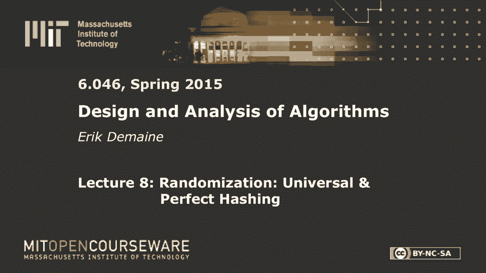
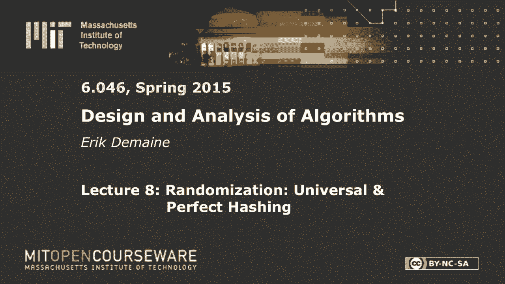
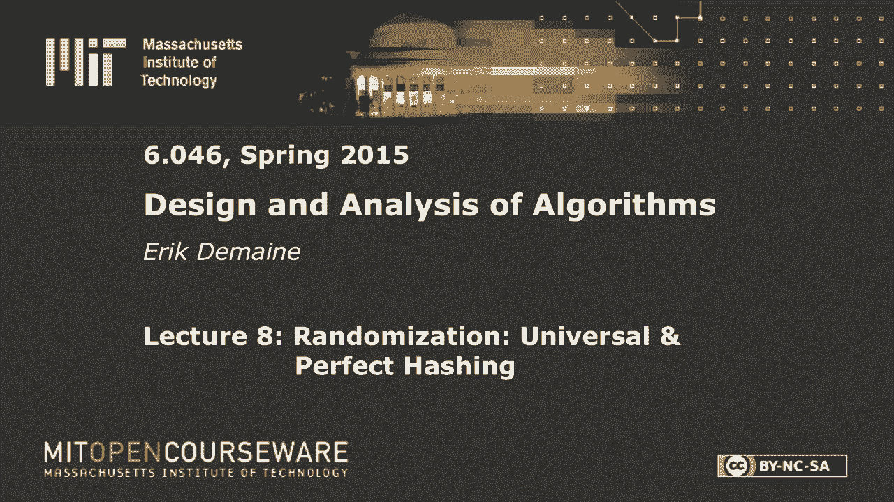
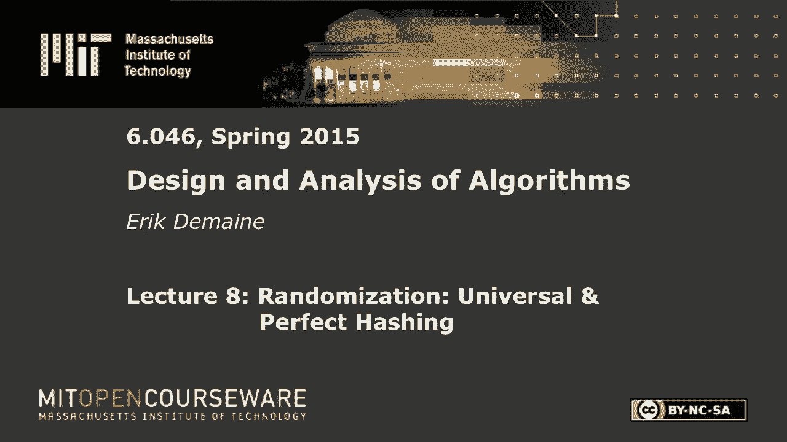
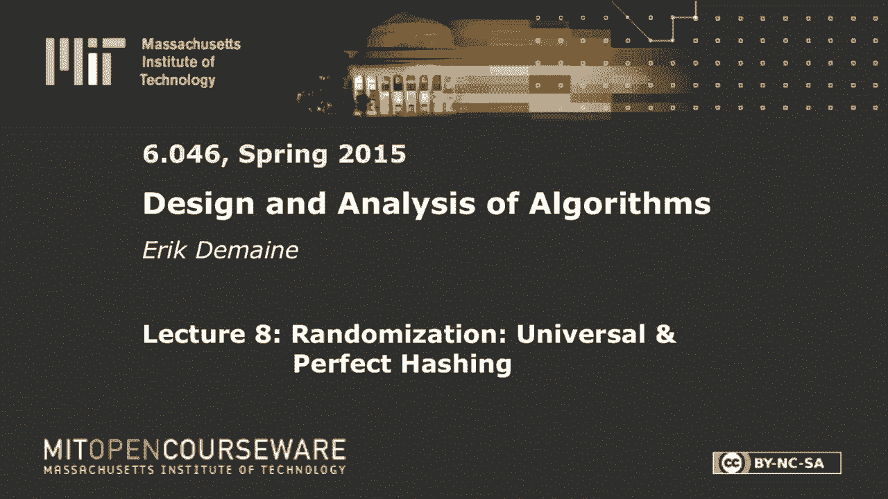

# L8：通用和完美哈希 🗂️

在本节课中，我们将要学习哈希表的高级概念，特别是如何通过随机化技术来实现更高效、更可靠的哈希表。我们将重点介绍两种强大的哈希方法：通用哈希和完美哈希。通用哈希允许我们在不假设输入数据随机性的情况下，获得常数级别的预期操作时间。而完美哈希则更进一步，可以为静态数据集（即数据不发生变化）提供无冲突的哈希表，从而实现常数级别的最坏情况搜索时间。

## 哈希表与字典问题回顾

上一节我们介绍了随机化数据结构如跳跃列表。本节中，我们来看看如何将随机化应用于哈希表，以解决字典问题。

字典是一种抽象数据类型（ADT），它需要维护一个由键（Key）组成的动态集合，并支持以下三种操作：
*   **插入（Insert）**：将一个带有唯一键的项目加入集合。
*   **删除（Delete）**：从集合中移除一个指定键的项目。
*   **搜索（Search）**：查询一个指定的键是否存在于集合中（精确搜索）。

使用AVL树或跳跃列表可以在 **O(log n)** 时间内解决此问题。但我们的目标是利用哈希表实现**常数级别的预期时间**。

最简单的哈希表实现是**链式哈希法**：一个大小为 `m` 的数组，每个槽位指向一个链表，存放所有哈希到该槽位的项目。其性能依赖于哈希函数 `h` 将键均匀地映射到 `m` 个槽位。

在基础算法课程中，分析通常基于一个称为**简单均匀哈希**的假设：对于任意两个不同的键 `k1` 和 `k2`，它们发生碰撞（即 `h(k1) = h(k2)`）的概率恰好是 **1/m**。然而，这个假设等价于假设输入数据（键）本身是随机的，这在现实中并不合理。我们希望设计一种方法，即使面对最坏情况的输入数据，也能保证良好的性能。

## 通用哈希 🎲

为了摆脱对输入数据的假设，我们引入随机性到哈希函数的选择中。我们不再使用一个固定的哈希函数，而是从一个精心设计的哈希函数族 **H** 中随机选择一个函数 `h` 来使用。这个函数族需要满足**通用性**。

### 通用哈希族的定义

一个哈希函数族 **H** 是**通用**的，如果对于任意两个不同的键 `k` 和 `k‘`，从 **H** 中随机均匀地选择一个哈希函数 `h`，这两个键发生碰撞的概率至多为 **1/m**。

公式表示为：对于所有 `k ≠ k‘`，`Pr_{h ∈ H}[h(k) = h(k‘)] ≤ 1/m`。

这里的概率来自于哈希函数 `h` 的随机选择，而与具体的键 `k` 和 `k‘` 无关。这意味着，即使对手在知晓哈希函数族 **H** 后选择了最坏的键，但只要 `h` 是在我们构建哈希表时才随机选定的，碰撞的概率依然很低。

### 通用哈希的性能分析

如果我们使用一个通用的哈希函数族 **H**，并随机选择 `h ∈ H` 来构建链式哈希表，那么对于任意输入（无需随机假设），每个槽位中链表的**预期长度**最多为 **1 + α**，其中 `α = n/m` 是负载因子。

因此，插入、删除和搜索操作的**预期时间复杂度**为 **O(1 + α)**。如果保持 `m = Θ(n)`，则所有操作都是常数预期时间。

### 一个通用的哈希函数族实例

我们需要一个易于计算且通用的哈希函数族。假设哈希表大小 `m` 是一个质数，并且将键 `k` 视为一个 `r` 位的 `m` 进制数（即 `k = (k0, k1, ..., k_{r-1})`，其中每个 `ki ∈ {0, 1, ..., m-1}`）。

定义以下哈希函数族 **H**：每个函数由一个向量 `a = (a0, a1, ..., a_{r-1})` 参数化，其中每个 `ai` 在 `{0, 1, ..., m-1}` 中均匀随机选择。

对于给定的键 `k`，哈希函数 `h_a(k)` 定义为 `k` 与 `a` 的点积模 `m`：
`h_a(k) = (Σ_{i=0}^{r-1} a_i * k_i) mod m`

可以证明，这个哈希函数族 **H** 是通用的。在实践中，我们可以通过随机生成一个向量 `a` 来快速获得一个哈希函数。

## 完美哈希 ✨

通用哈希提供了良好的预期性能。但对于静态数据集（键集合固定，只有搜索操作），我们可以实现更强的保证：**完美哈希**。完美哈希能构建一个完全没有冲突的哈希表，从而实现**常数最坏情况搜索时间**和**线性空间**。

### 两级哈希结构

完美哈希的核心思想是使用两级哈希结构：
1.  **第一级**：使用一个从通用族中随机选取的哈希函数 `h1`，将 `n` 个键映射到大小为 `m = Θ(n)` 的主表中。主表的每个槽位 `j` 对应一个次级哈希表。
2.  **第二级**：对于主表槽位 `j`，设有 `lj` 个键被映射到此。我们为这个槽位单独分配一个大小为 `mj = lj²` 的次级哈希表，并从一个通用哈希族中为其选择一个哈希函数 `h2_j`。关键点在于，我们不断重选 `h2_j`，直到**在该次级表内**所有 `lj` 个键之间没有发生冲突为止。

### 为什么它能工作？

1.  **无冲突搜索**：由于每个次级哈希表内部都无冲突，要搜索一个键 `k`，我们先计算 `i = h1(k)` 找到主表槽位，再计算 `j = h2_i(k)` 找到次级表中的位置。如果该位置存在键且与 `k` 匹配，则搜索成功。整个过程是确定性的常数时间。
2.  **线性空间保证**：虽然次级表大小是 `lj²`，但所有次级表大小的总和 `Σ lj²` 的**期望值**是 `O(n)`。我们可以通过一个重试循环来保证：如果随机选出的 `h1` 导致 `Σ lj² > c * n`（`c` 为常数），我们就丢弃 `h1` 并重新选择。根据马尔可夫不等式，每次尝试成功的概率至少为 `1/2`，因此期望上只需常数次重试。
3.  **次级表无冲突保证**：对于有 `lj` 个键的次级表，其大小为 `lj²`。从通用哈希族中随机选一个函数 `h2_j`，发生任何碰撞的概率（根据生日悖论原理）不超过 `(lj choose 2) * (1/lj²) ≈ 1/2`。因此，期望上只需常数次重试就能为每个次级表找到一个无冲突的哈希函数。

### 构建时间

构建完美哈希表需要多项式时间（实际上是近乎线性的时间）：
*   通过重试找到合适的 `h1`（保证总空间线性）需要 `O(n log n)` 预期时间。
*   为每个次级表找到无冲突的 `h2_j` 需要 `O(n log² n)` 预期时间。
因此，总构建时间是高效可行的。

## 总结 📚

本节课中我们一起学习了两种强大的随机化哈希技术：
*   **通用哈希**：通过从一个通用的哈希函数族中随机选择哈希函数，我们可以在不对输入数据做任何假设的情况下，为动态字典的所有操作（插入、删除、搜索）提供**常数级别的预期时间复杂度**。
*   **完美哈希**：针对静态数据集，通过精巧的两级哈希结构和重试机制，我们可以构建一个**完全无冲突**的哈希表。这提供了**常数最坏情况搜索时间**和**线性空间**的强保证，尽管构建过程需要一定的预处理时间。

这两种方法展示了如何利用随机化来将平均情况下的优秀性能，转化为对最坏情况输入的可靠保证，是算法设计中“用随机化对抗不确定性”思想的经典体现。