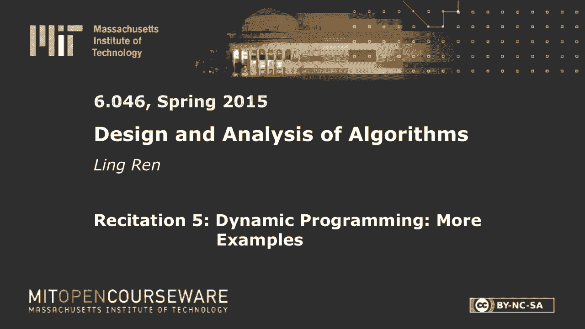
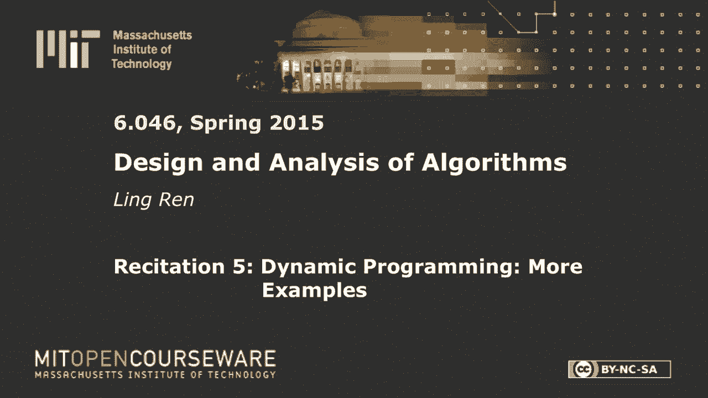
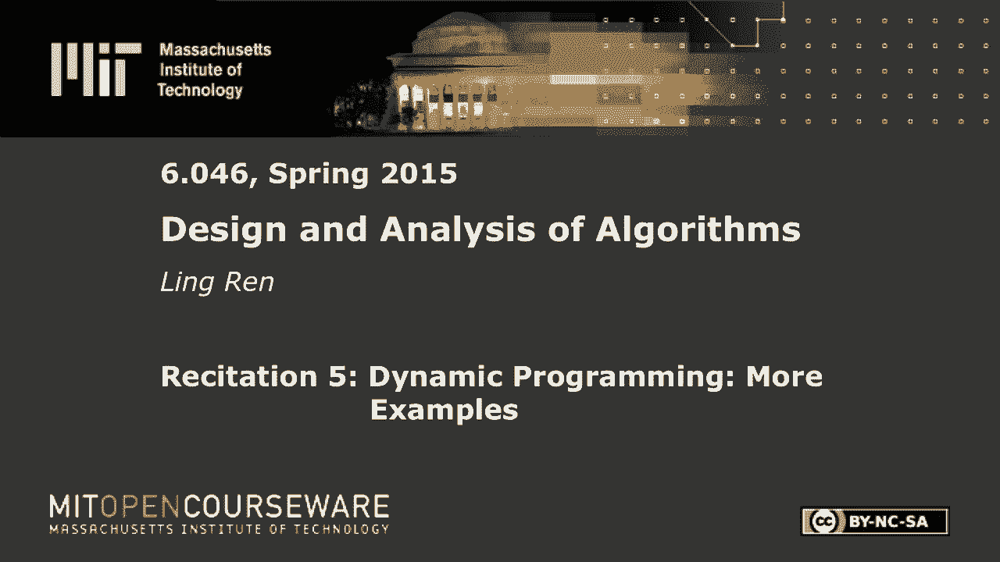
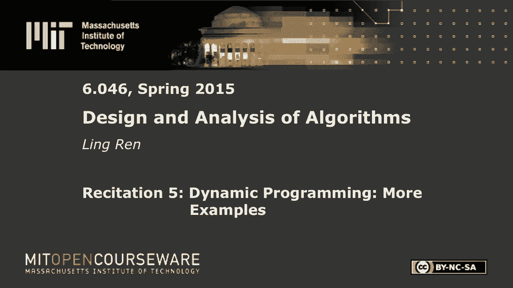

# R5：动态规划与哈希 🧩

在本节课中，我们将学习动态规划的核心思想，并通过几个经典例子来理解其应用。随后，我们将回顾通用哈希与完美哈希的概念，了解如何设计高效的哈希表来避免最坏情况。

## 概述 📋

动态规划是一种通过将复杂问题分解为子问题，并重用子问题的解来优化算法效率的方法。我们首先通过一个简单的路径计数问题来理解其基本思想，然后探讨找零问题和矩形堆叠问题。之后，我们将转向哈希技术，学习如何设计避免最坏情况碰撞的哈希函数。

---

## 动态规划基础

上一节我们介绍了课程概述，本节中我们来看看动态规划的基本思想。

动态规划的主要思想是将问题分解为子问题，并重用已解决的子问题的结果。我们始终关注算法的运行时间。

### 热身示例：机器人路径计数 🤖

假设有一个机器人位于坐标 (1, 1)，它想要到达坐标 (m, n)。每一步，机器人只能向上或向右移动一格。问题是：机器人有多少条不同的路径可以到达目的地？

以下是解决此问题的思路：

*   我们将子问题定义为：从起点到达网格中任意一点 (i, j) 的不同路径数量。
*   对于点 (i, j)，到达它的路径数等于从其左边点 (i-1, j) 来的路径数加上从其下边点 (i, j-1) 来的路径数。
*   边界情况：第一行和第一列的所有点都只有一条路径可达（只能一直向右或一直向上）。

**核心公式**：
`dp[i][j] = dp[i-1][j] + dp[i][j-1]`

这个例子虽然简单，但很好地说明了动态规划的要点：解决子问题并重用结果。如果不记忆化结果，运行时间会变差。

**运行时间分析**：
*   **唯一子问题数量**：`O(m*n)`，网格中的每个点对应一个子问题。
*   **每个子问题的合并工作量**：`O(1)`，只需进行一次加法。
*   **总运行时间**：`O(m*n)`。

---

## 动态规划应用示例

上一节我们通过一个简单问题理解了动态规划的思想，本节中我们来看看两个更复杂的应用。

### 示例一：找零问题 💰

我们有一套硬币面值（例如 1分，5分，10分），每种硬币数量无限。给定一个总金额 `n`，我们需要找出凑成该金额所需的最少硬币数量。为简化问题，我们假设总包含面值为1的硬币，以保证问题总有解。

**问题定义**：给定硬币面值数组 `S` 和总金额 `n`，求 `min(硬币数量)`，使得所选硬币面值之和等于 `n`。

以下是解决此问题的一种思路：

*   **子问题定义**：令 `dp[x]` 表示凑成金额 `x` 所需的最少硬币数。
*   **状态转移**：对于金额 `x`，我们可以选择一枚面值为 `s_i` 的硬币，那么剩余金额为 `x - s_i`，问题转化为求 `dp[x - s_i]`。我们需要遍历所有可能的硬币面值，选择使硬币总数最小的那个。
*   **基础情况**：`dp[0] = 0`（凑成0元需要0枚硬币）。

**核心递推式**：
`dp[x] = min_{s_i <= x} (1 + dp[x - s_i])`

**运行时间分析**：
*   **唯一子问题数量**：`O(n)`，即从 `0` 到 `n` 的所有金额。
*   **每个子问题的合并工作量**：`O(m)`，其中 `m` 是硬币面值种类数，因为需要遍历所有面值。
*   **总运行时间**：`O(n * m)`。

> **重要说明**：这个算法的时间复杂度关于输入值 `n` 是多项式级的，但 `n` 本身通常以二进制形式输入，其输入规模是 `log n`。因此，该算法相对于输入规模是指数级的，这与背包问题是NP难的事实并不矛盾。

---

### 示例二：矩形块堆叠问题 📦

我们有 `n` 个矩形块，每个块有长度 `l_i`、宽度 `w_i` 和高度 `h_i`。我们希望将它们堆叠起来，使得总高度最大。约束条件是：只有当下方块的长度和宽度都严格大于上方块时，上方块才能放在下方块上。不允许旋转方块。

**问题定义**：给定一组方块，求一个满足上述约束的堆叠序列，使得总高度 `Σh_i` 最大。

以下是解决此问题的一种思路（类似加权区间调度）：

*   **排序**：首先将所有方块按长度（或宽度）降序排序，以确保在考虑堆叠顺序时，只有排在后面的（更小的）方块可能放在前面方块之上。
*   **子问题定义**：令 `dp[i]` 表示以排序后第 `i` 个方块作为**底部**时，能堆叠出的最大高度。
*   **状态转移**：对于方块 `i`，我们需要检查所有排在它前面且长度和宽度都大于它的方块 `j`。`dp[i]` 等于 `h_i` 加上所有兼容的 `dp[j]` 中的最大值。另一种思路是考虑是否选择方块 `i` 作为当前堆叠的底部。
*   **另一种定义**：`dp[i]` 表示考虑排序后的前 `i` 个方块时，能获得的最大高度。对于每个方块 `i`，我们可以选择它（那么需要找到一个兼容的 `j` 放在它下面），或者不选择它。

**核心递推式（一种可能）**：
`dp[i] = max( h_i + max_{j < i, l_j > l_i, w_j > w_i}(dp[j]), dp[i-1] )`

**运行时间分析**：
*   **唯一子问题数量**：`O(n)`。
*   **每个子问题的合并工作量**：朴素方法需要扫描所有前面的方块以找到兼容的，为 `O(n)`。
*   **总运行时间（朴素）**：`O(n^2)`。可以通过更精细的数据结构（如按另一维度排序的二叉搜索树）进行优化。

---

## 哈希技术回顾

上一节我们探讨了动态规划的几个例子，本节中我们来看看如何设计哈希函数来避免最坏情况的性能。

### 动机与问题

我们希望创建一个大小为 `m` 的哈希表，插入 `n` 个键（`n ≈ m`），使得每个桶平均包含 `O(1)` 个键。键来自一个很大的宇宙 `U`。

一个负面结论是：对于任何**确定性**的哈希函数 `h`，如果 `|U| > m^2`，总存在一组输入键（至少 `m` 个），使得它们全部哈希到同一个桶中，导致最坏情况 `O(n)` 的查找时间。攻击者如果知道哈希函数，可以精心构造这组“攻击键”使系统性能恶化。

### 解决方案：通用哈希函数族

我们不预先固定一个哈希函数，而是从一个**哈希函数族** `H` 中随机选取一个。即使攻击者知道 `H`，他也不知道本次具体使用哪个 `h`。

**通用哈希函数族的定义**：如果从族 `H` 中随机均匀地选择一个哈希函数 `h`，则对于任意两个不同的键 `k1` 和 `k2`，它们发生碰撞（即 `h(k1) = h(k2)`）的概率至多为 `1/m`。其中 `m` 是哈希表的大小。

**一个通用哈希函数族的例子**：
`h_{a,b}(k) = ((a * k + b) mod p) mod m`
其中 `p` 是一个大于最大可能键值的素数，`a ∈ {1, 2, ..., p-1}`，`b ∈ {0, 1, ..., p-1}`。`a` 和 `b` 是随机选取的。

**证明概要**：对于两个不同的键 `k1`, `k2`，碰撞条件等价于 `a*(k1 - k2) ≡ 0 (mod m) mod p`。可以证明，导致碰撞的坏 `a` 的数量最多约为 `p/m` 个。而 `a` 总共有 `p-1` 种选择，因此碰撞概率 `≤ (p/m) / (p-1) ≈ 1/m`。

---

## 从通用哈希到完美哈希

上一节我们介绍了通用哈希，本节中我们来看看如何实现零碰撞的完美哈希。

完美哈希是指对于一组给定的键，哈希函数保证不发生任何碰撞。

### 方法一：简单但耗空间

直接使用通用哈希函数，但将哈希表大小 `m` 设置为 `n^2`。

*   **原理**：根据通用哈希性质，任意两键碰撞概率为 `1/m = 1/n^2`。共有 `C(n,2) ≈ n^2/2` 对键。利用联合界，存在至少一次碰撞的概率 `≤ (n^2/2) * (1/n^2) = 1/2`。
*   **结论**：我们以至少 `1/2` 的概率获得一个完美哈希函数。如果失败，只需重新随机选取一个哈希函数，重复尝试。期望尝试次数约为2次。
*   **缺点**：空间复杂度为 `O(n^2)`，过高。

### 方法二：两级哈希（节省空间）

目标是使用 `O(n)` 空间实现完美哈希。

1.  **第一级**：使用一个通用哈希函数 `h1`，将 `n` 个键哈希到 `n` 个主桶中。设第 `i` 个桶中的键数为 `n_i`。可以证明 `E[Σ n_i^2] < 2n`。
2.  **第二级**：对每个主桶 `i`，分配一个大小为 `m_i = n_i^2` 的二级哈希表。为每个二级表独立选择一个通用哈希函数 `h_{2,i}`。由于每个二级表很小（`n_i` 个键，表大小 `n_i^2`），根据方法一，我们可以在常数次尝试内以高概率为该桶找到一个无碰撞的完美哈希函数。
3.  **空间**：第一级表空间 `O(n)`。第二级总空间 `Σ n_i^2`，其期望值小于 `2n`，因此总体期望空间为 `O(n)`。
4.  **过程**：如果第一次尝试的第一级哈希导致 `Σ n_i^2` 过大（比如 `> 4n`），或者某个二级表多次尝试仍无法找到完美哈希，则我们重新选择第一级的哈希函数 `h1`，从头开始。整个过程可以在 `O(n)` 预期时间内完成。

> **注意**：这种完美哈希构造方法主要适用于静态键集合（即所有键已知且后续不再插入或删除）。

---

## 总结 🎯

本节课中我们一起学习了：

1.  **动态规划**的核心是分解子问题和重用结果。我们通过**机器人路径**、**找零问题**和**矩形堆叠**三个例子，实践了定义子问题、建立状态转移方程和分析运行时间的方法。
2.  **哈希技术**方面，我们了解了确定性哈希在最坏情况下的问题，引入了**通用哈希函数族**的概念来以高概率保证平均性能。进一步，我们探讨了如何通过增大表空间（`O(n^2)`）或使用**两级哈希**（`O(n)` 空间）来构造**完美哈希**，以实现绝对零碰撞。

动态规划是解决最优化问题的强大工具，而随机化哈希是构建高效、稳健数据结构的关键技术之一。理解它们的原理和适用场景，对于设计高效算法至关重要。