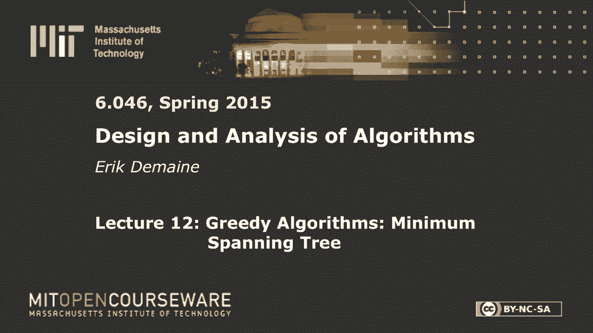
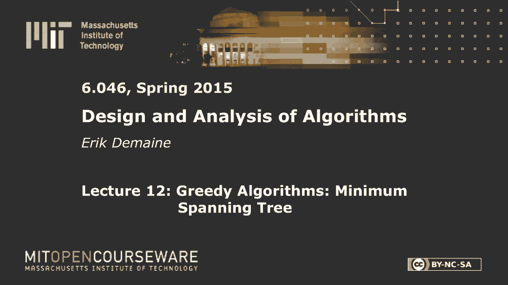
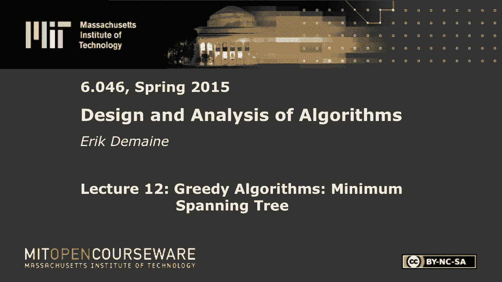
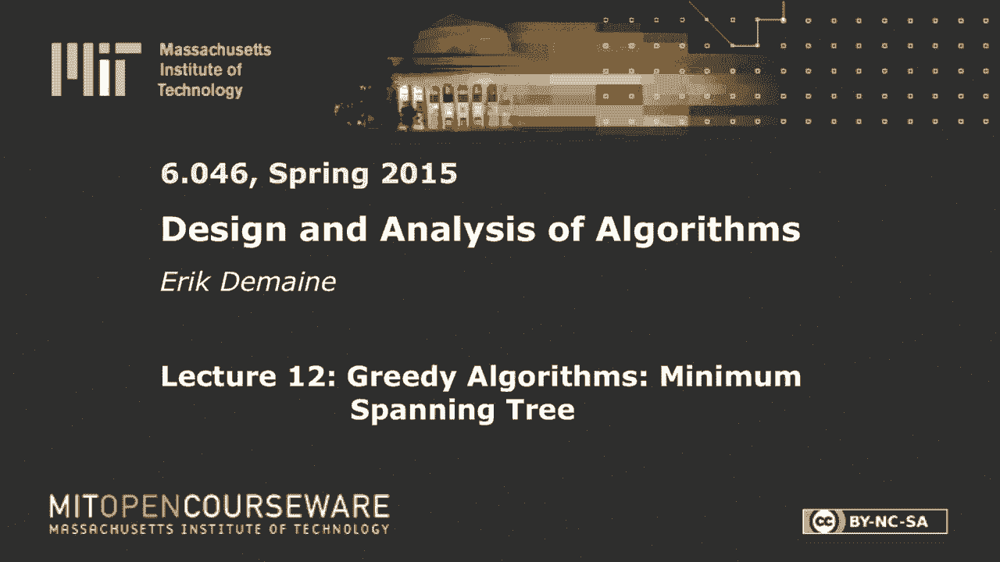

# L12：贪心算法：最小生成树 🌳

在本节课中，我们将要学习一个经典的图算法问题——最小生成树。我们将看到两种解决此问题的贪心算法，并理解其背后的理论原理。贪心算法的核心思想是“每一步都做出当前看起来最优的选择”，我们将证明对于最小生成树问题，这种策略确实能得到全局最优解。

## 概述

最小生成树问题是指，在一个带权重的无向连通图中，寻找一棵连接所有顶点且总权重最小的树。我们将学习两种著名的贪心算法：Prim算法和Kruskal算法。它们都基于一个共同的定理，即“安全边”引理，该引理保证了贪心选择的正确性。

## 核心概念与定义

首先，让我们明确几个核心概念。

*   **树**：一个无环的连通图。
*   **生成树**：一个包含原图所有顶点，并且是原图子图的树。
*   **最小生成树**：所有生成树中，边的权重总和最小的那一个。

我们用公式定义一棵树 `T` 的权重：
`w(T) = Σ w(e)`，其中 `e ∈ T`。

一个朴素的解决方法是尝试所有可能的生成树，但生成树的数量可能是指数级的，因此我们需要更高效的算法。

## 贪心算法理论基础

在深入具体算法前，我们先了解贪心算法有效的两个关键性质。

### 最优子结构

这个性质与动态规划中的思想类似。它指出，如果一个问题的最优解包含了其子问题的最优解，那么该问题就具有最优子结构。

对于最小生成树，具体表现为：假设我们知道某条边 `e` 属于某个最小生成树。如果我们“收缩”这条边（即将它的两个端点合并为一个顶点），那么在新图 `G/e` 中找到的最小生成树 `T'`，加上原来的边 `e`，就构成了原图 `G` 的一个最小生成树。

这为我们提供了一个递归的思路：找到一个在最小生成树中的边，收缩它，然后在更小的图上递归求解。

### 贪心选择性质

这是贪心算法的核心。它表明，我们可以通过做出局部最优的选择（即贪心选择）来构造全局最优解，而无需考虑未来的影响。

对于最小生成树，一个关键的贪心选择性质是**切割性质**：
*   **切割**：将图的顶点集 `V` 划分为两个非空集合 `S` 和 `V-S`。
*   **横跨边**：一个端点在 `S` 中，另一个端点在 `V-S` 中的边。
*   **定理**：对于任意一个切割，横跨该切割的所有边中，权重最小的那条边一定包含在某个最小生成树中。

**证明（剪切-粘贴法）**：
1.  假设存在一个最小生成树 `T*` 不包含这条最小横跨边 `e=(u, v)`。
2.  由于 `T*` 是树，`u` 到 `v` 之间存在唯一路径 `P`。因为 `u` 和 `v` 分属切割两侧，路径 `P` 上至少有一条边 `e'` 也横跨该切割。
3.  将 `T*` 中的边 `e'` 移除，并加入边 `e`，得到新树 `T'`。
4.  由于 `w(e) ≤ w(e')`，所以 `w(T') ≤ w(T*)`。因此 `T'` 也是一个最小生成树，且包含了边 `e`。

这个性质保证了我们的贪心选择是“安全”的。

## Prim算法 🚀

上一节我们介绍了贪心算法的理论基础，本节中我们来看看如何应用切割性质来构造第一个算法——Prim算法。它的思想与Dijkstra最短路径算法非常相似。

Prim算法从一个顶点开始，逐步“生长”出一棵最小生成树。在每一步，我们都有一个已包含在树中的顶点集合 `S`。我们考虑所有横跨切割 `(S, V-S)` 的边，并选择其中权重最小的一条加入树中，同时将这条边的新端点加入集合 `S`。

### 算法步骤

以下是Prim算法的实现步骤：

1.  **初始化**：选择任意一个起始顶点 `s`。将所有顶点的“键值”初始化为无穷大（`∞`），表示从当前树集 `S` 到该顶点的最小边权。将 `s` 的键值设为 `0`。使用一个最小优先队列 `Q` 来存储所有顶点（键值为优先级）。
2.  **循环**：当 `Q` 不为空时：
    a. 从 `Q` 中取出键值最小的顶点 `u`（即离当前树集 `S` 最近的顶点）。
    b. 将 `u` 加入集合 `S`。
    c. 遍历 `u` 的所有邻接顶点 `v`：
        *   如果 `v` 仍在 `Q` 中（即未加入 `S`），并且边 `(u, v)` 的权重 `w(u, v)` 小于 `v` 当前的键值：
            *   更新 `v` 的键值为 `w(u, v)`。
            *   记录 `v` 的父节点为 `u`（`parent[v] = u`）。
3.  **结束**：算法结束后，所有 `parent` 指针构成的边集就是最小生成树。

### 运行时间分析

Prim算法的运行时间取决于优先队列的实现：
*   使用二叉堆：`O((V+E) log V)`。
*   使用斐波那契堆：`O(E + V log V)`。

## Kruskal算法 🔗

上一节我们学习了像Dijkstra一样逐步扩展的Prim算法。本节我们来看另一种思路的贪心算法——Kruskal算法。它不再从一个点扩展，而是直接全局地、按权重顺序考虑所有边。

Kruskal算法的核心思想非常简单：将所有边按权重从小到大排序，然后依次考虑每条边。如果加入当前边不会在已选择的边集中形成环，就将其加入最小生成树；否则就跳过。

### 算法步骤

以下是Kruskal算法的实现步骤：

1.  **初始化**：将每个顶点视为一个独立的连通分量（使用并查集数据结构维护）。创建一个空集合 `T` 用于存放最小生成树的边。
2.  **排序**：将图 `G` 中的所有边按权重非递减顺序排序。
3.  **循环**：按顺序遍历每条边 `e = (u, v)`：
    a. 使用并查集的 `Find-Set` 操作检查 `u` 和 `v` 是否属于同一个连通分量。
    b. 如果不属于（即加入 `e` 不会形成环）：
        *   将边 `e` 加入集合 `T`。
        *   使用并查集的 `Union` 操作合并 `u` 和 `v` 所在的连通分量。
4.  **结束**：当 `T` 中包含 `V-1` 条边时，算法结束，`T` 即为最小生成树。

### 运行时间分析

Kruskal算法的运行时间主要消耗在排序和并查集操作上：
*   排序边：`O(E log E)`。
*   并查集操作（`Find-Set` 和 `Union`）：对于 `E` 条边，近似 `O(E α(V))`，其中 `α` 是增长极慢的阿克曼反函数。
*   总时间复杂度：`O(E log E)`，主要由排序决定。如果边权是较小整数，可使用线性时间排序（如基数排序），使总时间接近线性。

### 正确性说明

Kruskal算法的正确性同样基于切割性质。当我们考虑一条边 `e=(u, v)` 时，`u` 和 `v` 分属不同的连通分量。我们可以将 `u` 所在的连通分量视为切割的 `S` 侧，其余部分视为 `V-S` 侧。由于我们是按权重顺序考虑边的，`e` 就是横跨这个特定切割的第一条边（否则更小的边会先被加入并合并分量），因此 `e` 就是横跨该切割的最小权重边，根据切割性质，它属于某个最小生成树。

## 总结

本节课中我们一起学习了图论中的一个经典问题——最小生成树，并深入探讨了两种高效的贪心算法。

*   **Prim算法**：从一个顶点出发，像“生长”一样逐步扩展最小生成树。它维护一个顶点集合 `S`，每次选择连接 `S` 与外部顶点的最小权重边。其实现类似于Dijkstra算法，使用优先队列，高效直观。
*   **Kruskal算法**：从全局出发，按边权重排序，依次尝试加入边，并利用并查集判断是否会形成环。其思想简单，在边排序成本不高或边权范围较小时非常高效。

这两种算法都建立在**切割性质**这一核心定理之上，该定理保证了“横跨任意切割的最小权重边必在某个最小生成树中”，从而验证了贪心策略的正确性。理解这一理论是掌握最小生成树算法的关键。