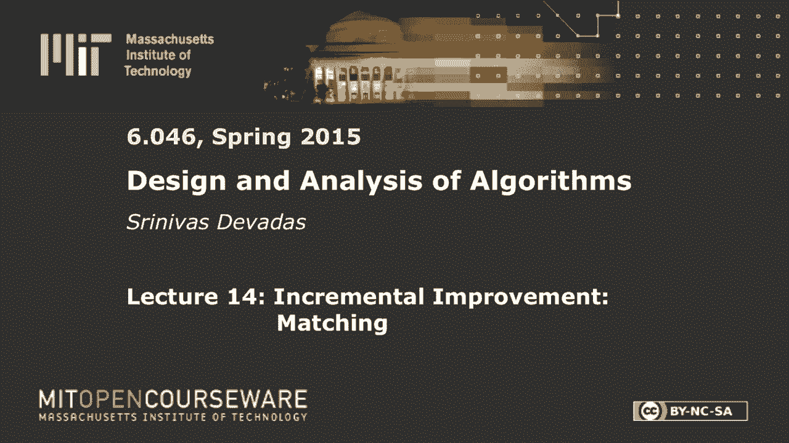
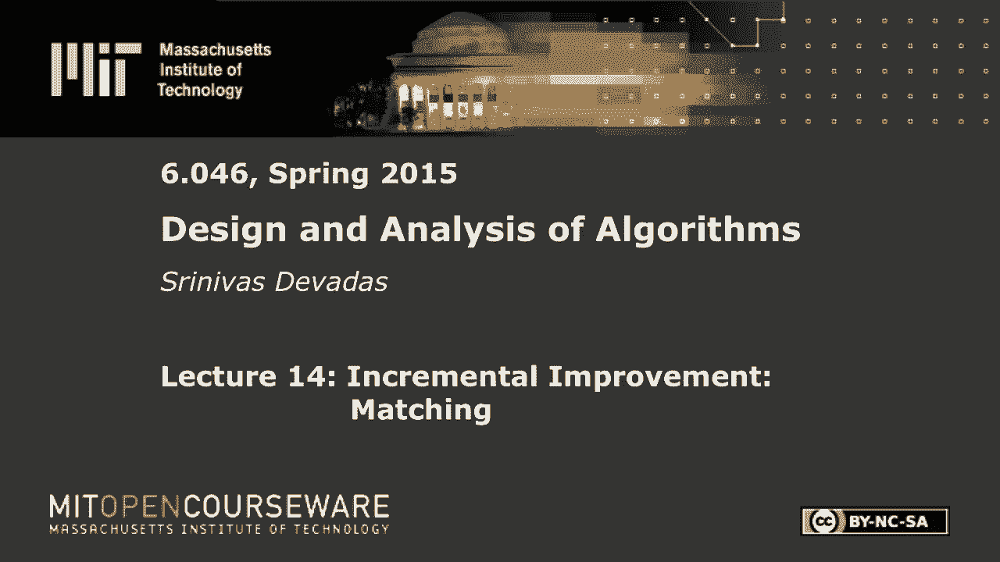

# L14：增量改进：匹配 🧩







在本节课中，我们将学习网络流算法的核心概念，特别是福特-富尔克森算法及其应用。我们将从回顾基本概念开始，然后深入算法的执行细节，并最终通过最大流最小割定理证明其正确性。此外，我们还将探讨算法的一个病态执行案例，并介绍其改进版本——埃德蒙兹-卡普算法。最后，我们将学习如何将网络流算法应用于一个实际问题：棒球淘汰赛的判定。

## 网络流基础回顾 📚

上一节我们介绍了网络流的基本框架，本节中我们来回顾一下关键概念，以确保我们理解一致。

一个**流网络**是一个有向图 `G=(V, E)`，其中每条边 `(u, v)` 关联两个数字：流量 `f(u, v)` 和容量 `c(u, v)`。例如，`(u, v): 3` 表示流量为3，容量为5。

流必须满足两个约束：
1.  **容量约束**：对于所有边 `(u, v)`，有 `0 ≤ f(u, v) ≤ c(u, v)`。
2.  **流量守恒**：对于除源点 `s` 和汇点 `t` 外的所有顶点 `v`，流入 `v` 的总流量等于流出 `v` 的总流量。

我们的目标是找到从源点 `s` 到汇点 `t` 的**最大流**。流的值 `|f|` 定义为从源点 `s` 流出的总流量。

## 最大流最小割定理 🔗

上一节我们介绍了流和容量的概念，本节中我们来看看一个关键定理，它将最大流与网络中的“切割”联系起来。

一个**割** `(S, T)` 是将顶点集 `V` 划分为两个集合 `S` 和 `T`，且满足 `s ∈ S`，`t ∈ T`。割的**容量** `c(S, T)` 是从 `S` 指向 `T` 的所有边的容量之和。

最大流最小割定理指出，以下三个陈述是等价的：
1.  存在一个割 `(S, T)` 使得流 `f` 的值等于该割的容量，即 `|f| = c(S, T)`。
2.  流 `f` 是一个最大流。
3.  在残差图 `G_f` 中，不存在从源点 `s` 到汇点 `t` 的路径。

这个定理是证明福特-富尔克森算法正确性的核心。特别地，当算法终止时（即残差图中没有增广路径），根据陈述3可推出陈述2，从而证明我们得到了最大流。

## 福特-富尔克森算法 🚀

理解了最大流最小割定理后，我们现在可以深入探讨福特-富尔克森算法本身。

该算法基于**残差图** `G_f` 和**增广路径**的概念。残差图 `G_f` 与原图 `G` 顶点相同，但其边表示在原图中可以增加或减少流量的可能性。对于原图中的每条边 `(u, v)`：
*   如果 `f(u, v) < c(u, v)`，则在 `G_f` 中添加一条从 `u` 到 `v` 的边，其**剩余容量**为 `c_f(u, v) = c(u, v) - f(u, v)`。
*   如果 `f(u, v) > 0`，则在 `G_f` 中添加一条从 `v` 到 `u` 的边，其剩余容量为 `c_f(v, u) = f(u, v)`。

一条**增广路径**是残差图 `G_f` 中从 `s` 到 `t` 的一条简单路径。该路径的**瓶颈容量**是路径上所有边剩余容量的最小值。

以下是福特-富尔克森算法的伪代码：

```python
initialize flow f to 0
while there exists an augmenting path p in the residual network G_f:
    augment flow f along p by the bottleneck capacity c_f(p)
return f
```

算法的核心思想是：只要能在残差图中找到增广路径，就沿着该路径尽可能增加流量，直到无法找到为止。

## 算法病态案例与改进 💡

上一节我们看到了福特-富尔克森算法的基本流程，本节中我们来看看它的一个潜在缺陷以及如何改进。

福特-富尔克森算法本身没有指定如何寻找增广路径。如果选择不当，算法可能会进行极多次迭代。考虑一个简单的网络，其中边容量为巨大的整数（如10^9）。如果算法不幸地反复选择两条特定的、流量增减相互抵消的路径（例如 `s->a->b->t` 和 `s->b->a->t`），则每次只能增加1个单位的流量，导致迭代次数与容量值成正比，效率极低。

埃德蒙兹和卡普提出了一个关键改进：**总是选择最短的增广路径**（按边数计算），这可以通过在残差图上进行广度优先搜索来实现。这个策略被称为**埃德蒙兹-卡普算法**。

埃德蒙兹-卡普算法的重要性在于，它保证了增广次数为 `O(VE)`。由于每次广度优先搜索需要 `O(E)` 时间，因此算法的总时间复杂度为 `O(VE^2)`。这首次证明了最大流问题可以在多项式时间内解决，而不依赖于边容量的大小。

## 应用实例：棒球淘汰问题 ⚾

学习了网络流算法后，我们来看一个有趣的实际应用：判断一支棒球队在赛季中是否仍有理论可能赢得分区冠军（即未被“淘汰”）。

问题输入是各支队伍的当前胜场数、剩余比赛数，以及队伍之间尚未进行的比赛场次。我们需要判断，在剩余所有比赛结果最有利于目标队伍（比如底特律队）的情况下，它是否仍有可能获得最多胜场（或并列）。

我们可以将这个问题构建成一个最大流网络：
*   **源点 `s`**：连接一系列“比赛节点”，每条边的容量是两支特定队伍之间剩余的比赛场次。
*   **比赛节点**：连接到对应的“队伍节点”，容量为无穷大。
*   **队伍节点**：连接到**汇点 `t`**，每条边的容量是 `w5 + r5 - wi`，其中 `w5` 和 `r5` 是目标队伍的当前胜场和剩余总场次，`wi` 是队伍 `i` 的当前胜场。这个容量限制了队伍 `i` 在目标队伍全胜的前提下，最多还能赢多少场而不超过目标队伍。
*   计算该网络的最大流。如果最大流等于从源点 `s` 出发的所有边容量之和（即所有剩余比赛都能被“分配”完），且不违反任何队伍节点的容量限制，则目标队伍未被淘汰。否则，它就被淘汰了。

这个构造巧妙地利用网络流来模拟“最佳情况”下比赛结果的分配，是网络流算法强大建模能力的一个经典例证。

---

本节课中我们一起学习了网络流的核心算法——福特-富尔克森算法。我们回顾了流网络的基本概念，学习了最大流最小割定理并用以证明算法正确性。我们探讨了算法在选择增广路径不当时可能出现的低效情况，并介绍了通过广度优先搜索选择最短增广路径的埃德蒙兹-卡普改进算法。最后，我们看到了如何将抽象的网络流算法应用于具体的棒球淘汰赛问题，展示了算法解决实际问题的强大能力。