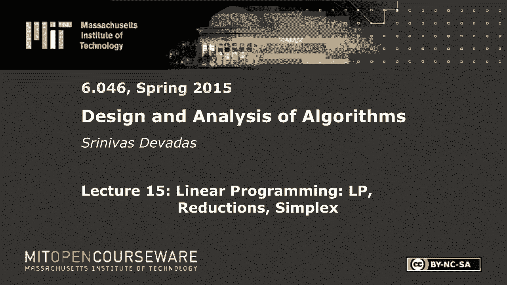
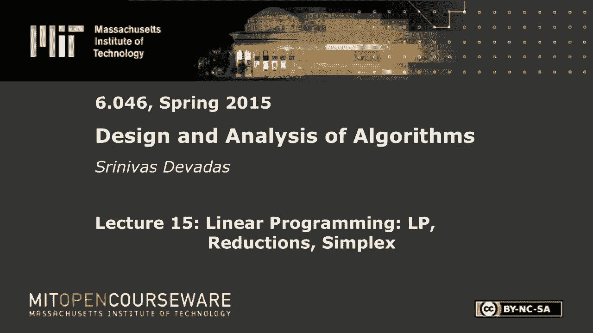
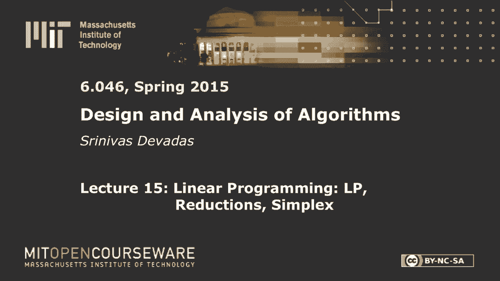
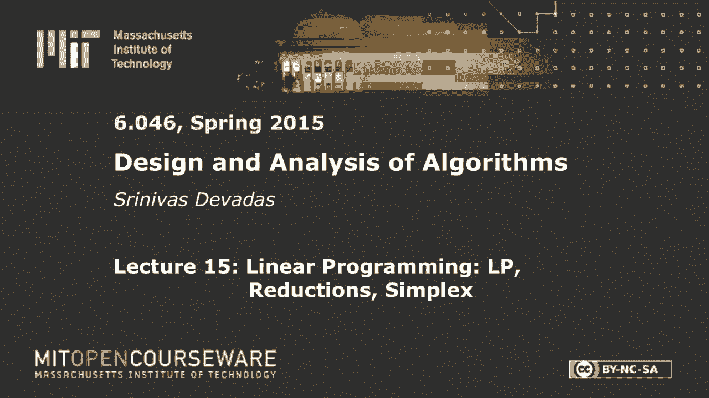

# L15：线性规划：LP、约简、单纯形 🧮










在本节课中，我们将学习线性规划（Linear Programming, LP）这一强大的通用优化技术。我们将了解其基本概念、如何将实际问题建模为线性规划，并初步探索求解线性规划的单纯形算法。

---

## 概述

线性规划是一种用于解决优化问题的数学方法，其目标是在一组线性约束条件下，最大化或最小化一个线性目标函数。它广泛应用于资源分配、生产计划、网络流等众多领域。本节课我们将学习线性规划的标准形式、如何将问题约简为线性规划，并介绍经典的单纯形算法。

---

## 线性规划简介与示例

上一节我们概述了线性规划的强大通用性。本节中，我们通过一个具体的“政治竞选”例子，来看看如何将一个实际问题表述为线性规划。

假设你需要通过广告宣传来赢得选举，目标是花费最少的资金。你有四种不同的政策议题（修路、枪支管制、农业补贴、汽油税）需要向三类不同的人口群体（城市、郊区、农村）进行广告宣传。每花费1美元在不同议题上，对不同群体产生的选票影响（可能为正或负）以及各群体的人口基数都是已知的。

我们的目标是：确定在每个议题上投入多少资金（变量 x1, x2, x3, x4），以最小化总花费，同时确保在每个群体中获得的选票数超过该群体总票数的一半（即赢得多数）。

以下是建模过程：
*   **变量**：设 x1, x2, x3, x4 分别代表在四个议题上投入的资金（美元）。
*   **目标函数（最小化）**：总花费 `Minimize: x1 + x2 + x3 + x4`。
*   **约束条件（确保每个群体获胜）**：根据表格数据，每个群体获得的选票必须超过其总票数的一半。
    *   城市群体：`-2x1 + 8x2 + 0x3 + 10x4 >= 50,000`
    *   郊区群体：`5x1 + 2x2 + 0x3 + 0x4 >= 100,000`
    *   农村群体：`3x1 - 5x2 + 10x3 + 0x4 >= 25,000`
*   **非负约束**：`x1, x2, x3, x4 >= 0`

这就构成了我们的第一个线性规划模型。求解这个模型，就能找到最优的资金分配方案。

---

## 线性规划的标准形式与转换

上一节我们通过一个例子建立了线性规划模型。为了使用通用的求解算法，我们需要将线性规划转化为标准形式。

线性规划的标准形式定义如下：
*   **目标**：最大化。
*   **约束**：所有约束都是“小于等于”形式。
*   **变量**：所有变量非负。

用矩阵和向量表示为：
```
Maximize: c^T * x
Subject to: A * x <= b
            x >= 0
```
其中，`x` 是变量向量，`c` 是目标函数系数向量，`A` 是约束系数矩阵，`b` 是约束右侧常数向量。

实际建模中，问题可能不符合标准形式。以下是常见的转换技巧：

以下是几种常见非标准形式的转换方法：
*   **最小化转最大化**：将目标函数乘以 -1。`Minimize c^T*x` 等价于 `Maximize -c^T*x`。
*   **变量无符号限制**：若变量 `xj` 可取任意值，可将其替换为两个非负变量的差：`xj = xj' - xj''`，其中 `xj', xj'' >= 0`。
*   **等式约束**：等式 `a^T*x = b` 等价于同时满足 `a^T*x <= b` 和 `-a^T*x <= -b`。
*   **“大于等于”约束**：约束 `a^T*x >= b` 等价于 `-a^T*x <= -b`。

通过以上转换，任何线性规划问题都可以化为标准形式，从而使用标准求解器。

---

## 对偶性与最优性证明

上一节我们学习了线性规划的标准形式。本节中，我们探讨一个重要的概念——对偶性，它能为我们提供最优解的“证书”。

对于任何一个线性规划（称为**原问题**）：
```
Maximize: c^T * x
Subject to: A * x <= b
            x >= 0
```
都存在一个与之关联的**对偶问题**：
```
Minimize: b^T * y
Subject to: A^T * y >= c
            y >= 0
```
其中 `y` 是对偶变量向量。

对偶性理论指出，原问题的最优解值等于对偶问题的最优解值。这意味着，如果我们找到了原问题的一个可行解 `x*` 和对偶问题的一个可行解 `y*`，并且满足 `c^T*x* = b^T*y*`，那么 `x*` 就是原问题的最优解。

回到政治竞选的例子，最优解的总花费约为 $21,000。我们可以通过构造一组特殊的乘数（即对偶变量的值）来“证明”这个值是最优的。具体方法是：将原问题的三个约束分别乘以这组乘数后相加，可以得到一个不等式，其左边是总花费 `x1+x2+x3+x4`，右边是一个常数（即 $21,000）。这个不等式表明，任何可行解的总花费都不可能低于这个常数，从而证明了 $21,000 是最优值。这个构造过程本质上就是找到了对偶问题的一个可行解。

---

## 问题约简：将经典算法问题转化为LP

上一节我们看到了对偶性的理论力量。本节中，我们来看看线性规划的实践力量——如何将我们已经熟悉的算法问题“约简”为线性规划问题。

**最大流问题**
最大流问题可以自然地表述为线性规划。
*   **变量**：`f(u,v)` 表示边 `(u,v)` 上的流量。
*   **目标**：最大化从源点 `s` 流出的总流量。
*   **约束**：
    1.  **容量约束**：`f(u,v) <= c(u,v)`。
    2.  **流量守恒**：对于非源非汇的顶点 `v`，流入等于流出。
    3.  **斜对称**：`f(u,v) = -f(v,u)`。
所有这些约束都是线性的。更强大的是，对于**多商品最大流**（多种流共享网络容量）等更复杂的问题，只需添加如 `f1(u,v) + f2(u,v) <= c(u,v)` 这样的线性约束即可建模，而专用算法可能更复杂或不存在。

**单源最短路径问题**
将最短路径问题转化为线性规划需要一些技巧。
*   **变量**：`d(v)` 表示从源点 `s` 到顶点 `v` 的距离。
*   **约束**：
    1.  **三角不等式**：对于每条边 `(u,v)`，`d(v) <= d(u) + w(u,v)`。
    2.  **源点距离**：`d(s) = 0`。
*   **目标**：**最大化** `d(t)`（对于特定终点 `t`）或 `Σ d(v)`。
这里的关键洞察是：三角不等式约束是“小于等于”，为了得到**最短**路径，我们需要**最大化**目标函数，以迫使至少一条不等式取等号（即达到最短路径的边界）。通过几个简单例子的验证，可以理解这种最大化目标如何产生最短距离。

这些约简展示了线性规划作为“通用优化引擎”的威力。许多组合优化问题都可以通过巧妙的建模，转化为线性规划来求解。

---

## 单纯形算法简介

前面我们学习了如何建模。本节中，我们初步探索最著名的线性规划求解算法——单纯形法。它是一种迭代算法，虽然最坏情况下是指数时间复杂度，但在实际应用中通常非常高效。

单纯形法在**松弛形式**上操作。松弛形式将标准形式中的不等式通过引入**松弛变量**变为等式。例如，约束 `x1 + 2x2 <= 4` 变为 `x1 + 2x2 + s = 4`，其中 `s >= 0` 是松弛变量。

算法从一个**基本可行解**开始（通常将所有原始变量设为0，松弛变量等于约束右侧常数）。然后迭代进行以下步骤：
1.  **检查最优性**：如果当前目标函数中所有非基本变量的系数都为非正（最大化问题），则当前解最优，算法停止。
2.  **选择进基变量**：选择一个在目标函数中系数为正的非基本变量（因为它增加能提高目标值）。
3.  **选择离基变量**：增加进基变量时，会减少某些基本变量的值。选择最先降为0的基本变量作为离基变量（以保持可行性）。
4.  **旋转**：通过高斯消元法，交换进基变量和离基变量的角色（进基变量变为基本变量，离基变量变为非基本变量），得到一个新的等价松弛形式及其对应的基本可行解。

我们通过一个简单例子演示了一次旋转操作：
*   初始松弛形式：`z = 3x1 + x2 + 2x3`，约束为 `x1 + x2 + 3x3 + x4 = 30`， `2x1 + 2x2 + 5x3 + x5 = 24`， `4x1 + x2 + 2x3 + x6 = 36`，所有变量非负。
*   初始基本解：`(x1,x2,x3) = (0,0,0)`， `(x4,x5,x6) = (30,24,36)`，目标值 `z=0`。
*   选择 `x1` 为进基变量（系数为正）。增加 `x1` 受第三个约束限制最紧（`x6` 最先变为0），故选择 `x6` 为离基变量。
*   执行旋转（用 `x6` 表示 `x1`，并代入其他等式），得到新的松弛形式。新的基本解变为 `(x1,x2,x3) = (9,0,0)`，目标值提升至 `z=27`。

单纯形法通过不断重复这种旋转操作，在可行解空间的顶点间移动，逐步提升目标函数值，直至找到最优解。

---

## 总结

本节课中我们一起学习了线性规划的核心内容。我们首先通过一个生动的例子学习了如何将实际问题建模为线性规划。接着，我们定义了线性规划的标准形式，并掌握了将各种形式转化为标准形式的方法。我们探讨了对偶性的重要概念，它提供了验证最优解的有力工具。然后，我们看到了线性规划的强大之处，能够将最大流、最短路径等经典算法问题通过约简来求解。最后，我们初步了解了经典的单纯形算法的基本思想和工作流程，它通过迭代地在可行域的顶点间移动来寻找最优解。线性规划是算法工具箱中一个极其强大的通用优化工具。