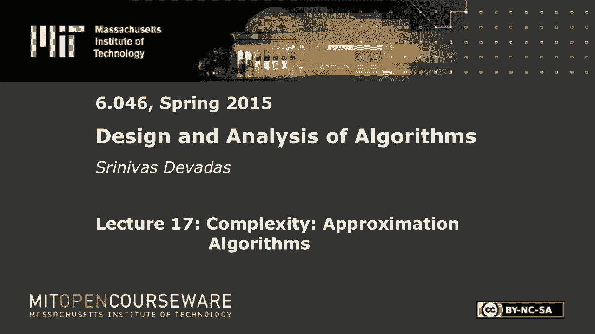
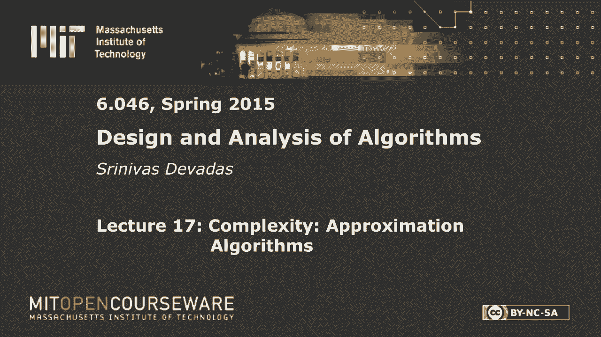

# L17：复杂性：近似算法 🧩

在本节课中，我们将学习近似算法的基本概念。当面对NP完全或NP难问题时，我们无法在多项式时间内找到精确的最优解。近似算法提供了一种实用的策略：它能在多项式时间内找到一个解，并保证该解的成本与最优解的成本之比不会超过某个特定的因子（近似比）。我们将通过几个经典问题来理解如何设计和分析近似算法。

---

## 什么是近似算法？ 📊

上一节我们介绍了NP完全问题的挑战，本节中我们来看看一种应对策略：近似算法。

一种近似算法，对于规模为 `n` 的问题，其近似比可以参数化。我们定义一个近似比 `ρ(n)`。对于最小化问题，如果对于任何输入，算法产生的解的成本 `C` 满足 `C / C_opt ≤ ρ(n)`，则该算法是一个 `ρ(n)` 近似算法。对于最大化问题，条件变为 `C_opt / C ≤ ρ(n)`。`ρ(n)` 可能是一个常数，也可能是 `n` 的函数（例如 `log n`）。

近似方案是更强大的工具。它接受一个额外的参数 `ε`（epsilon），允许我们通过投入更多计算时间来获得更接近最优的解（即近似比 `1 + ε`）。如果运行时间是 `n` 和 `1/ε` 的多项式，则称为完全多项式时间近似方案。

---

## 顶点覆盖问题 🎯

顶点覆盖问题要求找到一个最小的顶点集合，使得图中的每条边都至少有一个端点在这个集合中。这是一个NP完全问题。

一个直观的启发式算法是不断选择度数最大的顶点。然而，这种策略在最坏情况下可能产生近似比为 `O(log n)` 的解，其性能随问题规模增长。

以下是另一种简单的近似算法，它能保证在2倍最优解以内：

1.  初始化边集 `E' = E`，顶点覆盖集 `C = ∅`。
2.  当 `E'` 不为空时：
    *   从 `E'` 中任意选择一条边 `(u, v)`。
    *   将 `u` 和 `v` 加入 `C`。
    *   从 `E'` 中删除所有与 `u` 或 `v` 相关联的边。
3.  返回 `C`。

**证明（2-近似）**：
设算法选取的边集为 `A`。由于算法选取的边没有公共端点（因为一旦选取一条边，就移除了其关联的所有边），因此覆盖这些边至少需要 `|A|` 个顶点。最优解 `C_opt` 必须覆盖所有边，包括 `A` 中的边，因此 `|C_opt| ≥ |A|`。算法最终选取的顶点数为 `2|A|`，所以有 `|C| = 2|A| ≤ 2|C_opt|`。证毕。

---

## 集合覆盖问题 📚

集合覆盖问题描述如下：给定一个全集 `X` 和 `X` 的一组子集 `S1, S2, ..., Sm`，目标是选择数量最少的子集，使得它们的并集等于 `X`。

一个自然的贪心启发式是迭代地选择能覆盖最多**尚未被覆盖**元素的子集。

以下是该贪心算法的近似比分析：
设最优解使用了 `t` 个子集。在算法的任意第 `k` 步，设剩余未被覆盖的元素集合为 `X_k`。由于 `t` 个子集能覆盖 `X_k`，根据鸽巢原理，其中至少有一个子集覆盖不少于 `|X_k| / t` 个元素。贪心算法会选择覆盖最多未覆盖元素的子集，因此它每一步至少能覆盖 `|X_k| / t` 个元素。这导致剩余集合大小至少按因子 `(1 - 1/t)` 减少。通过分析可知，算法选取的子集数量 `k` 满足 `k/t ≤ ln|X| + 1`。因此，该贪心算法是一个 `(ln n + 1)` 近似算法。

---

## 划分问题 ⚖️

划分问题要求将一个数字集合分成两个子集，使得两个子集的和尽可能接近。形式化地说，给定数字 `S = {s1, s2, ..., sn}`，找到划分方案最小化 `max(∑_{i∈A} si, ∑_{i∈B} si)`，其中 `A ∪ B = S` 且 `A ∩ B = ∅`。

一个平凡的2-近似算法是将所有数字放入一个集合，另一个集合为空。但我们可以做得更好。下面描述一个多项式时间近似方案：

该方案分为两个阶段，参数 `m` 与期望的精度 `ε` 相关（例如，令 `m = 1/ε - 1`）。

1.  **精确求解阶段**：对前 `m` 个最大的数字，通过穷举搜索所有 `2^m` 种划分方式，找到其最优划分 `(A', B')`。这需要 `O(2^m)` 时间，当 `m` 较小时可行。
2.  **贪心分配阶段**：将剩余的数字（从第 `m+1` 个到第 `n` 个）按顺序依次添加到当前总和较小的那个子集中（即若 `sum(A) ≤ sum(B)`，则将当前数字加入 `A`，否则加入 `B`）。

**算法思路**：通过处理最大的 `m` 个数字来“播种”一个较好的初始解，然后以贪心方式处理较小的数字。分析表明，最终解的和 `WA` 满足 `WA / L ≤ 1 + 1/(m+1) = 1 + ε`，其中 `L` 是总和的二分之一（即最优解的下界）。因此，这是一个 `(1+ε)` 近似方案。由于运行时间在 `n` 上是多项式，但在 `1/ε` 上是指数（来自第一阶段），故它是一个多项式时间近似方案，而非完全多项式时间近似方案。

---

本节课中我们一起学习了近似算法的核心思想。我们看到了如何为顶点覆盖问题设计简单的2-近似算法，分析了集合覆盖问题的对数近似贪心算法，并探讨了针对划分问题的多项式时间近似方案。这些技术为我们处理实际中的NP难问题提供了有力的理论工具和实践指导。