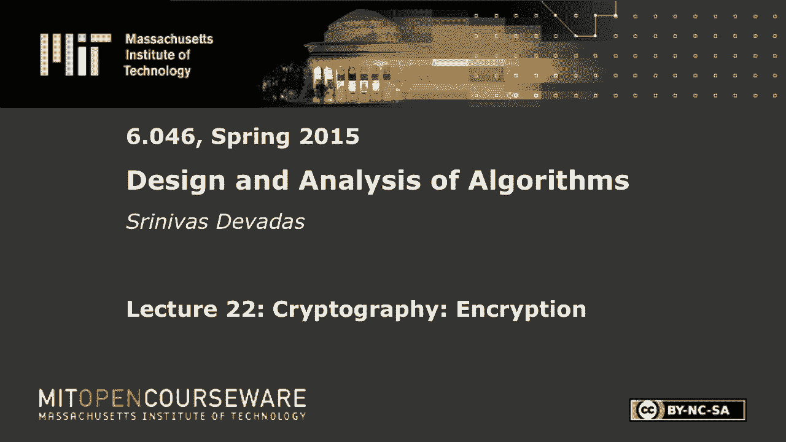
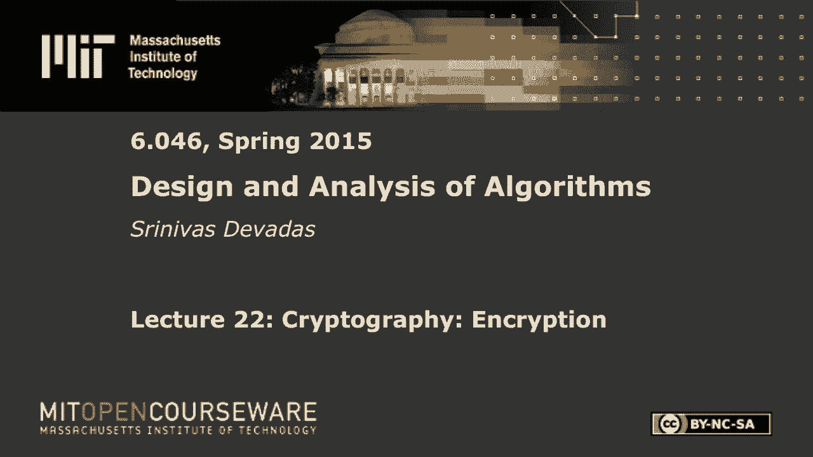
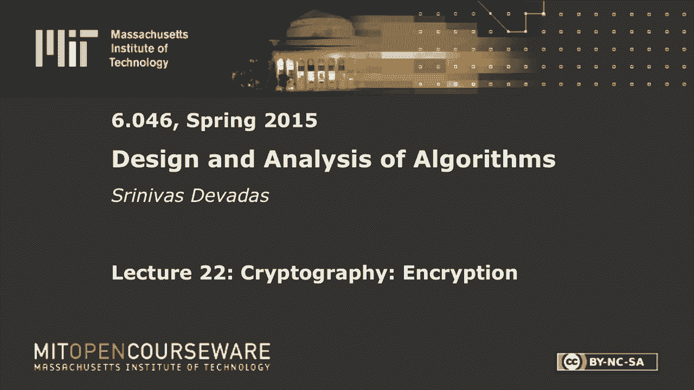

# L22：密码学：加密 🔐

在本节课中，我们将要学习密码学中的核心概念——加密。我们将从对称密钥加密开始，探讨其工作原理和局限性，然后深入讲解密钥交换的经典问题与解决方案。最后，我们将转向非对称密钥加密，重点剖析著名的RSA算法，并讨论密码学系统背后的计算复杂性假设。

---

## 对称密钥加密 🔑

上一节我们介绍了密码学的整体目标，本节中我们来看看最基础的加密形式——对称密钥加密。它假设通信双方（例如爱丽丝和鲍勃）共享一个秘密密钥。

对称密钥加密的基本方程非常简单：

*   **加密过程**：`C = E(M, K)`
    *   `C` 代表密文。
    *   `M` 代表明文或消息。
    *   `K` 代表秘密密钥。
    *   `E` 代表加密函数。
*   **解密过程**：`M = D(C, K)`
    *   `D` 代表解密函数。

这里的核心要求是**可逆性**。知道密钥 `K` 后，从密文 `C` 恢复明文 `M` 应该是一个简单的操作（通常是线性时间复杂度）。这与我们之前学习的哈希函数（单向、不可逆）有本质区别。

对称密钥加密算法（如AES）通常基于可逆操作构建，例如：
*   **置换**：重新排列数据的顺序。
*   **异或运算**：`A XOR B XOR B = A`，其自身就是逆操作。

对称密钥加密速度快，适合加密大量数据（如流媒体视频）。但它引出了一个关键问题：**爱丽丝和鲍勃最初如何安全地共享那个秘密密钥 `K`？**

---

## 密钥交换难题与迪菲-赫尔曼协议 🤝

我们已经了解了对称加密需要一个共享密钥，但如何在不安全的信道上建立这个共享密钥呢？这引出了经典的“海盗谜题”。

**海盗谜题场景**：
爱丽丝和鲍勃在两个岛上，需要通过海盗出没的海域交换秘密。他们各有带锁的箱子和对应的钥匙。海盗会检查所有经过的货物：如果箱子未上锁，他们会打开查看；如果箱子已上锁，他们会原样送达；如果他们看到单独的钥匙，则会没收钥匙。

**解决方案（物理世界）**：
1.  爱丽丝将秘密放入箱子，用她的锁 `Lock_A` 锁上，寄给鲍勃。
2.  鲍勃收到后，加上自己的锁 `Lock_B`，然后将双锁箱子寄回给爱丽丝。
3.  爱丽丝用自己的钥匙打开 `Lock_A`，将只剩 `Lock_B` 的箱子寄给鲍勃。
4.  鲍勃用自己的钥匙打开 `Lock_B`，获得秘密。

整个过程中，在运输的始终是**锁着的箱子**，没有钥匙在传输，因此海盗无法获得秘密。这个方案依赖于一个关键假设：**两把锁可以独立地锁在同一个箱子上，且操作顺序可交换**（即先锁A再锁B，与先锁B再锁A效果相同）。

**数学抽象：迪菲-赫尔曼密钥交换**
上述物理过程可以被抽象成一个优美的数学协议，即迪菲-赫尔曼密钥交换协议。

以下是协议步骤：
1.  爱丽丝和鲍勃公开约定一个大素数 `p` 和一个整数 `g`（`g` 是有限域 `GF(p)` 的一个生成元）。
2.  **爱丽丝** 选择一个私密的随机数 `a`，计算 `A = g^a mod p`，并将 `A` 发送给鲍勃。
3.  **鲍勃** 选择一个私密的随机数 `b`，计算 `B = g^b mod p`，并将 `B` 发送给爱丽丝。
4.  **爱丽丝** 收到 `B` 后，计算共享密钥 `K = B^a mod p = (g^b)^a mod p = g^(b*a) mod p`。
5.  **鲍勃** 收到 `A` 后，计算共享密钥 `K = A^b mod p = (g^a)^b mod p = g^(a*b) mod p`。

最终，爱丽丝和鲍勃得到了相同的共享密钥 `K`，而窃听者只能看到公开的 `p, g, A, B`。

**安全性基于的计算难题**：
*   **离散对数问题**：已知 `g^a mod p`，求解私钥 `a` 在计算上是困难的。
*   **迪菲-赫尔曼问题**：已知 `g^a mod p` 和 `g^b mod p`，求解 `g^(a*b) mod p` 在计算上是困难的。

迪菲-赫尔曼协议完美模拟了海盗谜题：`g^a` 和 `g^b` 相当于“锁着的盒子”，私钥 `a` 和 `b` 相当于“钥匙”。然而，它和海盗谜题一样，面临**中间人攻击**的威胁：如果攻击者马尔能够截获并替换双方发送的 `A` 和 `B`，他就能分别与爱丽丝和鲍勃建立共享密钥，从而窃听所有通信。解决这个问题需要**身份认证**，这正是非对称密钥加密（公钥加密）可以提供的功能。

---

## 非对称密钥加密与RSA算法 🗝️

上一节我们看到了密钥交换的挑战，本节中我们来看看非对称密钥加密如何解决身份认证和保密性问题。在非对称加密中，每个参与者拥有一对数学上关联的密钥：公钥（公开）和私钥（保密）。

**公钥加密流程**：
*   **加密**：任何人可以使用**鲍勃的公钥 `PK_B`** 对消息 `M` 加密，得到密文 `C = Encrypt(M, PK_B)`。
*   **解密**：只有**鲍勃**可以使用他自己的**私钥 `SK_B`** 对密文解密，恢复消息 `M = Decrypt(C, SK_B)`。

公钥需要被认证（例如通过数字证书），以防止中间人攻击。接下来，我们重点学习第一个也是最著名的公钥加密算法——RSA。

**RSA密钥生成**：
1.  爱丽丝选择两个大素数 `p` 和 `q`。
2.  计算 `n = p * q`。`n` 的长度（例如2048位）决定了安全性。
3.  计算欧拉函数 `φ(n) = (p-1) * (q-1)`。
4.  选择一个整数 `e`，满足 `1 < e < φ(n)`，且 `e` 与 `φ(n)` 互质（通常选 `e=65537`）。
5.  计算 `e` 关于 `φ(n)` 的模逆元 `d`，即满足 `e * d ≡ 1 (mod φ(n))` 的 `d`。
6.  **公钥** 为 `(n, e)`。
7.  **私钥** 为 `(d, p, q)`（实际存储 `d` 即可，`p` 和 `q` 可丢弃，但知道它们能加速运算）。

**RSA加密与解密**：
*   **加密**（发送给爱丽丝）：`C ≡ M^e (mod n)`
*   **解密**（爱丽丝执行）：`M ≡ C^d (mod n)`

**RSA为什么有效？（正确性证明）**
我们需要证明 `(M^e)^d ≡ M (mod n)`。
根据密钥生成，有 `e*d ≡ 1 (mod φ(n))`，即 `e*d = 1 + k*φ(n)`，`k` 为某整数。
因此，`(M^e)^d ≡ M^(e*d) ≡ M^(1 + k*φ(n)) ≡ M * (M^φ(n))^k (mod n)`。
根据**费马小定理**（及其推广欧拉定理），当 `M` 与 `n` 互质时，有 `M^φ(n) ≡ 1 (mod n)`。因此上式 `≡ M * 1^k ≡ M (mod n)`。
当 `M` 与 `n` 不互质（由于 `n=p*q`，`M` 是 `p` 或 `q` 的倍数）时，通过分别对 `mod p` 和 `mod q` 进行类似分析，并利用中国剩余定理，也能证明结论成立。因此，RSA加解密对于所有 `M < n` 都成立。

**RSA的安全性基于的计算难题**：
1.  **大整数分解问题**：从公开的 `n` 中分解出 `p` 和 `q`。如果分解成功，则可轻易计算出 `φ(n)` 和私钥 `d`。
2.  **RSA问题**：在不知道私钥 `d` 的情况下，从密文 `C` 和公钥 `(n, e)` 中恢复明文 `M`。即求解 `M^e ≡ C (mod n)` 中的 `M`。

---

## 密码学与计算复杂性 🧩

我们讨论了RSA和迪菲-赫尔曼协议，它们的安全性都依赖于特定的计算难题（因式分解、离散对数）。这些难题属于 **NP问题**（可以在多项式时间内验证一个解），但**它们并非NP完全问题**。

一个有趣的现象是：许多**NP完全问题**（如三染色问题、背包问题）虽然在最坏情况下极难求解，但**在平均情况下往往存在高效解法或启发式算法**。例如，一个随机大图很可能包含一个“小团”，从而快速判断其不可三染色。

历史上，人们曾尝试基于NP完全问题（如背包问题）构建公钥密码系统（如Merkle-Hellman背包密码系统）。该系统利用“超递增背包”（易解）生成私钥，再通过模运算将其转换为一个看似困难的“一般背包”（NPC）作为公钥。然而，这些系统几乎都被迅速攻破，因为攻击者无需解决最难的NPC实例，而是可以利用公钥结构中的特殊性质，在**平均情况**下轻松破解。

**核心区别**：
*   **密码学适用的难题**（如因式分解）：在**平均情况**下也是困难的。需要精心选择参数（大素数），使得几乎所有实例都同样难解。
*   **NP完全问题**：仅在**最坏情况**下被证明是困难的。存在大量容易解决的实例，使得基于其构建的密码系统在平均情况下不安全。

这正是RSA等密码系统能够经受时间考验，而许多基于NPC问题的系统失败的根本原因。

---

## 总结 📚

本节课中我们一起学习了密码学加密的核心内容：
1.  **对称密钥加密**：双方共享同一密钥进行加解密，速度快，但密钥分发是挑战。
2.  **密钥交换**：通过迪菲-赫尔曼协议，双方可以在不安全的信道上协商出一个共享密钥，其安全性基于离散对数难题。
3.  **非对称密钥加密**：使用公钥/私钥对，解决了密钥分发和身份认证问题。我们深入剖析了**RSA算法**的密钥生成、加解密过程及其数学原理（基于费马小定理），其安全性依赖于大整数分解难题。
4.  **计算复杂性视角**：成功的密码系统依赖于**平均情况下困难**的数学问题（如因式分解），而非仅在最坏情况下困难的NP完全问题。这是设计安全密码系统时需要理解的关键概念。