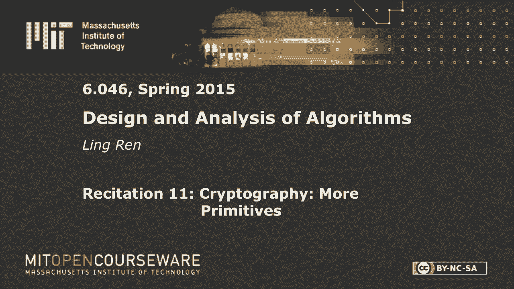
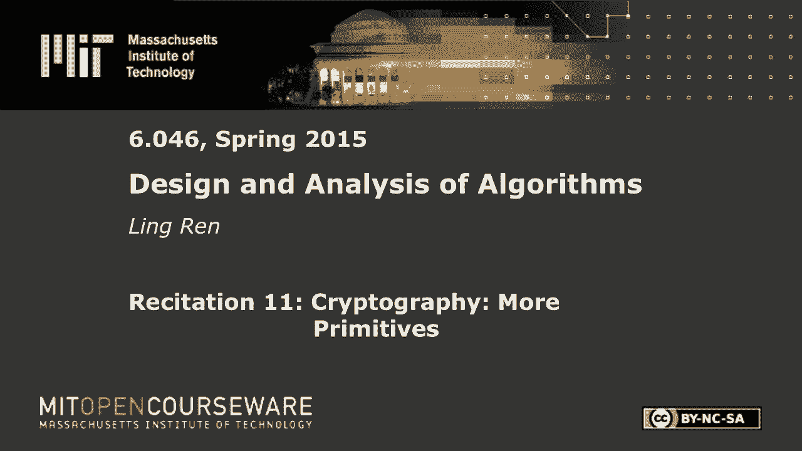

# R11：密码学：更多原语 🔐







在本节课中，我们将学习密码学中的更多基础概念，包括数字签名、消息认证码以及哈希树等原语。我们将探讨它们的工作原理、安全属性以及一些实际应用中的注意事项。

---

## 数字签名 ✍️

上一节我们介绍了哈希函数及其应用。本节中，我们来看看数字签名。数字签名用于验证消息的真实性，它是一对函数。

数字签名包含两个函数：
*   **签名函数**：使用一个秘密密钥和一条消息，生成一个签名 `σ`。
*   **验证函数**：使用一个公钥、一条消息和一个签名，输出 `true` 或 `false`。

我们用秘密密钥来签名，用公钥来验证。这意味着，发送者应该是唯一能对消息签名的人，而任何人都可以验证该消息确实来自该发送者。

我们希望数字签名具备以下属性：
1.  **正确性**：如果签名 `σ` 确实是由正确的签名函数生成的，那么验证函数应输出 `true`。
2.  **不可伪造性**：没有秘密密钥的攻击者，即使看到了一些消息-签名对，也无法为一条新消息生成一个有效的签名。

以下是构建数字签名的一种早期尝试（基于RSA）：
```python
# 不安全的RSA签名方案（示例）
signature = message^d mod n  # 使用私钥d签名
is_valid = (signature^e mod n) == message  # 使用公钥(e, n)验证
```
然而，这个方案存在安全漏洞，例如乘法攻击：攻击者可以将两条消息的签名相乘，得到一条新消息的有效签名。

一个改进方案是引入哈希函数：
```python
# 改进的RSA签名方案（使用哈希）
signature = hash(message)^d mod n
is_valid = (signature^e mod n) == hash(message)
```
这可以抵御上述乘法攻击，因为哈希函数破坏了乘法同态性。然而，其安全性依赖于哈希函数的单向性和抗碰撞性，并且是“启发式安全”，缺乏形式化证明。

---

## 消息认证码 (MAC) 🔑

我们已经介绍了非对称密钥原语（公钥加密、数字签名）和对称密钥原语（加密）。如果通信双方共享一个秘密密钥，一方如何验证消息确实来自另一方？这就需要消息认证码。

MAC的定义与数字签名类似，但只使用一个共享密钥。
*   **MAC生成函数**：使用密钥 `K` 和消息 `M`，生成一个认证码 `T`。
*   **验证函数**：验证者重新计算消息的MAC，并与接收到的 `T` 进行比较。

MAC也需要正确性和不可伪造性。一个简单的想法是使用带密钥的哈希：
```python
# 简单的MAC构造（示例）
mac = hash(key || message)  # “||” 表示连接
```
但需要注意连接顺序和填充，以避免某些攻击。在实践中，有更安全的专门MAC算法（如HMAC）。

数字签名和MAC的一个实际区别是**不可否认性**：数字签名由于使用私钥，提供了不可否认性（发送方事后不能否认发送过）；而MAC双方共享密钥，任何一方都可以生成有效的MAC，因此不提供不可否认性。

---

## 哈希树 (Merkle Tree) 🌳

考虑一个云存储场景：你如何确保从服务器下载的文件是完整且未被篡改的最新版本？仅存储每个文件的哈希值会占用大量本地空间。哈希树（或称Merkle树）提供了高效的解决方案。

哈希树的结构如下：
1.  对每个数据块（文件）计算哈希值，作为叶子节点。
2.  将相邻两个叶子节点的哈希值连接起来，计算其哈希值，作为它们的父节点。
3.  递归地进行此操作，直到生成一个根哈希值。

本地只需存储这个**根哈希**。要验证某个数据块：
1.  服务器提供该数据块，以及从该数据块到根哈希路径上所有兄弟节点的哈希值。
2.  客户端根据这些信息重新计算路径上的哈希，最终得到根哈希，并与本地存储的根哈希比较。

如果哈希函数是抗碰撞的，那么哈希树也是抗碰撞的。攻击者无法在不被察觉的情况下修改任何数据块，因为那将导致根哈希值改变。更新一个数据块只需要更新从该叶子到根路径上的 `O(log n)` 个哈希值。

---

## 背包密码系统回顾 🎒

最后，我们快速回顾一下背包密码系统。其思想是利用“超递增序列”背包问题的易解性和一般背包问题的难解性。

加密过程是计算一个子集和：`C = Σ (mi * wi) mod m`，其中 `mi` 是消息位，`wi` 是公钥序列。
解密时，利用私钥将 `C` 转换回超递增序列域，从而轻松求解。

然而，背包密码系统面临一个困境：为了保证正确解密，模数 `m` 需要大于超递增序列的总和，这限制了序列元素的大小，可能导致密度过低而容易受到攻击（如低密度攻击）。虽然大多数背包方案已被攻破，但其追求比RSA等数论方案更快的加解密速度的动机仍然值得思考。

最初的动机——基于NP完全问题构建密码系统——遇到了根本性挑战：密码学需要问题在“平均情况”下困难，而NP完全性只保证“最坏情况”下困难。

---

本节课中我们一起学习了数字签名、消息认证码和哈希树等密码学原语。数字签名提供了身份认证和不可否认性；MAC在共享密钥场景下提供消息认证；哈希树则是一种高效的数据完整性验证结构。最后，我们回顾了背包密码系统的原理与挑战，理解了基于计算复杂性构建密码系统的微妙之处。