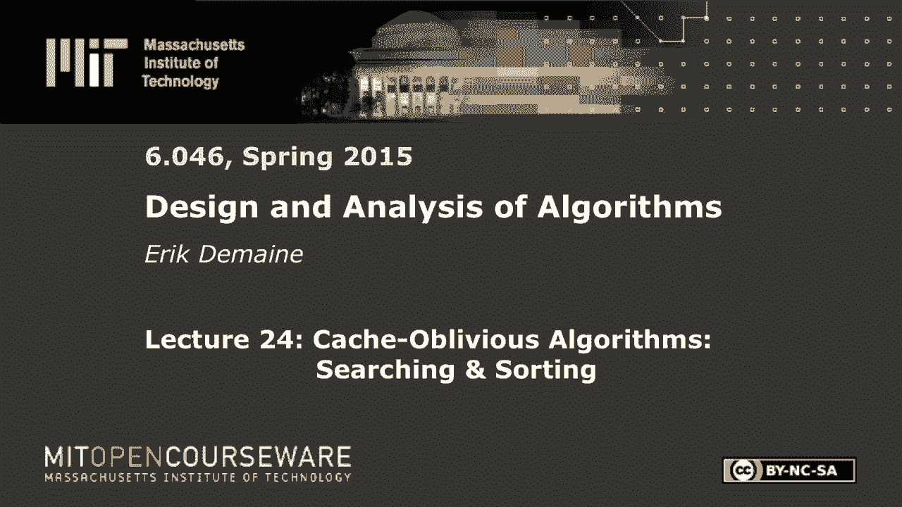
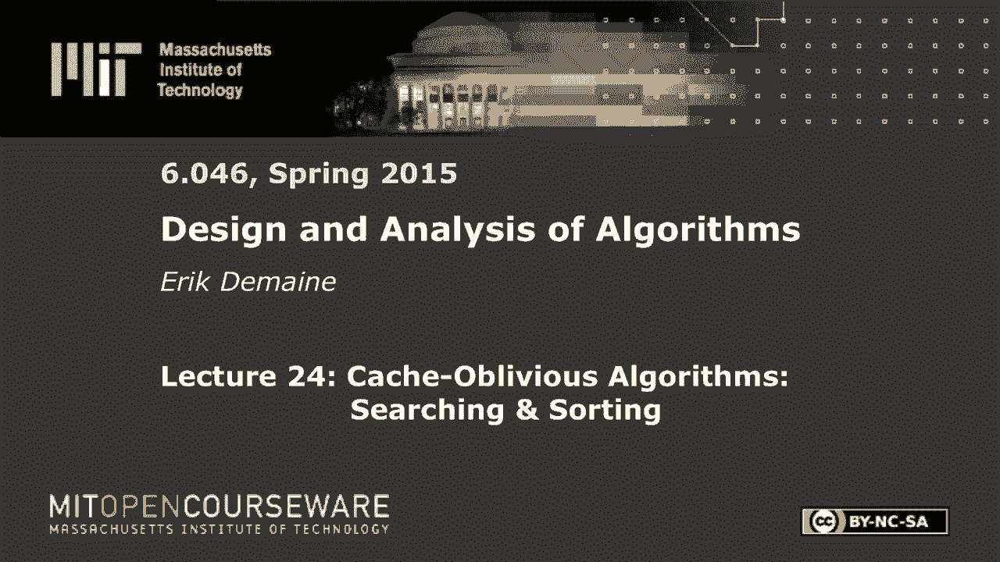
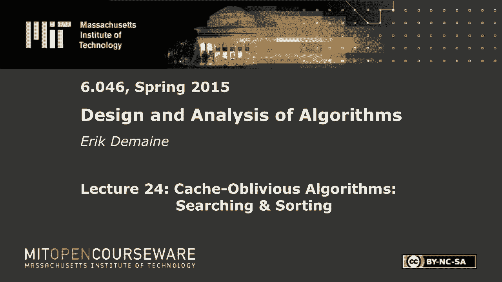

# L24：Cache-Oblivious 算法：搜索和排序 🧠

在本节课中，我们将学习缓存遗忘算法，并探讨其在计算机科学中两个最基本问题——搜索和排序上的应用。我们将回顾计算模型，分析经典算法的缓存性能，并介绍能达到最优缓存效率的缓存遗忘算法。

## 模型回顾 📊

上一节我们介绍了两种计算模型：外部存储器模型及其变体——缓存遗忘模型。本节中我们来看看它们的具体定义。

基本模型是外部存储器模型。这是一个两级内存层次结构：CPU与缓存被视为一体，它们之间可以即时通信。缓存总大小为 `M` 个字，并被划分为大小为 `B` 的块。因此，缓存中最多有 `M/B` 个块。当问题规模 `n` 很大时，数据主要存储在磁盘上。磁盘也被划分为大小为 `B` 的块。在该模型中，程序不能直接访问单个数据项，只能以块为单位进行读写。每次块读写称为一次“内存传输”，算法的目标是最小化内存传输的次数。

缓存遗忘模型是外部存储器模型的一个变体。算法不允许知道缓存参数 `M` 和 `B`。系统会自动管理块的加载和驱逐。当CPU访问一个不在缓存中的数据项时，系统会自动加载其所在的整个块。如果缓存已满，则采用最近最少使用（LRU）策略驱逐一个块。LRU策略驱逐的是缓存中最近被CPU使用最少的块。

## LRU 策略的性能分析 📈

我们有一个定理来描述LRU策略的性能。如果将LRU在大小为 `M` 的缓存上需要执行的块读取（或驱逐）次数，与一个能看到未来所有访问序列的最优离线算法（OPT）在大小为 `M/2` 的缓存上需要执行的次数进行比较，那么LRU的次数最多是OPT的2倍。

以下是该定理的简要证明思路：
1.  我们将内存访问的时间线划分为多个“阶段”。每个阶段定义为：从阶段开始起，直到访问了 `M/B + 1` 个不同的块为止。
2.  在每个阶段内，LRU最多会发生 `M/B` 次缓存缺失（即需要加载新块）。
3.  对于OPT（缓存大小为 `M/2`），在每个阶段开始时，其缓存中最多有 `(M/2)/B` 个块。而阶段内会访问 `M/B` 个不同的块，因此OPT至少需要加载 `M/B - M/(2B) = M/(2B)` 个新块。
4.  因此，在每个阶段，LRU的代价最多是OPT代价的2倍（`(M/B) / (M/(2B)) = 2`）。

这个定理表明，尽管LRU不知道未来，但在资源（缓存大小）减半的情况下，其性能与最优离线算法仅相差一个常数因子（2倍）。这证明了LRU策略以及缓存遗忘模型的合理性。

## 搜索问题 🔍

现在，我们来看如何在数组中搜索元素。假设我们有 `n` 个静态元素，需要支持查询操作：给定元素 `x`，找到集合中小于 `x` 的最大元素。

### 方法一：有序数组与二分查找

最直接的方法是将元素按顺序存储在数组中，然后进行二分查找。

**分析**：二分查找会访问大约 `log₂ n` 个元素。在最坏情况下，这些元素可能分布在不同的块中。因此，内存传输次数的上界大约是 `log₂ n`。更精确的分析表明，其复杂度为 `O(log₂ n - log₂ B + 1)`，即 `O(log₂ (n/B))`。这比普通的 `log₂ n` 有改进，但还不够好。

### 方法二：B树

B树是外部存储器模型中高效的数据结构。每个节点存储 `Θ(B)` 个键，使得一个节点可以装入一个块中。

**分析**：在B树中搜索时，从根节点到叶节点的路径长度（树高）为 `O(log_B n)`。遍历路径时，每下降一层只需加载一个块（即一次内存传输）。因此，总的内存传输次数为 `O(log_B n)`，即 `O(log₂ n / log₂ B)`。这比有序数组的二分查找要好得多。

**局限性**：B树需要预先知道块大小 `B` 来设计节点大小，因此它不是缓存遗忘的。

### 方法三：缓存遗忘搜索（van Emde Boas 布局）

为了在不已知 `B` 的情况下达到接近最优的搜索效率，我们可以使用一种特殊的二叉树内存布局，称为 van Emde Boas 布局。

**算法思想**：
1.  构建一棵包含 `n` 个元素的完美平衡二叉搜索树（BST）。
2.  递归地布置这棵树：将树从高度中间切开，得到顶部一棵高度约为 `(log₂ n)/2` 的子树和底部多棵较小的子树。
3.  在内存中，先连续存储顶部子树的 van Emde Boas 布局，然后递归地、连续地存储每一棵底部子树的布局。

**搜索操作**：在这样布局的BST上进行常规的二叉搜索。

**性能分析**：
*   递归布局保证了任意一个高度为 `O(log₂ B)` 的子树（即包含约 `B` 个节点）会被连续存储在 `O(1)` 个块中。
*   一次搜索从根节点到叶节点的路径会经过 `O(log₂ n)` 个节点。
*   这条路径会穿过 `O(log₂ n / log₂ B)` 棵这样的子树。
*   每进入一棵新的子树，最多需要2次内存传输来加载其所在的块（因为子树连续存储，最多跨越两个块）。一旦一个子树的块被加载到缓存中，在该子树内的后续访问都是免费的。
*   因此，总的内存传输次数为 `O(log₂ n / log₂ B)`，即 `O(log_B n)`，这与B树的效率在常数因子内相同，且不需要知道参数 `B`。

## 排序问题 🔢

接下来，我们探讨如何对 `n` 个元素进行排序。

### 方法一：通过 B树 插入排序

一个直观的方法是使用B树：依次将 `n` 个元素插入B树，然后进行中序遍历输出有序序列。

**分析**：每次插入需要 `O(log_B n)` 次内存传输，`n` 次插入的总成本为 `O(n log_B n)`。这并不理想。

### 方法二：缓存敏感的归并排序

我们考虑归并排序。标准的二路归并排序的递归式为：
`MT(n) = 2 * MT(n/2) + O(n/B)`
其中 `MT(n)` 表示对 `n` 个元素排序所需的内存传输次数，`O(n/B)` 是合并两个已排序子数组的成本（通过并行扫描）。

**求解**：
*   递归树共有 `O(log₂ n)` 层。
*   每一层所有子问题合并的总成本为 `O(n/B)`。
*   因此，总成本 `MT(n) = O((n/B) * log₂ n)`。

这个界是 `O(n log₂ n / B)`，比通过B树插入排序的 `O(n log_B n) = O(n log₂ n / log₂ B)` 要好，因为除了 `log₂ n`，我们还除以了 `B`。

### 方法三：多路归并排序（达到最优）

为了进一步优化，我们可以进行 `M/B` 路归并排序。

**算法思想**：
1.  将数组递归地分成 `M/B` 个子数组（每个大小约为 `n / (M/B)`），并分别排序。
2.  合并时，我们需要同时扫描这 `M/B` 个已排序的子数组。由于缓存中可以容纳 `M/B` 个块（每个子数组的当前块），因此这次多路合并的成本仍然是 `O(n/B)`。

**递归式**：
`MT(n) = (M/B) * MT(n / (M/B)) + O(n/B)`

**求解**：
*   递归树的高度变为 `O(log_{M/B} (n/B))`。
*   每一层的合并成本总和仍为 `O(n/B)`。
*   因此，总成本 `MT(n) = O((n/B) * log_{M/B} (n/B))`。

这个界 `O((n/B) log_{M/B} (n/B))` 被证明是外部存储器模型中排序问题的最优复杂度。它同时包含了除以 `B` 和除以 `log₂ (M/B)` 的因子，比之前的二路归并排序更好。

**缓存遗忘实现**：
要达到缓存遗忘的最优排序，算法需要假设“高缓存假设”，即缓存足够大，能容纳至少 `B^(1+ε)` 个字（例如，`M = Ω(B^2)`）。在此假设下，可以通过一种称为“漏斗排序”的复杂递归归并算法来实现相同的渐进最优界，而无需显式知道 `M` 和 `B`。

## 课程总结与延伸 🎓

本节课中我们一起学习了缓存遗忘算法在搜索和排序问题上的应用。

*   **搜索**：通过 van Emde Boas 布局，我们可以在二叉搜索树上实现 `O(log_B n)` 次内存传输的搜索，这与需要知道 `B` 的B树性能相当，且是缓存遗忘的。
*   **排序**：通过多路归并排序，我们可以达到 `O((n/B) log_{M/B} (n/B))` 次内存传输的最优排序复杂度。在缓存遗忘模型中，需要额外的“高缓存假设”来实现相近的性能。

这些技术可以进一步推广到更动态的场景。例如，可以设计缓存遗忘的优先级队列，支持插入、删除最小值等操作，每个操作仅需 `O((1/B) log_{M/B} (n/B))` 次内存传输。使用这样的优先级队列进行 `n` 次插入和删除，自然就得到了一个最优的排序算法。

对算法更深入的学习可以引导你探索许多高级课程，例如高级算法、计算几何、高级数据结构、分布式算法、算法博弈论、网络优化、随机化算法、密码学、并行编程以及计算复杂性理论等。每门课都打开了一个独特而迷人的算法世界。