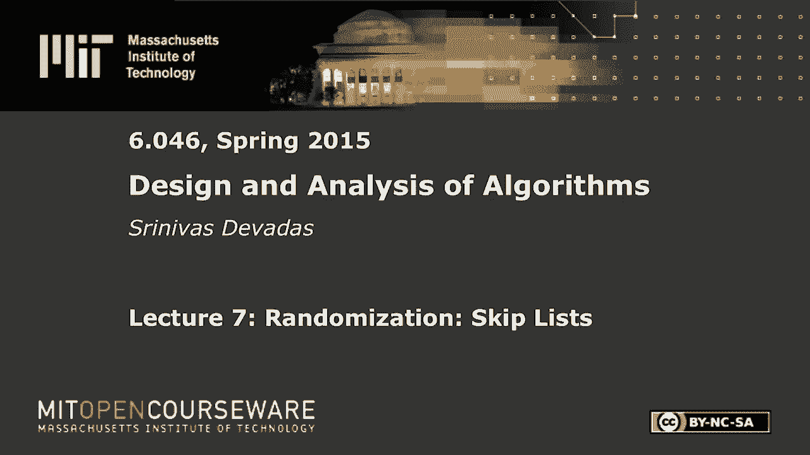
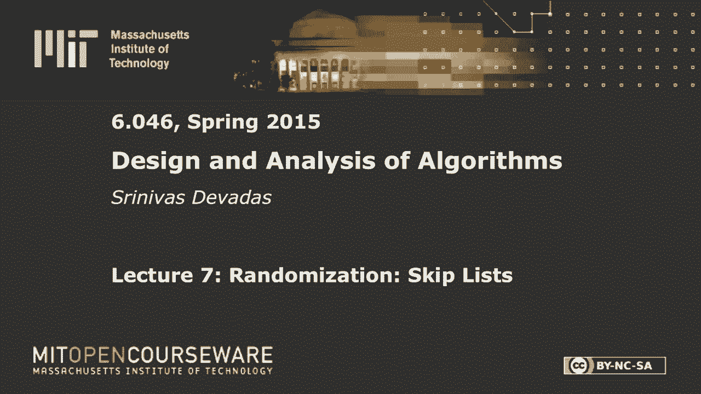

# 【双语字幕+资料下载】MIT 6.046J ｜ 数据结构与算法设计(2015·完整版) - P10：L7- 跳跃表 - ShowMeAI - BV1sf4y1H7vb

以下内容是根据知识共享许可提供的，您的支持将有助于麻省理工学院开放课件。

继续免费提供优质教育资源。

捐赠或查看麻省理工学院数百门课程中的额外材料。

所有的权利，早上好，每个人，让我们开始吧，今天的课程是关于一种叫做跳过列表的随机数据结构，这是一个数据结构，很明显，因为它是随机的，我们必须对，我们要把赌注提高一点，就我们的期望而言。

这种数据结构的双关语，从某种意义上说，我们不会喜欢仅仅做期望值分析，或者获取对跳过列表中搜索复杂度的期望，我们将引入这个概念，很有可能，这是一个比仅仅给你期望值更强的概念，或者对搜索算法复杂性的期望。

我们要证明，具有特殊的复杂性，你知道的，大概率，我们稍后会讲到大概率的部分，但我们将从一些很酷的数据结构设计开始，我想我对应于跳过列表，跳过列表是一个相对年轻的数据结构。

由一个叫比尔·普格的人在1989年发明的，所以不比你们大多少，它相对容易实现，如你所见，我真的想声称，但希望当你描述完结构时，你会被说服，尤其是与，我们可以在分析数据结构后进行比较。

关于搜索和插入的复杂性比较是什么，当您获取跳过列表并将其与avl树进行比较时，比如说，或者一棵红黑的树，等一般情况，当我们有一个数据结构，我们希望它是动态的，我让跳过列表维护了一个动态集。

这意味着你不仅想搜索它，很明显没什么意思，具有静态数据结构并进行搜索，你希望能够改变它，希望能够向其中插入值，需要担心插入的复杂性，你，希望能够删除值，数据结构的丰富性来自于操作，你可以在上面做的增强。

跳过列表也不例外，所以如果我们想保持一个由n个元素组成的动态集合，你显然知道有很多数据结构可以做到这一点，每一种都有不同的特点，这是如果您忽略哈希表，这是您第一个真正的随机数据结构，如果你只是把。

如果你只是拿六个，这个班的Double O6可能在其他班看到过随机结构，所以我们要试着按log n时间顺序来做，如你所知，用平衡的二叉树，你可以按顺序做事情，一大堆东西，几乎所有有趣的东西。

这是随机化的，这是一个相对容易的分析，表明预期，或者搜索的期望值是顺序log n预期时间，但我们要，正如我所说，提高赌注，我们会花很多时间，这的后半部分表明，以很高的概率结果。

这是一个比仅仅说搜索按预期顺序更有力的结果，登录时间好的，这就是上下文，你可以想到一个跳过列表，从一个简单的链表开始，所以我们有一个链表，那个链表，让我们先把这看作是，未排序。

所以假设我有一个未排序的链表，我想在这个链表中搜索一个特定的值，我们可以假设这是一个双链表，所以箭头是双向的，你有一个，你有一个指针，让我们只对第一个元素说，所以如果你有一个未排序的列表。

您想搜索一个元素，您希望进行会员查询，如果有n个元素，复杂度是n阶对，所以链表，搜索现在进行了N次，让我们继续说，我们正在对这个列表进行排序，所以这是一个排序的链表，所以你在这里的价值观。

十四二十三三四四二百五十九，它们按升序排序，您仍然只有一个指向列表前面的指针，这是一个双链表，在排序链表中搜索的复杂性是什么，log n，哦，我想听，因为它是，这是命令，log n是，是啊，是啊。

那是个诡计问题，对呀，我这么说是因为我喜欢这个答案，说登录的人得到了一个飞盘，这个人想承认，是你没事吧，就在那里，你去那里，你去好吧，log n意味着您可以随机访问，对，如果你有一个排序的数组。

你可以去一个I，你可以用a/i除以2或者a/2，您可以直接进入该元素，然后你可以做二分搜索，你可以得到一个log n正确，订单日志n，但在这里，排序实际上对搜索没有帮助。

因为你必须从头开始从列表的前面开始，你得继续走，它唯一能帮助你的地方是，如果你知道它是排序的，你在找三十七，你看到四二就可以停下来了，这几乎是它唯一能帮助你的地方，但它仍然是秩序N，因为这可能会发生。

平均来说，会发生在列表的一半，对于给定的成员资格查询权限，所以对于排序的链表，它仍然是n阶，但是现在让我们假设我们有两个排序的链接列表，这两者是如何联系在一起的，它们的结构是否以某种方式。

让我举一个典型的例子，为了一个跳过列表，我会继续回到，所以我不会抹去这个，但我会抽出一个，一个，两个，三个，四，五个，六，七，八，九，九大元素，好的还有，这是我的第一个排序列表，所以我有十四个二十三个。

六十六，七十二七十九，我现在要做的是另一个列表，在这个上面，我可以移动的地方，从上到下，等等，但我不会有，每个底部元素顶部的元素，按惯例，我将在第一个元素的上面有元素，不管我有多少名单。

我们现在只有两个，所以我看到了一个十四，它与顶部列表中重复的元素完全相同，对呀，这个列表也是排序的，但我不会，顶部列表中的所有元素，我只是在这里挑一对，我这里有3442个相邻的。

然后我一路走到七十二我复制了它，等等，好的，嗯，现在这看起来有点随机，有人认出这些数字吗，从伟大的纽约来的人，不，是的，是的，是啊，是啊，地铁停在第七大道快线右边，所以说，所以这正是跳过列表的概念。

事实上，你能站起来吗，所有的权利，所以这里的概念是你不必停很多站，如果你知道你必须走得很右，所以如果你想从第14街到第72街，你只要坐快车就行了，但是如果你想去六十六街，你会怎么做第二个，嗯。

这是一个办法，那是一种方法，那不是办法，我想要，我们要做的是，我们不会超调，对呀，所以如果我们想最小化距离，这么说吧，这是我们的第二件事，将最大限度地减少距离旅行对吗，所以你要弹出快线，一路走到四十二。

第四十二街，你会说，如果我去快线的下一站，我太过分了，所以你要跳到本地线路，所以你可以把它看作是一个链表l 0和链表l 1，你会弹下来，然后你要去六点到六点三，好的，所以搜索，四二一，然后从四二。

这么说吧，这不是一个，那是走四二对四二，l 1对l 0，然后零下42到66，这就是跳过列表的基本概念，所以你可以看到这真的很简单，我们现在要做的是做两件事，我想把这个双排序列表看作是一个数据结构。

在我进入跳过列表之前，我想分析一下，在某种程度上，最坏情况复杂性的最佳情况，我的意思是我想以最好的方式组织快车停靠站，对呀，这些车站是为乘客设计的，因为他们认为第二大道四号的豪华车站。

不管是什么高级商店，每个人都想去那里等等，等等，所以你有三个四个，非常接近四二，因为它们都是受欢迎的目的地，但假设你知道事情是，你知道的，我想更平等和随机，如果你愿意。

我想做的是我想构造这个双重排序的列表，所以我得到了搜索的最佳最坏情况复杂性，所以让我们这样做，在我这么做之前，让我写出搜索算法，这将是重要的，我想让你同化这个，把它记在脑子里，因为我们将分析搜索。

早上剩下的时间都在这里，所以我会把这个写下来，你知道什么，这是基于我刚才在这里所做的，以六十六为例，但值得写下来，我们将直接进入顶部链接列表，所以这只是为了两个链表，我们会在某个时候概括。

所以我们想在顶部的链表中行走，会走得太远，现在有七十二个答案，我有点不屑一顾，但没有理由，你不能超调一站，然后向右转，它只是一个不同的搜索算法，这不是我们要在这里分析的东西，在分析中发现。

因为很有可能比痛苦的分析更痛苦，我们要这么做，我们不去那里，好的，到底部列表，下面的列表我们称之为零，直到找到元素，或者不是，你知道如果你过度射击，所以如果你在这里找67，在这里，当你到了72岁时。

你已经看到了66岁，你在找六十七，搜索失败对，它停下来失败了，在这种情况下没有成功，所以这就是我们得到的，这就是我们要找的东西，这就是我们的曲调，链表，论点，我拥有的是，我正向前走，在这里的底部列表中。

我的顶部列表是l，所以我从L 1开始，所以去吧，我的搜索成本大约是，长度1的长度，这是现在最坏的情况分析，我可以一路走下去，在顶级名单上，有可能，但我将为给定的值，我要成为，底部列表的，我只想去。

我不会一直排在最后，我只会看其中的一部分，所以它是l0除以l1，如果我穿插了，我的快递以统一的方式停了下来，所以没有理由，如果我，如果我在底部列表中有一百个元素，然后，如果我有五个，只是为了争论。

前五名，然后我会把它们放在，比如说零位，二十、四十、六十等，所以我希望有大致相等的间距，但我们需要，我们需要把它变得更具体一点，更精确一点，我在这里想说的只是，这是顶部列表中的遍历成本。

这是底部列表中的遍历成本，因为我不会一直排在最后，我只去最后一张单子上的一部分，每个人都明白，是的，所有的权利，好，所以如果我想最小化这个成本，它会告诉我如何，顶部列表中的元素。

你知道怎么选择我的快车站，如果你愿意，我想，我想把这些东西均匀地撒开。你可以去区分，这样做，这是相当标准的，你最终得到的是你想要得到的，等于n对，所以所有的元素都在底部列表中，所以底部列表的基数是n。

满意了吗？这意味着l是n的平方根，所以你在这里所做的就是你说了一堆话，其实，您已经决定了有多少元素将在您的顶级列表中，如果底部列表中有n个元素，您希望顶部列表中有n个元素的平方根，不仅如此。

为了确保它正常工作，你没有，我得到一个最坏的情况成本不是最优的，你必须定期遍历n个元素的平方根，相对于顶部列表中的底部列表，好的，所以从图像上看，这意味着，不是你这里有什么，你说什么，你说什么。

你真正想要的是，假设它看起来是这样的，这里是这个部分，这里是n个元素的平方根，直到那个点，然后假设我们从这里到这里，n个元素的平方根，也许我这里会有一个六十六，因为那正是我想要的，我的n的平方根。

基本上是介于两者之间的三个元素，所以我这里有66个，等等，取决于我的意思，我选择n作为这里的一个特定值，但你拍对了，所以说，所以现在的搜索，大家可以看到，如果你把这些加起来，得到n的平方根。

n除以n的平方根，所以n的平方根也是，所以搜索成本，是n的序平方根，好的，就是这样，这是第一个概括，和，最重要的是，来自，从单个排序列表到跳过列表的近似值，好的，那么我们该怎么办。

如果你想让事情变得更好，所以如果你想让事情变得更好，我们现在对n的平方根满意吗，我们的目标日志是什么，显然是对的，嗯，我想你可能会争辩说，我们的目标可能是在某个时候订购一个，但是今天的讲座。

很有可能是log n阶，所有的权利，我们就到此为止吧，那么你是做什么的，如果你想，如果你想这样概括，你只需添加更多或更少，我是说，这似乎是我们在这里唯一能做的事情，所有的权利。

所以让我们继续添加第三个列表，对，如果你有两个排序列表，这意味着我有n的两个平方根，如果我想明确地说明搜索成本的常数，假设事情穿插得完全正确，好的，记住这一点，因为当我们随机化时，这种情况就会消失。

我们要掷硬币之类的，但到目前为止，事情是非常有条理的，你认为我们不会做这个分析，成本将是，如果我最好地穿插，搜索的费用是多少，当我有三个三个排序列表时，立方根，很好的猜测，谁说立方根，你已经有飞盘了。

送给朋友，我得把这些处理掉，所有的权利，所以它将是立方根，前面的常数是3，所以你有，对呀，所以让我们继续前进，你有k个排序列表，你会有k次，n ok的第k个根，这就是你得到的，我不打算费心画这个。

但本质上发生的是你做同样数量的动作，它对应于n的根，n在每一级的对应根，好的还有，我们要做的最后一件事，这里发生的是，我们有log n排序列表，所以这里的级别数是log n，所以这开始看起来有点眼熟。

因为它借用了其他数据结构，这是什么，我要用log n代替k，我得到了这个在一种可怕的外观，我第一次看到这个时很害怕，这是不对的，所以n的对数和根，好的，所以看起来有点吓人，但是n的log n次根是多少。

我们可以假设n是2的幂，没错，看起来没那么吓人，那是因为我不是数学家，这就是我害怕的原因，所以两个log n ok，所以那是，就是这样，我是说，所以你现在知道这是如何工作的了，对呀。

我们还没有讨论过随机结构，但是我已经给了你与跳过列表相关联的模板，它本质上说我要吃的是，如果是静态数据项，n是2的次方，那么本质上我想说的是，我会有一堆东西，底部的n项，我将在清单上有n个以上的项目。

就在上面，对呀，他们每个人都将交替，你会有一个项目在中间，然后在顶部，我会看到n在四个项目上，以此类推，对吧，那看起来像什么有点像一棵树，对呀，我是说它没有树的结构，在树的边缘的意义上，完全不一样。

因为你把事情联系起来了，所有的叶子都连接在这棵所谓的树的底部，用这个双链表，但它有这种，你知道树的三角形结构，这就是日志的来源，所以这一切都将是美妙的，如果这是一个静态集，如果你知道n不一定是2的次方。

你可以拍拍它等等，但最重要的是，我们还没有完全完成，我们想要的我们开始做，尽管我们似乎有这个log n搜索成本，但这都是基于静态集，这是不改变的，问题是，当然，你可以有删除，你想拿走四二，因为某种原因。

你不能去第四第二大道，或者我想你不能去Alewife，这将是一个更好的例子，所以你知道东西坏了，所以你把东西拿出来，你把东西插进去，假设我想插入61，六十二，六十三和六十四进入名单，我会发生什么，是啊。

是啊，你在摇头，我的意思是日志就会消失，所以它会它会，这将是一个问题，所以我们现在要做的是转移到概率域，我们必须考虑当我们插入元素时会发生什么，我们需要一个插入的算法，所以我们可以从一个空列表开始。

然后建立它，当您从空列表开始时，你有一个随机的插入算法，它不会看起来那么漂亮，看起来很随机，但你必须有一定的结构，所以你仍然可以拿到你的订单，对数n右，所以你必须适当地插入，所以这就是我们下一步要做的。

但是关于我在上面的复杂性的任何问题，所有的权利，好，我想要一个列表的规范示例，我在那里的空间有点用完了，所以请原谅我，当我画你的时候，跳过有更多级别的列表，而这其中的原因是一些，它只是有趣的，当你有。

你知道三个或更多的级别，搜索算法是一样的，你上去，当你超调的时候，你跳下一关，然后你一遍又一遍地做同样的事情，但我们是，我们是，我们将不得不绑定跳过列表中的级别数，以概率的方式。

我们必须实际发现预期的水平数，因为我们将以随机的方式进行插入，所以有一张更有趣的照片是值得的，然后是我上面的两个链表的图片，所以我想，我想，这节课剩下的时间我就把这个开着，这是我们的底部。

这与我们以前的例子没有改变，我不想麻烦你，当您看到在同一级别水平相邻的东西时的连接，假设，他们都有联系，全都是，所以我有，这里有四个层次，你可以把这看作是整个列表，或者只是为了描绘事物的一部分。

很好我们假设，这是最后一个元素，也一直在顶部，有点像终点站，与我们的类比相对应的两个终止符，所以这是我们的最高水平，然后我可能有50个在这个水平，这就是它的样子，我要五十个，所以这里的不变量。

这也是我想把这个画出来的另一个原因，如果你有一个最高级别的车站，那你就有了，它一定是坐在什么东西上，所以如果你在第四级或第三级给79分，如果这是l-0，那么你会在第二级看到79个，l 1和l 0。

如果你在这里看到50个，它不在L 3，所以没关系，但它是一个L二，所以它也必须在1，你当然知道一切都在零度，从i和i加一的关系来看这很有趣，其中i大于或等于1，好的，所以言下之意是，如果你在I上看到它。

然后它就走了，如果你看到我加一，等于i和i减去一，如果碰巧存在，等等，所以这里的最后一件事是完成它，我这里有三四，这是一个额外的东西，到此为止，所以最高级别是第二级或第一级，我是六十六，然后就这样了。

那是我们的那是我们的跳过列表，所以如果你想搜索72，你从这里开始，然后到七十九，或者你会看着说，哦，七十九太远了，所以我要跳下一个关卡，然后你会说50，哦很好，我可以到五十岁，七十九太远了。

所以我要跳下一个关卡，然后你到六十六，七十九太远了到了六十六你就下降了一级，然后你从66到72，和我们以前的一样，希望不会太复杂，这就是我们的跳过列表，它看起来还是很漂亮，它的结构和外观。

你知道很有规律，是的但如果我开始拿着它开始插入和删除东西，它可能会变得非常不规则，我是说我可以拿走两个三个，比如说，没有什么能阻止我带走三个，四到七十九，您必须删除一个元素，您必须删除一个元素，对呀。

我是说它有四个层次，你不应该有所作为，所以这是要记住的，所以这可能会变得很乱，所以让我们来谈谈插入，我花了很多时间四处闲逛，插入元素时到底会发生什么的问题，原来删除很容易，插入更有趣，让我们做插入。

将元素x插入跳过列表，我们要做的第一件事是搜索以找出x适合的位置，进入底部列表，以便您进行搜索，就像你在做搜索一样，你总是插入适当的位置，所以如果这是一个单一的排序列表，那就差不多了，对呀。

所以这部分很容易，如果你想插入67，你去搜索我刚刚检查过的所有操作，然后在66和72之间插入67，指针操作也是如此，你有什么，你很厉害，所有的权利，但你还没做完，因为您希望这是一个跳过列表。

你想让这个有，任何随机查询，随着名单的增长和顺序的缩小，log n期望，而且很有可能，所以你要做的是当你开始插入，你得决定，如果你要去所谓的，是否推广这些元素，这个插入的元素，一些级别，对呀。

所以如果你看看这是如何工作的，这真的很简单，将要发生的事情很简单，假设我有六十七，我要把它插在66到72之间，那是给定的，那是确定性的，然后我要掷硬币或旋转飞盘，对呀，我更喜欢这个，我不太确定。

这是否有偏见，它可能有严重的偏见，你知道，会不会，会不会，你知道，走另一条路是问题，会不会不会，所有的权利，所以我们这里有一个问题，我想我们可能得这么做，是啊，是啊，对呀，是啊，是啊，我在拖延。

我不想教剩下的材料，所有的权利，所有的权利，所有的权利，我们走吧，我们走吧，所以我想，我想插入，变成一些较少的，最大的问题是，你知道哪些，会很酷的，我去抛硬币，公平硬币，决定在多大程度上推广这些元素。

否则如果你得到一个尾巴，你停下来，下一个级别可能是新创建的，所以67可能会发生的情况是你把它放在这里，可能你第一次翻转，你得到一个尾巴，在这种情况下67会排在最后，但如果你得到一个头。

那么你不仅要在这里放67，你也要把67放在这里，你又要翻转了，好吧，如果你再得到一个人头，你要把67放在这里，好吧，如果你再得到一个人头，你要把67放在这里，如果你再得到一个人头。

你要在上面创建一个新的列表，此时，当您创建新列表时，上面只有六十七，好吧，这将是你清单的前面，好吧，因为这是你复制的一个元素，所以你要一直走，直到你现在得到一个尾巴，这就是为什么这枚硬币最好是公平的。

好的，所以你要继续下去，你要继续增加，每次你插入，有可能增加这个列表中的级别数量，现在水平的数量将在预期中受到限制，很有可能是一个有规律的期望，但我想说清楚，每次你插入，如果你得到一串人头。

你要增加等级好的，所以当你第一次得到一个尾巴，你只要停下来，你只需使用停止，所以你可以看到这会变得很乱，很快，是的尤其是如果你从归零地开始加上14到23，所有这些事情，底部会和现在一模一样。

因为你要把它放在那里，它是确定性的，但在那之后的下一层看起来相当混乱，你可以把它们都堆在这里，一个很大的缺口，等等，等等，所以这一切都是以搜索成本随机化的，最坏的情况下，这里的成本将是订单N好吧。

最坏的情况成本将是汽车租金，因为你不知道这些东西会在哪里结束，但随机成本是很酷的地方，好的，有什么关于插入的问题吗，当我说的任何话，是啊，是啊，去吧，最坏的情况真的命令，你们中的一个喜欢，有一个很长的。

就像很多幸福在彼此之上，你从上面开始，你一路走得那么好，你往下走，往这边走，你会你会检查，所以它的顺序是n，是啊，是啊，最坏的情况对吧，最坏的情况是无穷大，哦，从这个意义上说，是啊，是啊，好的。

如此如此之好，n个元素埃里克是对的，所以这里发生的是，你有一个很小的概率，你会一直翻头，所以在某种程度上，你知道如果你，如果你不知何故把它拿走，你用飞盘代替，或者你截断了，假设你知道，在某个时候。

你最终说你只有N个级别，总共是对的，但那是如此，它它不是一个，我应该去那里的，它是它是它是一个，这个问题必须贴得更准确一点，因为答案是n阶，你必须有更多的限制来避免埃里克刚才提到的情况，处于随机状态的。

你就有可能得到无限多的头，好的，是啊，是啊，刚才的问题，到是，你当然可以做封顶，你可以做很多其他的事情，它最终变成了不像你这里这样干净的东西，分析很混乱，它介于随机数据结构之间。

纯随机数据结构和确定性数据结构，所以我认为重要的是，最坏的情况比自动记录要糟糕得多，好吧，酷，好，谢谢你的问题，所以我们现在有一个插入算法，这可能会让事情看起来很乱，我要把插入物留在这里。

这当然是其中的一部分，现在，让我们在剩下的时间里谈谈，我们要谈谈为什么，跳蚤是好的，我们将证明这种随机数据结构是合理的，并显示出许多很好的结果，关于对级别数的期望，对搜索中移动次数的期望。

不管你在插入和删除什么项，最后一件事，我不得不删除一个项目，你就把它删了，你找到了，所以你不能把它留在任何一个关卡里，所以你找到了，你必须正确地设置指针，你知道吗，将上一个指针移到下一个指针，等等。

等等，如果我们想在这里讨论这个问题，但你必须在每一个级别上进行删除，是啊，是啊，问题是如果你喜欢插入会发生什么，所以这就像第一个元素不会一直上升，所以通常发生的是，你需要在这里有一个负无穷大。

这是一个很好的观点，这是件棘手的案子，你必须有一个负无穷大，一直上升，好问题，所以问题是如果我有低于14的东西会发生什么，我插得很好，那是不会发生的，因为没有什么小于负无穷大，一直往上走。

但谢谢你提出来，所以我们要做一点热身，热身外稃，我不知道你是否听过把这两个词放在一起，就像这个热身和引理，但你去那里，你的第一个热身引理，我想你从来没有热身定理，对呀，这是这个定理的热身引理。

这需要一段时间来证明这一点，这个下来，到试图了解你将有多少个级别，从概率的角度来看，n个元素中的级数，我现在要用很高的概率来定义这个术语，好吧那这到底是什么意思，这意味着。

auto log n类似于c log n加上一个常数，让我们忽略常数，让我们坚持c log n，是n和α的函数你有这个多项式反比关系，从某种意义上说，as n在这里增长，alpha是。

我们假设alpha大于1，你会得到这个数量的减少，所以随着n的增长，这将越来越接近于1，所以这就是大概率和，只是给你一个期望数，如果你没有这样的保证，有趣的是，随着n的增长，你会得到越来越高的概率。

这个常数c将与alpha有关，这是另一件有趣的事情，所以这就像是在说，你可以这样说，用切尔诺夫债券，我们几分钟后就会讨论，即使是为了一个期望，但这说明，如果例如，c增加一倍，级别数是log n的顺序。

我是说我明白这没有太多意义，但它小于或等于4 log n加一个常数，这四个会反映在这里的alpha中，对于，当你走的时候，当四个从四个到八个，阿尔法增加，所以相对于这个常数，你有越多的空间，概率越高。

它成为压倒性的可能性，你将在这些级别的数量内，对呀，所以也许有一个，你知道80%的概率你在两个log n以内，但是有一个九十九点，九九九九，你在4 log n以内的概率是9%，以此类推，等等。

这就是高概率分析明确告诉你的事情，好的，所以你可以做到这一点，你可以做这个分析，让我在另一个板子上做这个，让我在这里做，其实我根本不需要这个，所以让我们在这里做，所以这是我们第一次用高概率分析。

我想证明热身引理，所以通常你在这里做的是你看失败的概率，所以很有可能是看起来像一减一的东西，除以n升到alpha，这部分是故障概率，这就是你通常分析的，我们今天要做的是。

所以故障概率不小于c log n水平，是我们刚才看到的补充，也就是它严格大于c log n水平的概率，好的，大于c log n倍，那么为什么你会有超过C log n的水平，本质上是因为你插入了一些东西。

那个元素的提升严格大于c log n次，这显然意味着你有这样的头部序列，我们一会儿就会讨论这个问题，但在我们进入弄清楚这里到底发生了什么之前，至于为什么这个会被推广，我这里有的是，我有一系列的插入。

我必须分析的潜在问题，一般来说，我有一个n个元素列表，我将假设这些元素中的每一个都被插入到列表中，在某个时候，所以我有N个插入物，我们看看有n个插入物的情况，你可以删除，所以你可以，你知道更多的插入。

但这不会真正改变什么，您有n个插入对应于这些元素中的每一个，在这个失败案例中，这n个元素中的一个被提升了超过c log n次，好的，这就是这里发生的事情，所以你不知道是哪一个，你通常可以这样做。

并进行大概率分析，因为概率很小，而且是反多项式，或者多项式上的一个，比如n升到alpha，你可以用所谓的工会炸弹，我相信你以前在某些情况下使用过，你基本上说这小于，或者等于特定元素x。

所以你只需选择一个元素或任意元素x，但你挑了一个就升职了，大于c log n倍，你有很小的概率，你不知道这些事件是否独立，工会对此并不关心，这就像说你得了零点零一。

这些元素中的任何一个被提升的概率大于c log n倍，其中有十个元素，你不知道它们是否是独立的事件，但你当然可以使用工会约束，说，总的失败概率将小于或等于n等于十，在我的例子中，你知道的次数，零点零一。

基本上就是这样，现在，你可以走开说，一个元素得到提升意味着什么，一个元素要得到提升，实际上必须发生什么，你有N乘以1比2，因为你在抛硬币，你得到了一个C log n，一个头零，所以你开始，你翻转。

你知道一个，你来自的水平，你达到的水平，所以你会有一个更多的水平，如果你计算级别，这只是简单地对应于拿这一半，并将其提升为c log n，因为这基本上是，的，你得到了n，半c，log，n，它变成了什么。

什么是，n乘以半c log n等于多少，1/2升到log n会给你，2，log，n，s是对的，所以你把n除以，升到c，也就是1除以n升到c，减去1等于1上升1除以n上升到α，其中alpha是c-1右。

这就是我们的第一个大概率分析，对呀，不要太用力，我所做的已经做了，正是我刚才告诉你的，高概率的概念是，你有一个相关的逆多项式的失败概率，那个多项式的一次，α和c有关，这就是我所知道的，用c等于。

我有什么，α等于c减去1，或者c等于α加1，好吧，所以我在这里所做的已经完成了，一个很有可能告诉你，我要给我的插入算法多少级，好的，这是我们想展示的第一部分，这只是告诉我们这个跳过列表将垂直增长多大。

它没有告诉我们任何关于内部列表结构的信息，随机化是否会导致这种美丽的结构，你在这里看到的完全搞砸了，到了我们没有自动登录n搜索复杂性的地步，因为我们花了太多时间，让我们说。

在底部列表或底部列表上方的列表中，等等，所以我们需要了解这是如何，此结构对应于跳过列表，它是否会看起来有点统一，我们必须把它分类，我们要描述它的唯一方法是通过分析搜索，计算搜索的移动次数。

它比你在上面看到的更复杂的原因，在你所看到的搜索中，你将在不同的层次上移动，你将在顶层移动，也许相对较少的动作，你会弹出一个动作，在那个水平上的几个动作，弹出等等，等等。

所以在搜索中有很多事情发生在不同的层面上，总成本必须是所有动作都正确，所以如果你要考虑所有的动作，向下移动，把它们加起来，它们都必须是log n阶，概率很高，这是无法回避的，因为每一个都要花你这么多钱。

所以这是我们接下来要做的事情，二十分钟后，我们想为搜索证明的定理，这就是我刚才说的，任何搜索，订单日志n w马力，所以这个少跳的看起来怎么样并不重要，有n个元素，它们是用插入算法插入的。

知道这一点很重要，如果你要用它，当我搜索一个元素时，它可能在里面，它可能不在里面，这并不重要，我们假设一次成功的搜索会让我付出代价，以很高的概率订购log n，这里的酷想法，在分析搜索方面。

为了弄清楚我们如何把所有这些动作加起来，我们将反向分析搜索，对呀，所以这是个很酷的主意，那么这到底是什么意思呢，这意味着我们要考虑这个B搜索，我想起来了，当向后搜索开始时，它实际上结束了。

这就是我在括号里写的，在底部列表中的节点，所以如果我们像我之前提到的那样假设搜索成功，否则重点就在两个成员之间，你知道它不在那里，因为你在找67，左边是六十六右边是六十二，好吧，不管哪种方式都有效。

但请记住，这是一次成功的搜索，因为它只是让事情变得更容易一点，现在在我们访问的每个节点，我们要做的是，你会说如果节点没有提升，那么这里实际发生的是，当你插入那个特定的元素时，你有尾巴。

因为否则你就会得到一个头，那个元素会被提升得更高，你去，这真的意味着你来自左手边，所以你向左移动，现在搜索，当然是下棋和右棋，但这是一个向后搜索，所以它会向左移动和向上移动，我这里还有什么没有空间了。

继续吧，然后另一种情况是如果一个节点，节点被提升了，较高，这意味着我们在这个特定的插入中得到了头部，然后呢，我们去，这意味着在搜索过程中我们来了，这意味着我们开始，当我们到达，顶层或负无穷大。

如果我们一路往回走，所以这里写了很多东西，但这应该会让事情变得清楚，假设我们在寻找六十六，好的，我想我想追溯倒退的道路会是什么样子，并记住代码，因为我做得对，所以我在找六十六，很明显我们知道怎么找到它。

我们已经做过了，但让我们倒退，当我们寻找六十六的时候到底发生了什么，当我们寻找六十六，就在这一点上，当你看到六十六，你会从哪里来从上面来，好吧，如果你去看看这里发生了什么，插入时的节点。

它被提升了一个级别，对呀，所以这意味着你会从上面往上走，先在向后搜索中，你的第一个动作会像现在这样上升，如果上面有一个六十六，你会再上一个，但没有，所以你向左走，好的，你去，你到五十岁。

当你看到当你有一个50在这里，你会保持在这个水平吗，你会上升到50，因为你一有机会，你想达到更高的水平，就这样，这五十岁的人一次又一次地被提升了，所以你上去，你到十四岁，差不多就这样结束了。

所以这看起来像你这样走，你有一个向上的移动，然后你有一个左移，不同的颜色，在这里就好了，然后你有一个向上的移动，然后左边，然后一个向上，所以这就是我们的，那是我们的反向搜索，也没那么复杂。

希望如果你在找66或59，你知道你这样做，所以自然多了，你只需要把它翻过来，为什么我做得这么好，我做这一切的原因，我必须做一些动作的边界，我知道与向上移动相对应的移动是概率的，从某种意义上说。

我做它们的原因是因为我在某个时候翻转了头，好的，所以所有这些都将变成计数，掷出多少个硬币，一长串硬币中的头像向右翻转，所以这就是反向搜索将允许我们做正确的事情，关键的是我们接下来要看什么。

所以分析本身就有点痛苦，但是有一堆代数，但我想做的是确保你得到高水平的，第一张照片和关于为什么，的，为什么期望值或大概率值是log n阶，但关键是策略，所以我们要去验证这个定理，我们的反向搜索。

和鼠标左键，概率是一半，原因是当你上升的时候，因为你有一个头，如果你没有得到一个正面，你得到了一个反面，这意味着您向左，因为前面的元素，每次你经过，这些元素是通过掷硬币插入的，所以这是一个关键点。

第一名，所有这些，如果你看看这里发生的事情，当我把这个画出来的时候，这里有正面，那里有反面，所以这些事情中的每一个都在发生，概率是一半，这里都是掷硬币，现在，移动的次数在上升，小于级别数。

级别数比那个多一个，我们已经证明了这是c，log，n的概率很高，就在热身引理旁边，这就是它刚才所做的，向上移动的次数，我是说你不能从名单上消失，这个列表现在是，你不再插入，你在搜查。

所以你不会增加等级或类似的东西，所以我们处理的向上移动的数量，所以这里的最后一件事，我要在这里写出来，是关键的观察，这将使整个分析成为可能，所以它说的最后一件事，移动次数，所以现在。

移动的总数显然必须包括向上移动和向左移动，没有其他种类，c登录n向上移动，那么这意味着什么呢，我得到了他们每个人的头尾序列，每次我得到人头的概率是一半，我升了一级。

事实是我不能得到超过C log n的头，因为我的水平快用完了，就这样，我要用完垂直的空间了，如果我不断出现，不断做向上的动作，所以在那一点上，我被迫向左走，就像我在中间向左，即使我还有机会上去。

这相当于得到一个尾巴，而不是头，但我可以从概率的角度来限制移动的总数，在抛硬币的过程中，我只有一定数量的人头，我可能会得到，因为如果我有更多的头，我会在上面，你知道我会被排除在跳过名单之外。

那是行不通的，所以移动的总数是移动的数量，直到你得到，c登录n向上移动，基本上相当于现在，暂时忘掉跳过列表，我们的说法是移动的总次数就是掷硬币的次数，所以这些都是一样的，因为每一个动作都对应于掷硬币。

直到它是一个公平的硬币概率，一二直到c log n头，已获得，所以硬币的数量翻转到C，log n头是这等于那的移动总数，如果你相信，我们不想展示的是，希望你能做到，因为争论只是你用完了这个级别。

这就是为什么它是一个索赔，对呀，所以观察是当你抛一枚公平的硬币时抛硬币的次数，直到你得到C log n头会给你搜索中的移动次数，搜索中的移动总数，它包括向上的动作和向左的动作，现在我们要展示的是。

这将是自动登录n，大概率，好的，一旦你这样做了，你做了两件事，您已经限定了跳过列表中的级别数，大概率为序log n，你说过搜索中的移动数是顺序log n，大概率，假设水平数是c，log，n，显然是对的。

所以不是说这两个，并不是下面的包住了上面的，这是最后一件要记住的事情，当我们把所有这些东西都拿开的时候，这假设存在小于或等于c log n的级别，对呀，这就是为什么我能提出我没有水平的论点的唯一原因。

所以如果我在这里有这个事件a，如果我把这个事件称为a，而我有这个事件b，我真正想要的是，我已经向你展示了事件A发生的可能性很高，这是热身引理，我需要向你展示事件B发生的概率很高。

然后我必须向你们展示事件A和事件B发生的概率很高，因为我两者都需要对吧，有什么问题吗？我们在这里停一分钟，其余的分析，一堆代数，我们会挺过去的，你可以看看笔记，这是这是关键点，如果你有这个，你得到了它。

你这么说是因为制造apu而不是a的概率，预期的左移动数应等于，所以争论是既然你有一半你可以，你只是说，预期的左移动数将与，与向上移动相同，你可以就期望进行争论，你可以说在任何层面上，你要走的左步数。

预期会是两个，对呀，它不会给你你的大概率证明，它不会把它与除以n升到alpha的那个联系起来，但我要告诉你，如果你只是想表现出期望，用于搜索的是订单日志n，你不必跑完所有这些，跳过所有这些箍。

在某种程度上，你会做出我在这里明确表示的假设，通过我的观察，当你做那个期望的时候，所以如果你真的想为搜索复杂度的期望值写一个精确的证明，你必须做我在这里做的很多事情，对呀，我是说，这是这是一个。

我不是说，你已经挥手了，你没有，但是，但是，但是，它需要更多的你知道比你刚才说的，所以这几乎是分析正确的，你知道吗，用大概率分析，我们把垂直的，我们限制了移动的次数，假设垂直是有界的。

我们得到了移动次数的结果，所以这两种情况都很有可能发生，你得到了你的结果，这是一个定理，我们在某个地方，哇喔，我把定理抹去了吗，所有权利，好，所以让我们尽我们所能展示这个定理，嗯，有一个。

你有几种方法可以证明这一点，有一个，有一种方法你可以，你可以用，这是一个很酷的结果，我认为值得知道，我不知道你有没有看过这个，但这是切尔诺夫的一个开创性定理，也就是说如果你有一个随机变量，总人数，尾巴。

让我们说，它也可能是一个系列中的头，有P向上的概率，嗯那么，对于所有大于零的r，我们得到了这个漂亮的结果，它说y是随机变量的概率，特定的，实例，或者当您评估它时，它比预期的要大，by r是右有界的。

所以只是一个美丽的结果，这里有一个随机变量，对应于抛硬币，我要把这个翻转很多次，我知道人们的期望是什么，如果它是一个公平的硬币的一半，然后我会让M超过两个，预期的头数将是m大于2，预期尾数将是m大于2。

如果是p，显然p乘以m会有一点不同，但我这里有什么，如果你告诉我概率是多少，我离期望只有十步之遥，这意味着r是十，然后以e为界，升到-2乘以10平方除以m，这就是切诺夫的切诺夫债券。

你可以看到这与我们的高概率分析有什么关系，因为我们的大概率分析正是这样，这是你可以用来做高概率分析的锤子，因为这告诉你当你离平均值越来越远时，或者你离期望越来越远，你离得这么远的可能性有多大，在一个。

你知道，在一百个公平的硬币投掷中，你得到五十个头，这是一个相当大的数字，因为期望值对应于，我有五十个，所以r是零右，所以这只是说这是一种井，它没有告诉你太多，因为这表明它小于或等于一个权利。

上面就写了这么多，但如果你有七十五对，你得到75个头的概率是多少，当你抛一百次硬币，一个公平的硬币Y的e是50，r是二五，你就会离开，你可以做那个地图，所以这是一段美好的关系，告诉你什么。

概率是如何变化的，当你的随机变量值离预期越来越远，你可以想象这将非常有用地展示，显示我们的大概率结果，和，我想我有时间只是给你，对这个结果是如何产生的感觉，我不打算做代数，我认为不值得。

把这些都写在黑板上，当你可以的时候，你可以在笔记里读到，但底线是，我们要给这个小引理，有调用这个切尔诺夫绑定，有一个常数d，这样很有可能，d登录n右，所以我在这里有一个新的常数。

D log n硬币或一枚公平硬币，d log n次，假设独立性至少是c log n所以，这上面写的是什么？很多话，对呀，它只是说嘿，你想要，这里绑定的订单日志n，最终。

log n阶的美妙之处在于它有一个常数，你控制的常数是d，好的，所以你告诉我c log n是50，所以c log n等于50，那么我要做的是，我要说的是，如果我抛一千次硬币，好的，那我就很有可能。

我要去找五十个人头，对呀，就是这样，定理是这么说的，这个引理说，抱歉，打扰一下，上面写着，告诉我c log n是什么，给我那个值，我会给你找一个这样的D，通过调用切尔诺夫，我将告诉你一个压倒性的可能性。

你至少会得到C log n头，好的，所以每个人都买从你在上面看到的来看这是有道理的，所以这本质上可以显示，原来你要做的是，你不必选八个，但是你可以选择d等于h c，好的，只要选择d等于hc。

你会看到与什么相对应的节点中的代数，这些值都是y的e，只是想告诉你我会超过两岁，你在抛硬币，概率为二分之一的公平硬币，所以你有，你答对了2分，然后我要告诉你的最后一件事是，你想要什么，在调用方面。

您想要r，记住如果我们在这里说的是尾巴，所以r是d，log，n减去c，log，n，right，所以你只要调用Chernoff，y的e等于m除以2，你在这里说的是你想要C log n头，你想确保你得到。

你想确保你得到c log n头，这意味着尾巴的数量将是d log n，-c log n，通常我们分析故障概率，所以这是一个很小的数字，所以失败是当你得到的头少于c log n时。

所以失败是当你得到的头少于c log n时，这意味着你得到了一个大于d log n的，负c log n尾，当你抛硬币的时候，小于c log n头，意味着你至少得到d log n减去c log n尾。

这就是为什么这是你的R，然后当你的R变得那么大时，你可以玩d和c选择d等于hc，你能意识到这将是一个微小的可能性，而且更好，你可以再把它变成一个多项式，一点点代数，但你可以在这里显示这个结果。

也就是说掷硬币的次数直到c log n，磁头大概率为序log n，通过适当地选择常数d为c上的某个时间数，所以我会让你做那个代数，但还有最后一件事我们还没做完，所以你以为你完蛋了，但我们还没有完全结束。

为什么，为什么我们还没有完全做完，价值五个飞盘的快速问题，为什么我们还没有完全结束，我说了什么，我做对了事件a和事件b，我还没做呢，最后一件事我还没做呢，也就是表明，这是很有可能发生的。

我需要证明事件A和事件B的概率，发生了，或者这是很有可能的，或者我应该说事件a和事件b发生了，大概率，好的，你可以看到这很简单，但你有，你明白它的要旨了吗。

