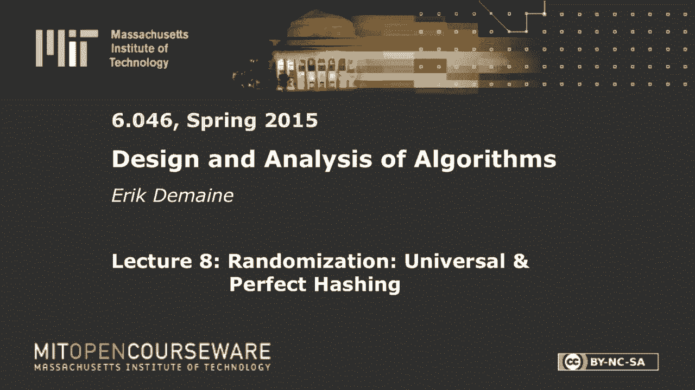

# 【双语字幕+资料下载】MIT 6.046J ｜ 数据结构与算法设计(2015·完整版) - P11：L8- 通用和完美哈希 - ShowMeAI - BV1sf4y1H7vb

以下内容是根据知识共享许可提供的，您的支持将帮助麻省理工学院开放课件。

继续免费提供优质教育资源。

捐赠或查看麻省理工学院数百门课程中的额外材料。

所有的权利，让我们开始吧，今天我们将继续随机化和数据结构的主题，上次我们看到跳过列表，跳过列表，您可以搜索一个项目，如果它不在那里，你很有可能在log n中的两边得到最近的项。

但我们已经知道如何确定地做到这一点，今天我们要解决一个稍微不同的问题，哈希表的字典问题，一些你已经认为你知道的事情，但我们要让你看看你有多不知道，但过了今天你就会知道，我们将得到恒定的时间。

不是很有可能那很难，但我们会做恒定的预期时间，所以从某种意义上说，这更好，它将解决一个较弱的问题，但是我们将得到一个更紧的束缚常数，而不是对数常数，所以对于初学者来说，让我提醒你我们在解决什么问题。

以及哈希的基本知识，你在六点学到的，我要给这个问题起个名字，因为这很重要，我们经常忘记区分两种类型的东西，这是一个古老的术语，但我称之为抽象数据类型，这只是你要做的事情的问题说明。

你可以称之为接口什么的，这是一个与数据结构相对应的问题语句，你实际上是如何解决它的，哈希表是数据结构，字典是问题所在，或抽象数据类型，所以我们今天要做的是，就像在大多数数据结构中一样，维护一组动态的项。

在这里我要区分物品和它们的钥匙，每个物品都有一把钥匙，通常你会想到还有一个值，就像蟒蛇一样，但我们只是担心钥匙和移动物品，我们想支持三个行动，我们希望能够插入一个项目，删除项目，并搜索项。

但是搜索将不同于我们从avl树或跳过列表中了解到的，我们只是想知道，对不起，您不是在搜索一个项目，通常你只是在寻找一把钥匙，这里，你只是想知道，有那个钥匙的东西吗？把它还回去，这通常被称为精确搜索。

因为如果钥匙不在里面，你什么都学不到，你没有，你找不到最近的钥匙，不管出于什么原因，这被称为字典问题，它不象真正的字典，通常当你搜索一个词时，你确实在这里找到了它的邻居，我们要么，如果钥匙在那里。

我们发现该项目不是，这正是Python词典实现的，所以我想这就是为什么Python词典被称为dicts的原因，所以今天我要假设所有的物品都有不同的钥匙，所以在插入中，我假设键不在表中，只要一点点工作。

您可以允许使用现有键插入项，您只需覆盖现有项，但我不想担心这个，这里，对呀，这样我们就可以，当然啦，在log n时间内使用AVL树解决这个问题，但我们的目标是做得更好，因为这是一个更容易的问题，和。

我要提醒你，你学会做这件事的最简单的方法，它是用链子散列的，在双O六，关键是，你在双六没有真正分析过这个，所以我们要取常数，每次操作时间，这将是意料之中的，记住我们关心的变量。

有u n和m所以u是宇宙的大小，这是所有可能的钥匙，所有可能键的空间，n是当前存储的集合的大小，这是数据结构中当前的项或键的数量，然后m是桌子的大小，假设是桌子上的槽数，所以你记得那张照片。

你有一桌插槽，从0到m减1，它们中的每一个都是指向链表的指针，如果你有，假设这里是你所有可能的钥匙的宇宙，然后我们有一个哈希函数，插进这些槽中的一个，然后这里的链表是，存储哈希到该插槽的所有项。

所以我们有一个哈希函数来映射宇宙，我假设宇宙已经被映射成整数，零到u减去一，它映射到插槽，好的，当我们用链子进行散列时，我想我上周提到过你得到的界限，我们实现了，其中alpha是负载系数，n除以m。

您希望散列到一个槽中的项目的平均数量，是项目数除以一些插槽，你在六双O六中证明了这一点，但你假设了一种叫做简单的统一哈希的东西，简单的均匀散列是一个假设，我觉得，为暴击而发明的使分析变得非常简单。

但基本上也是作弊，所以今天我们的目标是不作弊，作为热身很好，但我们不喜欢作弊，所以你可能还记得，假设是关于哈希函数，你想要一个好的哈希函数，我想要两个不同的钥匙映射到同一个插槽的概率，1/m有m个插槽。

如果一切都是完全随机的，如果h基本上为每个键选择一个随机数，那么这就是我们期望发生的事情，所以这就像是理想化的场景，现在我们不能有哈希函数，选择凉棚，每个键的随机数，因为它必须选择相同的值。

如果你给它同样的钥匙，所以它必须是某种确定性的策略，或者至少是可重复的策略，如果你插入相同的键，你得到同样的东西，所以这个假设实际上是说，你给出的钥匙，在某种意义上是随机的，如果我给你随机的钥匙。

我没有太疯狂的哈希函数，那么这将是真的，但我不喜欢假设任何关于钥匙的事情，也许我希望我的钥匙是最坏的情况，也许，在现实世界中有很多例子，你应用一些哈希函数，原来你的数据有一些非常特殊的结构。

如果你选择了一个糟糕的哈希函数，然后你的哈希表变得非常非常慢，也许所有的东西都散列到同一个槽，或，你知道吗，说你拿，是啊，是啊，有很多我们想避免的例子，今天之后，你就会知道如何实现恒定的预期时间。

不管你的钥匙是什么最坏情况下的钥匙，好的，但要做到这一点需要一些工作，所以这个假设需要，假设键是随机的，这就是我们所说的平均案例分析，你可能认为对于随机算法来说，平均案例分析是必要的，但那不是真的。

我们上周在快速排序中看到了这一点，快速排序，如果你说我总是从一个中选择一个作为我的分区元素，这就是教科书上所说的基本快速排序，那么对于一个平均的输入来说，它会做得很好，如果项目有统一的随机排列。

并且使用始终选择第一项作为分区的方法进行排序，那么平均就是n，log，n，如果你的数据是平均的，但我们发现我们可以通过选择一个随机的支点来避免这个假设，如果选择随机枢轴。

那么您就不需要对输入进行任何假设，你只需要假设枢轴是随机的，所以假设你的输入是随机的和假设你的输入是随机的有很大的区别，而不是假设你的硬币投掷是随机的，假设你可以抛硬币是很合理的，如果你的拇指足够灵巧。

那你就可以做了，但假设你的输入是随机的就不合理了，所以我们希望尽可能避免一般的案例分析，这就是今天的目标，所以你在双六中看到的基本上是假设输入是随机的，我们今天要摆脱那个不合理的假设，从某种意义上说。

这是双O六的复习，我要稍作停顿，告诉你哈希这个词的词源，如果你好奇的话，哈希是一个英语单词，所以它很旧了，意思是切成小块，它通常用于烹饪意义上，就像这些天你用玉米，牛肉，哈希什么的，这里的定义，好的。

你在英语中知道它是从斧头这个词开始的，所以它是相同的推导，它来自古法语，我真的不知道那是哈希还是哈希，但是，好的，所以你可以看到推导，如果你在牛津英语词典里查这个，或者选择你最喜欢的字典，甚至谷歌。

这就是你发现的，但事实上有一种新的流行理论认为，事实上，哈希来自另一种语言，也就是火神，我的意思是你可以看到这个导数实际上是x，所以也许法国人是从瓦肯人那里得到的，反之亦然，但我想我想这很清楚。

长命百岁，繁荣昌盛，告别斯波克，上周的不幸消息，好了，散列已经够多了，我们一会儿再来讨论这个问题，但是哈希函数本质上采用了这种想法，即把你的键，把它切成块混合在一起，就像在好菜里一样好吧。

所以我们要介绍两种变强的方法，恒定时间界限，可能最有用的一个叫做通用哈希，我们会花大部分时间在那上面，但理论上更酷的一个被称为完美哈希，通用哈希，我们将保证在预期中很少有冲突，完美散列。

我们将保证捕获物没有冲突，至少以其明显的形式，它只适用于静态集，如果你是如果你禁止，插入和删除，只想做搜索，那么完美哈希是一个很好的方法，就像如果你真的在储存一本字典，就像牛津英语词典一样。

变化不会那么快，因此您可以重新计算数据结构，当你发布新版本的时候好的，但让我们从通用哈希开始，这是一个很好的强大的技术，它适用于动态数据，插入，删除和搜索将是恒定的预期时间，对输入没有假设。

所以不会是一般的情况，从某种意义上说，这是最坏的情况，但随机的，所以我们需要做一些随机的事情，如果你只是说好，我一劳永逸地选择一个哈希函数，我用它来做我的桌子，好的，也许我的桌子是原来的两倍大。

我改变哈希函数，但没有随机性，我们需要以某种方式在这个数据结构中引入随机性，我们要做的是，我们如何选择哈希函数，我们要选择我们的哈希函数，从一组哈希函数中调用它大写h，这将是一个通用哈希家族。

我们将想象有许多可能的哈希函数，我们可以选择，如果我们随机均匀地选择其中一个，那是随机的选择，这种随机性就足够了，我们不再需要假设任何关于钥匙的事情，所以说，为了让它起作用。

我们需要一些关于大写H的假设，你知道吗，也许它只是一组哈希函数，那不会增加太多的随机性，两个也不会增加太多的随机性，我们需要很多，所以我们要求h有这个性质，我们将称之为财产，普遍性。

通常你称之为通用哈希族，只是一组哈希函数，我们想要的是，所以我们选择哈希函数小h和大h，在这些选择中，我们希望两个键哈希到相同值的概率很小，我会说，这与环球非常相似，对不起。

简单的制服散列在这里看起来几乎一样，除了我从k1和k2换成了k和k质数，但同样的事情，但我们要考虑的是概率，我们假设的随机在这里是不同的，我们假设k 1和k 2是随机的，因为H是固定的。

这是一个关于这里输入的假设，我们在想k和k素数是固定的，这必须适用于每一对不同的钥匙，我们考虑的概率是h的分布，所以我们尝试了所有不同的H，或者我们试着让他们随机地均匀地尝试小h。

我们想要一个随机的h使k和k成为素数的概率，最多碰撞一次，1/m，另一个区别是我们从等于切换到最多，不会，我是说越少越好，有办法让几双少一点，但这并不重要，但当然小于或等于m的任何东西都一样好。

所以这是一个关于资本的假设，我们将看到如何在一点点中实现这个假设，让我先向你证明这已经足够了，这将与双O六分析基本相同，但值得重复，就这样，1。我们相信一切都会好的，所以我可以更准确地描述我们的假设。

这个定理和双六定理的关键区别在于我们假设，我们不能对钥匙做任何假设，他们是武断的，你可以选择他们，你想怎么做就怎么做，但我选择了一个随机哈希函数，哈希函数不能依赖于这些键，但这将是随机的。

在你选择键之后，我选择哈希函数，那很重要，所以我们要随机选择一个小h和大h，我们假设大H是普遍的，然后插槽中的预期键数，在那N把钥匙中，最多是一个加阿尔法，α等于n/m，所以这正是我们所经历的。

这里我们说的是时间限制，但时间的限制随之而来，因为每个链的长度预计是1加alpha，在这里，期望结束了，H的选择不假设任何关于钥匙的事情，所以让我们证明这个定理，这很容易，但我将介绍一些分析技术。

我们将用于更有趣的事情，所以让我们给钥匙起个名字，偷懒就是偷懒，好的还有，我只想计算一下这个期望，所以我想计算，假设与其中一个键碰撞的键的数量，让我们说，所以这当然是我碰巧去的槽的大小。

这对我所有人都有效，所以如果我可以说，对于每个i，这最多是1/alpha，然后我有了我的定理，好的，只是另一种谈论它的方式，现在与k i碰撞的键的数量，这里有一个一般的技巧，如果你想在期待中计算某件事。

一个非常有用的工具是指示器，随机变量，让我们说出所有我们想要计算的不同事件的名字，然后我们基本上把这些变量加起来，所以我要说，我将用大写i ij作为一个指标随机变量，它将是一或零一，如果。

KJ的哈希函数，所以K之间有碰撞，i、kj和零，如果它们散列到不同的插槽，这是一个随机变量，因为它依赖于h，而h是随机的，k i和kj不是随机的，它们是给你的。

然后我想知道他什么时候把这两把钥匙映射到同一个插槽上，所以这个数就是所有j的和，这是一回事，这里的数字是j不等于i的和，因为每次碰撞都得到1，否则，这就计算了有多少碰撞，一旦我们有了它，在这个符号中。

我们可以用所有伟大的引理和定理，在这种情况下，E期望，我应该在这里用什么，什么是好的，我怎样才能简化这个公式呢？期望线性，谢谢。如果你不知道所有这些事情，阅读课本中的概率附录。

所以我们想谈谈对最简单事情的期望，所以线性，让我们把e放在和里面而不损失任何东西，现在指标随机变量的期望很简单，因为零对期望值没有贡献，一个人贡献一个人，所以这和这是一个的概率是一样的。

所以我们得到j的和不等于i的概率，j等于1，IIJ等于1的概率，嗯，这是发生这种情况的概率，根据普适性，这种情况最多发生1/m的概率是多少？所以我要，我把它写下来，这是和j不等于i。

h将k i和kj映射到同一个槽的概率，那是因为它是一个指示器，对不起，这就是IIJ的定义，从普遍性来看，这至多是j不等于m上1的i的和，所以这就是我们使用它的地方，j的和不等于i，那基本上是n。

但我在这里犯了一个错误，从这里稍微偏一点，是啊，是啊，所以这条线是错的，对呀，我来修，因为这个假设只有在键不同的情况下才有效，所以其实，是啊，是啊，我是怎么得到的，j，是啊，是啊，这应该是这样的。

其实我说的都是真的，但是如果你要数钥匙的数量，我真的很想数一下散列到同一个地方的键的总数，作为K i，所以还有一个，也就是k i本身总是散列到，无论K i在哪里散列，所以我做了一个总结，j不等于i。

但我也应该，当我跑到同一个地方时，就会有这种情况，当然，这总是会发生的，所以你基本上到处都有加一，好的，所以它让我更快乐，因为我实际上得到了定理，说哪个是一加阿尔法，总会有一个人在那里胡闹。

当我假设我散列到，无论它在哪里，好的，这告诉你，如果我们能找到一个通用哈希族，然后我们保证插入，删除和搜索成本订单1加期望中的alpha，期望只在h的选择上，不超过输入，我想我已经强调过很多次了。

但剩下的问题是，我们真的能设计一个通用哈希族吗，有没有通用哈希族，是呀，正如你所料，有，否则，这不是很有趣，好的，让我给你举一个糟糕的通用哈希族的例子，有点矛盾，但有可能，糟糕。

这里有一个普遍的哈希家族，h是所有哈希函数的集合，从0到u减去1，这就是通常所说的制服散列，它使分析变得非常容易，因为你可以假设，我是说，这表明宇宙中的每一个项目都提前了，我要随便选一个槽把它。

然后我会记住，所以每当你给我一把钥匙，我就用h来映射它，我得到了一个一致的槽，而且肯定是普遍的，这个哈希函数有什么不好，那只是一种，我在问这个问题，这和我正在解决的问题一样难，从算法上来说。

哪里出了问题，这里，有两件事，我猜，它不是确定性的，它不是确定性的，没关系，因为我们允许随机化，该算法中的随机化，所以我的意思是我会如何计算，这是因为我会在所有宇宙项目上做一个for循环。

我假设我有办法生成一个0到m减去1之间的随机数，那是合法的，但是那个算法有不好的地方，不一致，它是一致的，如果我为每个宇宙项目预先计算将其映射到哪里，那很好，所以这些其实都可以，太多了。

它需要太多的时间和空间，是啊，是啊，不好的事情很难在不好的事情中孤立出来，它有什么不好的，但是，我们需要时间来计算所有这些随机数，我们需要U空间来存储哈希函数，为了达到一致性，我们必须，为了获得一致性。

我们需要跟踪所有这些哈希函数值，那就不好了，你可以尽量不要把它们都储存起来，你知道，使用哈希表，但是不能使用哈希表来存储哈希函数，这将是无限递归，所以，但你知道，至少他们在外面，所以说。

挑战是找到一个高效的哈希族，不需要太多空间来储存，而且不需要太多时间来计算，但我们不希望有太多的随机性，我们不能给你时间和随机性的单位，我的意思是你可能是巨大的，我们只做了N次手术，可能在这个哈希表中。

你可能比N大得多，我们不想预先计算这个巨大的表，然后用它走五步，这将是非常非常慢的，甚至摊销，所以这里有一个我要分析的，课本上还有一个，我会提到的，这个分析起来更简单一点，我们需要一点数论，只是质数。

你可能听说过你的哈希表大小在这里是Prime的想法，你会明白为什么那很有用，至少对这个家来说，你并不总是需要素数，但这会让这个家庭运转起来，所以我现在假设我的桌子大小是素数，真的。

我的桌子尺寸增加了一倍，所以这有点尴尬，但幸运的是有算法给出一个数字来找到附近的质数，我们不打算在这里讨论这个问题，但那是算法数论的东西，在多对数时间内，我想你可以找到附近的质数，所以你希望它是二的幂。

你就会四处寻找附近的质数，然后我们有一个大小差不多的素数，所以从桌子翻倍的角度来看，这也同样有效，好吧，那么，此外，为方便起见，假设u是m的整数次方，我希望我的宇宙是那个黄金的力量，我是说。

如果它不只是让你大一点，没关系，如果你变得更大，只要它现在涵盖了所有相同的项目，一旦我把我的宇宙看作桌子大小的幂，一个很自然的事情是把我的宇宙项取我的输入整数，想想他们在基地，I’我太，这就是为什么。

我要做什么，我要看一把钥匙，一把钥匙，我可以把它看作是子键的矢量，K一，底部有数字，我是因为这种关系，我甚至不在乎，哪个最不重要，哪个最重要，那不重要，所以不管，你想按哪个顺序想，每个K I都在这里。

我猜是在0到m之间。减一，到目前为止，这么好，所以用这个视角，基m透视，我可以定义一个点积哈希函数，如下所示，它将被另一个键参数化，我把它叫做，我们可以把它看作是一个向量，我想定义，k的h a。

所以这是由一个参数化的，但它是给定键的函数，k作为这两个向量mod m的点积，所以要记住，点积只是一个和，i=0到r减去a的一个，i，k，我和我想做所有的模m，我们会担心这需要多长时间来计算，我猜，嗯。

也许很快，但是哈希族H只是所有这些，至于所有可能的选择，A是一把钥匙，所以它来自宇宙，u，所以这意味着做通用哈希，2。我想从这些东西中随机地疡一个，我该怎么做，我只是随机地疡了一个，很容易。

它是一个随机键中的一个随机值，所以这应该需要恒定的时间和恒定的空间，存储一个数字，好的，一般情况下，我们在一个叫做RAM模型的世界里，这其实是，我想M代表模特，所以我不应该写模型，随机存取机。

你可能听说过拉姆这个词，假设，你知道的，一般来说，我们在操纵整数，整数适合一个词，计算的假设是操纵恒定数量的单词，在一定数量的单词上做任何你想做的操作，和，RAM模型的另一部分是假设你关心的事情。

适合一个词，比如说单个数据值--这里我们说的是键，适合一个词，这是你需要假设的，说，创造性的德布瓦，你可以在恒定的时间内计算x的高度，在这里的恒定时间内x的低值，我要用它来假设我们可以计算。

恒定时间内k的h次a，在实践中，这将通过实现这个计算来完成，硬件中的点积计算，你知道它的原因是现代处理器上的64位版本，在大多数手机上是三个二位，它需要恒定的时间，是因为有硬件设计得很快，和一般情况下。

我们假设我们关心的事情可以用一个词来表达，我们假设随机访问，我们可以有数组，这就是我们存放桌子所需要的，在万纳德沃斯也是如此，我们需要假设我们有射线，好的。

所以我认为这个操作实际上在英特尔架构中以某种形式存在，但这肯定不是正常的操作，如果你要这么做，明确地，把事物相加和相乘，这将是R是对数基，你的M，所以这是一个loggish的时间，嗯。

也许我会提到另一个哈希家族，但我不会在这里分析，课本上分析过，虽然，所以如果你好奇，你可以去外面看看，有点奇怪，因为它有两个mod，你拿mod p然后mod m，但是主要的计算很简单。

您选择一个均匀随机值a，在通常的二进制乘法中，你把它乘以你的键，而不是点积，然后添加另一个均匀随机键，这也是普遍的，所以大写h是a b代表所有的a和b，好的，所以说，如果你对这个假设不满意。

你可以在恒定的时间内计算这个，你应该对这个假设感到高兴，如果你相信加法、乘法和除法是常数时间，那么这将是恒定的时间，好的，所以这两个家族都是普遍的，我要证明这个是普遍的，因为这样更容易一点，是啊，是啊。

啊，好的，对呀，什么是p，p必须大于m，它应该是素数，这不是随机的，你可以选择一个比你的桌子大小大的素数，这样就可以了，忘记你是否必须假设m是质数，我得检查一下，我猜不会，但别引用我的话。

那是检查课本上的部分，好的，这么好，易于计算，分析更简单，但这里更容易一点，本质上这很像产品，但是当我们做点积时，这里没有从一个开始的携带，而不仅仅是基数m的乘法，如果我们把它乘以基数m。

这将给出与基数2乘法相同的结果，但我们从一个M大小的数字到下一个M大小的数字，这只是更烦人的想法，所以在这里我们基本上摆脱了携带，所以在某种意义上，它更容易计算，我们想证明这个性质。

如果我们随机选择一个，那么两个键k和k素数的概率，它们是不同的，通过h映射到相同的值最多是m的1，所以让我们证明，我们有两把钥匙，我们无法控制他们，因为这必须适用于所有不同的键。

我们唯一知道的是它们现在是不同的，如果两把钥匙不同，那么它们的向量必须是不同的，如果两个向量不同，这意味着至少有一项必须不同，这就像srini教的矩阵乘法验证算法一样，嗯，k和k素数在某些数字上不同。

让我们称那个数字为D，所以k次d不同于k次d质数，我想计算这个概率，重写它，概率超过a，我在均匀随机地选择一个，我想知道把k和k素数映射到同一个槽的概率，好的，让我写出定义概率，A和K的点积。

和我用k素数做点积是一样的，这两个总数应该是一样的，让我把这部分移到这边，因为在这两种情况下，我们有相同的人工智能，这样我就可以把术语分组说，这是概率，i上的概率和等于零到r减去a的一个，好吧。

现在没有双关语的意思，我们关心这个数字，d d是一个我们知道这是非零的地方，所以让我把d和除d以外的所有东西的术语分开，所以这和，让我们先做d项，所以我们有一个d乘以kd减去kd素数。

有一项我将写出i不等于d的求和，减去质数，这些，其中一些可能是零，有些不是，我们不会担心的，只要孤立一个非零的项就足够了，所以我们知道的这个东西不等于零，酷，这里我要用一点数论，我还没用过那个。

m是质数，当你以m为模数工作时，你有乘法逆，因为这不是零，有些东西我可以两边相乘得到，嗯，这将抵消并成为每个值x的一个，有一个值y，使得x乘以y等于模m的1。

你甚至可以在一个合理的模型中以恒定的时间计算它，那么我可以说我想要A D的概率，负kd素数逆，这就是我说的乘法逆，然后这个和i不等于d，我其实不在乎什么，这太过分了，我已经做了相等的部分。

我还需要写mod m，好的，重点是，这一切都是为了一个D，记住我们是均匀随机地选择一个，这和独立选择每个AIS是一样的，均匀地，均匀地，均匀地，那边的第二行是孤立的吗，下面的一个是的，那是孤立的D不。

我还没有分离出D，这是所有的条款，然后从这条线到这条线，我只是把i=d项，就是这个术语，然后分离出不等于d的i，这个和和那个和一样，但我已经明确地做了D项，好的，所以我做了所有这些重写。

因为我知道广告是统一随机选择的，这里我们有这个，但它不依赖于D，事实上，它独立于一个，我把它写成k和k素数的函数，因为那些是给我们的，是固定的，然后它也是一个零和一个一的函数。

除d以外的所有东西所以a d减去1，a d加1以此类推，至多为r-1，这很难写，但是除了D以外的所有东西都出现在这里，因为i不等于d，这些是随机变量，但我们假设他们都是相互独立选择的。

所以我真的不在乎发生了什么，在这个函数中，这是什么东西，如果我重写这个概率，它是选择一个，我可以把所有这些事情的选择和，这只是一个有用的公式，我要写一个不等于所有其他的，也许我会写一个潜艇。

我比不上那些家伙的所有选择，如果你只想想期望的定义，这和我们想的一样，首先选择i不等于d的AIS，然后我们选择一个，这个计算会和那个一样，但这是一个一致随机数等于某物的概率，所以我们只需要考虑。

对不起很重要，那不太可能，那将是一个超过你，但这都是模m工作的，所以如果我取一个均匀随机的整数，它击中任何特定值的机会，mod m比m高1，这就是普遍性，所以在这种情况下，我们正好比m高1，否。

不小于或等于抱歉，我应该写信的，1。这是强于我的期望，但那比我多一个，因为1/m中没有随机部分，是啊，是啊，你知道的，这个表达没有任何偏见，因为它没有给出，如果你给它一个数字的分布。

它吐出的数字并不比其他的多，这可能会，哦，所以你是在问，我们怎么知道，这个哈希家族不喜欢一些插槽而不喜欢其他插槽，我猜，在等号之后，比如PU，中间的灯，这个，哦，这个，那么我们如何知道功能障碍随机变量。

他们不会，他们不会喜欢某些数字，所以这个函数可能更喜欢一些数字而不是其他数字，但这并不重要，我们所需要的是，这个函数独立于我们选择的，所以你可以想到这个函数，你随机选择所有这些。

实际上k和k素数不是随机的，但你选择所有这些随机数，然后你评估你的F，也许它总是出来五个，谁知道这可能是超级偏见，但然后你均匀随机地选择一个，所以我的意思是，D等于5的几率是一样的，D等于三的机会。

所以在所有情况下，你得到的概率是1，I’我们需要的是独立，我们需要独立于其他AIS选择A，但我们不需要知道关于F的任何事情，除了它不依赖于D，是啊，是啊，所以我们让它不依赖广告。

因为我把一个D从求和中拉出来，所以我们知道这里没有加法，好问题，一个问题得到一个奖金飞盘，还有问题吗，所以在这一点上，我们至少有一个通用哈希族，所以在这种情况下，我们只是均匀随机地选择一个。

在另一种方法中，我们均匀地随机选择a和b，然后我们构建哈希表，哈希函数依赖于m，所以每次我们把桌子扩大一倍，我们将不得不选择一个新的哈希函数，对于m的新值，就这样，所以这将给我们恒定的预期时间。

或者一般是一加α，如果您没有为插入进行表加倍，删除和精确搜索，只是在哈希和链接的基础上，所以这是一个很好的方法问题，你有没有，是啊，是啊，嗯，所以我想把它分离出来，这种情况发生的总体概率是多少。

我这样重写的，因为我想先考虑选择我不等于D的AIS，然后选择一个D，所以这个概率应该只超过d的选择，你得和其他AIS做点什么，因为它们是随机的，你不能只说一个等于随机变量的概率是多少，这有点粗略。

我希望总体上没有随机变量，所以我必须用一些东西来绑定这些变量，我只想把它们加起来，我只想看看这对什么没有太大影响，但是为了使这在代数上是正确的，我得说我不等于D在做什么，有问题吗，是啊，是啊。

我对你的定义有点不明白，是啊，是啊，对不起，这是一个有趣的碰撞概念，我只是想数数哈希到同一个插槽的键的数量，因为我，当它与自己碰撞时，你可能不会称之为碰撞，是啊，是啊，随便你怎么称呼它。

但我只是说散列到同一个槽，因为我想计算链条的总长度，我不想数链中碰撞的次数，对不起，可能用词不当，我们在散列，因为我们拿着钥匙，我们把它切成小块，然后我们把它们混合在一起，就像上好的咸牛肉，哈希什么的。

所有的权利，让我们继续完美的散列，这更刺激，我想说更酷的是，从概率的角度来看，这很酷，取决于你对酷的看法，从数据结构的角度和概率的角度来看，这种方法很酷，但到目前为止。

数据结构是我们从Double O 6中知道的，现在我们要上一个层次，从字面上看，我们将有两个级别，所以我们在这里解决，你实际上可以使这个数据结构动态，但是我们要解决静态字典的问题，也就是说。

当您没有插入和删除时，你得到了前面的钥匙，你有N把钥匙，您希望构建支持搜索的表，这就是你希望搜索是恒定的时间和完美的哈希，也被称为FKS哈希，因为它是由弗雷德曼发明的，奥姆洛斯和塞迈1984年。

这样会好一点，因为这里我们只是做常数，预期搜索时间，但比那更糟，我们必须事先知道钥匙，在最坏的情况下，我们要取线性空间，然后剩下的问题是构建这个数据结构需要多长时间，现在我只想说这是多项式时间。

它实际上几乎是线性的，这也是一个预期的量，实际上有很大的概率，这里可以稍微强一点，所以我们要花一点时间来建造这个结构，但一旦你拥有了它，你有一个完美的场景，会有，在某种意义上，在我们的哈希表中没有冲突。

所以搜索的时间是恒定的，线性空间，所以这部分很棒，唯一的问题是它是静态的，乞丐不能挑肥拣瘦，我猜，我不知道在那个类比中是谁在乞求，但是，想要存储的密钥，我不知道好吧，完美散列的大想法是使用两个级别。

所以让我画一张图，我们有我们的宇宙，我们通过哈希函数映射它，把一个放进桌子里，看起来很眼熟，就是我之前画的那个图，它会有一些桌子大小的M，我们假设M或，我们将m设为n的常数因子。

所以现在它看起来和普通的一模一样，这将是一个普遍的，h从通用哈希族中选择一个，所以你知道，通用散列应用，问题是，我们要在这里得到一些列表，我们没有，我们不想存储碰撞元素的集合。

用链表散列到该位置的元素集，因为链表很慢，相反，我们将使用哈希表存储它们，我们要有，所以这是第一个位置，这将是H二逗号一，这将是另一个哈希函数，两个逗号零，映射到其他哈希表，这些哈希表将有不同的大小。

其中一些将是零大小，因为没有哈希，嗯，但总的来说，这些插槽中的每一个都将映射，而不是链接到哈希表的链表，所以这将是h 2逗号m减去1，我将保证在第二级哈希中，没有碰撞，让它沉下去一点。

让我更仔细地写下我在做什么，所以h是从通用哈希族中挑选的，m是θ，n，θ，我想把一个θ，我的意思是我可以说m等于n，但有时我们要求m是素数，所以我要给你一些关于你如何选择M的废话。

所以它可以是Prime或任何你想要的，好的，然后在第一层，我们基本上是用链接来做散列，现在我，我想看看哈希表中的每个槽，所以在0到m减去1之间，我将设l j为哈希键的个数，这是列表的长度。

它将是N个键中的键的数量，散列到槽J的键数，所以现在最大的问题是，如果我这里有LJ键，那张桌子我该做多大，你可能会说，嗯，我让它西塔LJ，那是我经常做的事，但那不是我要做的，那不会有帮助的。

我们得到了确切的，我想同样数量的碰撞，如果我们这样做或多或少是在预期中，所以我们要做点别的，我们要选择一个通用哈希，从通用族中挑选哈希函数，h两个逗号j，它再次绘制了同一个宇宙，关键是哈希表的大小。

我要选择，所以如果有，你知道，碰巧散列到这个插槽的三个元素，这张桌子有九号，所以基本上是空的，如果这是一个词，所以这是一个短语将是完整的，大部分是空的，y平方，我声称这将保证零碰撞和体面的机会，是啊。

是啊，有一个概率，有一半的概率，我最终不会有碰撞，它叫什么，马尔可夫不等式将证明这一点，但更常见的是生日悖论，是啊，是啊，所以这个游戏的全名是生日悖论，如果我有，进展如何？

如果我有n个平方的人和n个可能的生日，那么这是正确的方法吗，一点也不少，如果我有N个人和N个平方可能的生日，碰撞的概率，共同的生日是一半，正常情况下，我们认为这是一件有趣的事情，你知道吗。

如果我选择了相当多的人，然后我立即得到碰撞，我要反其道而行之，我保证会有很多生日，他们两个都不会撞到，现在概率是一半，一半不是很好，我们会解决的，所以其实，我还没有给你整个算法，然而有两个步骤，一二。

但是还有另外两个步骤，一点五和两点五，所以说，这是正确的想法，这将使事情在预期中工作，但我要稍微调整一下，所以首先让我告诉你，步骤一点五，它正好在这两者之间，我希望这个数据结构的空间是线性的。

所以我需要确保它是，如果和j等于零到m，减去1等于某个常数乘以n，我们稍后会计算出常数是多少，然后重做第一步，所以在我做了第一步之后，我知道这些桌子会有多大，如果这些平方和大于线性，重新开始。

我需要证明这一点，这只需要，这将如预期的那样发生，常数次数，大概率log n次，事实上，我们为什么不，是啊，是啊，这个我们以后再担心吧，好的，我先告诉你，第二步五点，也就是说。

我希望这些表格中的每一个都没有冲突，只有一半的可能性会发生，所以如果不发生，再试一次，所以两块五，有一些哈希函数，映射出，给的两把钥匙，到第二层的同一个槽，假设k i不同于k i质数。

但它们通过第一个哈希函数映射到同一个地方，因此，如果两个键映射到同一个辅助表，并且存在冲突，那我就重做，那个建筑，所以我会重新选择h，two，j，two，j是随机选择的，所以如果我选错了，我再试一次。

只要继续随机选择A或者随机选择这个哈希函数，直到在第二个表中没有碰撞，我要对每一张桌子都这样做，所以我们担心这些需要多长时间，但我声称预期的审判数量不变，所以我们来做第二个，首先，在我们做完这个之后。

同时循环，与碰撞这个词的正确概念没有冲突，这是两个不同的键映射到相同的值，在这一点上，我们已经保证搜索是我们的恒定时间，最坏的情况下，我们做了所有这四个步骤，因为我们用H一个，我们弄清楚我们适合哪个槽。

然后我们说它是槽J，然后我们应用h2j如果你在整个表中的项目，它应该在第二个表中，因为没有碰撞，大家可以看到，那件东西就是我要找的吗，如果是这样，还回去，如果没有，哪儿都找不到，没有我不需要的碰撞。

我不需要锁链从这里出来，因为它只是一个单一的项目，大问题如此恒定最坏情况空间，因为1。5保证了搜索的持续最坏情况时间，最大的问题是建造需要多长时间，我们要重复多少次第一步和第二步，在我们得到一个像样的。

在我们得到一个完美的哈希表之前，好的，所以让我提醒你生日悖论，为什么它在这里工作，如前所述，这将是一个工会约束，想知道在第二层碰撞的概率，嗯，这最多是所有可能碰撞的总和，碰撞概率。

所以我想说总的和i不等于ij，现在的概率，这是我们对哈希函数h 2 j的选择，等于K i质数的，所以工会说，当然啦，它们中任何一个发生的概率，我们不知道相互依赖什么的，但几乎是这些可能事件的总和。

有很多可能的事件，如果有我的事情，他们会选择两种可能的碰撞，我们要担心的是，我们知道我不等于，i素数，所以这里的项数是，我选两个，这个概率是多少，一个以上，i，因为我们假设h2j是一个泛散列函数。

所以选择抱歉的概率是平方，谢谢。桌子的大小比M大1，但是在这种情况下，我们桌子的大小是Li的平方，所以我们选择一个好的哈希函数的概率，这些特定的键最多打不到1/i平方，这基本上是我对2的平方。

所以这最多是一半，它比我的平方略少，所以这最多是一半，这基本上是一个生日悖论，在这种特殊情况下，这意味着至少有一半的可能性，在其中一个表中没有碰撞，所以这意味着我基本上是在抛硬币，如果我得到一个人头。

每次我得到一个尾巴我都很高兴，我得重新翻转，听起来应该很熟悉，所以这是，嗯，或者大概率对数n，我们已经很有可能证明了log n，这和说，跳过列表中的级别数很有可能是log n。

我要抛多少次硬币才能得到正面，最多肯定，log n，好的，现在我们必须对每个辅助表这样做，有m等于θn次表，是啊，是啊，有一个小问题是次要表有多大，如果其中一个表是线性大小。

然后我必须花线性时间进行试验，然后我把它乘以审判的次数，以及不同事物的数量，就像n的平方log n，但是您知道辅助表最好不要有线性大小，我的意思是Li等于n的线性数，那就不好了。

因为ni的平方是n的平方，我们保证我们有线性空间，所以事实上你可以用另一个搅拌器来证明，我把这个放在这里，所有的盟友都很小，不恒定，但是，每个i都有很高的概率，因此对所有我来说。

所以我可以在我的一个中改变阿尔法，n除以1得到α，为我所有的人得到它，发生这种事，事实上，正确的答案是log over log log，如果你想做一些非常混乱的分析，但我们只是对数对我们来说很好。

所以这意味着，我们为他们每个人做了N件不同的事情，大概率Li的大小为log n，然后也许我们得做log n试验，重复，直到我们得到一个好的哈希函数，所以第二步和2。5步的总构建时间，会是。

最多n次对数平方n，你可以证明一个更严格的约束，但它是多项式，这就是我想要的，它几乎是线性的，所以我只剩下一件事要分析，也就是台阶，一点五，对我来说，这可能是最令人惊讶的事情，我是说我们在这里设计了。

我们做了这个里到里的平方，所以生日悖论就会发生，这并不奇怪，我是说这是个很酷的主意，但一旦你有了想法，这并不奇怪，它起作用了，更令人惊讶的是，从空间的角度来看，平方是可以的。

1点5表示我们必须重建第一张桌子，直到这些长度的平方和最多是线性的，我可以保证每一个都是对数的，所以平方和最多等于n对数平方n，但我声称我可以得到线性，我们就这么做吧，那么第一步呢，我们正在寻找。

LJ平方和的期望值是多少，不仅仅是线性的，哦对不起，让我们先计算期望值，然后我们来谈谈绑尾巴，这是我们比预期大得多的概率，第一件事就是，我声称期望是线性的，所以说，我是说。

这基本上是在第一级碰撞的项目对的总数，所以我的意思是，如果你想到lj，然后我对这些LJ项目做一个完整的图表，这些项目将有，就像边数的平方，所以如果我也乘以2，所以这是一回事。

计算有多少对物品映射到同一个点，同样的槽，所以这是要，我可以把它写成一个指示器随机变量，让我可以用，期望线性，这让我很开心，因为那样一切都很简单，所以我要写II，j，这将是一个。

如果我每个人都为K感到抱歉，我想，等于kj的1，它将为零，对呀，这是成对碰撞项的总数，包括i对i等等，如果li等于1，李方也是一个，有一个物体与自己碰撞，所以这实际上是完全有效的，对碰撞的错误定义。

如果你能忍受我，所以现在我们可以用线性期望，把e放在这里，所以这是一些i=1到n，和j等于iii的期望值的1到n，但我们知道ij的期望值是它等于1的概率，因为它是一个指标。

这种情况发生的随机变量概率超过我们对h的选择，在这里，根据普遍性，一个最多超过m一个，它实际上是M，因为我们在第一层，所以这最多比m高1，也就是θn，当i不等于j时，所以有点烦人。

我必须把I项和I项分开，和不同的i不等于j项，但我的意思是，它基本上是这个矩阵的对角线，有很多事情总是会与自己发生冲突，所以我们要像N，加上i的个数不等于j对双数，所以就像两次n选两次。

但我们可以除以m，这就像n的平方除以n，所以我们得到了，命令n，所以这不好，那很酷，期望空间是线性的，这就是一切运转的原因，上一堂课讲的是当我们处理日志的时候，当你想得到某物是对数的概率很高时。

你必须对n使用，你必须使用关闭绑定，但这是关于，现在我想证明空间是线性的，概率很高，线性实际上很容易，你可以使用一个更弱的界，叫做马尔可夫不等式，所以我想说H1的概率，这个东西的。

lj的平方大于某个常数乘以n的最大值，这是马尔科夫不等式，对这里的任何事情都成立，我只是在这里重复一遍，所以这很好，因为我们知道这个期望是线性的，所以我们得到了一个线性函数除以cn，记住我们要选c。

大于某个常数乘以n的步长，那我们就重做这件事，所以我可以选择C为100或其他，我选择它是这个常数的两倍，然后这个最多就是一半，所以我的空间太大的概率最多只有一半，我们又回到硬币上了，每次翻转，我抛硬币。

如果我得到一个头，我有适量的空间小于cn乘以空间小于c乘以n空间，如果我得到一个尾巴，我再试一次，所以预期的审判次数，这也是很有可能的log n试验，我每次试验花多少时间，线性时间，我选择一个哈希函数。

我把所有的项目都散列了，我数，碰撞次数，把我们的数字平方，需要线性时间的LJ平方之和，所以我在这些步骤中所做的总功是n log n，所以n log n做第一步和第一步，n对数平方n步做第二步和第二步。

素数总n多对数或多项式时间，我们保证静态数据没有冲突，常数最坏情况搜索和线性最坏情况空间，这有点令人惊讶，但一切都很好，现在，你知道。

