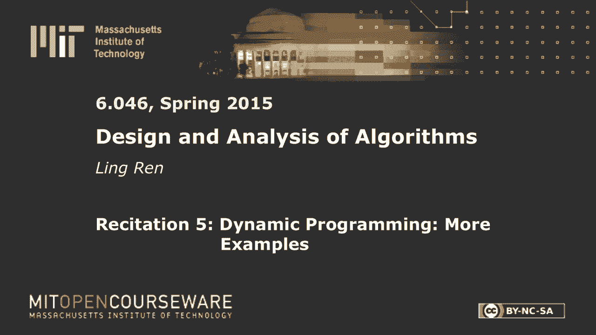

# 【双语字幕+资料下载】MIT 6.046J ｜ 数据结构与算法设计(2015·完整版) - P12：R5. 动态规划 - ShowMeAI - BV1sf4y1H7vb

以下内容是根据知识共享许可提供的，您的支持将有助于麻省理工学院开放课件。

继续免费提供优质教育资源。

捐赠或查看麻省理工学院数百门课程中的额外材料。

大家好，今天我们将再次学习动态编程，所以我想我已经提到过几次了，所以你们都应该熟记于心，现在动态编程，它的主要思想是，把问题分成子问题，重用您已经解决的问题的结果，当然是6比6，我们总是关心运行时。

所以就是这两个，是动态编程的大主题，现在让我们从一个热身示例开始，这非常简单，假设我们有一个砂砾，有一个机器人从坐标一一，它想去协调m n，所以每一步，它只能向上迈一步或向右迈一步。

那么机器人有多少条不同的路径可以走，问题清楚了吗？所以我们有一个机器人坐标，它想去坐标M，每走一步它要么向上走一步要么向右走一步，有多少条不同的路径可以把机器人带到目的地，有什么解决的办法吗，那个。

去吧，所以你把子问题定义为不同于所以在某个时候，是啊，是啊，从某一点出发的不同路径数是路径数，如果你上去，是的，是的，每个人都明白吗，所以很简单，所以我知道我只有一个方法来达到这些点，我需要一路走好。

到达这些点的唯一方法，我需要一直往上走，所以对于所有中间节点，我的选择数量，开始移动，我可以从左边来的不同路径的数量，加上我可以从底部来的不同路径的数量，然后我继续寻找每个节点。

我要在左边和下面的两个数字之间取一个和，从那里开始，好的，清楚了吗，所以这个例子很简单，但它确实很好地说明了动态编程的要点，你解决子问题，问我可以来这里多少条不同的路径，您重用，比如说，这个子问题。

因为你用它来计算这个数字和那个数字，如果你不那样做，如果你不记住和重复使用结果，你的运行时间会更糟，那么它的运行时间是多少，大声说出来，为什么因为我有这么多独特的子问题，每个点一个。

我只是在每个子问题上取两个数字的和，所以我需要不断的时间来解决，合并子问题的结果，来解决我的问题，所以要分析运行时，通常我们会问这个问题，我有多少独特的问题，我每一步要做的合并工作量是多少。

这是玩具的例子，现在让我们看一些更复杂的例子，我们的第一个叫做“做出改变”，顾名思义，我们有一堆硬币，像两个一样，一路说，所以每枚硬币都有一定的价值，就像一毛钱，五分一十分，然后我们要给它做零钱。

总共是熏香，然后问，硬币的最低数量是多少，我需要改变目的和感觉，所以为了保证我们总是能做出这个改变，将设置1为1，否则，问题就有可能无法解决，任何想法都是问题所在，清除，去吧，这就是我们得到的。

把这些数字列出来，它们是输入，也有输入，可能是一毛钱，五分钱，一毛钱，或者三分钱，七分钱，虽然最小的总是一个，好的，我需要找到他们的组合，为他们每个人，我有无限多的他们。

所以我可以找到这两个中的两个那三个那五个那两个中的两个，使它们的和为n，问题清楚了吗？有什么解决的办法吗，那个，让我们使用一个简单或非常简单的算法，去吧，挑一个，然后你做n-的mc，好的，伟大，是啊。

是啊，让我们做排气搜索，让我们挑选，如果我挑了这个硬币，然后我的子问题变成n-，硬币价值权，当然，我用的是一个硬币，那是SI，所以我采取了一个卑鄙的，为了所有的冰，好的，那么这个算法的运行时间是多少。

如果不是立即明显的话，然后我们问有多少唯一的子问题，我有多少工作要做，从我的子问题到我的原始问题，那么有多少子问题，所以为了清楚这一点，我们必须再次调用这个递归核心，对，减去si，可能减去SJ。

如果你不能计算出有多少子问题，让我们给一个约束，有什么想法吗，垃圾，对呀，是啊，是啊，我不确定会有更多，嗯，因为最小的，是的没错所以这可能不是一个非常紧的界限，但我们知道我们不能有超过这个数量的子问题。

对，实际上我甚至不需要把订单放在那里，我知道我们只能有N个子问题，它们只是改变n和-1和-2，一路去做改变一个，其实这个绑得挺紧的，因为我们把最小的硬币，所以我们将做一个递归核心来进行更改m-1。

如果我选了一枚硬币，先把一毛钱的硬币，然后从那里我再挑一枚1美分的硬币，这就给出了一个n减去2的子问题，所以我确实会遇到所有的N个子问题，好的，所以意识到从这里到那里我要做多少工作，是啊，是啊。

正确的权利，因为我在取多少的平均值，到目前为止还有什么问题吗？好的，如果不是让我离题，所以改变这个问题，如果你仔细想想，它很像背包，有人没听说过这个问题吗，你想把这个装进袋子里，背部有一定的尺寸。

你想让每个项目都有一定的价值，你想把综合价值最大的东西装进你的背上，所以说，为什么，它们为什么相似，因为如果是这样，在某种意义上n是我们的大小，我们想挑一堆硬币来做N的大小。

这里的每一枚硬币实际上都有一个负值，因为我们想挑最小的，如果你这样做，那么这个问题正好是背包，背包是NP完全的，这意味着我们还不知道它的多项式解，然而，我们刚刚找到一个，我们的输入是m个东西和n个。

我们的解是多项式到m，多项式到n，如果这是真的，然后我找到了一个NP问题的多项式解，所以p等于np，所以我们都应该因此获得巡回演出奖所以很明显出了问题，否，但是什么都没有，这个解决方案没有问题，对呀。

这涵盖了所有的情况，我们的分析肯定是正确的，所以是的，有人明白我的意思吗？那么这里有什么矛盾呢，我们可能会在后面的课程中讨论这个问题，当我们谈到复杂性或约简时，所以，而是给出一个简短的回答。

问题是当我们说输入是n时，它的大小不是n，所以我只需要log n，这个，表示此输入，对有道理，因此对于log n长度输入，我的运行时是n，这意味着我的运行时是指数级的，它不是多项式，这就是题外话的结尾。

现在让我们看另一个例子，这个叫矩形块，所以在这个问题中，我们有一堆块，一直说1 2到n，每一个都有一个长度，宽度和高度，所以它是一个三维块，所以我想把方块，把它们叠在一起以获得最大高度。

但是为了让j放在n的上面，j的长度可以小于i的长度，j的宽度也小于i的宽度，所以从视觉上看，我只是说这是一个街区，我可以在上面再加一个块，对呀，它们的宽度和长度都较小，但我不能把这家伙放在上面。

因为它的一个维度比基础块大，让事情变得简单，我们不允许旋转，对呀，所以OK，我可以旋转，还是不合身，但你看到了复杂的情况，所以如果你允许旋转，那么有更多的可能性l和长度和宽度，所以其中一个是南北的。

另一个是东西，你无法改变这一点，好的，问题清楚了吗？我们想一个一个地堆叠在一起以获得最大的高度，有什么想法吗，再次，让我们从简单的算法开始，说，让我们尝试一切，好的，去吧，其他一切，你开得太快了。

让我们先编写算法，所以我想解决我的矩形块问题，从一到n说，我的子问题是什么，像一个方块，好的，让我们选择一个方块，然后你写一切都设置好了，所以我得到了它的高度，然后我有一个子问题，子问题是什么。

然后我拿最大值，这个子问题，所以安德鲁是对的，所以安德鲁说只是，案件继续进行吗，你懂的，是啊，是啊，我们不仅要排除i，我们还必须排除比我更长或更宽的东西，所以这实际上是一个混乱的问题。

所以让我把这个子问题定义为一个兼容集，我和欧米茄对不起，wi，让我把它定义为块集，其中长度小于所需长度，它们是宽度的，对不起，也小于要求的宽度，所以这应该提醒你加权间隔调度问题。

其中我们定义一个兼容的兼容集，一旦我们选择了一些方块，这里的问题是你在尝试，最大化h，我们想得到尽可能高的，我选择一个块，我得到了它的高度，然后我找出剩下的有竞争力的街区，我想把它们堆在上面。

每个人都同意这个问题，这个解决方案是正确的，然后让我们分析这个运行时，那么我们如何分析运行时，那么第一个问题是什么，我总是问，我不知道是谁说的，但是我们有多少子问题，最多n，3。

你能解释一下为什么会这样吗，或者只是猜测，谢谢。是一个兼容的集合，兼容性中没有任何东西，并且不会在兼容的集合中，好的，那很棘手，我不明白，我不能再说了，因为如果像你一样，比如说。

如果你从n和所有在兼容集合中的东西开始，也不会在比较中，好的，我想我明白你说的了，所以如果我们认为只有n个子问题，他们是什么，他们必须是，l一w一，然后我两个W两个右。

这些是你正在考虑的N个独特的子问题，对吧，我有机会得到一套兼容的吗，就像L三一样，但是五个，如果我有这个子问题，那么我的子问题数量就会爆炸式增长，是啊，是啊，我看到你们中的许多人都在说不，为什么不呢？

因为如果我们有一个子问题，说l i和wi的兼容集，如果我们从这里走，并选择下一项，选择下一个块，说T，这意味着我们的新子问题或新的兼容集变成，一个新的子问题需要与T而不是I兼容。

所以我唯一能得到的子问题是这些对的，我不能我不能有一个这样的，好的，所以我们的子问题是，子问题的数量为，我有多少工作要做，在每个级别，是啊，是啊，是啊，是啊，因为我只是把最大的权利。

在我的最大值内有N个潜在的选择，所以运行时n平方，好吧，我们还没有完全完成，因为，还有一个额外的步骤，当我们试图这样做的时候，我们必须弄清楚这些都是什么，因为一旦我进入这个子问题。

我需要在这个集合中的所有块上取最大值，我得知道那一套里有什么块，有那么难吗，那么你会怎么做呢，好的，所以我检查了所有的，就这些了，我得到，我很确定你的意思是扫描，扫描整个东西，挑出合适的。

但那是因为这是个问题，我们必须为每个人做这件事，或者可能有更好的方法，所以我认为前一层告诉我有一个更好的方法来做到这一点，所以为了找到整个兼容的东西，他声称他可以用log n做这件事，但我还没查过。

所以我不确定这是民间传说还是传说，是啊，是啊，我们会再次检查离线，但假设如果我，如果我没有这个，然后算出所有这些子问题也会取n的平方，那么我的总运行时间是n的平方加上n的平方，仍然是n的平方。

问题到最终解决方案，让我们最好的，是啊，是啊，我想应该是这样的，但是是的，我还不知道你是按长宽排序，或者你只能按其中一个排序，所以分类之后，说让我们按长度排序，然后经过这个整理之后。

我可能会做对这样的事情，如果我问，和这家伙的兼容集是什么，我还是得把他们都赶出去，是啊，是啊，所以我完全不清楚该怎么做，但我想你可以考虑，有另一个，说，按宽度排序的二叉搜索树。

你可以进去删除所有大于一定宽度的东西，所以这就是，是啊，是啊，好的，去吧，你把它转换成有向图，那是可以吃的，你，但是构造这个图已经需要所有的n平方，是啊，是啊，好的，让我们继续前进，我现在没时间想清楚。

让我们考虑一下，间隔调度，加权区间调度权，即它有一些兼容集，在第一次讲座和背诵中，我们有两种加权区间调度算法，其中一个比另一个好，这个看起来像是简单的算法，有人记得加权间隔调度的更好算法是什么吗。

作为我潜在的最低的一个对吧，那样做真的没有意义，因为对于非常小的，我不应该把它，把它们放在我的底部，我只应该尝试，我应该先试试大一点的，作为最下面的一个，哦，你没有跟着我，可以创建一个排序的长度列表。

所以你知道，这是列表后面的项目，你不会是，功率水平，所以就像加权间隔调度一样，让我们先把它们分类，但这有点棘手，因为我是按长度还是按宽度排序，所以我还不确定，但让我们按长度排序，然后用。

所以这意味着如果它们有相同的长度，那我就按宽度排序，这样我就可以创建一个排序列表，让我假设这是一种就地排序，现在我有了排序列表，所以一旦我有了，所以我应该问这个问题，所以我应该考虑的潜在解决方案是。

无论是否，我把我的第一个街区，右下角这个，对我来说，把后面的这些放在一起是没有意义的，所以我的潜艇问题，对不起，我的，不管我是否选择第一块，如果我这样做了，然后我得到它的体重高度，对不起。

我的潜艇问题是，与之兼容的，如果我不选择它，那么我的子问题是，安德鲁第一盘从两盘一直到它，那么为什么这是正确的呢，所以我要求这个保险涵盖所有的情况，就像H中的任何一个被选为第一个底部的，或者不是。

根本不是选的，一个人不可能在中间的某个地方，对呀，因为它有最长最大的长度，好的，那么我有多少子问题，还在，所以有所有这些兼容的L 1 W 1集，看起来我确实有一些新的子问题，这些以前是不存在的。

然而他们只有N个，它们只是整个集合的后缀对吧，所以我还有很多问题，每一步我都在做大量的工作，只有两个项目，所以我们找到了另一个n解，你说完了吗，一切都好吗，否，是啊，是啊，我还得找到所有这些C，首先。

我实际上有一个很短的步骤，排序步骤是和log n，是啊，是啊，然后再一次好吧，如果我们天真地做，然后它又是正方形的，因为我得找到这个兼容的集，它们中的每一个都有一个n，log。

n的解来找到这些兼容的集合，那么我的最终运行时在log n中，有道理，到目前为止还有什么问题吗？好的，所以现在我们实际上有一个选择，所以我们要么经历另一个，DP示例，我确实有另一个，南希。

其中一次讲座建议，似乎很多人都很难理解，昨天关于通用哈希和完美哈希的讲座，所以我们也可以考虑通过那口井，当然啦，第三个选择是收工，所以让我拿一个球，有多少人喜欢我们把杂凑的东西。

有多少人更喜欢另一个DP例子，好的，对不起各位，有多少人只是想离开，没事的，好的，伟大，就是这样，好的，DP到此为止，我们确实有另一个例子，我们会在背诵笔记中发布，对于那些有兴趣的人来说。

大家可以看一下，如此好你如此，你们都知道我们还没有在主要讲座中进入DP，所以这真的只是一个热身，并为你准备去更先进的DP概念，DP也将在测验一中讨论，但是困难比我们在这里讨论的例子要简单得多。

现在让我们回顾一下通用和完美哈希，所以不是说，我有更好的方法来教它，我们这里的优势是人少，所以你可以问问题，你有这么多，让我从激励的例子开始，那么我们为什么要关心哈希呢，这是因为我们想创建一个哈希表。

说它有m梁，我们将接收输入，说K零，一直到k n减去一和键，我们将为它们每个创建一个哈希函数，将它们映射到其中一个垃圾箱，希望如果，或者以另一种方式，m是θn，那么每个存在都应该包含恒定数量的键。

所以为了完成这幅画，所有的键都来自一个有大小的宇宙，这个U通常很大，假设它比m平方大，它比我的哈希表大小的平方大，但让我首先从一个负面的结果开始，所以如果，那么总是存在一系列的输入。

它们都映射到相同的东西，我们称之为最坏的情况，我们不，我们不喜欢最坏的情况，为什么，因为在这种情况下，哈希没有做任何事情，我们仍然有同一个列表中的所有项目，为什么那个引理是真的，因为通过一个非常简单的。

宇宙中所有的键都进入了我的哈希表，我决不会那样做，在实践中，这只是一个思想实验，所以通过一个简单的鸽子洞论点，如果u大于m的平方，那么至少有一些光束将包含超过m个元素，好吧，如果碰巧我的输入是这些M键。

然后我的哈希会把它们都哈希成同样的东西有意义，所以这就是我们试图解决的问题，2。我们不希望出现这种最坏的情况，是不是说如果h是确定性的，4。我们无法避免的是，最坏的情况总是存在的，那么解决办法是什么。

我真的不能随机化，所以如果A H拿了一把钥匙，如果我的哈希函数将一个键映射到某个人，下次我调用这个哈希函数时，它最好给同样的存在对吧，否则我找不到，需要确定性，所以现在我们唯一的选择就是。

随机选择一条边，每个哈希函数都是确定性的，但我们会从，哈希函数族，所以在某种意义上是，这是作弊对吧，因为我想说的是，我不会事先选择哈希函数，我将等待用户插入输入，如果我有太多的碰撞，我会选择另一个。

如果我有太多的碰撞，我会选择另一个，好的，我想我忘了提一件很重要的事，所以你可能会问，我为什么在乎，我为什么要关心最坏的情况，发生这种事的可能性有多大，在实践中，它很低，但在算法中，我们真的没有。

我们真的不喜欢对输入做出假设，为什么，因为如果你想象你在跑步，比如说一个网站Web服务器，嗯，您的代码中有一些哈希表，所以如果你是竞争对手，或者讨厌的人，你想让你破产，如果他知道你的哈希函数。

他可以创建最坏情况输入，这会让你的网站变得无限慢，所以我们在这里说的是，我不告诉他我的，我将使用什么哈希函数，我会说我选一个，如果他发现了错误的输入，最坏情况输入，我要改变我的哈希函数，使用另一个。

好吧有道理，现在通用哈希函数的定义，如果我从我的通用哈希函数族中随机选择一个h，我映射到，与任何kj相同的存在应小于或等于，1/m，其中m是我的哈希表，这真的是你能得到的最好的。

如果哈希函数真的是均匀分布的东西，你应该得到，此属性，所以我们在类中看到了一个通用哈希函数，我会给，我再过一遍另一个例子，也就是a k加b，所以p是一个大于宇宙大小的质数。

我们将看到为什么这是一个通用哈希函数，所以要做到这一点，我们只需要分析碰撞概率，所以如果我有两把钥匙，k 1和k 2，然后映射到同一个存在，就是说，他们拿了一个mod m后必须有这个财产权。

它们的差异应该是m的倍数，对的，因为如果这是真的，在我拿了模块M之后，他们会映射到同一个存在，现在有意义了，我可以很快地把它写成，a乘以键的差值等于m mod p的倍数，现在k1和k2不相等。

所以它们是非零的，在这个小组中，我们以第三名为基础，我们有一个逆元素，所以如果发生这种情况，我们称之为糟糕的，我有多少个糟糕的A，所以这是一个糟糕的，a中的一个将使这个方程在i等于1的情况下成立。

另一个a使方程成立，i等于2，但我最多有多少这样的A，因为这个方程可以用m 2成立，一直到p/m流体，这是这个方程可以容纳的可能方式的总数，那么有多少糟糕的日子，我有糟糕的日子吗，我有p对m，结束。

p减去1的射线总数，哦耶，我忘了提这一点，所以A是，从1到p减去1，好的，所以我总是可以选择我的p不是m的倍数，如果我这么做，这层楼，所以p和p减去1不会越过多重m的边界对吧，那么这是真的，这小于。

1/m，所以这是一个通用哈希函数族，那么这里的随机性是什么，随机性是一个，我会挑一个a去拿我的哈希，如果它不起作用，我再挑一个，p是质数，我选择，是啊，是啊，哦，b是，我想这也是一个随机数，所以说。

是啊，是啊，所以实际上，不需要，但我认为他们把它保留在哈希函数中有一些深层次的原因，我还不知道为什么，一旦我们有了，一旦我们有了一个通用哈希，人们也想要完美的撞车，这意味着我想要绝对零碰撞。

那么我该怎么做呢，让我先给一个，方法一，我将使用任何通用哈希函数，但我的真理，我选择我的m为n平方，我声称这是一个有一定概率的完美哈希函数，为什么因为我想计算概率，无碰撞，是啊，是啊，一负概率。

我确实有碰撞，我可以使用联合绑定，这就是，任意一对h x等于h y，我有多少双，选两个，这个号码对，如果它是一个通用哈希函数，然后任何碰撞，任何两个碰撞，概率是m分之一，所以我选择我的m是n的平方。

所以这个比一个大，一半，所以我想说的是，得到一个完美的哈希函数，我就用最简单的方法，我选择m等于n平方的通用哈希函数，我成功的可能性超过一半，如果我不成功，3。我会一直疡另一个正确的，直到成功。

所以这是一个随机算法，我们可以把它变成蒙特卡洛算法或拉斯维加斯算法，所以我可以说如果我选择alpha log n次，那么我的选择中没有一个满足完美哈希的可能性有多大，这个概率是我的失败，概率小于。

每次我都有一半的成功率，我试了很多次，他们全部失败的可能性有多大，1/n升到α，当然啦，我也可以说我会一直努力直到成功，那么我有百分之百的成功率，但我的运行时可能会无界，有道理，好的。

这听起来是个完美的解决方案，唯一的问题是该方法的空间复杂度为n平方，因为我选择我的m哈希表大小为n的平方，所以这是我们在这个简单的方法中唯一不想要的东西，我们的最终目标，就是有一个完美的哈希函数。

它有n的空间o和运行时，n中的某些多项式和任意小的失效概率，有一个两级哈希的想法，所以我先选了一个H，把我的钥匙分成两个人，对每一个人说，我在这里得到一个元素，我们这里的两个元素，诸如此类。

我会选择每个横梁作为第二层，我们可以用1的方法来选择这个小的，如果我选择我一个，这是这个家伙的哈希表大小，是1平方，然后我知道在alpha log n试验后，这个应该是一个完美的哈希。

在另一个alpha log n试验之后，我应该解决L 2中的所有冲突，使其成为一个完美的哈希，log n试验，我会把这些都做出来，我会在我的第二级解决所有的冲突，散列问题，讲座中提到。

只有在没有插入删除的情况下，这才有效，我的天啊，让我离线想想，我不太确定，好的，所以唯一剩下的问题是我们需要弄清楚我们是否达到了n的空间，这个算法的空间复杂度是n加，我平方是因为每张桌子。

每个桌子的大小是正方形，里面的元素，最后我们有马尔可夫不等式或类似的东西来证明这是，这就是，所以我的空间，大于n的概率也大于二分之一，然后我就可以继续前进。

我会在我的第一级哈希函数上尝试一个alpha log n次，直到我的空间全部，一旦我到了那个地步，我会试着为我的小表选择通用哈希函数，直到我成功，这就是哈希和DB的内容。

