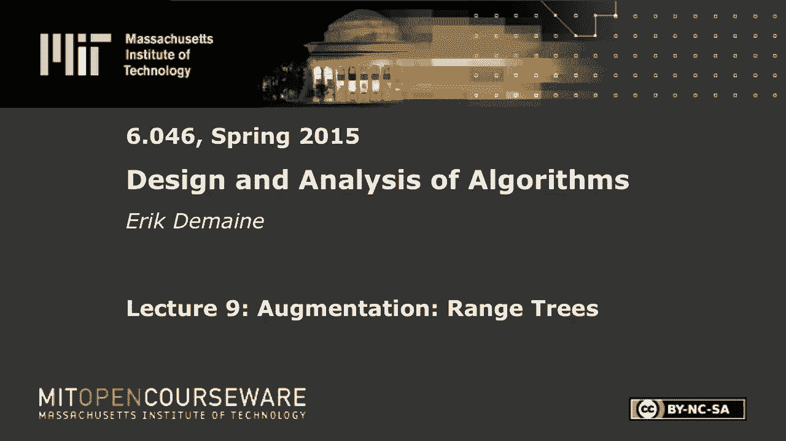
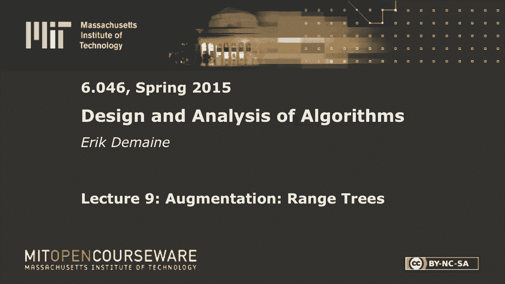

# 【双语字幕+资料下载】MIT 6.046J ｜ 数据结构与算法设计(2015·完整版) - P13：L9- 范围树 - ShowMeAI - BV1sf4y1H7vb

以下内容是根据知识共享许可提供的，您的支持将有助于麻省理工学院开放课件。

继续免费提供优质教育资源。

捐赠或查看麻省理工学院数百门课程中的额外材料。

所有的权利，今天就开始吧，我们有另一个数据结构主题，也就是数据结构增强，这里的想法是，我们将利用一些现有的数据结构，并对其进行增强，以完成额外的任务，很酷的东西，采取我们已经讨论过的一些其他数据结构。

通常这将是一个平衡的搜索树，就像一棵AVL树或一棵二三树，然后我们会修改它来存储额外的信息，这将支持其他类型的搜索，通常，有时为了更好地更新，在双六，你已经看到了一个例子。

在那里你拿了AVL树并增强了AVL树，以便每个节点都知道该根子树中的节点数，今天我们要看那个例子，还有一堆其他的例子，你可以做的不同类型的增强，我们将从一个非常简单的开始，我称之为简单的树木增强。

它将包括子树大小作为特例，所以通过简单的树木增加，这个想法是你有一棵像AVL树一样的树，或者一棵两三棵树，或者类似的东西，您希望为每个节点存储，根于x的子树的x，比如里面的节点数，或者节点权重之和。

或者权重的平方和，或最小值、最大值或中位数，也许我不确定x的某个函数f，这是其中的一个函数，也许不是x的f，但我们想计算，存储该子树的某些函数，说目标是储存，根为x的子树的f。

在一个我称之为x点f的字段中，所以通常节点有一个左子节点，右子女父母，但我们要储存一个额外的字段，x点f表示您定义的某个函数，这并不总是可能的，但在这种情况下，那将是件容易的事，假设x点f可以计算。

我们会说，让我们假设它可以在恒定的时间内计算，从节点x中的信息，存储在子文件中的f值，我叫那孩子F，但真的，我是说，左子女f，右子f，或者如果你有一棵两三棵树，你有三个孩子，潜在的和他们每个人的点f。

好的，假设你可以局部地计算x点f，只需在恒定的时间内向下使用一个级别，然后呢，正如你所料，您可以随时更新节点需要，每当节点结束时，更正式地改变，如果某些节点集发生变化，调用集合S。

所以我在这里陈述一个非常普遍的定理，如果有一些节点集，我们改变了它们的一些东西，我们改变他们的F场，我们更改节点中的一些数据，或者我们改变，我们做旋转，移动一些节点，然后我们计算这些节点的祖先总数。

所以这个子树，这些是需要更新的节点，因为我们假设我们可以计算x点f，刚刚给了孩子们数据，所以如果这些，如果此数据正在更改，我们必须更新它的父值f，因为这取决于这个子值，我们必须更新所有这些父母一直到根。

好的，所以说，然而，有很多节点，那是现在的总成本，幸运的是，在一个avl树或两个三棵树中最平衡的搜索结构，您所做的更新非常本地化，就像我们在两三棵树上劈叉一样，我们只沿着一条路径到根。

所以这里祖先的数量是对数，AVL树也是如此，如果你看看你所做的旋转，它们从一片叶子到根部，所以祖先的数量需要更新，总是顺序log n顺序log n事情变了，他们的祖先有一个秩序。

所以这比我们需要的更一般一点，但这只是为了指出，如果我们做了log n旋转，在树上的某个地方散开，那实际上是不好的，因为祖先的总数可以是对数的平方，但因为在我们所看到的结构中。

我们只是在一条通往根的路径上工作，我们得到log n，所以在这里更详细一点，每当我们在AVL树中旋转时，所以让我们说a b c x y，记住旋转，我们已经有一段时间没有做轮换了。

所以我们没有改变ABC中的任何节点，但是我们改变了节点x和y，所以我们要，我们必须触发Y的更新，首先我们要更新Y F，然后我们将触发到x f的更新，只要这个可以从它的子计算，然后我们计算y f。

然后我们可以从它的子计算x，所以每当我们旋转时我们需要做的额外的事情，因为旋转在一条路径上，总成本，你知道的，一旦我们停止在AVL中旋转，插入说，那么我们仍然要不断更新到根，但最多只有log n。

log n个节点来做到这一点，好的，两三棵树也一样，我们有一个节点分裂，所以我们有，我想有三把钥匙，四个孩子太多了，所以我们分成两个节点和一个额外的节点，然后我们就触发这个f值的更新。

这个f值的更新和那个f值的更新，因为这只是遵循一条单一的路径，一切正常，所以这是一个关于增强任何表现良好的函数的一般定理，从这个意义上说，我们可以在AVL树和两三棵树中维护，我会提醒你。

更笼统地说说你在双O六做了什么，在教科书中被称为顺序统计树，我们将首先让我告诉你们我们正在努力实现的目标，这是抽象数据类型或数据结构的接口，这是我们通常想从二叉搜索树前身中得到的东西，我也是。

我们当然想做排名，给定键的，告诉我那把钥匙的索引是多少，在我们讨论过的键的项目的总体排序顺序中，在这个班上已经排名几次了，取决于你是从零开始还是从一开始，但假设我们从，所以如果你说钥匙的等级。

碰巧是最小的，你想买一个，如果你说关键的排名，碰巧是中位数，你想要n除以二加一，以此类推，所以这是很自然的事情，你可能想知道，说I，那就是给我等级的钥匙，i，好的，我们已经讨论过选择作为脱机操作。

给定数组，给我找中位数，或者给我找第七级以上的项目，我们可以在线性时间内做到这一点，给定无数据结构，这里我们需要一个数据结构，这样我们就可以找到中位数或第七项，或者n/7键，在log n时间内。

我们想做所有这些的地方，每个操作的log n，好的，所以特别是选择性的等级，我应该相等，我是对的，我们正试图找到那个级别的物品，就把这两部分塞在一起，我们有这个数据结构增强工具。

我们有一个我们想要实现的目标，我们将通过应用这项技术来实现这个目标，其中f只是子树，size是该子树中的节点数，因为这将让我们计算排名，简易扩树，等于子树中的节点数，所以为了适用这一点。

我们需要检查给定一个节点x，我们可以用它的子函数计算x点f，这很容易，我们只是把所有的东西加起来，所以x点f等于，加上每个子c的c点f之和，所有的权利，这是一个Python插值。

所以它看起来更像一个算法，我在这里试着通用，如果是二分搜索树，你只要做x点左点f加x点右f，但这也适用于两三棵树，选择您喜欢的数据结构，只要有固定数量的孩子，那么这将需要恒定的时间。

所以我们满足这个条件，这样我们就可以很容易地增加树木，现在我们知道我们有子树大小，所以给定任何节点，我们知道孩子的数量，对不起，该节点以下的子代数，所以这很酷，它让我们计算等级和选择。

我很快就会给你那些算法，是啊，是啊，所以这个想法很简单，你有钥匙吗？现在让我们考虑一下二叉树，因为这样更容易一点，我们有一些，它有一个左子树，右子树，现在让我们从x向上看，只要继续打电话给X父母。

所以有时候父母在我们右边，有时父母在我们的左边，我要用一种有趣的方式来画这个，但这种滑稽的方式有一个非常特殊的性质，也就是图中的x坐标是关键值，或者是键的排序顺序，对呀，x左子树中的所有值都小于x。

如果我们说所有的键都不一样，x右边的所有东西都有一个大于x的值，如果父，如果x是其父节点的左子节点，这意味着这个东西也大于x，如果我们跟随父母，它是，这是父母的正确孩子，这意味着这个东西小于x。

所以这就是为什么我把它一直画在左边，这个东西也小于x，因为它是一个，我叫它左父母，这里我们有一个正确的父母，所以这意味着这是大于x的东西，在这里，我们有一个左父母，所以这是小于x的东西。

让我们说这是一般的根，会有一些左边缘和一些右边缘，当我们走的时候，这些箭头将在二叉树中向左或向右，所以x的秩只是一个，加上小于x的节点数，小于x的键数，所以有这些家伙，有这些家伙，这里挂着什么东西。

我几乎违反了x坐标规则，如果我把这些弄得很窄，这是正确的，所以所有这些事情，左子树中的所有这些节点，其中小于x的节点也将小于x，如果你想想这些其他子树，它们会比x大，所以我们并不真正关心他们。

所以我们只想数一下，这些节点和所有这些节点，所以这样做的算法很简单，我们先从，我要把这个f符号换成大小，那更自然一点，通常你可能有很多功能，所以size是子树大小的通常表示法的通常概念。

所以我们从计算这里有多少物品开始，如果我们想从一个等级开始，如果最小有排名一，那么我也应该为x本身做加一，如果你想从零开始，你只要省略那个加一，然后我所做的就是从X走到树根，从x到x素数。

这意味着我们有一个x素数，它的右子是X，所以当我们从X到它的父，我们走到左边，x素数本身加一个，也许还有x x素点，那个大小是零，可能那边没有结点，但至少，我们必须计算我们左边的节点，如果下面有什么。

我们把所有这些东西加起来，这样我们就可以计算等级了，需要多长时间，我们只是走在一条路上，从一片叶子到根部，或者不一定是叶子，但是从某个节点x到根，只要我们使用像AVL树这样的平衡结构。

我想我在这里想要二进制，所以让我们说AVL树，那么这将需要log n时间，所以我每一步都花在不断的工作上，有log n步清除，所以这是一个很好的老军衔，一次容易做，您有子树大小，让我们做选择的乐趣。

这看起来像是复习，但我明确地画出了这幅画，因为我们今天要做很多，我们会有这样的照片，思考节点在哪里真的很有帮助，哪些小于x，哪些大于x，我们先选吧，这个你可能在双六没见过，所以我们要做相反的事情。

我们要从根部开始，我们要走下去听起来很容易，但现在走下去有点像在搜索，但是我们没有钥匙，我们正在寻找，我们有一个等级，我们正在寻找，那么那个等级是什么，我没事吧，另一方面，我们有节点x。

我们想知道x的秩，并将其与i进行比较，它会告诉我们是该向左走还是向右走，或者我们是否碰巧找到了物品，现在一种可能是我们调用x的秩来求x的秩，但那很危险，因为我将在这里有一个for循环。

如果和它将需要log n迭代，如果在每次迭代中，我计算秩x和秩成本log n，那么总成本可能是对数的平方，所以我负担不起，我想知道X的秩是多少，但我不能说排名开放打印X，因为递归调用太贵了。

那么x的秩是多少，在这种情况下，这有点特别，左数或左子树的大小加一，是啊，是啊，如果我们从1开始数，加1，非常好，慢慢好起来，呃，这次没有打人，好的，所以至少对根部来说，这是军衔。

这只需要我们恒定的时间，在这种特殊情况下，我做完循环后，我们得检查它是否还能坚持，但它会如此凉爽，现在，有三个案例，如果i等于秩，如果我们正在寻找的排名是我们碰巧拥有的排名，那我们就大功告成了。

我们只返回x，那是件容易的事，更有可能的是i将小于或大于x的秩，好的，所以说，如果我小于等级，这是相当容易的，我们只说x等于x点左，我说对了吗，是啊，是啊，在这种情况下，等级，所以这里我们有x。

它处于等级等级，然后我们有左子树和右子树，所以如果我们要搜索的等级小于等级，这意味着我们知道它在这里，所以我们应该往左，如果我们只设置x=x左，你可能会问，我们要找的是什么军衔，完全相同的等级，精细。

在另一种情况下，那是容易的情况，如果我们在这里搜索，我们在寻找一个比等级更大的等级，然后我想走右边，但是我要搜索的新等级是这个子树的本地等级，我在找一个减去这个东西，这东西很烂，所以我要让我。

我减去等级，当然我没有任何错误，这是很好的是正确的，好的，然后我做一个循环，所以我会写重复，所以我要上去说，好吧，现在相对于这件事，这个子树的根的秩是多少，好吧，它又将是那个节点，点左点大小加一。

现在我有了新的军衔，我在寻找我，我只是继续前进，您可以递归地编写这个，如果你喜欢，但这里有一个迭代版本，所以这实际上是非常熟悉的选择算法，我们有，当我们做确定性线性时间中值发现或随机中值发现时。

他们有一种非常相似的递归，但在这种情况下，我们花线性时间来进行分区，在这里很贵，我们只是在每个节点上花费恒定的时间，所以总成本是log n，所以这很好，对此有什么问题吗，好的，我这里有一张纸条。

子树大小明显，一旦你知道那是你应该做的，另一件自然的事情，将为每个节点增加，那个节点的等级是什么，因为排名真的很容易找到，然后选择基本上是一个常规的搜索，我只是看看根的等级。

我看看我要找的等级是太大还是太小，我向左或向右，因此，有什么不好的，更新的坏例子是什么，和一个新的最小值，对呀，假设我们插入一个新的最小元素，抓得好摄影师，那是为了相机，显然如此正确，如果我们把。

这个到旁边去了，但如果我们插入，我叫它负无穷，比所有其他键都小的新键，那么每个节点的秩都会发生变化，那很糟糕，这意味着简单的树木增加尤其不适用，此外，这将需要线性时间来做到这一点，你可以继续插入。

如果您从那里按递减顺序插入键，每次插入，所有的等级都增加一个，维护这将花费每次更新的线性时间，所以你必须非常小心，你想要存储的功能实际上是可以维护的，对此要非常小心，在接下来的测验中说，那个。

当你增加某物时，你实际上可以维护它，比如说，很难保持节点的深度，因为当你旋转的时候，整个深度的变化，你的深度是从根部数的，我到底有多深，当我做旋转时，然后整个子树下降了一个，在这张图片中。

整个子树上升了一个，但保持高度很容易，比如说，从底部算高度是可以的，因为我不影响A B和C的高度，我影响它的x和y，但这只是我能负担得起的两个节点，好的，所以这就是你在简单的树木增加中要小心的。

所以大多数时候，简易扩树，做这项工作，但在剩下的两个例子中，我想向你们展示更酷的，增强实例，这些都是你自己可能不会想到的事情，但它们很酷，让我们做更复杂的操作，所以第一个叫做水平链接，在这里。

我们将在两三棵树的背景下进行，部分是为了品种和，所以水平链接的想法很简单，让我画一个二三树，不是很令人印象深刻的两三棵树，因为我不想画太多的水平，链接是，除了这些子指针和父指针之外。

我们将在所有级别上添加链接，水平链接，您可以称之为水平链接，好的，所以这很好，两个问题，我们能做到吗，它有什么好处，所以让我们从，我们能做到吗，记住在两三棵树里，我们要考虑的就是拆分和合并。

所以在一个短暂的分裂中，我们有一段时间，三把钥匙，四个孩子，太多了，我一会儿就换，但就目前而言，这是分裂，你知道和爱也许至少没有，如果我们考虑级别链接指针在哪里，我们之前有一个，然后呢。

我们只需要将这些指针分发到两个结果节点，然后我们必须在我们刚刚创建的节点之间创建一个新的指针，这当然很容易做到，我们在这里，我们取这个节点，我们把它分成两半，所以我们手中有节点。

所以只要在它们之间添加指针，关键是，左边这里有个节点，它用来指向这个节点，现在我们要把它改成指向左边的版本，节点的左半部分，右边有一个节点，我们必须改变它，它的左指针指向这个右边，节点的一半。

但这是恒定的时间，好的，所以这不属于简单的树木增加的范畴，因为这不是孤立于子树的，我们也在处理它的左子树和右子树，但在恒定的时间内仍然很容易做到，合并节点将是相似的，如果我们从父母那里偷了一个节点。

然后或者从我们的兄弟姐妹那里，在级别链接方面没有发生任何事情，但是如果我们说一个空节点，一个承受不起任何窃取的节点，所以我们这里只有一个孩子，两个孩子，我们把它合并成，我们从父母那里拿走了一些东西。

把它带下来，后来我们有了三个孩子我们以前有这些水平指针，现在我们只有这些级别指针，它很容易维护，它只是一个恒定大小的社区，因为我们有水平链接，我们可以得到我们的左和右，邻居和改变链接指向的地方。

所以很容易在恒定的时间内维护，我称之为每次拆分或合并时的恒定开销，我们花额外的恒定时间来做这件事，我们已经花了很多时间，所以它只是通过一个恒定的因素改变了一切，到目前为止一切都好。

现在我要稍微调整一下这个数据结构，但让我先告诉你为什么，我试图用这个数据结构实现什么，我试图实现的是一个叫做手指搜索属性的东西，这是一个所以，让我们想想我成功搜索的案例，我在搜索键X。

我在数据结构中找到了它，我在树上找到的，假设我找到了一个，我搜索了X，我找到了，然后我会寻找另一把钥匙，实际上，我想我要先做相反的事，我找到了Y，现在我在找X，如果x和y在树的附近，我想让它跑得特别快。

比如说，如果x是y的后继，我希望这需要恒定的时间，在最坏的情况下也不错，X和Y离我和树很远，然后我想花log n时间，和log n时间查找，最坏情况搜索，所以我要把这个搜索从Y，意思是这有点不精确。

但我的意思是当我调用搜索，我告诉它我已经找到你的地方，就在这里，这是存储y的节点，现在我想，我得到了一个X键，我想找到钥匙X，给定存储密钥y的节点，那么这需要多长时间呢？

是在一个极端的恒定时间之间插值的好方法，和好的案例，当x和y基本上是排序顺序的邻居时，在最坏的情况下对log n时间，沿着图形的距离，沿图的距离，这将是一个合理的定义，所以我有一个树。

你可以把它想象成一个图表，测量从x到y的最短路径长度，或者我们这里有一个更复杂的图表，也许那个长度，图中距离的问题，那是个合理的建议，但它是非常特定于数据结构的，如果我使用没有级别长度的AVL树。

那么距离可能是一回事，然而，如果我使用一个二三树，即使没有水平长度，会是一个不同的距离，如果我用一个水平长度的二三树，这将是另一段距离，所以这有点不令人满意，我希望这是对一个问题的回答。

我不想用数据结构的术语来表达这个问题，是啊，是啊，x和y之间的等级差，那很接近，所以我要看看x的秩和y的秩，让我们说，取绝对差，那有点，他们有多远按顺序排列，你想添加什么吗，日志是的。

因为在最坏的情况下，等级的差异可能是线性的，所以我想在这里添加一个日志来得到log n，在最坏的情况下，为了安全起见，加一个大O，这就是我们想要实现的时间，所以这将是手指搜索属性。

你可以在这么长时间内解决这个问题，所以再一次，等级之差最多为n，所以这最多是log n，但是如果y是x的后继者，这将是不变的，这将是不变的，如果你在做很多搜索，这很好，你总是，你倾向于搜索附近的东西。

但有时你会寻找遥远的东西，这给你一个很好的，所以一方面我们有，这是我们的目标日志等级差，另一方面，我们有一个建议，我们可以实现的是类似于图表中的距离，但我们对此有一个问题。

我曾经认为数据结构解决了这个问题，但事实并非如此，我先画一个，其实，我在那里有一棵树，我要用那个，这棵树有点小，但如果你想得足够久，这个节点是这个节点的前身，所以他们的等级差应该是一个。

但是图中的距离是2，好的，不是很令人印象深刻，但通常你有一棵高度为log n的树，如果您查看根和根的前身，根据前任的定义，他们将有一个等级差异，但是图的距离是log n，所以这是个坏消息。

因为如果我们只遵循指针，没有办法在固定的时间内从这里到那里，所以我们还没到那里，我们将对数据结构使用不同的另一种调整，也就是，将数据存储在树叶中，我试图找到一个数据结构，它不需要这个，还能用手指搜索。

但据我所知，没有这样的数据结构，所以如果你看过，如果你看过维基百科关于B树的内容，你会看到有很多B树的变体，b加上树木，b星星树，这是其中之一，我想B加上树，嗯，当你看到B树或两三棵树。

每个节点存储一个或两个密钥，每把钥匙只存在一个地方，我们仍然只把每把钥匙放在一个地方，有点，但只会是叶斑，好的，好消息是，大多数节点都是左右，节点的常数部分将是叶子，所以从效率空间效率的角度来看。

它不会有太大的变化，如果我们把数据放在这里，而不把，我现在不打算把钥匙放在这里，好的，所以这有点奇怪，让我举一个这样一棵树的例子，所以也许我们有两个和五个，比方说九个，一个在这里。

所以我将在这里有一个节点，有三个孩子，这里有两个子节点的节点，这里有一个有两个子节点的节点，所以我想这是模仿这棵树，大致上我得到了，哦不，我完全正确，所以在这里我把这个树结构，我重新画了。

现在这些节点中没有键，但其他一切都会一样，每个节点都将有零子节点，如果是一片叶子还是两三个孩子，否则永远不要生一个孩子，因为那样你就不会得到对数深度，所有的叶子都会在相同的深度，就是这样。

这是一棵二三树，用存储在飞跃中的数据，这是一个有用的诀窍，现在我们要做水平链接二三棵树，所以除了那张照片，我们会有这样的链接，好的，我应该检查我还可以在这些结构中插入和删除，其实并不太难。

但让我们考虑一下，我想实际上这可能更容易，让我们看看，所以如果我想做一个插入，我没事，我得先搜索我插入的地方，我还没告诉你怎么做搜索呢，好的，所以让我们首先考虑搜索，我们要做的是数据结构增强。

我们有简单的树木增加，所以我要去做，在每个节点中，我要存储的函数是子树中的最小键，和子树中的最大键，有很多方法可以做到这一点，但我认为这是最简单的，所以这意味着在这个节点上，我将储存一个作为最小。

七个是最大，在这个节点上，最小值是1，最大值是9，这里我们有，八是最小，九是最大，子树的最小值和最大值易于存储，如果我改变了一个节点，我可以根据它的孩子更新它，只要看看最左边孩子的男人。

和最右边孩子的最大值，如果有必要，如果我不知道一和九，我可以看看这个最小值和那个最大值，这将是整个树的最小值和最大值，所以在恒定的时间内，我可以更新节点的最小最大值，给定其子值的最小值和最大值。

树叶处的特殊情况，然后你必须实际查看键并比较它们，但是叶子最多只有两把钥匙，所以很容易比较它们，好的，这就是我现在做增强的方式，我如何进行搜索，嗯，如果我在一个节点上，我在寻找一个关键井。

假设我在这个节点上，我在找八这样的钥匙，我要做的是看看所有的孩子，在这种情况下，最坏的情况是有两个，有三个，我看最小值和最大值，我明白了，八落在哪里，嗯，它落在这个区间，如果我在找七个半。

我知道它不在那里，它将在这里之间的某个地方，然后我往右边走，如果我在做前任，我会走到左边，然后拿最大的项目或最小的项目，如果我在找八个，我明白了，哦，在八点到九点之间有八个瀑布。

所以我显然应该在这两个孩子中选择正确的孩子，有三个孩子，三个间隔，恒定时间，我能找到我的钥匙在间隔中落在哪里，所以搜索将再次花费log n时间，前提是，我有这些Mand Max，好的，所以你想想。

盯着它看足够长的时间，这与二三树中的常规搜索几乎是一样的，但我把数据放低一级，那是常规搜索，我还需要做手指搜索，但我们现在就会到达那里，如果我想在这个数据结构中进行插入，发生了什么好事，我在找钥匙。

假设我插入六个，所以也许我去这里，我说，哦六，因为6在这个区间，6在这两个区间中的任何一个，所以，但它最接近间隔二，五或间隔七，假设我下到2 5，然后插入6，我在这里加一个6，当然现在那个节点太大了。

所以在树叶上仍然会有一个分裂的箱子，比如说a b c，钥匙太多，我要把它分成B和C，这和以前不一样了，我会把B提升给父母，因为家长现在需要一把钥匙，父母没有钥匙，所以我要把这东西分开，大约一半有效。

不管谁是这里的家长，现在多了一个孩子，多一个孩子，所以也许那个节点现在有四个子节点，但应该是两三个，所以如果我有一个有四个子节点的节点，我要做的是用这些花哨的箭头，在这种情况下我该怎么办。

我要把它分成两个节点，有两个孩子，这曾经有一个父母，现在父母多了一个孩子，这可能会导致另一次分裂，就像以前一样，它可能会一直分裂到根部，如果我们把根劈开，然后我们得到一个额外的水平。

但我们可以做到这一切，我们仍然可以保持我们的级别链接，如果我们想，但一切都需要log n，我不会画删除框，它的删除稍微有点烦人，但我想在这种情况下，你永远不必担心，你的孩子或你的钥匙从哪里来，你是父母。

你只是，你只是在合并节点，所以它更简单一点，但是你必须把叶箱和非叶箱分开处理吗，好的，所以所有这些都是为了让你相信我们可以在树叶中存储数据，两个穿过的树现在还能用，我声称水平链接中的图距离。

树在手指搜索界的一个常数因子内，所以我声称我可以在两三棵树中得到手指搜索属性，在带有级别链接的叶子中使用数据，好的，所以这里有很多变化，但最后我们要进行手指搜索，所以这是一个手指搜索操作。

我想做的第一件事是确定我正在使用的节点，我想从Y的节点开始，所以我们假设我们被告知节点，含有y的叶子，所以我要让v成为那片叶子，因为我们已经找到你了，现在所有的数据都在叶子里，所以把含有Y的叶子给我。

所以这应该需要恒定的时间，那只是输入的一部分，现在我要做一个向上和水平的组合，所以从一片叶子开始，我要做的第一件事是检查，这片叶子里有我想要的东西吗，里面有钥匙吗，我在找哪个是x，所以每个节点都是这样。

我存储最小值和最大值，所以如果x恰好落在最大值的最小值之间，那我就高兴了，然后我要做一个常规的搜索，这似乎很奇怪，在叶子的情况下，在叶子的情况下，这只是检查那里的两把钥匙，哪个是x，好的，但总的来说。

我给了你这个搜索算法，如果我根据范围来决定带哪个孩子，那是向下搜索，所以这就是我所说的，这里的常规搜索，也许向下会好一点，这是通常的log n时间的事情，但我们将要求一个比log n更好的界限。

如果不是这样，那么我知道x要么落在v点最小值之前，要么落在v点最大值之后，所以如果x小于v点最小值，那我走左边，v=v点，为了清楚起见，我称它为左水平，你可能会说左边是左边的孩子，所以这里没有左撇子。

当然啦，但左边很清楚，我们取水平的左指针，否则x大于v点最大值，那样的话，我们就走右边，这似乎合乎逻辑，在这两种情况下，我们都要上去，x等于x点父级，哎呀，v等于v点父级，x在这里没有改变，X是一个键。

我们正在寻找，V是节点，v表示顶点，所以我们总是要上去，然后我们要向左或向右，我们将继续这样做，直到我们找到在键范围内包含x的子树，那我们就停止这部分，我们只是要做向下搜索，我得说回这儿来。

我要向下搜索，这是一个规则的算法，然后它发现的任何东西，这就是我回报的，我声称算法应该很清楚，不太清楚的是，它达到了我们想要的界限，但我声称这将实现手指搜索属性，让我画一张这东西的样子，一般在小例子上。

很难看出发生了什么事，所以我要画一个大例子的一部分，这就是我在找X的地方，让我们假设x在右边，只是因为否则我会去另一个板，所以x在右边，我就会发现，你知道就用这个节点，这个节点可能包含另一个键。

我会发现范围太小了，所以我要跟着水平右指针走，我到了另一个节点，然后我要去找家长，可能父母就是那两个孩子的父母，所以我要这样画，也许我发现这个范围还是太低了，我需要右转去X，所以我要跟着右边的水平指针。

我找到了一个新的子树，我去找它的父母，也许我发现这个子树的最大值还是太小了，所以我又得往右边走，然后我把父母，这是一个向右父母的例子，这里有一个向左父母的例子，这可能是这两个孩子的父母。

那么可能这个子树还是太小了，最大值仍然小于x，所以我再向右走一次，然后我跟着家长，总是在权利和父母之间交替，直到我找到一个节点，包含x，它可能实际上x可能在下面，因为我马上去找家长。

没有检查我是否找到x在哪里，但如果我知道X在这里的某个地方，然后我会向下搜索，它可能会向左然后向下，也可能是对的，或者实际上可能有三个孩子，其中一个搜索会找到我要找的键X。

因为x在v点最小值和v点最大值之间，所以我知道它就在那里的某个地方，可能是X不存在，所以这三个子树中的一个将包含x范围，然后我沿着那条路一直走下去，一旦我找到它的前身，这就是正在发生的事情的大致情况。

我们继续往右，我们继续往上走，假设我们上台阶，让我们看看这里的最后一步，步骤k，我在树上有多高，我从树叶层面开始，记得在一棵两三棵树里，所有的树叶都有相同的水平，我走上每一步，对不起。

我不知道这是什么感觉，两步舞，当我假设这个循环的每一次迭代，我向左或向右迈一步，然后是父步骤，所以我应该把这个迭代称为，k，我想有两个K步，说清楚，所以在迭代k中，这意味着我已经上升了k倍。

我已经向右或向左走了k次，所以你可以证明，如果你开始向右走，你会一直走下去，如果你，如果你一开始向左走，你会一直往左走，那并不重要，m在迭代k时，我在高处，k，或者k减去一，或者无论如何，你想数数。

好的，但我们就这么叫它K吧，当我在这里做这个右指针，我知道，比如说，我跳过，所有这些钥匙，所有的钥匙都放下，钥匙在树叶里，所以这里所有的钥匙，我从他们身上跳过去，下面有多少把钥匙，3。

你能告诉我大致情况吗？当我在高处移动时，我跳过了多少键，k，这不是唯一的答案，但你可以给我一些界限，再说一遍，k次方的子数，是的，除了我们不知道孩子的数量，但它在二到三簇之间，一个应该很容易。

但我失败了，嗯，所以是两到三个孩子之间，所以有号码，如果你看一个高度，K树，它有几片叶子，它将在2到K和3到K之间，因为我在每个节点上都有两到三个孩子，所以它在k中是指数的，这就是我所需要的，所以好吧。

当我在K的高度时，我跳过一个高度k减去一棵树什么的，但这将是，所以在迭代k中，我至少跳过一些恒定的时间，K的二次方，可能是k减去1或者2到k减去2，我很马虎，没关系，只要它是k的指数，我很高兴。

因为我想x和y有点接近，我们把这个等级差叫做，然后我声明我需要做的迭代次数，在这个循环中最多是有序的，因为当我到第k次迭代时，我跳过两个K元素，k必须有多大，2的k次方比d大，对数d对数基数2。

是订单日志D，其中d是秩差，d是x的秩和y的秩之间的绝对值，我在这里有点马虎，你可能想用归纳法，你需要证明这里真的有这些项目，你跳过，严格地在x和y之间，但我们知道x和y之间只有d项，实际上d减去1。

我想是的，只要我们跳过，x和y之间的所有项，然后我们会找到一个包含x的范围，然后我们现在去做向下搜索，向下搜索需要多长时间，随便啦，树的高度是，这棵树有多高，这是迭代的次数，所以总成本。

向下搜索的费用与其他搜索相同，所以总成本是订单日志d，有什么问题吗，用树叶上的水平链接数据进行手指搜索，两三棵树，是啊，是啊，那又怎样，我把d定义为x的秩减去y的秩。

所以我的目标是实现一个log d绑定，我声称，因为我曾经跳过D项，那我就完了，然后我找到了X，在步骤K，我跳到K项，那么K会有多大，log d，仅此而已，是啊，是啊，那只是我用的，D在这里做记号。

手指搜索，这很好，尤其是当你在做许多连续的搜索时，这些搜索都是相对接近的，但这很容易，让我们做一个更难的增强，对呀，今天的最后一个话题是牧场树，这可能是最酷的增强例子，至少你会在这门课上看到。

如果你想看更多，您应该采用高级数据结构，六，八，五个，一个，和范围树解决了一个叫做正交范围搜索的问题，那么有什么问题呢，我要给你一大堆分数，把它们画成胖点，所以你可以在某个维度上看到它们，所以这是。

比如说，一个双D点集，在这里我会画一个三D点集，你可以分辨出，我敢肯定，现在是一个三维点集，这是一个静态点集，你可以让这个动态，但让我们想想静态案例，我不想要这两个D点，要混合的三个D点，嗯。

您可以将其预处理为数据结构，所以这是一个静态数据结构问题，现在我要提出一大堆问题，查询将是一个二维的框，盒子是长方形，像这个轴对齐的东西，所以我给你一个x最小值和x最大值，y最小值和y最大值。

我想知道里面的要点是什么，也许我想让你列出它们，他们有很多人，列出它们需要很长时间，也许我只想知道其中的十个例子，你知道吗，也许这是谷歌搜索什么的，我只是在第一页得到前十个结果，我打下一个。

我想要接下来的十个这样的东西，或者我想知道有多少搜索结果，矩形中有多个点，三个D中的一堆不同的问题，这是一个三维的盒子，比较难画，但你真的分不清哪些点在盒子里，假设这三点都在盒子里。

我给你一个以x为单位的间隔，y中的间隔和z中的间隔，我想知道里面的要点是什么，有多少，把他们都列出来随便列十个好吗，我想在聚对数时间做这件事，假设我要做，我今天要实现。

二维问题的对数平方和三维问题的对数立方，加上输出的大小，所以让我把它写下来，所以目标是预处理，因此，您将花费大量时间进行预处理以支持查询，让我们说，框中的点数，在方框中找到k个点，我认为那很好。

这包括一个特殊的情况，即找到框中的所有点，所以这个，当然，我们必须为产量支付K订单的违约金，别绕弯子了，但我希望剩下的时间都记录在D上，我们将实现输出的log到d n加大小。

你可以控制你想要的输出有多大，所以这是一个相当合理的数据结构，在某种意义上，我们将了解d时间的对数输出是什么，如果你真的想很好地列出要点，那你就得花时间去做，所有的权利，所以两个D和三个D很棒。

但让我们先从一个D开始，我们应该完全理解一个D，然后我们就可以概括，我们已经知道怎么做了，但是，我有一条线，我有几点在线上，我是作为一个查询给出的，一些间隔，我想知道中间有多少点，给我间隔中的点等等。

那么我该怎么做呢，如果d是1，所以我想实现log d，对不起，log n加输出大小，我听到耳语，那是花哨的分段树，我们不会覆盖分段树，你可能会把树分割开来，但是是的，我们知道很多方法来做到这一点，是啊。

是啊，排序数组可能是最简单的，如果我将项存储在排序数组中，我这里有两个值，我叫他们x 1，x 2就像，x最小值和x最大值，x 1的二分搜索，x 2的二分搜索，我去找这两个家伙，然后我知道中间的所有。

那是匹配的，所以要找到这些点需要log n时间，然后我们就好了，好的，所以我们可以做一个排序数组，排序数组有点难推广，我不想做一个听起来很糟糕的二维数组，你可以，当然，做一个二叉搜索树，比如avl树。

同样的事情，因为我们有log n搜索，我想你可以用Amboas，但这很难概括这两个D，嗯，您可以使用级别链接，这里有一个花哨的版本，我们可以使用水平链接的两三棵树，树叶中的数据，一旦我找到x min。

我发现这一点，因为这是一个排名差1的手指搜索，每个项目在恒定的时间内，我会找到下一个项目，所以我们可以很容易地用排序数组来做到这一点，BST不太好，但如果我有水平长度。

然后基本上我只是沿着树底部的链表走，所以实际上水平链接更好，bst将实现类似log n加k的结果，log n，其中k是输出k的大小，或者如果我想在盒子里得到K分，我必须为每个链接的级别支付log n。

我只在这里玩log n加k，我实际上只需要树叶的水平，但是水平链接，好的一切都好，但我实际上想告诉你一种不同的方法，这样会更好地概括，照片看起来就像我们说过的照片，因为我是这样的。

这些实际上会动态地工作，我在这里的目标只是实现一个静态数据结构，我要把这个解决方案理想化一点，假设我有一个完全平衡的二分搜索树，这将是我的数据结构，好的，所以数据结构并不难。

但有趣的是我如何进行范围搜索，所以如果我做范围查询，间隔的，我叫它AB，那我是什么，我要做的是对一个，对B进行二分搜索，修剪那些搜索路径的公共前缀，这些搜索路径基本上是找到最低的，共同祖先，a和b的。

然后我要做一些事情，我来画图，所以这里是假设这里是包含一个，这里是包含B的节点，它们可能不在同一个深度，谁知道呢，然后呢，我要去看看一个，我是说，我只是从这里的某条小路下来，从B的某条小路下来。

我想找到这个分枝点，到a的路径和到b的路径发散的地方，所以让我们看看一个，它可能是一个正确的父母，我想我就那样退学了，在这种情况下，这里有一个子树，可能是左父母，这里的子树，我又要遵循我的惯例了。

x坐标大致对应于键，好的，类似的东西，好的，记住这是一棵完美的树，所以说，实际上所有的树叶都在同一水平，大概在这里，x坐标对应于键，这里是a，我想返回所有在a和b之间的键，这就是这条横扫线的全部内容。

LCA的父母并不重要，因为这个父母要么在右边，或者向左，在这两种情况下，它都在A到B的区间之外，所以我在这里试图强调的是，我会把它涂成蓝色，A和B之间搜索的相关节点，所以A在A和B之间。

此子树大于a小于b，这个节点和这些节点，这个节点和这些节点，这个节点和这些节点，共同的祖先，然后这里相应的东西，所有这些蓝色子树中的所有节点，加上这些单独的节点落在A和B之间的间隔内，就是这样。

这应该看起来超级熟悉，就像我们计算排名的时候一样，我们想知道有多少人在我们的左边或右边，我们基本上是向右，从A开始的等级和从B开始的左词等级，找到所有的节点，当这两个搜索收敛时停止。

然后我们找到A和B之间的所有节点，好的，我不打算写下伪代码，就像你看到右父母和左父母一样，每当你从一个，只要你找到合适的父母，然后您希望节点和它右边的子树，所以这将突出显示这些节点，对于b是相同的。

但你看看左边的父母，当这两个搜索收敛时，你就停止了，所以你要步调一致，你做一个步骤为A和B，A和B的一步，当它们碰巧击中同一个节点时，那你就完了，您将该节点添加到列表中，并最终得到什么。

我用蓝色圈出的东西将是我的返回值，所以我将显式地返回所有这些节点，我还将返回这些子树，我不需要把它们写下来，我只是返回子树的根，并说嘿，看，这里有一个完整的子树，其中包含注释，答案中的要点。

不必明确地列出它们，我可以把树给你，那么如果我想知道答案中有多少个结果，嗯，只需在开始时增加以存储子树大小，然后我可以数出下面有多少节点，下面有多少节点，把所有的三角形加起来。

然后为每个蓝色节点添加一个，然后我数了数，答案的大小在多少时间内，我在这里返回多少子树和多少节点，锁，log n节点和log n根子树，因为每一步，A升一分B升一分，所以就像两个log n log n。

酷，所以我称之为答案的隐式表示，从那个隐式表示，您可以进行子树大小增大来计算答案的大小，你可以开始一个接一个地走过，按顺序遍历树木，你会得到答案中的前K分，按顺序K时间问题，只是澄清一下。

你说我们沿着祖先走在美国，这是正确的，当我走上树，如果是正确的父母，然后我选择右边的子树，并将其包含在答案中，如果是左父母，忘了它吧，什么都别做，只要继续跟随父母，每当我做对的时候，父母。

然后我还将添加该节点和右子树，如果是左父母，我不包括节点，我不包括左子树，我也不包括右子树，会有太多的东西，当你看到这幅画的时候就很容易了，你写下算法，很明显是左对右，父母，是啊，是啊，左边。

我也要感谢你，我应该给B的左子树着色，没有完美地应用对称性，所以我们有A的右子树和B的左子树，谢谢，i还包括b，如果是闭区间，稍微一般一点，如果A和B不在树上，那么这真的是一个，这是B的前身。

所以A和B不必在里面，这仍然是一个定义良好的范围搜索，好吧，现在我们真的明白了一个，d，我声称我们几乎解决了所有维度，我们所需要的只是一点点增强，所以让我们做吧，让我们从两个D开始。

但接下来三个D和四个D等等就很容易了，我为什么要关心四棵D range树，因为也许我有一个数据库，这些点实际上都只是数据库中的一行，它有四根柱子，四个值，我现在要做的是在我的数据库中找到所有的人。

工资在这和这之间的人，在这和那之间有一个年龄，在这和这之间有一个职业，我不知道那是什么意思，但是这个和这个之间的度数，如果你的数据库中有一些代表一个人或一件事的数字数据，那么这是你想做的一种典型的搜索。

你想知道你得到了多少答案，然后列出其中的前一百个或其他什么，所以这是一个，这在数据库中是一件实用的事情，这就是数据库中的索引，好的，但让我们开始，假设您的数据只是二维的，每个项都有两个字段。

我要做的是存储一棵一维树，所以这个数据结构是有意义的，如果你修复一个维度，你说X是我所关心的，忘了你吧，仍然有我的观点，是啊，是啊，所以这对应的是将这些点投射到x轴上，现在也投射我的查询。

所以我的新查询是从x中的这里到这里，所以这个数据结构，让我找到所有这些在x中匹配的点，这可不好，因为实际上我只想要两点，但我在这张照片中发现了四个点，但这是答案的一半，这是所有的X匹配忘记了Y。

现在有趣的部分来了，所以当我在这里搜索时，我得到log n节点，节点良好，因为他们只有一把钥匙，所以我会检查每一个log n节点，他们在Y上也匹配吗，如果他们真的把它添加到答案中，如果他们不忘记这件事。

但棘手的是，我还得到了表示部分答案的log n子树，所以你可能知道你的搜索，这个长方形只有五个点，但如果你看看这整个垂直的板，现在有十亿点，幸运的是，这十亿点被简洁地表示出来，只有log n子树在说。

这里有5亿，这里有2。5亿，十亿分之一，这里，现在可以为每一个人提供这么大的产出，我想很快找到符合Y的，我如何找到Y中匹配的，牧场树，好的，下面是我们要对每个节点做的，嗯，我们就叫它x x x重载了。

这是一个坐标，这么多事情，让我们在这个东西里叫它V，我要调用X树，所以对于x树中的每个节点，我要再存一棵疯树，但这次用Y坐标，在这一点上，我很想画一张图表，好的，原谅我画得不太完美，这大致是答案的样子。

在这里进行一个D范围搜索，这是X树，这里我在x坐标中的这个值和这个值之间搜索，基本上我有log n个节点，我要分别检查一下，然后我还有这些log n子树，对于这些log n子树中的每一个。

我要有一个指针，这是对另一棵大小完全相同的树的增强，在这里完全相同的数据上，也在这边，但它将按Y排序，所以一个d范围树y，这里有大量的数据重复，我把这些点都抄在这里，但后来在Y里建了一棵排列整齐的树。

这都是预处理，所以我不必为这个多项式时间付费，别太担心，然后我要在这里搜索，里面的搜索看，我要得到，你知道更多的树和更多的节点，但现在那些项目，那些点在x和y中匹配，因为这整个子树在x中匹配。

我刚刚做了y搜索，所以我找到了符合Y的东西，所以我在这里得到了另一棵原木树，实际上在我的答案中，对于这些节点中的每一个，我有一个相应的其他数据结构，在我找到的地方我做了一点搜索，我得到了部分答案。

听起来很大，国家结构听起来很大，但它其实很小，但有一点很清楚，它需要对数平方n的时间，因为我在这里为他们每个人都有log n三角形，我花了log n在这里找三角形，总输出是每个节点的对数平方n个节点。

我得手动检查，所以在这里，有log n个不同的搜索，我正在做，每个都有大小log n，所以我得到了原木的平方，包含x和y匹配结果的小三角形，这个数据结构中有多少空间，这是剩下的挑战，如果你看一把钥匙。

所以看这个X树中的一些键，让我们看一片叶子，因为这可能是最有趣的，我要从这里开始，对不起，这是X树，X树具有线性大小，只有一棵树，如果我看一些关键值，嗯，你知道它生活在这个子树中。

所以会有一个相应的蓝色结构，包含那个密钥的，然后是父母，所以这里有一个结构，有一个相应的蓝色三角形，然后它的父三角形是另一个三角形，包含，我在看钥匙K，这里，所有这些三角形都包含键K。

所以K键将被重复这么多次，但是k是多少子树，log n子树，也就是它所有的祖先，太棒了，因为这意味着总空间是n log n，有N把钥匙，它们中的每一个最多重复log n次，一般来说，记录到d减一。

所以如果你在三棵蓝树中做，其中的每个节点都有相应的指针，到一棵按Z排序的红树，你只要继续做这种嵌套搜索，就像超级增强，但你只损失了一个对数因子，每个维度。

