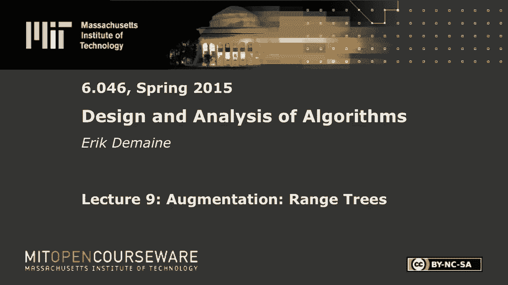
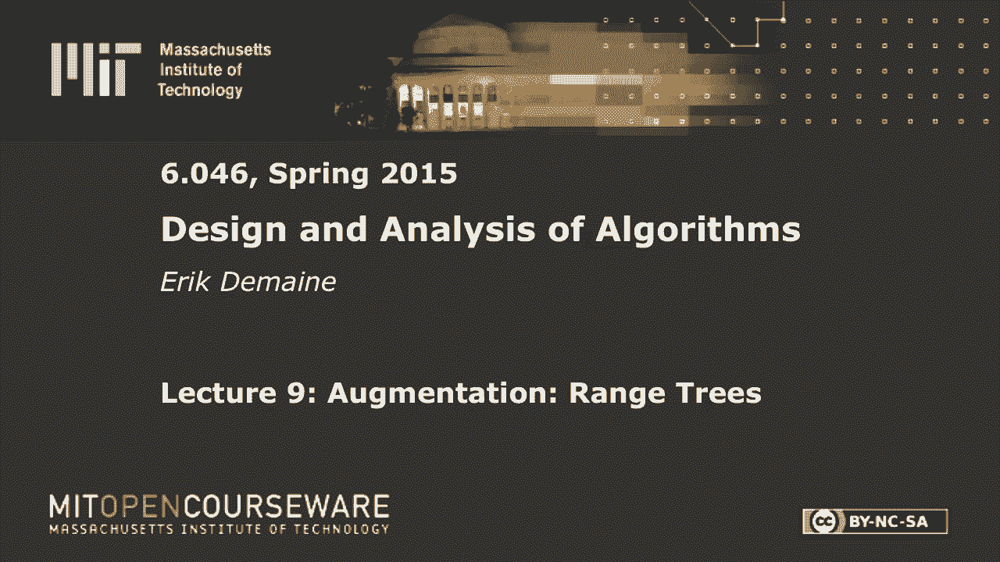

# 数据结构与算法设计：L9：范围树 🌳







在本节课中，我们将学习数据结构增强技术，特别是如何通过增强现有数据结构（如平衡搜索树）来支持更复杂的查询操作。我们将从简单的子树大小增强开始，逐步深入到更复杂的应用，如手指搜索和正交范围搜索。最后，我们将重点学习**范围树**，这是一种用于高效解决多维正交范围查询问题的强大数据结构。

---

## 简单树增强 📈

上一节我们介绍了数据结构增强的基本概念。本节中，我们来看看一个具体的简单增强例子：为每个节点存储其子树的大小。

简单树增强的核心思想是，在一个平衡搜索树（如AVL树或2-3树）的每个节点`x`上，额外存储一个函数`f`的值，该值基于以`x`为根的子树计算得出。我们将其存储在字段`x.f`中。

为了使增强可行，我们需要一个关键条件：节点`x`的`x.f`值必须能够仅根据其子节点的`f`值，在常数时间内计算出来。用公式表示，对于二叉树：
```
x.f = x.left.f + x.right.f + 1  // 以子树大小为例
```
对于有固定数量子节点的树（如2-3树），计算方式类似，只需对每个子节点的`f`值求和。

当树的结构因插入、删除或旋转而改变时，只有那些发生变化的节点及其所有祖先节点的`f`值需要更新。在平衡搜索树中，从任何节点到根的路径长度是`O(log n)`，因此每次更新的总开销仅为`O(log n)`。

**一个重要的应用是顺序统计树**。通过将`f`定义为子树大小（`size`），我们可以在`O(log n)`时间内支持以下操作：
*   **`RANK(x)`**：查询键`x`的排名（即它在所有键中的排序位置）。
*   **`SELECT(i)`**：查询排名为`i`的键。

以下是计算`RANK(x)`的算法思路：从节点`x`开始，向根节点遍历。每当从一个节点`z`向左移动到其父节点时（意味着`z`是其父节点的右孩子），就将`z`的左子树大小加1计入总数。最后加上`x`本身。

以下是`SELECT(i)`的算法思路：从根节点开始，设当前节点为`x`，其左子树大小为`left_size`。`x`的排名为`left_size + 1`。
*   如果 `i == left_size + 1`，则返回`x`。
*   如果 `i < left_size + 1`，则在左子树中递归查找排名`i`。
*   如果 `i > left_size + 1`，则在右子树中递归查找排名 `i - (left_size + 1)`。

**需要注意的是**，并非所有函数都易于维护。例如，维护每个节点的深度（从根节点算起的距离）就很困难，因为一次旋转可能导致大量节点的深度发生变化。

---

## 手指搜索 👆

上一节我们学习了如何通过简单增强来支持排名和选择操作。本节中，我们来看看一种更复杂的增强，旨在实现**手指搜索**属性。

手指搜索的目标是：假设我们刚刚找到了键`y`所在的节点，现在要搜索另一个键`x`。我们希望搜索时间与`x`和`y`在排序顺序中的“距离”`d = |RANK(x) - RANK(y)|`呈对数关系，即`O(log d)`。当`x`和`y`很近时（例如后继关系），这比标准的`O(log n)`搜索快得多。

为了实现这一属性，我们需要对数据结构进行两项增强：
1.  **水平链接**：在2-3树（或B+树）中，除了父子指针，在同一层的所有节点之间增加双向链表指针。
2.  **数据存储在叶子节点**：所有键值仅存储在叶子节点中，内部节点只用于路由。

此外，我们还需要一个简单增强：在每个节点存储其子树中的最小键（`min`）和最大键（`max`）。

**手指搜索算法**如下：
1.  从包含`y`的叶子节点`v`开始。
2.  循环执行以下步骤，直到当前节点`v`的键范围`[v.min, v.max]`包含目标键`x`：
    *   如果 `x < v.min`，则令 `v = v.left_level_link`（跟随水平左指针）。
    *   如果 `x > v.max`，则令 `v = v.right_level_link`（跟随水平右指针）。
    *   然后，令 `v = v.parent`（上移到父节点）。
3.  一旦找到键范围包含`x`的节点`v`，就在以`v`为根的子树中执行一次常规的向下搜索，找到`x`。

**算法分析**：在循环的第`k`步，我们至少跳过了`2^k`个键（因为2-3树是分支因子为2-3的树）。为了跳过`d`个键，我们最多需要`O(log d)`步循环。最后的向下搜索也在`O(log d)`时间内完成。因此，总时间复杂度为`O(log d)`。

---

## 范围树 🔲

上一节我们实现了在近邻搜索中表现优异的手指搜索。本节中，我们来看一个用于解决**正交范围查询**问题的强大数据结构——范围树。

**问题定义**：在`d`维空间中，给定一个静态的点集。查询是一个`d`维的轴对齐矩形（盒子）。我们需要高效地回答：
*   盒中有多少点？
*   列出（或找到前`k`个）盒中的点。

**目标**：预处理点集，使得查询时间达到`O(log^d n + k)`，其中`k`是输出点的数量。

### 一维范围查询

首先，考虑一维情况（`d=1`）。查询是一个区间`[a, b]`。
我们可以使用一棵平衡二叉搜索树（按点坐标排序）。进行范围查询`[a, b]`的算法如下：
1.  分别查找`a`和`b`在树中的位置（或前驱/后继）。
2.  找到`a`和`b`对应路径的**最低公共祖先（LCA）**。
3.  从`a`点向上走到LCA，对于路径上的每个节点，如果它是其父节点的**左孩子**，则将其**右子树**中的所有点加入答案。
4.  从`b`点向上走到LCA，对于路径上的每个节点，如果它是其父节点的**右孩子**，则将其**左子树**中的所有点加入答案。
5.  如果区间是闭区间，还需检查`a`和`b`节点本身。

这个算法返回一个隐式答案：`O(log n)`个完整的子树和`O(log n)`个单独节点。通过预先增强子树大小，我们可以在`O(log n)`时间内计算出答案的总数`k`。要实际列出前`k`个点，只需中序遍历这些子树，耗时`O(k)`。

### 二维范围查询

现在扩展到二维（`d=2`）。每个点有坐标`(x, y)`。查询是一个矩形`[x1, x2] × [y1, y2]`。

**核心思想（分层结构）**：
1.  我们首先建立一棵主树（**x树**），它按照点的`x`坐标组织，与一维情况相同。
2.  对于**x树中的每个节点`v`**，我们关联一个辅助数据结构：一棵**y树**。这棵`y`树存储了以节点`v`为根的子树中**所有点**，但按照这些点的`y`坐标排序。

**查询过程**：
1.  在`x`树上执行一维范围查询`[x1, x2]`。如同之前一样，我们会得到`O(log n)`个“相关节点”（代表在`x`维度上完全落在区间内的子树）和一些单独节点。
2.  对于每个得到的“相关节点”`v`，我们不再需要检查其子树中的所有点（因为它们在`x`维度上都符合条件）。相反，我们访问与`v`关联的`y`树，并在`y`树上执行一维范围查询`[y1, y2]`，从而高效地找出在`y`维度上也符合条件的点。
3.  对于查询过程中遇到的单独节点，直接检查其`y`坐标是否在`[y1, y2]`内。

**复杂度分析**：
*   **查询时间**：在`x`树上有`O(log n)`个相关节点。对每个相关节点的`y`树进行查询需要`O(log n)`时间。因此，总查询时间为`O(log^2 n + k)`。
*   **空间复杂度**：每个点出现在`x`树的多个节点的`y`树中（具体来说，是它在`x`树中所有祖先节点对应的`y`树里）。由于`x`树深度为`O(log n)`，因此每个点被存储`O(log n)`次，总空间复杂度为`O(n log n)`。

### 更高维度

对于`d`维范围查询，我们可以递归地应用上述思想：
*   建立一棵主树（按第一维排序）。
*   每个节点关联一个`(d-1)`维的范围树（负责剩下的维度）。
查询时间将达到`O(log^d n + k)`，空间复杂度为`O(n log^{d-1} n)`。

---

## 总结 📝

本节课中我们一起学习了数据结构增强的强大技术。
1.  我们从**简单树增强**开始，通过维护子树大小，实现了顺序统计树，支持快速的`RANK`和`SELECT`操作。
2.  接着，我们探讨了**手指搜索**，通过为2-3树添加水平链接并将数据存储在叶子节点，实现了搜索时间与键之间距离的对数关系`O(log d)`。
3.  最后，我们深入研究了**范围树**，这是一种用于多维正交范围查询的分层数据结构。我们详细分析了其在一维和二维情况下的构建与查询过程，以及其`O(log^d n + k)`的查询时间复杂度和`O(n log^{d-1} n)`的空间复杂度。

这些增强技术展示了如何通过巧妙地组合和扩展基本数据结构，来解决日益复杂的查询问题，是算法设计中非常重要的范式。