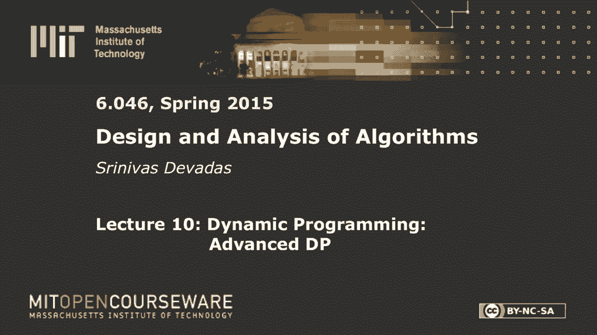
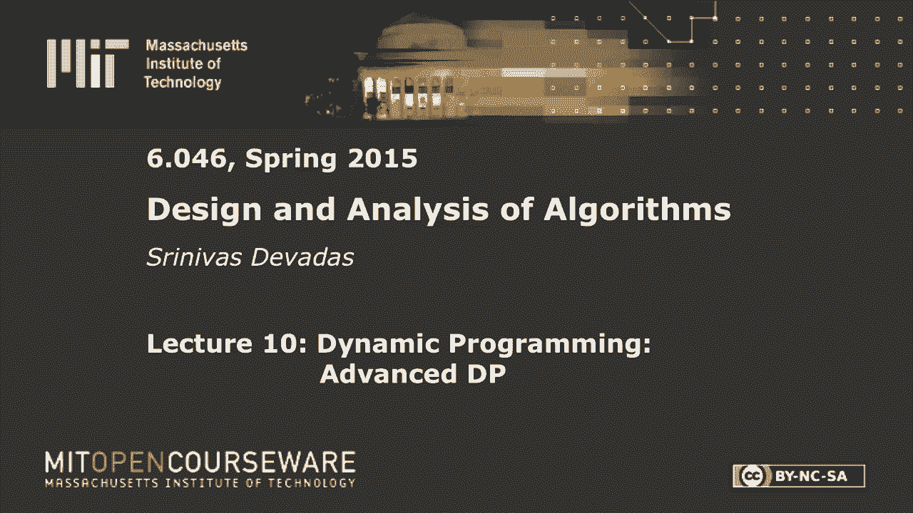
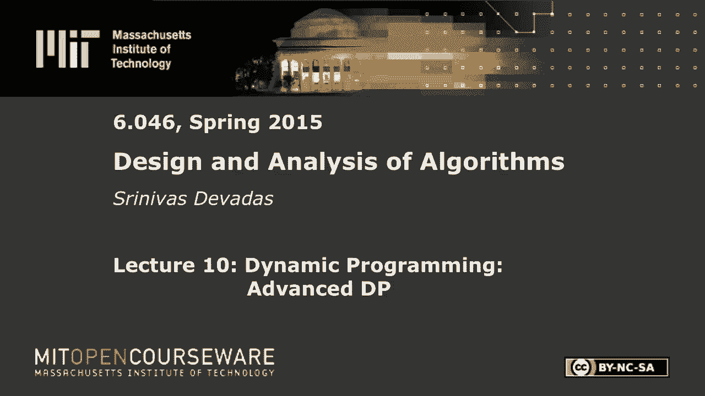
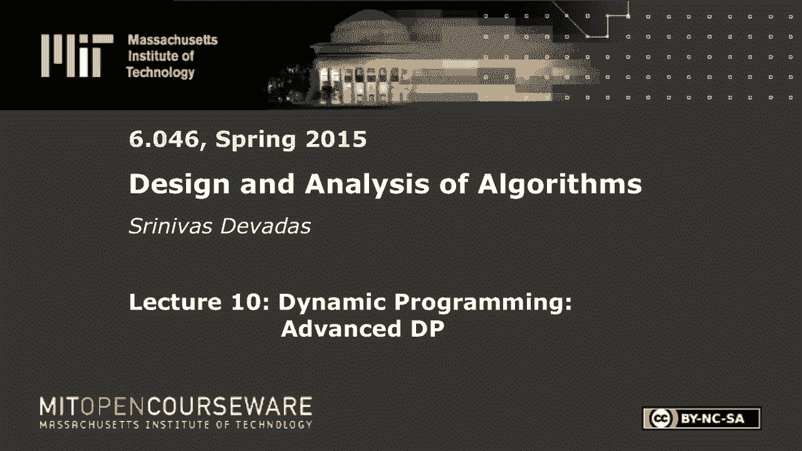

# 【双语字幕+资料下载】MIT 6.046J ｜ 数据结构与算法设计(2015·完整版) - P14：L10- 动态规划：高级DP - ShowMeAI - BV1sf4y1H7vb

以下内容是根据知识共享许可提供的，您的支持将有助于麻省理工学院开放课件。

继续免费提供优质教育资源。

捐赠或查看麻省理工学院数百门课程中的额外材料。

所有的权利，早上好，感谢大家今天能来，我得找个人扔飞盘，你知道空椅子很难，所以我们要做动态编程，你在六六中学到的一个概念，今天我们来看三个不同的例子，第一个真的是双六的水平，一个可爱的小问题。

在更长的序列中，有时被称为最长回文子序列，就像我们将要谈论的那样，子序列意味着它可以是不连续的，所以你可以跳过一系列字母，你仍然会有一个相应的后续，不必是连续的，然后我们会把赌注提高一点。

所以这些问题中的每一个都变得越来越复杂，更复杂，你可能会在这里看到问题，至少，超过双O六的交替硬币游戏，从某种意义上说，它没有被覆盖，这些概念在《双O六》中没有涵盖，所以就复习而言，我把这个写在这里。

因为我不想在这上面花很多时间，这是你应该熟悉的东西，从朗诵中，比如说，你星期五吃的，从双O六动态编程是这个奇妙的锤子，这是一种算法技术，你可以用来解决你知道的问题，复杂度呈指数级，但是如果你能找到与。

问题及其与子问题的联系，如果你能描述这一点，然后您可以对问题进行递归分解，在那里你可以从子问题构造最优解，这真的是关键的一步，在动态编程中是第二步，你知道的，一旦你做了这个刻画，在那里你写出了这个递归。

一个较大的问题到子问题的最佳值，计算最优解的值，这种记忆真的给了你高效的算法，因为你不重复子问题的解，您也可以以迭代的方式这样做，本质上，你将自下而上地计算东西，当你写你的复发时。

你可能想把它看作是自上而下的，但最终当你实际执行程序时，你将自下而上地计算东西，你要检查备忘表，看看你以前是否真的解决过这个问题，这将是递归记忆的情况，那个，在某种意义上，更容易思考。

并直接从复发中翻译出来，但另一种方法是迭代地进行，我们来看看第一个问题，关于你如何做两种不同的方式，至少从概念的角度来看，即使我可能不会为每一种情况写出代码，所以这里有几个选择，递归和记忆。

或者本质上迭代地做，在这两种方法中，较小的子问题都必须首先计算，有时我们不会花很多时间在上面的一件事，这最后一步，得到精确的解，所以很多时候你会停止说，我可以计算出最优解的值。

以最长回文序列的长度表示的值，七九个，但那是什么--一个需要一些额外编码的序列或子序列，一些额外的会计，这个最优解的构造通常需要一些回溯和一些信息，它一直在跟踪，在递归备忘录或迭代步骤中，对呀。

所以这是要记住的，你一次也没做完，你找到了最优解的值，更多的时候，你希望解决方案是正确的，所以我们也会讨论这个，一点点，但让我们潜入水中，看看这个可爱的小问题，回文，当然。

阅读相同的前面到后面或后面到前面，雷达是回文，就像一个微不足道的例子，单个字母是回文，也许我应该用一个，因为那实际上是一个词，但你知道在这里我得到了BB，这绝对不是一个词，至少一个字也没有，那个缩写。

也许雷达是一个回文，我能在这里吗，我看到肘部了，那是回文，这当然不是一个词，但这是一个著名的回文，拿破仑时代，但我们在这里要做的是，我们有回文的概念，我们想在更长的单词或更长的序列中发现回文。

所以我们有一根绳子，我们称它为x 1到n n大于或等于1，我们想找到最长的回文，这里有一个例子让你们热身，我们一会儿就会有几个谜题，所以字符和你想找到最长的回文，所以你去，我选C，我跳过H，我会选一个。

我选r a和c，克拉克，我想这也不是一个词，但它是最长的，对应于字符子序列的回文，对呀，所以这里的游戏，大家可以看到，就是选择我形成回文的字母，扔掉那些不好的，我们必须使用动态编程来做到这一点。

答案的长度将大于一个，因为我们把一个字母定义为回文，对呀，所以它必须是，如果输入中有一个字母，嗯，你只要挑那封信，但不管你输入的字母有多少个大于或等于1，你知道你至少会收到一个字母，输出端的回文。

所以我们开始了，假设我有下面，这要感谢埃里克，这里有几句好话，给我最长回文和飞盘的人不合格，如果你想在接下来的两分钟内编写动态编程，并在你的笔记本电脑上运行它，那对我来说完全没问题，那不是作弊。

所以U是回文，所以我们做对了，所以一个字母是肯定的，还有什么，最长的回文是什么，大声喊出来，去吧，去吧，大声喊出来，dei井，很快就被挑战了，这是正确的，所以说，好吧，我做的是让某人，我有一个神。

原来是你，你们几个，你有飞盘吗，然而好吧，所有的权利，这有点难，我昨天给我女儿试穿了这件，所以我知道这有点难，对呀，对呀，我们称之为一个词，涡轮呼吸机大声喊出来，对不起转子，好的，嗯，那是五个。

有人能打败那个旋转器吗，所以旋转器旋转器对，旋转肌很好，谁是旋转者，所有的权利，你可不可以，你已经有一个了，我想扔这个，和测验的人练习得很好，测验的良好练习否，我不知道这些问答笑话从来都不顺利，你知道。

我已经教了二十七年书了，我到现在还不知道，你不能拿考试开玩笑，但在测验中没有这样的东西，我不想让你研究词库，在接下来的几个小时里，与教科书相反，好的，测验中没有这样的，所有的权利，你们这些想念蟒蛇的人。

他喜欢蟒蛇的六个双O六个，让我们谈谈如何使用动态编程来解决这个问题，所以我们想要的是IJ，这是最长的长度，对于x ij，我们将有i小于或等于j，所以这就是我们要计算的，本质上，当我在这里说这些的时候。

当我有Lij的时候，我把整个问题分解为子问题。在这种情况下，这是相当明显的，因为我得按顺序走，对呀，我是说这就是限制，子序列确实维护排序约束，我没法把这些字母颠倒过来，那将是一个不同的问题。

如果我允许你那样做，所以我要从某个地方开始，我会在某个地方结束，我希望有一个非空的子序列，所以i小于等于j，我很擅长，i等于j，因为我还有一个字母正好是回文，它的长度是一个，对呀，那是我的Lij。

我想做的是定义一个递归算法，计算Lij好吧，所以我们会试着弄清楚复发是什么样子的，然后我们可以谈论记忆或迭代，所以如果i等于，等于j，那我就去还一个，因为我知道默认情况下这是回文，所以这很容易。

你认为下一张支票应该是多少，如果我看这个X序列，I作为起点，j作为下一个点，一旦我有了，如果i不等于j，你只是想看看，您只是检查这两个端点是否相等，因为如果他们是平等的，说你要看一个更小的。

给你一个回文，你可以把这两个字母加起来，在计算的回文的两边相等，自随后，所以如果i中的x，等于，等于j的x，i加1等于，等于j，我要继续回去，因为在这一点上，我做了，没有别的事可做了，我将返回2加1。

我加一，j减去右一，所以我要看看里面，我在两边找到了这两个字母，平等的，所以我总是可以预先结束回文，我从这儿收到了这封信。我从这里的这个数量得到的，所以到目前为止，这不是真的特别有趣。

从构造最优解的角度出发，但是我们这里的最后一行，我们有两个字母不相等的情况，是最有趣的代码行，这是该算法最有趣的方面，对呀，所以有人想告诉我这里会有哪条线，是啊，是啊，去吧，max，漂亮，完全正确。

所以你要做的是，你会说，我需要看两个不同的子问题，我需要评估这两个子问题第一个子问题是，我要看这两个字母是不一样的，我将不得不放弃他们中的一个，我要看看里面，我要说，在这种情况下，我将去掉第i个字母。

我会得到l i加1 j，在第二种情况下，我将去掉第j个字母，我会得到ij减去1，就是这样，所以是最大值，这里没有添加任何内容，因为那两封信，其中一个不得不被扔下，他们不平等。

所以他们中的一个不得不被扔下，所以你没有添加任何东西，对呀，所以这很好，在这一点上，你做得很好，嗯，哦，接得好，但你确实掉了东西，所以好吧，所以这个，我们在这里做的是第三步，对呀，所以我想说清楚。

就这张图表而言，我们还没有完成，因为我们没有相应的代码，顺序右，所以没那么难，你可以突然间我会在笔记里看到它，但你需要一点追溯，在这个递归中实际计算事物，我在上面写的东西有多复杂，虽然，是啊，是啊。

θn平方，人们是否同意复杂度是θn的平方，还是这位先生是个乐观主义者，这是复杂度θn的平方吗，告诉我为什么复杂度是θn的平方问题，代码就在那里，就做我自己，然后是绝对的，但如果你真的实现了这段代码。

并运行了它，N是100，您要等待多长时间才能完成此代码，你看它，缓存中缺少了什么，这是个诡计问题，好的，所以没有递归，对不起，这里有递归，但没有记忆，对呀，所以这是指数复杂度，你会复发，事实上。

它的递推是n的t等于1，如果n等于1和2 t n减去1，如果n大于一，现在的复杂度是2升到n减1，有一行代码，你们都知道这会解决这个问题，这一行代码只是说，Lij和我写的不一样，我现在把它叫做二维数组。

所以这就是为什么我有开放的括号和封闭的括号，所以我在这里超载了，但它是一个二，D数组，它本质上是子问题解决方案值的缓存，然后如果你想做，回溯以实际计算解，你当然可以把它作为一个额外的记录。

这与这个相同的值有关，但这是一个实现，我们不会真的去那里，所以看看Lij，不要递归，如果我，j，已计算，所以现在记住这一点很重要，如果你真的把它放在缓存查找中，哈希表查找，数组查找，不管你怎么称呼它。

然后你说的完全正确，对呀，所以我们的，计算DP的复杂度，你已经见过很多次了，我在第一节课上也提到过，是子问题的数量，每个子问题，小一点的，都解决了，或者查找是命令一，所以抬起头来，现在你可以说哈希表。

查找平均顺序为1，等等，等等，所以在最坏的情况下会发生什么，在这种特殊情况下，在大多数DPS中，你可以做一些事情，比如完美的缓存，或者更简单的东西，在这种情况下，它只是一个二维数组，不会有任何碰撞。

如果您只使用i和j作为数组的索引，所以在这种情况下，你肯定会得到一个查询订单，我们在零六看到的大多数问题，所以如果你只是做这个计算，那个，我的朋友刚刚描述了你确实得到了你的θn平方。

因为你有θn平方子问题，解决每个子问题的时间，考虑到较小的问题被解决了，只是一个最大值的a的计算，此外，对呀，所以所有这些都是θ，一个，对呀，因为您没有计算递归调用，好的，所以说，这是我们的第一个例子。

我受够了，对此有什么问题吗，关于DP的一般问题吗，所有的权利，好，所以有一点回顾，不是一个特别复杂的问题，让我们转到与最优二叉搜索树相对应的另一个问题，这是一个非常不同的问题，我想我不再需要这个了。

它有自己的可爱之处，这个问题有趣的一点是，贪婪的算法似乎应该起作用，我们会谈谈的，为什么你知道的贪婪算法不太有效，所以这有点类似于间隔调度，与加权区间调度，我们在二月份遇到的一个问题。

其中规则间隔调度问题，贪婪的工作最早完成时间工作，但说到重量，我们必须毕业到动态编程，所以这是我们的第二个问题，最佳bds，那么什么是最佳的BSD，我们有一堆钥匙要存储在BSD中，K 1到K n。

我们假设这是建立的方式，就是k 1小于k 2 da da小于kn，只是为了让我们的生活在我们的例子中更容易，我们就假设K i等于，i，这不一定是任何事情所必需的，我们接下来要做的。

只是为了举例说明和保持事情的可管理性，所以我有一堆钥匙，很明显，有许多不同的二分搜索树可以来，他们是平衡的还是不平衡的，许多不同的二叉搜索树可以与给定的一组键一致，对，如果我选择根KN。

然后我会得到这个可怕的不平衡的树，如果我选择根在中间的某个地方，那我就去买件好看点的，至少在高层，但如果我在下一个层次搞砸了，我会得到一些不平衡的东西，所以很明显有很多不同的BD。

我不是在这里说平衡的BDS，但我们要定义一个最优性准则，这和平衡的BDS有点不同，因为它会有这个额外的，与之相关联的成本函数，与键的重量相对应，好的，那是什么，好吧，我会有。

与这些对应于w 1到w n的键相关联，激励你的最简单的方法，认为这些权重是这个问题的一个有趣的补充是，把这些权重看作是搜索概率，为了争论起见，你有什么，是您创建的静态结构，我是说你可以修改它。

没有什么能阻止你做那件事，但让我们暂时假设它是一个静态结构，对应于这个BSD有一个特殊的结构，很可能你会比其他的更频繁地搜索一些钥匙，W告诉你概率是多少，在搜索特定的密钥方面，K i对，所以你可以想象。

我们这里不会有这个，你拿着，这一切都归结为一个，如果你想把它们看作概率，或者你可以，我只是要给你数字，我不想处理分数，现在不特别喜欢分数，所以你可以想象每个概率对应于wi，除以所有w的和。

如果你想让所有的概率加起来为一，好的，但把它们看作搜索概率，因为这样你就会明白这个练习的重点是什么，在这个练习的重点是找到BST T，所以我们实际上在这里构造了一个二分搜索树，所以这比后续更有趣。

比如说，它有一个更丰富的结构与之相关联，与，一组给定的n个键，它们都是，你知道的，一致的二叉搜索树，不平衡，平衡，你知道的，在一个方面与另一个方面不平衡，等等，等等。

所以我们想找到一个二叉搜索树T最小化，i等于1到n，很明显我们要有这个WI，这就是这里的深度游戏，在T中，所以这个深度是为了那个T，节点的深度和i的k是多少，我会解释这到底是什么。

我告诉你深度到底是多少，但粗略地说根部的深度，不粗略地说，根的深度为零，根部以下的深度是1以此类推，等等，所以你可以看到你想做的是收集，粗略地说，你想要收集的高权重节点是有低深度的，对，如果WI很高。

你想要与该节点深度t相对应的乘法因子，i节点要小，如果WI很小，那你就不属于我，的，数字更高，您只有一定数量的低深度节点，你只有一个深度为零的节点，你有两个深度节点--一个，这意味着你只有一个节点。

在这个节点上，这个量将是一个，因为你在做零加一，你有两个节点，数量是两个，等等，等等，所以这里有一些空间可以玩，对应于BSD结构，你想最小化这个数量，所以搜索概率将是一个例子，所以就更具体的应用而言。

你可以想象你有一本字典，英语转法语，法语转英语，你有什么，它们显然是更常见的词，让我们说，在共同语言中比其他人，您确实希望使用这种数据结构以动态的方式进行转换，你可以想象在这种情况下。

一个词的搜索概率与该词的出现有关，在一些归一化的次数上，这个特定单词出现的一些单词，这将是这将是方式，所以创建一个最小化功能的结构是有意义的，因为当你想把整篇文章拿出来时。

我们会最大限度地减少预期的搜索成本，比如说，并把它从英语转换成法语，反之亦然，所以这个可以，如果这些是搜索概率，那么这将使成本最小化，这里的函数将最小化，有道理，好的，这就是问题的定义。

现在我们要谈谈为什么这很复杂，为什么这需要动态编程，为什么我们不能做一些相当简单的事情呢？就像一个，就像贪婪的算法，所以让我们调查一下，让我给你一个很好的感觉这里发生了什么，关于这个成本函数。

通过给你几个具体的例子，也许有点抽象，首先，我们有指数级的树，指数，n，假设n等于2，所以节点数是两个，记住，我假设KIS是所有的眼睛，那是1，2是n等于2的情况，一二三n等于三，等。

所以我可以有一棵像那样的树，我可以有一棵像这样的树，就是这样n等于二，我猜对了两棵树，在这种情况下，我的成本函数是，在这种情况下，我的成本函数是，好的，只是想说清楚，这是K，也是I。

所以你在里面看到的数字，这些是我的数字，恰好等于k i数n，重量本身就是WI，所以我在这里放了一个，它只乘以1的原因是因为这里的深度为零，我加了一个，这里的深度是一个，我加了一个。

这就是为什么我有一个二在这里，好的，我有点，在这里迂腐，指出事情，因为你会开始看到一些比这更复杂的方程，我不想让你感到困惑，重量是多少关键数字是多少深度是多少，这里有三件事，好的。

所以在这里你看到我得到了，我在看这里有一个，就是这个键对吧，所以这个是对应的，这个有一个深度，所以我在这里加了一个二，以此类推，好吧，到目前为止，一切都好，当你得到n等于3时，你开始康复。

你有你有在这一点上，你有一二三四五，你有五棵树，树看起来是这样的，我很快就会画出来，只是为了感受一下这里的多样性，但我不会把他们所有人的方程都写下来，给你，这些是与n相关联的五棵二叉树，等于三。

二分搜索树，这有点酷，它很好，很平衡，你知道其他的不是，我不是，我不是在看，还是我应该在这里再来一个，我想我应该，这是一个哦不不，所以我不做镜子，所以有一堆其他的树，具有相同的方程与两个，否。

那不是真的，因为这些是红色的，我想说你可以在这里放三个，但那不是二分搜索树，就是这里，我们有一堆树，这个是2w一加w二加2w三，通过我以前给你看的同样的过程，对于n等于2的情况，你就这么走了。

这就是等式，所以你在算法中的目标，很明显，这不是算法，您希望枚举所有指数多树，计算每一棵树的方程并选择最小值，我的意思是，这将工作，但这需要指数级的时间，对就这样就这样，但这就是你现在要做的。

这就是目标，你绝对想要，对于给定的树，最好的树，你将被分配为常数，你确实想找到一个树的最小和，你想对任意n这样做，你想在多项式时间内做到这一点，好的你要做的第一件事。

忘记了我们在一个动态编程讲座中的事实，或者该类的动态编程模块，当您看到这样的问题时，所以在现实世界中，您需要考虑贪婪算法是否有效，你不想去构建这个动态的程序解决方案，也就是说。

机会会比贪婪的解决方案更低效，那个，如果它产生了最佳答案，那就是最好的方法，所以我，一个明显的贪婪解决方案是选择r中的k，取r中的k的明显方法是什么，试图得到一个贪婪的解决方案，至少试图最小化成本函数。

我们有最高的重量，对呀，所以只要选r中的k作为最高权重，因为这又回到了我说的，如果WI很高，你希望这里的值很小，对呀，所以这本质上是你贪婪的启发式，所以R中的K应该以贪婪的方式挑选。

所以你要做的就是选择r中的k作为这个问题的根，您当然可以递归地应用这种贪婪的技术，好的，所以你对你发现的每一个子问题都这样做，因为当您在当前问题中选择kr的根时，你立刻把钥匙分成两组，对呀。

必须放在KR左手边的集合，和KR右手边的布景，所以在这种情况下，你知道你会有一堆钥匙，对应于，k，i，你会有KR减一，我应该说，因为你已经有KR了，这里的键是kr加1，我要说的是，i，j。

所以我已经为动态编程做好了准备，但在贪婪算法的情况下也是有意义的，在这里，这个贪婪的启发式将递归地应用，所以一开始你会有一个对的，所以如果我们要计算e n，它是原始问题上最优BST的成本，所有的权利。

从1一直到N，你要看着它，你会说我这里有一堆钥匙，对应于k 1到k n的不同权重，我要选择与最大重量相对应的KR，我将用它作为根节点，我要把它贴在上面，我这么做的原因。

是因为我相信这种贪婪的启发式会在哪里奏效，这个最大权重节点应该具有绝对最小深度，好的，所以我把它贴在上面，然后我的dsst不变量告诉我，记住这些是排序的，按递增顺序，就像我在这里一样，你会有那些在左边。

你有，你会有那些在右边，然后你得去解决这个问题，你当然可以应用贪婪的启发式来解决这个问题，你可以从本质上找到权重最高的k，所以你看WI通过WR减去一，你找到权重最高的K，对，所以你不会去中途。

很有可能kr是n的k，好的，只是碰巧是KR是N的K，所以这意味着你在这里有最高权重的节点，但这也是最大的关键，所以所有的节点都在左边，所以这种贪婪的启发式，现在你开始看到，也许这里有问题。

因为如果你有这样的情况，权重节点也是最大的节点，你会得到一棵相当不平衡的树，好吧，所以我可以告诉你贪婪是行不通的，当我做这个讲座的时候，我想是几年前的事了，我做了那个声明，这个讨厌的学生问我举个例子。

好吧，我想不出一个，所以我在此基础上，继续完全不满意，当然啦，在讲座结束时，同一个学生想出了一个反例，对呀，所以我得把它放在这里，并感谢给我寄了一个，关于它的电子邮件，这里有一个具体的例子，事实证明。

我试图在几分钟内得到一个三节点的示例，我认为不可能，我还没有证明这一点，以找到一个具有任意权重的三节点示例，贪婪算法失败的，但它失败了四个节点，好的，所以这是个好消息，所以这里有，下面是一个例子。

多亏了米克·戴维斯，它看起来是这样的，所以我声称给我的问题的贪婪算法，会产生，对，原因很简单，权重最高的节点恰好是节点二，它有十个重量，所以我会把它捡起来，然后把它粘在这里，也就是说，当然。

我必须在这边有一个，我将不得不在另一边有四个和三个，因为四个的重量比较大，然后三个我会先选那个然后三个会在这里，所以如果我去算算，成本将是1乘以2，我会解释这些数字是什么，我告诉过你，会变得有点。

这里有很多乱七八糟的数字，但如果你记住这个等式，那么这一切都应该解决了，我这里有什么，我只是在计算，这是W一个，所以你可以看到每个数字中的第一个数字是权重，所以这将是两个等等，你可以看到这是在一个深度。

一个，这意味着我必须有两个在这里，因为我在深度上加了一个，所以我有一乘以二，十乘一，因为这是最根本的，九乘以二等等，我得到了我得到了54，结果是你能做的最佳树，你可以做得更好，如果你选三个。

所以你在这里得到的是成本等于1乘以3，加十乘二，加8乘以1加9乘以2，那就是四十九，所以我让你看看，底线是，因为这里的重量设置方式，你真的想用前三名的位置，对于权重最高的节点，深度最小，好的。

所以你可以看到我可以做这个，任意，很明显，我可以破解贪婪的算法，正如这个小例子所示，所以我们这里没有复发，我们得做更多的工作，我们将不得不用dp来解决这个问题，所以让我们来看看分解，和其他任何事情一样。

关键是将原始问题分成两部分的步骤，或更多，本质上给你这种分解，我们还不太清楚，所以这真的是这里的关键问题，我们不太知道根节点是什么，所以当我们不知道该做什么的时候，我们该做什么，我们在DP做什么。

当我们不知道该做什么的时候，这是一个非常深刻的问题，你是做什么的，你猜，你不仅猜测，你猜所有的结果，你说，它会出现正面吗，它是尾巴吗，我猜你们两个都死了，它将被滚动一，二，三，四，五，六，猜猜他们好吧。

所以我们得猜测，根节点可以是，任何钥匙，对，它仍然，我是说有线性数量的猜测，在那里，这是好消息，它将停留一个多项式时间，好的，所以我们要猜，一旦你这么做了，猜猜，事实证明。

你在上面看到的分解正是我们想要的，只是，贪婪的算法没有费心进行所有这些不同的猜测，DP与贪婪算法不同，因为它会做每一个猜测，他会挑最好的，从所有这些猜测中产生的，对呀，所以这真的和贪婪没有什么不同。

所以我们会把它放在上面，我把它留在这里，我们到这里来，所以这里的递归不会那么难，一旦你，得到了洞察力，你只需要去，对特定子问题的根节点进行线性数量的猜测，很明显，这是递归发生的，所以这里有一点微妙。

关于写这些方程，我会指出，所以我这里有什么，我想说清楚的是我在上面写的，即使我在谈论贪婪算法的时候，我定义了子问题，所以最初的问题是e到n，子问题对应于E I，j并给出一个子问题，一旦我做了根选择。

我得到两个由根选择产生的子问题，好的，这两个子问题中的每一个都是，这是需要记住的，当我们写出这些方程时，它们将在根下一层，好的，所以请记住，最初的EJ子问题对应于这个级别，但是E I，r减去一个问题。

E R加一J问题在下面的一个层次上，好的，所以当我们写出这些方程时，请记住这一点，我想在这里写的是递归，在那之后，事情变得相当机械，乐趣在于反复，对呀，所以我得到了WI，如果i等于，j。

所以我在这个水平，如果我只剩下一个节点，然后在这个水平上，我将支付与该节点相关的权重，我要在这里做一定数量的乘法，就深度而言，但我只是在说，e，j，子问题权重，专注于那个问题，所以如果我只有一个节点。

它是根节点，这个重量将是WI，因为根节点的深度为零，我要在上面加一个，所以对于那个潜艇问题，我得到了，我得到了WI好吧，记住这一点，因为这是关于这些方程的唯一微妙之处。

确保我们计算的实际成本函数是正确的，所以我们有线性猜测，我可能会说麦克斯，在某个时候，我们想在这里得到最小，我在这里最小化，所以我想我把事情写下来是正确的。

但在某种程度上我想我可能会说我们想要最大限度地降低成本，但我们确实想把成本降至最低，对应于搜索预期搜索，所以我们做了一个线性，我们做了一个min，我们要去看看每个不同的节点，作为根，就像我们讨论过的。

好的，我在这里要做的是，我只想说，首先我要看看，r减1，与此相对应，r的加e加一个逗号j，i，没有我想要的东西，因为我还没有考虑到我的深度，r减去1，r加上1，j比ij多一个，对吗，所以不止一个，对吧。

我也没有考虑到在这种情况下，我肯定还需要加一个WI，因为根节点在这两种情况下都是我解决方案的一部分，在一个案例中，它结束了我的解决方案，上面的箱子，但在这种情况下，它也是根节点，你可以在左边看到。

我得把它加进去，所以我肯定需要在这里加一个WI，好的，我还需要添加什么，从…，从重量的角度来看，其他重量有什么作用，我需要添加，是啊，是啊，你先走吧，首先，W应该是一个WR，你完全正确。

你想把所有的重量，对，你说得很对，我还有两个飞盘，但我需要用它们做别的事情，好吧，那下次给你一个，还是我有更多的不不，这些都是珍贵的飞盘，你知道，对不起伙计，你知道的，你也纠正了我，你知道射击，这是。

这太可悲了，所以这需要一个WR，好的，但您还需要添加这里的所有节点，因为他们多了一个级别，现在你明白我为什么犯错了吧，我通常不犯错误，但我真正想要的更像是，你知道的，每次讲座我都不认识几个。

你知道不断的顺序一个错误，我要说，这是wi逗号j，所有的权利，其中wi逗号j只是所有权重的和，从i到j ok，这很有道理，因为好的是，我甚至不需要在里面写R好吧，所以我可以选择一个特定的R。

WR会在里面，但无论如何，所有其他节点都将在那里，所以这里的r选择对应于这个项并不重要，虽然我会把它放在里面，最小化，这个托架和那个，但你可以把它拔出来，因为这不取决于R，它只是会在那里为所有的情况。

所有的猜测好吧，原来如此，那是，那是我们的复发关系，对应于DP，对于这个特殊的问题，你可以去弄清楚复杂性是什么，我还有其他事情要做，我们会继续前进，但你可以做同样的事情，这些都是相当机械的。

在这一点上去为它写代码，跟踪解得到最优二叉搜索树，亚达亚达亚达，关于这个等式或其他什么问题，人们明白吗，是啊，是啊，所以重量增加了深度，所以基本上发生的是，当我深入递归时，我在增加重量，可能会增加多次。

取决于深度，对呀，所以如果你真的想一想，这个w ij i加上了所有这些重量，但是当你进入这个递归，r减去一的ei，嗯，你会看到i到r减1，在下一个递归级别中，所以你会加上，你又知道重量了，对呀。

所以重量并不是只出现一次，事实上，他们已经出现过很多次了，这就是这个的可爱之处，我们写的方式，好的，我们已经结束了，最后一个例子，这与DP的例子又有点不同，到目前为止，我们一直在研究，因为这是个游戏。

你有一个对手你必须弄清楚对手会做什么，你知道，努力去争取胜利，我想你认为你也可以试着输，但让我们假设这里，最小化和最大化是一样的，大多数时候，你可以反转这些成本函数，DP仍然有效。

但让我们假设你想赢得这场比赛，所以这个游戏是一个交替硬币的游戏，其中我们有一排N个值的硬币，1到n，这些不一定是以任何特定的顺序，n是偶数，从行中，永久，但将其添加到您的价值中，并接收价值，所有的权利。

所以我需要两个志愿者来玩这个游戏你想让价值最大化，获胜者得到一个蓝色飞盘，失败者得到一个紫色飞盘，因为蓝色比紫色大，你可能会问为什么那口井，如果你去海滩，你看到这种颜色的水，你去了另一个海滩。

你看到了这种颜色的水，你会选择哪个海滩，这是科苏梅尔，这里是波士顿港，所以蓝色比紫色大，不要在测验中使用这种证明技巧，所有的权利，我有几个志愿者来玩这个游戏吗，那边有两个你在向他招手吗，是啊，是啊。

我看到一个你可以下来，这里还有一个，是的，在那边好的，所有的权利，你还没有得到你的第一台电脑，所以如果你想让这件事变得公平，你叫什么名字？约西亚，约西亚，泰莎，泰莎，约西亚和泰莎，我要写出一堆。

这将是一场相当短的比赛，好的，我们会很公平，我们将抛硬币决定乔赛亚是否先走，你可以挑头也可以挑尾，或者泰莎先走，你真的可以，如果你赢了，你可以先放她走，如果你想，但你可以选择好吧，所以挑，那是人头好吧。

你想先走吗？还是你想让苔莎先走，你应该先走，所有的权利，所以苔莎，你先来6，好的，所以让我们只说T，好的，所以你可以选择两个，五个或四个，约西亚，哦，我想我要两个五，你认为你会拿两个五，好的。

所以这是J好吧，所以现在这里降到了4和19，因为那些都没了，所以你的语气，好的，我能花一点时间吗，还是我应该，你可以拿着，你可以花三十秒，对呀，哈哈哈哈，四二好的，四二，这是一个奇怪的游戏。

好的好的现在，我们可以把数字加起来，这会很紧，好吧四加三九等于四三，四三加二五是六十八，四十二加十九等于六十一，六十一加六等于六十七，哦哦，所有的权利，嗯，你把飞盘弄对了，好吧好吧，蓝色给你。

我是说你可以给她蓝色，如果你喜欢，哦耶，你喜欢紫色，所有的权利，谢谢好的，干得好，我无意冒犯约西亚和苔莎，但这是一个典型的例子，说明如何不玩游戏，首先，约西亚本可以赢的，不管上面有多少硬币。

不管硬币的价值，如果他选择先走的话，所以这个游戏，2。谁先走，谁就保证不输钱，通过这一点，我是说你可能会有一个情况，你可以在价值方面打成平手，但你保证不会输，所以现在他最终还是赢了，因为还有其他错误。

在这期间，我没有时间一一列举，好的，所以我们要继续前进，做正确的事情，所有的权利，所以让我先告诉你DP之外的事情，以防你在春假期间玩这个游戏，你如何才能赢得这场比赛，我不用计算，你知道的，复杂递归记忆。

DP程序适合这种情况，好的，假设我有v1v2v3，一直到vn减去1和vn，记住，n是偶数，所以你必须在两个硬币中选择n，如果你是第一个玩家，如果你是第二个玩家，N超过2，然后嗯，那么第一个玩家做什么。

v取奇数，n是偶数，所以v减去1是奇数，把v1加v3一直算到，然后比较一下，用偶数位置v2加v4一直到vn，所以在这个特殊的例子中，嗯，但是如果你只是如果你只是看看奇怪的位置，事实上，这是他最终选择的。

是四加三九，加两块五，也就是六十八，所以你可以事先做这个计算，你计算一下这个是68，在我们的情况下，把它和67，好吧，你不放弃你的第一个玩家优势，所以你要和第一个玩家一起去。

但现在你说我知道我可以安排这个，这不是他这么做的命令，但我知道我可以安排好，所以我总是有机会得到V 1 V 3 V 5等等，因为我们只能说第一个球员乔赛亚先开始，在这种情况下。

他认为奇怪的价值观是可怕的权利，所以你选择，假设他在这一点上给我选了一个，特斯拉看到V 2通过V N对，所以你只是在看那个，特斯拉可以选v2或者vn，那样的话，约西亚，谁是第一个。

可以选择V3或VN减去1，并坚持他挑选奇数硬币的角色，所以不管泰莎在第一个玩家身上做了什么，乔赛亚可以挑，如果奇怪是要走的路，或者如果价值观是这样的，甚至是要走的路，他可以走得更好。

所以第一个输的玩家没有理由，但我只能说你是个讨厌的人，迈克尔·乔丹，讨厌的，你只想粉碎你的对手，你想确保他们再也不想玩你了，好的，所以现在你有一个最大化问题，所以这显然不是DP。

你不需要DP把一堆数字加起来，但假设你想给一套硬币，v1到vn，你想要一个策略，动态策略，有点束缚，因为你被困在这些位置上，在那种情况下很好，如果你只想赢，你不在乎如何赢，但如果你想最大化。

那么这是一个更复杂的问题，所以我们要谈谈你会怎么做，也许是V N和V 4，其他事情取决于价值观，你怎么会遇到这种情况，如果你是第一个玩家，我们就坚持，你是第一个，你知道用这种策略你不会输的。

但你不仅不想输，你想得到尽可能多的硬币，假设现在这是钱，钱越多越好，所以人们明白一点爱，小把戏，我想你可以想到一个贪婪的算法，或者它不是一个你可能想称之为算法的东西，我们现在的目标是最大化，钱的数量。

所以，这将与所有其他问题有点不同，我们已经看了，因为我们现在要考虑对手会怎么做，这里会有一系列的动作，对，你先走，所以那个很容易，你有整个问题，但现在你必须说对手要移动并选择一枚硬币。

然后你必须考虑你的子问题，因为潜在的硬币行将是不同的，取决于对手的所作所为，通过这个过程，你必须最大化价值，所以它与我们看到的其他几个例子非常不同，所以我们得做一点设置，在我们可以写这样的东西之前。

这是我们对DP的解决方案，所以让我做这个设置，但不是超级复杂，其中一部分看起来和以前的问题一样，我们已经看了，所以v j是最大值，所以我们有，v i，那就只剩下一枚硬币了，现在你需要这个，你可能会说嗯。

但那永远不会发生，如果硬币是偶数，我先下，因为另一个玩家将在，这将是挑最后一枚硬币的人，但我们需要描述vii，是因为我们需要模拟另一个玩家会做什么，所以我们不能就这么说，我们将看到偶数个硬币。

就你看到的那排硬币而言，这是真的，当你开始移动的时候，你只看到偶数的硬币，如果你是第一个玩家，但你必须模仿对手的所作所为，所以我们需要七，你可能会看到什么，当然啦，是一个看起来像VI的板，我加一。

我的意思是，它可能，为了一些武断的，我是对的，所以这就是我把它放在上面的原因，但请记住，你只是在外面捡硬币，所以你不会有差距，我是说你不会有左V3和右V7，那是不可能发生的，你只会一直缩小。

从左边或右边拿东西，所以应该是i和i加一，那是有道理的，所以在这种情况下，你会选择VI和I加1，你只要把最大值选对就行了，因为在这最后，2。你做对了还是做错了，你会改善你的处境。

通过选择vi或vi的最大值加1右，所以没有两件事，所以在这里你要挑，你可能有vi i加2，也就是奇数个硬币，你的对手可能会看到它对VI来说变得更加复杂，我加二，我们现在必须开始从更普遍的角度来思考。

至于什么不同的动作是对的，但我们这里有基本情况，我在这里所做的只是处理基本情况，或者与一枚硬币相关的几个基本案例，这就是你的对手会看到的，然后挑一两个硬币，这是你的最后一招，好的，所以用DP。

当然你总是要回到你的基本情况对吧，那是事情变得容易的时候，所以让我们来谈谈，如果我们必须谈论两件事，把我们的复发放在一起，我们要讨论的两件事是当你移动时你会做什么，这其实很容易。

第二件事是对手的模型是什么样子的，当你在等他或她搬家的时候，所以让我们来看看你的动作，我得到了V一，让我们看看VI，这里是VJ，点，点，点，对，这就是你所看到的，你在看i和j，在这一点上。

你看到了所有其他的硬币，外面的硬币不见了，我要写出VJ应该是什么，请记住，我们希望最大限度地增加资金，我们想说我们应该能够，一定能赢这么多钱，不管对手怎么做，我显然想做一个最大值，我有两个选择。

我可以选VI，或者我可以选择VJ，所以它不像，这里有很多选择，对吧，所以如果我选VI，那就让我继续说，这里选vi这里选vj，和呜呜，让我把这个画得更好一点，所以我必须最大限度地填写这两个参数。

所以这很容易，我这里有一个正VI，会有一个加VJ在这里，所以因为我选择了合适的值，现在这也没那么难了，到底发生了什么，我可以在这里放什么，如果我选vi加1到j，所以范围就变成了，i加上一个j。

我在这里得小心一点，就我是否能辩称，实际上是我放在这里的v，所以这里的微妙之处在于V，I加一个J不是我在我面前看到的东西，好的，这就是并发症，vi加一j从来不是我面前看到的板。

而VJ是我在我面前看到的一块板，所以我必须在我面前的板子上做模特，因为那些是我控制的董事会，那个，我可以最大限度地满足我的需要，我不能把，v，j，i，plus，one，j加进去。

只是因为我不太知道那是什么，因为我最终得到的不是我能控制的，这将是我的对手移动后的棋盘好吧，所以我要做的就是，我要说的范围，i加1 j，我马上要说点别的，这里的范围是一个，在这两种情况下，对手的动作。

所以为了真正写出我的DP，我现在得看看最坏的情况，就董事会而言，我回来了，因为我唯一加值的时候，当我看到面前有一块木板，我挑了一枚硬币，我不得不说，现在，对手会看到一个i加一个j或者一个i减去一个j。

减一，抱歉，打扰一下，这可能会有所帮助，我要拿回一些东西，我们假设对手也一样聪明，如我所知，DP取了六个比六个，等等，等等，我仍然想得到我肯定能赢的最大价值，好的，所以你需要看看里面，也没那么难。

如果你只是假设我刚刚做了，就是对手要，我是说，可能不一定做正确的事情，但你必须假设对手和你一样了解它，并将努力做得尽可能好，好的，所以我们就这么做吧，这是我们在这里必须做的最后一件事，这只是一个方程。

所以解决办法是这样的，我们现在有一个v i加1 j子问题，随着对手的挑选，简单的观察是，我们保证，最小，v i加一j减去一，v i加两个j，VJ，在这种情况下，对手采取，v i加一，你保证至少有这两个。

因为对手只能选一枚硬币，这是一个简单的观察，让你跳到前面，添加到您的下一步，因为那是你唯一一次真正执行某事，从棋盘上挑选硬币并增加你的价值，但我们确实必须建模，在这个动作之前你能赢得的最大价值是什么。

你在这里有最小的，因为你假设这是一个明确的保证，对呀，这就是我们想要的，对手有可能玩不同的游戏，从我们认为他或她要玩的那个，使他或她的价值最大化，但最小是保证，所以现在你已经做了这个观察，事实证明。

我们只需要把它，我们会做得很好，所以让我们看看，让我把这个擦掉，所以最后一组方程，它只是把这个观察插入到我以前写的东西中，所以我们有v ij等于max，这是我已经在上面的外部最大值。

所以这是相同的最大值，把这个巨大的支架放在这里，在里面，我要插上这个，这是与，在对手打出最好的招式后，我在最坏的情况下会赢的价值，那就是v i加1，加vi，这个vi和上面的这个一样，嗯。

你有一个加VJ在这里，我真的没有这么做，写出对手在另一个子问题情况下会做什么，但这真的很简单，您有一个与I相对应的问题，j减去一个问题，对手可以选择，或者可以选择J减去一，如果对手选择J减一。

你得到V i，j减去二，你需要考虑到这一点和另一种情况对手选择，i，在这种情况下你得到i加一j减去一，那是那是我们的DP，好的，所以这里最大的区别是你必须在中间做的建模，我们其实没必要这么做。

在任何DPS中，我们在零六已经报道过了，至少在我们谈论复杂性之前，这应该只需要一分钟，人们买那个看到那个，所以有了所有这些问题，复杂性计算起来相当简单，这里的复杂性又是简单的，与以前一样，子问题次数。

解决子问题所需的时间，你可以在这里看到这些都是常数时间操作，所以假设VJS已经计算好了，一次计算一个子问题，这就是你的θ，和以前一样，有n个平方子问题，所以让我们做一些子问题，也就是θn的平方。

所以这很好，所有的权利，所以祝你考试好运，不要太担心。