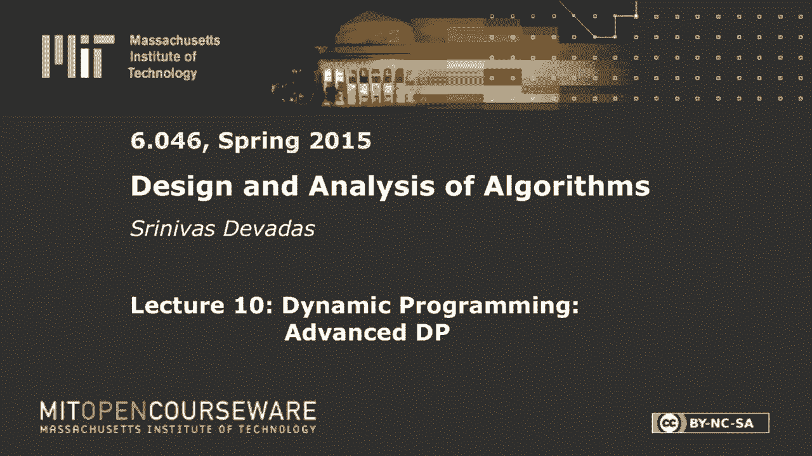
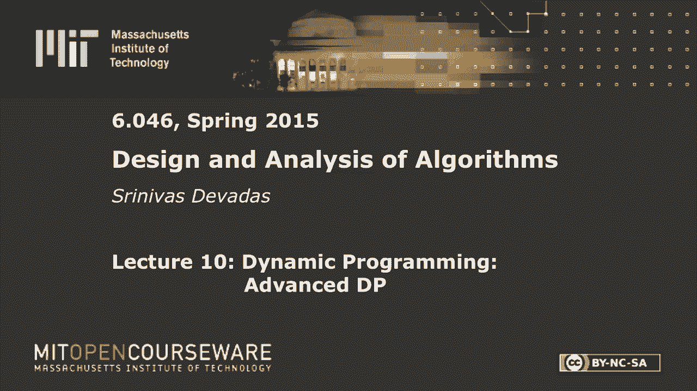
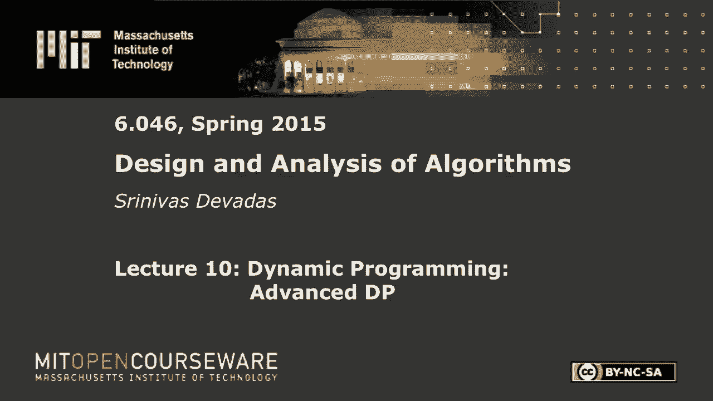
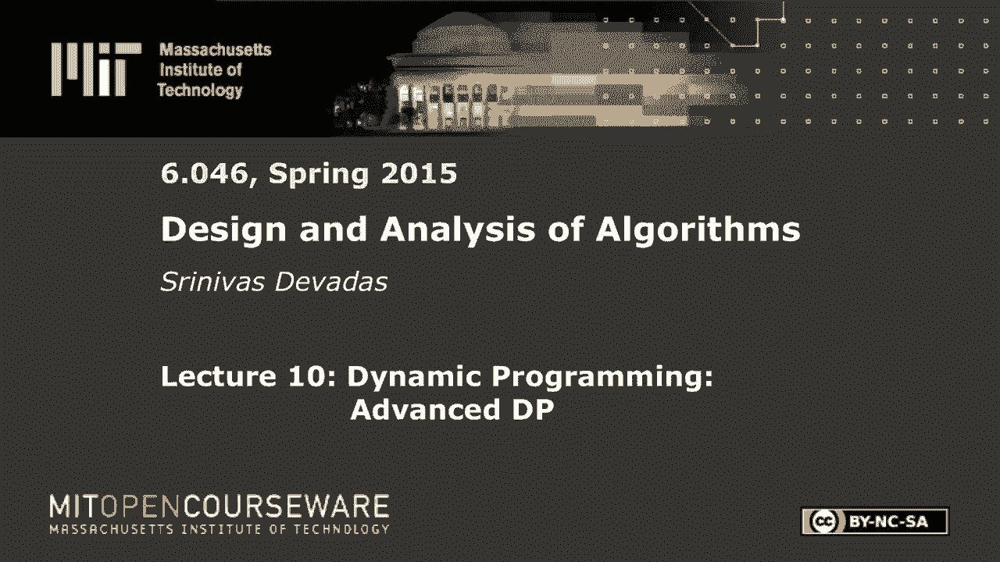

# 数据结构与算法设计：L10：动态规划：高级DP 🧩

在本节课中，我们将学习动态规划（DP）的高级应用。我们将通过三个逐步深入的例子来探索DP的强大之处：最长回文子序列、最优二叉搜索树以及交替硬币游戏。每个例子都将展示如何将复杂问题分解为子问题，并高效地构造最优解。

---

## 最长回文子序列 🔄

上一节我们回顾了动态规划的基本概念。本节中，我们来看看第一个具体问题：寻找给定字符串中的最长回文子序列。子序列意味着字符可以不连续，但必须保持原有顺序。

### 问题定义
给定一个字符串 `X[1..n]`，我们需要找到其最长的回文子序列的长度。例如，在字符串 “character” 中，最长回文子序列是 “carac”，长度为5。

### 动态规划解法
我们定义 `L[i][j]` 为子字符串 `X[i..j]` 的最长回文子序列的长度，其中 `1 ≤ i ≤ j ≤ n`。

以下是计算 `L[i][j]` 的递归关系（状态转移方程）：
1.  基本情况：如果 `i == j`，则 `L[i][j] = 1`（单个字符是回文）。
2.  如果 `X[i] == X[j]` 且 `i+1 == j`，则 `L[i][j] = 2`（两个相同字符）。
3.  如果 `X[i] == X[j]` 且 `i+1 < j`，则 `L[i][j] = 2 + L[i+1][j-1]`（两端字符相同，可加入回文）。
4.  如果 `X[i] != X[j]`，则 `L[i][j] = max(L[i+1][j], L[i][j-1])`（舍弃一个字符，看剩余部分）。

### 算法实现与复杂度
我们可以使用一个二维数组以自底向上的迭代方式或带备忘录的递归方式实现上述递归。子问题的数量为 `O(n²)`，每个子问题的计算是 `O(1)`，因此总时间复杂度为 **`O(n²)`**。

为了构造出具体的回文序列而不仅仅是长度，我们需要在计算过程中记录决策路径（例如，是从哪个状态转移而来），最后通过回溯得到序列。

---

## 最优二叉搜索树 🌳

在理解了如何用DP处理序列问题后，我们来看一个更结构化的问题：最优二叉搜索树。这个问题中，贪婪算法看似可行，但实际会失败，这凸显了DP的必要性。

### 问题定义
我们有一组有序的键 `K1 < K2 < ... < Kn` 及其对应的搜索权重（或概率）`w1, w2, ..., wn`。目标是构建一棵二叉搜索树（BST），使得所有键的**加权搜索成本**最小化。一个键 `Ki` 的搜索成本是其深度（根节点深度为0）加1，再乘以它的权重 `wi`。

**目标函数公式**：
`最小化 Σ (i=1 to n) [ wi * (depth_T(Ki) + 1) ]`

### 为什么贪婪算法会失败？
一个直观的贪婪策略是：总是选择当前范围内权重最高的键作为子树的根节点。然而，这可能导致树结构不平衡，从而增加其他高权重键的深度，最终得不到全局最优解。存在反例证明此贪婪策略并非最优。

### 动态规划解法
由于我们不知道最优树的根节点是哪个键，DP的“猜测”策略在此发挥作用：我们枚举每个键作为根节点的可能性。

定义 `e[i][j]` 为包含键 `Ki ... Kj` 的最优二叉搜索树的**最小加权搜索成本**。`w[i][j]` 是这些键的权重之和 `Σ (k=i to j) wk`。

状态转移方程如下：
1.  基本情况：如果 `i == j`，则 `e[i][j] = wi`（只有一个键，深度为0，成本为 `wi*(0+1)`）。
2.  对于 `i ≤ j`：
    `e[i][j] = min (r = i to j) { e[i][r-1] + e[r+1][j] + w[i][j] }`
    其中，`r` 是枚举的根节点键 `Kr`。`e[i][r-1]` 和 `e[r+1][j]` 是左右子树的最优成本。`w[i][j]` 的加入是因为当 `r` 成为根节点，其左右子树中所有键的深度都增加了1，因此总成本需要额外加上所有这些键的权重和。

### 算法复杂度
子问题数量为 `O(n²)`，对于每个子问题 `e[i][j]`，我们需要枚举 `O(j-i+1)` 个可能的根节点 `r`。因此，总时间复杂度为 **`O(n³)`**。

---

## 交替硬币游戏 🪙

最后，我们探讨一个涉及对抗性决策的问题：交替硬币游戏。这要求我们在模型中考虑对手的最优行为，是DP一个有趣的应用。

### 问题描述
有一排 `n`（n为偶数）枚硬币，其价值为 `v1, v2, ..., vn`。两个玩家轮流从这排硬币的**最左端或最右端**取走一枚硬币。玩家都希望自己取走的硬币总价值最大。假设对手也采取最优策略，作为先手玩家，你如何保证自己的最大收益？

### 动态规划解法
我们定义 `V[i][j]` 为当硬币序列剩余 `vi ... vj` 时，**当前行动玩家**（不一定是原始先手）能保证获得的最大价值。

状态转移需要考虑两个阶段：我方行动和对手行动。
1.  **我方行动**：我可以选择最左边的 `vi` 或最右边的 `vj`。
2.  **对手行动**：在我选择后，对手会在剩余的序列上采取最优行动，试图最大化他/她的收益，从而最小化我后续能获得的收益。

因此，状态转移方程如下：
`V[i][j] = max {
        vi + min( V[i+2][j], V[i+1][j-1] ),   // 我取vi，对手取后，我得到剩余序列的“保证最小”收益
        vj + min( V[i+1][j-1], V[i][j-2] )    // 我取vj，对手取后，我得到剩余序列的“保证最小”收益
    }`
其中 `min(...)` 部分模拟了对手最优决策下，我下一轮能获得收益的**最坏情况**（因此取最小值作为保证）。

**基本情况**：
-   如果 `i == j`，只剩一枚硬币，`V[i][j] = vi`。
-   如果 `i+1 == j`，只剩两枚硬币，`V[i][j] = max(vi, vj)`。

### 算法复杂度与策略洞察
同样，子问题数量为 `O(n²)`，每个子问题计算为 `O(1)`，总复杂度为 **`O(n²)`**。

一个有趣的策略洞察是：作为先手玩家，你可以预先计算所有奇数索引硬币价值之和与所有偶数索引硬币价值之和。选择较大的那一组，并采取相应策略（例如，若奇数和大，则始终迫使自己取奇数位硬币），可以保证**至少不输**，并且通常能最大化收益。

---

## 总结 📚

本节课中我们一起学习了动态规划在三个高级问题中的应用：
1.  **最长回文子序列**：展示了如何将序列问题分解为区间子问题，并通过状态转移高效求解。
2.  **最优二叉搜索树**：说明了当问题结构涉及“选择根节点”时，DP通过枚举所有可能性来克服贪婪算法的局限性。
3.  **交替硬币游戏**：引入了对抗性环境下的DP建模，关键是在状态转移中考虑对手的最优反应，以计算己方的“保证收益”。

这些例子体现了动态规划的核心思想：定义子问题，建立状态转移方程（递归关系），并以自底向上或带备忘录的方式避免重复计算，最终在多项式时间内解决指数级复杂度的原始问题。