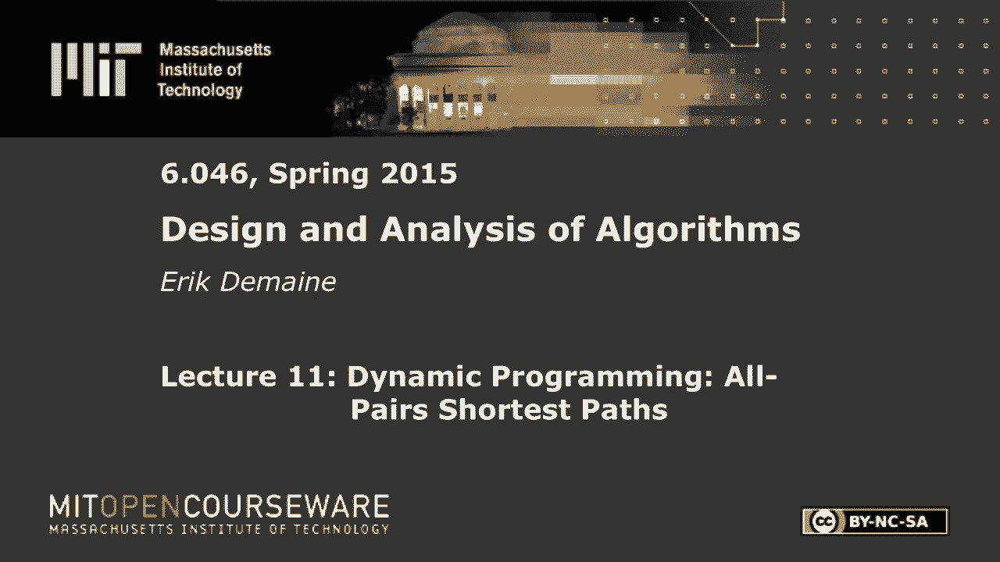
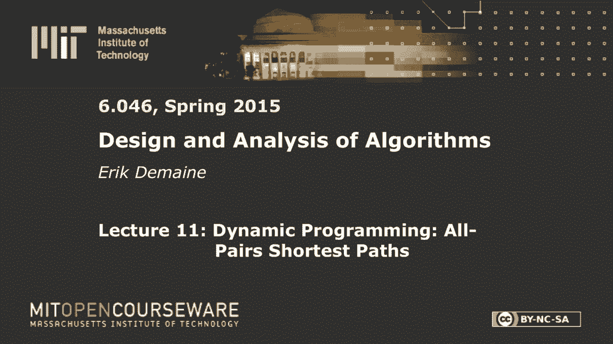
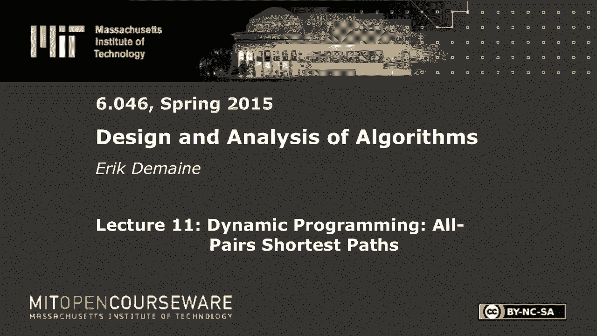

# 【双语字幕+资料下载】MIT 6.046J ｜ 数据结构与算法设计(2015·完整版) - P15：L11- 动态规划：所有对最短路径 - ShowMeAI - BV1sf4y1H7vb

以下内容是根据知识共享许可提供的，您的支持将有助于麻省理工学院开放课件。

继续免费提供优质教育资源。

捐赠或查看麻省理工学院数百门课程中的额外材料。

所有的权利，让我们开始吧，欢迎回到六零四六，今天我们开始了一系列令人兴奋的图算法，我们做了很多数据结构，上周我们开始用动态编程重新讨论算法，今天在接下来的几节课中，我们会看到很多关于图的很酷的算法。

首先，一点点回忆，我们从最短的路径开始，你已经在6个月内看到了，在单一来源的情况下，最短路径，就像你做谷歌地图查询一样，你认为我想从A到B，但你在6006中解决的是一个更难的问题，我给你一个观点。

这里的a，它被称为来源，我给你一个源顶点，大写v是所有顶点的集合，资本是所有边缘的集合，记住图形表示法，假设它是一个有向图，你有边缘重物，就像穿越每条路所需的时间，你想知道多久，把所有v从s到v。

所以这是从一个给定的点到今天的任何地方，我们要解决一个更难的问题，都是成双成对，我想从A到B，但你在六双六看到的是单一来源，我只给你其中一个顶点，我想知道怎么去任何地方，你看到这个版本的原因。

而不是A到B版本，是因为我们知道解决A到B的最好方法是解决这个问题，所以至少从理论的角度来看，我们不知道如何打败，Dijkstra算法和Bellman Ford算法，A到B的问题。

所以你得到的比你要求的多一点，价格差不多，所以让我在几个不同的场景中提醒你，我们有什么算法，它们需要多长时间，因此，感兴趣的场景是未加权的情况，非负加权情况，一般情况任意权重，正反，达格，无环图。

这些是一些有趣的特例，你应该看到他们每个人的双六算法，让我们看看你是否记得，什么是单源的好算法，未加权图中的最短路径，BFS好的广度首先搜索需要多长时间，v加e好，那是用来画图形的。

v加e被认为是线性时间，这就是表示输入所需的时间，所以你得看看输入，大多数算法和BFS对此是最优的，但在这两种情况下，我们会开始变得更糟，对于非负边权，你用什么，戴克斯特拉，今天早上每个人都醒着。

令人印象深刻，这需要多长时间，这是个棘手的问题，log v加e哇，不错嘛，所以这个答案取决于你使用的堆结构，但这是我们所知道的最好的，如果你使用斐波那契堆，我们实际上没有涵盖，但这是在课本上你实现的。

提取键的对数V，每次减少键操作的常数摊销，非常抱歉，这是为了提取最小，这是减少键，所以这是我们所知道的用Dijkstra类型的方法做的最好的事情，如果使用其他堆，你变得稍微更糟。

也许你在这里得到一个对数因子，但这很好，对于中等密度的图，这几乎和V加E一样好，如果e大于v log v，那么这些都是一样的，但是如果你的图是稀疏的，像e是v阶，然后丢失一个对数因子，但是嘿。

这只是一个对数因子，还不错，我们会变得更糟所以，对于一般重量，你用什么，贝尔曼福特，好的，需要多长时间V，这是通常的说法，从技术上讲，你应该假设v e至少是v，因为这一定会成立，但这是这样想的。

所以这没有那么好，这个慢了很多，如果你想到我们可以想到两种情况，1是当e是θv时，所以像树这样的非常稀疏的图，或者平面图什么的，我们可以想到当e是二次的，那是密密麻麻的案子，和V的平方表示BFS。

对于非负边权，我们在稀疏情况下得到v log v，我们在稠密的情况下得到v的平方，对于贝尔曼·福特来说，我们在稀疏情况下得到v的平方，和V在致密情况下的立方，所以这就像一个v因子。

大于非负边缘权重的线性因子会产生巨大的差异，最后，对于无环图，你是做什么的，动态规划，动态规划是一个答案，是啊，是啊，在某种意义上是有效的，所有这些算法都是特别的Bellman Ford是一个动态程序。

我们会看到另一种解释，拓扑排序，然后是行李员福特是的，所以贝尔曼·福特实际上工作得很好，如果你知道顺序，你应该放松边缘，如果在无环图中，您可以进行拓扑排序，这意味着你访问了所有的顶点。

以便每当您访问边缘的正确端点时，您已经访问了左端点，如果你按那个顺序做行李员福特，然后你只需要做一个通行证，你就完成了，而通常在这里你必须做V次，所以总成本是线性的，这么好的好事记住。

尤其是在测验等方面，如果你的图是无圈的，你可以实现线性时间，但在一般情况下，贝尔曼·福特是你对单一来源的答案，现在这些是最好的算法，我们知道，对于这些案件中的每一个，所以我不打算改进它们。

今天你在双O六看到了最先进的技术，但对于所有的对，最短路径，我们就可以，在某种意义上做得更好，所以让我快速定义问题，然后告诉你所有的结果，我们知道，还有我们今天要讨论的结果，我没有提醒你三角洲的定义。

我想简单地过一遍，所以s逗号v的delta是最短路径的权重，从s到v，重量很明确，即使可能有许多最短的路径，有一个最好的重量，但也有一些特殊的情况，它可能是无限的，如果没有路，那有点，根据定义，说好。

得到它的成本是无限的，如果没有路，然后我们说有一个无限重的，在负重循环存在的情况下，它可能是负无穷大，所以我会说，如果有一个负体重循环，如果你能从s到一个负重循环，然后仍然从那里到v。

那么到达那里的最好方法就是进入那个循环，绕着它无限多次，然后转v好的，所以你看到的算法可能实际上没有正确计算，在这种情况下，他们只是说负重循环，我不知道该怎么办，但其实没那么难，再努力一点。

你可以找出负无穷大在哪里，我们不会依赖这一点，但我只是把它扔在那里，使这是一个明确定义的定义，一旦你有了最短的路径权重，还可以存储父指针，获取最短路径树，然后你实际上可以找到最短的路径。

但我们还是不打算在这里谈论这个，我们将专注于计算增量，但是用你在双O六中看到的通常技术，您还可以重建路径，对于所有对，最短路径，我们有一个类似的设置，我们有一个有向图v，我们有一个边权函数w。

它可能有负重，我们的目标是为所有的u和v找到u逗号v的delta，好的，单一来源，最短路径是你可能想做的事情，如果你只是得到一个图表，你想找到一条从A到B的最短路径，我说。

这是我们所知道的从A到B的最好方法，基本上，但是所有成对的最短路径都是您可能想要做的，如果你在预处理，如果你是谷歌地图，您希望能够非常快速地支持主要城市之间的最短路径查询，那么您可能需要首先计算所有对。

所有主要城市的最短路径，因为道路网络不会发生很大的大规模变化，这是忽略流量等等，预先计算这个，然后给出两个顶点的查询，一秒钟可能会收到一百万个查询，你可以很快知道答案是什么，这是现实世界最短路径的基础。

通常不计算从A到B的最短路径，每一次，你沿途使用航路点，你已经预先计算了航路点之间的所有对最短路径，所以这就是动机，是啊，是啊，我猜，在某种意义上，互联网路由是另一种情况，在任何时候。

您可能需要知道到达的最短路径，最少的热门路径说去一个互联网站点，你知道IP地址，你需要知道去哪里，你不需要知道整个路径，你需要知道下一步，但从某种意义上说，你在计算所有的对，最短路径。

那是一个更动态的情况，好的，结果如下，我们知道，对于所有对，最短路径，我想我会作弊，重复使用这块板，所以同样的情况，除了我不会在这里考虑无环图，它们就没那么有趣了，实际上现在我很好奇。

但我不打算谈论非循环，所以解决所有对的显而易见的事情是，最短路径只需从每个源运行单个源算法V次，所以我可以做v乘以宽度的第一次搜索，V倍迪克斯特拉，V倍贝尔曼福特，现在我只需要更新我的边界，好的。

所以v变成了v的平方加上ve，如果你有点聪明的话，或者你假设e至少是v，变成了v，如果我运行Dijkstra v次，我会得到v的平方log v+v乘以e，好的，如果我运行贝尔曼福特V倍，我得到V平方。

e，好的，在这里，所有的东西都会增加一个v因子，所以更直观的是考虑稀疏的情况，我得到v的平方，v的平方，log v和v的立方，检查那边那些是否匹配，在这里我得到v的立方，v的立方和v的四次方，好吧。

到目前为止很无聊，嗯，有趣的是，我们可以击败最后一个结果，最后一个结果，这是最慢的，只要V到第四次，我们可以刮掉整个V因子，一般的大小写算法称为约翰逊算法，这将是我们今天讨论的最后一个算法，它实现了。

这个绑定，这与运行Dijkstra v次相同，所以它在v的平方对数v之间，和V立方，这很酷，因为这是最好的算法，我们知道对于所有非负边权对的最短路径，只是运行Dijkstra，v次这不是很聪明。

但这是我们所知道的最好的事情，这表明即使我们有负边缘权重，实际上我们可以达到与运行Dijkstra相同的界限，这有点违背直觉，因为在六点你总是被告知，如果你有负边缘重量，你不能用Dijkstra。

在所有对最短路径的情况下，你可以，怎么可能，因为这是一个更难的问题，如果你能解决所有对最短路径，当然你可以解决单一来源，这实际上是奢侈，因为这是一个更难的问题，我们在运行时间中有这个VE项。

让我们跑一次贝尔曼福特跑一次贝尔曼福特，会让我们运行迪克斯特拉，v次，这就是我们能达到这个极限的原因，但对于初学者来说，我们暂时不会看到这种情况，我想向你展示所有对最短路径之间的一些连接。

动态规划与矩阵乘法，结果给出了稠密图，我们只是在所有情况下实现V立方，所以我们的第一个目标是实现V立方时间，对于一般边缘权重，所以我们将首先实现这个界限，这将容易得多，然后最终我们会达到这个界限。

所以弗洛伊德Warshawl算法，其中一些会非常接近V立方，所以我们将从解决所有对的第一种方法开始，不使用现有单源算法的最短路径是动态规划，有人提到这已经是一种自然的方法了，最短PA是一种动态规划。

事实上，您可以将大多数动态程序转换为单一源程序，最短路径，通常在DAG中，不是全部，而是很多，所以我们可以尝试动态编程，我要向你说教，关于我对动态程序的思考方式，如果你看过双六。

所以你已经看到了动态编程的五个简单步骤，所以如果你没有，这将是新的，否则就是提醒，在动态程序中我首先想到的是什么子问题，我喜欢想的第二件事是我在猜什么，我要猜一下解决方案的一些特点，第三件事是。

我想写一个关于子问题解决方案的递归，那我基本上就完了，但有几个总结的东西，我得用另一块板，所以第四个是，我需要检查我是否真的能以某种顺序解决这些子问题，那是有效的，基本上。

这是说子问题上的约束图应该是无循环的，因为如果约束图中有一个循环，你花了无限的时间，即使你记住了，如果你做无限递归，坏消息，你永远不会真正完成任何事情，所以你从来没有在备忘表上写过任何东西。

所以我想确保它是无循环的，这是我的意思，这真的是我们在这一行中谈论的同样的事情，也就是拓扑排序，就我个人而言，我喜欢，你可以争辩说这是一个循环，我喜欢写下，这里有一个拓扑顺序，这是一个很好的证据。

它是无环的，如果你把它写下来，至于循环，然后你实际上有一个底部向上，dp，如果你只是把复发，把它粘在for循环中，你完蛋了，我们一会儿就做，我想我需要吵架，最后你需要解决原来的问题，好的。

然后是分析等等，而是为了指定算法，这些是你需要知道的关键事情，困难的部分是弄清楚子问题应该是什么，让你的DP变得很快，运行时间将是许多子问题，每个子问题的时间。

通常我们会想猜测这个问题解决方案的某些特征，一旦我们这样做了，复发变得相当微不足道，每次猜你说的应该是什么，所以这是最难的两步，然后好的，我们检查了它是无环的。

我们确保我们可以用其中一个子问题来解决我们的原始问题，有时我们的原始问题是一些子问题，我想这会发生在这里，但有时你需要做一点后期计算，得到你的答案好吧，所以说，我要对子问题做什么，嗯，很明显。

我有一堆不同的问题，涉及顶点对，我想为我抹去的所有u和v找到u v的delta，但这就是问题所在，所以我想知道重量是多少，最短路径，从u到v，如果我停下来说这是我的问题，坏事就要发生了，因为我最终会。

没有自然的方法使这件事不循环，如果我想用，我不知道u到x然后x到v，类似的东西，没有办法摆脱无限递归循环，所以我需要添加更多的子问题，向我的解决方案添加更多功能，当我试图解决我的子问题时。

我把它简化为其他子问题，事情变小了，所以实际上可以取得进展，所以实际上有两种自然的方法来做到这一点，我叫它们方法一和方法二，方法二实际上是弗洛伊德·沃肖，但对我们如何做到这一点有什么建议吗。

这是一个更难的问题，这在某种意义上是一种猜测，但这就像我要提前猜测，不知何故，这些最短路径有一个重要的特征，我要用它来参数化，不知何故它会变得更小，最大右的最短路径，最多使用给定边数的最短路径。

让我们用多少条边来参数化，我想我会用，m，非常好，这么好，我想它应该得到一个紫色的飞盘，到学期结束时，我正在慢慢好转，我会成为飞盘的职业选手，我应该参加比赛，所以这是，当然啦，附加的限制。

但在一天结束的时候，我想解决的问题本质上是D u v，让我们说，n减去一，如果我想要一个不重复任何顶点的最短路径，那么它最多有n-1条边，所以事实上，这种说法是d u v等于d u v n，我是说等等。

如果你大于n减去1，如果你知道你最短的路很简单，这对你没有帮助，如果你知道最短路径不重复顶点，所以这将是如果没有负重量循环，没有负重循环，然后我们知道重复顶点是没有帮助的，所以在那种情况下。

如果我们现在能为所有人解决这个问题，我们就完成了，就像抓得很好，我们怎么知道没有负体重循环，你知道我们可以经营贝尔曼福特，我想这有点棘手，因为这只能找到可达到的负体重循环。

事实上从这张照片中我们最终会知道是否有负重循环，所以不会有负重循环，当且仅当没有否定，对角线项表示dv v n减去一，所以这个算法会检测到有一个负权重循环，通过发现从V到V的距离是负的，最初是零。

如果结果是阴性的，我们知道有一个负体重循环与更多的工作，你实际上可以找到所有可到达的对等等，但我不会担心，我只想说负重循环，我要把我的手举在空中，放弃今天，好的，酷，这样我就可以解决我原来的问题了。

如果我能解决这些子问题，现在事情变得容易了，因为我们基本上可以假设，在解决这个问题时，我们解决了较小的子问题，用于，然而，我们定义更小，这就是这个拓扑顺序给出的，较小的概念是较小的m。

大概我们想用m来写这个，用m减去1，这就到了我们猜测的部分最短路径的特征是什么，我们能猜到这会让它短一条边吗，可能有两个很好的答案，是啊，是啊，下一个，下一条边，我想你的意思是。

第一条边肯定能猜到第一条边，或者你可以猜到第二条边，或者没有，那就更难了，或者我是说最后一条边也会起作用，好的，这是一个更难的，哦不，好事，到处都是学生来抓它，酷，所以我要猜最后一条边。

我就是这样写笔记的，但第一边缘也很好用，所以我把最后一条边叫做x逗号v，我们知道我们以进入V结束，所以现在让我们以最短路径猜测它之前的顶点，我们当然不知道那个边缘在猜测什么。

就像你上次看到的那样把它们都试一下，所以现在写递归真的很容易，看看我能不能不看笔记就做，所以我们有M的紫外线，我们想写，我们想找到最短的路径，所以外面可能会有一分钟，我们将考虑表单的路径。

D用更少的边从U到X，对如果这是最后一条边，然后我们用m减去一条边来得到x，然后我们沿着边x逗号v，我把边的重量加上，如果X是正确答案，这将是从u通过x到v的成本，其中x x v是末端的一条边。

我们不知道x应该是什么，所以我们要在x上做一个for循环，所以这是使用Python表示法，这将发现最好的答案很容易完成，一旦你知道子问题是，一旦你知道猜测是什么，基本上我只是加上一分钟。

和一个for循环来进行猜测，这就是我的复发，除了我在这里也应该有一个基本情况，尤其重要的是，所以基本情况是m是最小的，所以我们说是零，用零边到达某个地方的重量是多少，通常情况下，它将是无限的。

但有一个有趣的情况，它是零，即当u等于v时，有一种方法可以从U到它自己，边缘为零，零成本，但其他任何地方都将花费无限，没有路，所以这是一个定义，正如我应该说的，如果存在的话，否则就是无穷大。

所以我得到了那些无限，但这有点重要，因为也许我实际上使用的边比M少，我在这里写的小于等于M，这也小于等于m减去这里的一条边，但从某种意义上说，我把这里的情况包括在内，我只是得到，这里x等于v。

所以我在最后保持在v，因为我这里有一个零，我含蓄地包括了这样的情况，实际上我只用du v m减去1，那就在这里，所以把基本情况弄对是很重要的，酷，快完成了，我需要一个非循环排序，就像我说的，事情变小了。

当m较小时，所以这意味着在外面为m做for循环，然后对u和v执行for循环，对那些人来说，你按什么顺序做并不重要，只要你把m等于零都做完了，在你做所有m等于一之前，在你做m等于2之前。

所以这是嵌套的循环，给你正确的顺序，所以如果我只拿，3。我想我应该把它放在最上面，我拿着这条线，电流的感应，把它放在for循环中，那是我的屁股，dp，我要明确地把它写下来，来这里踢。

首先我们在m上做一个for循环，然后我们要在u和v上做for循环，现在在for循环中，我想计算这个人，我可以用这条线，但我要稍微重写一下，将其连接回最短路径。

因为这种类型的声明应该看起来很熟悉Dijkstra和Bellman Ford，这叫做放松步，它可能会看起来更眼熟，如果我在这里写x v的w，你也可以写wxv，那是另一种选择。

对于这两个可能应该写相同的方式，但无论哪种情况，我们都称之为放松步骤，因为，这是一种技术原因，但我们想满足的是，我们知道最短路径应该满足三角形不等式，如果你看这里有三个顶点，u，v。

我们在看从u到v的最短路径，与从u到x的最短路径相比，从x到v的最短路径，当然，从u到v的最短路应该小于，或等于u到x加x到v的最短路径，因为从u到v的一个方法是通过x，所以这个if条件。

这将违反三角不等式，这意味着我们肯定没有正确的距离估计，如果dov大于u x加x v，好的，所以如果它更大，我们要让它相等，因为在这里我们知道一种从紫外线通过X获得的方法，我们知道有可能做到这一点。

假设我们的d值总是现实的上限，那么这将是从u到v的最佳方式的上界，所以这显然是一件有效的事情，放松从来都不坏，如果你开始很高，这些总是会改善你的最短路径，所以你得到更好的估计。

这正是Dijkstra和Bellman Ford所做的，也许用w代替d，但它们都是关于修复三角形不等式，总的来说，在优化方面，有一种概念，如果您有约束，不平等，约束，就像三角形不等式，它被侵犯了。

然后你试图通过连续的放松来修复它，这就是这个词的由来，在这里并不重要，但是我们所有的最短路径算法都会做松弛，所有最短路径算法，我知道做放松，所以这很熟悉，但它在这里也在做同样的事情。

我刚刚把最小值展开为x上的for循环，每次检查，是否每一个连续的条目都比我已经有的好，如果是我更新，最终，这将或多或少地计算一分钟，我也作弊了，因为我省略了这里的上标，如果我把m放在这里，这里减去1。

这里减去1，它将是完全相同的算法，我省略了所有的上标，因为，它只能帮助我放松，放松更多只会变得更好，如果我在那里被保证是正确的，我在这里还是会被保证正确的，你必须改进你从不放松总是安全的不变量。

如果你从上界开始，你总是保持上限，你至少在那边放松了一下，所以你最终会计算出正确的最短路径权重，这样做的好处是，主要是我节省空间，而且也更简单，所以现在我只需要二次空间，如果我有上标，我需要立方空间。

所以我做了一点简化，从五步过程到这里，都是多项式时间和空间，但这个稍微好一点，但是这个算法有多慢，需要多长时间，V立方那就太好了，v到四次，是啊，是啊，好，可悲的是，我们还没有做得那么好，和。

仍然v到第四，v到四次，我想我已经知道怎么做了，如果我只是运行贝尔曼福特V倍，我已经知道怎么做V到第四，所以我实际上没有改进任何东西，但至少你看到了，里面全是动态编程，所以n是v的大小。

这可能是你错过的，酷，因为零是单独完成的基本情况，在我没有写的一行里，但是好吧，所以这是DP 1，DP 2的时间，除非到目前为止有不清楚的问题，当你迭代x时，你做什么每相对于只是相邻，哦耶，好的。

很好嗯，公平问题，为什么我要遍历所有顶点，不仅仅是进来的，如果我在写XV的W，我只能说，只要考虑传入的顶点，这会让我提高，大概从v到4到v的立方v的平方乘以e，我想如果你算对了，你可以这么做。

对于致密图来说会更好，对于稀疏图来说并不重要，它会改善，它基本上会把v的平方提高到e，但我们会做得更好，所以我现在不打算尝试优化，但问得好，当我此刻这么说的时候，如果从x到v没有边，我在定义。

我在想象xv的w等于无穷大，所以它永远不会，这永远不会是使用非边的最小选择，我应该说，如果这里没有优势，我把重量定义为无穷大，这只会使算法编写起来更干净，但你可以优化它的方式，你是这么说的。

你在哪里对不起，或者飞盘练习不行好的，所以这是DP 1，让我做DP二，在我得到DP 2之前，转移是矩阵乘法，我想谈谈矩阵乘法，这是一个很酷的连接，它不会直接帮助我们找到最短的路径，但是，还是很不错的。

它会帮助它解决另一个问题，特别快，所以最短路径也与矩阵乘法密切相关，一个我们已经见过几次的问题，在FFT讲座中的第一次，然后在随机化讲座中检查矩阵乘法，所以你记得你有两个矩阵，你想计算c等于a乘以b。

你见过Strassen的算法来做到这一点，这里还有a和b的平方，这么说吧，他们没有，乘积将是n乘n，所以标准的方法是n与斯特拉森的立方，记住你可以得到n到2。8，哦七，如果你用铜匠Winograd。

你得2点37分，然后如果你使用新的Vasilea Williams算法，你得到2点3，7，2，8，以此类推，好吧，这是最好的算法，我们现在知道有一些证据。

也许你可以用任何epsilon得到两个加epsilon，事实证明，这些对我们没有太大帮助，但我想展示的是，矩阵乘法本质上是这样做的，如果你重新定义加和点的意思，如果你重新定义加法和乘法。

一会儿再谈这是否有效，所以记住什么是矩阵乘法c，j是行和列的点积，所以这是一个I，k与b kj k等于1到n，好的，现在这个总数看起来很像那个min，实际上更像我在这里写的方式，用d代替w。

右边的x是这里变化的东西，这就像一个i k加b k j，除了我这里有加号，而我在这里有时间，我在外面有一分钟，但我在这里有一个总数，所以听起来很疯狂，但让我们定义得很混乱，如果我说定义点等于，另外。

我要定义一个新的世界，叫做圆世界，所以如果我在一个点周围画一个圈，我的意思是加，如果我在一个，加，我的意思是敏，好的，所以现在如果我在这个点周围放一个圈，我是说把一切都圈起来，所以我要把总结圈起来。

把这个东西圈起来，这样我就得到了最短的路径，如此正确，我把d定义为n次方，我应该绕一圈，是啊，是啊，随便啦，略有不同，我想同时找到三件事，所以让我把它们写下来，然后谈谈它们，好的，如果我定义顶点。

假设我把顶点数为1到n，好的，我只是假设所有的顶点都是1到n之间的整数，这样我就可以用矩阵来表达事物，即权重矩阵，这种定义图，尤其是如果我说Wij的无限，如果没有边，那么这是所有成对权重的矩阵。

每个i和j的边缘权重，我有一个IJ的权重，给我一个矩阵，一旦我把v设为1到n，现在我还定义了这个距离估计矩阵，所以记住我们定义了d u v m，我现在要叫它d i j m，因为顶点是整数。

这是最短路径的权重，最多使用m边，如果我这样定义，然后我可以把它放进一个矩阵里，只对所有顶点对，IJ最多使用m边的距离最短路径是多少，这给了你一个矩阵，d，如果我取m的d减去1和w之间的圆积。

这正是这里正在发生的事情，如果你盯着它足够长的时间，这是内积，在d的u行到m减一和w的v列之间，这正是这个圆乘积将计算的，所以这是DP，但当你看到那个声明时，那是说D在括号里，是w对圆的幂。

这是一个在某种意义上使用圆积的幂的定义，所以当我绕指数，这意味着我在圆地上做圆求幂，好的，到目前为止，所以这是，这里是圆地，对呀，所以你可能会说，嗯，那么我现在应该用矩阵乘法计算这些乘积。

只是为了看看我们做得有多好，如果我执行这个操作，你知道N次，因为我必须从D到N减1，所以基本上是D到N，嗯，如果我做这个产品，n次，每一次我都花了n个立方体的时间，然后我得到一个n到四算法，相同算法。

事实上完全相同的算法，我刚刚用这种新语言表达了它，好吧，有两个想法摆在桌面上，虽然一个是也许我可以用一个更好的矩阵乘法算法，让我们暂时搁置一下，另一种可能性很好，也许我可以加速，然后呢。

乘以自己n倍或乘以w n倍，我该怎么做，反复平方好，我见过，可能在双O六重复平方的想法，我们用来计算W，我取w到0，我把它乘以w到零，对不起，圆圈零，就是这个东西，这看起来很奇怪。

让我们从一个开始一个似乎更好，不会得到太多，如果我把它本身相乘，它应该得到完全相同的矩阵，所以我取W到1之间的圆积，对给我W的那个对两个，然后我把w乘以2，一切都在盘旋，我得到四个W，哦酷。

我用一次乘法把指数翻倍，如果我取w到4，由W到四，我得到w到8，以此类推，我的目标是到达N，所以我必须做这个log n乘以log n的平方运算，每个平方运算都是n次方，所以这是重复的平方，我得到了。

V立方对数V终于有了改进，所以我们从B到四，在密度箱里和贝尔曼·福特跑V圈的表现一样，但现在在密集的情况下，我得到了v的立方对数，这实际上是很好的，不完全是立方体，但很接近，所有的权利。

我指的是v立方体，这实际上是一个不是最佳的结果，这是我们想要改进的，好的，但我们有点，我们在这个空间里，现在，我们正接近和这个算法一样好，约翰逊算法，但我们仍然有log v因子，所以这很棒。

你现在只要翻译成矩阵乘法，从技术上来说，你必须检查重复的平方实际上会给你同样的结果，基本上，这是有效的，因为产品是关联的，圆，矩阵的乘积是关联的，因为它是圆，是半环，如果你想要抽象代数。

戒指是你戴在手指上的东西，环是一个代数，其中你定义了+n次，你有分配性，半环加号没有减号，因为min没有逆，没有办法从最小值重新计算正确的参数，不管你用什么方法，你不能你失去了信息，那是半环。

通常你有一个负，但是半环足以让重复的平方给你正确的答案，然而，对于所有这些花哨的算法来说，半环是不够的，所以如果你看看斯特拉森的算法，你见过的那个用负号，据我们所知，没有办法绕过这个问题。

所以如果你没有-n的立方是最好的，我们知道怎么做，可悲的是，我们不能用这种技术改进，我们可以做点什么，如果我们只是改变问题，还有一个问题，这是最好的办法，让我简单地告诉你那个问题，它叫做。

传递闭包是我只想知道，有一条从i到j的路径吗，所以这将是一个，如果存在从i到j的路径，它将是零，否则，好的，这有点像，我想这有点像，如果您将所有权重设置为零或无穷大，那么要么会有一条零路，或者没有路。

意思是，有一条无限的路，所以这里不太一样，我想要1和0，我翻转它曾经是，这是无限，这是零，但这是一种说法，有一条小路，从i到j零，否则如果我这样写，然后我想我在这里需要做什么，它不是静止的。

从某种意义上说，它仍然是，加和最小，但真的因为我只是想知道，有一条路吗，所以如果我有办法到达那里，而不是把这些值相加，真的，我正在服用，其他一些算子，所以我想知道，或者是的，到底是谁说的，或。

所以这里我们基本上有一个圆积是或，圆和是，我是说，加和分就可以了，但这里稍微好一点，对不起，正好相反，我觉得，是啊，是啊，绝对是布尔值，我们想知道有一种方法可以到达X，然后从x到我们要去的地方。

这是一个和，然后得到一个一般的路径，它必须为一些X工作，这是手术室，这是戒指，一旦你成为戒指，你有否定，你可以应用瓦斯克利·威廉姆斯，你用n解出这个问题到2点3 7 2 8，如果我在点上做一点改变。

我可以吸收日志，所以你可以在这里放一个日志，如果你得到的指数完全正确，它是log n，但是如果你把指数调整到零点，零零零一，比log n大，所以我们通常省略那里的日志，传递闭合。

所以这是一个你不知道你想解决的问题，但这实际上是一个常见的问题，这是我们所知道的解决它的最好方法，对于致密图，这会打败它打败它，你知道的，V立方，这是，这就是我们的目标算法，对于致密图，对于稀疏图。

我们可以做得更好，但是对于致密图，这样更好，所有的权利，最后我们要讲第二个动态编程，也被称为弗洛伊德·沃肖算法，所以我们在V到4的时候有这个DP，如果我们忘记了封闭的过境，我们现在是v的立方对数。

我们的下一个目标是实现V立方无对数V，我们就这么做吧，所以再一次，我将用我的五个步骤来表达它，第一步是什么子问题，这是关键的区别，弗洛伊德·沃肖尔的关键洞察力，就是重新定义J问题以避免冲突。

我要叫他们c ij，或者在这种情况下叫c u v，因为这里矩阵产品视图将不起作用，我想是的，不会成功的，所以这是一个完全不同的宇宙，我仍然假设顶点的编号是1到n，现在的想法是首先。

我将大致考虑由1到k的顶点形成的图，我想知道每个顶点u和v，从u到v的最短路径是什么，或者从u到v的最短路径的权重，它只使用从1到K的中间顶点，所以实际上u和v可能不是，它们可能比K大。

但我希望路径中的所有顶点都是1到K，这是一种不同的方式来分割我的空间，这是正确的方法，它将做n的因子，更好，原来，这只是你从尝试中得到的洞察力，你能想到的所有DPS，最终佛罗里达和马歇尔找到了这个。

我想在七十年代，所以当时得到一个新的结果更容易，但这是我的意思，这很聪明，很酷的想法，所以现在的问题是，在我猜最后一条边是什么之前，我该猜什么，那不会那么有用，在这里。

有人能想到一个不同的东西来猜测试图解决这个问题的地方吗，在这里我可以使用1到K的顶点，大概我想使用涉及较小k的子问题，包括1到k减去1的顶点，所以顶点k是相关的，关于顶点K我应该猜什么，我猜情况是冰。

你想猜顶点k是第i个中间顶点，但是我需要在这里用i来参数化，我失去了另一个n因子，如果我那样做，所以我想避免，那是个好主意，只是粘在你身上，然后你从，你能来看我吗，你会猜到我拜访了K。

然后去我想去的地方，那可不行，这是一个声明，但我猜我应该有多个选择，我还有别的选择吗？所以你去，但这是一个，是呀，所以我要么使用顶点K，要么不使用，我的猜测是路径中的K，我在这里的小路上。

我只是说这是在所有的路径K，这很好，因为，就像你说的，我已经知道不用K怎么去那里了，因为那是c uv k减去一，然后你还必须考虑到我去K然后我离开的情况，所以递归是c u v k，我有两件事。

一个是当k不在路径中时，那是c u v k减去一，另一个选择是我先去X，或者对不起，我先去K，以前是X现在是X，我把它改名为K我不知道为什么，k减去一，然后我从k到v，在我做N件事之前。

我做了N件事的最小，我猜有N种选择，现在我猜有两个选择，子问题的数量仍然相同，但是猜测部分和重复部分现在是常数时间，而不是线性时间，所以我现在是V立方体时间，挺酷的，旧的DP把我们带到了矩阵乘法的世界。

这就是为什么我掩盖了它，这个新的DP只是一种不同的思考方式，原来速度更快，只需对数因子，但要快一点，我需要一些基本情况。c的uv是0，是边缘的重量，uv，在使用零边之前，这是一个不同的基本情况。

现在它没有使用任何中间顶点，所以重量就是这样出现的，因为实际上这里没有边缘的重量，所以这有点奇怪，唯一有权重的地方是在k等于零的时候，这在某种意义上仍然是放松，但这有点奇怪，有点不同的顺序，我是说。

这里的关键是因为，因为我们用中间顶点建立这些子问题的方式，我们知道K是唯一有问题的顶点，在它像好之前，我不知道你最后会去哪里，但现在我们知道要么K在里面，要么不在里面，在每种情况下。

我们可以使用更小的子问题来计算它，所以我们把线性因子，这也是针对有向图的，是啊，是啊，u和v在这里排序，这是从u到v的权重也同样有效，把这个写下来可能有点启发性，再次嵌套循环，为什么不呢。

因为那样你就会发现这又只是放松，所以我甚至会在这里写基本情况，因为它非常简单，我们按顺序做k，假设这些实际上是相同类型的for循环，但我会写得稍微不同，因为在这里我们关心订单，稍微。

在这里我们确实关心订单，这里我们不关心顺序顶点，我们要说的是，几乎和以前完全相同的代码，这又只是一个放松的步骤，我们只是以不同的顺序放松不同的边缘，基本上是因为k在这里进化，我们这样做，对于k等于1。

那么对于k等于2，以此类推，但最后只是放松，所以你可以用它来证明这实际上计算了正确的，最短路径，所以我不会在这里这么做，但显然是立方时间，而不是软木很酷，那是弗洛伊德·沃肖尔，很简单，所以很多人。

如果你需要解所有的对，稠密图中的最短路径，这是我们所知道的最好的方法，这是您应该实现的，它就像五行代码，你实现了这个界限，但是对于稀疏图，我们可以做得更好，讲座的其余部分将是关于约翰逊算法的。

对于稀疏图，我们将更接近二次时间，我们要匹配跑步Dijkstra，它是v的平方对数v加上e乘以v所以当e很小的时候，这将接近二次方，当E很大的时候，又要变成立方体了，所以它永远不会比这个血罐算法更糟。

但是对于稀疏图，这样比较好，会有人拿强生和强生开玩笑的，但我会通过约翰逊的算法，我是说，DP是五步，但是约翰逊的算法只有三步，显然更简单，实际上要复杂得多，但这一切都是关于步骤是什么。

约翰逊算法中有一个疯狂的想法，我们要改变边缘的重量，为了做到这一点，我们将为顶点分配权重，我们要选择一个函数，H把它看作是身高函数，我想把顶点映射到实数，然后我们定义u v的w subh。

这是一种思考边缘权重的新方法，它依赖于h，它是以一种简单的方式定义的，它是旧的边权加u的h减去v的h，你可以用另一种方式来定义它，但在这里最好保持一致，所以这是一种为每个边缘调整边缘重量的方法。

这是有向图，很明显你用开头，的头，我不知道是头还是尾巴，边缘的开始，v是边的末端，我要在重量上加h的高度，减去v的高度，我希望这个大于或等于零，就是这样，我想给一个函数h。

所以这些新的权重都大于或等于零，这是对所有U和V的，我为什么要那样做，用Dijkstra而不是Bellman Ford，这是第二步，运行Dijkstra，上，我想通常的图表。

但是现在这个新的权重函数w sub h，如果所有的权重都是非负的，我可以运行Dijkstra，所以这将给我我所说的最短路径，u的sub h逗号v表示所有u和v，它没有给我实际的最短路径权重，我想。

它给了我最短的路径使用这个W H，但我声称这几乎是一样的，我声称这种加权保留了哪些路径是最短的，因为特别是，我索赔，u v的Δ是，u v的Δ，应该是相反的，u的负h加上v的h，如果这是一条边。

你可以看到我只是取消了这些条款，但事实上，我声称有一整条路，从u到v的每一条路径都改变了完全相同的量，所以这是一个关于最短路径的主张，但事实上，我声称从u到v的每一条路径都是最短的或不短的。

如果我用常规的重量w和重量w subh来测量它，唯一不同的是这个固定的金额，它只依赖于u，v不依赖于路径，因此，哪些路径最短被保留，所以当我们计算最短路径权重时，我们可以把它们翻译回它们应该在。

在原始加权函数中，此外，如果您有父指针，你实际上找到了路径，路径将是相同的，最短的路径是一样的，好的，所以让我们证明这个说法实际上很简单，让我们，让我们看一条小路，从u到v，所以我要沿着路径标记顶点。

零会是u，这是第一个，然后V一，然后v2以此类推，假设一条路径的长度是k，k是pk是b，好的，那只是从u到v的一般路径，现在我想计算，所以路径的权重只是权重之和，边缘，所以我可以把它写成一个总数。

从i=1到v的k w subh，我减去一个逗号，有效的V i必须小心不要把索引弄错，现在w subh被定义为，w加h的u减去h的v，所以这是总数，i等于w的1到k，正加h of v i减去1，减去h。

望远镜的总和是多少，所以成功，这个VI是负的，v的h与v的+h相消，我下学期减一分，除了第一个和最后一个，所以这将是这个总和，也就是路径的重量，根据规则权重函数，加h的v为零，的减h，这只是道路的重量。

加h的u减去h的v，但这与我所说的并不相反，所以哦对了，因为它在另一边，好，这个右手边有H，这个左手边没有H，但这里我在左手边有h，而不是右手边的h，所以如果我把它翻过来，如果我拿这两个术语。

把它们放在左手边，然后我用正确的标志得到这个，冷静自洽，好的，所以这是在说一条任意的路径，所以这证明了更强的东西，我说过每个路径都被这个函数拉长，这纯粹是端点的函数。

所以特别是这意味着W地中最短的路径仍然是，世界上最短的路径，比圆圈地稍微不酷的名字，但是哦好吧，所有的权利，所以这意味着保留了最短的路径，最短路径仍然是，最短，因此，如果我看delta函数。

大概是最短的路径，重量，1。这一主张成立，这就是索赔的证据，这个算法有一个明显的问题，你到底是怎么找到这个H的，如果我们能找到H，然后我们就知道我们可以运行Dijkstra，我们可以做这件事。

Dijkstra将花费ve+v的平方log v，我没说过，但我们运行V倍Dijkstra好吧，我们运行它V次，这需要v的平方对数v加上，这只是需要二次时间，v平方以更新所有权重，更新所有增量函数。

缺少的一步是我们如何找到这个权重函数，我索赔，寻找具有此性质的h的问题与最短路径密切相关，很奇怪，但我们将使用最短路径来解决最短路径，所以让我们做吧，所以我想要U V的W，我把它抄下来，加上u的h。

加上v的h大于或等于零，我要把H放在右手边，然后把它翻过来，所以这就像是在说，v的h减去u的h小于等于u的w，v，对于所有u和v，这是我们想要解决的问题，给出了W，h是未知数，这被称为差分约束系统。

如果你听说过线性规划，比如说，这是线性规划的一个特例，别担心，如果你没有听说过，因为这是一个简单的特例，我们会解它比我们知道如何解线性规划快得多，这是一种特殊的东西，这实际上是一个有用的问题。

你可以想到他们的，这些可能是各种事件发生的时候，这些是关于它们成对的约束，上面写着，嗯，此事件的开始时间，减去该事件的结束时间应小于或等于一秒钟，你可以用它来做时态编程，如果你能解决这些系统。

我们要解决这些系统，当他们有解决方案的时候，他们并不总是有解决办法，有点奇怪，因为我们依赖他们，总是有解决办法，怎么可能，负重循环，当我们没有负体重循环时，这一切都会起作用，事实的确如此。

当这个差分约束系统没有解时，所以让我用几个步骤向你展示，第一个定理是如果图的e，w有负权重循环，那么这个系统就没有解决方案，差分约束无解，这又会是，简单的证明，有点像上一个，其实。

我们叫它v0到v1到v2，回到零，所以这个说法是这些权重的总和是负的，现在我要写下这些约束，应该有解决办法，也可能他们不会，如果它有解决方案，那么当u和v被插入时，这一定是真的，是v i和v i减去一。

因为这些都是边，所以我要写出v1的h，零下的负h小于等于零下的w，w v一，然后是v2的h减去v2的h，等于，重复k次，我将得到v，k的h减去。最后一个是绕着，我该如何处理这些不等式，把它们相加。

是时候一个善意的狩猎时刻了，你还记得吗，我希望你们都看到了善意的狩猎，我这里没有看门人，所以我必须，你知道，手工做所有的取消，所以我在底部得到零，一切都取消了，然后在这里，我有小于或等于整个循环的重量。

我只是把这个循环的重量加起来，我没有给这个循环起名字，叫它c，现在循环有负面影响，这小于零，严格小于零，所以我们说零严格小于零，那不是真的，所以这意味着没有办法同时获得所有这些约束，矛盾的真实证明。

这样就在方向上建立了联系，我们不想要，我们想要的是相反的，也就是说，如果没有负体重循环，那么幸运的是有一个解决办法，那也是真的，但这更容易看到一点，所以现在我们做另一半，这将我的意思是。

这将是一个建设性的证据，所以我们实际上会知道如何解决这个问题，一种算法，所以这将是，有一个负体重循环，当且仅当没有解决办法，所以我们特别关心的是如果没有负重循环，那就有解决办法了，我们两者都关心。

但这是更实际的方向，所以让我们证明一下，你已经可以看到，你已经看到负体重循环是有联系的，现在我将展示到最短路径有一个真正的连接，负重周期只是一种，你知道的，涉及最短路径的症状。

所以现在我们将使用最短路径，嗯，假设我们有一些图表，我要画一个简单的小图，有重量的，我想做的是，从这个图中的单个源计算最短路径，问题是哪个来源，因为没有一个顶点，我想我想在这种情况下。

这将是一个相当好的来源，因为它可以从这里到达，我可以到达每个节点，但总的来说，这里可能有另一个顶点，更复杂的画面，可能是，没有一个顶点可以到达所有其他的顶点，对呀，比如说，可能图形是断开的。

这是一个很好的例子，所以没有一个单一的来源可以到达任何地方，我真的想去任何地方，那么我该怎么办，添加新源，叫它S，我要给每个顶点加一条边，现在我可以去任何地方，重量是多少，零听起来不错，从某种意义上说。

我不想改变重量，所以我把零和零加到所有的东西上，不会有太大变化，现在请注意，我没有在图中添加循环，所以如果之前没有负重循环，仍然没有负重循环，因为循环和以前一样，但现在从S我可以到达任何地方。

如果没有负重循环，这意味着s逗号的delta有一个定义良好的有限值，v对所有v，而且那个，这是疯狂的人没事吧，所以我们把s加到b上，我们要加上，s逗号v到e表示所有v，那是旧的V。

我们将s逗号v的权重设置为零，对于所有V，好的，我刚才就是这么做的，所以现在s逗号v的delta对所有，它不是加无穷大，因为我知道有，它必须小于零，对呀，我可以从S到任何地方，所以它小于正无穷大。

也不是负无穷大，因为我假设任何地方都没有负体重循环，设h为sv的δ，我声称这只是神奇的工作，每次我看到它都很疯狂，就像，一定很疯狂，男人，疯狂但正确，那是约翰逊，就像你只是祈祷这一切发生并奏效。

为什么会发生这种事，为什么，为什么会是，我们想说什么，w的u v加上h的u减去h的v，我们希望它大于或等于零，我想我已经这样重写了，这两种方法都不是正确的方法，所以没关系，让我们看看我们有紫外线的重量。

我们有从s到u的最短路径，我们有从S到V的最短路径，我们希望它大于或等于零，为什么把这个放在那边，我得到SV的delta小于，或等于su的δ加上u v的w，也就是三角不等式，这是真的。

原来我们盯了这么久的这个东西，其实就是三角不等式，所以我们当然想计算最短路径，因为最短路径满足三角形不等式，在最短的路径中游戏的全名，就是找到一个不满足三角不等式的地方，把它固定好，所以如果有意义的话。

如果是这样，如果可能的话，贝尔曼·福特会做的，那么我们要怎么做第一步，我们要经营贝尔曼福特，一旦我们要添加这个源顶点，这样就有一个明确的来源来运行贝尔曼·福特，然后从那里跑贝尔曼福特。

只有这样我们才能得到顶点的权重函数，即从s到那些顶点需要多长时间，这些权重实际上都是负的，但是我们要根据这个公式修改所有的边缘权重，这就否定了其中的一些，所以他们中的一些人会上升。

他们中的一些人要下去了，有点奇怪，但当我们做完，所有的权重都是非负的，因为我们有三角不等式，现在我们可以从每个顶点运行Dijkstra，所以这就像我们引导一点点，我们经营过一次贝尔曼福特。

因为我们知道它能处理负面影响，它也会告诉我们，如果有负重循环，这就是为什么我们想要这个定理，也许贝尔曼·福特说我不能满足三角不等式，因为有一个负体重循环，我不知道该怎么办，那我们其实很清楚。

那就没有解决办法了，好的，这有点有趣，但是我们必须处理那些最短的路径，对不起，处理那些负体重循环，我不会在这里讨论如何做到这一点，但你可以，否则就没有负体重循环，然后贝尔曼·福特找到有效的H。

然后我们把h插在这里，那么我们就有了非负权重，所以随着时间的推移，我们已经减少到消极的，非负所有对，最短路径，然后我们运行dijv时间，然后我们几乎得到了我们的答案，但我们必须修改它们。

在我们最短的路径上找回正确的重量，所以我们计算了v的平方log v中的最短路径，加上ve，因为这是Dijkstra的成本，因为贝尔曼·福特花的时间更少，我们很好，这就是魔力，这都是成双成对的。

