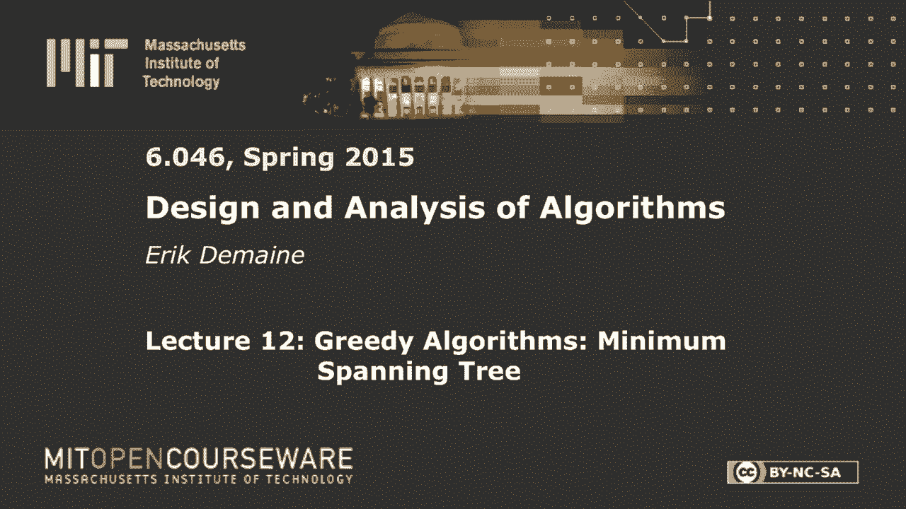
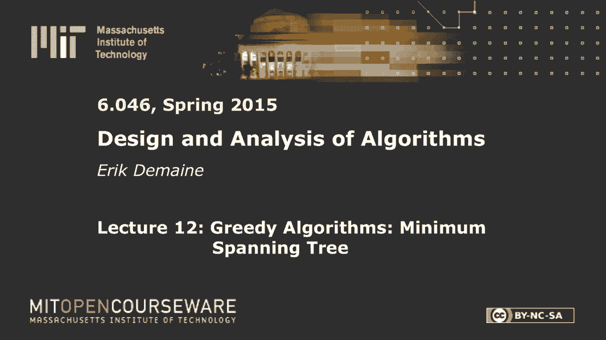
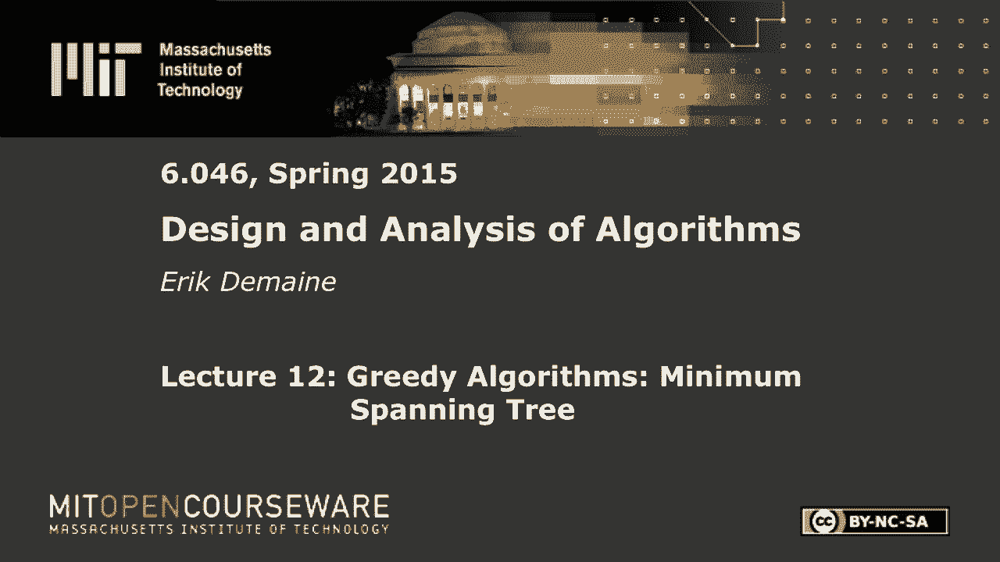
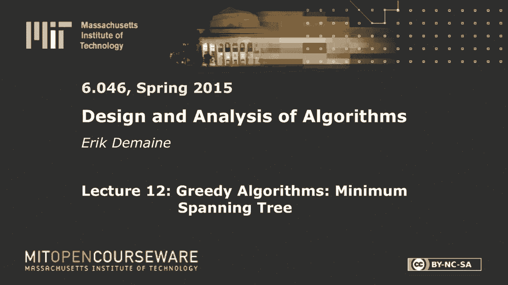

# 【双语字幕+资料下载】MIT 6.046J ｜ 数据结构与算法设计(2015·完整版) - P16：L12- 贪心算法：最小生成树 - ShowMeAI - BV1sf4y1H7vb

以下内容是根据知识共享许可提供的，您的支持将有助于麻省理工学院开放课件。

继续免费提供优质教育资源。

捐赠或查看麻省理工学院数百门课程中的额外材料。

所有的权利，今天就开始吧，我们有另一个很酷的图算法，问题，其实，我们会有两个算法，PROM被称为最小生成树，你大概可以从标题中猜到，它想做什么，我们将看到两种算法，它们都属于贪婪算法的范畴。

这是我们在六零四六已经见过几次的东西，从第一课开始，这是第一节课中贪婪算法的定义，大概，这个想法是总是做出贪婪的选择，这意味着选择是目前当地最好的，这似乎是一件好事，但也许将来它会把你搞砸。

如果你有一个正确的贪婪算法，你证明它不会把你搞砸，所以这里有点像饼干怪兽，总是在当地吃另一块饼干似乎是个好主意，但也许将来它会咬你，所以今天我们将拥抱我们内心的饼干怪物吃尽可能多的饼干，先吃最大的饼干。

将是饼干怪物的标准算法，我不知道你是不是在芝麻街学到的，所有的权利，那么有什么问题呢，最小生成树，谁能告诉我什么是正式的树不是外面的东西，但在图中无循环，图闭合，连通无环图好，那很重要。

这是六零四二的东西，好的，那么生成树呢，所以让我到这边来，生成意味着它包含了这里隐式的所有顶点，我想是子树或子图，你得到了一个图表，您想要该图的生成树，将是一棵生活在图中的树，所以我们要取G的一些边。

用它们做一棵树，做一个连通无环图，那棵树应该击中g中的所有顶点，所以这将是边或子图的子集，这些边缘应该形成一棵树，好吧，如果我只是说他们应该形成一棵树，然后我可以说，嗯，我不要边缘。

这是一棵只有一个顶点的树，那不是很有趣，你想要一个顶点，你想要树的顶点集，与图的顶点集相同，这是生成属性，但你还是想让它是一棵树，所以你想让它连接，你现在想让它是非循环的，如果g断开，这是不可能的。

为此，你可以定义一个跨越森林，就像这样的最大值，但我们会专注于案子，这里g是连通的，这就是有趣的情况，所以我们可以得到一个生成树，那么这个最小生成树问题是什么呢，最小生成树，我们得到了一个加权图。

就像上次用最短的路径，我们有，给我一个真实的数字，让我们对每一条边，我们想找到一个总重量最小的生成树，所以我要定义一棵树的重量T，等于t中所有边的和，因为我把一棵生成树看作是一组边，那个边缘的重量。

好的，所以几乎是你所期望的，最小权生成树，这是一个相对简单的问题，但要找到一个算法并不容易，你需要证明很多才能确保你真的找到了正确的树，我想这里最简单的算法是尝试所有的生成树，计算每个生成树的权重。

返回听起来合理的最小值，这是正确的，但这很糟糕，因为，和第四次，那就太好了，它比那个大，可能没那么明显，但它可以是指数级的，这里有一个图，其中生成树的数量是指数的，这是一个完全二分图，一边有两个顶点。

另一边有n个顶点，所以你可以，假设我们把这两条边放入生成树中，现在对于这些顶点中的每一个，我们可以选择它是连接到左顶点还是连接到右顶点，它只能做一个，但它可以独立地做任何一个。

所以这家伙可能会选择左边的，这只选对了，这个选择左边的，以此类推，如果我在这里有n个顶点，我有两到N棵不同的生成树，所以可以有一个指数数，所以算法不太好，指数坏多项式好。

所以今天我们要得到一个多项式算法，事实上，我们将得到一个几乎线性的时间算法，和Dijkstra算法一样快，但是我们不能用德克斯特的算法，这里没有最短的路，但其中一个算法实际上看起来很相似，啊。

两次讲座前，我们看到的动态编程讲座示例，我们试图做贪婪的事情，它给出了错误的答案，所以我们回到了动态编程，今天我们要尝试做动态编程，它要失败了，我们将反过来依靠贪婪，但它失败的方式是。

我们最初会得到指数时间，然后贪婪会让我们得到多项式时间，这其实有点不寻常，我想说更典型的动态编程可以解决任何问题，但是你知道用n到7运行时间，一些缓慢的东西，然后你用贪婪。

你可以得到n或n log n的运行时间，所以这更常见，但今天我们要从指数下降到多项式，让我告诉你一点贪婪算法理论，可以这么说，这是课本上的，用贪婪算法求解，通常你可以证明该算法的两个性质。

其中一个叫做最优子结构，另一个称为贪婪选择性质最优子结构是一个，这应该是一个熟悉的想法，因为它本质上是动态编程的封装，贪婪算法是，在某种意义上，动态规划的一种特殊形式，所以这是在说，如果你能解决子问题。

最佳，较小的子问题，什么的，然后你就可以解决你原来的问题了，这可能会递归地发生，不管怎样，这就是递归在动态编程中工作的本质，通过动态编程，我们，为了使这成为可能，我们需要猜测解决方案的某些特征，比如说。

在最小生成树中，也许你猜到了正确答案中的一个边缘，一旦你这样做了，您可以将其简化为其他一些子问题，如果你能解决这些子问题，你把它们组合在一起，对你原来的事情得到一个最优的解决方案。

所以这是一个熟悉的属性，对于动态编程，我通常不会这样想，但这本质上是我们正在做的，但是用贪婪的算法，我们不会猜测我们只是会贪婪，吃最大的饼干，这就是贪婪的选择属性，这表明吃最大的饼干实际上是一件好事。

如果我们继续做出局部最优的选择，我们最终得到了一个全局最优的解决方案，没有肚子疼，一般来说，这是你不会期望是真的，但对于最小生成树，这是真的，对于其他一些问题也是如此，明天的背诵课上你会看到更多。

首先我要讲的是一般理论，但我实际上会有一个类似于最小生成树的定理，像这样的最小生成树定理，这是原型机，但今天大部分时间都是关于最小生成树的，最小生成树，这两个都不是很明显，所以我要给你们看这些定理。

它们很容易证明，事实上，但找到它们可能是棘手的部分，其实，我想最优子结构可能是最不直观的，或者最不明显的贪婪选择，你可能已经在想，多么好的贪婪的选择，最小重量边缘似乎是一个很好的起点，我们将到达。

但还有一个更强的版本，我们首先要证明，最优子结构，所以在这里我要像一个动态程序一样思考，让我们假设我们知道解决方案中的一个优势，假设我们知道存在于最小生成树中的边，我们可以猜到我们不会，但我们可以。

让我们假设一个边缘，e，我应该提一下，我想我没说过这张图是无方向的，最小生成树对有向图没有太大意义，这个问题还有其他版本，但这里的图是无向的，所以我可能应该把它写成一个无序的集合，u v。

可能有许多最小生成树，可能有许多相同重量的解，比如说，如果所有这些边的重量都是1，所有这些树实际上都是最小的，所有的边都有一个重量，每个生成树都是最小的，因为每一个生成树都有n-1条边，所以说。

但让我们假设我们知道一个边缘，它保证在某个最小生成树中，至少一个，我想做的是拿着这个，所以让我画一张图，我们有一个图表，我们在图中发现了一些边，生活在某个最小生成树中的e，我要在这里画一些树状结构。

好的，那是摇摆的线条是树，这里还有一些边缘，我不想画太多，因为它很丑，那些是图中的其他边，谁知道他们在哪里，它们可能是各种各样的东西，但我以一种特殊的方式突出了图表，因为最小生成树是树。

如果我从树上删除E，然后我得到两个分量，我移除的每条边都是最小连接，所以如果我删除了一个边缘，我断开成两部分，所以我把它画成左圈和右圈，只是思考一棵树的一般方式，现在这张图片中还有其他未使用的边缘。

谁知道他们住在哪里，好的，我想做的是以某种方式简化这个图，得到一个更小的问题，说一个边少的图，对如何做那件事有什么建议吗，我真的不知道这些白边在哪里，但我想做的是，我想我知道他在哪。

这是我最小生成树中的一个边，所以我怎么能，我想各个击破，也许在这里找到最小重量，最小重量在这里，我当然不知道哪个节点在哪边，所以这有点棘手，但我对E本身该怎么办，让我们从那个开始，是啊，是啊。

你可以把它去掉，这是个好主意，它不工作，但值得一个飞盘，尽管如此，如果我删除这条边缘，一个问题是，也许这些红色的边缘都不存在，然后我的图断开得很好，也许这实际上是一个很好的案例，那可能是个好案子。

那我就知道如何分而治之了，我只是看看连接的组件，如果我删除边缘，我有这些红色的边缘，然后我可能会在剩下的东西上找到一个最小生成树，也许我最终会包括这些边缘中的一个，也许这条边缘最终在生成树中。

然后我不能把E放进去，所以有点尴尬，是啊，是啊，将两个节点合二为一，是呀，紫色飞盘令人印象深刻，这就是我们所说的收缩边缘，它只是意味着合并端点，所以我会画一个新版本的图形，所以在我们把标签放进去之前。

这是U和V，现在我们这里有了一个新的顶点，也就是UV，或者你可以把它想象成布景，uv，我们真的不需要记录名字和你在这里的任何优势，你会有在这里，只是折叠u和v边e消失，另一件事可能会发生，让我，这边。

我们可能会通过这个过程得到重复的边缘，例如，假设我们有U和V，它们有一个共同的邻居，可能有很多共同的邻居，鼻子和其他一些边缘，我合并时不常见的邻居，我想，只要在那个顶点上有一条边在那个顶点上有一条边。

我要做的是如果我在这些边缘放一些重物，比如说a和b，c和d，我只是要采取最低限度，因为我要做的是，在这个图中计算一个最小生成树，如果我在这里取最小生成树，我有多个边，一个重量a一个重量b。

你觉得我会选择更大的重量边缘，它确实，它们的边缘完全一样，但一个是更高的重量，保留较高的重量是没有意义的，所以我要扔掉重量较高的那个，取最小，所以这是边缘收缩和图形的一种特殊形式，我声称这是一件好事。

因为，如果我能在这个新的图中找到一个最小生成树，这通常被称为g斜杠e，而不是负数来消除e收缩e，所以这是g斜线e，这是G，如果我能找到一个最小值，G E中的最小生成树，我声称我可以在原始图G中找到一个。

只要加上边E，所以我要说，是g斜杠的最小生成树，e，T主联合E，是g的最小生成树，所以总的来说，你可以把这看作是动态程序中的一个递归，让我写下那个动态程序，这不会是一个很好的动态程序，但这是一个起点。

这在概念上是我们想做的，我们在猜一个边缘，e，在最小生成树中，然后我们要收缩那个边缘，然后我们要递归，在剩下的东西上找到最小生成树，然后我们找到最小生成树，然后我们要把边缘，把它放回去。

把图表放回原来的样子，然后将E添加到最小生成树中，这个引理告诉我们，这是一个正确的算法，如果你幸运的话，我们将通过尝试所有的边缘来强迫幸运，但如果我们从边缘开始，保证在某个最小生成树中，称之为安全边缘。

我们收缩，我们在剩下的东西上找到一个最小生成树，然后我们可以在最后把e放回去，我们将得到原始图的最小生成树，所以这给了我们这个算法的正确性，现在这个算法又坏了，从复杂性的角度来看，运行时间将是指数级的。

我们可能要考虑的子问题的数量，这里是边的所有子集，没有特别的方法，因为在每一步我们都在猜测图中的任意边，没有结构像，我们不能说，前k条边或边的子串是什么，它只是边的一些子集，有指数级的许多子集，二到E。

所以这是指数级的，但我们要通过去掉猜测来使它成为多项式，这实际上是贪婪算法的一个很好的原型，如果不是猜测尝试所有的边缘，我们可以找到一个很好的边缘来选择，保证在最小生成树中，然后我们就可以按照这个程序。

这就像一个迭代算法，你猜，如果你猜对了，你就选择了一个好的，你拿最大的饼干，你感染了它，然后你一遍又一遍地重复这个过程，这将是贪婪算法的原型，这才是行得通的，有不同的方法来选择这个贪婪的边缘。

我们将相应地得到两种不同的算法，但那是我们首先要去的地方，我应该证明这一主张，因为你知道，边缘收缩从何而来，它为什么起作用，有一个，不难证明，让我们做吧，问题不，所有的权利，应该不用看就能做到这一点。

所以最优子结构的证明，所以我们得到了很多，我们被告知E属于最小生成树，让我们给这棵生成树起个名字，假设我们有一个包含E的最小跨度入口T星，所以我们假设存在，然后我们收缩E，然后我们得到了T素数。

它是g斜杠e的最小生成树，然后我们想分析这个东西，所以我想声称这是一个最小生成树，换句话说，生成树的权重等于生成树的权重，因为这个是最小的，这是一个g的最小生成树，这也应该是g的最小生成树。

听起来很容易，对呀，我要作弊，对不起，我看得很清楚，你知道怎么做，所以我们要做的是考虑收缩，他没事，我们已经知道我们应该考虑在图中收缩e，让我们看看它是如何改变给定的最小生成树的。

所以我们有整个图的T星最小生成树，然后我会感染E，我的意思是，如果那条边碰巧在生成树中，嗯，实际上我们假设E在里面，所以我基本上是在移除，我只是删除边缘，也许我应该叫它负E，所以当我收缩图中的边缘时。

如果我把这棵生成树的边缘扔掉，我现在应该还有一棵生成树，我不知道这是否是最低限度，可能是，但我们现在不能证明，我声称它仍然是一棵跨越的树，那需要什么，它仍然击中了所有的顶点，因为如果我去掉边缘。

事情就不会联系在一起，但这条边在生成树上，然后我把这两个顶点融合在一起，所以不管我是什么意思，以前连接的东西仍然连接着，收缩通常保持连通性，如果这些东西已经被一条边直接连接，当我收缩的时候。

我仍然有一个连接的结构，所以我还在打所有的顶点，而且在n减去1条边之前，边数仍然是完全正确的，之后我仍然有n减去1的边，因为我去掉了一条边和一个顶点，所以这证明它仍然是一棵生成树，使用树的属性。

这意味着最小生成树，1。这东西可不是闹着玩的，g斜杠e的最小生成树的权重比这个小，因为这是一棵生成树，最小值小于所有生成树，所以我们知道T素数的重量小于，或等于T星的重量减去E，酷。

现在我们想知道这件事，T素数加E的权重，这只是T素数的重量，加上E的权重，一棵树的重量只是边缘重量的总和，所以这小于等于t星的w减去e加e，也就是T星的重量，对呀，所以说。

我们证明了我们提出的生成树的权重小于，或等于最小生成树的权重，单位为g，因此t素并集e实际上是一个最小生成树，这真的很容易，实际上意味着所有这些不等式都必须是等式，因为我们从最低限度的东西开始，清除。

那是容易的，一半，更有趣的属性是这个贪婪的选择属性，这就是贪婪算法的作用所在，这通常是证明贪婪算法是正确的核心，我们还没有贪婪的算法，但我们正在考虑，我们需要一些聪明地选择边缘的方法。

我会给你一大堆方法，聪明地选择一个前卫的，所以这里有一个非常强大的引理，我们一会儿要把它做得更强，所以我要介绍切割的概念，那将是一张和我以前有的相似的照片，我要看一些顶点，这里是图中留下的顶点的子集。

其他的都是v减去s好的，所以这里有一些顶点，这里的一些顶点，有一些边缘纯粹在切口的一侧，然后我感兴趣的是穿过切口的边缘，不管它们看起来像什么，这些边缘，如果一条边有一个顶点在V中，而一个顶点不在V中。

我把那个边叫做交叉边，穿过切口，所以说，让我们说，让我具体一点，然后我想要其中一个端点，假设你在S里，我希望另一个不在S里，所以它是大写的V减去S，那将是一个交叉的边缘，在所有的交叉边缘中。

我要买一个最小重量的，可能有很多，但挑一个，那么我声称Edge在最小生成树中，这是我们的金票，对呀，如果我们能保证一条边在最小生成树中，然后我们把它插在这里，而不是猜测，我们就把那个边缘。

我们知道它在最小生成树中，然后我们把它收缩，重复这个过程，所以棘手的部分，我的意思是最小权边在最小生成树中是真的，我把它送给你，问题是你是做什么的，然后我们想继续，3。我猜你是一而再，再而三。

但那将是Kruskal的算法，但在某种意义上，这是一个更通用的工具，这将让我们识别保证在最小生成树中的边，即使我们已经确定了最小生成树中的一些边，所以它更有力量一点，让我们证明这一说法。

这就是事情变得特别酷的地方，这就是我们要使用剪切和粘贴参数的地方，如果你想证明一个贪婪的算法是正确的，你首先想到的是剪切和粘贴，这是一个非常，这几乎是你证明贪婪算法是正确的普遍方法。

你假设你有一个最优解，它没有你想要的那样的属性，这里包括E，然后你通常通过剪掉溶液的一部分来修改它，并粘贴在不同的部分，如E，证明你仍然有一个最优解，因此有一个最优解，有一个MSST有你想要的属性。

好的，所以我们要从一个任意的最小生成树开始，设T星为g的最小生成树，如果边缘E在里面，我们完成了，大概E不在最小生成树中，我们要修改T星，把E也包括在内，我来画一下切口，有s和v减去s，我们有一些优势。

穿过切口的e从u到v，这不在最小生成树中，比如说蓝色的，我画最小生成树，所以你知道，最小生成树，它把这里的一切都联系在一起了吗，它是，我声称它必须有一些边缘穿过切口，因为如果它没有穿过切口的边缘。

它没有把这里的顶点和这里的顶点连接起来，所以它可能不会使用E，但有些边缘必须穿过切口，所以这里有一个可能的最小生成树，如果它碰巧有两个分量，也许谁知道呢，但至少要有一条边，事实上，它是最小生成树T星。

必须将顶点u连接到顶点v不知何故不使用e，但一定有，是一棵树，所以事实上，从u到v必须有一条独特的路径，在最小生成树中，现在u在s中v不在s中，所以如果你看了一会儿那条路，你可能会留在S。

但最终你不得不离开，这意味着必须有一个像这样的边，我称之为E素数，从s到v减去s，在最小生成树中必须有一个边e素数，穿过切口，因为U和V是由一条路径连接的，这条路以s开始，以s结束，而不是以s结束。

所以它至少要过渡一次，它可能会转换很多次，但至少要有一个这样的边缘，现在我要做的是剪切和粘贴，我要去掉e素数，加一个e，所以我要看看T星，我首先声称这是一个最小生成树，我想认领，这可能是更烦人的部分。

它是一棵生成树，这更像是图论的东西，我想有一件事可以安慰你，你保留了边缘的数量，所以它应该还是一个，如果你得到一个属性，你得到另一个，因为我去掉了一条边，加了一条边，我仍然会有n减去1的边，烦恼。

我想当你这样做的时候，事情就变得脱节了，但这基本上不会发生，因为如果我再想去掉e素数，把树分成两部分，我知道通过这条路，其中一部分包含这个顶点，另一部分包含这个顶点，我知道这个顶点与你相连。

这个顶点连接到V，也许我应该把这个叫做u素数和v素数，我知道你和你素数是通过一条路径连接在一起的，我知道v和v素数是通过一条路径连接的，但我知道通过删除e素数，u素数和v素数彼此不相连，因此。

在去掉e素数后，u和v不相互连接，所以当我加e的时候，我又把U和V连接起来了，所以一切都连接在一起，我的边数完全正确，所以我是一棵生成树，这就是图论部分，现在贪婪算法有趣的部分是证明这是最小的。

重量不是太大，所以让我们在这里做，所以我有T星的重量减去E，按线性，这就是T星的重量减去E素数的重量，加上E的权重，现在我们要用这个属性，我们还没用过呢，E是穿过切口的最小重量边，所以E素数穿过切口。

E也是，但E是尽可能小的重量，你可以穿过切口，这意味着我会把它放在这里，e的权重小于或等于e素数的权重，E素数是穿过切口的特定边，他是他们中体重最小的，所以这告诉了我们一些关于这个的事情。

标志是如此困难，我想这意味着这是负数或零，所以这应该小于或等于t星的w，这就是我想要的，因为这意味着，该生成树的权重小于或等于最佳权重，最小重量，所以这意味着，实际上这必须是最小的。

所以我所做的是我构造了一个新的最小生成树，它和星星一样好，但现在它包括了我的优势，这就是我想证明的，存在一个包含e的最小生成树，前提是e是最小权重，边缘交叉和切割，所以这证明了这种贪婪的选择属性。

我要观察一个额外的特点，证明就是这样，所以我们剪切和粘贴，从某种意义上说，我们去掉了一个素数，我们加了一个不同的东西，e，一个有用的特点是我们只改变的东西是穿过切口的边缘，所以我们只有，让我们说，改装。

穿过切口的边缘，我稍后会用到它我们去掉了切口的一条边，我们放了我们想要的，好的，到目前为止，这些是一堆引理，现在我们可以用完，现在我们实际上可以用这些引理来做算法，我们将从不太明显的算法开始，但它很好。

因为它很像Dijkstra，非常接近Dextra模型，然后我们就会看到我们一直在想的那个，也就是选择一个最小重量的边缘收缩，重复这个不太好，是啊，是啊，是啊，是啊，是啊，是啊，那确实有效。

但显而易见的是，可能会很慢，我们想在接近线性的时间内完成，让我们从类似Dijkstra的算法开始，这是Prim的算法，我先把算法写下来，有点长，总的来说，我们要去的想法。

我们想应用这个贪婪选择属性来应用贪婪选择属性，你需要选择一个古板的剪裁，我们将从一个明显的切口开始，它是一个单一的顶点，我们有一个顶点s，我们说这是我们的集大写s，然后你知道它有一些边缘出来。

基本上是S对其他人，这是一个切口，所以我可以采取最小重量的边缘，从那个切口出来，把它放在我的最小生成树中，所以当我这么做的时候，我把它放在我的最小生成树中，因为我知道它在某个最小生成树中，现在。

我要让我们的资本增长一点，包括该顶点并重复，这实际上也是一个非常自然的算法，从一个小的S开始，在每个阶段一个接一个地生长，用这个引理来保证边缘，我添加的仍然在最小生成树中，所以为了解决这个问题。

我们总是需要选择最小重量边缘，那是从伤口里出来的，我们将使用优先级队列来实现这一点，就像我们在Dijkstra做的那样，所以对于V减去S中的每个顶点，我们将在优先级队列中有那个顶点，问题是什么是。

存储在优先级队列中的节点的键值是多少，所以我的不变量是v的键，是边的最小重量，穿过切口变成V，所以对于顶点，我想看看，我不会每次都计算这个，但我会维护它，我希望从s开始到v的边的最小重量，它不在s中。

因为v在q q只有商店，不在s中的顶点，我想要，我希望关键值是最小重量，所以如果我选择全局最小顶点，它给了我最小权重的边缘，穿过切口，我把这个最小值一个接一个地划分为顶点，对于这里的每个顶点。

我要说的是最低进货重量是多少，从这里的某个人那里，最低进货重量是多少？从这里的人到那里的人，把那些东西拿最少，和，当然，所有这些的最小值将是所有这些边缘的最小值，好的，我就是这样把事情分开的。

这样就更容易维护了，但让我先初始化所有东西，好的，我想我们实际上要初始化，s是空集，所以Q会存储每个人，除了我将通过设置特定的顶点小s来开始工作，我要把它的键调到零，小S是谁并不重要，那只是你的开始。

顶点，只需选择一个顶点并将其键设置为零，这将迫使它首先被选中，因为对其他人来说，对于v不等于s，我要把无限的钥匙，因为我们还没有看到任何边缘，但我们一会儿就会改变，好的，这就是初始化。

现在我们要做一个循环，我们要一直走到队伍空了为止，因为当队列为空时，意思是每个人都是S，在这一点上，我们将在整个图上有一个生成树，最好是最小的，我们将通过从优先级队列中提取最小值来做到这一点。

当我们去掉q的时候，当我们移动的时候，我们从q q上移除顶点u，这意味着我们把u加到s上，把它从q中去掉，这意味着它通过顶部的不变量输入s，所以现在我们需要更新这个不变量，以确保所有键值都是正确的。

只要我们把一个顶点移到s，现在我们必须考虑从S到非S的新边缘，我们通过观察你的所有邻居来做到这一点，所以这个我们很久没写了，但在Dijkstra中通常是这样写的，除了在Dijkstra，这些是你的外缘。

和V是这里的邻居，这是一个无向图，所以这些都是邻居，u的v，这是一个邻接列表，啊，所以我们在看你，它刚刚被添加到S中，我们正在查看边缘，我们想看看v减去s的边，只有那些，然后对于那些顶点。

我们需要更新他们的密钥，因为它以前只计算所有这些边缘，从剩下的s到v，现在我们有了一个新的优势，需要考虑的紫外线，因为你刚刚被添加到S，好的，所以我要说的第一件事是，如果v在q中。

所以我们将为每个顶点存储一个布尔值，关于它是否在队列中，所以当我从队列中提取它时，我刚把那个布尔值设为false in the queue，和不在S里是一样的，这就是Q代表的，所以Q在这里，有点这样。

如果我们在排队，就像说v不在s里一样，然后我们要做一个检查，这让我们可以计算出最小值，这看起来很像是一种放松，发生了几件事，因为我想计算的不仅仅是最小生成树的值，我实际上想找到最小生成树。

所以我要存储父指针，但这基本上需要一分钟，我说，如果这条边缘的重量比目前在钥匙里的重量小，然后更新密钥，因为关键应该是最小，这就是我们保持这个不变量所需要做的一切，这个for循环，在for循环之后。

此属性将被恢复，V键将是最小值，此外，我们还跟踪了最小值的来源，所以当你最终提取一个顶点时，你已经想出了你加了哪条边才能把它放进布景里，所以事实上你已经有父母了，这将是U点父母。

我们基本上是想把这条边添加到最小值中，将u加到s时的最小生成树，总的来说，让我来写为什么会发生这种情况，在算法的末尾，我们希望每个顶点，v，我们想要V点父级，这将是我们的最小生成树。

这些是构成最小生成树的边，实际上让我们举一个例子，暂时没有足够的证据，让我们在这里做，需要休息一下，例子很有趣，虽然容易出错，所以纠正我，如果你看到我犯错，让我画一张图，我想从这个顶点开始。

只是因为我知道它做了一件有趣的事情，或者这是一个很好的例子，这是我的加权无向图，我想计算最小生成树，我要从，资本很好，实际上，我从资本开始，所有的重量，所有键值最初都是无穷大，所以我将用蓝色写键值。

所以最初一切都是无限的，对于每个顶点，除s外，该值为零，好吧，那么所有这些都在我的优先队列中，所以当我从队列中提取时，我当然得到了，这就是设置的重点，就在那时，我画了一个包含小s的红色圆圈。

这里的红圈应该是大写的，所以在这一点上，我添加了大写的s，在大写的s上添加了一点s，然后我看着所有的邻居，s的v和我确保它们在s之外，在这种情况下，他们都是三个邻居，这三个人不在S里。

然后我看边缘的重量，这里，我有一个重量为7的边，小于无穷大，所以我要划掉无穷大，写7和15小于无穷大，所以我要划掉无穷大，写十五和十惊奇小于无穷大，所以我要划掉无穷大，右十。

所以现在我已经更新了这三个节点的键值，我应该在优先级队列中提到这样做，这是一个减少键操作，这个东西是递减键，您需要更新优先级队列以表示，嘿，你看，这个节点的键改变了，所以你必须把它放在堆里或其他地方。

就像迪克斯特拉，同样的事情发生了，所以我减少了这三个节点的键，现在我做另一个迭代，我查看存储的所有关键值，最小的是7，因为这个节点已经不在里面了，所以我要把这个节点添加到大写的，所以资本会增长。

包括那个节点，我已经从队列中提取了它，现在我看那个节点的所有邻居，例如，这里有个邻居，九小于无穷大，好吧，九，这里有个邻居，十二小于无穷大，所以我写了十二个，五小于无穷大，所以写五，这里有个邻居。

但S在大S里，所以我们不会碰那个边缘，我们不会碰S，我最终会把每个边缘看两遍，所以没什么大不了的，谁是最小的五个，我想这是最小的蓝色钥匙，所以我们要在布景上加五个，对不起，将此顶点添加到集合s。

然后从这里看所有向外的边缘，所以六实际上小于十二，所以这个边缘比那个好，那我们就定一个八，八还不到十，十四肯定小于无穷大，我们看这个边缘，但那边缘去了，它留在红色的布景里，所以我们忘了这件事。

下一个最小值是六，对呀，所以说，我们把这家伙加进去，我们从那个顶点看边缘，但实际上什么也没发生，因为所有这些顶点都在大写的内部，所以我们不看，我们不关心那些边缘，只有一条边离开切口。

所以那是三和三确实比十四好，很好，现在我想最小的关键是三个通知，最小的键比我们以前见过的任何东西都小，除了零，不过没关系，把它加进去，没有边缘，从那里留下切口，然后这边是9号和15号。

所以首先我们要加九个，那里没有边缘，然后我们加十五，好了现在，这就是我们所做的一切，q为空，最小生成树在哪里，我忘了画，所以幸运的是，这里所有的边都有不同的数字作为标签，所以当我这里有一个三时。

我的意思是在最小生成树中包括三个，标记为3的边缘，所以这将是最小生成树的边缘，五将是最小生成树边，这些实际上是父指针，六将是最小生成树边，七，除了开始的顶点之外，每个顶点都将有一个父顶点。

这意味着我们正好有n-1条边，这是个好兆头，事实上，这将是一个最小生成树，这就是主张，因为每次我们把圆圈扩大到包括一个更大的东西，我们保证这条边在最小生成树中，通过将此属性应用于该切口，我来写下来。

好的，证明正确性，你需要证明一个不变量，这个键，每个顶点的键总是保持这个最小值，所以这是一个不变量，你应该通过归纳法来证明，我不会在这里证明的，但是我们有另一个不变量，从MSST的角度来看更有趣的一个。

这只是树的一种算法实现细节，总是包含在g的最小生成树中，所以在这里，我们用这种方法计算所有顶点的最小生成树，但是我想做的是看看v，它目前在s中，到最后，这将是整件事，但如果我看V in s。

我总是从V到V看边缘，给我这棵树的父母，我声称它将包含在整个图的最小生成树中，归纳法假设是，假设有一个最小生成树T星，它包含T子S，然后算法所做的是，它通过将这个顶点u添加到s来反复增长s。

所以让我们假设它增加了，U to S，所以我实际上要看看边缘，它添加了，所以我们有，s和v减去s，我们这样做，就像我们刚才看到的，增长1，我们在这里给s加上一个新的顶点，这个顶点有一个父边，具有父指针。

所以我把这条边叫做e，所以我们加了一些顶点，我们提取了最小值，我们还在这个TS上加了一个边E，因为我们长了一个S，当我这么做的时候，我所做的就是说，看贪婪选择属性保证有一个最小生成树。

因为我们从队列中提取了最小值，关键值是这样的，就像我以前争论的那样，这是穿过切口的最小整体边缘，E是穿过切口的最小重量边，所以通过贪婪的选择财产，有一个最小生成树，它包含，e。

但实际上我需要最小生成树不仅包含E，但也包含了我们已经说过的在T星中的所有其他生成树的边缘，所以这里我要用更强的属性，我可以修改，所以我们已经假设T星包括T子S，我只是不想打破它。

如果你还记得这个贪婪选择属性的证据，我们说好，我们只需要去掉一条边，穿过切口，用e替换它，所以在这里，我想说的是，有一些边缘，是啊，是啊，也许这里有一些边缘，在我们必须移除的T星中，然后我们把E放进去。

然后我们再次得到一个最小生成树，T星质数，我移除的这条边不能是TS边之一，因为TS的边缘都在S里面，因为我只去掉了一条穿过切口的边，我没有打扰，ts，TS将留在T星内，但我得到了新的性质，e在t星内。

所以我证明了这个不变量成立，我一直在换星星，但我总是保留财产，在s内的所有生成树的边都包含在某个最小值中，g的生成树，所以说，这就是我们如何使用贪婪选择属性，得到Prim算法的正确性。

Prim算法的运行时间是多少，和Dijkstra一样好答案，我想这取决于你使用的优先级队列，但是无论您使用什么优先级队列，和迪克斯特拉一样，所以特别是，如果我们用斐波那契堆，再说一遍，我们不包括。

我们得到v对数v，对于每一条边，我们实际上必须做一个减少键，对于每一条边，我们做两个减少键操作，如果你仔细想想，可能会，但你知道这是在邻接处的循环，这就是这个的成本，这东西是不变的，这个成本是。

所以我们基本上是在做顶点的度数之和，它这个，嗯，也就是边数乘以右二，这是握手引理，所以每一条边，我们可能会做一个减少关键操作，对于斐波那契堆，这是恒定的时间，但我们也在做V提取分钟。

那些花费log v时间，因为Q的大小最多是V，所以这实际上是正确的运行时间，就像迪克斯特拉，这么容易记住的公式，所有的权利，从S的角度来看，L的算法有点奇怪，我猜，但我们走着瞧。

我们一会儿就会看到我们用的是什么切口，但它是基于这样的想法，嗯，全局最小权边是最小权边，所有穿过它的伤口，或者它穿过的所有切口，全局最小权重边缘将是一个有效的选择，所以根据这个定理，你选择一些S来划分。

e，因此E在最小生成树中，所以让我们先选择一个，然后在概念上重复，我们想做的是DP压缩顶点的思想，所以我收缩了边缘，然后找到剩下的最小重量边缘，但我要说的是，它没有明确地收缩，尽管它含蓄地在这样做。

你已经知道了，在我的最小生成树中选择了一些边缘，假设这是最小重量，这是下一个最小值下一个最小值，假设在收缩这些边缘之后的下一个点，最小重量边是这个，我想把这条边放在我的最小生成树中吗，否。

这将增加一个循环，循环不好，所以我要，这是这个算法的棘手部分，我必须跟踪我是否应该添加一个边缘，换句话说，这个顶点和这个顶点是否已经相互连接，事实证明，您已经看到了一个数据结构来做到这一点。

这就是我所说的联合发现，教科书上称之为不交集，数据结构，所以我想保持到目前为止我的MST，所以我一次加一个边，我有一些树，嗯，它实际上是一片森林，但我还是要叫它T，我要在一个工会里维持它，查找结构。

不交集数据结构，记得这做了三次手术，使set联合并查找set，告诉我一个项目，它属于哪一组，我们将使用集合将是连接的组件，所以在我加上这些边缘之后，这些家伙，这里的这些顶点将形成一个连接的组件。

你知道其他每个人都会在自己的独立组件中，所以要开始，我不会在我的树上有任何边缘，所以每个顶点都在自己的连通分量中，所以我通过打电话来代表这一点，制作布景，V对所有人，对于所有顶点。

所以每个顶点都生活在自己的单元素集中，现在我想做最小重量边缘，然后下一个最小重量边，下一个最小权重边也称为排序，所以我要排序，所以我从最小重量边缘开始，所以现在我要在边缘上做一个for循环。

按重量递增顺序，我想知道我只是我有优势，它基本上是剩下的边缘中重量最小的边缘，所以我想知道我是否应该添加它，我要把它加进去，前提是边缘的端点不在同一连接组件中。

我怎样才能知道两个顶点是否在同一个连通分量中，考虑到这个设置，集合，呼叫，找到，设置两次，看看他们是否完全相等，u的与v的查找集不同，find set只返回一些标识符，我们真的不在乎是什么。

只要它对同一组返回相同的东西，所以如果u和v在同一组，换句话说，它们在同一个连接的组件中，然后find set将为两者返回相同的东西，但前提是他们不平等，然后我们可以把这个边，到我们的树上。

所以我们把E加到集合T上，然后呢，我们必须表示这样一个事实，我们只是合并u和v的连接分量，我们通过工会的号召来做到这一点，如果你想知道我们到底用什么，工会找到了答案，为了更快地实现Kruskal算法。

发明了联合查找数据结构，事实上，很多数据结构来自图算法，原因是，斐波那契堆被发明的原因是，因为有Dijkstra的算法，所以这里同样的钢，你只是看到了相反的顺序，你第一次看到联合罚款，现在，工会罚款。

你知道，你可以解n次的alpha，逆阿拉曼函数，超超微小慢生长功能，小于对数对数，日志日志日志日志，嗯，但是我们有这个分类，这有点烦人，所以整体运行时间，我们会担心正确性，一会儿我们要整理。

按权重排序e，所以我就把这种叫做E，然后我们要做一些工会，我想每一个边缘，我们可能会做一个联盟，所以我称之为，我只写e乘以v的alpha，然后我们要做好，我们还得找布景，但同样的交易。

细集合和联合成本阿尔法摊销，所以这样做的总成本，对于所有的边，都是边数乘以alpha，然后是加V，我猜，如果是连通图，则更小，所以除了分拣时间，这个算法真的很好，它更快。

但是如果你用n log n算法排序，这不是很好，事情就是这样，我想你可以把它简化为只对V类而不是E类进行排序，用一点点的努力，比如做一个选择操作，但是当这个算法真的很好的时候，如果你的权重是整数，如果。

如果你有重量，e的是零或一，或者让我们对c说n对于某个常数c，然后我可以使用基数排序线性时间排序，然后这将是线性时间，我只付e乘以alpha，所以如果你有相当小的重量，更好的交叉过程算法，否则，我想嗯。

你更喜欢Prim的算法，但不管怎样，我最近实际上使用了这个算法的变体，如果要生成随机生成树，然后你可以使用完全相同的算法，你随机选择一个你还没有选择的边缘，你看，我可以用这个测试加上这个边吗。

如果你可以添加并重复，这将给你一个随机的生成树，或生成所有生成树，可能均匀跳跃，所以这是有趣的事实，对联合鳍有用的东西，让我简单地告诉你正确，我们再次用一个不变量证明了正确性，声称在任何时候。

我们到目前为止所选择的边T包含在某个最小生成树中，t，星星T星星要改变了，但我总是希望我选择的边在最小生成树内，再次，我们可以用归纳法来证明这一点，所以通过归纳法假设，到目前为止这是真的。

然后假设我们在这里加一条边，所以我们把t转换成t质数，也就是T联盟，e，通过数据结构设置，我知道E的终点，u和v在不同的连通分量中，所以如果我总体上我的图片看起来像我有一些不同的连接组件。

也许有一个单一的顶点，不管我为每一个建立了一个最小生成树，我造了一些树，我实际上知道这些树包含在一个全局最小生成树中，现在我们看到了一个优势，从一个连通分量中的某个顶点u，到不同连通分量中的某个顶点v。

这是我们的边缘，e，那是我们的计划，因为联合查找数据结构，维护连接的组件，这是另一个需要证明的不变量，我们在考虑把这个边，它连接两个不同的连接组件，所以我想用贪婪的选择属性和一些，应该是这样。

我想划过一个切口，那么什么是好的切割，U的连通分量，然后是U的一个连接组件和其他所有可以工作的东西，它也与包含V的连通分量相反，有很多有效的选择，我基本上可以接受这个伤口。

它是u的连通分量与其他所有的连通分量相对于v的连通分量，我可以接受这个伤口，它是U的连通分量，只对其他人，这两个都不行，好的，曲线好，所有的权利，呃，假设s等于u的连通分量或v的连通分量，他越过了那个。

因为它去了，它从u到v，在一边使用，V在另一边，我想包括一个完整的连接组件，因为当我应用贪婪选择属性时，我不想删除这些已经在，我已经放在那里的连接组件，但如果我选择我的削减只是这样。

我知道我可能移除的边缘会穿过这个切口，这意味着它在连接的组件之间，这意味着我还没有添加它，所以当我这样做的时候，应用这个贪婪的选择属性，我不会删除任何东西，T中的一切都还在T星中，所以这告诉我T是质数。

当我应用剪切和粘贴参数时，我得到的新T星，我通过移除一条边并放入e来潜在地修改T星，我移除的边缘还没有在T中，这意味着我保留了这部分，但我也知道我的新边e在最小生成树中，这就是你如何通过归纳法证明。

到目前为止，你选择的边缘一直在T星中，实际应用贪婪选择属性，我不仅需要E被切断，很抱歉E越过了切口，我也需要那个，E是最小重量边，穿过切口，这是一个更多的论点来证明，嗯，粗略的想法是。

如果你忘记了我们已经处理过的边缘，E是全局最小权重边，但是我们已经处理过的边缘呢，他们中的一些人在树上，T中的边缘，那些显然没有穿过切口，我们就是这样设计切口的，切口设计得不交叉。

不要分离这些连接的组件中的任何一个，所以我们添加到T上的所有边缘，那些还可以，它们与穿过这个的边缘无关，但我们可能已经考虑了一些重量较低的边缘，我们没有添加到T，如果我们不在T上加一条边。

这意味着他们实际上在同一组，这也意味着那些是用我的另一种颜色，蓝色，这些都是额外的边缘在这里，在连接的组件中，重量比E小，但它们在连接的组件中，所以他们又一次没有交叉，这样他们就不会穿过切口，而是。

所以E基本上是我们考虑的穿过这个切口的第一条边，因为否则我们会先加上另一条边，所以在这里，我们必须再次进行贪婪的争论，按权重考虑边缘，E是穿过这个切口的第一条边，这是这个连接的组件与其他所有组件。

所以E必须是穿过切口的最小重量边，所以贪婪选择属性适用，所以我们可以把E放在最小生成树中，这个算法是正确的，好的，所以到目前为止，我们已经用了无数次这个引理了。

