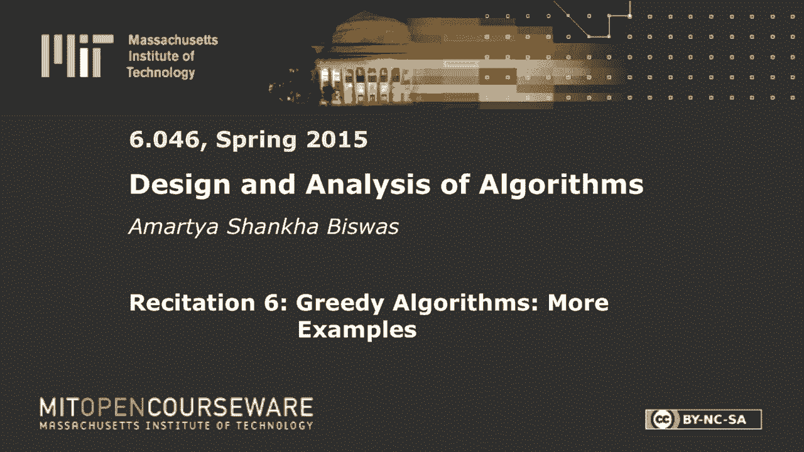
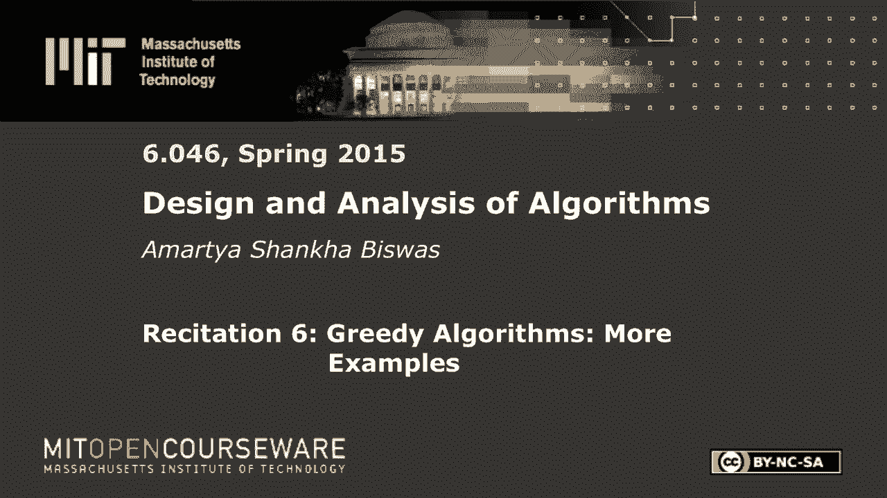
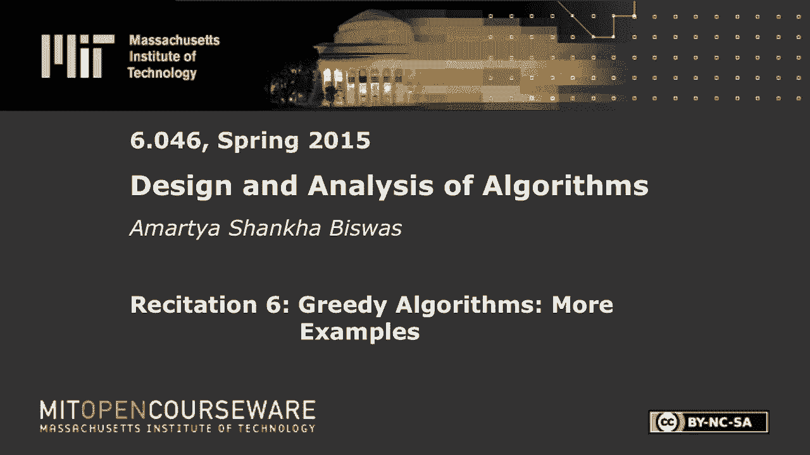
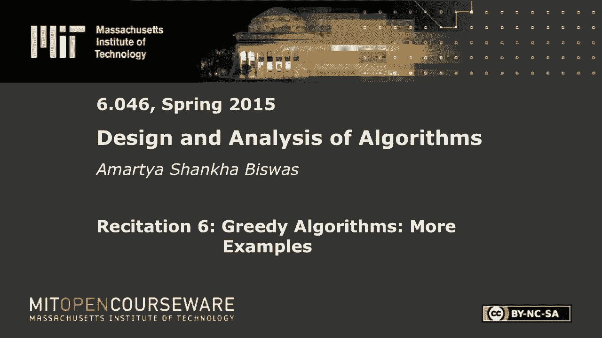

# 【双语字幕+资料下载】MIT 6.046J ｜ 数据结构与算法设计(2015·完整版) - P17：R6. 贪心算法 - ShowMeAI - BV1sf4y1H7vb

以下内容是根据知识共享许可提供的，您的支持将有助于麻省理工学院开放课件。

继续免费提供优质教育资源。

捐赠或查看麻省理工学院数百门课程中的额外材料。

请随意挤在前排，我没那么可怕好吧，所以今天我们要看更多贪婪的算法，所以我想你复习了Kral算法，以及如何进行排序，所以在讲座中，所以回去做上次背诵的改变，所以这就像是一个变体，所以不是离散的硬币。

我们现在有连续的硬币，就像类比一样，这里是，假设你有n种金属，每种金属都有一定的价值，以每公斤CI美元表示，或者你喜欢的任何单位，你想实现一些价值，你想给某人价值T美元的金属。

你想在最小化的同时做到这一点，哦，所以我应该提一下这个，我是每一枚奖牌的重量，你会把这份礼物送给那个人，所以你用金属的k，我和你要，你必须确保，基本上你必须确保K i ci的一些总和，i等于t。

在这样做的时候，您希望最小化所有的总和，K我这么有道理，所以你有一堆金属，有些比其他的贵，你想测量它们，给某人一个固定的值，所以有人有什么想法吗，怎么做应该是，应该是我想到的第一件事，所以你有一堆金属。

其中一些有一定的成本，你试图创造价值，t，你想选哪种金属，所以你想选择，如果你想把金属的重量降到最低，你会想挑每个重量最贵的一个，我们想按递减顺序对它进行排序，这有道理吗，所以说，如果你有最贵的金属。

你想尽可能多地使用它们，这样你的体重就最小化了，所以一旦你按CI排序，所以假设你现在有你的成本就像看，让我们把这叫做Con C2到CN的一些，这些是按顺序排列的，所以它是这样增加的，所以现在你用。

所以说，你现在取你的值，你一个接一个地看着，这就是你需要产生的重量，所以你看，看看有多少，1。你这儿有多少钱？所以金属的量，哦，如此约束，我忘了提，你会得到有限数量的每种金属，好的，没那么微不足道。

所有权利，所以你有，让我们提到这一点，所以你有，这更有意义吗，所以你看t over ci，如果t over ci是，然后你只需使用你需要的数量来构建WI，你就完成了，否则您将使用所有c one ci。

所以如果它是，如果它小于WI，那样的话，你反过来道歉，如果它大于WI，你用完了你用完了，然后你继续下一个，下一个，以此类推，所以这似乎很直观，让我们来做一个正式的证明，所以你要怎么证明这一点，这么说吧。

它被称为基于当前的方法，所以基本上你所拥有的是，假设你在这一点上没有使用最昂贵的金属，所以让我们假设你最昂贵的金属反而花了CI，你决定用cj，所以假设你决定使用一些kj量的cj。

所以你从这里得到的值是cj kj，相反，如果您使用ci，你需要多少金属才能得到同样的价值，你需要CJ，KJ除以CI这有道理吗，所以这是，这是您使用kj获得的值，这种金属的等公斤，所以如果你用这个。

你会得到这个值，因为这是最贵的一个，因为CI大于CJ，这个值，所以这个值小于kj，用这种金属，而不是那个，你正在减少你需要的重量，所以你的所以你的最小化是有意义的，这就像一个非常简单的贪婪算法。

就像算法正是你所期望的，证明并不难，所以让我们继续一个更有趣的，更有趣的一个，那是，这是进程调度，假设你有一台电脑，您正在运行结束进程，以及当时的每一个过程，对于n个进程，t one到true tn。

你想以某种方式订购它们，所以首先你要做进程p，然后处理p2，以此类推，等等，他们需要找到一个完成时间，所以完成时间很简单，进程I何时结束，那么进程I什么时候结束，你只要一加B，就像Pone的时间。

加乘以p2到pn，所以基本上你有你所有的过程，所以让我们假设这是这是B，这是p2，以此类推，中间某道工序的完成时间，只是它之前所有时间的总和，这就完成了，现在你想做的是最小化平均完成时间。

也就是n的所有完成时间的总和，所以有什么想法，它的算法是什么样子的，所以本质上你想最小化所有这些时间的总和，所有这些时候，你想最小化这些的平均值，那么你想做什么，你想转移，越慢，轮班。

像处理器需要更多的时间，你想把它们留在最后吗，还是你想从头开始，所以如果你有一堆小过程，最后你会怎么做，一开始你是怎么做的，所以完成时间是什么时候，假设这是过程PI，过程PI的完成时间是这样的距离。

就像圆周率什么时候完成，所以它是所有时间的总和，时间从p1和p2到答案，所以你想基本上最小化这些值的平均值，那么你会把较小的过程，你能把较短的过程放在末尾还是开头吗，哪一个，哪一个会降低你的平均水平。

有道理，对呀，好的，所以是的，那是有道理的，所以你基本上想把这些线条压缩到开头，所以你的平均水平较小，注意这个这个，这个总数，这个总长度总是常数，就像对一切的总结，所以无论如何，所以让我们去这么好。

这是一种策略，这是越来越多的订单，基本上就是这样，这是你的算法，按照这个顺序，过程是什么，所以让我们试着证明这一点，所以你证明这是一个相当通用的方法，经常用来证明算法，所以假设这不是最优的。

假设有人走过来告诉你，好的，我有，我有一个更好的，我有一个更好的序列，我有一个序列，就叫它吧，假设我有一个pone到pn的序列，这个序列比排序的顺序做得更好，所以你就像，好的，所以如果这个没有排序。

然后中间有一些元素，假设你叫他们圆周率，大于PJ，在哪里，带i的pj小于j，所以这里有一些圆周率，这儿有睡衣，使这比那更大，所以它不是，它不是按顺序排列的，这样你总能找到一双那样的，所以现在我现在。

我要声明，如果你交换，如果交换这两个值，如果你交换圆周率和PJ，这实际上会减少目前完成的平均完成时间，你有，所以你一开始，你有这样的东西，所以没有，我们不是缠绕者，假设你有一个，你有这个过程。

所以圆周率，其实，这是个大过程，对呀，就像，这是圆周率，这是PJ，现在我说的是一些东西的结局，我的主张是不，这不是，这不是最佳的，如果你把睡衣移到这边来，你会做得更好。所以你想从这个到，大流程。

所以让我们看看当你从那里到那里时会发生什么变化，所以首先观察这后面所有东西的完成时间是一样的，它们都有相同的完成度，没有任何影响，你只改变了这两件事，像这之后的一切也和完成时间一样。

所以唯一改变的是这个这个，和所有的到这一个，即使是这个完成时间也是一样的，有道理，那么这个变化有多大，所以让我们定义，这么说吧，让我们定义，这个增量等于，所以这两个过程的区别，那么什么是。

所以最初的完成时间是圆周率是这样的，现在下面相应的过程，完成时间按增量递减，所以完成时间首先从我嘴里说出来，九是三角洲，这只是完成时间的总和，除以n是常数，所以你只想把这个最小化，所以首先它去。

所以这个是负三角形，那么让我们来看看下一个过程，下一个过程是这样的，所以这些都没有改变，你只是在交换这两个，所以这个完成时间也会下降一个负增量，以此类推，以此类推，你就得到了一堆负三角形，等于。

无论您有多少进程，但这并不重要，重要的是只要交换你，你至少会得到一个负△，△是正的，因为假设，因为假设TPI减去TPJ是正的，所以只要交换，你就会一直减少它，因此，声称该序列是最优解的说法是错误的。

你总是可以通过交换两个倒置来做得更好，所以无序的顺序被称为反转，所以如果你交换一个反转，你总能得到更好的结果，那个证明有道理吗，所有的权利，这是一个稍微有趣的最新算法，所以让我们继续我们这里的第三个。

第三个是事件重叠，所以这就是它的工作原理，所以说，你早上醒来，你看着你的日历，作为一个麻省理工学院的学生，你的日程表看起来很满，所以假设这就是它看起来的样子，这些是你的活动，让我们用一些颜色。

好像有一点，可能是，假设你在这里有另一个活动，你有，这里，好的，所以好吧，这次我们行动吧，其实，所以这里的问题是你现在已经计划好了这些活动，很明显它们是重叠的，所以你不能参加所有的。

所以这个想法是你做一堆你自己的克隆人，所以在这种情况下，看看匹配的颜色，所以如果你创建克隆，一号在这里，低的2号变成红色，低三号变成蓝色，所以下面的1号是这样做的，慢数三蓝色一低数二红色。

我想我们应该把红色往后移一点，一点点只是为了说清楚，是啊，是啊，我们走吧，现在你可以，所以现在你可以很容易地看到这是最优的，所以你可以你可以，你可以用三个克隆人做到这一点，所以你打三个电话。

然后你就可以去春假了，你的时间表很好，那么现在你如何解决这个问题，那么给出一定数量的间隔的贪婪策略是什么呢，你如何找到你一天所需的最小克隆数量，有什么想法吗，你能做什么天真的事，覆盖您的数据，所以你想。

你想做每一个，你想做每一件事，但你喜欢，所以这个克隆一号做了这个事件，那么他就不能做这个事件或这个事件，你想做所有的事件，你想最小化一个的数量，所以这就像间隔调度，但你想做所有，你想做所有的间隔。

但你可以，但你可以用多个人来做所有的，到结束时间，好的，度假后你做什么，被时间，我会的，所以你很近，所以你要从排序开始，但实际上你可以通过在结束时排序来做到这一点，它更容易可视化您按开始时间排序。

所以从那开始，任何人都想顶上，是啊，是啊，每次你这样做，是啊，是啊，本质上是的，每次你不能把它加到你现在的衣服上，您创建一个新的，你也可以做结束时间，因为对称，对呀，所以如果你按结束时间排序。

然后你从最小的最大的结束时间开始，然后倒退完全相同的事情，所以让我们把它写下来，所以说，所以从开始时间开始，所以实际上让我们来计算这个例子，所以说，在这种情况下，你会去好的，其实是这样的，如果你先排序。

你就有了一个，那你就有两个，五六，所以按开始时间排序，然后我们有你先选这个，然后是2和2的交点2和1的交点，所以你放两个进去，所以这是这是第一个克隆，然后你必须为两个人创建一个新的克隆。

所以你创造了一个新的克隆体好了然后你去三个，三次冲突同时有一次和两次，所以你必须再次创建一个新的克隆，所以在这种情况下，你去创造，然后你去四现在四，你看不是二和三的冲突，但这很好，有一个很好。

所以你只要在这里放四个，如果你继续这样，你基本上得到了这个，还有这个，有道理，你就是这么安排的，算法也是如此，有道理，试图证明它的正确性，所以让我们说，让我们看看这个例子，你在那里插入蛾子克隆。

那就是我们的，是啊，是啊，让我们如此疯狂地克隆，所以当第m个克隆被创建时，你已经有一些已经有一些值在这里，所以你有1-2一直到m-1，所以现在你把你的间隔，你会看到它与所有这些值相冲突。

所以让我们为所有这些家伙画最后的间隔，所以让我们假设这家伙的最后一个间隔是在这里，让我们说最后的审查，这家伙的间隔在这里，以此类推，废话废话，废话废话，所以当你读到阿莫斯克隆时，你看开始时间。

所以发生的事情是开始时间，开始时间在某个地方，让我们在这里说，现在你知道因为这个，所以你只是添加了一个新的克隆，当你没有可用的插槽时，所以这意味着这里有一些区间与这个相交，那你怎么证明。

那么你如何证明有一个间隔，所以考虑任何级别，假设没有间歇性双性人，所以这意味着要么，所以有一个，所以如果这里有一个缺口，所以如果这里有一个缺口，所以我们假设在这个位置，这个间隔不在这里。

假设你把这条线向外推，所以这是你当前的起始值，假设你看着这条线，在这个片段中，你可以，你不能有在这之后开始的东西，因为这是当前最高的排序开始时间，所以在这之后没有间隔。

所以唯一可以存在的间隔已经在这里结束了，如果他们已经在这里结束了，这意味着你可以在这里添加，这有意义吗，然后你就可以表现出来了好吧，所以在每一个存在的，如果你要添加一个新的克隆。

这意味着在每一个现有的层次上，你都有一些相交的东西，所以这意味着你有，你有一个单一的时间点，其中有m-1加1间隔，这意味着你绝对需要m间隔，不管你的策略是什么，所以添加蛾克隆是必要的。

所以如果我们继续争论，就像我们说你的克隆总数是M，所以你可以在这里为m做这个论证，你会证明，哦，如果我正确地遵循了所有这些规则，我可以证明m的开始时间与m相交，减去另一个间隔，所以没有办法。

我可以创建一个小于安培的调度，克隆，那个论点，有道理，或者再次接管，所以耶，好牌，但那应该是以防万一，好的，嗯，这就是三个问题，所以我想你可以回到这个，并为此提供动力，所以这个可以，比如说，用于。

这可以用于服务器的调度过程，例如，假设您的服务器收到运行n个进程的请求，他们有这样的时候，所以这是最短的时间，所以你把所有的短，就像最小的工作，你一开始就执行它们，你等待其他工作，这也可以在网上完成。

所以如果你要有一个在线版本，所以如果你用这个算法在网上做，假设您的服务器正在运行作业，你会得到一个新的请求，所以你会得到一个新的请求，所以你已经有了一些，假设你此刻正在运行这个，TI是你最小的工作。

你在管理它，你目前在这一点上，所以你可以在运行过程中，你可以得到一个新的工作请求，那么您将如何修改这个算法来处理，所以你还是要保持最低的平均完成时间，那么你会如何处理这种情况呢？假设你正在工作。

你会收到一堆新的请求，所以您当前的设置是所有这些现有的作业，再加上一些，加上你在这里得到的其他东西，那又怎样，你认为在这里换一份工作怎么样？还是你会一直这样，假设其中一个。

假设你得到的一个新工作真的很小，会使用，所以在这种情况下，你会做的是，与其继续这样做，你会切换到当前最小的工作，所以你会看看剩下的时间，所以这很重要，这样你就可以忘记你已经在这上面花了多少时间。

你知道剩下的时间是多少，这就是所有相关的，所以如果你只是这样，你可以就像，在不同的框架下考虑这个问题，完全一样，这是完全相同的问题，你只看剩余时间而不是总时间，所以如果你在工作中，一个新的进来了。

它更小，你切换到那个，完成它，然后走，然后看看所有东西的剩余时间，所以在某个时候你可能会有很多半途而废的工作，就像躺在那里，对于所有这些，您将更新他们的ti值为剩余时间，而不是开始时间。

这给了你一个很好的方法，比如决定在网上做哪个过程这给了你，所以这是假设你所有的，你所有的任务都有相等的权重，所以他们都有平等的回报，所以很明显，这并不总是你想要的情况，你可能会永远推迟一项很长的工作。

因为小事情不断出现，这可能会变得重要，但如果一切都同等重要，那么这是你能做的最佳事情，这是一个非常简单的有效策略，这就是我想讨论的三个问题，你们还有什么问题或意见吗，什么的，很早很早。

