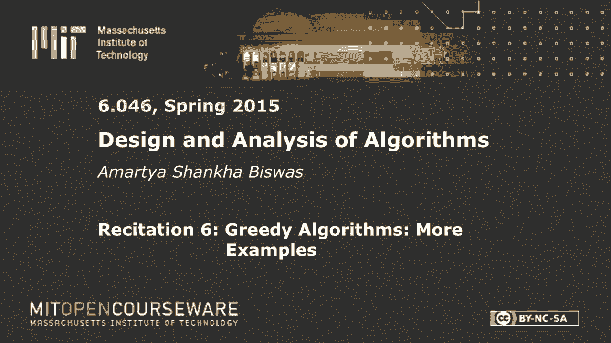
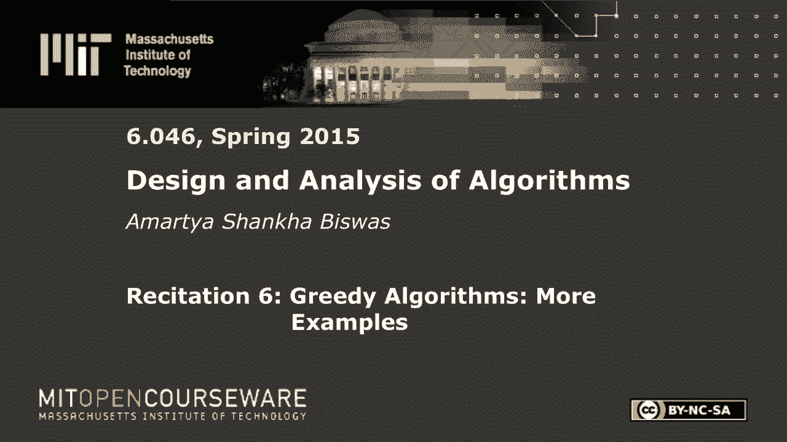
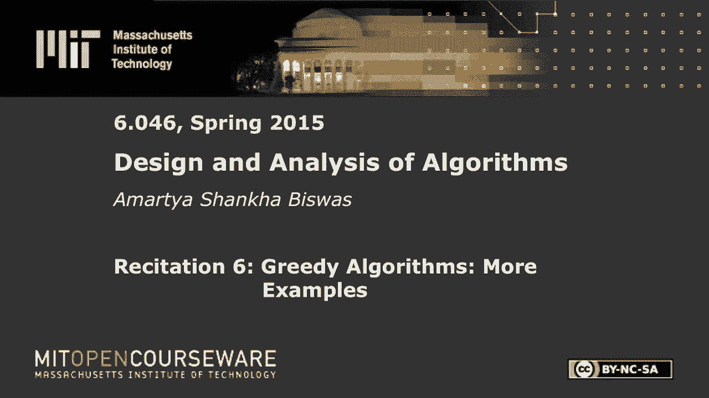
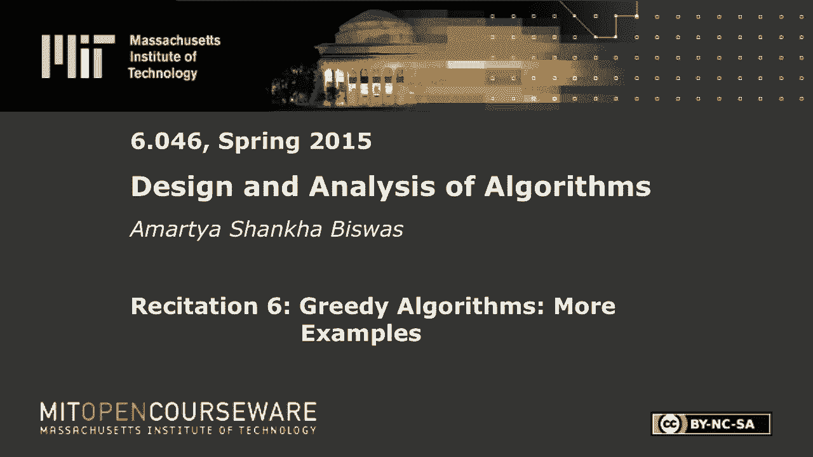

# 数据结构与算法设计：P17：贪心算法 🎯

在本节课中，我们将学习贪心算法的核心思想，并通过三个经典问题来理解其应用。贪心算法在每一步都做出当前看来最优的选择，希望以此达到全局最优解。我们将探讨连续硬币找零、进程调度和区间着色问题，并学习如何证明贪心策略的正确性。

---

## 连续硬币找零问题 💰

上一节我们回顾了离散硬币的贪心算法。本节中，我们来看看一个变体：连续硬币找零问题。

假设你有 `n` 种金属，每种金属的价值为每公斤 `Ci` 美元。你需要赠予他人总价值恰好为 `T` 美元的金属。每种金属你有有限的数量 `Wi` 公斤。你的目标是**最小化所赠金属的总重量**。

**核心思路**：为了用最少的重量达到目标价值，应优先使用单位价值最高（即最昂贵）的金属。

以下是解决问题的步骤：

1.  **排序**：将所有金属按单位价值 `Ci` 降序排列。
2.  **贪心选择**：从最昂贵的金属开始，尽可能多地使用它。
    *   设当前金属单位价值为 `Ci`，可用数量为 `Wi`。
    *   计算达到剩余目标价值 `T` 所需该金属的重量：`need = T / Ci`。
    *   如果 `need <= Wi`，则使用 `need` 公斤该金属，问题解决。
    *   如果 `need > Wi`，则用完所有的 `Wi` 公斤，更新剩余目标价值 `T = T - Ci * Wi`，然后考虑下一种金属。

**正确性证明（交换论证）**：
假设存在一个最优解没有优先使用最昂贵的金属 `i`，而是使用了单位价值较低的金属 `j`（`Cj < Ci`）。设该解使用了 `Kj` 公斤的金属 `j`，其贡献价值为 `Cj * Kj`。
如果我们将这部分金属 `j` 替换为金属 `i`，为了获得相同的价值，只需要 `(Cj * Kj) / Ci` 公斤。由于 `Ci > Cj`，因此 `(Cj * Kj) / Ci < Kj`。这意味着替换后总重量减少，与“最优解”矛盾。因此，优先使用最昂贵金属的贪心策略是正确的。

---

## 进程调度问题 ⏱️

了解了如何最小化重量后，我们来看看如何安排进程以优化效率，即最小化平均完成时间。

假设有 `n` 个进程，每个进程 `i` 的运行时间为 `Ti`。你需要决定一个执行顺序。进程 `i` 的完成时间是其开始时间加上它自身及之前所有进程的运行时间之和。目标是**最小化所有进程完成时间的平均值**，等价于最小化完成时间的总和。

**核心思路**：为了最小化总完成时间，应该让运行时间短的进程先执行。这可以减少后续进程的等待时间。

**算法**：将进程按运行时间 `Ti` 升序排列，并依此顺序执行。

**正确性证明（反证法）**：
假设存在一个最优顺序不是按升序排列的。那么在这个顺序中，必然存在一对相邻的进程，其中前一个进程 `P_i` 的运行时间大于后一个进程 `P_j` 的运行时间（即 `T_i > T_j`）。
考虑交换 `P_i` 和 `P_j`。交换后：
*   在 `P_i` 之前的所有进程完成时间不变。
*   `P_j`（现在排在前面）的新完成时间比原来 `P_i` 的完成时间减少了 `T_i - T_j`。
*   `P_i`（现在排在后面）的新完成时间等于原来 `P_j` 的完成时间。
*   在 `P_i` 和 `P_j` 之后的所有进程完成时间不变。
设 `Δ = T_i - T_j > 0`。交换后，`P_j` 的完成时间减少了 `Δ`，并且 `P_i` 及之后所有进程的完成时间都至少减少了 `Δ`（因为 `P_i` 本身时间变短了）。因此，总完成时间严格减少，这与原顺序是最优的假设矛盾。所以，按运行时间升序排列的顺序是最优的。

---

## 区间着色（事件安排）问题 🎨

最后，我们处理一个资源分配问题：如何用最少的“克隆人”参加所有重叠的活动。

给定一系列时间区间（每个区间代表一个活动），区间之间可能重叠。你无法同时参加两个重叠的活动。目标是找到参加所有活动所需的**最小“资源”数**（例如，克隆人或会议室）。

**核心思路**：这是一个区间图着色问题。贪心策略是：按开始时间顺序处理区间，总是将当前区间分配给第一个可用的“资源”；如果没有可用资源，则开辟一个新的。

以下是算法步骤：

1.  将所有区间按开始时间升序排序。
2.  初始化一个资源列表（最初为空）。
3.  遍历每个区间：
    *   检查现有资源中，是否有某个资源的最后一个活动结束时间早于当前区间的开始时间（即不冲突）。
    *   如果存在，则将当前区间分配给该资源，并更新该资源的最后结束时间。
    *   如果不存在，则创建一个新的资源，并将当前区间分配给它。

**正确性简要说明**：
假设算法创建了第 `m` 个资源。在创建它的那一刻，当前区间与前面 `m-1` 个资源中的最后一个区间都发生冲突。这意味着存在一个时间点（当前区间的开始时间），被 `m` 个区间同时覆盖。因此，无论采用何种安排，至少需要 `m` 个资源。这证明了算法找到的资源数 `m` 是最小的。

---

## 总结与拓展 🚀

本节课中我们一起学习了三种贪心算法的应用：
1.  **连续硬币找零**：通过优先使用单位价值最高的资源来最小化总消耗。
2.  **进程调度**：通过优先执行短任务来最小化平均完成时间。
3.  **区间着色**：通过按序分配并总使用第一个可用资源，来最小化所需资源总数。

贪心算法的关键在于每一步做出局部最优选择，并能够证明该选择能导向全局最优解。常用的证明方法包括交换论证和反证法。

**在线算法拓展**：对于进程调度问题，如果任务动态到达（在线情况），策略变为**始终执行剩余时间最短的任务**。这需要系统能中断当前任务。虽然可能导致长任务被不断推迟，但在所有任务优先级相同的情况下，这仍然是优化平均响应时间的最佳策略之一。