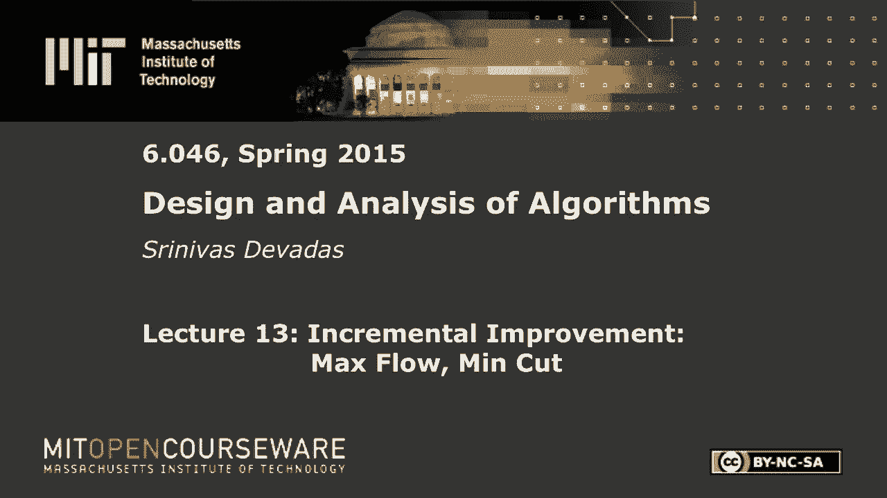
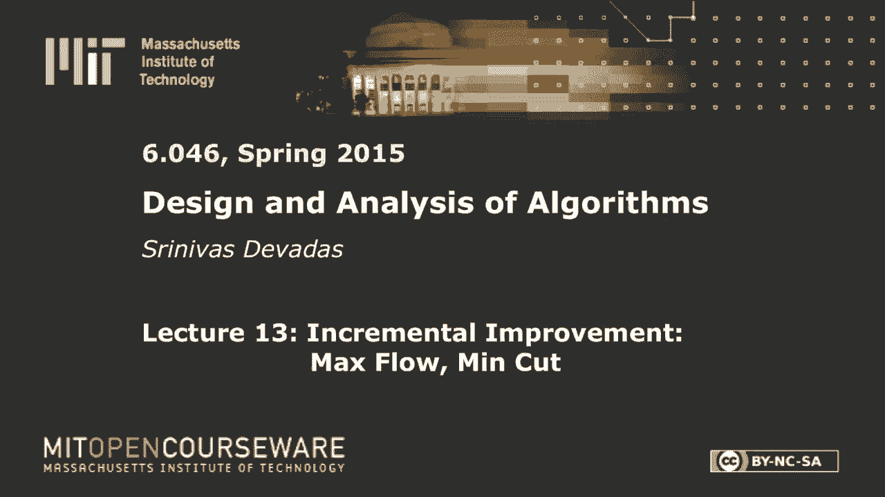
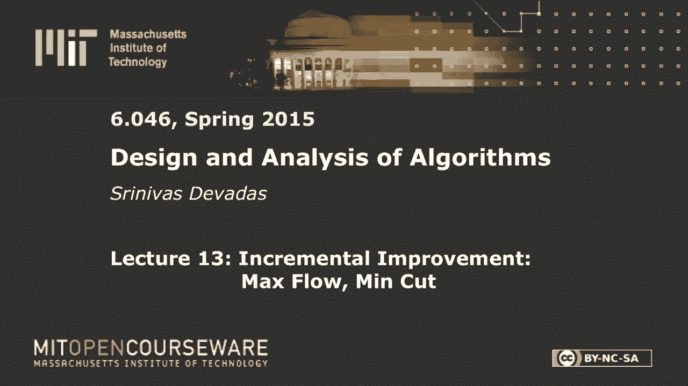

# 【双语字幕+资料下载】MIT 6.046J ｜ 数据结构与算法设计(2015·完整版) - P18：L13- 最大流量，最小切割 - ShowMeAI - BV1sf4y1H7vb

以下内容是根据知识共享许可提供的，您的支持将有助于麻省理工学院开放课件。

继续免费提供优质教育资源。

捐赠或查看麻省理工学院数百门课程中的额外材料。

所有的权利，早上好，欢迎大家春假归来，我希望你有一个愉快的假期，迫不及待地想回到六零四六，太刺激了，下半场，我今天要做流量网络，星期四，下周，它是关于复杂性的线性规划，分布式算法。

密码学的话题将会迅速而激烈地到来，希望他们都很有趣，所以有很多与网络流最大流相关的设置，这是一个优化问题，所以我要在这里度过第一个小时，希望不会太无聊，建立流动网络，描述最大流问题，大家可以看到。

这个轮廓相当复杂，谈论网络中的削减，残差网络，我们或多或少，2。我以最后的声明结束这次演讲，虽然不是证据，我们下次讲最大流最小割定理时再讲，这是文学中的一个标志性定理，突然间，流动网络的关键定理。

取最大流量最小割定理，并利用它得到有史以来第一个最大流算法，这是由于福特和富尔克森，下次我会谈谈最大流量的证明，谈谈福特·富尔克森的一些问题，然后用最大流量，作为解决二部匹配中有趣问题的锤子。

棒球季后赛淘汰，和类似的东西，所以就像最短的路径可以使用，不仅仅是计算，从a点到b点的最短距离，你可以想象其他问题，比如说，调度问题，时间问题可以用Dijkstra解决，你可能见过这样的例子。

最大流量是另一个算法锤，它被用来解决各种各样的问题，我们今天就不涉及这方面了，但我们周四会花很多时间讨论这个问题，所以让我们开始吧，我们将从定义什么是流网络开始，在某种程度上，这真的很简单。

我是说这是一个，这是一张图表，一个图会有顶点和边，我们只看有向图，我们要有一个，与这些有向图相关的几个约束，将使算法和证明，符号也简单多了，我将在几分钟内讨论这个问题，流网络的关键是，我是说。

就像你有最短路径的源和目的地一样，在流动网络中也是如此，你会有消息来源，你会有一个正确的权利，所以我们将有区分的顶点，两个可分辨的顶点，我们将称他们为来源S和Sinc T，所以这里的基本思想。

只是为了把事情安排在前面，会有一些流从S出来，和，它必须遵守一些约束，与边的容量有关，为了到达T，一路上这是流动，这是水，你可以把它想象成水或汽车，或者你有什么，这是一个费率，您不允许在中间节点中积累。

所以你会有一个守恒定律，与这种流动的商品有关，你知道的，不管是水、车、人，这基本上归结为除了s或t之外的任何顶点，所有进入顶点的东西都必须离开顶点，这就像柯尔霍夫的现行定律，比如说。

所以这里有很多关于现实生活或电力的类比，在这种情况下，你会看到，当我们一起走的时候，我一遍又一遍地思考，所以让我们来看看一个流网络，我不打算在这里把它画出来，我要把这个例子贯穿整堂课。

但只是为了谈论边缘和容量，在我们真正画一个例子之前，我们会有边缘，有向边，u v，所以你有一条从u到v的边，它将属于e，显然这就是边缘在网络中的原因，这条边将有一个非负的，每条边都有一个非负的容量。

如果没有优势，一比二，这些是与源或汇不同的顶点，作为一个例子，或者你可以说它在a和b之间，那么我们将假设容量为零，所以如果u v不属于e，那么假设c u v为零，所以没有办法从u到v这个。

这个比率这个水车，你知道没有路可以让你从你到V OK，所以让我们画一个流网络的例子，我们会讨论流量和最大流量，排序示例驱动算法设计，如果你愿意的话，我有一个消息来源，我有一个Sinc T。

然后我在中间得到了一堆节点，把他们引出来，我不打算费心给那些节点命名，现在这可能是个错误，你会看到的，所以这不像，它是一个无环图，你在这个图中允许循环，但是我们会有几个与这个图相关的约束。

我一会儿就会讲到，所以首先，这就是我们所得到的，你得到了GVE有向图可以在其中有循环，我要在这里画几个数字，我在这里列出的数字是容量，与这些边缘中的每一个相关联，所以说，这些只是能力，那些是c uv的。

我说如果u v不属于e，那么你就会假设c uv为零，所以没有边缘，比如说，节点和那个节点，所以你不可能直接从这里到那里，你可以这样走，像这样像那样，从这里到那里，你显然可以这样走，像这样像那样从。

左上角的那个到右下角的那个，好的，所以说，事实上，我们刚刚谈到了容量，这是带宽，如果你愿意，这是可以通过这条路的交通量，现在我们要谈谈具体的案例，我们实际上要把东西推到网络上，所以我们会有另一个号码。

所以通常我们会有两个数字与每条边相关联，其中之一将是容量，另一个是通过边缘的流动，你可以想象，我们将有这个约束，也就是说流量永远不能超过容量，这是与每个边相关联的局部约束，好的。

这并不意味着没有可能的变化，关于网络的整体流量，我无法改变的事情，你服从边缘容量，可能会有不同的水流从S出来，进入T等等，所以这里会有一个优化，与所有服从这些边缘约束的精确数字相关联。

所以这些边缘容量限制，好的，所以让我们举一个网络中流的真正简单的例子，还有啊，我这里有些彩色休克，我可以在这里放下气流，所以这是流动，哇哦，这是一个丑陋的颜色，但现在我们在这节课剩下的时间里被困住了。

所以我得到了2到1冒号3，所以第一个数字是流量，第二个数字是容量，我把它写下来，这是，这是一个冒号三，这是一个冒号一个，这样就满足了容量，这是两个，2 3和1 2好的，这是我第一个关于流的例子，我们想。

我们想确保这种流动是有意义的，好的，我们将在一分钟内更准确地写下这一点，但我已经给了你直觉，我已经谈过了，从源头有流量是可以的，是的是的，它是，是那座山，你知道，喷水，那是这条河的源头，这是大海。

比如说，河水流入其中，但一路走来，你真的不能有积累，好吧不是因为当你把它看作是一个比率，所以这是每秒加仑，那么也许你会有一点积累，但在很长一段时间里，你知道你不可能有无限的积累。

所以这就是守恒定律起作用的地方，进入未标记的节点，s或t必须离开节点，所以你看这个，你走得很好，这里有两样东西，1加1等于2。有两个离开，所以我们在那里很好，好然后再挑一个，这个，比如说，你有两个进来。

你有一个和一个离开很好就在那里，你有三个人进来，二加一，还有一个检查要做，你有两个从源头出来，希望一切都有意义，并提出问题，如果你感到困惑，嗯，另一件有趣的事情是你可以。

你可以有在一个小循环中流动的商品，你能看到吗，这里有人看到吗，去吧，下直角三角形，像这样的东西很好，所以你看这个往上，这边那边，所以没有什么能阻止我们，我在这里有一个，所以我要做那个零，我这里有两个。

我要做那个，我这里有两个，我要做那个，是什么，以前是一个，哦，你说的对，以前是一个，所以我应该做那个零，然后呢，3。我想从我原来的帐中减去一部分，好吧，我和我搞砸了，简单的事情好吧，哇哦。

难怪我的专业不是数学，计算机科学是一个宽容的领域，所以你可以去零很好，这是零所以现在，让我们看看我们这里有什么，检查没有出错，好的我们要检查是否出了问题，所以两个进来，我有一个出去，一个出去。

没有东西进来，所以我们都很好等等，好的，这里发生了有趣的事情，关于守恒定律和必须遵守它们，一般来说，你可以想象我们感兴趣的只是，最大限度地从源头获得流量，尽可能多地从源头获得流量，把它推到水槽里，好的。

现在，这里流入T的流量，你可以看到是二加一，也就是三个，利用这个特殊的流量网络，增加流量，我是说减少流量很容易，你可以让一切都为零，那是有效的，对呀，但是你能不能增加流量。

你认为这个流量网络允许更大的流量吗，鉴于这些边的容量是固定的，我不会改变他们，让我们看看，我想你们都有飞盘，对耶，所以是的，在后面，因为你在最大化边缘，必须增加，就像从底部出来的那个必须增加，两个也要。

那边的人同意这一点，是啊，是啊，花车二，所以S是它上面的一个，作为两个，然后从那个到右边两个，就像现在这样，从T的那个节点有两个，然后沿着底部你有另一个，好吧这对我来说很有意义。

它做到了刚刚在这里做出的重要观察之一，让我专注于，这就是为什么我想另一位先生说不，你实际上可以减少特定边缘的流量，这将帮助你增加整体流量，对，这就是为什么这个问题很有挑战性。

这就是为什么我们需要这么多的设置，所有的权利，所以我能做的一件事是，我基本上可以说你知道，我要拿着这个，把这个变成这个零，所以当我这么做的时候，本质上我所拥有的是，我可以，我可以从这里推出更多的流量。

对呀，所以我也可以推动更多的流量，我可以把这个变成2，我可以把这个变成二，我是对的，我没有完全，我是说，我这里有一个小虫子，但我可以把它修好，我这里有一只小虫子，上面写着我有两个要出来，我做了这个零。

所以我得推更多的东西，但是嘿，我很幸运我在这里，这给了我想要的一切，正确，所以我可以把这个变成两个，所以现在我们得到四个流，你们两个都有飞盘，我们应该用蓝色和紫色吗好了，你能站起来吗。

这实际上在某种程度上总结了我们未来的任务，所以我们必须想办法增加流量，有时我们不得不后退一步，从某种意义上说，我们减少了特定边缘的流量，所以这不是Dijkstra会做的单调的增加。

或者像Eric谈到的MSD这样的贪婪算法，这里会有更有趣的东西，我们最终会以单调的方式做事，就整体流量而言，所以我们试图达到的最大流量，将从当前的流量开始，我们将不断改善当前的流量。

但这并不意味着边缘看起来单调，就某一特定边缘的流动而言，关于能力，你永远不会超过容量，但是正如你在这个小例子中所看到的，我们把垂直的边缘从3个增加到4个，上面写着零冒号三，这是一个，我们缩小了它的流量。

那么我们如何才能正确地发现这些路径呢，尤其是如果你有一个5000个节点的网络，而我不知道一万个边，所以这就是我们在这节课剩下的时间里要做的，对呀，到目前为止还有什么问题吗？好的，我们已经做了流量网络。

我定义了什么是最大流量问题，嗯，让我更准确地把它写出来，最大值，在g上，最大流量，是四对吗，所以这是我们实际上还没有做的另一件事，这对我们来说显然很重要，也就是说，我们必须证明，在这种情况下。

for是最大流量，所以现在，我当然已经放弃了，所以我不打算问你，你能把这个推到5点吗？但你可能会认为五个是一种可能性，仅仅是因为从源头出来的边缘的容量是三个，加两个，是五对，所以你当然有可能推动。

至少如果你只看这两条边，你可以从源头推五个单元，但是在这个例子中，如果你遵守守恒定律，你不能遵守这些法律，从源头到水槽得到五个单位，但我们必须证明，我是说我们必须有一个算法，这是你能做的最好的了。

当这种情况发生时，算法就终止了，这是我们的福特富尔克森算法，嗯，这就是我们目前所拥有的，我想谈谈流量网络假设，我可以在这里做，这会让我们的生活更轻松，有时有点令人困惑的事情之一是循环流，事实上。

我们可能会有，边进来边出去，例如，如果我有，s和u，比如说，S可能是，可能是本案的源头，也可能是另一个节点，假设我有一个小的子网络，看起来像这样，我只是告诉你能力是什么，这有点奇怪。

因为你可能会有这样的情况，真的是零流量因为你有一个单元进来一个单元离开好的，你可以想到这个，让我们把这叫做一个，以表明，它不一定是来源，所以你可以看到你在那里看到的圆形，现在你说的是。

我的意思是我可能有一个冒号1在这里和一个冒号2在这里，这对这个子网来说很好，但如果我有东西出去，发生了什么，那口井发生了什么，那一定是零，我可以有一个和一个二，如果我有一个，如果我这里有一个二。

那么好吧，如果我这里有一个1和一个2，那就不行了，因为也许我需要我需要别的东西进来，所以你可以很快看到它变得有点混乱，如果我们最终有这些，有这么简单的循环，尤其是那些你有苏的，你没事。

所以我们将不允许两种循环，我们要禁止的第一个循环是这个简单的循环，我们说，如果我有一个，然后不允许自环边缘，因此，这将涉及在特定节点的积累，这会让事情变得非常混乱，CLLS不允许。

大多数流网络算法假设你只是要放弃这些循环，我要在这里描述的这个特殊的转变，是会强加给你的东西，这是给你的，为了你的利益，在六个以上的讲座和部分，但这实际上不是CLLS遵循的东西，它会让事情变得更简单。

虽然，我们要做的是，有这个特点的，你有一个U和一个U，它们的容量不为零，对，所以是一，你有一的容量，你的一个有两个容量，这两条边都存在，如果这些边存在，这意味着它们的容量不为零，正能力。

我们要改变这一点，这并没有改变算法的通用性，但我要做的就是改变它，调用这个s到满足这个限制的东西中，所以我可以在这里有两个，一加一，好的，所以我所做的就是把你介绍给最好的人，我总是能做到这一点。

如果这对任何一对顶点都是微不足道的，我可以介绍一个顶点，它都是线性展开的，常数因素，无视他们，生活是美好的，对呀，我有的情况，你可以把它想象成双行道对吧，双行道很烦人，你不太清楚交通的速度是多少。

从街道的一端到另一端，因为汽车是双向的，你要做减法，减法是痛苦的，所以我们不想那样，所以我们要说，我们假设这是u素数，现在你都准备好了，这是我们允许的，所以我们必须考虑到一般性的原因。

正如我们在第一个例子中看到的，我们将在这里进行循环，好的，但我们只是不希望周期的长度是一两个，好的，所以这基本上是我们要禁止的，好消息是如果你这样做，那么我们就只有一个关于流的概念。

而如果你去读CLLR，你会发现在cllrs中有两个流的概念，这个不同于净流的正流，在具有这种特殊结构的图中，正流不同于净流，或者具有具有这些属性的节点，但如果你不允许他们，那你就可以只说流量。

这并不重要，它的正流量和净流量是一样的，所以为了六零的目的，四，这学期六个，我们将简单地考虑流量，并将其等同于正流，等于净流量，一切都会解决的，假设你的图满足循环透镜的这两个性质，所有的权利，好。

所以让我们继续在这里，所以我们要完成最大流量，让我给你一些符号的感觉，但我们得写一些东西，因为我们要，在几分钟内变得更精确并证明事情，所以说，那么准确地说，流量是多少，它将是一个满足以下属性的函数。

满足容量约束，直观容量约束，然后我们得到了流量守恒，这里重要的是，我没有所有的V，但我有所有顶点的，不是源或汇的V，我要要求，f，u，v等于零，最后一个我没有说过，但变成了，容易谈论。

给定这个约束是斜对称的，如果你拿这个不一定是u和v之间的边，现在我说的是F流，在u和v之间，所以你可以是s，这是来源，v可能是t，哪个是水槽，所以总的来说，我不是在说流量，显然必须有一条从u到v的路径。

为了有一个非零流f u v右，如果没有路，没有办法到达那里，但是，话虽如此，在我们的网络中，流的定义是简单的定义，它简单地说，如果有一个从u到v的流，不管U和V是什么，那么这个流的值就是。

来自视频权的流的值，所以这很有道理对吧，所以这一切都是在净流量的定义下进行的，所以这就是教科书中净流的定义，但为了我们在这里的目的，我们不必加那个形容词，我们将讨论流，正数或净数，有相同的，好所以。

你可以用这个符号做的一件事，我们将使用所谓的隐式求和表示法，最重要的是证明一些有趣的事情，有趣的定理，给你一些直觉，关于流网络上的算法将如何工作，特别是我们要，当我们谈论流的值时，请使用此表示法。

所以流f的值表示为，你可以把它看作是f和f的基数，属于资本，这是逗号，所以我在这里写的，嗯，给定流网络，我想要一个特定的数量，我想最大化对吧，这个特定的量将根据我能从s推多少来定义，我能从S向外推多少。

这是我想要最大化的关键数量，这个量是你考虑所有从s出来的东西，你把它们加起来，所以你从S看，你看任何其他顶点，每隔一个顶点，你说什么是f s，逗号v，我不是在说从s出来的边。

这个顶点v小v可以是任何顶点，如果我把所有的流量加起来，从S出来，那么这就是与我的流网络相对应的流，这就是所有被推出的东西，推出s，现在可能是这样，记住我在这里说的是流动，所以可能是你有的情况。

你有优势，It’从四号传来，好的，他们可能会有流动，这可能是一个冒号2好的，所以这意味着f，这是f，记住，这是-f，v，4s，在这个特殊的例子中，所以这是负一，好的，所以请记住，当我谈到网络的流动时。

我要去看看来源，我将观察所有向外的流动，我必须记住倾斜对称关系，我显然必须遵守容量限制和守恒定律，展示了流右的一些简单性质，所以让我们来看看，我想强调的一件事是我所做的，这里是用这个，它简单地说。

如果我在这里看到大写字母，那是一套，我要列举出这一组的所有成员，它的隐含求和，所以当我列举这些成员时，我要把所有这些数量加起来，所以这才是真正的意思，所以这个sigma嵌入到这个大写的v中。

所以发生了两件事，小V变成了大写V，因为我在看整个布景，西格玛也在那里，这就是为什么它是隐式求和，不仅仅是隐式集合表示法，所以一些简单的属性，我可以说f x逗号x为零，其中x是任意集合，上面说的都是。

假设X中有一个成员，它是一个，那么a的f总是零，因为如果你不允许自循环边缘，这几乎就是你所需要的，如果这里有一对顶点，a和b，那么你说的是a b的f加上b a的f是零，这是真的，因为倾斜对称，对呀。

我们刚把它写出来，所以x的f为零，一般来说你可以说，即使x和y是顶点的集合，我将能够使用Q对称，说x逗号y的f是y逗号x的f的负号，有多少这样的，我们只在这里做三个。

f的x{\displaystyle f}的x{\displaystyle x}并y{\displaystyle y}到z{\displaystyle z}是f的x{\displaystyle x}。

加上y z的f，我们将用这些性质来证明我们关于流动网络的第一个定理，如果x的，y为空，所以你不想重复计数，所有这些都是为了确保你没有重复计算，你得到了f，x，union，y，你想看看整个集合，并。

然后查看从x union y中的任何成员到z中的任何成员的流，你可以通过把它拆散来做到这一点，如果你小心重复计算的话，两个集合x和y没有交集的事实，或者它们有一个零交点意味着你可以用右手边。

所以你可能会去，我们为什么要把这件事做好，这里有一个喜欢隐式集表示法的好理由，你可以，你可以用这个符号以一种非常优雅的方式证明一些有趣的定理，让我们举一个例子，你可能会在课室里看到其他人。

所以我们想做的一件事是，证明一个非常重要的定理，我想你们可能都以为，给定我们所拥有的流网络的所有性质，这是一个非常简单的定理，简单地说，我有守恒定律，应用于所有这些中间顶点，我买了一堆商品，我得到了。

我得到了一个流出来的权利，那么这股水流能去哪里呢，这种流动最终会在哪里，它最后在右边的水槽里，所以重点是如果你有我们这里的所有这些属性，你将能够展示，你想展示这个，你想证明这一点，流的值。

它被定义为从源推出的东西，正是进入水槽的东西，对呀，如果不是这样，有人侵犯了一些财产，也许是能力限制，或者更有可能是保护约束，好的，所以我们想证明的定理，就是f是v的f逗号t对，这是定理。

这里有很多事情要做，所以花三十秒看看这到底意味着什么是值得的，我这里的是，如果你看看这个，我是说f是从源中推出的，好的，现在我在这里说的是F，值正是被推到水槽里的东西，好的，所以这就是我要证明的是对的。

我应该能够通过援引我的法律来证明这一点，对呀，就是这样，我的意思是，那是我的公理体系，我有那些法律，我有一个，我得到了一个流的定义，那可能不一定是最大流量，它可能比最大流量少得多，可能是最大流量，不管。

从源头出来的东西必须进入水槽，那么我们要怎么做呢，隐式求和符号会给你，基本上是三行或四行的证明，这是非常直观的，所以我们就这么做吧，也许你能帮我，所以我们要从我们知道的开始。

这就是s逗号v的f等于f的证明，这就是我们得到的，这就是f ok的f值的基数的定义，我要做的是，我要说，这和我给你第一步是一样的，然后让我们看看你能不能帮我，剩下的等于v的f减去s的资本，v。

所以我如果你有，如果你分辨不出我的帽子，v和小v，叫喊者，我想把它们写得尽可能大，是啊，是啊，让我们给他们戴上小帽子，是呀，我会给他们戴上小帽子，我会在他们身上放个飞盘，如果可以的话，但比起帽子。

我更喜欢飞盘，所有的权利，那很好，这样做很好，是啊，是啊，如此如此，我觉得，希望我能继续这样做，也不会让人困惑，所以我在这里所做的基本上是调用这个，但这并不完全是，从某种意义上说，它的写法有点不同。

但如果你看到这里发生了什么，我所做的是，就是看看这个，我说过你知道，把这当成一只猫，V减去上限，v减去s对，所以这给了你S，这些显然是不相交的，那些明显是不相交的，集合有这个和这个是不相交的。

这就是我想说的，我是说这两个不是分开的，但这和那是不相交的，这就是你所需要的，为了调用你在这里的小属性，所以一切都有意义，你看，我为什么那样做，好的，关于这两个量中的任何一个我能说些什么。

我能谈谈这两个量中的任何一个吗，v到v的f为零，完全正确，v到v的f为零，给你，所以这很简单，我要把它颠倒过来，我要把这个写为V的F，好的，我刚翻过这个，我这里有一个负号，但我已经翻转了。

Q对称告诉我我可以做到这一点，嗯，所有权利，所以我现在到了这一点，我要做的是，我想这么做的原因是我想在这里，对呀，最终我想展示一些与CAP的F相对应的东西，我们，所以我这里有V T，但是现在我可以做。

减去t，我在这里做的是取v-s，然后把t从这里拉出来，记住T是帽子的一部分，包含所有的顶点，所以我把它抽出来了，但这意味着我必须做V减去S，减去这里的T，他们又是disjo，所以说，所以一切都很好。

对此我能说些什么呢，流量守恒为零，因为流量守恒，这是完全正确的，我们不是那样写的，但是如果你看看隐式求和符号对它意味着什么，你看着它，你说，也许，另一个步骤是让我把这看作是，不会变得更明显。

如果我这样写，我在这里加了一个负号，v减去s减去t，再来一次，所以我在这里所做的就是翻转，这两个斜对称让我可以做到这一点，现在看看我这里有什么，我说的是一种流动，我选择，它不是一个S顶点，它不是T顶点。

所以它是一个中间顶点，如果我看一个中间顶点，看看流向所有顶点的流，保护说必须有零，所以这正是上面说的，对于其中的任何U，那既不是也不是，但在V中，这个和必须为零，所以这是零，我们就大功告成了，哦。

你是个飞盘，那是谁啊，这就是隐式求和表示法的威力，对呀，所以我们可以调用这些不同的属性，这是相当简单的，你的第一个例子，你可能会看到更多，大家可以看到，正如我一开始承诺或威胁的那样，但贯彻了我的威胁。

我们有很多符号，在我们讨论算法之前，这里有很多包袱，但我们正在慢慢地到达那里，下一个主要的概念是削减的概念，所以割伤你认为割伤是好的，剪开的纸，你知道空气中的一个切口，不管结果如何。

网络中切口的概念比这更普遍，切割基本上是一个分区，切割是节点的分区，分区意味着不能在两边都有节点，对呀，所以一个切口会给你两个不相交的部分，但切口不一定是连续的，不一定是，你知道通过网络的一条线。

线左边的东西都在切口的一半，线右边的所有东西都在切口的不同一半，我可以把这些节点分成两个不相交的部分，我要要求的唯一限制是，那就是源头在伤口的一边，T是水槽，是切口的另一面，好的，就是这样。

考虑到这一点，我要说一些有趣的事情，关于通过切口的流动的真正有趣的事情，好的，所以让我们这样做，让我们定义一个切口，是一个分区，使小s属于cap s，小T是上尉的，我不知道，你也想在T上戴帽子吗。

我就写大一点，如果g上有一个流，如果f是g上的流，然后流过切口，所以这里还是隐式求和表示法，穿过切口的流量等于流量之和，对应于每对顶点，使源顶点是大写的一部分，目标顶点是大写T的一部分，就是这样。

我要把它们加起来，这就是穿过切口的流动，所以我现在能做的就是谈谈，让我们回到这里，我要，看看我这里有什么，是这样吗，不完全是，我要稍微改变一下，因为我想确保我不必把数字加起来，不正确地这样做。

所以我需要一个，是的，这就是我所需要做的来改变它，所以我要改变我们这里的例子，不是示例的拓扑，但是实际的数字，你需要验证我这里的东西是否满足我们的流程，网络属性，好的，所以我觉得我很好，所有的权利。

所以这将是一个切割的例子，我还没有确定切口，让我们摆脱它，嗯大喊大叫，如果你认为这种流动有问题，对呀，我想我做对了，它满足容量限制，它满足流量守恒约束，对呀。

流入t{\displaystyle t}的流量正好是最大值，流量并不重要，对吧，所以我们要讨论的是削减，它不要求流量达到最大，记住这一点，我所说的穿过切口的流动是什么意思，通过一个例子，我只想说。

其中两个是资本的一部分好吧，大家可以看到，我只是随便挑了几个节点，它们不一定是可以很容易地划分的东西，使用实际的切割线，物理切线，我只挑了那边的和这边的，所以我现在可以看这个。

我可以为这个例子进行数值计算，至少做一次是值得的，通过这个特定切口的流量是由盖子和盖子的特定选择决定的，t，好的，这就是我们要做的，我将不得不查看成对的节点，这样我在左手边得到了一个阴影节点。

和右手边的非阴影节点，我得把所有的组合都过一遍，对呀，所以如果我看着这个，我可以，2。我可以先把这个弄掉，把那个弄掉，那个让我把它放进去，让我们把这里叫做b和c，我们可以把它叫做d。

所以我们有S和D作为切割的一部分，就资本而言，其他的都在帽子上，所以我所拥有的是，我可以我可以做s a和s b，所以我得到了二加二，这将对应于s a和s p，所以这些都出来了，到目前为止，一切都很好。

然后我在这里写一些数字，减二加一减一加二，好的，减去2，负二是从哪里来的，嗯，一个一个，例如，a是减二，对呀，因为d是它的一部分，所以a是，它有两个流，所以d a的流量是-2，爸爸是我这里的一部分。

因为D是大写S的一部分，A是大写T的一部分，你们看到了，所以这不是微不足道的，所以要注意，嗯，所以这将是，比如说，减二对应于逗号d逗号a，这就是我在这里需要的，我也可以拥有我这里所拥有的，我有事情要做。

所以CD是一个，所以直流是负一是有道理的，直流电是负1，那另外一个呢，我在哪里可以买到，加一个来自，分贝要出去了，完全正确，db和+2是对的，所以说，所以你必须做枚举，值得做一次，然后就变得有点无聊了。

我们不会再这样做了，但你必须意识到，你必须绝对地看每一对顶点，你必须使用Q对称并确保，即使实际上没有优势出去，如果有优势进来，你得数数，这会变得消极，不管它进来了，你必须，你得减去，好的。

所以没那么复杂，是啊，是啊，去吧，考虑，对不起，这样你就没有，它的美妙之处在于，当你没有特定的优势时，从S到C，你可以用Q对称，争论SC和CS相互抵消好吧，所以这是好的部分，好的，谢谢你提出这个问题。

所有的权利，这是个好问题，就在这里，你去，所以你可以只看边缘，你可以把数字加起来，所以我不认为这对理解，讲座的其余部分，1。我记住了这一点，有一个过程来定义切割的值，当我们证明最大流量时。

我们会回到这个问题上，最小割定理，但在这一点上，我想说一些更直截了当的事情，当我们研究剩余网络时，这将是很重要的，这是我们在得到算法之前需要得到的最后一个概念，这很简单。

以及切口的容量与切口的流量之间的关系，所以削减的能力是资本的资本T，哎呀，我没有画好，方括号，资本的资本T，我们可以用完全相同的方法来做，除了这简单得多，因为你只看边缘，你只有正数，所以在这种情况下。

你可以简单地说它是三加二，与我这里有什么相对应，我有d逗号a s逗号a和s逗号b，然后容量是，你只需要看边缘，从s中的节点到大写t中的节点，所以这些是一加三，这就是D逗号B，三个是d逗号t。

所以你不关心其他的流，这与流量无关，这只是关于容量，对呀，所以这加起来是九，好的，我们定义了通过切口的流动，我们知道切割的能力，好的，这或多或少是显而易见的，尽管你可以突然证明一个定理。

你知道这需要几句话来说明，任何伤口，对不起，我撒谎了，它不是，这不是一个微不足道的证据，这里实际上有一些深刻的东西，所以我必须解释这到底意味着什么，然后我们来看看如何证明这样的事情，那么这有什么酷的呢。

你是说它是任何流的价值，受任何切口的容量限制，好的，这是最大流量值的上限，对呀，所以我说，你知道在网络中有所有这些削减是可能的，我在发表声明，最大流量可以基于与任何切口容量相对应的值，对呀。

那么为什么会这样呢，你今天不能完全证明，这是最大流量，最小割定理，但你肯定能感觉到，查看流量值的不同表征，所以我至少给你一半的证据，和对另一半的直觉，我们下次再做，流量值的。

所以我们这里的引理将引导我们得出这个陈述是，进退两难，也许我们应该称之为定理，但它本质上说看，没关系，1。你挑哪一种发型好？你在网络上有流量，当你看网络上的流，它将等于穿过切口的流量。

唯一的原因只是因为，你在伤口的一边有源头，你在伤口的另一边有水槽，就是这样，这是你唯一需要的，你把这些顶点倒进两个箱子里，你知道的，转储左边的源并转储源同步，抱歉，我在右边，你按照我们定义的方式计算流。

这就是流程，如何划分这些顶点并不重要，只要你有左边的消息来源，右边的水槽，好的，所以我们可以用隐式求和表示法来证明这一点，我们就这么做，这将给你一个很好的感觉，为什么这个说法是正确的。

因为我们知道对于任何给定的切口，该切口的流量受该切口的容量限制，我们知道，但为了展示这一点，这里有，这就是我们如何证明f of s t等于f of，所以我在玩，就像我拿帽子之前一样。

我知道那是工会T是帽子V，我要去这是一个分区，所以我知道联合T是帽子V，所以我可以在这里写V，在这里写S，那边有个减法，当然对，把它放在这里再完成几行，关于这两件事我能说些什么呢。

我可以对其中一个术语说些什么，右边这个是零，现在我要再把它拆散，把它弄小一点，s，所以把这个分成小的S，从帽子上分离出来的，减去s很明显，对此我能说些什么呢，这有点，可能比前一个问题更微妙。

关于那个数量我能说什么呢，我是说答案并不微妙，但是是的，去吧，为什么帽子里没有啊漂亮，这是正确的，所以这就是我想要的，所以这不包含，t，所以现在你可以使用流量守恒，对，这是你能做的最重要的事。

你可以用流量守恒，因为这不包含T，然后你清楚地知道不包含小S，因为我刚刚把它拿出来了，所以它归零，瞧，这就是sv的f，我们知道这是对的，我们刚刚证明了我们做了第一个隐式求和，证据表明那口井。

这是一个定义，抱歉，打扰一下，所以我们证明了我们是为了水槽做的，但这只是流量值的定义，对呀，所以这很美，我是说这就像太棒了，对呀，为什么人们不兴奋，因为我以前让人睡觉，在前一小时，但这绝对棒极了。

因为这说明我有办法弄清楚，网络的最大流量是多少，通过在这个网络中进行任意切割，并寻找这些切割的容量，因为我知道任何切割的能力，现在你明白为什么敏切很有趣了，但你知道任何切割的容量都会限制网络的流量。

对呀，因为通过切口的流量是通过网络的流量，所以如果我看一下最小切口，对应于与流网络相关联的最小容量，这将为我指明我的最大流量，因为这将是最大流量上界上的一个界，所以现在你明白为什么最小流不是最小流了。

对不起，最小割最大流定理是一个有趣的定理，但它与，这就是那种关系的开始，如果你还没有完全证明这一点，但关系的开始是你可以看着任何伤口，你可以把通过切口的流动看作是通过网络的流动，然后你用它的第二部分。

也就是容量边界，当然啦，以一种非常简单的方式，因为边缘容量，通过切口的流动，你可以把这两件事放在一起，我们仍然不太知道如何找到这些切口，所以我们不太知道如何找到这些伤口，这是我们今天要做的最后一件事。

让你知道我们将如何找到这些最小切口，所以我们可以找到最大流量，酷，我们这里有，这将允许我们进入算法领域，与分析领域相反，到目前为止，我们所做的只是分析，分析分析是残差网络的概念，和一个剩余网络。

顾名思义，是有剩余能力的东西，是网络把你指向可以增加流量的地方，因为还有容量，你的流量小于边缘容量，这是当地的观念，所以很容易计算，这条边上可容纳三个人。有两个流，剩余能力是一个权利，三减二。

所以剩余网络，g f v f是对的吗，所以实际的网络是g v e，顶点将是相同的，图形明显不同，但是边缘会不一样，在剩余网络中会有一组不同的边，与流动网络相反，好的，正数，表示大于零，严格大于零。

剩余能力，所以说，所以cf u v等于cu v减去f u v，严格大于零，如果有剩余的容量，我会在那里放一个边缘，零并不意味着有任何剩余容量，VU不属于E，所以我们在这里说的是原来的网络，E指原始网络。

我们就知道v u的c等于零，这是我们的定义，如果你没有那种优势，容量为零，但是，我们现在说的是F，它是一种流动，这不一定需要有边缘，我们将简单地使用我们的斜对称关系，你会发现这可能并不完全清楚。

至于我为什么在这个时候写这个，但是当我画剩余网络的时候，你会明白为什么这很重要，会是这样的，我们将在剩余网络中有额外的边缘，原始网络中不存在的，因为最后一行，所以让我澄清一下。

所以我们要画一个剩余的网络，我要再改变一次，但是我们要把剩余的网络画出来，我们在上面的例子，拓扑将保持，同样的数字会改变，因为我想要一些更有趣的东西，那么我们在那里的，所以我要把这个拿出来，回到从前。

我想一个一个好的，所以我想要一个在这里，我想在这里有一个，在这里两点，并继续检查，以确保我不是，在流量限制方面搞砸了，但这几乎是我的全部，所以这里的流量和s和t并不特别重要，最大流量是四个。

你在上面看到的流动是三个，这就是我们一开始的情况，所以我现在想做的是给你，这个特定流的剩余网络是什么，请记住，剩余网络是基于流定义的，这就是为什么你有G的F G下标，f f是一个流。

所以你会有一个不同的剩余网络，如果流量不同，所以我最初的例子会有一个不同的剩余网络，这个要有我要画的那个，所以残差网络有相同的顶点集，所以我可以继续画，这个标记T和S在这里，那些和以前一模一样。

这是GF，好的，那是我们的剩余网络，边缘会不一样，我所要做的就是查一下，抬头看，说看，我将有两个剩余容量，换个颜色，因为我有他们，对应于从s到a的边，因为我显然有三个人的容量，我只有一个权利。

所以这就是它的全部，现在有趣的是，我是因为这里的这条线，我实际上要在GF或EF中定义e f中的边，这与E中不存在的边相对应，因为我可以把流量从1缩小到零，这本质上说，收缩是在剩余网络中表示的。

从这个节点a到右边的一条边，这将有一个剩余的能力，原来如此，这是你唯一要记住的额外的事情，当你画残差网络的时候，你不仅可以增加流量，也可以把它缩小，你必须用一条边来表示流的收缩，在残差网络中。

你显然代表了流量的增加，在残差网络中，现在你明白为什么这一切都有意义了，记得很久以前，就在一个小时前，但我们有一个例子，我们必须在一个特定的边缘收缩流，为了让整体流量增加，剩余网络将为我们指明。

可能是那些流量必须收缩的边缘，但他们将被代表，实际上是这些带有正数的反向边，所以这里有一个是阳性的，因为它从这个节点，称之为回到S，如果我把它从1缩减到0，这实际上是把我这里的东西变成零，好吧。

这就是你想思考这件事的方式，所以差不多就是这样，剩下的我可以画，这一切都应该有意义，我有那样的优势，所以不会有，那里的边缘在容量上不会出现在这里，没有达到容量的边缘在下面有两个边缘。

如果他们有一个非零的流，如果你有一个零，往上面流，你只会得到一个优势，假设很明显你会得到一个优势，因为容量不为零，但那些没有完全达到容量的最终会有两个边缘，把这当成一个简单的角色，并确保我遵守这条规则。

好的练习是检查bug，讲师臭虫，理解材料的最佳方式，好的，这就是我的剩余网络，让我指出，我会输入一些数字，或者你可以告诉我这些数字中的一些是，这个二号是什么，现在，这有点棘手，看看上升的数字。

相对于下降的数字，这个数字上升了多少，这是真的，因为我可以从一个到三个，这个数字会很漂亮，所有的权利，你们成功了，做了我的工作，所有的权利，这就是我们对这个特定流的剩余网络，所以用机械的方法来计算。

你现在应该能做到了，我们到底能用这个剩余的网络做什么，事实证明，算法现在可以用几句话来描述，本质上我们的福特富尔克森算法，我不打算费心把这个写出来，因为下次我要证明最大流量最小截面积定理。

我们将讨论福特·富尔克森算法，和下次的问题，但我将向你们展示算法中的福特福克斯是如何工作的，在这个特殊的例子上，它只会有一步，所有的权利，所以它会一步收敛，所以这将是相对容易的。

但底线是算法中的福特福克斯将寻找，在GF中，在残差网络中定义增强路径，什么是增强路径，你问得好，扩展路径只是一条路径，在GF到T在GF OK，就是这样，这就是它的全部，如果你能找到一条路。

你可以用深度优先搜索，您可以使用广度优先搜索，你可以用你想要的任何东西，你找到一条从S到T的路径，如果你找到了这样一条路，如果存在此路径，说明流量不是最大的，如果不存在路径，则确定，流量最大。

你就完蛋了，如果存在这样的路径，在这种情况下，您将能够增加流量，因为我们有至少一个的积分量，好的，你就可以增加一个流量，不仅仅是增强路径会告诉你该做什么，关于要改变什么边缘，你知道有时减少流量有时增加。

所以增强路径会处理它，但我们已经翻转了，所以一切都是积极的，你知道生活是伟大的，正数，你知道的，只要看看s到t，告诉我从s到t的任何路径，在剩余网络中，所以让我，我就叫他们A B吧，a，d和c。

我们不在乎隔板或切割，在这一点上，这是证明所需的，但给我一条从S到T的路径，是啊，是啊，去吧，好的再慢点，It’没关系，然后A到B漂亮，b到c和c到t太棒了，我有能力，这里的剩余容量是两个。

我这里有一个剩余容量，一个在这里一个在这里，所以这个扩展路径的值是一个权利，不是两个，因为最小值是我可以通过网络推送的，我只需要采取最小的，与我所遍历的边相对应的所有剩余容量，与这条特定路径相对应的。

二一的最小值，一个就是一个，所以这意味着我发现了一条增强的路径，现在我可以回到这里，这些边缘会指向我，在某些情况下，到互补边，在某些情况下到直接边缘，必须改变他们的流量，增加或减少以增加原网络中的流量。

所以你现在可以保证，这使得这个剩余网络有一个增强的路径，在它不是最大的，你可以保证，因为你找到了这条路，好的，那么这里发生的事情，嗯，你回去，你说，记住，我将递增1，因为那是剩余容量，所以我要上去。

我有一个，你需要，你得再帮我一次，所以我要把这两个弄对，因为我需要加一个，这里发生了什么，这是关键的一步，减去，使它为零，对呀，我们还没有完全完成下一步是什么，我有B到C的权利，你还在上钩。

b 2 c变成3右，然后最后这个变成两个，在这一点上，如果您为这个新流创建一个剩余网络，您将无法在剩余网络中找到路径，从S到T，你知道你做得对，所以所有这些工作，我们还没有完全证明它是有效的。

因为我们还没有做足够的校样，但你知道为什么会这样你可能会把它编成代码。