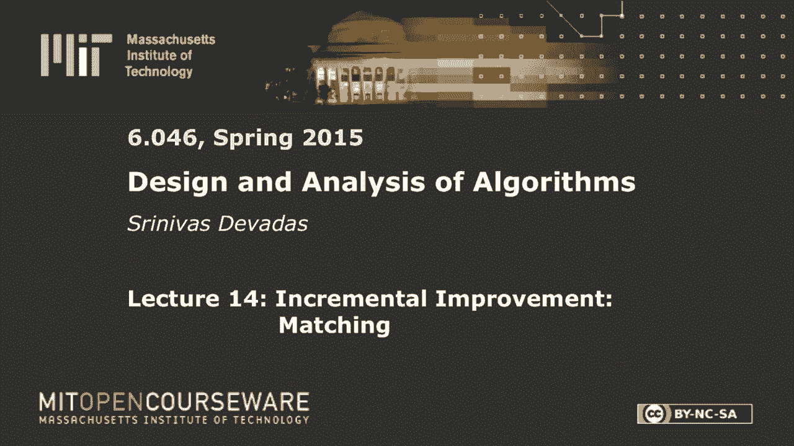
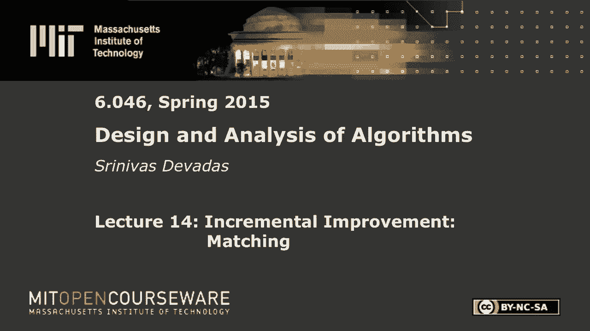

# 【双语字幕+资料下载】MIT 6.046J ｜ 数据结构与算法设计(2015·完整版) - P19：L14- 增量改进：匹配 - ShowMeAI - BV1sf4y1H7vb

以下内容是根据知识共享许可提供的，您的支持将有助于麻省理工学院开放课件。

继续免费提供优质教育资源。

捐赠或查看麻省理工学院数百门课程中的额外材料。

早上好，每个人，让我们开始吧，所以我们两个讲座序列的第二部分是关于网络流的，所以从周二开始的概念和符号所涉及的所有痛苦，今天它变成了算法的乐趣，但我们会做一点回顾，只是为了确保我们都在同一页上。

关于我们在流量网络上谈到的所有这些概念，所以我们称之为流网络，只是一个有向图，g，v，e，每个边都有，与之相关联的两个数字，如果你看到像一个冒号三这样的东西，这意味着这是流量，这是容量。

我们有一个与流相关的基本约束，不超过任何给定边缘的容量，我们也有守恒定律说，除了汇和源，这是g中的两个可区分的顶点，v，e，你会有一个情况，对于任何中间顶点，所有进入顶点的流都必须离开顶点。

有了这两个约束，您需要在您的流网络中找到最大流，对应于这个势，最大流量或某些流量f等于帽v的s的f，如此小的S是来源，对应于所有的顶点，你在看，将流从源顶点推到任何顶点，Capi也包括T。

这本质上是一个流量值，我们展示了这是隐式求和表示法，我们用一点代数证明了这等于v i的f的f，t，由于流量保护，这将保持不变，主要是，这是一件更令人惊讶的事情，或者更令人惊讶一点。

你可以在流量网络中有一个任意的切口，一个切口对应于任何分区，盖帽的间隙t使得小s属于盖帽的，来源属于大S，水槽属于大T，这基本上是一个切口，所以很明显在给定的流量网络中可能会有指数级的多次切割。

但令人惊讶的是，你可以展示一个引理，它说，不管这些边缘中的实际流量值是多少，穿过任何切口，你会看到这种流动，对于，就是流量会是，小于或等于容量，这只是来自边缘约束，你知道，那个。

对应于任何特定边缘的流量值必须小于该边缘的容量，所以你服从这个约束，你只要看看从一个帽子到另一个帽子的边缘，其中一些能力，和你的，高于该数量，那是我们的CSD。

你现在有了最小容量削减和最大流量之间的关系，我们实际上并没有利用这一点，在算法本身的意义上，算法的操作，但我们实际上要利用切割的概念，当我们证明这个算法时，我在周二的讲座上谈到了这个算法，与福特相对应。

关注算法，我给你看了它的执行过程，为了证明它是正确的，我们需要这个概念，给定网络中任何切口的流值，所以与最小切割相关的最大流量，但在我们开始之前，只是为了赶上你的算法，我们实际上到了福特。

基于残差图概念的Fulkerson算法，这是一个新的图gf，它是v e f，所以它取决于流量，你根据g计算它，基于给定的流f，在这个图中有严格的边，等于减去，这需要严格大于零，为了使f的边存在于g中。

所以如果这是零，那么你在你和我们之间就没有优势了，如果是一个或更大，假设积分流量值，你会和在残差图中，你上次看到的，另一个我刚刚说过的，是增加路径的概念，这是g f中从s到t的任何路径。

所以如果有一条从s到t和gf的路径，您没有最大流量，有一条增加的路径，你将能够增加，对应于给你剩余网络的f值的流，你能增加多少流量，你能把f增加多少，长期剩余能力，和增强路径的剩余容量，就是p的c f。

所以我们就这么叫它，p的c f等于最小值，沿路的剩余能力，所以这将是C，f，u，v，差不多就是这样，所以在一些例子中，我应该把这事说清楚。我们看看实际的算法是什么，看一个比上次更简单的例子。

但它会让你了解增强将如何改变流量，增强路径是如何出现的，最终随着流量的增加而消失，并达到最大流量，所有的权利，所以这只是对应于，正如我所说，走过增宽的小路，查看每个剩余容量并选择最小值。

所以算法中的福特福克斯，是最大流量的第一个算法继续被使用，在每个边都为零，所以你只需将所有内容设置为零，明显满足流量守恒，满足所有边缘容量，这里有三行代码，当一个增强，所以这里发生了很多事情。

你必须计算f的g，我是说有三行代码，但是这个子例程调用，比较复杂的，你必须计算给定f的f的g，一开始都是零，然后最终它会改变，或者在您发现一条扩展路径后立即，现在你必须发现一条扩大的道路。

所以你现在必须先进行广度搜索或深度搜索，为了发现它是否是一条从s到t的路径，因为这是扩展路径的定义，然后最后一行代码说增强，同样，这是相当涉及的，你必须走f的g中的路径，你会增加，把这些边翻译回g。

可能有一个方向上的倒置与翻译有关，所以如果你举一个非常简单的例子，假设我们有g是s，这里的这个顶点是a，然后你有T，现在我有一个冒号2和一个冒号4，我现在要计算f的g，所以f的g是，我只是要写下s和t。

因为顶点都是一样的，边缘明显不一样，我会有一个从S到是的优势吗，我应该在那个边缘放多少数字1，那是因为它是二减一，不是因为它只是普通的一个，它的这个边的剩余容量是1，这直接来自于那个对吧，这意味着。

这很重要，那意味着，实际上，这个剩余容量表明，在这个方向上，你仍然有一个容量，这意味着在这个方向上你可以减少一个，这是重要的事情要记住，在这里，我要有这样的方式，我要吃三个，然后回来，我要吃一个。

如此直截了当的例子，但我认为令人回味，从某种意义上说，它应用了我们到目前为止所看到的概念，除割伤以外，我们会讨论的，这里有一条从s到t的路径吗，从s到t的路径的剩余容量是多少，它是一个。

因为你这里有一个，你这里有一个三，你得拿最小的，这是一个正确的，我想这就是今天的选择数量，一个，但一旦你这样做了，你发现你说，好的，我要做的是，如果这将是相当简单的，我要看看这些边缘。

我知道我有CFT是对应于这个值的，我要在相应的边上加一个，因为这是，这些是我根据增强路径选择的边缘，所以增加的路径是，所以这变成了s到a到t，变成两个冒号二，这变成了两个冒号四，就是这样，所以这就是。

现在我有g和新的f，所以我现在可以想什么，对应于g的f的g与f是分开的，所以在某种意义上G保持不变，但是F变了，就像你在这里看到的，在s和a之间我该怎么办，我只有从A到S的东西。

我没有从s到a的任何东西，因为这个方向的剩余容量，由于流量已经饱和，边缘容量实际上是零，但我在这方面确实有优势，那条边的值是多少，它是两个右和在这里，上面和下面的数字是多少，现在我看着GF一号。

我经历了，我已经对这个伪代码进行了一次迭代，我现在试着在g f one中找到一条增强路径，有没有一条从S到T的路径，这意味着我完蛋了，这是最大流量对吧，你相信我吗，对于本例，对于本例，你相信我。

你相信我吗，对于每一个例子，无，绝对不是因为我们没有做证明，我们还没有做一个证明，好的，所以你不应该相信我，所以我们要做一个证明，那么我们怎么知道，考虑到这一切，这不是因为我告诉你，所以当我们会聚。

当我们走出这个while循环时，我们有一个最大的流量，对于那个例子来说，它看起来很好，它对每个例子都有效，但这不是证据权利，所以现在我们要把所有的，我们在这里讨论的概念，主要包括割的概念。

并证明了最大流最小割定理，它将显示我们需要的关键结果，当我们在福特·富尔克森算法中终止时，我们会有一个最大的流量，这就是为什么它是一个最大流算法的原因，如果你没有证据，你没有最大流算法，好的。

所以希望所有这些都很清楚，如果你有问题就闭嘴，让我们写出最大流量最小切割定理，我上次提到过，但从来没有真正说过，但今天我们要陈述并证明这一点，所以这是一个有趣的定理，我是说这是个传奇定理。

这不是你平常的，在某种意义上的定理，它做了一个简单的声明，它实际上做了三个陈述，它说下面是等价的，它有以下三件事，饱和右，所以这只是声明，第二个陈述，它与第一个等价，说f是一个最大流。

所以f是最大流量意味着有一些切口是饱和的，如果在给定的流量下有一个饱和的切口，你有一个最大的流量，然后是最后一个，这对我们的福特福克斯算法很重要，好吧，所以。

如果我想证明Ford Fulkerson算法以最大流量结束，根据暗示告诉我，就像i表示数字i和j的j，它是什么，我需要证明，在此过程中，我们将证明许多其他事情，但最重要的是，我想要的i暗示j是什么。

如果我想说福特富尔克森算法终止于最大定律，两个对，三意味着两个完全正确，三表示二，嗯所以，我们需要做三个，意味着现在有两个，当然啦，定理说，一个意味着两个，二意味着三，三意味着一，等等，等等。

这里有很多含义，我们要做什么，就是，我们将证明一意味着二，二意味着三，三意味着一，这几乎解决了一切，结果发现，我们这样做的原因只是因为它提供了最简单的证明，一个意味着两个，二意味着三，是一个班轮。

三意味着一个更有趣和参与，但比直接做容易一点，三表示二，好的，这就是我们要做的事，你当然可以到处玩，做正确的其他事情，到目前为止有什么问题吗，好吧，让我们继续做这个，所有的权利，我们应该可以把这两个。

一个意味着两个，二意味着三，每个人大约一分钟，所以我想展示一个，暗示了两个，本质上我想说的是，这里是我在一个特定的切割能力下饱和的，然后我有一个最大流量，而且真的，我是说，这来自定义，因为f小于等于c。

这只是因为边缘容量的限制，f是最大流，因为f可以增加，基本上就是这样，所以这很容易，下一个也很简单，如果有一条扩展路径，我将通过矛盾来做到这一点，流量值，可以增加，因为记住增加路径对应于一个路径。

有引擎的唯一原因，因为你有大于零的剩余容量，这意味着流量值可以增加一些相应的少量，这里的每一个数量，对不起，对应于最小CF UV，那是剩余容量，但是你知道这些容量中的每一个，严格大于零。

所以最小值显然严格大于零，可能是一些微小的数量，但它大于零，这意味着流量值可以增加，矛盾的，f的极大值，所以一个小小的矛盾证明给你两个，暗示三个到目前为止一切都好，这主要基于增强路径的定义，剩余能力。

等等等等，好戏开始了，现在我们要展示的是，真的，我是说，这是真正的最大流量最小切割是什么，因为我真的没有伤口，我对此有什么看法，对呀，所以在星期二的讲座结束时我有一个问题，为什么算法没有很好地使用切口。

算法不使用切割，但显示算法收敛到最大流，使用切割的概念，所以我们要做的是做三个，暗示了一个，这将照顾到我们想要的，我们会说好，假设，好吧那这是什么意思，嗯，这意味着你不能从S到达T，如果你从S到达T。

有一条扩大的路径，所以你不能做那个动作或走那条路，所以让我们继续，更仔细地看看这个，找出原因，这种缺乏连通性，s和t之间缺乏连通性，你实际上到不了那里，所以这就像一个鸿沟，有一个缺口。

那么是什么导致了这种情况，我们要做的是弄清楚，隔板上的切口是什么，这可能是你缺乏连接的原因，好的，所以我们要定义CAP，这正是我们的帽子，如你所知，从我们最喜欢的St a Cut定义，但请稍等一下。

因为我们必须，我得告诉你那里有什么，好的，所以我要做的是，我正在收集可以到达的顶点，我知道我不会在这一套里有小T，因为f不允许增广路径，所以我不可能从小到大到达小T。

但是我可以收集所有可以从给定的s到达的顶点，f的g，然后把它们都放进盖子里，好的，那么我的t定义就是v减去s，我已经做出的关键观察，但重要的是要强调，那个小T，属于船长，显然小S属于船长S。

因此S T是一个切口，它满足切割的定义，好的，所以说，如果我们把自己，然后我们就有了一把钥匙，观察使我会试着从你身上提取出来，我到这边来，所以我想做的是，我想把这个画出来，我想看看这个，因为这是帽子。

那是上尉，我知道S在这里，小S在这里，小T在这里，所有的权利，我要选，在这里的一些顶点v，在这里的一些顶点u，我知道有一条路，我把它写成一条虚线，因为这是f的g中的一条路径，好的，在这个证明中。

我们实际上要在f和g之间移动，所以这是这个证明中唯一困难的部分，f的g和g之间的运动，它们的边在f的g和g之间是不同的，好吧，但你得记住这一点，因为我们会对此进行争论。

我知道左手边的所有顶点都是可到达的，来自S，所以我就挑了一个任意的顶点，你和我都知道在F的G中有一条路，因为这是我从s到u的定义，我也知道，在f的g中没有从u到v ok的路径。

因为如果有一条路径v会在这一边，正确的权利，所以在f的g中显然没有从u到v的路径，这就是V在这里的原因，让我们说，我挑的东西有一个，g中有一条边，好的，从U到V右的原始流网络，所以我这里画的边。

暗边是u和v之间的边，有一定的能力它存在，它存在的原因是因为它有一个非零的容量，正确，因为我们最初将我们的流动网络定义为我们只在那里放边缘，在原来的流量网络中，如果容量大于零，对呀。

所以g中的边有一些容量c，u，v大于零，好的，以f的g为单位正确，我能说什么呢，去吧，完全在原图中，我们已经把这条边浸透了，这是我这个学期最好的一次投掷，我喜欢那样，你们没注意到，但也许会在视频里。

其实，不会在录像上，不幸的是，所以我在这里得到了这个边缘，在原图中，我没有得到这个虚线边在这里，因为剩余容量为零，原来的容量不是零，剩余容量为零，发生这种情况的唯一原因是因为，如果c f u v大于零。

那么V就属于S，cap，It’它不属于t，假定，所以这基本上是我们在这里确定的，所以这意味着这意味着，u v的f等于u v的c，c f u，v等于，c u v减去f u v等于零，所有的权利。

这就是我现在能做的声明，i对u和v没有任何约束，我刚才说u属于s，v属于t，对于这些事情中的每一件，我知道我不能在剩余网络中有边缘，在u和v之间，这意味着任何存在的边缘，也许原来的网络没有优势。

但如果原始网络中有优势，根据这个论点，它是饱和的，所以原始网络中从cap s到cap t的每一条边都是饱和的，好的，这基本上意味着我已经得到了我的削减能力，这就是本质上的意思，如果我把每一条边都浸透了。

我已经达到那个能力了，好的，原来如此，嗯，你所做的一切，你认识到你可以任意选择u和v，你只是说总结，所有属于S的U，所有的权利，我风生水起，不仅仅是飞盘，我只剩下一根手指完成了校样，所以f等于c。

所有的权利，所以这正是我们想要的，我们说sd的f显然是f的一个基数，所以我在这里展示了这个东西，这就是福特福克斯算法工作正确的原因，正是由于这种分析，福特焦点算法才起作用，我们做了吗。

我们在算法设计或算法分析中缺少什么，我知道你有太多的飞盘，你可能也是，但我们还没有做，我们已经做了正确的，我们已经做了收敛，我们还没有做复杂性分析，好吧，这里有一些坏消息。

我们在6点0分到达一个关键时刻，四，六，为什么这是六四六的关键时刻，在飞盘上，正是这张照片，也许不完全是那张照片，不完全是那幅画，但这是同一个图，好的，这是一个关键时刻，因为这张照片很有名。

因为它在课本上，但现在它是标志性的，因为它在飞盘上，这是福特富尔克森算法失败的一个例子，好吧，这在这个飞盘上是一个不好的例子，但它会引导我们找到更好的算法，所以我这里有一个奇怪的流量网络。

有这些奇怪的容量，我是说这是一个相当简单的流动网络，但就目前而言，它显然满足流量守恒，因为所有的流量都是零，因此边缘容量，但我们现在要在算法中对福特福克斯进行病态的执行，那个，顺便说一句。

没有指定如何选择增强路径，它只是说找到一条扩大的道路，顺便说一句，我总是使用深度优先搜索，我们将使用广度优先搜索，挥挥手穿过它，现在事实证明你不能挥手，当你想运行算法时，好吧，最终你必须把它们编码起来。

你必须选择正确的东西，所以人们做了，人们选择了不同的方式来选择增强路径，在福特福尔克森框架中，他们发现其中一些会很好地工作，他们中的一些人会在像这样小的网络上失败得很惨，只是花了很长时间。

这是在复杂性分析之前，有点，也许在渐近复杂度真正出现之前，所以他们只是通过实证分析来告诉他们，一些发现扩展路径的技术效果更好，比其他技术在经验的基础上在整体的基础上，好的。

那么福特·富尔克森在这个例子中会出什么问题呢，与扩展路径相对应的选择策略是什么，可能会导致福特富尔克森进行大量的迭代，去吧，所以你告诉我你可以增加路径，是啊，是啊，我猜正是中心，所以让我们走过去。

让我们来看看这里的一对夫妇，所以第一个，这么说吧，这是A和B，让它变得容易，那么我们选择的第一条路是什么，怎么了？去吧，去吧，你还没有摆脱困境，是啊，是啊，你认为有A，是啊，是啊。

然后当你从S到A到B到T，我不打算画f的g，很明显f的g会有，对不起，你最终选择S到A到B到T，对应于您创建的GF，所以f的g可能有类似于s到a的东西，这样只会有优势，那将有十个提高到九个。

然后这样它就会有一个，这将是B，在这里是T，它将有十个提高到九个，这样也会有10个提高到9个，这样就会有十个上升到九个，是的这位先生笑的原因是因为我们最终选择了，好的，在f的g中，这是f的g。

只是想说清楚，你挑一个B T，好的，所以你最终要做的是你最终要做这个，做这个，来到这里，让这个好起来，哇哦，好的，你确实很好地增加了流量，现在取得了进展，当你这样做的时候会发生什么。

当然你会得到不同的f g，f的g会变成井，这里变得更有趣了，这是十升到九减一，这是十升到九，不，那不会改变，这还是十升到九，这是十升到九减一，这里的这条边也会改变，因为它，基本上是什么，最终会发生什么。

你最终会和一个，好的，我说对了吗，是啊，是啊，好的很好，所以现在，坏的道路是什么，所以S b a t现在会说，哦，我要做什么，我要继续做这个吗，我该怎么处理它，让它变成零，准确地把它归零。

然后这个变成一个，我们继续走不对，所以一个有四个顶点的图的20亿次迭代，那是给你的表演，对吧，所以这个特定的可能首先是一个深度，福特·富尔克森在这个例子中，取决于顶点的顺序，这当然很有道理，你得到了。

你在深度中得到这个特殊的顺序，首先在GF上搜索，计算机是哑的，它告诉做你告诉它做的事情，它在做深度优先搜索，它产生了这些路径，你最终会有20亿次迭代，如果你做对了，你真正需要多少次迭代。

所以这是一个十亿因子的放缓，所以这是一个病理例子，一个简单的病理例子来告诉你问题是什么，但你可以想象，如果你首先使用深度搜索，它可能平均慢五倍，那么如果你用一些其他的技术，五倍也没什么好嘲笑的。

尤其是当你跑了几分钟的时候，你知道在过去，计算机慢得可怕，对呀，所以嗯，这个问题是如何解决的，但第一个真正的方法，考虑到渐近复杂度，做了分析，所有这些都要归功于埃德蒙兹和卡普。

这是在福特·富尔克森之后的几年，事实上，福特·富尔克森几年后，他们的贡献与其说是一个新的算法，尽管它被称为埃德蒙兹卡普算法，对福特富尔克森来说，这确实是一个小小的改变，你可能想把它当成埃德蒙兹鲤鱼分析。

这很重要，我们不会在这里这么做，但你会在星期五的部分看到它，但是埃德蒙兹卡普算法分析，就是，嗯如果你用宽度，首先，增强垫，这显然同样容易发现复杂性，聪明如灵巧的第一条路，然后呢，你可以得到一个多项式球。

这不取决于复杂性的能力，因此福特富尔克森的迭代计数，好的，所以这是他们的贡献，所以宽度第一的路径是最短的路径，如果算上的话，从s到t，体重1，在这种情况下，您将得到两个迭代，你会得到重量2的最短路径。

当我说，等一下，我是说，只数边数，而这些算法，他们实际上认识到了这种广度，福特富尔克森的第一个实现是跑得更快的，然后所有其他的，然后他们说，等一下，这是怎么回事，这看起来很不错。

所以他们去做了一个相当复杂的分析，正如我所说，你会看到的，在最糟糕的情况下只需要订单增强的部分，这就是我们对算法复杂性自动增强的了解和喜爱，在最坏的情况下，前提是您使用宽度优先增强权。

那么算法的总体复杂度是多少，埃德蒙，让我们称之为埃德蒙兹卡普算法，用这个广度先搜索，那就是，你可以考虑一下，因为我们假设E大于V，所以我们就把房车平方的时间，这就是埃德蒙兹和卡普的贡献。

在过去的三四十年里，有大量的工作，关于提高这一界限的建议，独立地得出了类似的分析，并与埃德蒙兹和卡普一起，他们是第一个给出最大流量多项式键的人，麻省理工学院有一个算法，你改进了。

所以它一直持续到2011年左右，有很多不同的算法，取决于你是否考虑到容量的价值，你要考虑这是一个最大值，如果你想把它包括在复杂性中，如果你能限制这一点，事情就会改变一点，但假设这些能力基本上是不结合的。

那么2011年最快的算法是国王，e除以v对数，显然这里需要一些东西来记录日志，嗯，所以这在这里是很好的，对，因为这个很小，如果你如果你真的这么想，对于致密图，如果e很大，这将是一个小常数，好的。

所以这很好，所以这是最快到211的，最近，麻省理工学院的Orlan提出了一个有序算法，这里有很多变体使用快速矩阵乘以，就在刚刚过去的九月，亚历山大·马德雷加入了我们的部门，他有一个变体算法。

在某种意义上更好，不是纯粹意义上的V和E，但有几个与之相关的限制是非常温和的，但从这个意义上说，这比命令要好，我不会在六四六六的背景下谈到这个，我们显然要坚持埃德蒙兹一家，就你的责任而言。

卡普和福特·富尔克森，但几十年来，这一直是一个丰富的研究领域，显示红色的，哦，简单地说，因为增强宽度首先增强顺序为E，我只是说这需要时间，所以这是订单增强，在最坏的情况下，每个增强都有订单，E时间。

因为广度优先搜索需要顺序E时间，假设e大于v，我刚刚加了e平方因子，谢谢关心，我相信很多其他人也有同样的问题，是啊，是啊，所以我只是有点太快跳过了，这就是为什么我们得到V方的顺序。

所以这是一个显著的减少，如果你假设常数因素不会爆炸，从埃德蒙兹出发，卡普到劳王和泰山，当然还有奥兰，好的，所以现在我们有了算法，我们已经证明他们是正确的，我们明天在部门里做了一些分析，你会看到一个。

给你订单的分析，这是半个小时的痛苦，我应该说没有高保真的刺激吗，与顺序相对应的，我们有权利，所以没那么难，这是关于这个东西的水平在这里，也许更多的参与，我是说广度优先搜索的顺序是V加E，图表上的时间。

广度第一搜索是V加E阶，我在这里有点懒，我付钱的方式是把它放在V方块上，但我真的应该，如果我想成为一个固执的人，我得把它放在V加C里，谢谢。嗯所以，我在哪里，所以我们现在有了一个算法，你知道的。

我们有一堆算法，网络流，是这个神奇的锤子吗？它被用在各种各样的事情上，它被用来匹配二分体，搭配各种各样的东西，我最喜欢的例子，与体育有关的，我应该说哪个是棒球淘汰，对呀，那么这个应用程序是关于什么的。

你会看到与你的团队排名相对应的图表，去ESPN点击棒球积分榜，比如说，让我不要，现在，你看季前赛积分榜，但让我们假设是八月什么的，你点击，你点击排名，你会看到一个图表，对应于玩的游戏，获胜游戏。

输掉的游戏，剩余游戏，等等，等等，你必须赢得分区冠军才能进入季后赛，所有的权利，所以你必须，你现在必须是最好的，如果你最终被绑起来，你最后不得不玩淘汰赛，但这个分析的全部目的是。

我在考虑你是否还有机会进入季后赛，对呀，所以这里的目标是，我们想要一个算法，看看排名然后决定你的队伍是否还活着，好的，上帝有机会吗，不管怎样，一切都按你的方式进行，外场天使，对呀，你会进入季后赛的。

好吧，所以你可以非常乐观，你可能会认为这是一个直截了当的，我要把几个数字加起来算一下，事实证明事情没那么简单，那些体育记者会很乐意认为，就像把一堆数字加起来一样简单，很明显。

这个网络流潜伏在这里的某个地方，否则我不会在这里谈论这件事，在积分榜上，我稍微调整了一下数字，为了让这个例子更有趣一点，但粗略地说，1996年8月30日，这是与美国东部联盟相对应的积分榜。

现在是1996年，所以团队和你有一点不同，所以纽约，不幸的是，他领导着这个部门，甚至回来，那时还有巴尔的摩，然后是波士顿，然后是多伦多，然后这是在1996年，在底特律是麦芽酒的一部分。

那是在重新调整之前，对呀，所以我们就叫这个吧，两个，三个，四和五，这些就是位置，波士顿排在第三位，好吧，所以我要说，这些是WI，到目前为止的胜利是什么，I哪些是损失，还有哪些游戏要玩，这是你通常看到的。

我是说，这是积分榜的简单版本，我只想给你一个，其中一些是其中的大部分，我应该说，我不打算写下什么，底特律只是因为我要改变这个数字，因为它变得有趣，因为这个数字是不同的，每支球队都有28场比赛要打，好的。

所以这通常是你看到快照时看到的，好的，嗯，现在我还要加上，R ij，哪些是游戏，这些球队互相对抗，原因很简单，一个丢失的计数之间显然有关联，专门对应于奥斯汀和纽约玩的游戏，在棒球比赛中没有联系。

所以波士顿赢了，纽约输了，反之亦然，对呀，所以我也想要那些数字，这些是你通常看不到的东西，但它们会很重要，因为他们确实决定了你的团队是活着还是被淘汰，对呀，所以五个，我这里有破折号的原因。

是因为球队不在对角线上比赛，是呀，这绝对是他们要和对方玩的游戏数量，我是对的，所以我是说一小部分，我是说五加七，十二加四，那十六岁是什么，十六加三等于十九，还有两场八场比赛要打，很明显。

有与分区以外其他球队的比赛，所以这只是ij，所以这就是这里的故事，和，哦，我应该说，当我当我谈到这一点，这些对应的是什么，嗯，这对应于n y，这个专栏这对应于巴尔的摩，这与波士顿相对应。

与多伦多相同的顺序，本栏对应底特律，所以除此之外，这里的桌子有任何问题都在指定范围内，如果你想知道，波索队那年没有进入季后赛，所以大多数体育记者所做的大多数人所做的就是，严格小于w，j，对于一些J。

所以你只想说，好的，你知道吗，如果我赢了所有的比赛，我还是进不了这个队，已经赢了75场比赛，很明显我受够了，那个队赢的比赛比我可能赢的还要多，所以这是一个简单的问题，对，这很简单，所以严格来说。

因为我们只是在讨论淘汰，总计，得到你的暑假或秋季假期，这么说吧，你有底特律，我们说的是五个人，所以我们说的是这个数字，这里是四六，一五等于八十八，对呀，所以他们在这里度过了一个糟糕的赛季，你就走了。

你说四六加二八等于七十四，不到七十五，因此，在这种情况下，底特律被淘汰了，但我认为没有必要，所以你可能真的有虚假的希望，如果你只是一个体育记者，谁只知道把这些数字加起来和别人比较。

但如果你是一个六四六的学生，你听了这些关于网络流的精彩讲座，你知道的更多，我们还没有完全到达那里，在这方面，嗯，需要网络流的力量，但我问，这在这里显然行不通，用这种天真的论点，你有七十五，等于七十五。

所以你还有希望，但你能提出一个论点吗如果给整张桌子5或4 7，这就是暗示，底特律实际上被淘汰的整张桌子，值得飞盘就在那边，所以你先，赢得他们所有的比赛，纽约输掉了所有的比赛，是呀，如果纽约输掉所有比赛。

他们将输给波士顿七场比赛，完全正确，所以这是一个很好的论点，对呀，你能站起来吗，在第二口井，所以这基本上是问题的本质，发生了一些事情，这对应于团队之间的比赛，这可能会影响结果，好的。

所以让我把这位先生刚才说的话写出来，w5加r5等于75，现在四七加二八是七十五，或者巴尔的摩，我是说，有很多方法可以，只是你可以，你可以展示这个，但我们只要，这不完全是那位先生说的。

但这就是我在这里所拥有的，所以让我把它写出来，纽约或巴尔的摩将赢得76场比赛，因为他们互相玩了五次，所以好吧，所有的权利，所以现在我要做一些更复杂的分析，我得到了我想要的，但让我们假设W 5是48。

对呀，所以这是76，这两个例子都很有效，与波士顿的比赛和我得到的七场比赛的答案，我刚写下的这个，五等于四，八，底特律被淘汰了吗，有多少人认为底特律被淘汰了，你们一群人，i，你想解释一下为什么，所以说。

嗯，纽约，巴尔的摩和波士顿保证会得到至少14个，好的，这意味着他们被允许赢得的总次数，他们中的任何一个都没有达到77岁，只要他们的团队合二为一，再加上太多了，但他们实际上并没有被淘汰，因为这是从啊。

我不喜欢你回答的最后一部分，但另一个问题是，人们明白他回答的第一部分吗，那很复杂，我是说这是正确的分析，干得好干得好，对呀，所以我们想要一个系统的方法，所以我们可以运行一个算法，所以我们不能，你知道。

需要费心进行这种类型的分析，对呀，你说得很对，原来我跳过了这个小细节，因为不方便，那就是在95年引入了一种通配符，所以我们可以把这看作是淘汰分区冠军，好的，所以这是一个旁白，谢谢你指出来。

了解体育史很重要真的很重要，几乎和零四六一样重要，但基本上它变得越来越复杂，当你离这些边缘案例越来越近，好的，所以你可以做一个分析，我会大致描述一下你的分析，你叫什么名字？亚历山大的分析是。

但我还不想这么做，我会在最后做那件事，如果你有时间，我想给你一个通用的技术，显然将使用最大流量来解决这个问题，所有的权利，所以我们要把这个设置好，所以这实际上是最大流量的好处之一，如何翻译。

您可以从表中创建这些网络，或者你有什么，并增加边缘的容量，你知道的，找到最大流量并正确解决这些问题，所以这是一个很好的例子，所以让我们说，让我们去做吧，我要根据这张表格画一个流网，它将有一个源和一个汇。

基本上是这些虚拟节点，本质上是关于无限流的来源，但是边缘的容量将来自那张桌子，边缘本身是直接的，从某种意义上说，图表看起来是一样的，嗯，根据团队的数量和你正在分析的特定团队，所以这个图试图确定。

这是一个流量网络，这只是流量网络，我会有一堆边缘，我就画一次，我们会，在这上面移动东西2到3 1到4，两到四个，最后三四个，你在这里看不到五个的原因，是因为这是五队的分析，所以其他四支队伍出现在这里。

它们的边缘在这里，它有一堆边缘去所有这些节点，这对是什么，你可以想象，这些配对对应于游戏，圈内的每一支队伍都在互相对抗，所以三打四，一定次数，根据那张表是四倍，所以我要在这里放一个4，这个也是四个。

中间的边将具有无穷大的容量，到目前为止，这些边缘是如何结构的，我刚才解释了左手边的工作原理，这些边具有无穷大的容量，一二归一，一二去二，一三归一，一三到三，差不多就是这样，所以这就是这些边缘所在的地方。

这些边就是这样引入的，所有这些边缘，有无限的能力，二到四，三到四个，到目前为止还很简单，我们还需要做最后一件事，就是给这些边缘增加容量，对，这实际上是至关重要的，原来我们要增加容量。

这样这个最大流量将表示消除，对呀，所以这些能力必须选择，特别是这个方程是简单的w5加r5减去w1，在这种情况下，如果是四八，我问的是四十个问题，五加二八减七十五，对呀，所以那是那是一个，好的。

然后这个东西是W5，我把它写下来，五加五减二，希望你能读懂，那是五分，然后同样地，这是一个七，那是十三，所以你可能会问，这很好地代表了什么，它代表了你认为它代表的东西，如果你看看这个方程，上面写着。

在我变得更大之前，我能在这里推多少，然后再一个，那么容量是多少，这里有什么区别，如果我这里有一个，我仍然会的，这意味着当我看到w i+r5时，我比任何人都伟大，所以特别是，如果我想把这个写出来，能力。

是游戏的数量，那么五队，所以这真的是一个关于一队的声明，当我看到那边我们的二队在另一边，我只是想弄明白，关于这件事我能允许多少，另一个团队来决定我正在考虑的特定团队的淘汰，五队还是不五队，所以特别是。

嗯，假设我赢了一场比赛，所以它会上升到76，如果上升到76，不一定比五队赢得更多，因为第五队也可以上升到76，差不多就是这样，第二队也是如此，三队和四队，好的，是以下内容。

所以我们要做的是计算一个最大流量，并在该网络上查找某个属性，这将告诉我们如果第五队被淘汰，或者不是为了四八的特定选择，因为我就是这样构造这个特殊的例子的，所以说，所有剩下的完全有意义的游戏。

这是你试图在最好的情况下找出的最好的情况，你到底有没有被淘汰，第五队被淘汰了吗，你想做的是平分，剩下的游戏，这对应于通过这些边缘发送流，所以通过这些边缘的流动对应于将胜利分配给第一队，两个，三和四。

好的，那是关键，我们还有剩下的游戏吗，小于等于w五加r五胜，那么这意味着什么呢，如果所有球队的胜率小于或等于W5加R5，如果你能平分的话，这对第五队意味着什么，五队还在比赛中，五队没有被淘汰。

所以如果你能做到这一点，然后呢，如果你不能，第五队被淘汰了因为有些队将获得77个通风口，所以亚历山大进行的分析不是流量分析，但不知何故，它一定在这里，对呀，这种类型的分析必须在这里。

以表明一些球队将获得77场胜利，因为我们很清楚，多亏了亚历山大底特律将在这里被淘汰，好的，但我们想用最大流量来证明，有一个相关的定理，我会写，哦很好，你在这里有足够的时间，我们只需要找到最大的流量。

这应该只需要一分钟，但我想把它设置好，所以差不多就这样结束了，找到最大流量--这意味着什么，但这个定理本质上是对这一观察的更精确的重述，好的是五队，显然你可以为任何被淘汰的队伍做到这一点。

当且仅当最大流量，i，e，在这种情况下，最大流量严格小于2 6，它对应于这些东西的总和五加七加雅达，亚达，亚达，那么饱和所有的边缘意味着什么，意思是所有的游戏都玩完了，这里所有相关的游戏。

影响五队的比赛，所以你想玩所有的游戏，因为那是最后的游戏，如果你愿意，但基本上这里的直觉是这些边缘的饱和，如果你会玩，就不是证明，剩下的所有游戏，容量，从i到t的边，所以说，第五队被淘汰。

所以你必须饱和，因为你必须玩所有的游戏，当你做那个饱和度，显然你的流量网络必须满足它的规律，与我们在那里的能力相对应，很有可能这会导致这里的限制，这相当于要求，并不是我们为了底特律的生存而玩的所有游戏。

这基本上就是游戏，所以饱和网络意味着玩所有的游戏，如果你得到一个最大的流量更具体，如果你能在这里得到最大的流量，那是，你把所有的边缘都浸透了，这意味着你玩了所有的游戏，你找到了一支打败你的球队。

击败五队，好的，所以嗯，这里发生了什么，让我们来看看这个，我们在这里要做的就是找到最大流量，然后我们可以回到定理的陈述，所以我想找到与此相对应的最小切口，它会告诉我最大流量是多少，我可以去福特。

专注于此，从零开始，增强等等，但还有另一种方法，不一定是算法，但是眼球，用你的眼球，这里哪个容量最小，最小容量的最小切割会告诉我最大流量是多少，我们知道从最大流量，最小割定理。

所以我想把这个网络分成大写和大写。I don’我找不到最大流量，好的，所以有什么想法，有点硬，所以我看到一些人挥舞着他们的手，我来吧我来吧，因为他们没时间了，有点酷，所以我们用了不同的颜色，你要这样走。

是啊，是啊，然后我们就在这边了，然后像这样跳起来，然后像这样过来，这边不行，所以我在大写中得到了小S，小T和大写T，但我有四顶帽子，I don’我没注意到我得了三到四分，二到四，上尉一到四个。

我买了其他的帽子，一切都好，所以我在这里所做的一切，忘记棒球动画是找到一个MIM剪辑，如果你看看这个最小值的值，是最小切割的值，只是从s到t的边的容量，好的，所以很简单，要对容量进行边缘和求和。

如果你看看，显然是要，你得到四加四加四，你得到四加四加四，对应于这个，这个和那个有，我需要在这里加上这条边，这个边，那在哪里，这条边缘从这里到那里，从T到S的右边，所以这很好，因为它有无限的容量。

会带来麻烦的，所以其他的边缘，我得到了一个五和七，所以我需要这个，那个那个，好的，所以四加四，加四，一加五加七，等于二五对，所以这意味着消除，因为，我所做的是找到了最大流量，严格地小于2 6。

这意味着我还没有饱和所有的边缘，s，我没能玩完所有的游戏，所以如果我玩了所有的游戏，我会超出一些容量限制，如果我在那里推更多的流量，我会超出这边的容量限制，这意味着底特律被淘汰了。

因为有些队会有77场胜利，所有的权利，所以希望你明白了它的要旨，嗯，我把这个记在笔记里，好好看看它，特定的值并不重要，翻译的框架很重要，你当然可以在星期五向你的助教提问。

