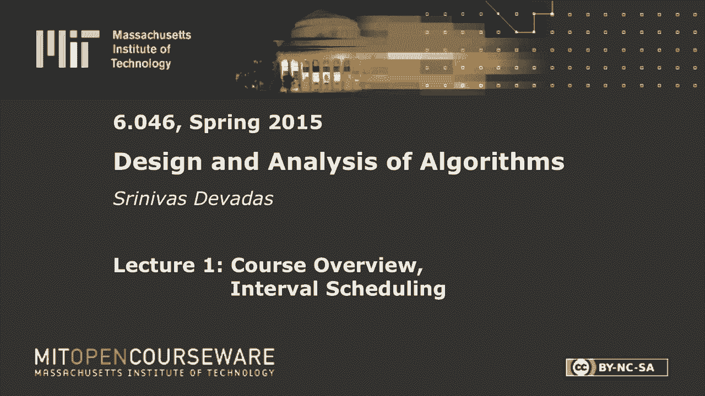
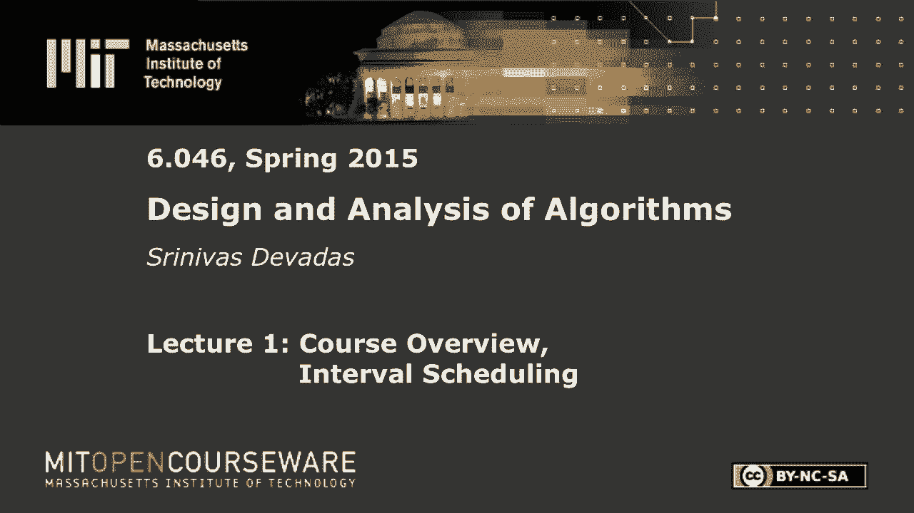
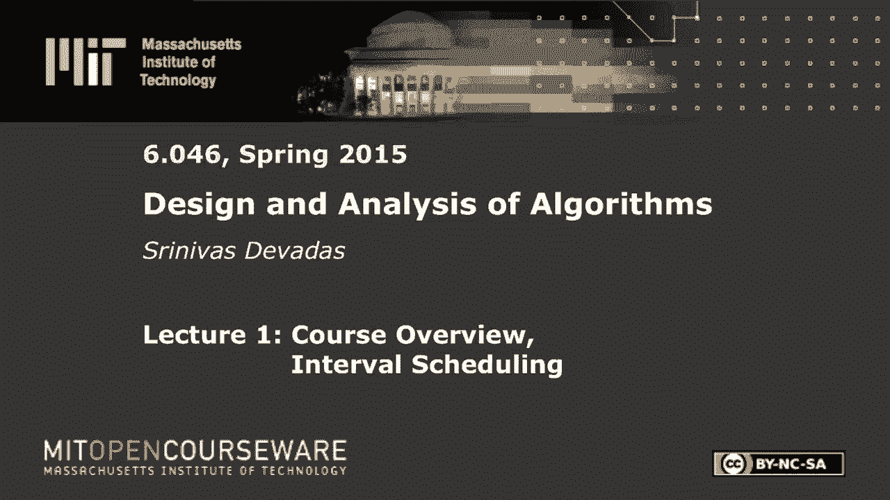

# 【双语字幕+资料下载】MIT 6.046J ｜ 数据结构与算法设计(2015·完整版) - P1：L1- 课程介绍与计划安排 - ShowMeAI - BV1sf4y1H7vb

以下内容是根据知识共享许可提供的，您的支持将有助于麻省理工学院开放课件。

继续免费提供优质教育资源。

捐赠或查看麻省理工学院数百门课程中的额外材料。

所以欢迎来到六零四六，我叫斯里尼•德夫达斯，我是计算机科学教授，这是我在麻省理工学院的第七个年头，我和优秀的课程人员一起教这门课，与共同讲师，埃里克·德梅因在这边，南希·林奇在那边。

还有一大堆你在整个学期都会遇到的助教，我们昨天刚签了最后一个助教，所以在这一点上，我甚至不知道他们的名字，我们希望有一个伟大的学期，我很兴奋能和埃里克和南希一起教这门课，我认识你们中的一些人。

从一年前开始，再次向你问好，和其他班级，所以让我们开始吧，我提到双O六，双O六是这门课的先决条件，所以如果你碰巧逃课了，MIT或ECS允许您跳过这一点，一定要跟我们确认一下你们是否准备好了。

因为我们假设你知道六双O六材料，我指的是关于数据结构的基本材料，对于动态编程或使用动态编程的算法，我应该说最短路径算法，等，六零四六本身，我们将在恒星网站上运行这门课，从某种意义上说。

那将是你获得一切的一站式商店，包括讲座讲义，习题集，等等，我应该提到，这门课是为开放课件录制的，虽然把视频放到网上需要一点时间，我们希望这样做，也许在考试前成群结队，你将要进行的测验。

就像我们班上必须有的那样，所以让我再说几句关于物流的事情，然后我们将从技术内容开始，正如我提到的，我们将运行这条恒星路线，请到星空网报名参加复习课，选择一个适合你时间表的部分。

部分从上午十点一直到下午三点，我想我们已经对每班的学生人数做了限制，我们希望这些部分在规模上是可管理的，但每个人都有足够的空间，时间表的灵活性应该允许你很容易地选择一个部分。

我们在网站上的目标文件中有一个课程信息文件，上面有很多关于评分政策的细节，协作策略，等，请仔细阅读第一页，一直到最后，我会提到一件你应该小心的事情，也就是说，虽然习题集只占成绩的30%。

我们确实要求你尝试这些问题，这是超过30%的正确，所以记住这一点，请仔细阅读合作政策和评分政策，并随时向我们提问，你可以通过广场匿名向我们提问，或者你可以突然给我们发电子邮件，所有的信息都在恒星上。

所以这就是我真正要说的，课程后勤，我来介绍一下这门课的内容，我们有几个模块和埃里克·南希，我将负责这些不同的模块，随着时间的推移，我们的第一个模块将真正开始，下一节课今天是一堂概论课。

但它是一个分而治之的模块，你在双O六学到了这种分而治之的范式，或等效类，它把一个问题分解成更小的问题，从而提高效率，合并排序是遵循分而治之范式的经典算法，我们要把它提升到一个新的水平。

我想这就是零四六的主题，你知道的，把材料放在双O六，把赌注提高一点，提高复杂程度，你会看到像快速傅立叶变换这样的东西，求凸包的算法，下次我们用分而治之的方法，我们将做大量的优化。

分而治之显然可以用于搜索和优化，特别是，我将研究与贪婪算法Dijkstra相对应的策略，希望你还记得最短路径算法，我从Double O 6中得到的是贪婪算法的一个例子，我们会看到很多其他的例子。

我们今天要看一个，一个算法锤，你可以应用于各种各样的问题，当然也是最短的路径，我们将在许多不同的背景下研究它，然后很快，这是一个与，这里有一个网络，有与网络相关的容量。

容量可以与公路系统中道路的宽度相对应，或者车道数，可以通过的流量，如何最大化商品集，或者我可以通过网络推送的商品数量，结果又是一个，有许多不同应用的问题，所以这真的是一个问题的集合，我们今天要花点时间。

但比在六双六谈论棘手多一点，所以我们将要讨论的许多算法都是高效的，在多项式时间可解的意义上，你当然知道，多项式时间可解并不意味着实际意义上的效率，所以如果你有一个n上升到8的算法是多项式时间。

但它真的不是你可以用在现实世界问题上的东西，其中n相对较大，但通常在理论计算机科学课上，我们将考虑可处理的问题，作为那些有多项式时间的，能够精确或最优地解决它们的算法。

目前我们还不知道一种多项式时间算法来解决它们，我们最好的算法需要最坏情况下的指数时间，所以问题是这些问题会发生什么，我们会研究近似算法，它可以让我们在优化问题的情况下，使我们在最优保证的一定比例内。

并在多项式时间内运行，所以你不能得到绝对最好的，但你可以在十分钟内，或者我们可以在两个因子内，对于问题的特定实例，这可能足够了，或者问题的一组实例，我们会做一堆高级主题，我想我们有分布式算法。

南希在那个地区工作，我们还将讨论密码学，数论算法和密码学之间有着深刻的联系，讲座快结束时，我应该说在课程快结束的时候，我会再仔细看看，概述到此为止，让我们真正开始今天的讲座，这是今天演讲的主题。

我说了一点关于易处理性和难处理性，算法的迷人之处在于，你可能会看到一个相当明显的问题，多项式时间解或线性时间解，然后你稍微改变一下，线性时间算法不起作用，也许你可以找到一个三次算法。

然后你再改变一点再改变一点，你最终得到了一些你找不到的东西，你找不到多项式时间算法，为了你，不能证明，多项式时间算法或任何多项式时间算法，为您提供所有情况下的最优解，然后你进入复杂性理论。

你可能会发现或表明这个问题是NP完全的，现在你在棘手的领域，因此，问题语句中非常小的更改最终可能会导致，从算法复杂性的角度来看，非常不同的情况，所以这就是我真正想要的，用一个具体的例子向你详细地指出。

所以我想在这里有点迂腐，我想这些术语以前在一节课上，在西六，但我们今天会更详细地讨论这个问题，以后会有更多，在本学期，但就目前而言，让我们回顾一下与易处理性和难处理性相关的一些基本术语，或复杂性理论。

从广义上讲，大写P是在多项式时间内可解的一类问题，把它看作是对一些人来说很大的O N提高到K，现在你可以在里面有日志因子，但一旦你把一个大O放进去，你真厉害，即使是对数问题，你也可以说n阶。

他们让你那样马虎，多项式时间算法的例子很多，当然对于像最短路径这样有趣的问题，所以最短路径问题是v阶平方，其中v是图中的顶点数，有算法可以做到这一点，如果你使用更好的数据结构，你可以做得更好一点。

但这是一个例子，NP是另一类非常有趣的问题，这是一类问题，在多项式时间，所以NP中的一个问题的例子，不知道在p中的是汉密尔顿循环问题，汉密尔顿循环问题对应于，给定有向图，一个简单的循环。

这样你就可以重复顶点，但是你需要一个简单的循环来包含v中的每个顶点，一个给定的循环是否是汉密尔顿循环是很简单的，你只是穿越循环，确保你已经准确地触摸了所有的顶点一次，你在多项式时间内显然是可行的，因此。

汉密尔顿循环是一个NP，确定图是否有汉密尔顿循环，是一个很难的问题，是定义棘手程度的东西，NP完全问题是NP中最难的问题，汉密尔顿循环就是其中之一，如果你能解决，多项式时间内任意NP完全问题。

你可以在多项式时间内用NP解决所有问题，这就是我所说的NP完全问题，从某种意义上说，NP中最难的问题，因为解决其中一个就给了你一切，所以np完备性的定义是问题在np中，是一个很难的非正式定义。

就像NP中的任何问题一样，所以汉密尔顿循环是一个NP完全问题，可满足性是一个NP完全问题，有一大堆，所以回到我们这里的主题，我想向你们展示的是如何解决间隔调度问题，我将在几分钟内定义，我们如何移动。

到仍然在P中的东西，但要复杂一点，如果我稍微改变一个问题的约束，最后，如果我给这个问题增加更多的约束，推广一下，你可以把它看作是增加约束，或者把你得到的问题推广到一些小的变化，变成NP完全的东西，对吗。

所以这是算法设计者必须记住的事情，因为在你开始尝试为一个问题设计一个算法之前，你想知道你的问题在光谱中的什么地方，为了做到这一点，你显然需要理解算法范例并能够应用它们，但你也必须了解减少。

在那里你可以尝试把一个问题转化为另一个问题，如果你能做到，众所周知，第一个问题很难，然后你可以就你的问题的难度进行争论，这些就是我们今天要讲的，一种算法的分析，一种算法的设计，以及算法的复杂性分析。

这可能不仅仅是渐近的，这是n阶的立方还是n阶的平方，但更多的是在NP完备性领域，上下文到此为止，让我们深入研究我们的间隔调度问题，那个，是你可以想象为上课做的事情，任务，你知道，一天中的特定时间表。

现在，一般生活，一般设置，我们有资源和请求，我们将有一个单一的资源来解决这个问题的第一个版本，我们的请求是一个到N，我们可以认为这些请求需要与资源相对应的时间，因此请求是针对资源的。

您需要在资源上花费时间，可能是计算时间，也许是你的时候了，可能是任何东西，这些请求中的每一个都对应于一个时间间隔，这就是这个名字的由来，SI是开始时间，FI是完成时间，我们会说si严格小于f i。

所以我没有把小于或等于那里，因为我希望这些请求是非空的，非零，否则他们就没意思了，我们将有一个开始时间，我们将有一个结束的时间，他们不平等，问题说明的第一部分，然后第二部分是，直观的是。

两个请求--我们这里有一个资源，记住i和j被认为是相容的，这意味着您可以满足这两个请求，它们是相容的，无法用单一资源满足的不兼容请求，一个重叠的条件可能是，如果i小于或等于s j。

r f j小于或等于si，所以我再一次把它放在小于等于这里，花一分钟在我在这里说的话上是很重要的，在这种情况下，我真的有开放式的间隔，在右手边，对应于，你可以这样看，假设我有这样的间隔，这是第一个间隔。

这是第二个区间，我在外面有一个，这里的f，这里两个中的s和这里两个中的f，所以这是一的f，这是二的s，我允许2的s和1的f完全相等，我仍然同意这两个是兼容的请求，好的，所以这只是一个，我想这是术语。

这是我们对兼容性的定义，你现在可以想象，与间隔调度相关的优化问题，在另一个例子中，我有一个对应于s 1和f 1的间隔，我可能在这里有一个不同的间隔，对应于两个，然后对应三个，然后也许我这里有四个，五个。

这就是我的六个音程，对应于我的输入，我有一个单一的资源，我刚刚画了一个二维的形式，我有六个不同的要求，六个不同的音程，间隔和请求是同义词，我在这里的目标是，在这个例子中很明显，这是最大的尺寸和。

我想高效地做到这一点，所以我们在这里总是考虑效率，但就问题的具体说明而言，而不是要求，算法的复杂性，我想要这个子集的最大大小，就像我给你看的或者我前面提到的，在这种情况下。

从我贴在那里的图纸上可以清楚地看出，这六个请求的最大大小，我有三个例子，好的，这就是现在的设置，我们将在接下来的几分钟里讨论一个贪婪的策略，为了解决这个特殊的问题，我们不知道。

贪婪策略是否总是产生最大大小，事实上，这取决于特定的贪婪启发式，贪婪算法使用的选择启发式，所以这很重要，我们来看看，希望你能在一些不同的贪婪启发式中提出一些建议，但我的主张，总体来说。

我将不得不在这里花很多时间，证明并最终证明我们可以解决，现在什么是贪婪算法，你已经看到了一些例子，顾名思义，这是一件，近视它不向前看，它看起来最大化了你可以最大化的第一件事，我不让任何人在你前面插队。

你有一些空间在那里，你知道上去，一般人，当涉及到，你知道吗，开始工作，试图最大限度地减少时间，在这种情况下，他们在路上花费的时间，但我们有其他例子，比如说，当您查看间隔调度时。

你可能会说我会选择最小的请求，我要先选最小的请求，我会试着收集尽可能多的请求，如果请求很小，从这个意义上说，两个请求的SI和FI是接近的，那也许这是最好的策略，对吧，这是贪婪策略的一个例子。

但为了给你一个更好的贪婪定义，到目前为止我已经说过了，贪婪算法是，它处理两件事，输入，一次一块，没有明显的前瞻，所以发生的事情是贪婪的算法通常是相当有效的，你最终要做的是查看问题实例的一小部分。

并决定一旦你做了该做什么，那么你的情况是，问题变得简单了一点，因为你已经解决了一部分，然后你继续前进，那么贪婪算法的模板，对于我们的间隔调度问题，这里是，这里有一个模板，希望能把所有这些都放在一起。

让你很好地理解我所说的贪婪是什么意思，至少在这方面，所以在我们讨论选择策略的细节之前，让我给你一个贪婪间隔调度的模板，所以第一步使用一个简单的规则，选择请求，一旦你这样做了，如果您选择了特定的请求。

假设你选择了一个，现在发生了什么，一旦你选择了一个，你完蛋了，你可以选择两个，你不能选三个，你不能选四个，你不能选五个，你不能选择六个，对，所以如果你选择了一个，2。在这种情况下你就大功告成了。

但我们必须在这里一步一步地编纂它，这意味着我们必须拒绝，带i，在这一点上，因为我们拒绝了一堆请求，我们的问题变小了，你现在有一个更小的问题，你只需重复返回第一步，直到所有请求，处理。

这是贪婪算法的经典模板，你只需完成这些非常简单的步骤，这是一个模板的原因是因为我没有指定一个特定的规则，所以它还不是一个可以编码的算法，因为我们需要一个规则，在所有这些背景下，我问你。

您认为哪种规则适用于区间调度问题？是啊，是啊，去吧，选择一个完成时间最早的，所有的权利，嗯，我不想要那个答案，但现在你已经给了我答案，我得做点什么，对吧，所以我想要一个不同的答案，但我们会去找另一个人。

但在我这么做之前，让我，我奖励你的回答，我不想要限量版，六零四六飞盘，好的，所有的权利，你需要站起来，因为我不想砍掉别人的头，是啊，是啊，对不起，所有的权利，所以这里，你去，所有的权利，所以人们这样做。

人们做饼干和糖果，我觉得埃里克·南希和我更酷，所有的权利，好，事实上这堂课安排在9点30到11点，星期二和星期四，就在那时我们决定玩飞盘，然后它被转移到11点到12点30分，但后来我们买了所有这些飞盘。

所以我们说，任何权利，又不是说，我们可以用所有的，所有的权利，好，所以我不喜欢这个答案，我想要一个不同的，再给我一个，是啊，是啊，去吧，对不起，按数字顺序，那行得通吗，它不起作用的例子是什么，那边那个。

对呀，我该给她买个飞盘吗？我们应该，我会很慷慨的，在开始的时候，你可以直接，但这是我喜欢的答案，哦，给你，遍历数字顺序，是行不通的，这是一个很好的例子，就在那里就在那里，再给我一个。

我在那边的飞盘快用完了，是啊，是啊，我是最矮的，啊，尝试用最短的时间，好的，所以在这种情况下最短的时间可能是这个，在最短的时间内可能是这一个，嘿嘿，也许这在这种情况下行得通，因为你选了这个最短的。

也可能是五个，这是最短的，不管怎样，你都可以得到两个，五和六，你知道，看着这张照片似乎有用也许四个，五和六，如果你先选五个，等权利，我给你一个飞盘，如果你能用同样的算法给我一个反例。

假设你有两个不重叠的请求，中间有一个，完全正确，是的，所以让我们看看，我该怎么办，哦这里，所以从图片上看，你可以看到这个，你可以知道你的启发式是否有效，但这是我想，你在想什么，就这样对了。

所以你得到了一个，所以这显然不起作用，所以这个是最小的，不管用，这里的建议是一个数字，查找不兼容请求的数量，所以你有一个请求，您总是可以将其他请求与它相交，并决定第二个请求是否兼容。

您对每一个其他请求都这样做，您可以收集与多少不兼容请求相关联的数字，一个特别的请求说，你说，嗯，让我把它作为一个启发式的权利，因此，每个请求都会找到不兼容的请求数量，并选择其中一个，好吧，我想说清楚。

在这种情况下，您不会选择一个，因为很明显，其中一个与其他所有请求都不兼容，对，所以这显然不是数字顺序，在这种情况下，您不会选择这个，因为它和这个不兼容，还有那个，对呀，所以您选择不兼容数量最少的一个。

那么你认为这会产生正确的答案吗，在每一种可能的情况下的最大答案，不谁说的，否，任何说不的人都应该给我一个反例，是啊，是啊，去吧，如果它选择的那个，对呀，所以这是个好主意，我们必须相信。

我认为这个特殊的例子正是你说的，相互不相容，所以这里有一个例子，我有一些东西，正如你所看到的，它有点复杂，这是一个很好的启发式，正如你所看到的，它并不完美，从这个例子中，我有，像这样的东西。

所以如果你看看这个，我这里有什么，我有一堆请求，有这个和这个是不相容的，这两个显然有很多不兼容的地方，这些的许多不兼容性，这是最小的，这里的那个，但如果你选择那口井会发生什么。

很明显你没有得到这个解决方案，哪个是最优的对，上面那个，所以这是一个糟糕的选择，所以这也不管用，好的，给你，所以事实证明，我不喜欢第一个答案的原因是，它是，这是正确的，它实际上是一个美丽的启发式。

最早完成时间是一个启发式的，这不是真正的启发式，从某种意义上说，如果你使用这个选择规则，那么它在每种情况下都有效，在每种情况下，它都会给你最大的数字，好的最早完成时间，所以，那是什么意思，嗯。

这只是意味着我要扫描，与我有的请求列表相关联的i中的f，我要选一个最小的，i的最小f表示最早完成时间，现在，你可以后退一步，我不会为每个人都这么做，我上面的图表，但看看我举的每一个例子。

应用与最早完成时间相关联的选择规则，你会看到它是有效的，并给你最大的数字，比如说，这边，这个完成时间最早，好吧不是这个不是这个，它在这里，所以你挑那个，然后使用贪婪算法，步骤二，消除所有不兼容的间隔。

所以一旦这些消失了，这些就消失了，这款完成时间最早，对等等等等，所以这是你可以通过例子来证明的，对呀，那不是个好主意，但你可以用例子向自己证明，我猜这就是六零四六的精髓所在，在某种程度上。

双O六开始发挥作用，我们必须毫无疑问地证明，利用数学上的严谨性，最早的完成时间，请求的最大数量，我们将这样做，我们需要一点时间，但这是你被期望做的事情，你会在零四六看到很多，好的。

所以每个人都在最早的完成时间前购买，是的，去吧，我们认为这是一个完整的街区，有一个小小的请求，好吧，那你就得到一个，如果只有两个请求，你的最大数字是一，所以你选没关系，你并不想要你的资源的效率。

在这种特殊情况下，我们将研究与您的问题相关的您可能有额外考虑的情况，这就改变了我希望我的资源得到最大限度的利用的问题，如果你这样做，那就不行了，这正是，你问的问题很好，但我确实说过我们要看看这里的主题。

我已经没有了，但是问题是如何改变算法的，所以这是一个问题改变，好的，你有问题吗？与前两个一起出现并比第一个更早结束的一个双倍，好的，那么你是说会有一个反例，到最早完成时间，所有的权利。

我会把它写在一张纸上，然后给我一个具体的例子，你可以把它滑过去，如果你之前得到了，我完成了我的证明，所以我会把它写下来，把它写下来，这么好，所有的权利，所以说，这是一场比赛，好的，所有的权利。

所以我们要试着证明这一点，所以你有很多方法可以证明事情，和，我是说正确地证明事情，我不知道你有没有读过旧的六四，无效的两种证明技术，你知道的，也就是通过恐吓来证明，因为讲师说，所以你知道这样的事情。

这将是一种经典的证明技术，这将是一个归纳法的证明，对呀，我们要详细讨论一下，后来，在这学期里，我们将拿出校样的草图，我们将在课堂上跳过一些步骤，很明显或者不那么明显，但如果你注意了。

然后你就可以推断出中间的一步，比如说，所以我们要做证明草图，正确和证明的草图不是粗略的证明，好的，所以记住这一点，但我们要做的这个特别的证明，我要把所有的步骤都放进去，因为这是我们的第一个，好的。

所以我们在这里要做的是证明一个主张，哎呀，这不是写得很好，这是怎么回事，回到白色，完成时间最早，其中k星是最小的，所以这就是我们想要证明的，对不起，发生了什么事，我们要做的是用归纳法来证明这一点。

它将是K星上的感应，所以基本情况，归纳法证明琐碎，这里也是相似的，在基本情况下如果，您的列表中有一个间隔，那么很明显，这是一个微不足道的例子，但我在这里说的基本情况略有不同，它说最优解有一个单一的间隔。

好的，现在如果你的问题有一个间隔，两个间隔，或者三个间隔，你可以随便挑一个，这显然将是一个有效的时间表，因为你不必检查兼容性，所以基本情况是微不足道的，即使在我们不是在谈论不的情况下。

我们讨论的不仅仅是基数为1的区间，但最优时间表具有基数1，所以这是一个微不足道的案子，所以辛苦的工作，当然啦，在，归纳证明是，假设假设并证明，n加1，或者在这种情况下是K星加一种情况。

这就是我们必须努力的，这么说吧，我们得到了，它已经，最优调度中的k星加一个间隔，所以我可能是一个很大的数字，资本我可能有几百个，和K星，或者十个，你有什么，他们不一样，我想指出这一点。

所以我们的最佳时间表，我们要写出，就像这样，所以通常我们用星号表示四六，它有K星加一个条目，这些条目看起来像SF对，所以我将使用下标，j 1到j k星加1到，这些间隔。

所以第一个是s j one f j one，这是一个被选择的间隔，是我们最优解的一部分，然后我们继续前进，我们有，sj，k星加一个逗号f，这里没有下标，没有四六，那就是我们的。

这就是我们在这方面所拥有的，最优的时间表是什么，它有K星尺寸，当然啦，我们要展示的是最早完成时间的贪婪算法，会产生K星加1大小的东西，所以这就是，这是最难的部分，我们可以假设归纳假设，我们必须这么做。

但中间有几个步骤，所以让我们假设我们所拥有的是，It’从1到K，是贪婪算法用最早的完成时间产生的，所以我要把它写下来，i，K f i K，注意这里有k，k和k星在这一点上是不可比的，我只是做一个声明。

我把这个特殊的，最优解大小为k星加1的问题，对于这个问题，我有k个间隔，这些间隔是在最早的完成时间之前产生的，贪婪启发式，所以这就是为什么这里的下标是不同的，嗯，这里有一个，这里有一个，这里有一个。

所以这些间隔是不同的，如果我看f的i加上f的i，如果我看j的f，关于i的f和j的f我能说什么，i的f和j的f之间有关系吗，他们是平等的，他们必须平等吗，小于等于完全正确，所以他们不等于。

你最终可能会得到一个不同的最优解，那不使用最早的完成时间，我们认为最早的完成时间是最佳的，在这一点上，我们还没有证明这一点，但很有可能你有其他最优的解决方案，不一定是最早完成时间给你的权利。

所以这就是为什么小于或等于在这里很重要，现在我要做的是创建一个时间表，从本质上来说，S星将带走S星，从S星抽出第一个间隔，并用我贪婪的算法时间表中的第一个间隔替换它，所以我要把它换掉，所以星星是。

然后我会回到sg 2 fj 2，因为我要回到星星，其他的都来自S星，所以他们会成为S J K明星，加一个，所以我只是在那里做了一点替换，与最优解相关联，我陷入了贪婪算法解决方案的一部分，事实上。

第一个时间表，哦，这应该是，我一个谢谢你，我们有几件事要做，要做的几个观察，我们将能够，通过K星和K星之间的某种关系，这将为我们的索赔提供证据，如此清晰，S星也是最优的，我所做的只是把一个间隔去掉。

用另一个间隔代替，没有改变尺寸，它上升到K星，加上一个所以S双星也是最佳的，S星最佳，S的双星是最佳的，现在，我要定义，l素数，i的s大于或等于i的f，那么我是素数，嗯。

l素数是贪婪算法的第二步中发生的事情，在贪婪算法的第二步，一旦我选择了这个特定的间隔，我把它拉了进去，我不得不拒绝所有其他的间隔，与这个不兼容的，所以我得，我只取那些间隔。

对于i的s大于或等于i的f 1，因为那些是那些是兼容的，好的，这就是我的质数，我可以这么说，因为，双星2到k星加1对l质数是最优的，所以我在声明，最优解，我知道那是最好的，基本上我想说的是。

最优解的子集必须是最优的，因为如果不是这样，我总是可以替换更好的东西，缩小K星的大小，加一个最优解，这显然是一个矛盾，好的，所以说，双星对L是最优的，因此s双星2到k星加1对l质数是最优的。

所以这意味着什么，当然啦，最优的时间表是，对于L素数，我从两个开始，我拿走了一个，所以现在我有L素数，这是一个较小的问题，现在你知道证据在哪里了，如果你还没有，我有个小问题，也就是L素数，很明显。

它的请求更少，已经为那个问题制定了一个最佳时间表，通过把它从最初的最优时间表中拉出来，我得到了，最优时间表的大小是K星，现在我可以引用我的归纳假设，因为我的归纳假设说我在上面的这个说法。

对于任何具有大小为k星的最优调度的问题集都成立，这就是归纳假设给我的，所以通过归纳假设，大小K星时间表，现在你能告诉我根据你在黑板上看到的建筑，当我运行贪婪算法时，我在做什么，L星，通过建筑，当我在。

对不起，l素数，这里的上标太多了，当我，当我在L素数上运行贪婪算法时，我得到了什么，从这里的第二件事一直到最后，因为这正是贪婪算法所记得的，贪婪算法选择s i one f i one。

然后拒绝所有不兼容的请求，然后在拒绝所有不兼容的请求时继续前进，这里，你通过构造得到了l质数，贪婪算法应该给我从s i 2，2到k的大小是多少得到的是k减去1的大小，对呀，这是k减去一，所以说。

所以如果我把，如果我把这两件事放在一起，我有什么，下一步是什么，我有归纳假设给我一个事实，我有建筑给我一些东西，现在，我能把K星和K星联系起来，有什么关系，k星等于k减去1对了大家看到了吗。

所以K星的大小是K减1，对呀，所以这意味着s 2k的大小是k星，这意味着s 1 k的大小是k星加1，这正是我想要的，那是最佳的，因为我一开始说过我们有K星加1，在我们的归纳假设案例中，作为最优解。

所以这最后一步是你所需要争论的，现在，回到这里是一公里，这是最优的，给你，所以这就是你想提出的论点，为了在零四六证明这样的事情，你会在习题集中看到什么，包括将于周四发布的一个是一个不同的问题。

你必须有贪婪算法的证明，因为我忘了你要用什么技巧，也许是归纳法，也许矛盾，这些都是让你进入重点的事情，在那里你分析了算法的正确性，不仅仅是因为你得到了一个有效的时间表，但是根据请求的最大数量。

您得到了一个有效的最大时间表，好的，对此有什么问题吗，贪婪于某一特定问题的人，我告诉过你我们演讲的主题是，所以让我们继续这样做，所以这节课剩下的部分，我们来看看不同类型的问题。

更浅显地谈谈问题的复杂性是什么，所以，可能会想到的一件事是，你想做加权区间，调度，这里发生的是每个请求，我们要做的是安排，请求的子集，最大重量，所以以前所有的重量都是一个，所以最大基数是我们想要的。

但是现在我们希望用最大权重调度请求的子集，关于贪婪算法是否最早，对于这种加权的情况，首先完成时间是最佳的，或者给我一个反例，啊继续喜欢喜欢，比如说，你就像第一波，完全正确完全正确，所有的权利。

我欠你一个人情，给你，所以这是一个相当微不足道的例子，你所做的就是w等于一，w等于1，w等于3右，所以你走得很清楚，最早的完成时间会选择这个，然后这个就可以了，你得到两个这样的，但这很重要，你知道这是。

我不知道，睡眠派对六零四六，所以你去那里，所以重量是，它应该使那个无穷大，那是世界上最重要的事，至少在接下来的六个月里，那么现在这个是怎么工作的，所以原来贪婪的策略，我的模板失败了，好吧。

这个星球上什么都不存在，至少我知道你在哪里可以有一个简单的规则，并使用该模板获得最优解，在这种情况下，每个问题实例的最大权重解，对呀，所以模板就失败了，好的，您认为还有哪些编程范例在这里有用，是啊。

是啊，去吧，右，那么您想尝试一下这里潜在的DP解决方案吗，是啊，是啊，丢弃和它们是如何被丢弃的，是啊，是啊，那是，那是完美的分而治之，然后当你把它包括在内的时候，你要做什么，对呀，你认为有多少子问题。

我想让你赚到你的飞盘，可能是，二的次方，你有很好的间隔，那是一个，这是你有的许多子集，所以你有n个间隔，那么你有两个提升到n个子集，对呀，但记住你想去，你知道你想变得更聪明，对你想更聪明一点。

所以你得到了一个飞盘，无论如何，不，反正不是，在这里，我们去正确的，所以其他人，所以我想用的是动态编程，我们已经确定我想使用动态编程，使用动态编程你会有一些经验在双O六。

游戏的名字是找出什么子问题是正确的，子问题看起来像是请求的集合，我是说没有两件事，它们将是请求的集合，所以这里的挑战不是把两个升到n，好吧，因为两个升到n是不好的，如果我们想要效率。

所以我们必须有一个多项式数的子问题，所以一个还没有回答的人，去吧所以，所以你在看每一对I和J，并不是所有的都是有效的，不会有与之相关的间隔，但你知道这是一个合理的开始，别人啊，一个没有回答的人，是啊。

是啊，在那里你可以从一开始就像最好的一样到达某个给定的点，回答他们啊，从开始到任何给定点的最佳，所有的权利，嗯，你得到了，你离得很近，迈克尔，给你，你需要站起来，哦，扔得不好，这是一个糟糕的投掷。

我要练习，好的，正如您在动态编程中所看到的，挑战是弄清楚子问题是什么，事实是会有很多，对于这个加权问题，至少有两个有趣的，我们要做一个简单的，这是基于刚才这位先生给出的答案。

但事实证明你可以比这更聪明一点，最有可能的是，你会听到更聪明的方式在部分，好的，但让我们做一个简单的，因为这就是我在这里的时间，关键是定义子问题，一旦你这样做了。

实际的递归最终是一个相当简单和直观的步骤，用DP范式解决这个问题，所以我要做的是定义子问题r星，所以R是我们有的请求总数，子问题将对应于，我将选择属于r的请求j，这样我很抱歉，这是x的r。

使得j大于或等于x右，所以我在这里做的是给定一个特定的x，我总是可以根据这个规则减少我的请求数量，然后你可能会问你知道什么是x，所有其他请求的完成时间，对呀，所以x等于phi的f，所以这意味着。

当我把f放在这里，它意味着i之后的所有请求，第，完成的请求是FI的R的一部分，所以fi的r就是，这里有一些微妙的地方，我想指出，也就是fi的r，不是与第i个请求兼容的请求集，好的，不完全是那样。

它是晚于i中f的请求集，好的，所以记住这一点，因为这里发生的是，我们要解决这个问题，一步一步，我们要构造动态规划解，然后就像贪婪的情况一样，然后选择之后的请求，所以如果你要选择一个早期的请求。

然后我们将把解决方案子集化，选择下一个，就像我们对贪婪的人所做的那样，所以我们实际上要解决的子问题，潜在的自下而上，如果我们在做递归，将对应于晚于，我们正在研究的特定子集，它是由一个特定的区间定义的。

所以晚于i中f的请求，不一定是与第i个请求兼容的所有请求，所以如果你这样做了，那么这里的子问题的数量是小的n，其中n是请求的数量，因此，如果n是原始问题中的请求数，子问题的数量，等于n。

因为我所做的就是插入一个适当的，我为它找到了i的f，并为其中的每一个生成f的r，所以会有N个子问题，每个子问题一次，然后记住，所以，我们要做的工作是基本的规则，对应于DP的复杂度，也就是子问题的数量。

来解决，每个子问题或单个子问题，查找，这样你就可以，您可以将递归调用看作是一阶的，因为你假设你在做记忆，好的，所以我在这里什么都没告诉你，你在双O六没见过的，可能应用了很多次，嗯，这边。

我们刚刚定义了特定dp的子问题，我们认为与，子问题的这种特殊选择对应于n，如果在给出的原始问题实例中有n个请求，我们在这里要做的最后一件事是解决我们的DP，当然啦，写出我们的递归。

让我们自己相信这一切都解决了，让我们这样做，所以我们这里有的是，我们将尝试每个请求，我作为一个合理的第一个请求，所以这就是你可能会想的工作原理，孩子，我是说这首歌，看起来有点奇怪，为什么它不包括与。

随着第I个请求，我是说我在某种程度上缩小了我随后的问题尺寸，如果我忽略了前面的一些请求，这真的应该是兼容集的一部分，但它们不是FI设置正确的一部分，所以你们中的一些人可能会想。

这会成功的原因是因为我们要构建我们的解决方案，就像我之前说的，从头到尾，所以我们要尝试，每个请求都是合理的第一个请求，好的，所以即使这个请求可能在我们的图表中，你知道一直往右，它可能有一个巨大的重量。

好的所以我要把它作为我的第一个选择，当我第一次尝试时，那么我的子问题的定义说这将工作，我只需要看看比那晚来的请求，因为之前来的那些，我也试过了，好的，所以这是你需要记住的事情，为了证明正确。

我现在要写出的递归，所以递归和我有选择r，我右手边的第一件事是什么，我在这里要做什么，你会看到像猜测一样的东西，看到像尝试这样的东西，每个请求作为可能的第一个，什么数学结构，我是不是得在这里。

麦克斯谁说麦克斯，没人愿意把麦克斯的功劳据为己有，这是最大的权利，所以我要有麦克斯，小于i，小于或等于n，我要去找一个能告诉我剩下的是什么的人，某人，别人，几个飞盘，左边的家伙，这剩下的是什么样子的。

是的，什么是最佳的，一个都没有，我们有，我们这里有什么问题，它不再是一个了，重量，重量，是啊，是啊，所以说，所以我们得到了wi加上fi的最优r，好的，所以你说一个的原因，但离得够近了。

如果是一个你会用贪婪，所以这就是为什么我们处于WI模式，我们最终得到了这个，就这样，你尽可能地尝试每一个请求，首先，你显然选择了那个请求，所以它是你体重的一部分，就你的解决方案的重量而言。

当你这样做的时候，因为这是你得到的第一个修剪请求，稍后出现的一组请求，对应于你在这里看到的fi的r，然后你继续，简单地说，我找到了一个较小问题的最优解，显然有更少的请求，只要你最大化，你所做的一组猜测。

在顶层有N个猜测，显然在较低的水平，你的RFIS中会有更少的请求，您将有更少的max迭代，但这是顶级的，好的，最后一个问题，我们在这里看到的复杂性是什么，n的平方，原因是你只需使用，你可以对此非常机械。

你说，如果这是一号订单，我在做N个项目的最大值，因此，解决一个子问题的顺序是n次，因为我有N个子问题，我得到N倍订单N，也就是n阶的平方，好的，我最后要做的事，我只有一分钟，给你一个对间隔调度的小改变。

这使我们处于NP完全领域，好的，到目前为止，我们只做了两个问题，还有许多其他的间隔调度，有贪婪的线性时间，加权区间调度为n阶平方，根据这个特殊的DP公式，原来有一个更聪明的DP公式，按n的顺序运行。

你们将在周五的部分中听到的时间，但仍然是多项式时间，让我们对此做一个合理的改变，也就是说，我们可能有多种资源，它们可能是不相同的，对吧，所以我们所做的一切，很好地推断到相同的机器上。

尽管有许多相同的机器，但是如果你有不相同的机器，这意味着你有不同类型的资源或机器，所以也许你的机器不是一个，它本质上是一种情况，你说，此特定任务只能在此机器或其他机器上运行，机器的某些子集。

所以你仍然可以有一个重量，你有类似于i的q，属于t的子集是一组机器，我在上面奔跑，好的，就是这样，这就是我们所做的改变，将为每个i指定i的q，所以你甚至可以有两台机器。

你可以说这里有一组请求可以在两台机器上运行，这里有一个只在第一台机器上运行的集合，这是在第二台机器上运行的另一组，这是这种概括的一个简单例子，如果你这样做，这个问题，已经被证明是NP完全的，我的意思是。

不完全问题是决策问题，所以你说，某个特定的数量k小于n个请求吗，这个决策问题是NP完全OK，那么当你有NP完全问题时会发生什么，嗯，我们将在课堂上有一个处理棘手性的小模块。

我们将研究可以应用近似算法的案例，也许在优化问题的情况下，如果对此的最佳值是K星，我会说我们可以在K星的10%以内，另一种方法是处理棘手的问题，由，希望你的指数时间算法在合理的时间内运行，对于常见病例。

所以在最坏的情况下你可能会花很长时间，但一个小时后你就退缩了，并从算法的输出中获得，但在许多情况下，算法实际上可能完成，他们给你最优的解决方案，好的，在这里这样做。

