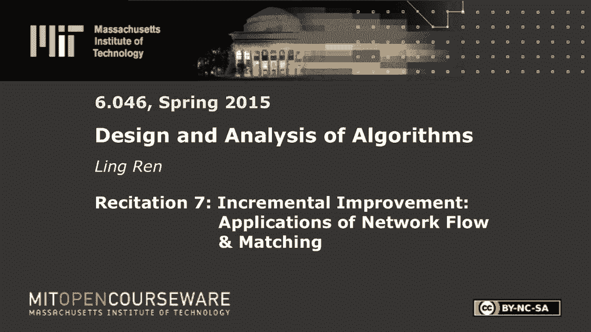
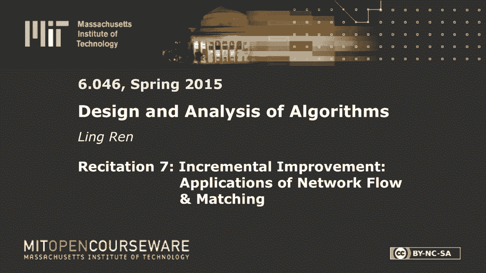
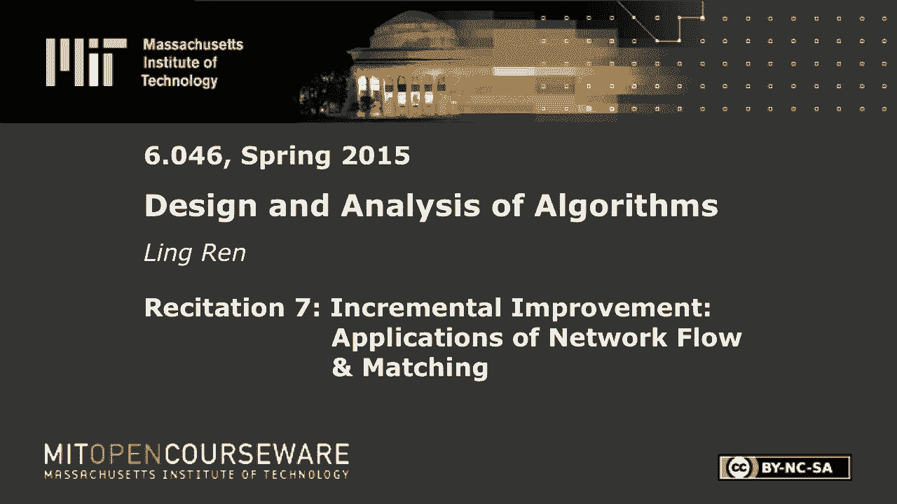

# 【双语字幕+资料下载】MIT 6.046J ｜ 数据结构与算法设计(2015·完整版) - P20：R7. 网络流量与匹配 - ShowMeAI - BV1sf4y1H7vb

以下内容是根据知识共享许可提供的，您的支持将帮助麻省理工学院开放课件。

继续免费提供优质教育资源。

捐赠或查看麻省理工学院数百门课程中的额外材料。

大家早上好，希望你们春假过得愉快，在此期间，我希望你能有更多的六零，四六今天我们要学习网络流网络流中的两件事，第一个是埃德蒙兹卡普算法，之后，我们将研究两个应用程序，尤其是他们被称为，和盖子。

更简单的算法，即福特焦点子，有人能提醒我们弗格森是做什么的吗，去吧，你有这个制作，它就把它处理掉了，是的，呃，你叫什么名字，好吧，那么好，米沙给了一个非常简短的描述，但让我们更详细一点。

所以我们有一个图网络流量G，首先要做的是，给定流量，它将从救援图转换G，每个人都记得，那么f f算法会找到一条路径，在这张救援图中，增加只是意味着增加只是意味着增加路径上的流量，是的，路径上的最小边。

让我把它定义为路径的容量，也就是最薄弱环节的能力，好的，然后呢，我们缺少的最后一步是什么，所以在增加流量后，我们的流量从f变成了f素数，然后我们要循环回来，我们有f素数，然后沿着最后一条路径。

从这里开始，所以这个算法，在某种意义上，甚至不是一个非常详细的算法，因为它没有说如何找到一条路，第二步，这确实是问题所在，因为我们看到了一个病态的糟糕病例，每个容量是十亿，正确的方法是简单地增加这条路。

然后那条路，哦对不起，有一个边缘的，那我们就大功告成了，但病态的糟糕情况是我们一直穿过中间边缘，好的，所以Edmond Carp是对这个算法的改进，让我把这个写在这里，它的第一步。

第三步和第四步实际上是完全一样的，没有改变，因为重点，它唯一能做的就是找到一条特殊的路径，在讲座中真的涵盖了这一点，什么路径，埃德蒙兹鲤鱼鳍，我看到一些人在点头，好的，去吧，首先搜索来源，到GF的水槽。

好的，大家都同意吗，所以埃德蒙·卡布找到了最短的路径，我想你能看到那部分吗，不，那件事我很抱歉，在这里找到最短路径，最短就是这里跳数最少，在这个病态的糟糕例子中，在蒙科普会做得更好。

因为它会找到这条路而不是这条奇怪的路，因为那条路这个距离是2，穿过中间的是三个，好的，现在我们要证明这个算法在V平方内运行，所以好吧，所以退一步，我们必须证明那是正确的吗，是啊，是啊，我不知道。

我声称我不必那样做，因为这和专注是一样的，你可以找到任何路径，我们想表明我们想绑定这个运行时，所以有什么想法，高水平理念，我们要怎么做，这几个步骤，好的，所以好吧，一个更简单的问题，什么是。

这第二步的复杂性是什么，找到从源到汇的最短路径，去吧，在这种情况下，实际上v总是小于e对，所以我现在可以简单地说，如果我们找到了这条路径，需要多长时间来增加它，但我声称我。

我们可以说我们也可以说这都是对的，因为最短路径，至少最多，当我们跳跃，然后从f到f素数，好的，所以我想，从某种意义上说，这两个步骤是相同的，也是V的，然后更新救援图也是一个V，所以这个迭代中的一个。

每次迭代需要多长时间，A V右，这是，一次迭代中最昂贵的步骤，好的，那么我们还需要做什么来证明这个约束呢，我们需要证明迭代的次数是，v乘以e，如果我们能证明，那我们就差不多完成了，好的。

现在来证明这个约束，我们首先需要一个引理，所以让我定义一下，从源到V的最短路径的长度，它是图中的一个节点，f的残差图中的长度，这个定义清楚吗？这个引理说对于任何顶点，没有减少，好的，我们将批准。

所以我们将用矛盾来证明，假设这不是一个案子，在f素数中有一些v，这是新的救援图，在新的救援图中，从源到源的最短路径小于，我们将推导出一个矛盾，但可能会有许多这样的顶点下降，但如果有，如果有的话。

我要定义v，好的，关于这一步有什么问题吗，所以可能会有V一个，v二，V三，或者让这一切发生，我要从那些与源头的距离最小的中选择一个，这是我的消息来源，我们有一条路，好的，所以这是一条路径。

然后我总能找到一个前任，我会打电话给你，如果这是到V的最短路径，我能说什么呢，关于这两个量我能说什么呢，我们能不能减少一个，这个比那个大，其中一个比另一个大，这对它上的任何领域都是正确的，好的，米沙说。

李是U加1对每个人来说都有意义吗，这是到V的最短路径，它穿过你，好的，这是正确的，所以因为我没事，也许我没说清楚，我把你定义为最短路径上的前任，v的Δf质数是Δf质数，Δf质数u+1，好的。

现在我将用你作为我回到原始图F的垫脚石，2。我想就这个数量说句话，图f中的Δu，对此我能说些什么呢，这是一个棘手的部分，这个比那个大，或者整个事情比这更伟大，好的，我想说这个大于Δf u，加上一个。

我声称这个数量比那个大，有人能给我一个理由为什么我不能声称，所以回想一下我是如何定义V的，你在设计好问题吗，所以V所以有几个。

可能有几个v{\displaystyle v}的Δf{\displaystyle\Delta f}比Δf{\displaystyle\Delta f}小，我把v定义为，最小的Δf。

在所有在delta f中有作业的节点中，这可能是一个棘手的部分，然后呢，根据定义，因为Δf u小于Δf v，我把v定义为最小的，满足，所以所有的使用，所以U是前任，v。

所以你不应该是那些有工作的节点之一，三角洲中的三角洲，所以我知道这可能是一个棘手的部分，是的，是的，我会停下来问问题，是的，在我们继续之前，确保我们解决了这一部分，有多少人得到它，好的，只有两个。

那可不好，好的，我很困惑我们怎么会是三角洲最小的一个，如果您有一个较小的前任，好的，也许V是最小的，f最小的那个，使得Δf一撇小于Δ，好的，好的，也许那是，这就是为什么我把你们弄糊涂了，很抱歉。

所以我们有一群节点在三角洲工作，我定义v是其中Δf素数最小的一个，我喜欢Delta Prime和，是从源到该节点的最短路径，在f的g中，这是救援图，给定流量权，所以f是一些流。

f素数是我们增加某个路径后的流，所以f一撇是f之后的一步，好的，现在有多少人得到了，仍然不是每个人，对此有什么问题吗，有多少人还没有得到它，好的，所以有些人，就像中部各州的短英格剪，好吧。

那我就得向前看了，我会假设你我会得到这个，我去拿那个，现在有了最后一步，所以说，当然啦，我们会问这个函数和v的Δf有什么关系，因为最终，因为最后我们想展示，我们想展示一个矛盾，Δf v可能大于或等于。

这是另一个棘手的部分，所以让我现在问一个更简单的问题，所以这是我们的g f素数，所以我们也有g的权利，它有源头，这条边在这个图中存在吗，所以我知道它确实存在，因为我把u定义为v的前身，但紫外线在图中。

并不一定意味着紫外线在旧的图表中，所以它肯定会存在，但是这个边缘有没有可能，有多少人会说也许它不存在，这不重要，因为我们可以证明这两种情况，所以让我们假设案例一，UV确实在F的原始图G中，那样的话。

我能说说最后一步吗，他是最矮的，在他们的思想中，是啊，是啊，最短的可以是可能的，也可以是正确的，每个人都明白吗，所以在这个图中到v的最短路径不一定是这个对吧，但如果是别人，好的，所以万一有一个。

我假设这条边缘是存在的，那么不管最短的路径是什么，它肯定比我第一次从S到U要短，然后u到v，s到v之间的最短路径肯定短于，我先从s到u，然后u到v，案例一完成，这是一个矛盾。

因为我们证明了v的f素数大于或等于，好的，万一二，好的，那么这怎么会发生呢，有没有可能，好的，很好的观点，完全正确，所以有可能这条边缘并不存在，但只有在我们从f到f素数之后才出现，怎么会这样呢。

这一定意味着我们正在增加一条穿过它的道路，但这个边缘是不存在的，所以我们不能增加一条这样的道路，我们必须增加一条道路，就像这样对吧，首先从s到v，然后v到u，然后u到t，如果我们在扩大这样一条道路。

然后我们要把这条边从v移到u，但是我们将在下一个图中把u加到v上，大家都明白了吗，所以现在这里更正式，如果我们假设紫外光不在f的g内，我们也知道UV处于GF黄金期，这两个是什么意思。

只能由UV在f的GF中引起，不仅仅是在那个图中，它一定在，它一定在我们正在扩大的道路上，有道理，好的，所以我们能说一些关于u的Δf和v的Δf，这是我们这样的P，这整件事，p是增广路径，用作最后一个。

如果这是管理鲤鱼的扩展路径，我们在寻找最短的路径，所以v是u的前身，那么u的Δ就是Δv加1，这意味着数量，所以这也与我们假设的相矛盾，好的，这证明了我们每个节点的引理Δmontonic p在这里增加。

我将展示我们最多拥有的最后一个定理，迭代次数，所以我们要展示的方式是一个，我们将展示我们将定义路径的容量，它一定是它最薄弱的环节的能力，我们要定义它最薄弱的环节是紫外线。

好的我们将展示紫外线将称为临界边缘，我们将展示紫外线可能是至关重要的，如果那样的话，如果这对每一条边都成立，那么我声称所有的边缘组合只能在VE倍内增强，让我们假设我们增加了一条通过u到v的路径。

如果我们通过我们的算法来做到这一点，我们会摆脱这条路，有一个优势，当我们从f到其他f素数，现在我什么时候可以再次增强紫外线，只有在某个时候我回来增加路径时，它才会发生，从V到U对，因为那会。

它消除了背包的后缘，并增加了我们的边缘，uv，好的，让我们看看那里会发生什么，呃，现在我把这个图叫做f，这个图f素数，所以在f素数下，我们知道我们用同样的论点把从v到u的路径扩大了。

△u是△加上f素数中的1，我们知道这个不会掉下来，所以它大于或等于v的Δf，我们也知道f v是u的前身，所以这个等于△f视图加2，那是什么意思，这意味着在两次紫外线增强之间，u的增量必须至少增加两个。

那么某个节点的delta可能有多大，它肯定是以v为界的，右是以v为界的，所以我声称这个特殊的优势，UV只能参与，只能是v倍的临界边实际上严格来说是v倍的一半，所以每条边的总和只能是v乘以e的一半。

增加数目，对那部分有什么问题吗？关于整个证明，如果没有，我们会继续前进，好的，这不是背诵中要求的一部分，但我会很快说几句关于一个更好的算法DK，以v平方乘以z为单位，所以这是对埃德蒙鲤鱼的改进。

它的想法是我会找到，或者从S到T的一次最短路径，我要同时增加所有这些，那么因为他们都是显示是路径，当我增加每一条路都会被打破的时候，也许我会把这条边去掉，这个边那个边，论文是最短路径会在这里增加。

最短路径是三条，但我已经摧毁了3号线的所有最短路径，所以我将展示这条四条路径，如果他们那样做，您可以绑定V的迭代次数，因为你的最短路径不能再最多只能是V，但是每次迭代都稍微复杂一点。

因为你需要找到这条路的所有，碰巧他们可以显示你可以在v乘以e中找到它，这就给出了v的平方v，好的，那不是最重要的部分，更有趣的是，实际上这个算法的作者，但他的算法很难理解，嗯，没有人，是啊，是啊。

没人明白，还有一个叫，我想就连他也明白这个问题，开始向人们做广告，并就迪娜的算法进行讲座，所以他推广了算法，但不幸的是，他把作者的名字弄错了，所以这就是为什么这个算法从今以后被称为Linux算法。

这有助于知道为什么，因为你可以把这个故事告诉其他人，所以他们会假设你对Linux算法很了解，嗯，事实上你可能不知道，这正是我在这里所做的，现在让我们看一个应用程序，呃，好的，所以问题是我们有几个人。

还有几个任务，让我除掉一个人，我不想那样做，很多东西，所以我们有一个这样的图，每个边，如果有边缘，这意味着这个人有能力执行这项任务，问题是找到匹配的，这意味着从人到任务的分配。

这样我们就能完成尽可能多的任务，好的，所以一个人只能做一个任务，一个任务只需要一个人，所以在这里你可以看到一个糟糕的匹配，我把第一个人分配到任务一，那么没有人能完成任务二，所以如果我更聪明。

我将派这些人中的一个去做那件事，让这个人处理另一项任务才是问题所在，清除，所以这叫做双偏图，因为，这意味着您可以将图分成两部分，在每个部分内没有连接任何对顶点的边，您也可以为一般图定义这个问题。

目标与找到边的子集相同，使没有两条边连接到同一顶点，但我们要通过种族隔离图来看看，我们在二部图中声称，这可以用最大流量来解决，我给你一分钟考虑一下，如何将该问题转化为最大流问题，有什么想法吗，好的。

这个提示，我会在这里添加源，在那里添加汇，我必须创造这些边缘，好的，我如何限制所有边缘的容量，这样我就可以保证知道每个人都是，没有人同时承担两个任务没有任务是分配给两个人的，让他们都等一个。

如果我们这样一一一一，这里的一切都是第一重量，那绝对是对的，你叫什么名字？科林，好的，如果我们这样做，那么好吧，因为每个人只有一个进入的边缘，哦对不起，也许我应该在这里画箭头，每个人只有一个进入的边缘。

所以它不能同时处理两项任务，每个任务都是一样的，只是，它只有一条向外的边，所以不能多人照顾，好的，所以说，如果我们发现最大流量是k，这意味着我们可以找到，最大匹配也可以，我们可以完成K个任务。

很容易看到，因为我们可以在这里切一个口子，如果最大流量是k，那么显然k税已经被考虑在内了，对此有什么问题吗，所以问题是我们能做到所有这些，从人们那里找一个任务来完成尽可能多的任务。

那么我们可以做多少任务，好的，所以我在做一个与背诵笔记不同的主题，在背诵笔记中，我们正在考虑另一个叫做粒子覆盖的问题，这和那个完全一样，所以封面也被照片定义为，让我们在这个图中找到几个顶点。

这样每个节点至少，好的，让我给这个图中的几个节点着色，使每条边至少连接到一个暗节点，我着色的节点叫做封面，我想找一个最低保险额，你可以，你当然可以，当然，涵盖了所有琐碎持有的节点。

我们正在寻找最低保险额，而索赔是，是k当且仅当最大流量，为什么呢因为在匹配中如果我们有一个匹配，然后我们有一组不相交的边，没有两条边连接到同一节点，所以如果我们想把这些边缘，我们至少得加一个这个家伙。

颜色之一，这两个中的一个和这两个中的一个，所以如果我们有k个匹配的边，那么我们至少需要K个节点来覆盖它们，比如说，我可以像那样盖住他们，但这并不是万无一失的，因为我也需要展示，我确实能找到一个K的封面。

好的，让我想想我是否应该证明，好的，我要试一试，如果你不明白，那很好，封面是一组节点，使得图中的每条边都连接到至少一个节点，在封面上，好的，所以这不是一个盖子，因为这个边缘没有盖住，所以在这种情况下。

我可能还得加上这一点，但显然有更好的掩护，即使是更小的盖子，就是这两个对吧，是啊，是啊，那么我们如何将匹配转换为覆盖，所以让我先在这里给一个匹配，一个最大匹配应该是这样的，我有这个边缘和这两个中的一个。

这是一个匹配现在，这是一个最大匹配，那是毫无疑问的，所以让我把这一切都处理掉，把这个变成封面的一个方法是我先，这两个人我是如何给左边的节点着色的，在那里它们连接到匹配的边缘，在那之后，我要从这个开始。

然后呃，节点间跳转，采取交替路径，意思是我会采取一个无与伦比的优势，然后采取一个匹配的优势，然后再次取得无与伦比的优势，但没有这种事，好的，如果我跳下去，我会交换它们，让那黑暗，好的，这个图有点奇怪。

好的，现在，我声称这是个幌子，如果有另一个像无与伦比的边缘出去，那我就继续走另一条路，但我不得不停下来，因为再也没有这样的优势了，我怎么说好，我可以证明，为什么我可以说这是个幌子，如此清晰。

这是如果这是一个封面，那么它是一个K号的封面对吧，所以它是，我们已经证明了整件事，那么我们要分别考虑几件事，所以我要先索赔，如果我有匹配的边缘，那它肯定被覆盖了，因为它的一个端点是暗的。

我们只在黑暗和白色之间切换，如果真的是，如果它本身是匹配的边缘，对呀，所以我只需要证明这件事不会发生，有一种无与伦比的优势，它的两个端点都是白色的，好的，我首先声明这个节点不能有匹配边，因为如果是这样。

那么这是交替路径，我要把它换掉，把这个切换到，好的，有道理，好的，所以这不存在，它现在只能有无与伦比的边缘，关于这个节点我能说什么，我声称这个节点至少需要一个匹配的边，因为如果不对。

那我应该把这个家伙加到我的匹配中，它不违反任何约束，我没加那个，因为可能有匹配的，连接到这个家伙的边缘，然后我要，所以这家伙必须是黑暗的，因为这个不是，那这个是怎么变黑的呢，一定是左边的某个人，对呀。

所以有一条来回的交替路径，像这样的东西，有一条从左边开始的交替路径，但在这里结束，因为我们证明了这个家伙没有连接到任何匹配的边缘，那样的话，我要做的是把这条边，把这条边，把这条边，把这两条边不匹配。

这是一个更大的匹配，当我移除这两个，我加了三个，就是说，呃，呃，k的最大匹配也导致k的最小覆盖，这也意味着我们网络流中的最大K流，所以这部分，不需要这种等价性，而你，你应该知道，呃，这个证明。

爱德蒙鲤鱼的证明，我知道匹配和覆盖可以通过网络流量来解决，丹尼的名字拼写不是丁克，好的。