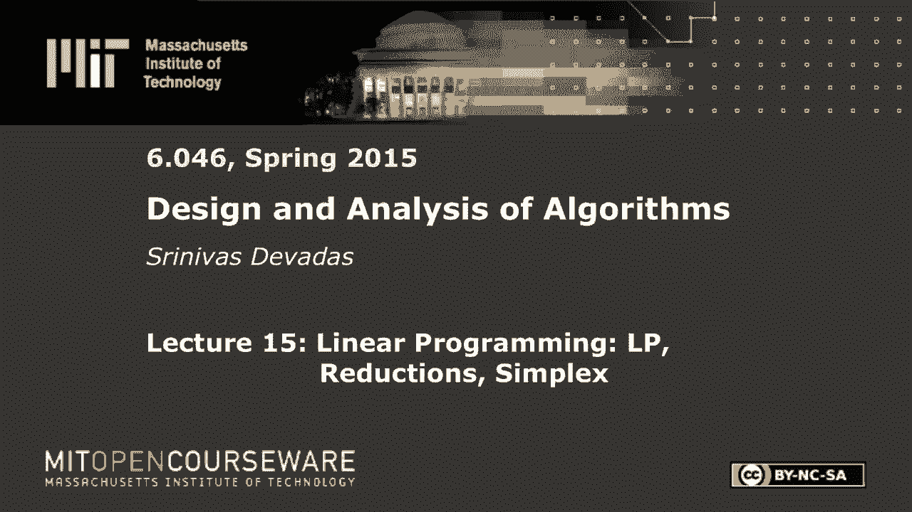
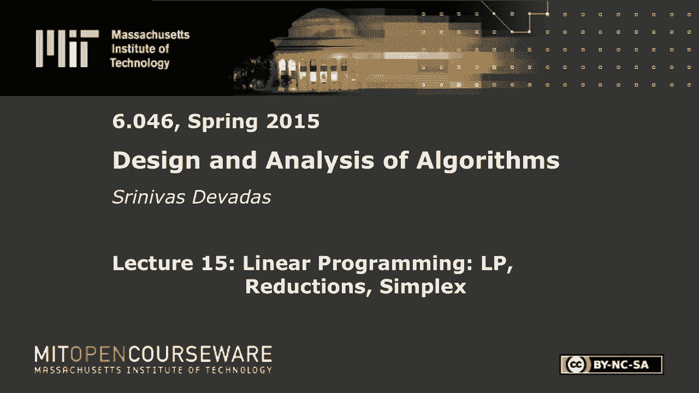
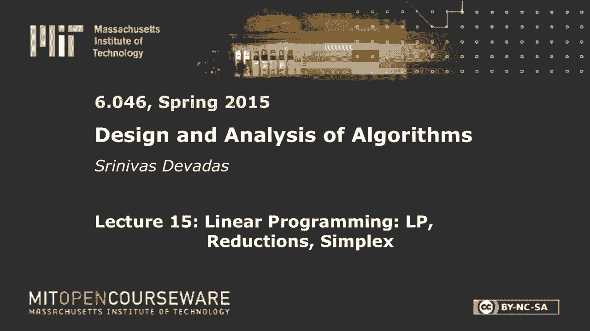
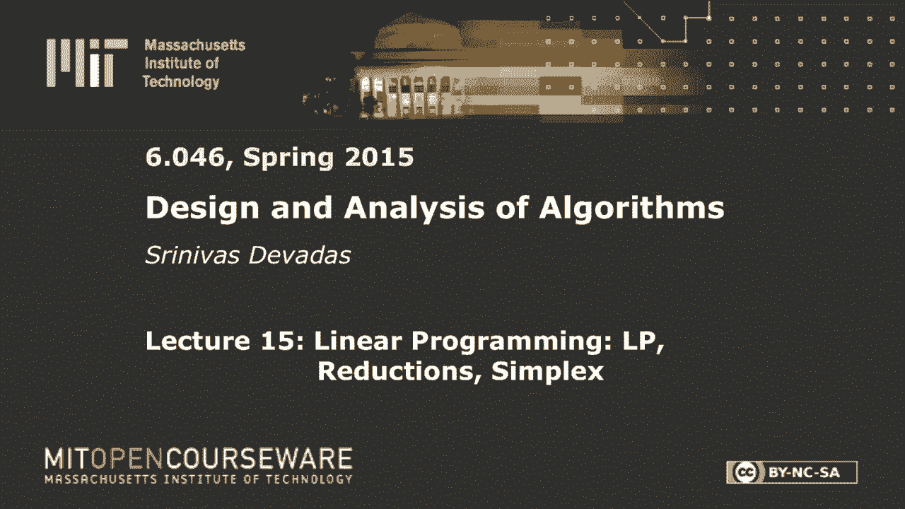

# 【双语字幕+资料下载】MIT 6.046J ｜ 数据结构与算法设计(2015·完整版) - P21：L15- 线性规划：LP、约简、单纯形 - ShowMeAI - BV1sf4y1H7vb

以下内容是根据知识共享许可提供的，您的支持将有助于麻省理工学院开放课件。

继续免费提供优质教育资源。

捐赠或查看麻省理工学院数百门课程中的额外材料。

大家早上好，所以我们今天有一个关于线性规划的单例讲座，这是一种通用的优化技术，你可以用来解决一大堆问题，包括我们在六零年见过的，四，六和以前的双O六，最近我们研究了最大流量，我们就不必经历所有的痛苦。

我们推导出了一个最大流算法，如果你手边有线性规划包，你所想做的就是找到最优的解决方案，你可以用适当的输入运行线性程序，当然，这是从流网络中派生出来的，你得到你的最优解，我们会花几分钟讨论这个问题。

当我们在今天的讲座中看到线性规划的力量时，但这不仅仅是最大流量，你可以做最短的路径，你可以做多商品最大流量，它比最大流和其他各种问题更复杂，所以这是个好消息，坏消息是线性规划的算法，比最大流量复杂得多。

你可以想象会是这样，因为它是一种更通用、更强大的技术，历史真的是，这是一个悬而未决的问题，直到1979年，人们不知道线性规划是否是多项式时间可解的，直到卡珊想出了这个椭球法，然后就有了。

从那以后有了进展，但是我们今天要描述的算法，在示例输入上执行是一个单纯形算法，在最坏情况指数时间下运行的单纯形算法，但在实践中很有效，它坚守阵地，即使从理论上来说效率更高，多项式时间算法，即椭球法。

这实际上并不那么有效，和新的内点方法，所以一点点上下文，让我们深入探讨一个例子，看看如何将这个特殊的问题表述为线性程序，好吧那么政治是如何运作的，你买选举是对的，所以你不想花很多钱。

所以你想尽量减少购买选举所需的资金，你购买选举的方式，但你得做广告，相关的事实并不重要，只要你用正确的信息找到正确的人群，让我们假设你会正确地赢得选举，这就是我们在30秒内对竞选和政治的数学抽象。

如何竞选，赢得选举，正如我所说，我们要做广告，但你在这里确实有一点工作要做，这位经理会估计，但那一块钱花在广告上了，支援，某一特定案件或某一特定案件的，问题，只要你向不同的人口群体发送不同的信息。

就允许矛盾，你们都很好，对呀，你是在假设人们不看一个以上的频道，所有的权利，原来你是福克斯新闻的人，你是MSBC和MSNBC的人，你不能两样都做，所以现在我们得到了这个估计，它变成了一张桌子。

所以你有你的政策，你有你的人口统计，我想你可以想想我住在农村的列克星敦，我真的不知道那是什么意思，但是，但大概有地方，这是我们的政策，对吗，你想修路，有点无聊，但有些人对道路感兴趣，枪支管制非常敏感。

农业补贴，你知道，谁对此感兴趣，和汽油税，有点多，这或多或少会击中你的口袋，每个人都对此感兴趣，好的，所以你告诉那些想修路的城市人，他们不喜欢你，对呀，所以你在那里得到负2，所以这个可以去，你做广告。

它伤害了你，你失去选票，好的，告诉郊区的人，通常是一个，这种情况下，你有这些漂亮的车，你不喜欢坑坑洼洼，所以你喜欢路，如果你住在郊区，农村人口有四乘四，他们并不特别在意，他们不那么在乎，好的，控枪很好。

你可以想象那样的都市人，郊区的人，你不想，你不想在农村地区做枪支管制的广告，对呀，农业补贴就像，我不想处理那个，什么是农场，农村人喜欢它，所以然后汽油税好，城市人在通勤，和，嗯，他们通常没有很多钱。

所以你去那里，这些是数字，我不打算在这里证明每一个数字是正确的，好的，但你可以把你想要的任何数字，我是说，所以让我们继续前进，这只是一张桌子，它可能有正数，它可能有负数，你还想赢得这次选举。

不管人口统计数据有多疯狂，你的选民有多疯狂是对的，你想赢得选举，谁能帮您弄到这张桌子？这一切都是数学上的，好的，你只需要弄清楚，你将如何赢得多数席位，你可以争辩说你想要的只是，就是赢得选举。

我们要做一些稍微不同的事情，这显然可以保证，胜利，但你想在每个人口中赢得多数席位，因为桌子可能会偏离一点，你要小心，所以最后一件事，当然啦，为了估计你需要多少钱，这里的人口，每花一美元，所以你得到了。

十块钱一票，5美元一票，等等，所以我们需要把它转化为选票，因为那是美元，你在这里得到了与这些地区相对应的人口，这就是你在这里得到的，大多数，2。如果双方打成平手，我们就假定你们获胜。

只是为了让这些数字容易，所以这只是除以2，好吧，这就是你目前得到的，你想通过花最少的钱来赢，这就是我们的优化问题，所以我们可以把这个，我们可以把它转换成一组线性方程组，这将创建我们的线性程序。

我们的第一个线性规划，所以让我们在这里需要一些变量，所以让x 1 x 2 x 3 x 4，所以你有这四个问题，所以让我把它写出来，重要的是，确保你知道我对某一特定问题的看法，这就是我们的四期。

这是我们的四个变量，所以这个线性规划有四个变量，你试图发现这些变量的值来优化，最小化成本函数，线性规划的第二件事，线性规划几乎唯一的其他东西是约束，这些约束也是线性的，好的，如果你有二次约束。

它会变得更加复杂，我们不会在这些限制下去那里，我要写的，与这里的陈述相对应，假设你想在每个人口统计中获得多数，所以你可以想象，因为你有三个人口统计数据，你可以有三个约束，好吧，你可以用不同的方式写这个。

这里有任意数量的方差，当我们去看其他例子时，你会明白这一点，但我们只坚持这里的一个变体，所以现在我想把我用英语写的所有东西都翻译出来，在那里进入代数，所以我得到了，我的最小化准则，最小化x一加x二。

加x3加x4，减二x一加八x二加零x三加十x四，大于或等于五万，这代表了我希望在第一个人口统计中占多数的要求，即城市人口，所以我希望那里至少有5万张选票，我需要花与x 1到x 4的值相对应的钱。

以这样一种方式，我得到了那五万张选票，这代表着，它只是从城市专栏中读出负2，8，0和10，所以你在这里看到的这些数字对应于右边的列，因为我说的是城市人口，你可以想象下一个约束是，与中间的柱子相对应。

第三个到第三个右边，所以我就把它写出来，我将把这个约束称为一号约束，我以后可能会参考它，五x一加二x二加零x三，等于或等于十万，把这个叫二号，最后是3 x 1减去5 x 2，十乘三，这是我们的一组约束。

但我们必须小心的另一个小问题，如果你是精确的，那就是没有概念，你要花正数美元，它是x1到x4大于或等于零，这是我们的第一个线性程序，它来自这个特殊的问题，那就太好了。

这正是我们在这节课剩下的时间里要做的，如果我们能以有效的方式在任何可能的线性规划中求解这个线性规划，所以变量的数量很少，n，你可以想象这里的约束数量，只是说这些约束是m约束。

您当然需要一个在n ok中多项式的运行时，那是我们的目标，正如我前面提到的，我不清楚的时间最长，嗯，至少到1979年，但在此之前人们已经思考了很长时间，是否有一个通用的算法可以及时解决任何线性程序。

n中的多项式，这是由Kaon在79中解决的，我们将研究一个算法，在最坏的情况下以n为指数运行的单纯形，但更容易描述，在实践中非常有效，所以在我们的特殊问题中，这个，事实证明你和我很快就会回到这个问题上。

但是，我就告诉你，具有这些特定数的特定线性规划，与这里的这些数字相对应，所以你想花两万美元，所以这里有一百个，所以把，两个零，所以花了大约两万美元在第一期修路上，我为第二期花了一点钱，忽略第三个。

相当于农业补贴，在汽油税问题上花一点钱，这些数字并不重要，除了它们碰巧是最优的，如果你把这些数字加起来，那么x一加x二加x三，加x4大约是2万1千美元到2万7千美元，抱歉，打扰一下。

尽管我把它写成这个分数，并不是说它们必须清楚地积分，这里有分数表示最优，反正他们中的一些人，但在一般线性规划中，变量值是真实的，好的，也有整数线性规划是NP完全的，所以它变成了一个更难的问题。

你得到了多项式时间可解，你完成了NP，埃里克星期四要讲的，值强制为积分，所以这个额外的约束让事情变得更糟，从复杂性的角度来看，在这节课剩下的时间里，我们不再讨论ilp了，所以我会回到这个。

我将讨论如何证明这是最优的，而不是真正进入深度算法潜水，但我之前想做的，也就是给出线性规划的一般公式，它被称为CLLR中的标准形式，也称为一般形式，在某些情况下我们会，看标准表格。

对于LP和我想弹出一个关于这个例子的级别，并给你一般的设置，我们将集中在大部分的一般设置上，但我这里有的是，我可以最小化或最大化，我们有一个最小化问题，最小化线性目标函数，和变量，把x看作向量。

它是一个列向量，或者x 1 x 2一直到xn，目标函数，c乘以x所以是，所有的系数都是1，和不平等，他们是，有趣的部分，你代表他，你可以把它们表示为A作为矩阵A乘以X，小于或等于b，请注意。

这是我所说的标准形式，现在我已经偏离了我在这里所拥有的，因为我有大于或等于这里，所以你会在不同的设置下看到线性程序，有时你会有最小化，有时你会有最大化，有时你会有更少的约束，小于等于约束。

有时你会有大于或等于约束，有时你会有相等的约束，我们会花一点时间讨论，如何将任何给定的线性程序转换成标准形式，所以我们的标准形式是，好吧，这些是我们的不平等，它们被表示为小于或等于，这是标准格式。

再次为标准最大值，以便，这些不等式集合的ax小于或等于b，在x上大于或等于零，好的，因此，对于对应于变量的每个值，您希望这些变量在标准形式中为非负，你想要小于或等于，对应于不等于，不大于或等于。

但小于或等于，你有这个线性成本函数，在那里你可以有任意的系数，但你在最大化它，好的，原来如此，所以这一切都是关于极性的，不比那多多少，这只是关于极性，如果你可以，如果你得到一个线性程序。

不符合这一点的特定线性程序，我们将花几分钟讨论转换，这将是相当简单的，可能不会立即明显，但我们会讨论到目前为止的任何问题，好吧，所以我想回到这个，在此索赔，我说这是最佳的，好了，现在，实际上没有。

向您描述一个算法，我会让你们相信这个值，对应于它是什么，三百万，三点，一百万，其实是最优的，这是我能做的因为线性规划，那么那口井是什么，让我们先看看这里的具体示例，我会给你一个非常具体的观察。

我会告诉你你能想到的，好的，我会给你一个关于这组数字的最优性证书，我要这么做，我可以想象给你一个很长的证据，一个特定的线性规划算法总是给你最小的答案，最佳答案，在这个特定的例子中执行那个算法。

然后你就确信，当然，解决方案将是最优的，但是对于这个特定的例子，我想给你一张证书，此证书不适用于其他示例，会很短，因为它只适用于这个例子，但对其他人不起作用，我该怎么做，所以答案是，事实上。

有一个证书显示LP解决方案，我所做的一切，我取了这三个方程，我把它们乘以这些神奇的常数，所以我不打算告诉你们我们是如何获得最优性证书的，但我会给你证书，很明显，这是一个最优性的证书，如果我把这三个方程。

一二三对，所以当我提到一二三的时候，他们指的是方程，这些是方程或约束，所以我认为，很明显，如果我有一堆方程，我把它们相乘，我当然能把它们加起来。最后我得到了另一个方程，好吧，这一切都将是线性的。

如果我那样做了，我得到x 1加x 2加1 40除以2 2 2，三加四右，这就是左手边和右手边的情况，量五零除以一一一，好的，这就是你得到的，所以现在有人能告诉我为什么最后一步，为什么这是最优性证书。

事实上，显然这都是代数，一旦我发现了系数，所以现在我做了这件事，为什么我刚才给你看，嗯三十一，三点，一百万除以一实际上是最优的，有人能告诉我，看看你左手边有什么，任何其他解决办法。

但我想让你把它联系起来，把它联系起来，我在花什么，是啊，是啊，但我的意思是，这是一个索赔，这是一个索赔，在这一点上，一个未经证实的说法，这是一个未经证实的说法，是啊，是啊，去吧，就是。

是的x 1加x 2加x 3加x 4是多少，是啊，是啊，你试图最小化的东西完全正确，你就快到了，但这里的关键观察是x 1加x 2加x 3，加x4大于或等于x1加x2，因为所有这些都是正数，记住四十除以二。

二二小于一，三加四，所以我可以说这比，或等于三百零五个零，一一一右，正是因为这一观察，它是最优性的证明，右a，那很酷，只是从某个地方编造了这些系数，把他们从帽子里拿出来。

你们现在都相信我们得到的价值是最优的，没有运行算法，也许我运行了一个算法，当然，你运行了一个算法来得到这些系数，对呀，这些系数是如何出现的，所以我们不会在这上面花很多时间，嗯，你会看到这个。

可能在习题集中，或者在章节中，但总的来说，我不会太担心二元性，除了知道概念，而LP的概念，二元性本质上说刚刚发生的事情不是巧合，你可以一直这样做，对于线性程序，它们总是。

与某些系数集相对应的最优性的简短证书，你可以用它来做这个特殊的数学，通过这些线性约束，把它们相乘，把它们加起来，显示您在，在这个问题的情况下，你不能，你不能再低了，因此对于最小化问题，当你到达那里。

你显然找到了最佳，这就是LP对偶性的概念和基本定理，这真的更多的是作为一个参考，我们想证明这个定理如果你有lp的标准形式，我只是在这里再写一遍，但他的斧头不到，大于或等于零的x向量。

所以这和我在这里做的一样，与标准LP表单相对应，嗯，有一个对偶，这就是所谓的原始形式，通常如果你不这样做，别说出来，你认为它是一种原始的形式，如果是双重的，你叫它对偶，这是LP的一种原始形式。

这是LP的对偶形式或对偶LP，双LP翻转一切，这不仅仅是否定，而是转置，实际变量也交换功能，所以这真的很酷，所以你的最大值变成了最小值，C被B取代，它在不等式的右手边，大于或等于c。

所以那里也有一个翻转，y大于或等于零，对呀，所以这里发生了很多事情，在这两个问题上最终是等价的，原始的和对偶的，你总是可以这样做，本质上这里发生的事情，和，为了提高效率。

有很多算法在这两种形式之间不断切换，但最终发生的是你看到，这里对应于B的约束，约束变成B结束在这里的成本函数中，这就是这里正在发生的事情，关于用特定系数乘以这些方程，就像我说的，这真的更多的是仅供参考。

这是一个明显有趣的最优性证明，这是一种不同于证明算法正确的证明，并将该证明应用于特定的实例，这就是LP中发生的事情，尤其是当你从原始和对偶形式，我就不说了，我想做的是给你一种感觉，嗯。

我们如何转换为标准形式，所以你可以应用一个算法，比如说，你有一个程序，它只需要标准的形式，它以标准形式运行，让我们很快地过去，这不会花很长时间从不同种类的LP翻译，对于我们的政治问题。

我们有一个稍微不同的问题，有一个最小化，我们如何将其转换为标准形式，所以说，棘手的，所以假设我想最小化，减二x一，加三乘二，我想转换成标准形式，我只有一个标准的LP求解器，我该怎么办，应该很容易。

如果我有一个最大化的求解器，我该怎么办，但我想尽量减少数量，把指示牌调换一下，所以大门，到二x一减去三x二，所以这很容易，这是一个棘手的问题，假设，约束，所以碰巧不是美元，但它是其他一些可能为负的数量。

可能是盈利也可能是亏损，所以数量代表利润或损失，所以它可能会变成负数，如果是损失，所以我在最初的问题说明中没有这个限制，但是我的标准形式和我的LP求解器要求整个向量是非负的，所有权利，所以我有个问题。

我不能使用我的标准求解器，因为这种非负性，约束，我该怎么解决这个问题，我如何把它变成一个允许使用标准求解器的问题，是啊，是啊，去吧，你可以把它分成两个变量，比如xj-1，一减去二等于，完美伟大，那很好。

给你，所以你在这里要做的是把XJ替换掉，用，假设xj素数减去xj双素数，你有x j素数大于或等于零，x j双素数大于或等于零，但取决于特定的值，无论你在探索什么解决方案，或者最终的解决方案。

您可能有一个实际的xj值，它是负的或正的，所有的权利，所以你在线性程序中增加了一个额外的变量，再来几个真的很快，假设我们有一个受约束的等式，相当于x1加x2等于7，我如何处理相等约束。

其中我有x一加x二等于七，对呀，是啊，是啊，继续说x一加x二，否，你不能做小于或等于，但你可以把标志，然后你可以把牌子翻过来，所以你必须你必须，你在那里有两个台阶，好，所有的权利，所以你小于或等于需要。

另一个乘数，所以你最终要做的是像在x 1加x 2上，大于或等于七，然后你需要，如果你照这位先生刚才说的做，翻转符号，你得到负x1，减x2，是这样吗，否，我搞砸了，哦，我想要小于等于，你说的对，你说的对。

我需要小于或等于，哦，这是正确的，当然啦，谢谢好的，所以我需要小于或等于，在这两个地方，这是我需要的标准表格，小于或等于好，嗯，您所做的是将约束的数量增加一个，所有的权利，我第二次答对了吗。

所以差不多就是这样，最后一件我不会写出来的事情是我们在这里做了什么，已经，大于或等于约束，我想给你们举个例子，我们已经有这个了，它翻译为小于或等于-1乘以，所以我们必须调用它，为了做到平等。

这么说你是做生意的，如果你有一个标准的LP求解器，你可以解决几乎任何优化问题，就其目标函数而言是线性的，并有线性约束，你可以把它转换成LP，如果你有非线性约束，在使这些约束线性化方面还有很多工作要做。

并使用LP求解器，这是一件很实际的事情，这可能是你最终会做的事情，调用这些强大的LP求解器，通常它们是商业上可以买到的，最好的是广告，用它来解决你的特殊问题，它把你的算法设计问题变成了一个约简权。

所以你旋转，真的是在接下来的几周里考虑削减，我们现在就开始，我们将把现有的组合问题，我们已经知道算法，我们要把它们还原为LP，只是为了让你感受一下LP的力量是什么，但这种还原的概念是非常强大的。

你可以在这里用它来做复杂性证明，我们在今天的课上只是为了方便而使用它，用我们的LP锤，假设我有我们本周最喜欢的问题，即最大流量，我想把它转换成LP，所以我一周前回去了大约一周前的这个时候。

我们会设置最大流量问题，让我们假设我们回到那里，我们没有谈论增加路径，我们没有谈论剩余容量或最小削减，或者类似的东西，但我们已经知道LP了，我们只想用LP来解决最大流量，所以我们就这么做吧。

所以这是最大流量，我不打算费心转换为标准形式，我们知道怎么做，考虑到我们刚刚在那里所做的，所以我会做任何事，我想让事情变得简单，最大流显然是一个最大化问题，使用我们使用的相同符号。

它不会看起来像斧头和B，只是因为我想让你回忆一下最大流量是什么，我们要翻译一下，以及这些变量的值或这些变量的名称，不管它们是x还是f，应该没什么关系吧，我们知道如何在这一点上做LP。

我们知道如何制定LP，在这一点上我应该说，我们假设我们有一个LT求解器，所以我想在这里做的是，最大流量问题是流量值最大化，你只要抓住源头，您有一个与，从源到其他顶点v的流，你必须最大化这个权利。

这就是最大流量的设置，我不会改变这一点，你觉得怎么样，三个制约因素，或者我们这里的任何约束都将对应于，你花了一周时间在最大流量上的LP，看了习题集，我要在那里设置什么限制，我将不得不设置容量限制。

这是显而易见的，另一个是什么，进入一个不是源或接收器的节点必须保持正确，嗯在原来的网络里，有没有一个概念，否，你会定义它往另一个方向走，所以我们确实谈到了负数，等等，但你会有正数，尤其是如果你看净流量。

我们放大的流的版本，在上周的周二讲座中，在一般情况下，你也有，你也会有这些斜对称约束，所以这里你需要的三件事是斜对称，对呀，所以对于所有的紫外，f u v等于-f v u，属于V。

取决于你拥有的网络类型，如果将其约束为某种类型，你没有这两个方向的边缘，你当然可以去掉一些，如果不是所有这些斜对称约束，重要的是保护和能力，这对你来说应该很熟悉，但关键是，我把这些都写出来的原因主要是。

以确保您理解这些都是线性约束，所以这几乎是你在这里唯一需要观察的事情，很明显，这些约束你们在上周的两节课中已经见过很多次了，但请注意，它们都是线性的，所以，最后这个，这个是f u v。

对于属于cap v的所有u v，小于或等于u v的c，所以这是f，这是一个小于另一个常数的变量，明显线性，在这里做一堆算术，我显然可以有乘数，在本例中用于守恒的标量乘数，我没有标量乘数。

但它显然是线性的，斜对称这里有两个变量，其中一个是对另一个的否定，明显线性，所以这就是为什么这是一个LP，所以你可能会说，嗯，我更清楚，max flow比现有的任何LP求解器都要高效得多，你是对的。

如果你有这个品种的最大流量问题，很难想象你会得到性能，运行LP求解器的经验性能，但是嗯，最大流量的推广，那是多种商品，最大流量，你只是没有一种商品流动，你可能在路上数汽车和卡车。

或者你知道有两种不同的液体流过同一根管子，任何气体或液体，所以当你有多种商品时，您可能有一个线性但更复杂的成本函数，这是每种商品流量的函数，它们可能有一定的重量，所以有很多事情可能是，更一般的。

可以有更多的通用设置对应于最大流量，我只想让你想到，你可以，你可以简单地拥有两种商品，我们就叫他们一和二，现在你有了F和C，f 2 s和c 2，每种商品都必须得到保护，但是容量呢，你认为容量会发生什么。

我们假设这是两种不同的车，那么容量限制是什么样子的，说C一或，就像每个边的，是啊，是啊，让他们在一起，或者完全正确，这么好的观点，可能我有独特的能力，事实上，如果你有完全不相交的问题，你是对的。

你可以把它们分开来解，但实际上更有趣的情况是，你有一个单一的能力，所以你有，让我把这个写在这里，如果事实上你有两个不同的东西，所以如果你有f1c1f2c2，问题是你有两个不同的，你只需使用最大流量两次。

另一方面，什么更有趣，真的，我应该用这个例子作为开始，但这里有一个更好的，你有两种商品和一种容量，所以道路就是一个很好的例子，汽车和卡车都在同一条路上，它有一定的容量。

现在你的容量限制看起来像f1加f2，这就是通过特定边缘的流动，uv，所以你有一个紫外光加两个紫外光，对于这个总容量，u v小于或等于c u v，差不多就是这样，所以这是线性的，对吧，好的是，它是线性的。

你可以在上面加砝码，如果你想说某样商品我用完了，因为它是一辆卡车，它在路上占用了更多的空间，你可以容纳更少的人，你可以在里面放一个乘数，还是说它是线性的对吧，这就是拥有LP发动机的力量。

你可以翻译不完全是最大流量的问题，它们是多种商品的流动，您可以添加额外的线性约束，您仍然可以使用您的LP包，所以这就是为什么这是有趣和强大的原因，所以这是一个明显的对应于最大流量的，嗯，让我们看看。

让我们来看看一些不太明显的东西，转换最短路径问题会有点棘手，很多工作，但有一个很重要的小观察，为了让整件事，流动或实际工作，所以如果我们都知道最短路径问题，i，我们想找到，我们就叫它单一来源吧。

最短路径问题，你有一个特定的来源会变成，你要在远处开始计算的点，对，迪克斯特拉就是这么做的，这就是贝尔曼·福特所做的，这是顶点X的借口，我的，我想在这里做的是，显然把它设置成一组线性约束，对，如果我有。

从源头，所以dv表示与源的距离，最终我希望DV是离源头最短的距离，对，这是我们最短路径的表示法，dv表示现有路径，它可能不是从s到v的最短路径，它的价值，但是单调地dv，当你跑过它的时候。

在Dijkstra中最初是无穷大，回到迪克斯特兰德，然后我们通过一个松弛的过程来收缩它，好的，现在我想试着模仿一下，我想试着把这一切都模拟成一个LP，所以不是马上就能看出来的，流动网络所拥有的东西。

我们有这些限制，我们有能力限制和保护限制，我们可以把这种限制变成不平等，很顺利，这很容易，所以我在这里需要做的是，用最短的路径是一种更微妙的东西，那么在最短路径算法中，我有什么基本的约束，什么是不平等。

你还记得最短路径的不等式吗，我们一直在谈论三角不等式，对呀，所以我们要用三角不等式，取三角形不等式，用它创建一个LP，制定最短路径，对呀，特别是这里我可以写dv减去du小于，或等于w u v。

对所有属于e的v v，这就是三角不等式，好，s的d等于0，这是我唯一开始的事情，对呀，所以这里发生的事情很简单，有不同的方法来获得V，我的最短路径将是到达V的最佳方式，所以说，特别是。

你想思考这个问题的方式是，如果我有一个V，我可以从，这么说吧，你一个和你两个，也许源头在这里，这是唯一能得到V右的两条边，所以我只是在看一个相当有限的设置，U1和U2必须是两个顶点。

这两个中的一个会让我得到V，我得到了一个，我这里有一个V，我在这里得到了吴2V，所以这意味着，我得把这个写下来，对于这些边的每一个，对于这些边的每一个，我要去我有这个约束，也就是说dv值。

如果我想要最短的路径，这两个约束，如果我想遵守这两个约束，其中一个将是我的极限约束，我要把这两个词的最小值计算出来，所以实际上这意味着这是一个和正确的，所以dv减去du 1小于等于w u 1。

小于等于w u 2v，这是一个，因为我把这两个约束都放在这里，这基本上意味着dv将是，这两个量，杜一量加吴一V，杜二量加上吴二v对这是有道理的，如果不清楚就问我问题，所以这简单地对应于我在这里做一个。

我把所有这些限制都加进去了，所以我应用三角形不等式，路径以它为结尾的顶点，你把它向前推到这个顶点，你可以通过所有不同的方式，在这种情况下有两套方法，你们一个你们两个一个，最后一步是最小化步骤。

所有的权利，好的，所以你认为你完蛋了，否则我们就玩完了，但我们还没有完全结束，因为在我的LP公式中，这里缺少的是什么，我在这里还能做什么，当然不是阴性，让我们做那个遗憾的目标，目标是谁，又是你。

所以我们现在缺少一个目标函数，最短路径又是什么问题，短意味着最小，右最小最小高度，随便啦，如果我在这里放一个最小值会发生什么，假设我做了一些类似sigma over v v dv的事情，因为我想最小化。

或者我可以挑一个特定的，我可以选择一个特定的来源，单一目的地，我在那里放了一个最小值，这个问题的解决办法是什么？如果我最小化距离为零，因为零值是正确的，所以有些东西我没有放在约束中，我确实想要一条路。

我确实想要一个从S到V的路径，用于任何匹配的V，最小量中的一个，因为民说我有平等，这里最大的问题是，这是一个小于或等于，这就是为什么最小值在目标函数中不起作用，它小于或等于，但是这边的这个min。

它是最短路径的定义，说它要么等于这个量，要么等于那个量，这里有一个等式，从这边缺少，对吧，这是关键的观察，一旦你观察到这些成分中的一个需要相等，MIM的量，然后你就会看到。

你要做的就是把这个最小值改成最大值，好的，所以你说，薄荷到底是怎么变成麦克斯的，我不太确定，我会在接下来的一分钟左右说服你们每一个人，但底线是归根结底，我已经有一个分钟在我的不平等。

因为我和这些不等式中的每一个，我把每一个不平等都写下来了，所以他们中的每一个都会迫使我找到最好的解决方案，因为他们会强迫我不要通过你们两个，如果你一个更好，因为与你对应的另一个约束会迫使我下来。

所以有一个额外的分钟在那里，因为小于或等于的结尾，然后为了实际上强迫其中一个相等，我需要尽我所能向上推，尽我所能，所以考虑一下，用几个例子来玩，我为初学者选择了一个简单的例子，你会发现这是正确的公式。

所以你可以看到，在某些情况下，如何将问题转化为LP并不完全清楚，但即使在这种情况下，有时候你可以好吧，所以这只是一大堆不同的问题，一个好的，能够使用组合优化引擎的技能，像LP甚至最大流量。

并能够将问题转化为他们，如果你在职业生涯中坚持算法，这是你可能会做的事情，所以在剩下的时间里，我最不想做的事情是，是给你一些关于LP程序实际上是如何的感觉，优化，你怎么可能采用标准的LP配方。

这是一个一般的设置，你对最短路径一无所知，让我们不假设最大流量，这不是关于一个具体的问题，它是关于一般的设置，我们怎么解决一般的设置，因为这就是这里的主题，无论如何，你有这个引擎，你想用这个引擎。

但现在你如何制造这个引擎，所以我们要做的，看一个相当简单的单纯形算法示例，这个算法在课本上，它会在我的笔记里，所以我会尽我所能，描述起来没那么复杂，尤其是从例子的角度来看。

我可能无法通过所有的步骤来得到你，这个特定示例的最优值，考虑到我们有多少时间，最重要的是，它说你可以用不标准的形式来表示LP，但在松弛的形式，好的，所以我要告诉你们什么是松弛形式。

然后我们要做的是单纯形的流，算法流程是转换一个松弛形式，变成等价物，显然你不想做不正确的事，但它必须是等价的松弛形式，没有减少，而且可能有所增加，所以你可以保证客观值没有减少，你不能保证增加。

然后我们要继续前进，变得显而易见对吧，你可能会说，这怎么明显，这就是我谈论最优性短证书的原因，绝对是一个，你现在可以说嘿，我知道我受够了，很明显，我不能做得更好了，希望在这节课结束的时候。

你们会在这个简单的例子中看到，原来如此，这是一个迭代算法，它是指数级的，不幸的是，因为在最坏的情况下，这需要m加n选择n次迭代，其中n是变量数，m是约束数，大多数时候它做得更好。

但这是你在最坏的情况下唯一能证明的界限，所以你被指数算法困住了，如果你用的是简单最坏的情况，我们实际上不会对单纯形做太多的分析，它真的是零四六的自动瞄准器，在分析方面，实际算法当然在范围内。

所以我想做的是给你一些感觉，松弛形式是什么样子的，我们将对simplex进行几次迭代，在讲座结束前，我们会尽可能地走得更远，所以我们将从我们的，政治榜样，它的大小差不多，我想向你们解释什么是松弛形式。

为什么它很有趣，所以我想做的是最大化，三x一加x二加x三，一加二加三，一加二二加五三小于等于二四，四一加二加二三小于等于三六，然后我们的非负性约束，x 1 x 2 x 3大于或等于零，所有的权利。

那就是我们的，这是我们的示例问题，我把它放下，在那里，你要把它转换成松弛的形式，那么松弛的形式是什么，我们将引入额外数量的变量，对应于我们所拥有的方程的数量，所以在这种情况下，我们将引入三个新变量。

因为我有三个方程和松弛形式，对于这个问题是这样的，z=3 x 1加x 2加x 3，和之前一样，然后我会有代表这些的变量，叫做基本变量，原始变量称为非基本变量，所以我要加上三个基本变量。

x4 x5和x6对应于这三个约束，他们将代表松弛，从某种意义上说，它们将与你有多少松弛相对应，在最初问题中的不等式中，所以如果x4碰巧是零，那你就有麻烦了，你没有懈怠，因为一加二加三三等于三十。

增加其中任何一个都将违反约束，好的，所以这只是松弛的简单概念，问题是我们有多大的空间，你有，x5是20，四减二一减二二减五三，最后一个是三个，六减四x一，在这一点下，这是非常机械的。

所以我把这组方程叫做，方程，一个，我现在要做的是，嗯，在对应于x 1 x 2 x 3的空间上工作，×四×五×六，所以我会有这些解决方案，现在有六个值与它们相关联，而不是只有三个值，因为我加了三个变量。

基本变量到我的非基本集，所以原始变量是非基本的，只是为了区分，到目前为止，它只是建立了它的定义，我们就可以，在这里需要大约三次迭代，为了达到最优的点是显而易见的，所以你要通过三种松弛的形式来转换，最后。

当你达到第四个松弛形式时，你看到你有一个最优的解决方案，这是如何工作的，我们将有一个基本解决方案的概念，所以在这种情况下，我们要吃什么，然后我们要计算基本变量的值，对呀。

所以我们的目标函数是3乘以0+1乘以0，加2乘以零，很明显是零，x4上的值，当然啦，因为所有这些都是零，快三十岁了，x5等于2-4，x6是36，所以这是一个微不足道的起点，所以你可以把它想成零，零零。

你看到的解决方案是34 24和36，那就是我们的，起点，这并不能告诉你太多，但现在是关键的一步，在那里我们要做一些叫做旋转的事情，在旋转中，你要把一个基本变量和一个非基本变量交换，对这一步需要一些智慧。

但基本步骤是交换，所以一个基本变量将变成一个非基本变量，反之亦然，好的，我们最初如何选择这个，你可以用一种任意的方式来做这件事，随着你的前进，它变得更加微妙，你不会想让我随意做事的，但让我们从。

在一个更通用的，我们称它为x子e，其系数，在目标函数中，如果你找不到这样的东西，你总是可以重新定义事情，但我们不会去那里，然后我们要做的是我们要增加，我们总是有限制，当然啦，所以我们可以在不违反。

任何限制，那么在这一点上变量，所以它会变成左手边，它要移过去了，你要交换X一个可能在这里，这边，你必须重写这些方程，所以X一个就变成了基本的，比如说，到左手边，它替换的变量会转到右手边。

所以你可以把这看作是高斯消去法，除非有不等式，那里肯定有关系，如果你回忆起你的高斯消去法，如果你不担心，其他基本变量的值，和目标函数，所以我们会做，我们要做一个支点，至少。

所以你对所涉及的代数有一种感觉，然后它，它变得更具体了一点，嗯，进一步激励你，你将在习题集8中这样做，在另一个例子上，所以我们在这里要做的是，我们将选择和非基本变量。

所以让我们选择x一个正确的词法图形顺序或数字顺序，让我们选一个，我想做的是增加x 1的值，所以我想在不违反约束的情况下增加它，现在你认为这些约束中哪一个会首先引起麻烦，关于增加x 1的值，x1现在是零。

对吧，我们在地面，你有所有的零，事情是可行的，现在，当我开始增加x 1，你还记得，你也有与x四个值中的每一个相关联的非负性约束，所以不要忘记约束被违反的事实，您需要所有的x大小大于或等于零。

对于非基本变量来说是正确的，对于基本变量也是如此，因此，违反约束意味着，当前的一个基本变量为负，对呀，这完全等价于最初的不等式没有得到满足，那么你认为这些限制中的哪一个会在这里造成麻烦，只要看看它。

就应该能看到这三个方程，并告诉我，当我增加x 1的值时，我要在哪里达到极限，x x，是呀，绝对正确，这是因为这里的负4，这是一个很大的乘数，我得到了一个，这里是负一，这里是负2，这里是负4。

如果你只看四个，四级比二级大，比一级大，所以这将是第三个约束，你显然可以用数字或机械来计算这个，在这个例子中，通过盯着它来做到这一点更容易，所以第三个约束是最紧的，它限制了我们可以增加多少x 1。

所以我要在那里做我的第二步，它对应于在x上重写为这些其他变量，现在我在左手边得到了x一个，右边是x6，现在只是换人的问题，一旦我做了这件事，我只是要强行进入，我要重写，x，x，在右手边，那就是我要代替。

x一，上面的等式实际上是一个简单的代换，所以在这一点上，发生的事情是因为第三个约束代表x6，是被选中的那个，发生的事情是X1和X6将互换角色，x 1是非基本的，它将成为基本的，x6是基本的。

它将变得不基本，这就是单纯形算法的本质，迭代，然后收敛，所有这些都是我在，需要达到一个明显的最优性，但是我们不会做任何与单纯形收敛性相对应的证明，或任何其他特定的LP技术，也许是一些约束技术，1。

我收回刚才说的话，但对于一个简单的人来说肯定不是，但我只想给你一个感觉，这里的流动，所以让我们来看看最后一件事，在完成枢轴练习方面，我想给你们看看方程是什么样子的，如果你继续这样做，在某一点上你会收敛。

这里的情况是z等于27，加x2除以4，加x3除以2，减三x六除以四，x 1等于，所以这里有一堆代数，我显然跳过了，嗯，但这是简单的代数，这里有x4，二十一减三x二除以四，减五x三除以二，加x6除以4。

最后一件事，所以这是我的支点步骤，在那里我翻转了x 1和x x，所以现在你问，重点是什么，这口井的意义是什么，重点是你实际上增加了目标函数值在这种特殊情况下，在保持正确性的同时相当显著，所以让我。

做出这些观察，并在这里结束，因为，然后呢，这让我们看到了一个支点步骤的细节，你可以想象一次又一次地应用它，这么说吧，让我们看看最初的基本解决方案，那个，正如你所记得的，是零零，零点三十，两个，四和三六。

这是简单的x 1到x 6，这些方程组，我也是，如果你把它们放在那里，在给定等价的情况下，它的目标值为零是有道理的，但你可以通过看到你有两个七来验证这一点，原来的客观值为零。

因为所有的x 1 x 2 x 3都是零，所以这是在与第一组对应的方程组中的一个简单的检查，我在这一点上已经抹去了，但没关系，如果你看看我这里有什么，我有三个六等于零。对呀，所以这里的目标值是零。

它和你以前的一样，但是两个人的基本解决方案，我要设置非基本值，那么这里的解决方案是什么，非基本值，都是零，所以解决办法是，非基本x 1现在是非基本，x2和x3仍然是基本的。

然后我有两个1和6和x6现在变成了基本的，所以我得到解决方案的方法是简单地在这边插入零，好吧，我得到九，二，一和六，因为我刚在右手边插入了零，所以这就是我如何得到一个新的解决方案。

如果你看看这个的客观价值，客观价值是，你可以简单地通过观察原始问题来看待这个客观值，最初的问题有一个3 x 1加x 2，加x3作为目标值，所以如果你走过去，你看得很清楚，其他的都是零，但你有三次，嗯九。

所以你的客观值是27，所以我们的枢轴翻转基本上让你从零的客观值，同时将正确性保持在27的客观值，好的，你可以在笔记或CLLR中看到这一点，但是你必须再做两个对应于另外两个变量的枢轴。

我在这里经历的同样肮脏的事情，选择后的替换，客观价值会增加，你可能会问，我怎么知道我做得对，所以这是这里的最后一件事，就是增加值，直到，否，这是旋转，对不起，增加值直到枢轴，直到它变得明显。

最佳状态是什么，最终发生的是什么，你最终得到了一个目标函数，在这种情况下，目标函数，请注意，这里的这个东西是目标函数，注意它有一个负系数，变量实际上是第一个枢轴的一部分。

所以x1和x6是第一个枢轴的一部分，这得到了一个负系数，所以这里最终发生的是你最终得到了这样的东西，减去一些，当您将这些设置为零时，这是你能做的最好的了，因为这些都是负数，所有的权利。

所以我就把这个留给你了，希望你明白我们是如何旋转的，突突地穿过它三次，然后你得到目标函数，最佳值是30。

