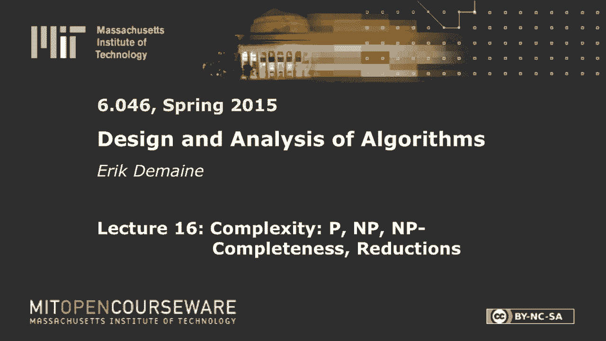

# 【双语字幕+资料下载】MIT 6.046J ｜ 数据结构与算法设计(2015·完整版) - P22：L16- P、NP、NP-完备性、归约 - ShowMeAI - BV1sf4y1H7vb

以下内容是根据知识共享许可提供的，您的支持将有助于麻省理工学院开放课件，继续免费提供优质教育资源，捐赠或查看麻省理工学院数百门课程中的额外材料。

今天我们做NP完整性，在一次演讲中完成整个领域，应该很好玩，事实上，上学期我教了一整节课关于这个主题的课，但现在我们要在80分钟内完成，我们将研究许多不同的问题，从超级马里奥兄弟到拼图。

并表明它们是NP完整的，这是一个有趣的区域，正如斯里尼上一堂课提到的，一切都是为了减少，这一切都是为了把一个问题转化为另一个问题，这本身就是一个有趣的谜题，这是一个算法挑战，我们会做很多，但首先。

我要提醒你一些你从中学到的东西，告诉你我们需要做什么，为了证明所有这些关系，我们到底需要为每一个箭头显示什么，为什么它很有趣，所以说，这通常是围绕P对NP问题。

所以记住p是我们知道如何在多项式时间内很好地解决的所有问题，不仅仅是我们知道如何解决的，但所有能解决的，这几乎是，也就是62O6和62046到目前为止的主题，但现在在接下来的几节课中。

我们将讨论可能不是多项式可解的问题，以及如何处理它们，多项式，如你所知，就像n对某个常数多项式，良好指数，那里不好，什么是n，我想N是问题的大小，好的，我们今天要小心一点然后np，问题不是可以解决的。

不在多项式时间，但它的问题可以在非确定多项式时间内解决，所以在这种情况下，我们需要关注一个特定类型的问题，也就是决策问题，决定只是意味着答案要么是，要么不是，所以这是一个单一的位答案。

我们会明白为什么我们需要局限于那种问题，在一瞬间，所以这是你可以在多项式时间内解决的问题，多项式的相同概念，n的相同概念，但在一个完全不切实际的计算模型中，这是一个不确定的模型，在非确定性模型中。

你能做的就是说，而不是从你知道的东西中计算东西，大家可以猜一下，在恒定的时间里，所以正常情况下，在正则模型中，一个恒定的时间操作就像你把两个数字相加，或者你做一个，如果这里的那种事情，我们可以猜一下。

我给了我给了计算机多项式很多选项，我对电脑感兴趣，会给我其中一个，它会给我一个很好的，猜猜看，猜测保证是好的，好的意味着这里，我想得到一个肯定的答案，如果可以的话，正式声明是，如果有任何猜测，好的。

这很奇怪，而且不对称，它偏向于是，这就是为什么我们只能考虑决策问题，是或否，你可以偏向于不，你得到了另一个叫警察的东西，但我们在这里只关注NP，所以这个想法是，我真的很想找到一个能得到肯定答案的猜测。

机器神奇地给了我一个，如果有的话，这意味着如果我最后说不，这意味着绝对没有一条路会导致是，所以当你得到一个不，你得到了很多信息，当你得到一个是，你得到一些信息，但是嘿，你很幸运，很难抱怨。

所以这个在双六，我经常称之为计算的幸运模型，那是非正式的版本，但非决定论才是这里真正发生的事情，所以说，也许想想举个例子是有用的，所以这里有一个问题，我们会，这可能是所有NP完全问题的鼻祖。

我们一会儿就会完成，三个坐着，SAT代表满意度，所以在三套，问题的输入如下所示，我只是想举一个例子，万一你忘了你奇怪的逻辑符号，这是一个，这些是矿石，我用这个来否定，不好吧，换句话说，我得到了一个公式。

每个或从句只有三件事，这些东西叫做字面，文字要么是变量x subi，或者是变量的否定，不是x子i，好的，所以这是一个典型的例子，你不能有否定，你可以，这里我有一个否定，两个否定，任何数量的否定。

每个条款，三人组，这三件事，三个文字被称为子句，它们都加在一起，我的目标是，这应该是一个决定的问题，所以我有一个是或否的问题，这个问题是，你能把变量，真假，所以每个变量我都可以选择一个真或假的名称。

这样公式就出来了，真，我用T和F表示真和假，所以我想设置这些变量，这样每个子句都为真，因为它们是加在一起的，所以我必须用三种方法之一来满足这一条款，也许我三种方式都满足了，没关系。

只要其中至少有一个是真的，其中至少有一个应该是真的，每个子句中至少有一个为真，好的，这就是三个SAT的问题，这是个难题，我们不知道多项式时间算法，可能没有，但是有一个多项式时间非确定性算法。

所以这个问题在NP中，如果我有幸运的猜测，它是为了解决这种问题而设计的，我要做的是猜测x 1是真的还是假的，所以我有两个选择，我要让我的机器做出正确的选择，应该是真的还是假的，那我猜x 2。

每一个猜测操作都需要恒定的时间，所以我对每个变量都这么做，然后我要检查我是否满足公式，如果这是真的，然后我会回来是的，如果结果是假的，我回不来，因为NP偏向于肯定的答案，它总能找到一个肯定的答案。

如果可以的话，如果有什么方法可以满足这个公式，那我就去拿，如果有什么办法使公式变为现实，那么这个算法将返回是，如果没有办法满足它，然后这个公式，那么这个非确定性算法将返回no。

这只是非确定性机器如何工作的定义，有点奇怪，但你可以从这种非确定性算法的原型中看到，你可以在开始的时候安排你的猜测，然后你做一些多项式正则多项式时间检查，没有确定性检查。

所以当你像这样用预先的猜测重写你的算法时，然后检查，你也可以把它看作是一个验证算法，所以你可以说，你知道你的朋友声称这三个SAT公式是可以满足的，这意味着有一种方法可以设置变量，使其为真。

所以这叫做令人满意的作业，满足只是意味着实现，你就像不，我不相信你，你的朋友说不，不不，真的，这是真的，这就是我如何证明这一点，你说x 1是假的，你说x 2为真，你说x 3，基本上他们给你猜测。

然后你不必相信这些都是正确的猜测，你可以检查它是否正确，猜猜看，你可以在线性时间内计算这个公式，看看结果是什么，如果有人告诉你X是什么，你可以很快看到这是否是一个令人满意的任务。

所以你可以称之为解决方案，然后有一个多项式时间验证算法来检查，解决方案是有效的，但你只能这样做是，如果你的朋友说不，这是不能满足的，他们没有办法向你证明是对的，我是说除了单独检查所有的作业之外。

这应该需要指数级的时间，没有简单的方法来确认这个问题的答案是否定的，但有一个简单的方法来检查答案是肯定的，我给你一个满意的任务，好的，所以NPP的这个定义是我坚持的，这是一种我喜欢猜测。

因为这就像动态编程和动态编程，我们也猜，和猜测，实际上最初来自动态规划中的非决定论世界，我们不允许这种型号，所以我们必须分开检查猜测，所以我们在这里花了很多时间，神奇地，你总是得到正确的。

只在恒定的时间内猜测，所以这是一个更强大的模型，当然没有这样工作的计算机，可悲的是，或者我想更有趣的是，所以这更多的是为了确认你的问题不是完全不可能的，至少你可以在多项式时间内检查答案。

所以这是NP的等价定义，因为你可以用一个不确定的算法，把猜测放在上面，您可以将这些猜测的结果称为答案是肯定的证书，然后你有一个多项式，正则旧确定性多项式时间算法，给定该证书将验证。

它实际上证明了答案是肯定的，嗯是的，只是证书必须是多项式大小的，你猜不到指数大小的东西，在这个模型中，你只能猜测一些多项式大小的东西，好像有点奇怪，但我们稍后会看到为什么这很有用，所以让我去np完全性。

所以如果我有问题，x，如果x在np中，x是np硬的，则为np完全，但我还没有告诉你什么是NP困难，也许你还记得6点的时候，但是，我提醒你，我需要定义，减少，所以也许我也会这么做。

然后我们就可以谈论所有这些，好的，很多定义，但是NP硬度的概念很简单，如果一个问题x是np难的，意思是至少和抱歉一样难，这是一个Y，它至少和NP中的所有问题一样难，好吧，我想直觉地。

x表示它至少和NP中的所有东西一样难，而在NP中是一个肯定的陈述，它说它不太难，至少有一个多项式时间验证算法，上面说你不比np难，硬说你至少和NP中的一切一样硬，所以NP完成是一个很好的答案。

因为它说你和NP中的一切一样努力，如果你在这种模糊的意义上画，就不会更难，也不会容易，单轴计算困难，这并不准确，但我还是喜欢做，你有p是所有这些简单的问题，NP是像这样的更大的集合。

np hard是从这里开始的，这里的这个点是NP完全的，好的，在NP中意味着你离开了这条线或在线上，NP硬意味着你在这条线上或这条线上是对的，NP完成意味着你就在那里，所以这是一种非常明确的硬度感。

现在有一个小问题，也就是，我们不知道p是否等于np，所以也许这个和这个是一样的，但可能不会，除非你相信运气，除非你想象计算机可以制造运气，总是不花很多时间就能猜到正确的事情，那么p不等于np。

在这个世界上，我们得到的是，如果你有一个NP完全问题，或者实际上任何NP难题，你知道这不可能是NP，好的，所以如果你有x是np难，那么你知道x不在p中，除非所有NP都在P中，所以除非p等于np。

大多数通情达理的人都不相信这一点，所以他们不得不相信这一点，你的问题不是多项式可解的，那么为什么这是真的呢，因为如果你的问题很难，它至少和NP中的每一个问题一样难，如果你相信NP有什么问题。

我们不一定知道是哪一个，但是如果在NP中有任何不在P中的问题，那么x至少要和它一样硬，所以它也需要非多项式时间，比多项式时间大的东西，好的，至少同样艰难的是什么，尽管我们将用归约来定义它。

从一个问题到另一个问题的简化只是一个多项式时间算法，正则确定性多项式时间，将问题A的输入转换为等价的，问题B的输入等价意味着它具有相同的，回答是或否，今天我们只讨论决策问题，那么我为什么要关心降价呢。

因为它告诉我，如果我知道如何解决问题B，那么我也知道如何解决A问题，对呀，如果我有一个解B的多项式时间算法，我想要一个，我只是接受我的A输入，我把它转换成等效的B输入，然后我运行b的算法。

然后它给我A问题的答案，因为答案是一样的，好的，所以如果你有这样的减少，如果B有一个多项式时间算法，那么A也是，因为你可以把a转换成b，然后解b，也不太重要，但这告诉我们在某种意义上它是正确的。

这是说如果我能解B，然后我就可以解决一个，所以这是说，B至少和A一样难，我说对了，有点棘手，所以如果我们想证明这个问题是NP难的，我们所做的是证明NP中的每个问题都可以归结为问题x。

所以现在我们可以回去说好，如果我们相信在np减去，如果这里有什么不在P中的东西，然后我们就可以解决这个问题了，根据这个定义，我们可以把它简化为x，因为np中的一切都归结为x，所以我可以，我的问题。

我的问题Y，它是np减去p，把它转换成x，解x，所以这意味着x最好不要有多项式时间算法，因为如果是这样，Y也会有一个多项式时间算法，然后通常p等于np，因为NP中的每个问题都可以转换为X。

所以如果x有一个多项式时间算法，那么Y所质疑的每一个问题，第二个是那个，如果a是一个啊，所以你问的是相反的问题，如果A是NP，我们能得出b是NP而答案是否定的结论吗，因为这个归约只让我们从A转换到B。

它不允许我们做任何从B到A的转换，所以如果我们知道如何解决一个，我们还知道如何将A转换成B，什么都没告诉我们，它可能是B是一个比A困难得多的问题，在那种情况下，这是我认为我能为其他问题做的最好的。

所有权利，要把这些方向弄对真的很棘手，所以让我给你一个关于如何不犯错误的方便指南，所以也许在这里，从算法的角度来看，我们关心的是证明问题是NP完全的，因为如果我们证明np完备性。

我是说我们真的很关心NP硬度，但我们不妨做NP完备性，大多数问题都是NP难的，或者也是NP完整，当我们证明这一点的时候，我们证明了这个问题基本上没有多项式时间算法，所以很高兴知道。

因为这样我们就可以放弃寻找多项式时间算法，你知道的，到目前为止，我们看到的所有问题都有多项式时间算法，除了你们习题集里的几个，实际上是NP完整的，你能做的最好的是指数级的，除非p等于np。

下面是你如何证明这种下限的方法，我不需要再寻找算法了，因为我的问题太难了，就像NP中的一切一样难，所以这只是这些定义的总结，你要做的第一件事就是证明x是np中的np，你要做的第二件事是证明x是np难的。

为了做到这一点，你减少了，我想NP很难，但我们将使用NP完全，解决你的问题，x，也许我会给它起个名字，y，为了证明x在np中，你做一些像我们在这里做的事情，就是给出一个非确定性算法。

或者您可以将其视为定义证书是什么，然后给出了一个多项式时间验证算法，所以这是两种方法，并给出了一个非确定性多项式时间算法，或者您提供证书和验证器，没有对错的证明，我是说你可以定义的证书。

你想怎么做就怎么做，只要验证者能实际检查它，当它说是的时候，那么问题的答案是肯定的，所以这真的是一回事，我只想说，有一些证书，验证者实际上可以检查，好的，这证明你的问题出在NP上，这是一种算法的东西。

第二部分是关于减少的，现在定义说我应该把NP中的每个问题都归结为我的问题，那很乏味，因为世界上有很多问题，所以我不想对NP中的每一个问题都这么做，我想现在就做一个，如果我把排序归结为我的问题。

那不是很有趣，它说我的问题至少和分类一样难，但我已经知道如何解决排序，但是如果我从一个NP完全问题开始，那么根据定义，我知道NP中的每个问题都可以归结为那个问题，如果我向我展示如何减少NP完全问题。

然后我知道我也是完整的，因为如果我在np中有任何问题，根据np的定义，我可以把它简化为Y，然后如果我有，如果我可以建立一个从y到x的约简，然后我得到这个减少。

这意味着我可以将np中的任何问题转换为我的问题x，这意味着x是np难的，这就是定义，所以这一切都是说，你在世界上第一次证明一个问题是NP完全的，这件事发生在70年代，由库克。

他基本上证明了三个SAT是NP完全的，这很烦人，因为他必须从NP的任何问题开始，他必须证明你可以把NP中的任何问题减少到三组，但现在艰苦的工作已经完成了，我们的生活轻松多了，在这堂课中。

你所需要考虑的就是选择你最喜欢的NP完全问题，三套，几乎任何事情的好选择，但我们今天会看到一堆其他问题，然后从已知的问题减少到你的问题，你想证明的是NP难，如果你能做到，你知道你的问题很难，好的。

所以我们每个硬度结果只需要一次还原，这是很好的，这张图是还原的集合，我们将从三个坐开始，我不打算证明它是NP完全的，所以我会给你一个提示，为什么这是真的，我们要把它简化为超级马里奥兄弟。

我们要把它简化为三维匹配，我们要减少三维匹配，到分区到矩形的子集和，包装成拼图，我们将做所有这些削减，希望，这证明了所有这些问题的NP硬度，他们也都在NP，三十秒直觉为什么三集NP很难好。

如果你在NP方面有任何问题，这意味着有一个非确定性多项式时间算法，或者有一些验证者给出了一个多项式大小的证书，所以验证器只是一些算法，你知道软件和硬件基本上是一样的，对呀。

所以你可以把这个算法转换成一个电路来实现这个算法，如果我有一个有喜欢和或和不喜欢的电路，我可以把它转换成一个带有AND OR的布尔公式，而不是，电路和公式差不多，如果我有一个公式有趣的事实。

虽然这有点不那么明显，您可以将其转换为这种形式，和和和，一旦你这样做了，这个公式就等价于最初的算法，以及验证算法的输入，证书由这些变量表示，x，我的，使公式为真和说，是否有验证者说是的证书。

这和说问题有答案是一样的，所以给定一个NP算法，这些不确定的有趣算法之一，我们可以把它转换成一个公式满足问题，这就是你如何证明三组是NP完全的，但要做到这一点需要很多讲座，所以我不打算做细节。

最烦人的部分是对算法到底是什么的形式化，我们在这门课上不做的，所以如果你有兴趣，拿六零四五，所以这学期有些人实际上在重叠，嗯酷，让我们做一些减少，这就是事情变得有趣的地方。

所以我们要从减少三组到超级马里奥兄弟开始，所以我想有多少人玩过超级马里奥兄弟是一个，我希望如果你没有玩过，你已经看过了，因为我们将非常依赖超级马里奥物理，我希望这是相当直观的，但如果你没有玩过。

你显然应该，我们要把三组减少到超级马里奥兄弟，这是一群人的定理，一个麻省理工学院的研究生和外面的几个合作者，不是在麻省理工学院，当然这个结果适用于迄今为止发布的所有版本的超级马里奥兄弟。

我想每个人的证明都有点不同，尤其是马里奥二号，它是自己的宇宙，但我要说的是最初的超级马里奥兄弟的经典，和我一起长大的，所以现在真正的超级马里奥兄弟是，你知道的，在一个320乘240的屏幕上，它有点小。

一旦你向右转，你不能向左走，除了在迷宫关卡里，所以我需要概括一点，因为如果你假设超级马里奥兄弟的屏幕大小是恒定的，事实上，您可以动态编程，并在多项式时间内找到最优解，所以我需要概括一点。

所以事实上我的整个关卡都在一个屏幕上，无滚动，不要紧，这是一次侧滚动冒险，这就是我的广义问题，我声称这很难，如果我给你一个水平，我想，我问你你能走到这一关的尽头吗，2。那道题很难，也没有时间限制。

虽然时间限制可以，但你必须概括它，而不是三百秒，或者其他什么，它必须是一个任意的值，好的，那么我们要怎么做呢，我们将从三个SAT减少到超级马里奥兄弟，所以这意味着我得到了，我没有选择的权利。

我得到了这些公式中的一个，我必须把它转换成等价物，超级马里奥布罗实例，所以我得把它转换成一个级别，给定公式的超级马里奥兄弟的假设水平，我得建立一个水平，实现了这个公式，所以这是它的样子。

我要从某个地方开始，这是我画的马里奥马里奥，或者你可以扮演路易吉，没关系，它要做的第一件事是输入一个叫做变量的小黑匣子，好的，这应该代表，我们就叫它x 1吧，好的，所以有一些黑匣子。

我一会儿就告诉你是什么，它有两个输出，有真输出和假输出，这个想法是马里奥必须选择是否设置x 1，真假，好的，我给你看看那个小玩意，所以这里是颠倒的呜呜声，这是可变小工具。

所以马里奥可以从这条路或那条路进入，我们一会儿需要几个入口，一旦马里奥下来，它就会倒下，如果你检查跳跃高度，你不能回到这里，所以这就像是单向的，一旦你来到这里，你有选择，我应该向左倒还是向右倒。

如果你把这些瀑布弄得足够大，一旦你跌倒，你无法解开，所以曾经，你做出一个选择，我是在真正的出口还是秋天的出口离开，假退出，那是永久的选择，你无法挽回，除非你能回到这里，但我们会安排好这样就不会发生了。

所以我的意思是，如果你想解决这个水平，你不知道该走哪条路，你得猜一猜，好的，往左边倒还是往右边倒，或者做什么，一个游戏通过这个关卡的存在就像说，x一个变量有一个选择，现在我们必须对许多变量这样做。

所以有x 2变量，x三个变量以此类推，每个都有一个真出口和一个假出口，好的，因此，实际水平将有n个这样的实例，如果我们有n个变量，现在，我做什么一次，马里奥认为这是真的，我要做的是，这叫做小工具。

顺便说一句，一般来说，大多数np硬度测试都使用这些叫做小工具的东西，这只是说我们把输入的各种特征，我们将它们转换成输出中相应的特征，所以这里我把每个变量，x 1 x 2 x 3以此类推。

为这些变量构建这个小工具，还有一件事三个SAT中的另一个主要内容是条款，我们有三倍的变量，或者他们的否定，他们必须走到一起并感到满意，其中一个必须是真的，所以在这里，我要有一些条款小工具。

我一会儿就给你看，我想我会换颜色，即将变得凌乱，所以我们的想法是，有些子句中有x 1，x一个为真，X One的真实版本，不是x一巴，好的，所以对于那些条款，我想连接，我将简要地讨论一下这个条款，因此。

从这根电线，我将触及这里的条款，然后我会进入下一个有x 1的子句，也许是这一个，下一个，等等，好的，所有有x 1的子句，我蘸了其他的，我不知道，一旦我做完，我要回来喂x 2，2。我看了看这根假线。

所以所有带有x一小节的从句，我要连接，所以我不知道他们是哪一个，好的，所以这个想法是马里奥做出选择，x 1是真的还是假的，如果x 1为真，它要去拜访，马里奥将访问所有x 1为真的子句，然后是x二选一。

然后它会选择x2是真的还是假的，然后重复，或者x 1或者马里奥决定x 1应该是假的，这将满足所有有x 1的子句，x一个酒吧在他们，然后我们再反馈到x2，这就是为什么我们在x 2小工具中有两个输入。

其中之一是当前面的变量为真时，另一个是上一个变量为false时，x 2的选择并不取决于x 1的选择，所以它们吃同样的东西，你必须做出选择，好的，到目前为止还不错，现在的问题是这些条款中发生了什么。

然后有一个，是啊，是啊，另一个方面，这是在你在最后设置了所有的变量之后，在最后一个变量之后，x n，在最后，我们要做的是来来去去检查所有的条款，然后这是旗子，这是你赢得关卡的地方，对不起，我把它画反了。

但马里奥的目标是从这里开始到这里，为了做到这一点，你必须能够遍历这些条款，那么条款是什么样子的呢，这个稍微精细一点，这是一个子句小工具，所以有三种方法可以蘸到爪子里，相对于那张照片，它实际上是颠倒的。

但这不是问题，然后他就可以从下面打问号了，这个问号里面是无敌之星，无敌之星就会出现在这里，永远弹来弹去，好的，我们检查过了，只要你让它坐着，星星就会呆在那里，不幸的是这些都是实心块。

所以马里奥实际上不能到这里来拿星星，但只要马里奥能访问这个问号或这个问号，或者这个问号，那么上面至少会有一颗恒星，所以我们的想法是，每一个都代表一个文字，这在条款里，如果我们选择这样做，让我们说。

让我们看看第一个从句，x 1或x 3或x 6巴，所以如果我们选择x 1为真，然后我们沿着这条路走，我们就能撞上星星了，或者如果我们选择x3为真，然后我们就来这里打这颗星，或者如果我们选择x6为假。

那么这条路就会通向这里，我们就能打上这个问号把星星放在这里，所以只要我们满足条款，至少会有一颗恒星，如果你有多颗星星是没有帮助的，最后的遍历部分，这就是第一条，现在我们正在穿越，实际上在这张照片中。

从左到右，把你的头转过来，所以现在马里奥要遍历这个小工具，在这个上面从左到右，如果马里奥进来，你几乎跳不过去，如果有一颗星星，你可以收集星星，然后跑过所有这些燃烧的死亡栅栏，如果没有星星，你不能。

如果你试图穿越，你会死的，所以说，为了能够遍历所有这些条款，一定都是真的，他们都是真的和他们的是真的是一样的，所以你将能够通过所有这些条款，当且仅当这个公式有一个满足的赋值，满意的任务会通过平局给你。

马里奥在这个小工具中做出的选择，会告诉你x每个变量应该是真还是假，再详细说明一下，当你有这样的减少，来证明它真的有效，你需要检查两件事，你需要检查是否有方法满足这个公式，那么有一种方法可以玩这个关卡。

然后反过来，你需要证明，如果有办法玩这个水平，那么公式有一个令人满意的赋值，所以对于后面的部分，为了检查，为了转换一个级别，完成一项令人满意的任务，你只需检查马里奥从左到右落在这些小工具中的方式。

它告诉你变量赋值，因为条款的工作方式，你只能完成这一关，如果这里至少有一颗恒星，恒星在一段时间后就会耗尽，所以你有，你几乎无法通过所有燃烧的死亡栅栏，然后你进入下一个条款，每一个都需要另一颗星。

如果有满意的任务，你实际上可以玩过这个关卡，你只要做出这些选择，根据满意的任务是什么，所以不管怎样，它是等价的，我们在这里总是得到是或否的答案，每当我们得到三集问题的是或否答案时，好的。

您还需要检查这个约简是否是多项式大小，它生成一个，或者可以在多项式时间内计算，所以有一个问题，考虑到这件事，你必须喜欢，把这个排成网格，把这些线，这里有一个问题，就是这些电线互相交叉，这有点尴尬。

因为这些电线基本上就是马里奥要穿过的长隧道，但是有一根交叉的电线意味着什么，如果马里奥朝这边来，我不想让他们上来，他必须直来直去，否则这种减少是行不通的，所以我需要一个所谓的交叉小工具。

这里的每一个地方我都有一个十字路口，我有一个交叉，这个小工具必须保证，我可以通过这样或那样的方式，但是从一条路径到另一条路径没有泄漏，其实，如果我先穿过这里，然后我穿过这里，如果我泄密也没关系。

因为一旦我访问电线，差不多完成了，但我不能有泄漏，如果只穿过其中一个，所以这是最后一个小玩意，其中最复杂的，所以这花了一段时间来构建，就像你想象的那样，嗯，这就是我们所说的单向交叉，你可以从左向右。

或者从下到上，但你不能从下到右，或从下到左或从左到下，那种事情，所以我被告知马里奥只会从这里进入这里，因为所有这些电线，我可以做单向电线，我只需要考虑往一个特定的方向走。

我可以用跌倒来迫使马里奥沿着这些电线只走一条路，所以让我向您展示有效的遍历，可能最简单的是从这里开始，假设马里奥来到这里，所以不能回头，可以在这里跳上来，然后如果马里奥很大，他可以打破这个方块。

打破这个方块，但如果他很大，哦，这里应该还有几个锯齿形，让我们试着跑你可以你可以蹲下滑过这里，但那样你就会失去动力，你将无法像大马里奥一样经历所有这些穿越，好的，这样你就可以打破这些积木。

然后爬到上面叶子，或者大马里奥从这边来，你可以先拿一个伤害，变成小马里奥，然后你就可以穿过这些扭动的积木，但你不能再打破积木了，作为小马里奥，所以一旦你承诺要变小，你必须保持小，直到你到这里。

然后你就可以得到他们，这个街区有个蘑菇，这样你就可以再次变大，然后你可以打破这个块和叶子，但一旦你长大了，你不能回头，因为大马里奥不能穿过这些微小的管子，小细节，一开始我们要让马里奥变大。

所以有一点蘑菇，我想他们一开始有三个斑点，也在最后，必须有这样的东西来检查你是否真的有蘑菇，所以你唯一被允许受到伤害的时间是在这个小工具中短暂的，你受到伤害，如果你试图回溯，你会被卡住的。

这里有一个很长的瀑布，然后你得把蘑菇，这样你就可以再次逃脱，好的，所以在最后有一个蘑菇，检查，确保你有，所以大多数时候，马里奥很大只是在这些小交叉中你必须做出这些决定，这将是一个巨大的水平。

但它是多项式大小，可能是二次方什么的好吧，所以超级马里奥兄弟是NP哈特，所以如果你想要更多这样有趣的例子，你应该去查一下我上学期教的那个班，它有在线视频讲座，即将上开放课件，所以你可以玩那个。

关于马里奥有什么问题吗，所有的权利，我希望你们都玩，嗯，所以下一个话题是一个你可能没有听说过的关于三维匹配的问题，这是一个图论问题，我们简称它为三点，您已经看到了基于流的匹配问题。

配对问题通常是关于成对的东西，你把它们配对，你可以称之为二维匹配，可以在多项式时间内解决，但如果你把两个换到三个，你就把事情翻了三倍，然后问题突然变得NP完全，所以这是一个有用的起点，类似于三个SAT。

所以你得到了，你得到了一个由n个元素组成的集合x，由n个元素组成的集合y，和一组n个元素的z，没有一个是共享的，但更重要的是，你得到了一堆三倍，这些是允许的三倍，所以我们将允许的三元组的集合称为。

所以我们看的是叉积，这是所有三元组x的集合，y和z或x在x中，y和y和z是和z，但不是所有的三重奏都是允许的，只允许三元组的某些子集，您的目标是在这些子集中进行选择，在那些三人组中很抱歉，三元组的子集。

所以我们试图选择T的一个子集，这样，所以x中的东西，y，和z称为元素，所以我只是带了工会的人，x，y，z，嗯，好的，这有点奇怪，但是你可以想到这个问题，因为你有一个有三种性别的外星种族，男性，女性。

中性，我想这些是X，y和z是每个目标的相等数量，每三个目标都向你报告，这是否是兼容的匹配，谁知道他们在做什么，他们三个都，所以你在前面被告知，你做了一个调查，每个立方体只有n个不同的三元组，他们说。

是啊，是啊，我会那么做的，你得到了那个子集，现在你的目标是永久地把这些家伙翻三倍，每个人都想在一个三人组，所以这是一个一夫一妻制的种族，想象一下所以你想每个人都想被放在一个三倍，但只有一个三倍。

问题是这可能吗，这是三维匹配，当然并不总是可能的，但有时是的，如果是的话，你想回答是的，如果不可能，你想回答不，这个问题是NP完全的，为什么在NP中，因为我基本上可以猜出t的哪些元素在s中。

最多只有n个立方，所以每一个，我只是猜是或不是T的元素在S中，然后我检查这个覆盖率约束是否成立，所以很容易，证明这是在NP中，挑战是证明它是NP难的，我们将再次这样做，从三个集合减少，作者：马里奥。

所以我们要从三套减价，到三维匹配方向很重要，总是从你知道很难的事情中减少，减少到你不知道的事情是很难的，所以我们又得到了一个公式，我们想把这个公式转换成等价的三维匹配输入，所以公式有变量和子句。

对于每个变量，我们将构建一个如下所示的小工具，对于每个条款，我们将构建一个小工具，这是他们的样子，如果我们有一个变量，我们要把它转换成这张照片，暂时保持单色，现在看起来很疯狂，但也没那么疯狂。

这不应该很明显，你得想一会儿，弄清楚这种事情是个难题，但我称这东西为可变小工具，因为在当地，所以这里的中心基本上有一个轮子，然后每对点都有这些额外的点，轮子上连续的一对点，我画的是允许的三元组。

还有很多其他的三重奏是被禁止的，在里面的三人组，不是我画的小三角形，我给它们上色，因为有两种方法可以在本地解决这个小工具，现在这些点将连接到其他小工具，但这些点只存在于这个小工具中。

这意味着他们必须被覆盖，他们必须被覆盖一次，所以你要么选择蓝色三角形，或者你选择红色三角形，他们每个人都会准确地覆盖这些人，一旦你不能混搭红色和蓝色，因为你要么得到重叠，如果你选择两个观点相同的人。

否则你会错过一个，如果我选择这样的蓝色和红色，那我就不能涵盖这一点，因为这两个都会重叠，在这里你必须选择不相交的三元组，完全不能重叠，每个人都必须得到掩护，所以只要考虑到本地的这些约束。

你可以看到你必须选择红色或蓝色，猜猜其中一个是真的，另一个是假的，好的，假设红色是真的，蓝色是假的，一般来说，当您试图构建可变小工具时，你构建的东西正好有两个解决方案，一个代表真，一个代表假，现在。

我有多大，这个，一个你可以把它和从句的数量一样大，我要把它变成两个，这个数字是出现的次数，那是n x i我要加倍，因为当我来到这里的时候基本上X我是真实的，那其实是对的，对这些家伙来说，它向后看是假的。

不管怎样，我们会想出办法的，说五个不同的条款，我想要五个真实的东西和五个虚假的东西，所以我需要加倍才能得到，我可能有我实际需要的两倍，但这样我就保证有假的或真的，无论我需要哪一个，好的，在现实中。

我有一些真实的事情发生，我有一些错误的发生，一些x一个，一些x一小节，这将保证我有足够的这些呃，免费积分连接到我的子句小工具，我如何做一个子句小工具，其实真的很容易，所以这些本身就很无聊，和。

所以子句总是这样的，也许有一些否定和，做那样的事，我要把它转换成一张非常简单的图片，然后呢，嗯，也许我会坚持这些颜色，又好了，这两点只出现在这个子句小工具中，这些点实际上是这些点。

所以你知道有一张x 1的照片，还有一个是x2的，我希望这个点是轮子上的一个点，然后我想让这个点成为x j轮中的一个点，使用错误设置，其中一个红点，我希望这个是XK，K轮中的真实设置。

所以这些东西都以复杂的模式连接在一起，但重点是在这个小工具里，我只有三个允许的三人组，这些点只出现在这个小工具中，这意味着他们必须被这个小工具覆盖，它们可以被这个三重或这个三重或这个三重覆盖。

但一旦你选择了一个，你不能选择其他人，这意味着，它留下了这些标记为真的点，如果我选择红色的东西，然后是留下的蓝点，留下分数，在这种情况下会很好，因为本条款为了满足，为了从这三个三元组中选择一个。

其中至少有一个必须是，在轮子旁，如果所有这些都被他们的轮子覆盖，那就没有办法，我不能选这些人中的任何一个，但如果至少有一个是车轮落下的，然后我可以选择相应的三元组，覆盖这些点，所以我可以涵盖这些要点。

当且仅当其中至少有一个为真，这是一个条款，这就是从句在三组中应该做的，如果其中至少有一个是真的，那么该条款就满足了，我需要满足所有的条款，因为我需要在这些条款的所有情况下涵盖所有这些要点。

这就是现在的工作方式，小渔获物，如果你这样做，并非所有要点都将涵盖，即使如此，对呀，也许这些都是真的，所以他们都被抛在后面，我只能用爪子盖住其中一个，所以有点乱，你需要另一个小玩意。

这就是所谓的垃圾收集，我不想在这上面花太多时间，但是你有两个点，然后你有每一个，其中十一，这些点是真的和假的开始，你会有这个三倍和这个三倍，这个三人组，这个三人组，等等，它看起来很像一个条款。

但这就像一个条款，与整个宇宙中的每个人都联系在一起，你重复适当的次数，它类似于NX的和减去子句数，好的，为什么因为如果你看一个轮子，它的尺寸是原来的两倍，变量的NX，x一半的点将未覆盖。

所以这意味着他们中的NX将被揭露，如果一切顺利，那么该条款，该条款将正好涵盖其中一点，所以每个条款，我们覆盖了其中一个点，这意味着，这个差异正好是有多少点没有被覆盖，所以我们做了这么多次这个小玩意。

它可以免费覆盖任何人，所以不管剩下的是什么，这个垃圾收集器会清理，如果我们使用正确的数量，这个垃圾收集器不会用完需要收集的东西，所以这是--这让证明变得混乱，但我想继续讨论更简单的证明，和其他问题。

是啊，是啊，真的很快，我们没有涉及的T点或F点呢，因为我们实际上并不需要那么多，对呀，所以这也包括了与子句无关的点，我想这是正确的号码，无论发生什么，因为这是在计算被发现的人的总数，它们是否与从句有关。

每个条款都将处于满意的状态，它将正好覆盖其中一个点，那些与条款有关的条款根本不包括在内，但这仍然是在这个差异中，所以是的，很高兴检查一下我第一次写下这个的时候，我忘记了那些要点，弄错了。

但我认为这是对的，希望我没有拿出这个证据，加里和约翰逊，我觉得，哦不，这是一个，这是一个，是啊，是啊，这是加里·约翰逊的证明，有一本70年代末的很酷的书，加里·约翰逊做了很多NP完整性，所有的权利。

所以希望你相信三维匹配现在很难，我要用它来证明一些非常不同类型的问题是困难的，这是一种图论问题，你会在背诵中看到更多的图论问题，在这一点上，我可以抹去世界上三个SAT和马里奥。

大多数NP硬度证明是三组的减少或三组的某些变化，在某种意义上，你可以想象三维匹配有点像三集的版本，但它更严格一点，这种严格有助于我们进行其他削减，所以这里有另一个问题，我们将从三维匹配中减少。

这叫做子集和，直到一个n，你就得到了一个目标和，也是一个整数，就叫它你想知道的吧，是否有整数的子集加起来到该目标，你能选择一些整数吗，这样我就把它写成s的和，但这意味着在s中的AIS上的和。

我希望它等于T，所以这是定义，这是约束，所以我给你一堆数字，做它们中的任何子集，加起来等于t，这就是我所要求的，这个问题很难，这将是完整的，事实上，我的意思是你可以猜测哪些整数应该在子集中。

然后把它们加起来看看，如果你做对了，它是它是NP难，但它很特别，我们称每周NP为Hard，为什么我一会儿不回到它的定义呢，我先证明给你看，现在我们有了这个三维匹配问题，这实际上真的很容易，挺酷的。

所以这些数字将是巨大的，我们要说的是，让我们再看看，我们给出了三维匹配实例，正确地得到方向，对，我们得到了一组三重奏，我们想通过把它归结为子集和来解决这个问题，所以我们可以构造表示三元组的整数。

这就是我们要做的，所以我们开始了，我们可以选择数字，所以我会把它们放在一个特定的B基中，这将是一个，再加上NX ISO的最大值，所以我取任何变量的最大出现量，加一个我的底座，它只需要足够大。

这基本上是整个减少是一条线，如果我有三个三倍，如果我有三倍，x，i x j x k，我要把它转换成一个数字，看起来像这样，一个位置，我真的不知道顺序，但他们是我，j和k，其他都是零，这是以B为基数的。

不是二垒，有点奇怪，我所有的数字都是零或一，但我在B垒，其中三个数字是一，剩下的都是零，为什么因为我的目标金额，目标和将是一对一，所以在代数中，你可以把这个数字写成b到i，j加上b，从b到k。

你可以把它写成b与i的和，对于所有的i，你看，为什么这会起作用，其实很简单，如果我选择，对于本例，我的目标是从这些数字中选择一个子集，这些子集加起来就是这个数字，怎么可能发生这种事呢？嗯。

每次我都得做出选择，我从这些数字中选择一个，在我的和中，这三个数字被设置为1，如果我有碰撞，如果我把两个加在一起，我要去拿一个二，那可不好，因为一旦我得到一个二，我再也无法回到一个。

因为我的底座真的很大，这个基数的设计是为了使总数，这是碰撞的总数，所以我们把它设置得比那个大一点，这意味着当你在这个基地加起来的时候，你永远不会得到提成，这就是为什么我把底座设置成一个大的东西。

不是二垒，这两个可能有用，但这样安全多了，所以这意味着目标和中的每一个，我得找一个有这些的三人组，这些三重奏不能重叠，所以这意味着，选择一组加起来的数字与，选择一组涵盖所有元素的三元组，超级简单。

一旦你有了正确的问题，现在很好，为什么我把这个每周np叫做hard，因为这些数字是巨大的，如果我有，进展如何，如果在那里有n个元素，我想我听说他们叫x iy k zk，对不起，也许我应该在这里叫他们。

没关系，x并y并z中的n个元素，这里的位数是n，所以位数是n阶，从NP完备性的角度来看，这很好，这是多项式大小，我的数字中的位数是多项式，而且这个底座也很小，所以如果你用二进制写出来，它也是多项式。

只需损失一个对数因子，但是数字的大小，数字的实际值，允许的弱np硬度，具有强np硬度，这在强np硬度中是禁止的，您希望数字的值是多项式，在这种情况下，位数很小，但实际价值是巨大的，因为你必须指数化。

那就太酷了，这个问题只是每周一次，要努力，也许你真的知道一个伪多项式时间算法，它基本上是一个背包，如果这些数字有多项式值，那么你基本上可以在动态编程中的子问题中，你可以写下数字t，然后对t的所有值求解。

然后很容易在多项式时间内求解，A整数值中的多项式，所以我们称之为伪多项式，因为它不是真正的多项式，你必须写下号码，值的多项式np硬度与伪多项式一起，它们是一种匹配的结果，说看伪多项式是你能做的最好的。

你不能指望多项式，因为如果你让数字变得巨大，那么问题是NP完全的，但是如果你强迫数字很小，这道题很容易，所以从这个意义上说，子集和有点有趣，我来告诉你另一个问题，分区，所以分区几乎是相同的设置。

给定n个整数，我会说他们是积极的，我想知道，有子集吗，我没有得到一个目标金额，目标和基本上是强制的，我想要的是s中所有值的和等于，所有不在s中的值的和，那是个负s，那个，换句话说。

就是一个中所有值的总和除以2，所以这叫做分区，因为你拿了一套，你把它分成相等的两半，每个元素都必须进入两半中的一半，它们被称为s和a-s，比如在流动中的切口，你希望这两半的总和完全相同。

这意味着它们将是除以2的和，所以最好是，即使这是不可能的，所以再一次，你想决定，这是可能的还是不可能的，是或否，我声称这个问题也是每周完成的NP，我们可以从子集和归约到分区，这有点有趣。

因为分区实际上是子集和的一个特例，T等于这个子集和的情况，你在试图解决它，不管t是什么t是给定的输入，所以这里有更多的例子，他们中的一些人，其中一些例子是t等于2的和，这些是分区实例。

所以这就像是可能输入的子集在那里，也就是说这道题比这道题容易，别再用力了，换句话说，我可以把分区归结为子集和，对呀，我只是计算这个值，并将其设置为t，然后让A一个人呆着，这将把分区减少到子集和。

但那不是我想要的方向，我想从子集和减少一个问题，我可以证明NP完全到分区，因为我想证明分区是空的，所以在这种情况下，两个方向都很容易减少，这个方向稍微硬一点，所以我得到了一堆AIS，我不会碰他们的。

我得到了一个目标和t，我基本上想把目标金额变成这一半来做到这一点，我要把两个数字加到我的集合上，所以我会让sigma是给定a的和，然后我要加上，所以我得到了一个1到一个n，我要加上一个a n减去一个n。

加一就是西格玛加t，我要加上，a加2，是二西格玛减去T，为什么这是两个很大的数字，因为西格玛比我的意思大，它是所有数字的总和，所以它比他们所有人都大，所以想象一下，我把这两个放在隔板的同一边。

我把他们两个都放在S里，或者我把他们两个都排除在外，他们自己的总和是三西格玛，考试取消了，而所有其他项目，他们的总和是西格玛，所以我是主持人，如果我一边有三个西格玛，另一边有西格玛，我不会让他们平等。

所以事实上这两个元素必须在相反的两边，所以有一面有西格玛加T，有一边有两个西格玛减去T，然后是所有其他的N项，他们中的一些人会去这边，他们中的一些人会去这边，他们现在的总价值是西格玛，这接近西格玛。

这接近二西格玛，所以他们必须在中间相遇，事实上你要做的是，I don’我不在这儿，考虑一下，如果我加西格玛减去T，这是两个西格玛，如果我把T加到这个上面，这是两个西格玛，那就太好了，因为它们是相等的。

注意这是sigma减去t，这是他们的总和是西格玛，所以事实上它必须是这样的，你必须在这里加上一些东西和西格玛，减去这里所有其他AIS的一些东西，为了使这两个值相等，这个东西必须是t。

所以为了解决这个稍微大一点的分区问题，你必须实际解决子集和问题，因为你必须，您必须构造一个加起来为t t的子集，是任意给定的值，所以这是相当漂亮的，我们正在添加一些值，所以新的目标和是对半分。

当我们得到一些有任意目标和的值时，所以分割是每周一次的，并且是完整的，让我去，所以长方形包装，我要画一幅画，我给你一堆大小不一的长方形，我给你一个目标矩形，这些不是内务部的吗？

我想把这些长方形放进这幅画里，没有任何重叠，这是这里的每一个矩形，与这里的矩形相对应，所以我告诉你所有这些，这些矩形的面积之和等于T的面积，问题是你能把这些矩形打包成T，没有任何重叠，因此没有任何缝隙。

因为面积完全一样，我认为这个问题很薄弱。np，难猜NP完成，由分区还原，这将是超级容易和，您已经遵循了分区的定义，我们得到了一些数字，一些整数，AI和我们将把它们中的每一个都转换成一个。

三是避免一些旋转，我们走着瞧，然后我们也得到了目标，或者没有给出目标和，目标和是2的和，但不管怎样，我们要把目标建一个长方形，它实际上会非常大，但这将是两个，所以这就是那个东西，所以这是三半，一些A。

为了把这些矩形打包到这里，因为它们每个至少有三个长，你不能垂直包装，它们必须是水平的，所以其实，你的包装会是什么样子，会有上半部分，下半部分和上半部分，这些矩形的总长度加起来必须是三个半。

所有的东西都扩大了三倍，所以在顶部和底部是一个的一半，那是个分区，为了把矩形打包到这里，你得解决分区问题，反之亦然，还有一件事，这不是你长大的拼图，更普遍的是，嗯，所以一块是这样的，好的。

我故意把它们画的不一样，嗯，所以每个人都有一个正方形，单位正方形，其中一些可以是选项卡，有些可以是口袋，每个标签和口袋都有一个形状，他们并不完全匹配，所以可能有七个标签和七个口袋，都是一样的形状。

这就是你可能称之为模棱两可的拼图，再加上作品上没有图像，所以这就像硬核拼图，呃，这是NP完成，我想做的是，用一堆拼图片模拟一个矩形，所以它看起来是这样的，如果我有一个长方形的，我要用同样的东西来模拟它。

我要让这些形状只相互匹配，所以对于每个矩形，它们会有一点不同的形状，这个是正方形的，在那一点上，我跑出了形状，所以我可以很容易地画出来，但你明白了，每个矩形都有不同的形状，所以这些必须相互匹配。

他们不能，你不能把瓷砖混在一起，这意味着你必须构建这个矩形，你要把这个长方形，然后如果拼图问题是，你能把这些放进给定的矩形里吗，然后你就得到了矩形包装，但这不是有效的减少，这些数字是巨大的，请记住。

我的分区实例中的数字值是指数的，所以如果我有一个值ai，它在我的问题大小中是指数级的，我试着做小瓷砖，这意味着拼图的数量将是指数级的，在那不好，那是不允许的，这就是弱NP硬度令人讨厌的原因。

所以我们需要一个强NP难题，这是一个很难的问题，即使数字的值是多项式，不仅仅是大小，它需要分区，而是一个，你想分手，数额相同，所以这是a除以n除以4的和，那是你的目标金额。

所以在我们不得不分成两部分之前，与分割的总和相同，现在我们要把n分成四部分，每个部分正好有四个数字，四个整数，他们应该都有同样的金额，这个问题很难，即使整数有多项式值，n中最多一些多项式。

我不会在这里证明的，但在我的课堂讲稿里，如果你好奇的话，就像这个证明，但更难的是你最终，而不是有N位数的数字，你有五位数字，每个数字只有n个不同值的多项式，所以数字总价值的总数只是多项式。

好像是n到5次之类的，好消息是，我刚才给你的这个折扣也是分区的折扣，又是同样的设置，我得到了整数，我要用这么多瓷砖来表示的每个整数，现在瓷砖的数量只是多项式，所以这是一个有效的减少。

如果我必须把所有这些瓷砖装进一个长方形的板子里，这和打包这些整数完全一样，好吧，我想我应该再做一次矩形包装，所以这是一个证明，矩形填料弱NP硬，但实际上它很难，你只要改变这些尺寸，你说好，我想。

我需要四个不同的部分，每个大小，n除以4的和，你需要一些比例因子，这里三个不起作用，用n或什么n和n，这将证明矩形填料实际上是强np硬的，因为我们是从分区而不是分区来减少的。

然后你可以把矩形包装简化为拼图，因为你在这里有很强的硬度在这里我们没有数字，我们只有这些碎片，所以每当你从一个数字问题转换到一个非数字问题，如果你用一元表示这些数字，这就是这里发生的事情。

你需要很强的NP硬度才能工作，我们不能硬是不够的，然后我们就得到了拼图，你知道的，爱情是空虚的，完成。

