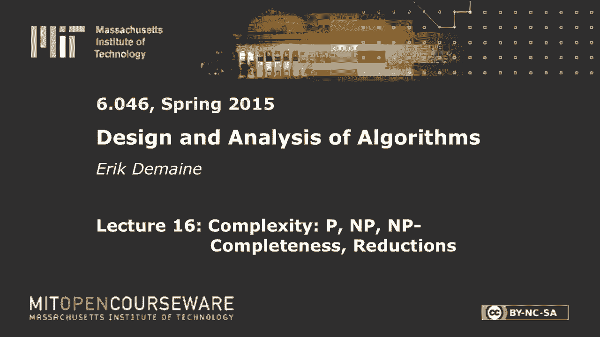

# 数据结构与算法设计：L16：P、NP、NP-完备性、归约

在本节课中，我们将学习计算复杂性理论中的核心概念：P类、NP类、NP-完备性以及归约。我们将通过一系列有趣的例子，从超级马里奥兄弟到拼图游戏，来理解如何证明一个问题是NP-完备的。课程的核心在于理解“归约”——将一个问题的输入转换为另一个问题的等价输入，从而证明问题的计算难度。

## 概述：P与NP

首先，我们回顾P类和NP类的定义。

P类包含所有可以在多项式时间内解决的问题。这里的“多项式时间”指的是运行时间是输入规模n的某个常数次幂，例如n²或n³。这是算法课程中我们主要关注的问题类型。

NP类则包含所有可以在非确定性多项式时间内解决的问题。非确定性计算模型允许计算机“幸运地”在常数时间内猜出正确的解。更实际的理解是，如果一个问题的答案是“是”，那么存在一个多项式大小的“证书”（或证明），并且存在一个多项式时间的验证算法来检查这个证书是否正确。因此，NP问题偏向于“是”的答案。

## 核心概念：NP-完备性

一个问题是NP-完备的，需要满足两个条件：
1.  它属于NP类。
2.  它是NP-难的。

NP-难意味着这个问题至少和NP类中的**每一个**问题一样难。如果一个问题既是NP-难的又属于NP类，那么它就是NP-完备的。

为了证明问题X是NP-难的，我们需要证明NP类中的**任意**问题Y都可以在多项式时间内归约到X。但实践中，我们不需要对每个NP问题都这样做。我们只需从一个已知的NP-完备问题（如3-SAT）出发，证明它可以归约到我们想证明的问题X。因为根据归约的传递性，NP中的所有问题都可以先归约到已知的NP-完备问题，再归约到X。

上一节我们介绍了P、NP和NP-完备性的基本定义，本节中我们来看看如何通过具体的“归约”来证明一个问题是NP-完备的。

## 归约实例：从3-SAT到超级马里奥兄弟

我们将展示如何将著名的NP-完备问题3-SAT归约到游戏“超级马里奥兄弟”的关卡通关问题。

**3-SAT问题**：给定一个由多个子句构成的布尔公式，每个子句是三个文字（变量或其否定）的逻辑或（OR）。问题是，是否存在对变量的真值赋值，使得整个公式为真（即可满足）。

**超级马里奥兄弟问题**：给定一个关卡（广义为单屏无滚动），判断马里奥是否能通关。

以下是构建归约的步骤：

1.  **变量选择小工具**：对于公式中的每个变量，我们构建一个“变量小工具”。马里奥进入后，必须选择向左或向右落下，这分别代表将该变量赋值为“真”或“假”。一旦落下，无法返回，代表赋值不可更改。
2.  **子句满足小工具**：对于每个子句，我们构建一个“子句小工具”。它包含三个问号砖块，分别对应子句中的三个文字。只有当马里奥之前选择的变量赋值使得该文字为“真”时，他才能在对应的路径上撞击砖块，产生一颗“无敌星”。
3.  **关卡遍历与验证**：在设置完所有变量后，马里奥必须遍历所有子句小工具。每个小工具上方有一排火焰障碍。只有持有“无敌星”（即该子句被满足）时，马里奥才能安全通过。因此，马里奥能通关当且仅当存在一个变量赋值满足所有子句（即3-SAT公式可满足）。
4.  **交叉小工具**：在连接变量与子句的“电线”交叉时，需要特殊的“交叉小工具”来确保路径不会意外连通，保证归约的正确性。

通过这个构造，我们将一个3-SAT公式转化成了一个等价的超级马里奥兄弟关卡。因此，超级马里奥兄弟的通关问题是NP-难的。由于给定一个通关路径（即一系列操作）可以在多项式时间内验证，所以它也在NP中，从而是NP-完备的。

## 更多NP-完备问题

接下来，我们利用归约，展示一系列其他有趣的问题也是NP-完备的。

### 三维匹配

**问题描述**：有三个互不相交的集合X、Y、Z，每个集合有n个元素。给定一个允许的三元组集合T ⊆ X × Y × Z。问题是能否从T中选出n个不相交的三元组，覆盖X、Y、Z中的所有元素。

**证明思路**：可以从3-SAT归约到三维匹配。我们为每个变量构造一个“齿轮”状的小工具，它有两种方式覆盖其内部点，分别代表“真”和“假”赋值。为每个子句构造的小工具，则需要至少一个来自变量小工具的“空闲”点才能被覆盖，这对应子句需要至少一个文字为真。通过精心设计点与三元组的对应关系，可以证明三维匹配是NP-完备的。

### 子集和

**问题描述**：给定一个整数集合S和一个目标整数t，问是否存在S的一个子集，其元素之和恰好等于t。

**证明思路**：可以从三维匹配归约到子集和。我们将每个允许的三元组编码成一个很大的整数（在某个大基数B下表示），这个整数在代表该三元组三个成分的位置上为1，其余为0。目标数t则设置为在所有位置上都是1的数。这样，选择一组和为t的数，就等价于选择一组覆盖所有元素且不冲突的三元组。由于这里构造的数字值可能非常大（与输入规模成指数关系），我们称子集和为**弱NP-难**问题。

### 分区

**问题描述**：给定一个正整数集合A，问能否将A划分成两个子集，使得两个子集的元素之和相等。

**证明思路**：子集和可以归约到分区。给定子集和问题实例（集合S和目标t），我们构造一个新的集合A‘ = S ∪ {σ + t, 2σ - t}，其中σ是S中所有元素之和。可以证明，A‘能被平分当且仅当S中存在子集之和为t。因此，分区也是弱NP-完备的。

### 矩形填充与拼图

**矩形填充问题**：给定若干个小矩形和一个目标大矩形，问能否将所有小矩形不重叠地放入大矩形中。

**证明思路**：可以从（强NP-完备的）四划分问题归约到矩形填充。我们将每个整数表示为一组特定长宽的小矩形，目标矩形被划分为四个区域。成功填充等价于将整数集合划分成四个和相等的子集。

**拼图问题**：给定一堆边缘有特定凹凸形状的拼图块和一个目标框，问能否将它们拼合填满目标框。

**证明思路**：可以从矩形填充归约到拼图。通过为矩形填充问题中的每个矩形设计独特的边缘形状，使得它们只能按预定方式拼接，从而将矩形填充问题转化为拼图问题。由于归约过程中产生的拼图块数量是多项式规模的，这证明了拼图是（强）NP-完备的。

## 总结

本节课中我们一起学习了计算复杂性理论的核心内容。我们定义了P类（多项式时间可解）和NP类（多项式时间可验证）。我们深入探讨了NP-完备性的概念：一个问题如果属于NP且是NP-难的，那么它就是NP-完备的。证明NP-难度的关键工具是“归约”——将一个已知的NP-完备问题（如3-SAT）转化为目标问题。

我们通过一系列生动的例子实践了归约：
*   将3-SAT归约到**超级马里奥兄弟**关卡问题。
*   将3-SAT归约到**三维匹配**。
*   将三维匹配归约到**子集和**（弱NP-难）。
*   将子集和归约到**分区**（弱NP-难）。
*   将（强NP-难的）四划分问题归约到**矩形填充**，再归约到**拼图**问题。

这些证明展示了NP-完备性理论的强大与优美，它让我们能够理解从逻辑谜题到经典游戏等众多看似不同问题的内在计算难度本质。掌握归约的思想，是判断问题复杂性和设计高效近似算法的基础。